-   [Problem description](#problem-description)
    -   [Optimization goals](#optimization-goals)
-   [Optimization goal I: Fitting of project data to a defined
    AP](#optimization-goal-i-fitting-of-project-data-to-a-defined-ap)
    -   [Approach](#approach)
    -   [Sub-Model formulation](#sub-model-formulation)
        -   [Reference vs. Query](#reference-vs.-query)
        -   [Min/Max as ramp function](#minmax-as-ramp-function)
    -   [Overall model formulation](#overall-model-formulation)
    -   [Gradient of the model](#gradient-of-the-model)
        -   [Expanding the denominator](#expanding-the-denominator)
        -   [Expanding
            *β**l*, *β**u*](#expanding-beta_lbeta_u)
        -   [Expanding *ϕ*](#expanding-phi)
        -   [Expanding
            *m**q* = 4*c*](#expanding-m_q4c)
    -   [Testing the model](#testing-the-model)
        -   [Half- and full-open tests](#half--and-full-open-tests)
        -   [Swapping Warping Pattern and
            Candidate](#swapping-warping-pattern-and-candidate)
    -   [Regularization](#regularization)
        -   [Regularize extreme supports](#regularize-extreme-supports)
        -   [Regularize extreme
            intervals](#regularize-extreme-intervals)
        -   [Regularize box-bounds](#regularize-box-bounds)
-   [Optimization goal II](#optimization-goal-ii)
    -   [Scoring a loss](#scoring-a-loss)
    -   [Losses with finite upper
        bounds](#losses-with-finite-upper-bounds)
        -   [Area between curves](#area-between-curves)
        -   [Residual sum of squares](#residual-sum-of-squares)
        -   [More simple metrics](#more-simple-metrics)
        -   [Correlation between curves](#correlation-between-curves)
        -   [Ratio between curves’
            arc-lengths](#ratio-between-curves-arc-lengths)
        -   [Jensen–Shannon divergence](#jensenshannon-divergence)
    -   [Match WP against itself](#match-wp-against-itself)
-   [Optimization goal III](#optimization-goal-iii)
    -   [Approach](#approach-1)
    -   [Sub-Model formulation](#sub-model-formulation-1)
        -   [Self-regularization](#self-regularization)
        -   [Gradient of the sub-model](#gradient-of-the-sub-model)
        -   [Testing](#testing)
-   [Other thoughts](#other-thoughts)
-   [References](#references)

In this notebook, we will go back to our initial Fire Drill (FD)
problem, and design models to accomodate it. The goal is to bring
together everything we learned from all the notebooks in between, and to
come up with solutions specifically designed to address the matter.

Problem description
===================

Initially I thought the answer would be using dynamic time Warping, but
it is not suitable for an analytical solution (actually, closed-form
expression). What makes our problem a bit special are the following:

-   **Reference** and **Query** signal have the same support: The FD is
    an AP that spans the entire project, start to finish. Matching must
    be attempted at the very beginning of the data, and is concluded at
    the very end. The query signal is scaled such that the extent of its
    support is the same as the reference’s.
    -   As we will see later, this constraint is optionally relaxed by
        allowing to the query-signal to cover a proper sub-support of
        the reference using open begin-/ and/or -end time warping.
-   All data has to be used: We can apply local time warping to the
    query signal, but nothing can be left out. The warping may even
    result in a length of zero of some intervals, but they must not be
    negative.

Optimization goals
------------------

We have **3** optimization goals for the joint paper/article (each of
them has a dedicated section in this notebook):

-   Fitting of project data to a defined AP (here: the Fire Drill)
-   Validate selection of sub-models andscores; also: calibration of
    scores
-   Averaging the reference pattern over allknown ground truths

Optimization goal I: Fitting of project data to a defined AP
============================================================

This is the primary problem, and we should start with a visualization:

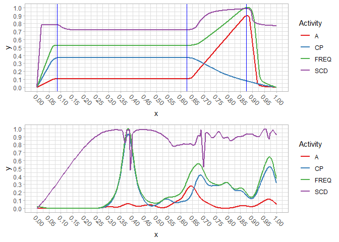

The first plot is the reference pattern, the second is a random project.
All data has already been scaled and normalized, for example, both
supports are the same. We are going to use an entirely new approach to
warp the project data from the 2nd plot the reference data from the
first plot.

Approach
--------

In order to understand this problem, we need to make some statements:

-   The reference pattern is subdivided into intervals by some
    boundaries (blue in the above plot). The data in each such interval
    is considered **constant**. That means, if we were to sample from
    that interval, these samples would always be identical. If we were
    to look at each interval as a function, then it will always show the
    same behavior. Each interval has its own **support**.
-   The first interval starts at 0 and the last interval ends at 1 (we
    always expect that all data has been scaled and translated to
    \[0, 1\] prior to this, to keep things simple).
-   Any and all variables are strictly **positive**, with a co-domain of
    \[0, 1\] as well. We require this for reasons of simplification,
    although negative values would be no problem (but require extra
    effort at this point).
-   An interval’s **length** is never negative. In practice, one may
    even want to define a minimum length for all or for each individual
    interval.
-   An interval’s **offset** is the sum of the lengths of its preceding
    intervals. All intervals’ lengths sum up to 1.

To find the sub-support of the query that best matches a variable (or
many) in an interval, the query signal is translated and scaled. Another
way to think about this is that the query signal is translated and only
valid in the support that starts with the translate, and ends there plus
the length of the current interval. I mention this because this is how
we will begin.

In the above plot, there are **4** intervals, and let’s say we index
them with the parameter *q*. If we were to describe the reference- and
query-signals through the two functions *r*, *f*, and we were given some
boundary *b**q* that delimits the reference-interval, for
*q* = 1 we would get:

$$
\\begin{aligned}
  r=&\\;\\mathbb{R}\\mapsto\\mathbb{R}^m\\;\\land\\;m&gt;0\\text{,}
  \\\\\[1ex\]
  r\_q=&\\;r(\\cdot)\\;\\text{, reference-signal for interval}\\;q,
  \\\\\[1ex\]
  \\text{supp}(r\_q)=&\\;\[0,b\_q)\\;\\text{, the support of}\\;r\_q.
\\end{aligned}
$$

During optimization, the goal is to find the best length for each
interval. Assuming a given vector that contains these four lengths,
**ϑ**(*l*), we get:

$$
\\begin{aligned}
  f=&\\;\\mathbb{R}\\mapsto\\mathbb{R}^n\\;\\land\\;n&gt;0\\text{,}
  \\\\\[1ex\]
  f\_q=&\\;f(\\cdot)\\;\\text{, query-signal for interval}\\;q,
  \\\\\[1ex\]
  \\text{supp}(f\_q)=&\\;\\big\\{\\;x\\in\\mathbb{R}\\;\\rvert\\;x\\geq0\\;\\land\\;x&lt;\\bm{\\vartheta}^{(l)}\_q\\;\\big\\}\\;\\text{, the support of}\\;f\_q.
\\end{aligned}
$$

The supports will almost always differ (especially for *q* &gt; 1). For
the discrete case this may not be important, because the model may
choose to always take the same amount of equidistantly-spaced samples
from the reference- and query-intervals, regardless of the support. This
is essentially the same as scaling and translating the query-support to
be the same as the reference support. This is what would be required for
the continuous case.

The result of the previous definition is an **unchanged** query-signal;
however, we specify its support that *corresponds* to the support of the
current reference interval. In general, to translate (and scale) an
interval from one offset and length to another offset and length, the
expression is:

$$
\\begin{aligned}
  f(x)\\dots&\\;\\text{function to be translated,}
  \\\\\[1ex\]
  f'(x)=&\\;f\\Bigg(\\frac{(x - t\_b) \\times (s\_e - s\_b)}{t\_e - t\_b} + s\_b\\Bigg)\\;\\text{, where}
  \\\\\[1ex\]
  s\_b,s\_e,t\_b,t\_e\\dots&\\;\\text{begin (b) and end (e) of the source- (s) and target-intervals/supports (t).}
\\end{aligned}
$$

We will do some testing with the pattern and data we have, focusing on
the **adaptive** (**A**) variable.

However, notice how we have defined *r*, *f* to map to dimensionalities
of 1 or greater, effectively making them vector-valued:

-   A loss between both functions is concerning a specific *q*-th
    interval, and also usually concerning a specific index in each
    function, e.g.,
    ℒ*q* = (*r**q*(13)(*x*) − *f**q*(4)(*x*))2.
    Each such loss may have its **individual weight** assigned.
-   This concept of being multivariate can be extended to having
    **multiple signals** per *Warping Pattern/Candidate*, too, by simple
    concatenation of the output of two or more such vector-valued
    functions, e.g.,
    *f*(*x*) = *f**a*(1, 2, 3) ⌢ *f**b*(7, 11, 13) ⌢ …,
    where *f**a*, *f**b* are individual
    vector-valued/multivariate Warping Candidates.
-   The dimensionalities of *r*, *f* do not necessarily have to be the
    same: Imagine the case where we compute some loss of one variable of
    the Warping Pattern over the same variable of one or more Warping
    Candidates. Also, as in the previous example, not all of a signal’s
    variables have to be used.

<!-- -->

    ## Scale for 'y' is already present. Adding another scale for 'y', which will
    ## replace the existing scale.

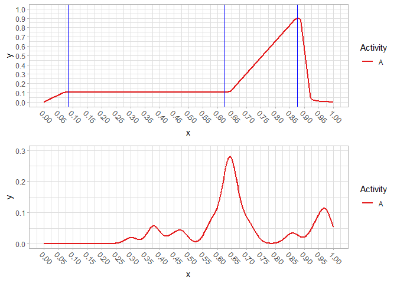

We will do a test with *f**q* and *f*′*q*, and set
*q* to 1 and then to 3. In the first case, no re-definition of *f* is
required. We only need to define where to query-intervals should be
(thus their length).

    # Use these lengths for q=3:
    vt_q3 <- c(0.15, 0.45, 0.1, 0.3)

    a_ref_q3 <- a_ref[a_ref >= bounds[2] & a_ref < bounds[3], ]
    a_query_q3 <- a_query[a_query >= (vt_q3[1] + vt_q3[2]) & a_query < (1 - vt_q3[4]), ]

    r_q3 <- stats::approxfun(x = a_ref_q3$x, y = a_ref_q3$y)
    f_q3 <- stats::approxfun(x = a_query_q3$x, y = a_query_q3$y)

    ggplot() +
      stat_function(fun = r_q3, aes(color = "r_q3")) +
      stat_function(fun = f_q3, aes(color = "f_q3")) +
      xlim(.6, .9)

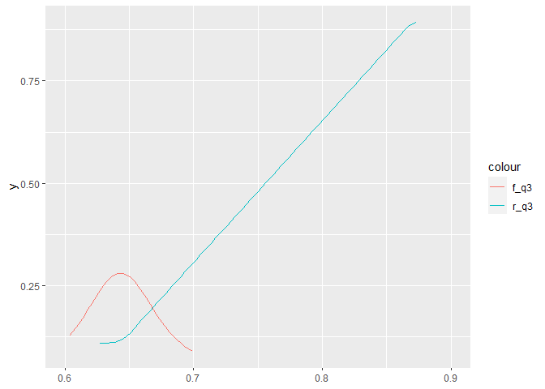

And now we re-define *f* such that it has the same support as `r_q3`:

    f_prime_proto <- function(x, source_b, source_e, target_b, target_e) {
      f((((x - target_b) * (source_e - source_b)) / (target_e - target_b)) + source_b)
    }

    f_q3_prime <- function(x) {
      # These two are where the signal currently is (translation source range)
      phi_q <- vt_q3[1] + vt_q3[2]
      vartheta_q <- vt_q3[3]
      # These two is where we want the signal to be (translation target range)
      # theta_q <- bounds[3] - bounds[2]
      
      source_b <- phi_q
      source_e <- phi_q + vartheta_q
      target_b <- bounds[2]
      target_e <- bounds[3]
      
      f_prime_proto(x, target_b = target_b, target_e = target_e,
                    source_b = source_b, source_e = source_e)
    }

    curve(f_q3_prime, 0, 1)

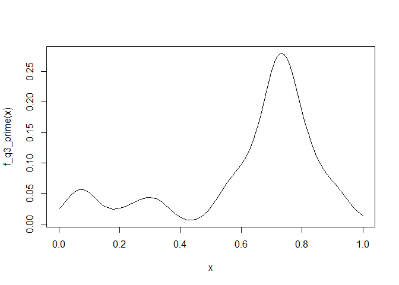

    ggplot() +
      stat_function(fun = r_q3, aes(color = "r_q3")) +
      stat_function(fun = f_q3_prime, aes(color = "f_q3_prime")) +
      geom_vline(xintercept = bounds[2]) +
      geom_vline(xintercept = bounds[3]) +
      xlim(bounds[2:3])

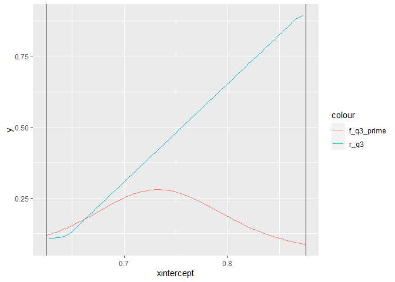

Another test, squeezing *f* into the interval \[0.5, 1\]:

    f_q3_test <- function(x) {
      f_prime_proto(x, source_b = 0, source_e = 1, target_b = .5, target_e = 1)
    }

    f_q3_test2 <- function(x) {
      f_prime_proto(x, source_b = .55, source_e = .7, target_b = 0, target_e = 1)
    }

    curve(f, 0, 1)

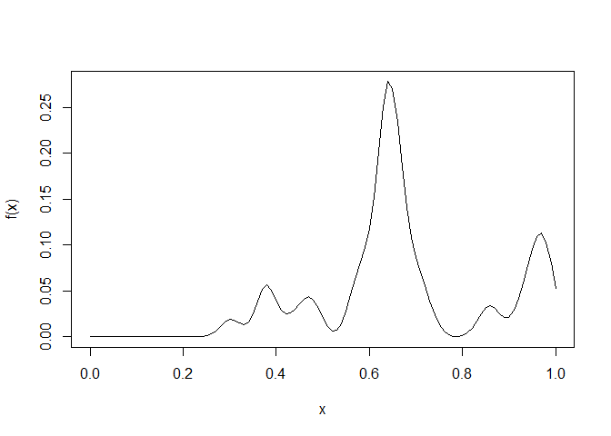

    curve(f_q3_test, 0, 1)

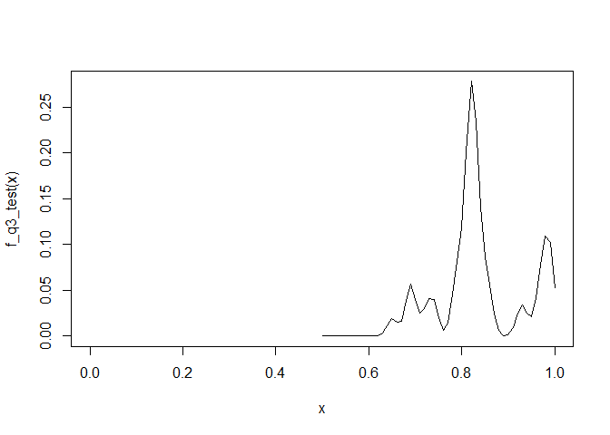

    curve(f_q3_test2, 0, 1)

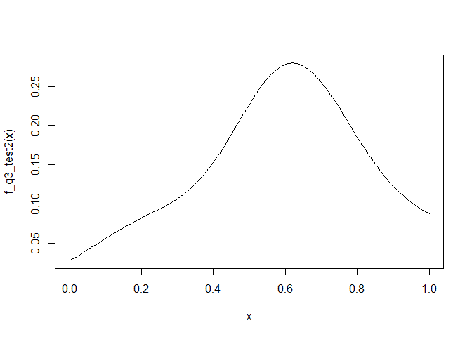

Sub-Model formulation
---------------------

In practice, we want to re-define *f*, such that we scale and translate
it in a way that its support and the reference support perfectly
overlap. This will be done using above expression to derive *f* into
*f*′. Also, we want our model to satisfy additional constraints, without
having to use regularization or (in-)equality constraints. These
constraints are:

-   All intervals must have a length greater than 0 (or any arbitrary
    positive number).
-   The lengths of all intervals must sum up to 1.

During unconstrained optimization, there is no way to enforce these
constraints, but we can build these into our model! To satisfy the first
constraint, we will replace using any *l**q* directly by
max (**λ***q*, *l**q*) (where **λ***q*
is the lower bound for interval *q* and  &gt; 0). This could however
lead to the sum of all such lengths being greater than the extent of the
support. The solution to the second constraint will satisfy this, by
normalizing all lengths using the sum of all lengths. This way, lengths
are converted to ratios. Later, using the *target-extent*, these ratios
are scaled back to actual lengths.

We define the new model with the built-in constraints
(*m**q**c*):

$$
\\begin{aligned}
  \\bm{\\theta}^{(b)}\\;\\dots&\\;\\text{ordered vector of boundaries, where the first and last boundary together}
  \\\\\[0ex\]
  &\\;\\text{represent the support of the signal they subdivide,}
  \\\\\[1ex\]
  b\\dots&\\;\\text{the begin (absolute offset) of the first source-interval (usually}\\;0\\text{),}
  \\\\\[1ex\]
  e\\dots&\\;\\text{the end (absolute offset) of the last source-interval (usually}\\;1\\text{), also}\\;e&gt;b\\text{,}
  \\\\\[1ex\]
  \\gamma\_b,\\gamma\_e,\\gamma\_d\\dots&\\;\\text{absolute min/max for}\\;b,e\\;\\text{and min-distance between them,}
  \\\\\[1ex\]
  &\\;\\text{where}\\;\\gamma\_d\\geq 0\\;\\land\\;\\gamma\_b+\\gamma\_d\\leq\\gamma\_e\\;\\text{,}
  \\\\\[1ex\]
  \\beta\_l=&\\;\\min{\\Big(\\gamma\_e-\\gamma\_d,\\max{\\big(\\gamma\_b, \\min{(b,e)}\\big)}\\Big)}\\;\\text{, lower boundary as of}\\;b,e\\text{,}
  \\\\\[1ex\]
  \\beta\_u=&\\;\\max{\\Big(\\gamma\_b+\\gamma\_d,\\min{\\big(\\gamma\_e, \\max{(b,e)}\\big)}\\Big)}\\;\\text{, upper boundary as of}\\;b,e\\text{,}
  \\\\\[1ex\]
  \\bm{\\lambda}\\dots&\\;\\text{vector with minimum lengths for each interval,}\\;\\forall\\,\\bm{\\lambda}\_q\\geq 0\\text{,}
  \\\\\[1em\]
  l\_q\\dots&\\;\\text{the length of the }q\\text{-th source-interval,}
  \\\\\[1ex\]
  l'\_q=&\\;\\max{\\big(\\bm{\\lambda}\_q,\\left\\lvert l\_q\\right\\rvert\\big)}\\;\\text{, where}\\;\\left\\lvert l\_q\\right\\rvert\\equiv\\max{\\big(-l\_q,l\_q\\big)}\\equiv\\mathcal{R}(2\\times l\_q)-l\_q\\text{,}
  \\\\\[0ex\]
  &\\;\\text{(the corrected (positive) interval-length that is strictly}\\;\\geq\\bm{\\lambda}\_q\\text{),}
  \\\\\[1ex\]
  \\psi=&\\;\\sum\_{i=1}^{\\max{(Q)}}\\,l'\_i\\equiv \\bm{l'}^\\top\\hat{\\bm{u}}\\;\\text{, the sum used to normalize each and every}\\;q\\text{-th}\\;l\\text{,}
  \\\\\[0ex\]
  &\\;\\text{(}\\hat{\\bm{u}}\\;\\text{is the unit-vector),}
  \\\\\[1ex\]
  l\_q^{(c)}=&\\;\\frac{l'\_q}{\\psi}\\times(\\beta\_u-\\beta\_l)\\;\\text{, corrected, normalized and re-scaled version of}\\;l\_q\\text{,}
  \\\\\[1ex\]
  \\phi\_q\\equiv&\\;\\begin{cases}
    0,&\\text{if}\\;q=1,
    \\\\
    \\sum\_{i=1}^{q-1}\\,l\_i^{(c)},&\\text{otherwise}
  \\end{cases}\\;,
  \\\\\[1ex\]
  &\\;\\text{(the sum of the lengths of all corrected preceding intervals).}
\\end{aligned}
$$

With all these, we can now formulate the sub-model using the previously
used parameters
*s**b*, *s**e*, *t**b*, *t**e*
for translation and scaling of one interval (the source) to another
interval (the target):

$$
\\begin{aligned}
  s\_b^{(q)}=&\\;\\beta\_l+\\phi\_q\\;\\text{, and}
  \\\\\[1ex\]
  s\_e^{(q)}=&\\;s\_b^{(q)}+l\_q^{(c)}\\;\\text{, begin- and end-offset of the }q\\text{-th source-interval,}
  \\\\\[1ex\]
  t\_b^{(q)}=&\\;\\bm{\\theta}^{(b)}\_q\\;\\text{, and}
  \\\\\[1ex\]
  t\_e^{(q)}=&\\;\\bm{\\theta}^{(b)}\_{q+1}\\;\\text{, begin- and end-offset of the }q\\text{-th target-interval,}
  \\\\\[1ex\]
  \\delta\_q^{(t)}=&\\;t\_e^{(q)}-t\_b^{(q)}\\;\\text{, the extent of the }q\\text{-th target-interval,}
  \\\\\[1ex\]
  m\_q^c\\Big(f,x,t\_b^{q},l\_q^{(c)},\\delta\_q^{(t)},s\_b^{(q)}\\Big)=&\\;f\\Bigg(\\frac{\\Big(x-t\_b^{(q)}\\Big)\\times l\_q^{(c)}}{\\delta\_q^{(t)}}+s\_b^{(q)}\\Bigg)\\;\\text{, with all non-constants expanded:}
  \\\\\[1ex\]
  =&\\;f\\Bigg(\\overbrace{\\Bigg\[\\overbrace{\\min{\\Big(\\gamma\_e-\\gamma\_d,\\max{\\big(\\gamma\_b, \\min{(b,e)}\\big)}\\Big)}}^{\\beta\_l}+\\overbrace{\\begin{cases}
    0,&\\text{if}\\;q=1,
    \\\\
    \\sum\_{i=1}^{q-1}\\,l\_i^{(c)},&\\text{otherwise}
  \\end{cases}}^{\\phi\_q}\\Bigg\]}^{s\_b^{(q)}}
  \\\\\[0ex\]
  &\\;\\;\\;\\;\\;\\;+\\Big(x-t\_b^{(q)}\\Big)\\times{\\delta\_q^{(t)}}^{-1}\\times \\overbrace{\\max{\\Big(\\bm{\\lambda}\_q,\\mathcal{R}(2\\times l\_q)-l\_q\\Big)}\\times\\Bigg\[\\sum\_{i=1}^{\\max{(Q)}}\\,l'\_i\\Bigg\]^{-1}}^{\\text{(recall}\\;l\_q^{(c)}=\\frac{l'\_q}{\\psi}\\times(\\beta\_u-\\beta\_l)\\text{, here we got}\\;l'\_q\\times\\psi^{-1}\\text{)}}
  \\\\\[0ex\]
  &\\;\\;\\;\\;\\;\\;\\times\\bigg(\\overbrace{\\max{\\Big(\\gamma\_b+\\gamma\_d,\\min{\\big(\\gamma\_e, \\max{(b,e)}\\big)}\\Big)}}^{\\beta\_u}-\\overbrace{\\min{\\Big(\\gamma\_e-\\gamma\_d,\\max{\\big(\\gamma\_b, \\min{(b,e)}\\big)}\\Big)}}^{\\beta\_l}\\bigg)\\Bigg)\\;\\text{.}
\\end{aligned}
$$

The model *m**q**c* now satisfies these
properties:

-   Each interval has a length greater than or equal to
    **λ***q* (which must be strictly positive; a length of
    zero however is allowed).
-   The first interval begins at *β**l*, the last interval
    ends at *β**u* (these parameters are the absolute
    begin/end of the target-intervals, and hence apply to where onto the
    reference the query will be mapped to). These parameters can either
    be constant or learned during optimization, effectively allowing
    open/closed begin- and/or -end time warping.
-   Each interval begins exactly after its predecessor, such that there
    are no overlaps. Intervals are seamlessly strung together.
-   The sum of the lengths of all intervals is normalized and then
    re-scaled using *ϕ*, considering the constraints of
    *γ**d* and the minimum length of each *q*-th interval
    (using its corresponding **λ***q*).

### Reference vs. Query

Thus far, we have made the difference between these two notions. The
implicit assumption thus far was, that the reference is constant, i.e.,
once given as a pattern, it is never altered, and the query is warped to
it. I came across the important difference while thinking about closed-
vs. open -begin and/or -end time warping: In the closed case, the
**whole** query is warped onto the **whole** reference, i.e., both
signals have to be used to their full extent. If, however, the begin or
end (or both) are open, only a portion of the query is used to match
still the entire reference. So, not only is the reference constant, it
also has to be matched wholly, i.e., all of its reference-intervals need
to be used. This raises two important points.

First, regarding the differences between both signals during warping, we
should propose more appropriate names. I suggest **“Warping Pattern”**
for the constant signal that has to be used in its entirety, and
**“Warping Candidate”** for the signal that is translated and scaled to
be closest to the Warping Pattern.

Second, in some cases it may be useful **not** to use the entire Warping
Pattern. In this case, both signals can simply be swapped with each
other, and a non-closed model is fit. After fitting, the warping path is
inverted. Also, this is how DTW works, one signal has to be mapped in
full. This flipping case is useful to find a sub-support of the Warping
Pattern within the Warping Candidate.

### Min/Max as ramp function

Note that we define min , max  in terms of the ramp-function and its
derivative, the Heaviside step function.

$$
\\begin{aligned}
  \\max{(x,y)}\\equiv&\\;\\mathcal{R}(y-x)+x\\;\\text{, with gradient}
  \\\\\[1ex\]
  \\nabla\\,\\mathcal{R}(y-x)+x=\\Bigg\[\\frac{\\partial\\,\\mathcal{R}(\\cdot)}{\\partial\\,x},\\frac{\\partial\\,\\mathcal{R}(\\cdot)}{\\partial\\,y}\\Bigg\]=&\\;\\Bigg\[\\mathcal{H}(x-y)\\;,\\;\\mathcal{H}(y-x)\\Bigg\]\\;\\text{, also, we define}\\;\\min\\;\\text{as:}
  \\\\\[1ex\]
  \\min{(x,y)}=&\\;\\,y-\\mathcal{R}(y-x)\\;\\text{, with gradient}
  \\\\\[1ex\]
  \\nabla\\,y-\\mathcal{R}(y-x)=\\Bigg\[\\frac{\\partial\\,\\mathcal{R}(\\cdot)}{\\partial\\,x},\\frac{\\partial\\,\\mathcal{R}(\\cdot)}{\\partial\\,y}\\Bigg\]=&\\;\\Bigg\[\\mathcal{H}(y-x)\\;,\\;\\mathcal{H}(x-y)\\Bigg\]\\;\\text{.}
\\end{aligned}
$$

Overall model formulation
-------------------------

Now that we have sub-models that are able to transform a section of the
query-signal for a given a section of the reference-signal, the logical
next step is to define the entire (or overall) model in terms of all
intervals. The following is in large parts identical to how we defined
it in the notebook *“Boundary Time Warping (final, update)”*.

It is important to once more recall the mechanics of this suggested
model:

-   The reference signal is segmented into two or more intervals, each
    with a length  &gt; 0. This segmentation is done using a given
    vector of *reference-boundaries*.
    -   These intervals are constant, and never changed afterwards. For
        each variable in each reference-interval, we have a constant
        segment of the corresponding reference-signal (continuous case),
        or a constant vector of data.
-   Each *q*-th reference-interval is associated with a *q*-th
    sub-model. Each such sub-model has access to the whole query-signal
    and its gradient, and the goal is to translate and scale the
    query-signal to **best-fit** the current reference interval (this
    requires a loss).
    -   The sub-models are designed in a way that the intervals they
        cover cannot overlap and connect seamlessly, among other
        criteria (see above).

The input to the overall model is, among the signals, a set of
reference- and query-boundaries, which are transformed into vectors of
interval lengths. Albeit defined above with the sub-models, the
parameters
*b*, *e*, *γ**b*, *γ**e*, *γ**d* are
parameters of the overall model. In practice, it may be more or less
convenient to work with boundaries, and internally the overall model
uses lengths/ratios, and an absolute offset for the first interval. Both
of these concepts are convertible to each other. In the following, we
start with a definition that uses boundaries, and then transform them to
lengths and an offset.

$$
\\begin{aligned}
  \\mathsf{T}^{(l)}\\Big(\\bm{\\tau}^{(b)}\\Big)=&\\;\\Big\\{\\;l\_1=\\bm{\\tau}^{(b)}\_2-\\bm{\\tau}^{(b)}\_1,\\;\\dots,\\;l\_{\\left\\lvert\\bm{\\tau}\\right\\rvert-1}=\\bm{\\tau}^{(b)}\_{\\left\\lvert\\bm{\\tau}\\right\\rvert}-\\bm{\\tau}^{(b)}\_{\\left\\lvert\\bm{\\tau}\\right\\rvert-1}\\;\\Big\\}\\;\\text{,}
  \\\\\[0ex\]
  &\\;\\text{(boundaries-to-lengths transform operator),}
  \\\\\[1ex\]
  \\mathcal{X}^{(\\text{WP})}=&\\;\\Big\[\\min{\\bm{\\theta}^{(b)}}\\,,\\,\\max{\\bm{\\theta}^{(b)}}\\Big\]\\;\\text{, the support of the Warping Pattern's signal,}
  \\\\\[1ex\]
  \\bm{\\vartheta}^{(l)}=\\mathsf{T}^{(l)}\\Big(\\bm{\\vartheta}^{(b)}\\Big)\\;\\dots&\\;\\text{the query-intervals as lengths and boundaries,}
  \\\\\[1ex\]
  \\mathcal{X}^{(\\text{WC})}=&\\;\\Big\[\\beta\_l\\,,\\,\\beta\_u\\Big\]\\;\\text{, the support of the Warping Candidate's signal,}
  \\\\\[1ex\]
  q\\in Q;\\;Q=&\\;\\Big\\{1,\\;\\dots\\;,\\left\\lvert\\bm{\\theta}^{(b)}\\right\\rvert-1\\Big\\}\\;\\text{, where}\\;Q\\;\\text{is ordered low to high, i.e.,}\\;q\_i\\prec q\_{i+1}\\text{,}
  \\\\\[0ex\]
  &\\;\\text{(boundaries converted to intervals),}
  \\\\\[1ex\]
  \\mathcal{I}^{(\\text{WP})},\\mathcal{I}^{(\\text{WC})}\\;\\dots&\\;\\text{the set of Warping Pattern- and Candidate-intervals with length}\\;\[\\max{Q}\]\\text{,}
  \\\\\[0ex\]
  &\\;\\text{with each Warping Candidate-interval delimited by}
  \\\\\[0ex\]
  \\mathbf{x}\_q^{(\\text{WC})}\\subset\\mathcal{X}^{(\\text{WC})}=&\\;\\Big\[\\bm{\\vartheta}^{(b)}\_q\\,,\\,\\bm{\\vartheta}^{(b)}\_{q+1}\\Big)\\;\\text{, for the first}\\;Q-1\\;\\text{intervals,}
  \\\\\[0ex\]
  =&\\;\\Big\[\\bm{\\vartheta}^{(b)}\_q\\,,\\,\\bm{\\vartheta}^{(b)}\_{q+1}\\Big\]\\;\\text{, for the last interval; }
  \\\\\[0ex\]
  &\\;\\text{proper sub-supports for model}\\;m\_q\\;\\text{and its interval}\\;\\mathbf{x}\_q^{(\\text{WC})}\\text{, such that}
  \\\\\[0ex\]
  &\\;\\mathbf{x}\_q^{(\\text{WC})}\\prec\\mathbf{x}\_{q+1}^{(\\text{WC})}\\;\\text{, i.e., sub-supports are ordered,}
  \\\\\[1ex\]
  \\mathbf{y}\_q^{(\\text{WP})}=&\\;r\\Big(I\_q^{(\\text{WP})}\\Big)\\;\\text{, the reference data for the}\\;q\\text{-th interval,}
  \\\\\[1ex\]
  \\mathbf{y}=&\\;\\Big\\{\\;\\mathbf{y}\_1^{(\\text{WP})}\\,\\frown\\,\\dots\\,\\frown\\,\\mathbf{y}\_q^{(\\text{WP})}\\;\\Big\\},\\;\\forall\\,q\\in Q\\;\\text{.}
\\end{aligned}
$$

Likewise, we can obtain $\\hat{\\mathbf{y}}\_q^{(\\text{WC})}$ and
concatenate those by calling each sub-model. During optimization, The
vector of query-interval-lengths, **ϑ**(*l*), is altered. If
the model allows either or both, open begin or end, then these
parameters are altered, too.

$$
\\begin{aligned}
  \\mathbf{\\hat{y}}=\\mathsf{M}\\Big(r,f,\\bm{\\theta}^{(b)},\\bm{\\vartheta}^{(l)},&b,e,\\gamma\_b,\\gamma\_e,\\gamma\_d,\\bm{\\lambda}\\Big)=
  \\\\\[1ex\]
  \\Big\\{\\;&m^c\_1(\\cdot)\\,\\frown\\,\\dots\\,\\frown\\,m^c\_q\\Big(f,\\mathbf{x}^{(\\text{WP})}\_q,t\_b^{q},l\_q^{(c)},\\delta\_q^{(t)},s\_b^{(q)}\\Big)\\;\\Big\\},\\;\\forall\\,q\\in Q
\\end{aligned}
$$

Instead of returning a discrete vector for each sub-model,
**ŷ***q*, in practice we probably want to return a tuple with
the sub-model function, the support of it, as well as the relative
length of its interval, i.e.,
⟨*m**q**c*, supp(*q*), *l**q*rel⟩.
The advantage is, that any loss function can decide how to sample from
this function, or even do numerical integration.

Gradient of the model
---------------------

**ATTENTION**: I had previously fixed an error in the model formulation,
so that this entire section needs to be reworked. While some parts are
still correct, some are not!

We have previously shown the sub-model with built-in constraints,
*m**q**c*. We have quite many
min , max -expressions and dynamically-long sums in our model, and for a
symbolic solution, we suggest to expand all terms to create a sum, where
each term can be derived for separately. Before we get there, however,
it makes sense to derive some of the recurring expressions, so that we
can later just plug them in.

It is important to create a fully-expanded version of the model
*m**q**c*, to better understand its gradient.
Fully expanded, the model *m**q**c* is given as:

$$
\\begin{aligned}
  m\_q^c(\\dots)=f\\Bigg(s\_b^{(q)}\\;+\\;&\\bigg(\\delta\_q
  \\\\\[1ex\]
  &\\times\\bigg(x-\\overbrace{\\min{\\Big(\\gamma\_e-\\gamma\_d,\\max{\\big(\\gamma\_b, \\min{(b,e)}\\big)}\\Big)}}^{\\beta\_l}-\\overbrace{\\Big(\\max{(\\bm{\\lambda}\_1,l\_1)}+\\;\\dots\\;+\\max{(\\bm{\\lambda}\_{q-1},l\_{q-1})}\\Big)}^{\\phi\_q\\;\\text{(sum of all preceding intervals' lengths;}\\;0\\;\\text{if}\\;q=1\\text{)}}\\bigg)
  \\\\\[1ex\]
  &\\times\\overbrace{\\Bigg(\\overbrace{\\max{\\Big(\\gamma\_b+\\gamma\_d,\\min{\\big(\\gamma\_e, \\max{(b,e)}\\big)}\\Big)}}^{\\beta\_u}-\\overbrace{\\min{\\Big(\\gamma\_e-\\gamma\_d,\\max{\\big(\\gamma\_b, \\min{(b,e)}\\big)}\\Big)}}^{\\beta\_l}\\Bigg)}^{\\phi^{(e)}\\;\\text{(extent of}\\;\\phi\\text{)}}
  \\\\\[1ex\]
  &\\times\\overbrace{\\max{\\Big(\\gamma\_d,\\;\\max{(\\bm{\\lambda}\_1,l\_1)}+\\;\\dots\\;+\\max{(\\bm{\\lambda}\_{\\max{(Q)}},l\_{\\max{(Q)}})}\\Big)}}^{\\phi^{(s)}\\;\\text{(scale of}\\;\\phi\\text{; sum of all intervals' minimum lengths)}}
  \\\\\[1ex\]
  &\\times\\max{\\big(\\bm{\\lambda}\_q,l\_q\\big)}^{-1}\\bigg)\\Bigg)
\\end{aligned}
$$

In the remainder of this section, we will step-wise produce a gradient
of the open begin- and -end model *m**q* = 4*c*
(meaning that there is a gradient for *b*, *e*, too). The reason to use
*q* = 4 is simple: This guarantees that *ϕ**q* is not zero
(and that we can effortlessly see what would happen if *q* = 1), and the
*ϕ* is not zero, either. Recall the overall model, and how it is
composed of these sub-models. If we have four intervals, we get for
sub-models. The difference in these sub-models lies in
*ϕ**q*, which is different for every *q*-th sub-model (*ϕ* is
the same).

The gradient of the overall model has “categories”, meaning that partial
derivation for some of the parameters is very similar:

-   Derivation for *b* or *e*: This is category 1, and affects all terms
    that use *β**l*, *β**u*.
-   Derivation for any *l**r*, *r* &lt; *q*: Category 2, this
    mainly affects *ϕ* and *ϕ**q*.
-   Derivation for the current *l**q*: Category 3, affects
    the denominator and *ϕ*.

### Expanding the denominator

The denominator for the product/fraction given to *f* is
max (**λ****q**, *l**q*) − 1 (the last
factor in the above expansion). It can only be differentiated for
*l**q*, as all **λ** are constant:

$$
\\begin{aligned}
  \\max{(\\bm{\\lambda}\_q,l\_q)}^{-1}=&\\;\\Big(\\mathcal{R}(l\_q-\\bm{\\lambda}\_q)+\\bm{\\lambda}\_q\\Big)^{-1}\\;\\text{, with derivative for}\\;l\_q
  \\\\\[1ex\]
  \\frac{\\partial\\,\\max{(\\bm{\\lambda}\_q,l\_q)}^{-1}}{\\partial\\,l\_q}=&\\;\\frac{\\mathcal{H}(l\_q-\\bm{\\lambda}\_q)}{\\Big(\\mathcal{R}(l\_q-\\bm{\\lambda}\_q)+\\bm{\\lambda}\_q\\Big)^2}
\\end{aligned}
$$

### Expanding *β**l*, *β**u*

We also should expand *β**l*, *β**u* and do the
substitutions for our min , max  definitions, so that we can derive our
model without having to check conditions later:

$$
\\begin{aligned}
  \\beta\_l=&\\;\\overbrace{\\min{\\Big(\\gamma\_e-\\gamma\_d,\\overbrace{\\max{\\big(\\gamma\_b, \\overbrace{\\min{(b,e)}}^{s\_2=e-\\mathcal{R}(e-b)}\\big)}\\Big)}^{s\_1=\\mathcal{R}(s\_2-\\gamma\_b)+\\gamma\_b}}}^{\\beta\_l=s\_1-\\mathcal{R}(s\_1-(\\gamma\_e-\\gamma\_d))}\\;\\text{, rearranged as}
  \\\\\[1ex\]
  =&\\;\\overbrace{\\mathcal{R}(\\overbrace{e-\\mathcal{R}(e-b)}^{s\_2}-\\gamma\_b)+\\gamma\_b}^{s\_1}-\\mathcal{R}(\\overbrace{\\mathcal{R}(\\overbrace{e-\\mathcal{R}(e-b)}^{s\_2}-\\gamma\_b)+\\gamma\_b}^{s\_1}-(\\gamma\_e-\\gamma\_d))\\;\\text{, with gradient}
  \\\\\[1ex\]
  \\bigg\[\\frac{\\partial\\,\\beta\_l}{\\partial\\,b},\\frac{\\partial\\,\\beta\_l}{\\partial\\,e}\\bigg\]=&\\bigg\[\\;-\\mathcal{H}(e-b)\\times\\mathcal{H}\\big(-\\mathcal{R}(e-b)-\\gamma\_b+e\\big)\\times\\Big(\\mathcal{H}\\big(\\mathcal{R}(-\\mathcal{R}(e-b)-\\gamma\_b+e)+\\gamma\_b-\\gamma\_e-\\gamma\_d\\big)-1\\Big),
  \\\\\[0ex\]
  &\\;\\;\\;\\;\\Big(\\mathcal{H}\\big(-\\mathcal{R}(e-b)-\\gamma\_b+e\\big)-1\\Big)\\times\\Big(e\\times\\mathcal{H}\\Big(\\mathcal{R}\\big(-\\mathcal{R}(e-b)-\\gamma\_b+e\\big)+\\gamma\_b-\\gamma\_e+\\gamma\_d\\Big)-1\\Big)\\;\\bigg\]\\;\\text{.}
\\end{aligned}
$$

Since we get a lot of Heaviside step functions in these products,
evaluation can be stopped early if the result of any is 0. Here we do
the same for *β**u*:

$$
\\begin{aligned}
  \\beta\_u=&\\;\\overbrace{\\max{\\Big(\\gamma\_b+\\gamma\_d,\\overbrace{\\min{\\big(\\gamma\_e,\\overbrace{\\max{(b,e)}\\big)}^{s\_2=\\mathcal{R}(e-b)+b}}\\Big)}^{s\_1=s\_2-\\mathcal{R}(s\_2-\\gamma\_e)}}}^{\\beta\_u=\\mathcal{R}(s\_1-(\\gamma\_b+\\gamma\_d))+(\\gamma\_b+\\gamma\_d)}\\;\\text{, rearranged as}
  \\\\\[1ex\]
  =&\\;\\mathcal{R}(\\overbrace{\\overbrace{\\mathcal{R}(e-b)+b}^{s\_2}-\\mathcal{R}(\\overbrace{\\mathcal{R}(e-b)+b}^{s\_2}-\\gamma\_e)}^{s\_1}-(\\gamma\_b+\\gamma\_d))+(\\gamma\_b+\\gamma\_d)\\;\\text{, with gradient}
  \\\\\[1ex\]
  \\bigg\[\\frac{\\partial\\,\\beta\_u}{\\partial\\,b},\\frac{\\partial\\,\\beta\_u}{\\partial\\,e}\\bigg\]=&\\bigg\[\\;\\big(\\mathcal{H}(e-b)-1\\big)\\times\\Big(\\mathcal{H}\\big(\\mathcal{R}(e-b)+b-\\gamma\_e\\big)-1\\Big)
  \\\\\[0ex\]
  &\\;\\;\\;\\;\\;\\;\\;\\;\\times\\mathcal{H}\\Big(-\\mathcal{R}\\big(\\mathcal{R}(e-b)+b-\\gamma\_e\\big)+\\mathcal{R}(e-b)+b-\\gamma\_b-\\gamma\_d\\Big),
  \\\\\[0ex\]
  &\\;\\;\\;\\;e-\\mathcal{H}(-\\mathcal{R}(\\mathcal{R}(e-b)+b-\\gamma\_e)+\\mathcal{R}(e-b)+b-\\gamma\_b-\\gamma\_d)\\;\\bigg\]\\;\\text{.}
\\end{aligned}
$$

### Expanding *ϕ*

Recall the definition of
$\\phi=(\\beta\_u-\\beta\_l)\\times\\max{\\Bigg(\\gamma\_d,\\Bigg\[\\sum\_{j=1}^{\\max{(Q)}}\\,\\max{(\\bm{\\lambda}\_j,l\_j)}\\Bigg\]\\Bigg)}$.

As for the final expansion, we want to expand the denominator and *ϕ*
together, i.e.,
*ϕ* × max (**λ****q**, *l**q*) − 1. All
these expansions will lead to very large expressions, and we are
starting here to add substitution letters. The expansion with parts
*j*, *k* is:

$$
\\begin{aligned}
  f\\Big(s\_b^{(q)}+\\Big\[\\;\\dots\\;\\times&\\overbrace{\\phi\\times\\max{(\\bm{\\lambda\_q},l\_q)}^{-1}}^{\\text{(will become}\\;\[j-k\]\\text{ after expansion)}}\\;\\Big\]\\Big)
  \\\\\[1ex\]
  f\\Big(s\_b^{(q)}+\\Big\[\\;\\dots\\;\\times&\\Big(\\beta\_u\\times\\max{(\\bm{\\lambda\_q},l\_q)}^{-1}-\\beta\_l\\times\\max{(\\bm{\\lambda\_q},l\_q)}^{-1}\\Big)\\times\\max{(\\gamma\_d,\\max{(\\bm{\\lambda}\_1,l\_1)}+\\dots+\\max{(\\bm{\\lambda}\_4,l\_4)})}
  \\\\\[1ex\]
  f\\Big(s\_b^{(q)}+\\Big\[\\;\\dots\\;\\times&\\Bigg(\\overbrace{\\bigg(\\beta\_u\\times\\max{(\\bm{\\lambda\_q},l\_q)}^{-1}\\times\\overbrace{\\max{(\\gamma\_d,\\max{(\\bm{\\lambda}\_1,l\_1)}+\\dots+\\max{(\\bm{\\lambda}\_4,l\_4)})}\\bigg)}^{\\phi^{(s)}}}^{j}
  \\\\\[0ex\]
  &\\;\\;\\;\\;-\\overbrace{\\bigg(\\beta\_l\\times\\max{(\\bm{\\lambda\_q},l\_q)}^{-1}\\times\\overbrace{\\max{(\\gamma\_d,\\max{(\\bm{\\lambda}\_1,l\_1)}+\\dots+\\max{(\\bm{\\lambda}\_4,l\_4)})}\\bigg)}^{\\phi^{(s)}}}^{k}\\Bigg)
\\end{aligned}
$$

Previously, we split *ϕ* into *ϕ*(*e*) and
*ϕ*(*s*), which represent the portions *extent* and *scale*
of it. The extent only consists of
(*β**u* − *β**l*), and we have already derived
them. The scale expression is a nested max  with a summation inside,
that affects ∀ *l*, regardless of what *q* equals.

$$
\\begin{aligned}
  \\phi^{(s)}=&\\;\\max{\\Bigg(\\gamma\_d,\\Bigg\[\\sum\_{i=1}^{\\max{(Q)}}\\,\\max{(\\bm{\\lambda}\_i,l\_i)}\\Bigg\]\\Bigg)}
  \\\\\[1ex\]
  =&\\;\\max{\\Big(\\gamma\_d,\\max{(\\bm{\\lambda}\_1,l\_1)}+\\dots+\\max{(\\bm{\\lambda}\_4,l\_4)}\\Big)}\\;\\text{, (for}\\;q=4\\text{),}
  \\\\\[1ex\]
  =&\\;\\overbrace{\\mathcal{R}\\Big(\\Big\[\\;\\overbrace{\\mathcal{R}(l\_1-\\bm{\\lambda}\_1)+\\bm{\\lambda}\_1}^{\\text{(first }\\max\\text{ of summation)}}+\\;\\dots\\;+\\overbrace{\\mathcal{R}(l\_4-\\bm{\\lambda}\_4)+\\bm{\\lambda}\_4}^{\\text{(}n\\text{-th }\\max\\text{ of summation)}}\\;\\Big\]-\\gamma\_d\\Big)+\\gamma\_d}^{\\text{(outer }\\max\\text{; recall that }\\max{(x,y)=\\mathcal{R}(y-x)+x}\\text{)}}\\;\\text{.}
\\end{aligned}
$$

In the above expansion, *γ**d* is a constant defined at
initialization time, and the same is true for **λ**. However,
*ϕ*(*s*) will appear in each part of the model as we see
later, and its gradient is sensitive ∀ *l*, i.e., not just for, e.g.,
*l**q* or ∀ *l**r*, *r* &lt; *q*. However, since
it is the summation that will be affected, and since it does the same
∀ *l*, the gradient, conveniently, will be the same for each.

$$
\\begin{aligned}
  \\nabla\\,\\phi^{(s)}=&\\;\\frac{\\partial\\,\\phi^{(s)}}{\\partial\\,l\_q,\\forall\\,q\\in Q}\\;\\text{,}
  \\\\\[1ex\]
  =&\\;\\mathcal{H}\\Big(l\_q-\\bm{\\lambda}\_q\\Big)\\times \\mathcal{H}\\Big(\\Big\[\\;\\overbrace{\\mathcal{R}(l\_1-\\bm{\\lambda}\_1)+\\bm{\\lambda}\_1+\\;\\dots\\;+R(l\_4-\\bm{\\lambda}\_4)+\\bm{\\lambda}\_4}^{\\sum\_{i=1}^{\\max{(Q)}}\\,\\max{(\\bm{\\lambda}\_i,l\_i)}}\\;\\Big\]-\\gamma\_d\\Big)\\;\\text{.}
\\end{aligned}
$$

### Expanding *m**q* = 4*c*

The goal is to fully expand the current sub-model into a big sum, where
we can effortlessly derive each term separately. We also have now all of
the sub-expressions and their partial gradient. Here we continue to
assign substitution letters so that we can derive the model more easily.

$$
\\begin{aligned}
  m\_{q=4}^c=&\\;f\\bigg(s\_b^{(q)}+\\frac{(x-\\beta\_l-\\phi\_q)\\times\\delta\_q\\times\\phi}{\\max{(\\bm{\\lambda\_q},l\_q)}}\\bigg)
  \\\\\[1ex\]
  =&\\;f\\bigg(s\_b^{(q)}+\\frac{(\\delta\_qx-\\delta\_q\\beta\_l-\\delta\_q\\phi\_q)\\times\\phi}{\\max{(\\bm{\\lambda\_q},l\_q)}}\\bigg)
  \\\\\[1ex\]
  =&\\;f\\Big(s\_b^{(q)}+\\Big\[\\;\\overbrace{\\delta\_qx-\\delta\_q\\beta\_l-\\overbrace{\\delta\_q\\max{(\\bm{\\lambda\_1},l\_1)}-\\delta\_q\\max{(\\bm{\\lambda\_2},l\_2)}-\\delta\_q\\max{(\\bm{\\lambda\_3},l\_3)}}^{\\phi\_{q=4}}}^{(a-b-c-d-e)}\\;\\times\\overbrace{\\phi\\times\\max{(\\bm{\\lambda\_q},l\_q)}^{-1}}^{(j-k)}\\;\\Big\]\\Big)
  \\\\
  \\vdots
  \\\\
  =&\\;f\\Big(s\_b^{(q)}+aj-ak-bj+bk-cj+ck-dj+dk-ej+ek\\Big)\\;\\text{.}
\\end{aligned}
$$

The final expression for our model is now much more convenient to work
with. It is worth noting that summands with *c* exist if *q* &gt; 1,
those with *d* exist if *q* &gt; 2 and so on. Those are essentially what
distinguishes each *q*-th sub-model from each other sub-model. For
example, sub-model *m**q* = 1*c* has none of these
summands, whereas sub-model *m**q* = 2*c* has
those with *c*, and sub-model *m**q* = 3*c*
additionally has those with *d* and so on. That is why we chose an
example with *q* up to 4, to better illustrate the differences.

$$
\\begin{aligned}
  f\\Bigg(&s\_b^{(q)}
  \\\\\[0ex\]
  &+aj=\\Big\[\\;\\delta\_q\\times x\\times \\overbrace{\\beta\_u\\times\\max{(\\bm{\\lambda}\_q,l\_q)}^{-1}\\times\\max{\\Big(\\gamma\_d,\\max{(\\bm{\\lambda}\_1,l\_1)}+\\dots+\\max{(\\bm{\\lambda}\_4,l\_4)}\\Big)}}^{j}\\;\\Big\]
  \\\\\[1ex\]
  &-ak=\\Big\[\\;\\delta\_q\\times x\\times\\overbrace{\\beta\_l\\times\\max{(\\bm{\\lambda}\_q,l\_q)}^{-1}\\times\\max{\\Big(\\gamma\_d,\\;\\dots\\;\\Big)}}^{k}\\;\\Big\]
  \\\\\[1ex\]
  &-bj=\\Big\[\\;\\delta\_q\\times\\beta\_l\\times \\beta\_u\\times\\max{(\\dots)}^{-1}\\times\\max{(\\dots)}\\;\\Big\]
  \\\\\[1ex\]
  &+bk=\\Big\[\\;\\delta\_q\\times{\\beta\_l}^2\\times{\\dots}\\times{\\dots}\\;\\Big\]
  \\\\\[1ex\]
  &-cj=\\Big\[\\;\\delta\_q\\times\\max{(\\bm{\\lambda}\_1,l\_1)}\\times\\overbrace{\\beta\_u\\times{\\dots}\\times{\\dots}}^{j}\\;\\Big\]
  \\\\\[1ex\]
  &+ck=\\Big\[\\;\\delta\_q\\times\\max{(\\bm{\\lambda}\_1,l\_1)}\\times\\overbrace{\\beta\_l\\times{\\dots}\\times{\\dots}}^{k}\\;\\Big\]
  \\\\\[1em\]
  &\\overbrace{-dj=\[\\dots\]+dk=\[\\dots\]}^{\\text{(if }q&gt;1\\text{)}}
  \\\\\[1ex\]
  &\\overbrace{-ej=\[\\dots\]+ek=\[\\dots\]}^{\\text{(if }q&gt;2\\text{)}}
  \\\\
  &\\;\\;\\;\\;\\vdots
  \\\\
  &\\;\\text{(}\\pm\\;\\text{additional terms for larger}\\;q\\text{)}\\Bigg)\\text{.}
  \\\\\[1ex\]
\\end{aligned}
$$

The derivation of this model is now straightforward, as we can tackle
each summand separately. Also, we have already created the partial
derivatives of all sub-expressions earlier. Before we assemble the
actual analytical gradient, we will test our model.

Testing the model
-----------------

The main features of the proposed model are, that it is
**self-regularizing** and optionally allows for half- or full-open
window time warping. In code, we will call the model just `SRBTW`, and
have the optional openness as setters and getters.

Before we go any further, we should test the model. When this notebook
was started, it was called *Closed-window Optimization*. However, we
made some additions to the proposed model that allow partially- or
fully-open window optimization. In this section, we will do some testing
with the pattern and data we have, focusing on the **adaptive** (**A**)
variable. We will be using the four intervals as defined earlier

    ##      q beta_l beta_u lambda_q   l_q l_prime_q l_q_c psi phi_q delta_t_q  sb_q
    ## [1,] 1      0      1        0 0.250     0.250 0.250   1 0.000     0.085 0.000
    ## [2,] 2      0      1        0 0.275     0.275 0.275   1 0.250     0.540 0.250
    ## [3,] 3      0      1        0 0.250     0.250 0.250   1 0.525     0.250 0.525
    ## [4,] 4      0      1        0 0.225     0.225 0.225   1 0.775     0.125 0.775
    ##       se_q  tb_q  te_q
    ## [1,] 0.250 0.000 0.085
    ## [2,] 0.525 0.085 0.625
    ## [3,] 0.775 0.625 0.875
    ## [4,] 1.000 0.875 1.000

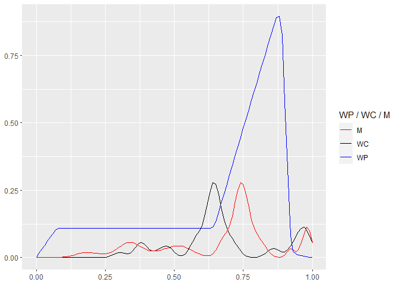

Let’s try some optimization using box-bounds and closed open and begin:

    # Optimization Goal 1, test 1, parallel:
    cow_og1_test1p <- loadResultsOrCompute(file = "../results/cow_og1_test1p.rds", computeExpr = {
      library(optimParallel)
      
      cl <- parallel::makePSOCKcluster(parallel::detectCores())
      parallel::clusterExport(cl, varlist = c(
        "srbtw", "r", "f", "objF", "stat_diff_2_functions", "stat_diff_2_functions_cor",
        "stat_diff_2_functions_cor_score", "area_diff_2_functions", "area_diff_2_functions_score",
        "stat_diff_2_functions_symmetric_JSD_score",
        "stat_diff_2_functions_symmetric_JSD_sampled",
        "stat_diff_2_functions_philentropy_sampled"))

      doWithParallelClusterExplicit(cl = parallel::makePSOCKcluster(12), expr = {
        set.seed(1337)
        optRp <- optimParallel::optimParallel(
          par = rep(1/length(vartheta_l), length(vartheta_l)),
          fn = objF,
          lower = rep(0, length(vartheta_l)),
          upper = rep(1, length(vartheta_l)),
          parallel = list(
            cl = cl,
            forward = FALSE
          )
        )
      })
    })

    cow_og1_test1p

    ## $par
    ## [1] 0.4119631 0.1651927 0.0737804 0.3831419
    ## 
    ## $value
    ## [1] 1.272031
    ## 
    ## $counts
    ## function gradient 
    ##       45       45 
    ## 
    ## $convergence
    ## [1] 0
    ## 
    ## $message
    ## [1] "CONVERGENCE: REL_REDUCTION_OF_F <= FACTR*EPSMCH"

    srbtw$setAllParams(cow_og1_test1p$par)
    srbtw$plot_warp()

In the meantime, I have implemented some new models as **R6-classes**.
We should test that we can reach the same optimization result with these
new structures. Some rationale for the architecture’s design are the
following:

Self-Regularizing Boundary Time Warping (**SRBTW**) is implicitly
multi-variate and multi-dataseries capable. When defining a loss that
concerns a variable, we will refer to it as a **Data-loss**. A loss that
concerns the choice of model parameters will be called **Regularizer**.
Since we have potentially many variables and intervals, a fully
configured model may have many of either kind, and each of these are
**objectives**; SRBTW, by design, hence is a **Multilevel-Model** and
poses a **Multi-objective** optimization problem.

This is comparable to the output-layer of a neural network, so we can
also view a fully-configured SRBTW as a vector-valued function, where
each entry in the vector is a loss. The gradient then would be the
**Jacobian**-matrix, i.e.,

$$
\\begin{aligned}
  \\mathcal{O}(\\operatorname{SRBTW})=&\\;f:\\mathbb{R}^m\\to\\mathbb{R}^n\\;\\text{,}
  \\\\\[1ex\]
  &\\;\\text{where}\\;m\\;\\text{is the number of parameters (begin, end, interval-lengths etc.),}
  \\\\\[0ex\]
  &\\;\\text{and}\\;n\\;\\text{is the number of defined singular objectives,}
  \\\\\[1ex\]
  \\mathbf{J}\_f=&\\;\\begin{bmatrix}
    \\frac{\\partial\\,f\_1}{\\partial\\,x\_1} & \\cdots & \\frac{\\partial\\,f\_1}{\\partial\\,x\_m} \\\\
    \\vdots & \\ddots & \\vdots \\\\
    \\frac{\\partial\\,f\_n}{\\partial\\,x\_1} & \\cdots & \\frac{\\partial\\,f\_n}{\\partial\\,x\_m}
  \\end{bmatrix}
\\end{aligned}
$$

Consider our Fire Drill example: The Warping Pattern has four variables
and four intervals. If we want to fit a single project to it, we may
want to define a single model and weight per variable and interval,
which would result in already 16 objectives here. I wrote that SRBTW is
implicitly capable of handling multiple variables and/or dataseries.
Implicit because this complexity is reduced to having one SRBTW handle
exactly two signals, the Warping Pattern and -Candidate, and then
defining a *singular* loss per each. It is perfectly fine to reuse an
SRBTW model across intervals of the same variable, but in practice the
overhead of doing so may be reduced by having each objective use its own
instance. We provide a **linear scalarizer** to handle one or more
objectives, each with their own weight. Since the linear scalarizer
reduces any number of objectives to a single objective, computing it
results in a scalar loss, and the Jacobian becomes a gradient again.

$$
\\begin{aligned}
  \\mathcal{O}^{(\\text{LS})}(\\operatorname{SRBTW})=&\\;w\_1\\mathcal{L}\_1(\\cdot)+\\;\\dots\\;+w\_n\\mathcal{L}\_n(\\cdot)\\;\\text{, (linear scalarization)}
  \\\\\[1ex\]
  =&\\;\\mathbf{w}^\\top\\bm{\\mathcal{L}}\\;\\text{, with gradient (for any parameter in}\\;\\mathcal{L}\_i\\text{)}
  \\\\\[1ex\]
  \\nabla\\,\\mathcal{O}=&\\;w\_1\\mathcal{L}'\_1(\\cdot)+\\;\\dots\\;+w\_n\\mathcal{L}'\_n(\\cdot)\\;\\text{.}
\\end{aligned}
$$

In practice, each weight is some combination of multiple other weights,
in our case it will most likely be the product of the weights for the
current data series, variable and interval. The linear scalarizer also
makes it apparent that each single objective (as well as its gradient)
can be computed **independently** and simultaneously, meaning that we
can arbitrarily parallelize the computation.

Back to our example that captures only the **A**-variable, let’s set up
this scenario with the new classes:

    dataLoss <- SRBTW_DataLoss$new(
      srbtw = srbtw, intervals = 1:4, # note how we cover 4 intervals
      weight = 1, # should be 4 but we need to check that our results
      # of cow_og1_test1p are identical to cow_og1_test3p later.
      continuous = TRUE, params = rep(1/4, length(vartheta_l)))

    dataLoss_RSS <- function(loss, listOfSms) {
      # 'loss' is a reference to the data-loss itself.
      continuous <- loss$isContinuous()
      err <- 0
      
      for (sm in listOfSms) {
        t <- sm$asTuple()
        if (continuous) {
          tempf <- function(x) (t$wp(x) - t$mqc(x))^2
          err <- err + cubature::cubintegrate(
            f = tempf, lower = t$tb_q, upper = t$te_q)$integral
        } else {
          X <- seq(from = t$tb_q, to = t$te_q, length.out = 250)
          y <- sapply(X = X, FUN = t$wp)
          y_hat <- sapply(X = X, FUN = t$mqc)
          err <- err + sum((y - y_hat)^2)
        }
      }
      
      log(1 + err)
    }

    dataLoss$setLossFunc(lossFunc = dataLoss_RSS)

    soo <- SRBTW_SingleObjectiveOptimization$new(srbtw = srbtw)
    soo$addObjective(obj = dataLoss)
    soo$setParams(params = rep(1/4, length(vartheta_l)))
    soo$compute()

    ## [1] 0.07086299

Let’s attempt to optimize this:

    cow_og1_test2p <- loadResultsOrCompute(file = "../results/cow_og1_test2p.rds", computeExpr = {
      library(optimParallel)
      
      cl <- parallel::makePSOCKcluster(parallel::detectCores())
      parallel::clusterExport(cl, varlist = c(
        "srbtw", "r", "f", "objF", "stat_diff_2_functions", "stat_diff_2_functions_cor",
        "stat_diff_2_functions_cor_score", "area_diff_2_functions", "area_diff_2_functions_score",
        "stat_diff_2_functions_symmetric_JSD_score",
        "stat_diff_2_functions_symmetric_JSD_sampled",
        "stat_diff_2_functions_philentropy_sampled", "SRBTW_Loss", "SRBTW_DataLoss",
        "SRBTW_SingleObjectiveOptimization", "soo"))

      doWithParallelClusterExplicit(cl = cl, expr = {
        set.seed(1337)
        optRp <- optimParallel::optimParallel(
          par = rep(1/length(vartheta_l), length(vartheta_l)),
          fn = function(x) {
            soo$setParams(params = x)
            soo$compute()
          },
          lower = rep(0, length(vartheta_l)),
          upper = rep(1, length(vartheta_l)),
          parallel = list(
            cl = cl,
            forward = FALSE
          )
        )
      })
    })

    cow_og1_test2p

    ## $par
    ## [1] 0.3548296 0.2611416 0.0157521 0.3507654
    ## 
    ## $value
    ## [1] 0.04087562
    ## 
    ## $counts
    ## function gradient 
    ##       25       25 
    ## 
    ## $convergence
    ## [1] 0
    ## 
    ## $message
    ## [1] "CONVERGENCE: REL_REDUCTION_OF_F <= FACTR*EPSMCH"

    srbtw$setAllParams(cow_og1_test2p$par)
    srbtw$plot_warp()

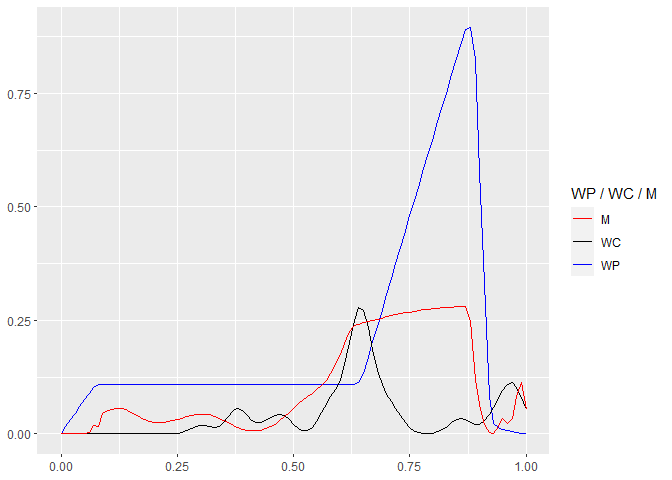

While this fit looks subjectively worse compared to the previous fit
using JSD, it is actually better w.r.t. the RSS-loss used here. The loss
here is 0.040876. If we use the parameters from the JSD-fit and compute
the loss for the RSS, it becomes:

    srbtw$setAllParams(params = cow_og1_test1p$par)
    dataLoss$setLossFunc(lossFunc = dataLoss_RSS)
    soo$compute()

    ## [1] 0.05608667

This is a clear demonstration of **SRBTW**’s strength, that it can use
any arbitrary loss or (weighted) combinations thereof, to optimize for
distinct goals simultaneously. Here is the test that should yield the
exact same results as we got with `cow_og1_test1p`:

    dataLoss_JSD <- function(loss, listOfSms) {
      
      tempf <- Vectorize(function(x_) {
        stopifnot(length(x_) == 1 && !is.na(x_))
        q <- srbtw$getQForX(x_)
        sm <- listOfSms[[q]]
        t <- sm$asTuple()
        t$mqc(x_)
      })
      
      -log(stat_diff_2_functions_symmetric_JSD_score()(listOfSms[[1]]$asTuple()$wp, tempf))
    }

    dataLoss$setLossFunc(lossFunc = dataLoss_JSD)

    cow_og1_test3p <- loadResultsOrCompute(file = "../results/cow_og1_test3p.rds", computeExpr = {
      library(optimParallel)
      
      cl <- parallel::makePSOCKcluster(parallel::detectCores())
      parallel::clusterExport(cl, varlist = c(
        "srbtw", "r", "f", "objF", "stat_diff_2_functions", "stat_diff_2_functions_cor",
        "stat_diff_2_functions_cor_score", "area_diff_2_functions", "area_diff_2_functions_score",
        "stat_diff_2_functions_symmetric_JSD_score",
        "stat_diff_2_functions_symmetric_JSD_sampled",
        "stat_diff_2_functions_philentropy_sampled", "SRBTW_Loss", "SRBTW_DataLoss",
        "SRBTW_SingleObjectiveOptimization", "soo"))
      
      doWithParallelClusterExplicit(cl = cl, expr = {
        set.seed(1337)
        optRp <- optimParallel::optimParallel(
          par = rep(1/length(vartheta_l), length(vartheta_l)),
          fn = function(x) {
            soo$setParams(params = x)
            soo$compute()
          },
          lower = rep(0, length(vartheta_l)),
          upper = rep(1, length(vartheta_l)),
          parallel = list(
            cl = cl,
            forward = FALSE
          )
        )
      })
    })

    cow_og1_test3p

    ## $par
    ## [1] 0.4119631 0.1651927 0.0737804 0.3831419
    ## 
    ## $value
    ## [1] 1.272031
    ## 
    ## $counts
    ## function gradient 
    ##       45       45 
    ## 
    ## $convergence
    ## [1] 0
    ## 
    ## $message
    ## [1] "CONVERGENCE: REL_REDUCTION_OF_F <= FACTR*EPSMCH"

    srbtw$setAllParams(cow_og1_test3p$par)
    srbtw$plot_warp()

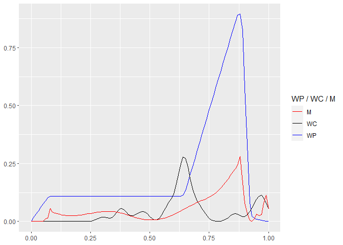

These are the exact same results as in `cow_og1_test1p`!

### Half- and full-open tests

Let’s do some tests where we leave either the begin or end open (or
both) and see what happens.

    srbtw$setOpenBegin(ob = TRUE)
    srbtw$setOpenEnd(oe = TRUE)

    cow_og1_test4p <- loadResultsOrCompute(file = "../results/cow_og1_test4p.rds", computeExpr = {
      library(optimParallel)
        
      cl <- parallel::makePSOCKcluster(parallel::detectCores())
      parallel::clusterExport(cl, varlist = c(
        "srbtw", "r", "f", "objF", "stat_diff_2_functions", "stat_diff_2_functions_cor",
        "stat_diff_2_functions_cor_score", "area_diff_2_functions", "area_diff_2_functions_score",
        "stat_diff_2_functions_symmetric_JSD_score",
        "stat_diff_2_functions_symmetric_JSD_sampled",
        "stat_diff_2_functions_philentropy_sampled", "SRBTW_Loss", "SRBTW_DataLoss",
        "SRBTW_SingleObjectiveOptimization", "soo"))
      
      doWithParallelClusterExplicit(cl = cl, expr = {
        set.seed(1337)
        optRp <- optimParallel::optimParallel(
          par = c(rep(1/length(vartheta_l), length(vartheta_l)), 0, 1),
          fn = function(x) {
            soo$setParams(params = x)
            soo$compute()
          },
          lower = rep(0, 2 + length(vartheta_l)),
          upper = rep(1, 2 + length(vartheta_l)),
          parallel = list(
            cl = cl,
            forward = FALSE
          )
        )
      })
    })

    cow_og1_test4p

    ## $par
    ## [1] 0.2826341 0.2983571 0.1597518 0.3405548 0.2325628 0.8355568
    ## 
    ## $value
    ## [1] 0.7642083
    ## 
    ## $counts
    ## function gradient 
    ##       51       51 
    ## 
    ## $convergence
    ## [1] 0
    ## 
    ## $message
    ## [1] "CONVERGENCE: REL_REDUCTION_OF_F <= FACTR*EPSMCH"

    srbtw$setAllParams(cow_og1_test4p$par)
    srbtw$plot_warp() +
      ggplot2::geom_vline(xintercept = cow_og1_test4p$par[5]) +
      ggplot2::geom_vline(xintercept = cow_og1_test4p$par[6])

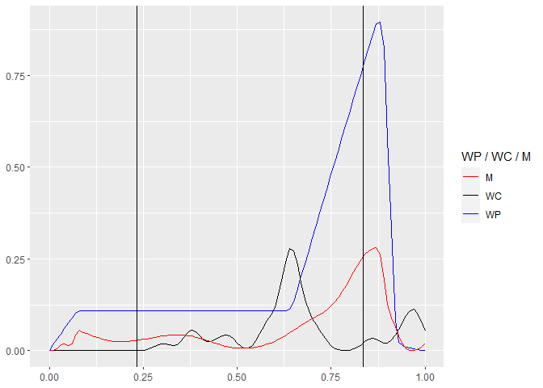

This is still using the Jenson-Shannon divergence, and apparently it is
a better fit. The black vertical lines indicate the used begin and end
of the Warping Candidate, and `M` was sliced and laid over `WP`. The
begin and end were 0.2325628, 0.8355568.

    optextras::kktchk(cow_og1_test4p$par, fn = function(x) {
        soo$setParams(params = x)
        soo$compute()
    }, gr = function(x) {
        soo$setParams(params = x)
        soo$computeGrad()
    })

Let’s also try this with the RSS data-loss:

    dataLoss$setLossFunc(lossFunc = dataLoss_RSS)

    cow_og1_test5p <- loadResultsOrCompute(file = "../results/cow_og1_test5p.rds", computeExpr = {
      library(optimParallel)
        
      cl <- parallel::makePSOCKcluster(parallel::detectCores())
      parallel::clusterExport(cl, varlist = c(
        "srbtw", "r", "f", "objF", "stat_diff_2_functions", "stat_diff_2_functions_cor",
        "stat_diff_2_functions_cor_score", "area_diff_2_functions", "area_diff_2_functions_score",
        "stat_diff_2_functions_symmetric_JSD_score",
        "stat_diff_2_functions_symmetric_JSD_sampled",
        "stat_diff_2_functions_philentropy_sampled", "SRBTW_Loss", "SRBTW_DataLoss",
        "SRBTW_SingleObjectiveOptimization", "soo"))
      
      doWithParallelClusterExplicit(cl = cl, expr = {
        set.seed(1337)
        optRp <- optimParallel::optimParallel(
          par = c(rep(1/length(vartheta_l), length(vartheta_l)), 0, 1),
          fn = function(x) {
            soo$setParams(params = x)
            soo$compute()
          },
          lower = rep(0, 2 + length(vartheta_l)),
          upper = rep(1, 2 + length(vartheta_l)),
          parallel = list(
            cl = cl,
            forward = FALSE
          )
        )
      })
    })

    cow_og1_test5p

    ## $par
    ## [1] 0.42615752 0.40798065 0.04777406 0.20491956 0.27012042 0.73161072
    ## 
    ## $value
    ## [1] 0.03670078
    ## 
    ## $counts
    ## function gradient 
    ##       77       77 
    ## 
    ## $convergence
    ## [1] 0
    ## 
    ## $message
    ## [1] "CONVERGENCE: REL_REDUCTION_OF_F <= FACTR*EPSMCH"

    srbtw$setAllParams(cow_og1_test5p$par)
    srbtw$plot_warp() +
      ggplot2::geom_vline(xintercept = cow_og1_test5p$par[5]) +
      ggplot2::geom_vline(xintercept = cow_og1_test5p$par[6])

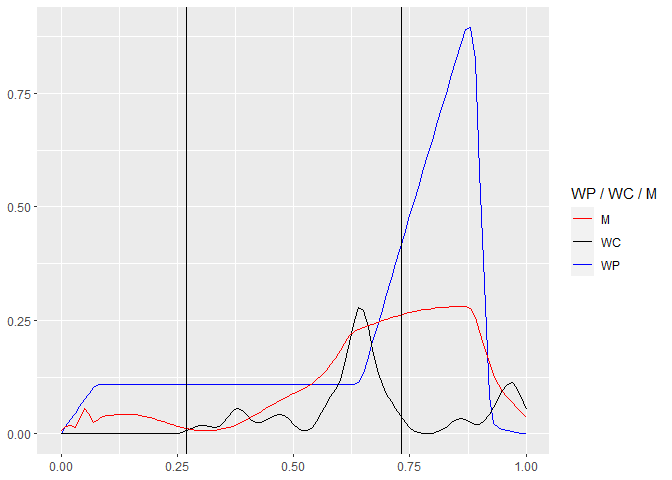

That worked, too. I tested this with the discrete version, and it takes
about twice as many iterations. However, we can also observe that the
target-extent is smaller than in the previous example, which brings us
to the next important matter: **Regularization**. But before that, let’s
make two half-open tests quickly, using JSD again:

    srbtw$setOpenBegin(ob = FALSE)
    srbtw$setOpenEnd(oe = TRUE)

    dataLoss$setLossFunc(lossFunc = dataLoss_JSD)

    cow_og1_test6p <- loadResultsOrCompute(file = "../results/cow_og1_test6p.rds", computeExpr = {
      library(optimParallel)
        
      cl <- parallel::makePSOCKcluster(parallel::detectCores())
      parallel::clusterExport(cl, varlist = c(
        "srbtw", "r", "f", "objF", "stat_diff_2_functions", "stat_diff_2_functions_cor",
        "stat_diff_2_functions_cor_score", "area_diff_2_functions", "area_diff_2_functions_score",
        "stat_diff_2_functions_symmetric_JSD_score",
        "stat_diff_2_functions_symmetric_JSD_sampled",
        "stat_diff_2_functions_philentropy_sampled", "SRBTW_Loss", "SRBTW_DataLoss",
        "SRBTW_SingleObjectiveOptimization", "soo"))
      
      doWithParallelClusterExplicit(cl = cl, expr = {
        set.seed(1337)
        optRp <- optimParallel::optimParallel(
          par = c(rep(1/length(vartheta_l), length(vartheta_l)), 1),
          fn = function(x) {
            soo$setParams(params = x)
            soo$compute()
          },
          lower = rep(0, 1 + length(vartheta_l)),
          upper = rep(1, 1 + length(vartheta_l)),
          parallel = list(
            cl = cl,
            forward = FALSE
          )
        )
      })
    })

    cow_og1_test6p

    ## $par
    ## [1] 0.2461881 0.3713805 0.1892241 0.4050136 0.8345426
    ## 
    ## $value
    ## [1] 0.7842093
    ## 
    ## $counts
    ## function gradient 
    ##       30       30 
    ## 
    ## $convergence
    ## [1] 0
    ## 
    ## $message
    ## [1] "CONVERGENCE: REL_REDUCTION_OF_F <= FACTR*EPSMCH"

    srbtw$setAllParams(cow_og1_test6p$par)
    srbtw$plot_warp() +
      ggplot2::geom_vline(xintercept = cow_og1_test6p$par[5])

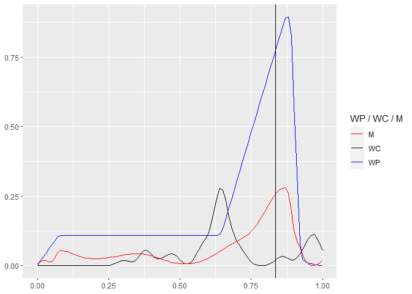

Now we have a late cut-out, that basically ignores `1/6` of the signal
at the end. This fit is better than the closed/closed one we made
earlier, the loss here is 0.784209 and previously it was 1.272031. Let’s
do this once more, open begin, closed end this time:

    srbtw$setOpenBegin(ob = TRUE)
    srbtw$setOpenEnd(oe = FALSE)

    cow_og1_test7p <- loadResultsOrCompute(file = "../results/cow_og1_test7p.rds", computeExpr = {
      library(optimParallel)
        
      cl <- parallel::makePSOCKcluster(parallel::detectCores())
      parallel::clusterExport(cl, varlist = c(
        "srbtw", "r", "f", "objF", "stat_diff_2_functions", "stat_diff_2_functions_cor",
        "stat_diff_2_functions_cor_score", "area_diff_2_functions", "area_diff_2_functions_score",
        "stat_diff_2_functions_symmetric_JSD_score",
        "stat_diff_2_functions_symmetric_JSD_sampled",
        "stat_diff_2_functions_philentropy_sampled", "SRBTW_Loss", "SRBTW_DataLoss",
        "SRBTW_SingleObjectiveOptimization", "soo"))
      
      doWithParallelClusterExplicit(cl = cl, expr = {
        set.seed(1337)
        optRp <- optimParallel::optimParallel(
          par = c(rep(1/length(vartheta_l), length(vartheta_l)), 0),
          fn = function(x) {
            soo$setParams(params = x)
            soo$compute()
          },
          lower = rep(0, 1 + length(vartheta_l)),
          upper = rep(1, 1 + length(vartheta_l)),
          parallel = list(
            cl = cl,
            forward = FALSE
          )
        )
      })
    })

    cow_og1_test7p

    ## $par
    ## [1] 0.3219058 0.3399120 0.1826912 0.3834835 0.2325001
    ## 
    ## $value
    ## [1] 0.7643591
    ## 
    ## $counts
    ## function gradient 
    ##       35       35 
    ## 
    ## $convergence
    ## [1] 0
    ## 
    ## $message
    ## [1] "CONVERGENCE: REL_REDUCTION_OF_F <= FACTR*EPSMCH"

    srbtw$setAllParams(cow_og1_test7p$par)
    srbtw$plot_warp() +
      ggplot2::geom_vline(xintercept = cow_og1_test7p$par[5])

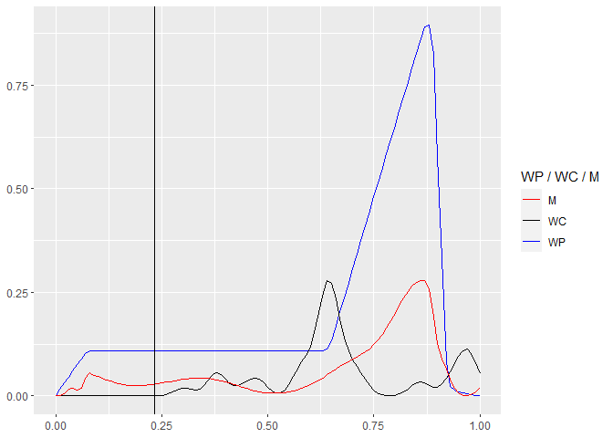

Previously, I had wrongly set the begin-parameter to start with 1, and
the final result did not move this parameter, which is the first obvious
problem that warrants for regularization. However, after correction, I
had let the parameter start from 0 and the result as can be seen is
quite good again – it finds a nice cut in while it has to keep the
remainder of the signal. The loss here is the lowest thus far using JSD
(0.764359).

### Swapping Warping Pattern and Candidate

This is something we should try as well. Remember that the difference
between Warping Pattern and Warping Candidate is, that the former has to
be matched wholly. Let’s swap them and make an open/open test-fit. This
test will tell us, which sub-support of the Warping Pattern actually
matches the data we have.

    vartheta_l_swap <- rep(1/15, 15)

    srbtw_swap <- SRBTW$new(
      wp = f,
      wc = r,
      theta_b = seq(0, 1, length.out = 16),
      gamma_bed = c(0, 1, 0),
      lambda = rep(0, length(vartheta_l_swap)),
      begin = 0,
      end = 1,
      openBegin = TRUE,
      openEnd = TRUE
    )

    srbtw_swap$setParams(vartheta_l = vartheta_l_swap)

    dataLoss_swap <- SRBTW_DataLoss$new(
      srbtw = srbtw_swap, intervals = 1:4, # note how we cover 4 intervals
      weight = 1, # should be 4 but we need to check that our results
      # of cow_og1_test1p are identical to cow_og1_test3p later.
      continuous = TRUE, params = c(vartheta_l_swap, 0, 1))

    soo_swap <- SRBTW_SingleObjectiveOptimization$new(srbtw = srbtw_swap)
    soo_swap$addObjective(obj = dataLoss_swap)
    dataLoss_swap$setLossFunc(lossFunc = dataLoss_RSS)

    cow_og1_test8p <- loadResultsOrCompute(file = "../results/cow_og1_test8p.rds", computeExpr = {
      library(optimParallel)
        
      cl <- parallel::makePSOCKcluster(parallel::detectCores())
      parallel::clusterExport(cl, varlist = c(
        "srbtw", "r", "f", "objF", "stat_diff_2_functions", "stat_diff_2_functions_cor",
        "stat_diff_2_functions_cor_score", "area_diff_2_functions", "area_diff_2_functions_score",
        "stat_diff_2_functions_symmetric_JSD_score",
        "stat_diff_2_functions_symmetric_JSD_sampled",
        "stat_diff_2_functions_philentropy_sampled", "SRBTW_Loss", "SRBTW_DataLoss",
        "SRBTW_SingleObjectiveOptimization", "SRBTW_SubModel", "soo_swap"))
      
      doWithParallelClusterExplicit(cl = cl, expr = {
        set.seed(1337)
        optRp <- optimParallel::optimParallel(
          par = c(vartheta_l_swap, 0, 1),
          fn = function(x) {
            soo_swap$setParams(params = x)
            soo_swap$compute()
          },
          lower = rep(0, 2 + length(vartheta_l_swap)),
          upper = rep(1, 2 + length(vartheta_l_swap)),
          parallel = list(
            cl = cl,
            forward = FALSE
          )
        )
      })
    })

    cow_og1_test8p

    ## $par
    ##  [1] 0.000000000 0.000000000 0.000000000 0.000292625 0.089836915 0.089836915
    ##  [7] 0.089836915 0.089836915 0.089836915 0.089836915 0.089836915 0.089836915
    ## [13] 0.089836915 0.089836915 0.089836915 0.000000000 0.976815702
    ## 
    ## $value
    ## [1] 1.790928e-07
    ## 
    ## $counts
    ## function gradient 
    ##       31       31 
    ## 
    ## $convergence
    ## [1] 0
    ## 
    ## $message
    ## [1] "CONVERGENCE: REL_REDUCTION_OF_F <= FACTR*EPSMCH"

    srbtw_swap$setAllParams(cow_og1_test8p$par)
    srbtw_swap$plot_warp()

This works great, too, but we have a somewhat unfavorable example here.
The project data, which has now become the reference (WP, blue) is zero
between  ≈ \[0, 0.26\]. We have attempted open/open optimization, but
since the reference (now WC, black) does not have this at the beginning,
the optimization finds a way around this by mapping the first three
intervals of the blue WP to three times the length of zero, effectively
moving the reference by that. There is some cut-off at the end, however
;) These zero-length intervals are still required, because only through
those we learn the offset in the blue line, where the black/red data
series start to match. For this example, the reference as WC matches
(given the loss we used) the data as WP almost entirely (a small cut-off
at the end). This means that the first three intervals are technically
*not* contained in the reference signal (now as WC). The result is a
*padding* in the beginning, and could have happened also at the end.
Padding thus occurs whenever one or more consecutive lengths at the
beginning or end are 0. In some cases, we would probably also get
intermittent intervals with a zero length (zero-length intervals
preceded or followed by non-zero-length intervals), which means that the
match is *partial*, and some interval of the WP has no counterpart in
the WC, i.e., a section in the WP is missing in the WC.

Regularization
--------------

Regularization-losses are those that impose penalties on extreme
parameters. SRBTW is self-regularizing w.r.t. interval-lengths and
begin- and end-offsets. No interval can be of negative length (or
smaller than a user-defined, yet positive, parameter). Begin and end are
always ordered and always keep a minimum distance to each other
(*γ**d*), while guaranteed not to extend beyond some
user-defined lower and upper boundary. The tests up until now for the
first optimization goal have shown these built-in regularizations alone
are suitable for achieving very good fits. We also chose to build in
these, so that no logarithmic barriers or (in-)equality constraints need
to be used, as these require exponentially many additional iterations,
especially when using a non-analytic gradient, leading to infeasibe
large problems with already few ( &lt;  ≈ 200) boundaries.

However, it may still be desirable to *guide* the optimization process
using some user-preferences. For example, one may want to avoid extreme
interval-lengths. Or it may not be desirable to have the begin or end
cut in too far, decimating the Warping Candidate too much. We formulate
these two regularizers below but any other user-defined regularization
is possible, too. Also, a regularizer is not strictly limited to compute
a loss based on the parameters only, but it is more common, so we have
made the distinction of *data-loss* and *regularizer* thus far, and we
are going to continue to do so.

The nice thing about the architecture so far is, that SRBTW is already a
*multi-objective* optimization problem (using the linear scalarizer). We
can just go ahead and add any regularizer as an additional objective to
the overall loss. Each of these specifies its own weight, too.

### Regularize extreme supports

An extreme support is one that is much shorter than what would be
allowed (given by
*γ**e* − *γ**b* − *γ**d*). We can keep
the regularizer and its gradient very simple.

$$
\\begin{aligned}
  \\mathcal{R}^{(\\text{supp})}=&\\;\\frac{\\beta\_u-\\beta\_l}{\\gamma\_e-\\gamma\_b-\\gamma\_a}
  \\\\\[1ex\]
  =&\\;\\frac{\\overbrace{\\max{\\Big(\\gamma\_b+\\gamma\_d,\\min{\\big(\\gamma\_e, \\max{(b,e)}\\big)}\\Big)}}^{\\beta\_u}-\\overbrace{\\min{\\Big(\\gamma\_e-\\gamma\_d,\\max{\\big(\\gamma\_b, \\min{(b,e)}\\big)}\\Big)}}^{\\beta\_l}}{\\gamma\_e-\\gamma\_b-\\gamma\_d}\\;\\text{.}
\\end{aligned}
$$

We had previously worked out the gradient for the sub-expression of
*β**u* − *β**l*, and can reuse it in this
regularizer. Here, we showed the complete regularizer for both, open
begin and -end BTW. If either of these is not open, *β**l* or
*β**u* can be replaced with a constant. In that case, it is
recommended to already account for the difference of that constant and
its maximum allowed value (*γ**b* or *γ**e*). Note
that its fraction is always between zero and one:

$$
\\begin{aligned}
  \\text{supp}\\big(\\mathcal{R}^{(\\text{supp})}\\big)=&\\;\\big\\{\\;x\\in\\mathbb{R}\\;\\rvert\\;0\\leq x\\leq 1\\;\\big\\}\\;\\text{, where values closer to zero}
  \\\\\[0ex\]
  &\\;\\text{mean more extreme intervals, so we propose a}\\;\\log\\text{-loss:}
  \\\\\[1ex\]
  \\mathcal{L}\_{\\mathcal{R}^{(\\text{supp})}}=&\\;-\\log{\\Big(\\mathcal{R}^{(\\text{supp})}\\Big)}\\mapsto\[+0,\\infty\]\\;\\text{.}
\\end{aligned}
$$

Until now I had not mentioned that I usually attempt to design data- and
regularization-losses using logarithms, and, if possible, such that the
result of a loss is **always positive**, usually with an upper bound of
∞, that approaches  + 0 as lower bound. Furthermore, and that depends on
the objective, we most often deal with two kinds of losses. Either, the
loss is some kind of ratio (or we can formulate it as such) or has a
lower and upper bound. In this case, I usually scale the raw loss into
the interval \[0, 1\] and use it in a negative logarithm (like the above
regularizer). In the other case, the raw loss has only one bound
(usually the lower bound, which is 0). In that case, we can use the
absolute raw loss as log (1 + \[raw loss\]).

### Regularize extreme intervals

This is something that I had also done in some of the previous
notebooks, but it is not compatible with SRBTW. Still, we can come up
with something similar. First we need to answer the question, what is an
extreme interval? This is subjective, and probably different from case
to case. I want to suggest a quite general notion here that probably
works in many cases.

We will assume that an extreme interval is one that deviates from its
*expected length*. A priori we do not know what amount of time time
warping is required, so we assume none. That means, each interval’s
length is expected to be equal to or close to its corresponding Warping
Pattern’s counterpart (not the length but the ratio). Or, one could say
that the expected length of each interval is the mean, which is the
allowed extent divided by the number of intervals. Or, the user can
define their own preference. Then for each interval, we could sum up the
difference from the expected value.

$$
\\begin{aligned}
  \\bm{\\kappa}\\;\\dots&\\;\\text{vector with expected lengths (ratios) for each interval,}
  \\\\\[1ex\]
  \\mathcal{R}^{(\\text{exint})}=&\\;\\sum\_{q=1}^{\\max{(Q)}}\\;\\Big(\\bm{\\vartheta}\_q^{(l)}-\\bm{\\kappa}\_q\\Big)^2\\;\\text{, with gradient}
  \\\\\[1ex\]
  \\frac{\\partial\\,\\mathcal{R}^{(\\text{exint})}}{\\partial\\,\\bm{\\vartheta}\_q^{(l)}}=&\\;2\\Big(\\bm{\\vartheta}\_q^{(l)}-\\bm{\\kappa}\_q\\Big)\\;\\text{and}\\;\\log\\text{-loss}
  \\\\\[1ex\]
  \\mathcal{L}\_{\\mathcal{R}^{(\\text{exint})}}=&\\;\\log{\\Big(1+\\mathcal{R}^{(\\text{exint})}\\Big)}\\mapsto\[+0,\\infty\]\\;\\text{, with gradient}
  \\\\\[1ex\]
  \\nabla\\,\\mathcal{L}\_{\\mathcal{R}^{(\\text{exint})}}=\\frac{\\partial\\,\\mathcal{L}\_{\\mathcal{R}^{(\\text{exint})}}}{\\partial\\,\\bm{\\vartheta}\_q^{(l)}}=&\\;\\frac{\\nabla\\,\\mathcal{R}^{(\\text{exint})}}{1+\\mathcal{R}^{(\\text{exint})}}\\;\\text{.}
\\end{aligned}
$$

In practice, this regularizer is never zero, and it should probably not
have a large weight, as otherwise, it would actually suppress time
warping. Also, one may ask why use **ϑ***q*(*l*)
and not *l**q*, *l*′*q* or
*l**q*(*c*) instead. Internally, SRBTW converts
boundaries to interval-lengths, and then finally to ratios that are then
scaled back using the actual extent given by
*β**u* − *β**l*.
**ϑ***q*(*l*). It is best if the regularizer
directly concerns the parameters. Ideally, the lengths passed are close
to ratios. If no box-bounds regularizer is used, those might be far off.

### Regularize box-bounds

This is something that is not explicitly required for SRBTW, as the
box-bounds for all intervals’ lengths are adhered to through the
self-regularization process. The same goes for begin and end (if open).
So far, we have however always used box-bounds, and the only reason for
that was that this usually comes with a speedup, because of the vastly
reduced feasible region. When box-constrained optimization cannot be
used, it may thus be advisable to add some (mild) regularization. In the
following definition, the loss for each parameter that is outside the
bounds is strictly positive. Hint: This regularizer assumes there is a
lower- and upper boundary for each parameter. Should that not be the
case for some or all parameters, their specific *i*-th lower or upper
bound can be replaced with  − ∞, ∞, respectively.

$$
\\begin{aligned}
  \\mathcal{R}^{(\\text{bb})}=&\\;\\sum\_{i=1}^{\\left\\lvert\\bm{\\theta}\\right\\rvert}\\;\\mathcal{H}\\Big(b\_i^{(l)}-\\bm{\\theta}\_i\\Big)\*\\big(b\_i^{(l)}-\\bm{\\theta}\_i\\big) + \\mathcal{H}\\Big(\\bm{\\theta}\_i-b\_i^{(u)}\\Big)\*\\big(\\bm{\\theta}\_i-b\_i^{(u)}\\big)\\;\\text{, where}
  \\\\\[1ex\]
  b\_i^{(l)},b\_i^{(u)}\\dots&\\;\\text{are the lower and upper bound for parameter}\\;\\bm{\\theta}\_i\\text{, with gradient}
  \\\\\[1ex\]
  \\frac{\\partial\\,\\mathcal{R}^{(\\text{bb})}}{\\partial\\,\\bm{\\theta}\_i}=&\\;\\mathcal{D}(b\_i^{(l)}-\\bm{\\theta}\_i)\\times(\\bm{\\theta}\_i-b\_i^{(l)})+\\mathcal{D}(\\bm{\\theta}\_i-b\_i^{(u)})\\times(\\bm{\\theta}\_i-b\_i^{(u)})
  \\\\\[0ex\]
  &\\;+\\mathcal{H}(\\bm{\\theta}\_i-b\_i^{(u)})-\\mathcal{H}(b\_i^{(l)}-\\bm{\\theta}\_i)\\;\\text{, where}
  \\\\\[1ex\]
  \\mathcal{D}(x)=&\\;\\begin{cases}
    1,&\\text{if}\\;x=0\\text{,}
    \\\\
    0,&\\text{otherwise,}
  \\end{cases}\\;\\text{the Dirac-delta function, and suggested loss}
  \\\\\[1ex\]
  \\mathcal{L}\_{\\mathcal{R}^{(\\text{bb})}}=&\\;\\log{\\Big(1+\\mathcal{R}^{(\\text{bb})}\\Big)}\\mapsto\[+0,\\infty\]\\;\\text{, with gradient}
  \\\\\[1ex\]
  \\nabla\\,\\mathcal{L}\_{\\mathcal{R}^{(\\text{bb})}}=\\frac{\\partial\\,\\mathcal{L}\_{\\mathcal{R}^{(\\text{bb})}}}{\\partial\\,\\bm{\\theta}\_i}=&\\;\\frac{\\nabla\\,\\mathcal{R}^{(\\text{bb})}}{1+\\mathcal{R}^{(\\text{bb})}}\\;\\text{.}
\\end{aligned}
$$

Also, instead of or additionally to this regularizer, we can sum up the
number of violations. This can then be used, e.g., as base, exponent or
multiplier. At this point I would recommend to use this regularizer for
all parameters, that is all lengths (**ϑ**(*l*)) as well as
*b*, *e*. Additionally, I recommend adding another instance of this
regularizer for *b*, *e* that uses *e* − *γ**d* as upper
boundary for *b*, and *b* + *γ**d* as lower boundary for *e*.
This regularizer should be able to help the model figure out good values
more quickly, and it should speed up the process if *b* &gt; *e* (which
is handled by the model but still not OK).

Optimization goal II
====================

This goal is actually specific to the current case, but in general the
purpose is to a) verify, that the choice of data- and
regularization-loss is apt for matching data that is expected to be
somewhat similar to a given pattern, and b) to find upper- and/or
lower-bounds (best/worst possible match) such that we can use the model
for **scoring** when fitting to real-world data.

An important step is to validate whether the selected sub-models and
scores are suitable to detect and score the reference pattern. This can
be verified by setting the query signal equal to the reference signal,
i.e., WC = WP, and then having the multilevel model use starting
intervals that are different from the reference intervals. Everything
else is identical to the first optimization problem. If the selected
data- and regularization-losses were chosen appropriately, the MLM
converges to the reference intervals, i.e., each sub-model matches best
what it should match. Ideally, this test is repeated a number of times,
with randomly initialized query intervals.

Scoring a loss
--------------

If we have the upper and lower bound for some loss ℒ( ⋅ ), we can define
a **score-operator**, S⊕, as:

$$
\\begin{aligned}
  \\mathcal{L}(\\cdot)\\;\\dots&\\;\\text{data- or regularization-loss, and also its gradient}\\;\\nabla\\,\\mathcal{L}(\\cdot)\\text{,}
  \\\\\[1ex\]
  \\omega,\\beta^{(l)},\\beta^{(u)}\\;\\dots&\\;\\text{weight, lower- and upper bound for loss}\\;\\mathcal{L}(\\cdot)\\text{,}
  \\\\\[1ex\]
  \\mathsf{S}^{\\oplus}(\\cdot)=&\\;\\omega\\Bigg(1-\\frac{\\mathcal{L}(\\cdot)-\\beta^{(l)}}{\\beta^{(u)}-\\beta^{(l)}}\\Bigg)\\;\\text{, score-operator, where larger scores are better (}\\oplus\\text{),}
  \\\\\[1ex\]
  \\nabla\\,\\mathsf{S}^{\\oplus}\\big(\\mathcal{L}\_q(\\cdot)\\big)=&\\;\\frac{\\omega\\nabla\\,\\mathcal{L}\_q(\\cdot)}{\\beta^{(l)}-\\beta^{(u)}}\\;\\text{, gradient of this operator.}
\\end{aligned}
$$

The score of some loss really just is a scaling of it into the range
\[0, 1\], where, depending on the definition, zero or one is the best
(in the previous definition 1 would be the best, hence we wrote
S⊕ – otherwise, we would use the notion S⊖ for an
operator where lower scores are better). If we choose not to negate the
score by leaving out the 1−, the gradient is almost the same, except for
that we subtract the lower bound from the upper bound, i.e.,
*β*(*u*) − *β*(*l*).

**Scoring?** — The goal is to align (to time-warp) some data to a given
pattern. If we attempt to align the pattern to itself, using some
unfavorable starting values, we would expect it to perfectly match when
the optimization is done. But a match depends on how the loss is
defined, and what is its weight. If a single variable in a single
interval is captured by a singular loss, and that loss is appropriate
for matching the variable, then it should ideally be 0 (or whatever is
the lowest possible value). Recall that **SRBTW** is just a model for
aligning two data series, it is up to the user chose an appropriate loss
that is *adequate to pursue the user’s objectives*. Such an adequate
loss is one that reaches its global minimum in case of fitting the
pattern to itself.

If two or more losses are combined by, e.g., a linear scalarizer, and if
these losses pursue objectives that are somewhat conflicting with each
other (not necessarily orthogonal), then the lower bound for that
aggregation is larger than or equal to the sum of the singular minimal
possible losses. It may not be trivial to determine the new lower bound
for an aggregated loss. We can find this lower bound through
optimization, and this is described in subsection . In practice, the
lowest possible aggregated loss lies on a **Pareto**-boundary and there
may be many optimal losses on that boundary.

As for the upper bound of an aggregated loss, we too will have a
Pareto-boundary. However, we cannot determine it computationally. The
compromise is to sum up the worst possible losses of all singular
losses. There are some losses that have a finite upper bound, and some
that only have ∞ as upper bound. However, our goal is to come up with
losses that have a well-defined upper bound for our problem, and these
are presented in the next sub-section.

Losses with finite upper bounds
-------------------------------

Early on I had defined losses (back then called metrics) that all had
one thing in common: their finite upper bound was either global, or we
could pose our problem in a way such that a local finite upper bound
could be specified. For many such metrics, this was done by scaling the
data within an interval into the **unit-square**. In the following, we
present some of these metrics, redefined as losses, together with their
upper and lower local bounds. In general, we exploit the fact that each
interval of the Warping Pattern is delimited by some rectangular area,
and within that area, which not necessarily needs to be a (unit-)square,
many definable losses have a clear upper bound.

Some of the scores will exploit the fact that in time-warping, the
degrees of freedom are on the time- or x-axis only. When we define an
optimization problem using SRBTW, we usually know the lower- and upper
bounds of the y-axis. Even later for optimization goal III, when we
allow the y-values to adjust, this will happen within **previously
specified box-bounds**. Some of the losses described below will exploit
these facts.

### Area between curves

This was one of the very first metrics I had implemented. The area
between curves (ABC) within an interval has been proven to be quite
useful. It is easy to compute, both for the continuous and discrete
case. The discrete case is equivalent to the mean absolute error and
approaches the continuous loss with sufficiently large number of
samples. The ABC exploits the lower and upper bound for the y-axis
(known a priori), and scales the rectangle of an interval using the
current Warping Pattern’s interval’s extent (*δ**q* below),
such that the loss is always computed in a rectangle that always has the
same size.

$$
\\begin{aligned}
  y\_q^{\\min},y\_q^{\\max}\\;\\dots&\\;\\text{lower and upper bounds for the }y\\text{-axis in the }q\\text{-th WP-interval,}
  \\\\\[1ex\]
  \\mathbf{x}\_q^{(\\text{WP})}\\;\\dots&\\;\\text{its support (going from}\\;\\bm{\\theta}\_{q+1}\\;\\text{to}\\;\\bm{\\theta}\_{q}\\text{),}
  \\\\\[1ex\]
  \\delta\_q=&\\;\\bm{\\theta}\_{q+1}-\\bm{\\theta}\_{q}\\equiv\\max{\\Big(\\mathbf{x}\_q^{(\\text{WP})}\\Big)}-\\min{\\Big(\\mathbf{x}\_q^{(\\text{WP})}\\Big)}\\;\\text{, the extent of the support,}
  \\\\\[1ex\]
  \\rho\_q=&\\;\\delta\_q\\times\\big(y\_q^{\\max}-y\_q^{\\min}\\big)\\;\\text{, the total area of that interval,}
  \\\\\[1ex\]
  \\rho\_q^{(\\text{WP})}=&\\;\\int\\displaylimits\_{\\mathbf{x}\_q^{(\\text{WP})}}\\,r(x)\\;\\text{, note that}\\;\\forall\\,x\\to y\_q^{\\min}\\leq r(x)\\leq y\_q^{\\max}\\text{, or}
  \\\\\[1ex\]
  \\rho\_q^{(\\text{WP}\_d)}=&\\;\\frac{1}{N}\\sum\_{i=1}^{N}\\,r\\Big(\\mathbf{x}\_{q,i}^{(\\text{WP})}\\Big)\\;\\text{,}
  \\\\\[0ex\]
  &\\;\\text{the (discrete) area between the reference signal (WP) and the x-/time-axis (at}\\;y\_q^{\\min}\\text{),}
  \\\\\[1ex\]
  \\beta\_l=&\\;0\\;\\text{, the metric's lower bound, which is always}\\;0\\text{,}
  \\\\\[1ex\]
  \\beta\_u=&\\;\\max{\\bigg(\\rho\_q^{\\big(\\text{WP}\_{(d)}\\big)},\\rho\_q-\\rho\_q^{\\big(\\text{WP}\_{(d)}\\big)}\\bigg)}\\;\\text{, the metric's upper bound,}
  \\\\\[1em\]
  \\mathcal{L}\_q^{(\\text{ABC}\_c)}=&\\;\\beta\_u^{-1}\\times\\int\\displaylimits\_{\\mathbf{x}\_q^{(\\text{WP})}}\\,\\left\\lvert r(x\_q)-m\_q^{(c)}\\Big(x\_q\\Big)\\right\\rvert\\;\\text{, the continous ABC-loss,}
  \\\\\[1ex\]
  \\mathcal{L}\_q^{(\\text{ABC}\_d)}=&\\;\\frac{1}{N\\times\\beta\_u}\\sum\_{i=1}^{N}\\,\\left\\lvert r\\Big(\\mathbf{x}\_{q,i}^{(\\text{WP})}\\Big)-m\_q^{(c)}\\Big(\\mathbf{x}\_{q,i}^{(\\text{WC})}\\Big)\\right\\rvert\\;\\text{, (discrete case), with gradient}
  \\\\\[1ex\]
  \\nabla\\,\\mathcal{L}\_q^{(\\text{ABC}\_d)}=&\\;\\frac{1}{N\\times\\beta\_u}\\sum\_{i=1}^{N}\\,\\frac{\\nabla\\,m\_q^{(c)}\\Big(\\mathbf{x}\_{q,i}^{(\\text{WC})}\\Big)\\times\\bigg(m\_q^{(c)}\\Big(\\mathbf{x}\_{q,i}^{(\\text{WC})}\\Big)-r\\Big(\\mathbf{x}\_{q,i}^{(\\text{WP})}\\Big)\\bigg)}{\\left\\lvert m\_q^{(c)}\\Big(\\mathbf{x}\_{q,i}^{(\\text{WC})}\\Big)-r\\Big(\\mathbf{x}\_{q,i}^{(\\text{WP})}\\Big)\\right\\rvert}\\;\\text{.}
\\end{aligned}
$$

Note that no scaling back of the intervals is required, because the
discrete version samples equidistantly with equally many samples (*N*)
from both, the WP and the WC, within their current intervals. In the
continuous case, the supports of WP and WC are identical, as that is
what SRBTW does (move a candidate-interval to the pattern-interval). The
discrete ABC loss is also known as Sum of absolute differences (SAD),
*L*1-norm, *Manhattan*- or Taxicab-norm.

### Residual sum of squares

RSS, also known as sum of squared distance (SSD) and probably as many
more synonyms, is usually always the first loss I use, as it is
computationally cheap, easy to compute, fast and robust (delivers good
results in many cases). Until now I had not been thinking about upper
boundaries for it. However, with regard to that, it should be very
similar to the ABC-loss, as the RSS’ behavior is asymptotic. When, as in
our case, we know the maximum y-extent, together with the (constant)
support.

$$
\\begin{aligned}
  \\rho\_q=&\\;\\delta\_q\\times\\big(y\_q^{\\max}-y\_q^{\\min}\\big)^2\\;\\text{, the maximum possible loss in the WP-interval's area,}
  \\\\\[1ex\]
  \\rho\_q^{(\\text{WP})}=&\\;\\int\\displaylimits\_{\\mathbf{x}\_q^{(\\text{WP})}}\\,\\Big(r(x)-y\_q^{\\min}\\Big)^2\\;\\text{, note that}\\;\\forall\\,x\\to y\_q^{\\min}\\leq r(x)\\leq y\_q^{\\max}\\text{, or}
  \\\\\[1ex\]
  \\rho\_q^{(\\text{WP}\_d)}=&\\;\\frac{1}{N}\\sum\_{i=1}^{N}\\,\\bigg(r\\Big(\\mathbf{x}\_{q,i}^{(\\text{WP})}\\Big)-y\_q^{\\min}\\bigg)^2\\;\\text{,}
  \\\\\[0ex\]
  &\\;\\text{the (discrete) squared loss between the reference signal (WP) and the x-/time-axis (at}\\;y\_q^{\\min}\\text{),}
  \\\\\[1ex\]
  \\beta\_l,\\beta\_u\\;\\dots&\\;\\text{(no change),}
  \\\\\[1em\]
  \\mathcal{L}\_q^{(\\text{RSS}\_c)}=&\\;\\beta\_u^{-1}\\times\\int\\displaylimits\_{\\mathbf{x}\_q^{(\\text{WP})}}\\,\\bigg(r(x\_q)-m\_q^{(c)}\\Big(x\_q\\Big)\\bigg)^2\\;\\text{, the continous RSS-loss,}
  \\\\\[1ex\]
  \\mathcal{L}\_q^{(\\text{RSS}\_d)}=&\\;\\frac{1}{N\\times\\beta\_u}\\sum\_{i=1}^{N}\\,\\bigg(r\\Big(\\mathbf{x}\_{q,i}^{(\\text{WP})}\\Big)-m\_q^{(c)}\\Big(\\mathbf{x}\_{q,i}^{(\\text{WC})}\\Big)\\bigg)^2\\;\\text{, (discrete case), with gradient}
  \\\\\[1ex\]
  \\nabla\\,\\mathcal{L}\_q^{(\\text{RSS}\_d)}=&\\;-\\frac{2}{N\\times\\beta\_u}\\sum\_{i=1}^{N}\\,\\nabla\\,m\_q^{(c)}\\Big(\\mathbf{x}\_{q,i}^{(\\text{WC})}\\Big)\\times\\bigg(r\\Big(\\mathbf{x}\_{q,i}^{(\\text{WP})}\\Big)-m\_q^{(c)}\\Big(\\mathbf{x}\_{q,i}^{(\\text{WC})}\\Big)\\bigg)\\;\\text{.}
\\end{aligned}
$$

The difference really just is to replace the norm with a square, and the
then-simplified gradient.

### More simple metrics

For more simple metrics see.[1] However, we will focus on metrics that
we have upper bounds for.

$$
\\begin{aligned}
  {\\text{SSD/RSS}} &: (x, y) \\mapsto \\|x-y\\|\_2^2 = \\langle x-y, x-y\\rangle = \\sum\_{i=1}^{n} (x\_i-y\_i)^2
  \\\\\[0ex\]
  {\\text{MAE}} &: (x, y) \\mapsto \\frac{d\_{\\mathbf{SAD}}}{n} = \\frac{\\|x-y\\|\_1}{n} = \\frac{1}{n}\\sum\_{i=1}^{n} \\left\\lvert x\_i-y\_i\\right\\rvert
  \\\\\[0ex\]
  {\\text{MSE}} &: (x, y) \\mapsto \\frac{d\_{\\mathbf{SSD}}}{n} = \\frac{\\|x-y\\|\_2^2}{n} = \\frac{1}{n}\\sum\_{i=1}^{n} (x\_i-y\_i)^2
  \\\\\[0ex\]
  {\\text{Euclidean}} &: (x, y) \\mapsto \\|x-y\\|\_2 = \\sqrt{d\_{\\mathbf{SSD}}} = \\sqrt{\\sum\_{i=1}^{n} (x\_i-y\_i)^2}
  \\\\\[0ex\]
  {\\infty\\text{/Chebyshev}} &: (x, y) \\mapsto \\|x-y\\|\_\\infty = \\lim\_{p \\rightarrow \\infty}\\bigg(\\sum\_{i=1}^{n} |x\_i-y\_i|^p\\bigg)^\\frac{1}{p} = \\max\_{i} \\left\\lvert x\_i-y\_i\\right\\rvert
  \\\\\[0ex\]
  {\\text{p/Minkowski}} &: (x, y) \\mapsto \\|x-y\\|\_p = \\bigg(\\sum\_{i=1}^{n} \\left\\lvert x\_i-y\_i\\right\\rvert^p\\bigg)^\\frac{1}{p}
  \\\\\[0ex\]
  {\\text{Canberra}} &: (x, y) \\mapsto \\sum\_{i=1}^{n} \\frac{\\left\\lvert x\_i-y\_i\\right\\rvert}{\\left\\lvert x\_i\\right\\rvert+\\left\\lvert y\_i\\right\\rvert}
  \\\\\[0ex\]
  {\\text{cosine}} &: (x, y) \\mapsto 1-\\frac{\\langle x, y\\rangle}{\\|x\\|\_2\\|y\\|\_2} = 1-\\frac{\\sum\_{i=1}^{n} x\_i y\_i}{\\sqrt{\\sum\_{i=1}^{n} x\_i^2}\\sqrt{\\sum\_{i=1}^{n} y\_i^2}}
  \\\\\[0ex\]
  {\\text{Pearson}} &: (x, y) \\mapsto 1 - \\text{Corr}(x, y)
\\end{aligned}
$$

I have copy-pasted these here, and we should check later for which of
these there may be an upper bound.

### Correlation between curves

This is also one I have used early on, and also as a score. The
correlation is an intuitively elegant loss for estimating whether two
curves have a similar shape. If one curve was to follow the shape of the
other, the correlation would be high, a strongly negative correlation
would mean one curve exhibits the opposite behavior. The correlation is
between \[1,  − 1\]. While in some cases we would not be interested in
negative correlation (and hence treat any correlation  ≤ 0 as no
correlation), I think that in many cases it is better for the *training*
of our model to not do that. The correlation is a good candidate for
combination with other losses that, for example, measure the difference
in magnitude (like ABC or RSS), as it itself does not care for that. The
correlation is a **ratio-loss**, and does not depend on local finite
upper bounds, it thus has **global** bounds.

When I say correlation, I mean *Pearson*’s **sample**-correlation, just
to be clear. In the following, we define the discrete version only, and
we do it in a way that this loss is strictly positive, like the others
presented so far.

$$
\\begin{aligned}
  \\operatorname{cor}(\\mathbf{a},\\mathbf{b})=&\\;\\frac{\\sum\_{i=1}^N\\,(\\mathbf{a}\_i-\\overline{\\mathbf{a}})\\times(\\mathbf{b}\_i-\\overline{\\mathbf{b}})}{\\sqrt{\\sum\_{i=1}^{N}\\,(\\mathbf{a}\_i-\\overline{\\mathbf{a}})^2}\\times\\sqrt{\\sum\_{i=1}^{N}\\,(\\mathbf{b}\_i-\\overline{\\mathbf{b}})^2}}
  \\\\\[1ex\]
  =&\\;\\operatorname{cor}\\bigg(r\\Big(\\mathbf{x}\_{q}^{(\\text{WP})}\\Big)\\;,\\;m\_q^{(c)}\\Big(\\mathbf{x}\_{q}^{(\\text{WC})}\\Big)\\bigg)
  \\\\\[1ex\]
  =&\\;\\operatorname{cor}\\Bigg(\\frac{\\sum\_{i=1}^N\\,\\bigg(r\\Big(\\mathbf{x}\_{q,i}^{(\\text{WP})}\\Big)-\\overline{r\\Big(\\mathbf{x}\_{q}^{(\\text{WP})}\\Big)}\\bigg)\\times\\bigg(m\_q^{(c)}\\Big(\\mathbf{x}\_{q,i}^{(\\text{WC})}\\Big)-\\overline{m\_q^{(c)}\\Big(\\mathbf{x}\_{q}^{(\\text{WC})}\\Big)}\\bigg)}{\\sqrt{\\sum\_{i=1}^{N}\\,\\bigg(r\\Big(\\mathbf{x}\_{q,i}^{(\\text{WP})}\\Big)-\\overline{r\\Big(\\mathbf{x}\_{q}^{(\\text{WP})}\\Big)}\\bigg)^2}\\times\\sqrt{\\sum\_{i=1}^{N}\\,\\bigg(m\_q^{(c)}\\Big(\\mathbf{x}\_{q,i}^{(\\text{WC})}\\Big)-\\overline{m\_q^{(c)}\\Big(\\mathbf{x}\_{q}^{(\\text{WC})}\\Big)}\\bigg)^2}}\\Bigg)\\;\\text{.}
\\end{aligned}
$$

The gradient of this, using some substitutions for the *constant*
Warping Pattern, is:

$$
\\begin{aligned}
  \\bm{\\tau}=&\\;\\sum\_{i=1}^N\\,\\bigg(r\\Big(\\mathbf{x}\_{q,i}^{(\\text{WP})}\\Big)-\\overline{r\\Big(\\mathbf{x}\_{q}^{(\\text{WP})}\\Big)}\\bigg)\\;\\text{, and}
  \\\\\[1ex\]
  \\bm{\\gamma}\_i=&\\;m\_q^{(c)}\\Big(\\mathbf{x}\_{q,i}^{(\\text{WC})}\\Big)\\;\\text{,}
  \\\\\[1ex\]
  \\bm{\\hat{\\gamma}}\_i=&\\;\\nabla\\,m\_q^{(c)}\\Big(\\mathbf{x}\_{q,i}^{(\\text{WC})}\\Big)\\;\\text{,}
  \\\\\[1ex\]
  \\rho=&\\;\\overline{m\_q^{(c)}\\Big(\\mathbf{x}\_{q}^{(\\text{WC})}\\Big)}
  \\\\\[1ex\]
  \\hat{\\rho}=&\\;\\overline{\\nabla\\,m\_q^{(c)}\\Big(\\mathbf{x}\_{q}^{(\\text{WC})}\\Big)}
  \\\\\[1ex\]
  \\nabla\\,\\operatorname{cor}(\\cdot)=&\\;\\Bigg(\\frac{\\Big\[\\sum\_{i=1}^N\\,\\bm{\\tau}\\times\\big(\\bm{\\hat{\\gamma}}\_i-\\hat{\\rho}\\big)\\Big\]\\times\\sqrt{\\sum\_{i=1}^N(\\bm{\\gamma}\_i-\\rho)^2}}{\\sqrt{(\\bm{\\tau}^\\top\\bm{\\tau})}\\times\\Big\[\\sum\_{i=1}^N\\,\\big(\\bm{\\gamma}\_i-\\rho\\big)\\times\\big(\\bm{\\hat{\\gamma}}\_i-\\bm{\\hat{\\gamma}}\_i\\times\\hat{\\rho}\\big)\\Big\]}\\Bigg)\\;\\text{.}
\\end{aligned}
$$

The actual loss shall map to ℒ(Corr) → \[0+,2\], so we define
it as:

$$
\\begin{aligned}
  \\mathcal{L}\_q^{(\\text{RSS})}=&\\;1-\\operatorname{cor}(\\cdot)\\;\\text{, with gradient}
  \\\\\[1ex\]
  \\nabla\\,\\mathcal{L}\_q^{(\\text{RSS})}=&\\;-\\nabla\\operatorname{cor}(\\cdot)\\;\\text{.}
\\end{aligned}
$$

### Ratio between curves’ arc-lengths

Comparing the arc-lengths of two curves is the next loss that we can
define such that it has a global upper bound. This is true for any loss
that is a **ratio**. First, we obtain two measurements, one from the WP
and one from the WC (here: the arc-length). We then set both
measurements into a relation that we subtract from 1. We make sure that
each ratio ideally is 1, and goes to 0 the worse it gets. This is
guaranteed by always dividing the minimum of both measurements by the
maximum.

The arc-length can be obtained continuously and discretely.

$$
\\begin{aligned}
  \\operatorname{arclen}\_{(c)} f(x)=&\\;\\int\\displaylimits\_{\\mathbf{x}\_q^{(\\text{WP})}}\\,\\sqrt{1+\\bigg\[\\frac{\\partial}{\\partial\\,x}f(x)\\bigg\]^2}dx\\;\\text{,}
  \\\\\[0ex\]
  &\\;\\text{continuous arc-length of some function}\\;f\\;\\text{with support}\\;\\mathbf{x}\_q^{(\\text{WP})}\\text{,}
  \\\\\[1ex\]
  \\operatorname{arclen}\_{(d)} f(x)=&\\;\\lim\_{N\\to\\infty}\\,\\sum\_{i=1}^N\\,\\left\\lvert f(\\delta\_i)-f(\\delta\_{i-1})\\right\\rvert\\;\\text{, where}
  \\\\\[0ex\]
  \\delta\_i=&\\;\\min{\\big(\\operatorname{supp}(f)\\big)}+i\\times\\Big(\\max{\\big(\\operatorname{supp}(f)\\big)}-\\min{\\big(\\operatorname{supp}(f)\\big)}\\Big)\\times N^{-1}\\;\\text{, with gradient}
  \\\\\[1ex\]
  \\nabla\\,\\operatorname{arclen}\_{(d)}f(x)=&\\;\\lim\_{N\\to\\infty}\\,\\sum\_{i=1}^N\\,\\frac{\\Big(f(\\delta\_i)-f(\\delta\_{i-1})\\Big)\\times\\Big(f'(\\delta\_i)-f'(\\delta\_{i-1})\\Big)}{\\left\\lvert f(\\delta\_i)-f(\\delta\_{i-1})\\right\\rvert}\\;\\text{.}
\\end{aligned}
$$

The arc-length is the first **ratio**-loss, so we will define a generic
ratio-loss where we can plug in any other loss that measures the same
property of two signals and puts them into relation. The actual loss is
then defined as:

$$
\\begin{aligned}
  \\mathcal{L}^{(\\text{ratio})}=&\\;1-\\frac{\\min{\\Big(\\mathcal{L}^{(\\text{WP})}(\\cdot)}\\;,\\;\\mathcal{L}^{(\\text{WC})}(\\cdot)\\Big)}{\\max{\\Big(\\mathcal{L}^{(\\text{WP})}(\\cdot)}\\;,\\;\\mathcal{L}^{(\\text{WC})}(\\cdot)\\Big)}\\;\\mapsto\[+0,1\]\\;\\text{,}
  \\\\\[0ex\]
  &\\;\\text{where}\\;\\mathcal{L}^{(\\text{WP})}(\\cdot)&gt;0\\;,\\;\\mathcal{L}^{(\\text{WC})}(\\cdot)&gt;0\\;\\text{measure some property/loss of the}
  \\\\\[0ex\]
  &\\;\\text{Warping Pattern and -Candidate, with gradient}
  \\\\\[1ex\]
  \\nabla\\,\\mathcal{L}\_q^{(\\text{ratio})}=&\\;\\mathcal{H}\\Big(\\mathcal{L}^{(\\text{WP})}(\\cdot)-\\mathcal{L}^{(\\text{WC})}(\\cdot)\\Big)\\times\\frac{\\mathcal{L}^{(\\text{WC})}(\\cdot)\\times \\nabla\\,\\mathcal{L}^{(\\text{WP})}(\\cdot)-\\mathcal{L}^{(\\text{WP})}(\\cdot)\\times \\nabla\\,\\mathcal{L}^{(\\text{WC})}(\\cdot)}{\\Big\[\\mathcal{L}^{(\\text{WP})}(\\cdot)\\Big\]^2}
  \\\\\[1ex\]
  &\\;+\\mathcal{H}\\Big(\\mathcal{L}^{(\\text{WC})}(\\cdot)-\\mathcal{L}^{(\\text{WP})}(\\cdot)\\Big)\\times\\frac{\\mathcal{L}^{(\\text{WP})}(\\cdot)\\times\\nabla\\,\\mathcal{L}^{(\\text{WC})}(\\cdot)-\\mathcal{L}^{(\\text{WC})}(\\cdot)\\times \\nabla\\,\\mathcal{L}^{(\\text{WP})}(\\cdot)}{\\Big\[\\mathcal{L}^{(\\text{WC})}(\\cdot)\\Big\]^2}\\;\\text{.}
\\end{aligned}
$$

We used the Heaviside step function to check the condition
ℒ(WP)( ⋅ ) &gt; ℒ(WC)( ⋅ ) (and vice versa). It is
now straightforward to see that we can effortlessly plug in the
arc-length operator defined previously. We have defined the ratio-loss
such that a perfect ratio of $\\frac{1}{1}$ results in a loss of 0. As
the denominator approaches ∞, the loss approaches 1, i.e.,
limdenom → ∞ℒ(ratio) = 1. The ratio-loss is **only
defined for strictly positive** losses.

Here is a short list with more properties that may be useful for a ratio
comparison:

-   Standard deviation, Variance
-   Signal measures: RMS, Kurtosis, Impulse-factor, Peak (Peak for for
    strictly positive signals)
-   Any other unary aggregation that is positive (or an absolute value
    can be obtained), for example min , max , mean, median etc.
-   discrete/differential Entropy (but we can define binary
    entropy-based losses, such as KL- and JSD-divergence,
    joint-/cross-entropy, mutual information etc.)

### Jensen–Shannon divergence

Most scores so far were *low-level* or mid-level, meaning that they
capture usually just a single simple property of a signal. Especially
losses that discard many properties are low-level, such as min , max 
for example. The area between curves, correlation and arc-length ratio
already are somewhat mid-level, as they aggregate more than one (or a
few) properties into a loss. Early on I had tried to use entropy-based
losses and -divergences. Coming across the Kullback-Leibler divergence I
early saw the need for such losses that have an upper bound. The
(symmetric) KL-divergence only has application specific bounds, and I
cannot see how to develop one in our case. However, the Jenson–Shannon
divergence will compare two probability distributions, and does so with
a **global upper bound** of ln (2) (or 1 when using the base-2
logarithm). Since it is a divergence, the global lower bound is 0 in any
case, i.e., no divergence.

Using entropy-based measures technically requires the variables compared
to be probability distributions (or functions thereof). This means that
the sum/integral of these must be 1. As of our examples, we have some
modeled some variables using probability densities, and some are just
metrics (univariate events). Strictly speaking, such measurements are
not applicable at all for the latter type. Also, for the former type, we
would strictly speaking still need to consider any variable in question
as a partial probability distribution, as we are looking at a specific
interval of it. In practice so far, however, it turns out that for both
kind of variables we can obtain excellent results by ignoring the nature
of the variable and simply treating it as discrete or continuous
probability distribution, as long as we ascertain that for any
realization it is strictly positive and that it sums up/integrates to 1.
That means that even if we look at a sub-support (interval) of a
variable, we treat that current interval as the entire probability
distribution of the variable in question. This approach is probably
further justified by how SRBTW works: Given a Warping Pattern, we
sub-divide it using come **constant** boundaries into **independent**
intervals. For the scope of any single loss, the other intervals do not
exist, so that we can view the captured variable as the entire
probability distribution of it.

I had previously also used entropy-based measures with success, esp. the
mutual information (MI). It may be worth looking more into such
available measures. However, those can be quite similar, and with the
JSD we already have a well-working measure. The JSD has been used
previously in Generative Adversarial Nets to minimize the divergence
between probability distributions (Goodfellow et al. 2014).

In the following, we will first define how to normalize two continuous
or discrete signals (note that mixed mode is not supported) such that
they sum up/integrate to 1. Then we will define the Jensen–Shannon
divergence for either type.

$$
\\begin{aligned}
  \\mathsf{N}^{(\\text{c})}(f,\\mathbf{x}^{(\\text{supp})},a)=&\\;f(a)\\times\\bigg\[\\int\\displaylimits\_{\\mathbf{x}^{(\\text{supp})}}\\,f(x)\\bigg\]^{-1}\\;\\text{, where}\\;\\min{\\big(\\mathbf{x}^{(\\text{supp})}\\big)}\\leq a\\leq\\max{\\big(\\mathbf{x}^{(\\text{supp})}\\big)}\\;\\land\\;\\forall\\,f(a)\\geq 0\\;\\text{,}
  \\\\\[1ex\]
  &\\;\\text{(continuous to-probability transform operator),}
  \\\\\[1ex\]
  \\mathsf{N}^{(\\text{d})}(\\mathbf{y})=&\\;\\frac{\\mathbf{y}-\\min{(\\mathbf{y})}+1}{\\sum\_{i=1}^{\\left\\lvert\\mathbf{y}\\right\\rvert}\\,\\big\[\\mathbf{y}-\\min{(\\mathbf{y})}+1\\big\]\_i}\\;\\text{,}
  \\\\\[1ex\]
  &\\;\\text{(discrete to-probability transform operator).}
\\end{aligned}
$$

In practice, so far, we get more robust results with discrete vectors
(typically using between 1*e*3 to 1*e*4 samples), even when those were
sampled from the same functions we would use in the continuous case.
Therefore, we will (for now at least) only show the discrete JSD.

$$
\\begin{aligned}
  \\mathbf{y}^{(\\text{n})}=&\\;\\mathsf{N}^{(\\text{d})}(\\mathbf{y})\\;\\text{, and}
  \\\\\[0ex\]
  \\mathbf{\\hat{y}}^{(\\text{n})}=&\\;\\mathsf{N}^{(\\text{d})}(\\mathbf{\\hat{y}})\\;\\text{, to-probability normalized samples from two signals,}
  \\\\\[1ex\]
  \\operatorname{KL}\_{(\\text{d,symm})}(\\mathbf{y}\\;\\|\\;\\mathbf{\\hat{y}})=&\\;\\sum\_{i=1}^{\\left\\lvert\\mathbf{y}\\right\\rvert}\\,\\mathbf{y}\_i\\times\\log{\\bigg(\\frac{\\mathbf{y}\_i}{\\mathbf{\\hat{y}}\_i}\\bigg)}+\\mathbf{\\hat{y}}\_i\\times\\log{\\bigg(\\frac{\\mathbf{\\hat{y}}\_i}{\\mathbf{y}\_i}\\bigg)}
  \\\\\[1ex\]
  \\operatorname{JSD}\_{(\\text{d})}(\\mathbf{y}\\;\\|\\;\\mathbf{\\hat{y}})=&\\;\\frac{1}{2}\\operatorname{KL}\_{(\\text{d,symm})}\\Big(\\mathbf{y}\\;\\|\\;\\frac{\\mathbf{y}+\\mathbf{\\hat{y}}}{2}\\Big)+\\frac{1}{2}\\operatorname{KL}\_{(\\text{d,symm})}\\Big(\\mathbf{\\hat{y}}\\;\\|\\;\\frac{\\mathbf{y}+\\mathbf{\\hat{y}}}{2}\\Big)\\;\\text{.}
\\end{aligned}
$$

Match WP against itself
-----------------------

The WP can be matched best by the reference pattern itself, i.e.,
nothing matches the reference better than it itself. A side-effect of
this optimization goal thus is to obtain the maximum possible score,
given the selected sub-models and their losses. The maximum score may
then later be used to normalize scores when fitting the then MLM to
actual project data, as now we have upper bounds for all scores.

As I wrote before, let’s make some tests where we use random values as
starting parameters and check whether the model can converge to the
pattern. We make tests using equidistantly-spaced and randomized
lengths.

    cow_og2_test1p <- loadResultsOrCompute(file = "../results/cow_og2_test1p.rds", computeExpr = {
      set.seed(1337)
      useTests <- list(
        list(p = rep(1/20, 20), n = "eq-20"),
        list(p = rep(1/40, 40), n = "eq-40"),
        list(p = runif(20), n = "unif-20"),
        list(p = runif(40), n = "unif-40"),
        list(p = rbeta(20, 1, 2), n = "beta_1_2-20"),
        list(p = rbeta(40, 1, 2), n = "beta_1_2-40"),
        
        list(p = rep(1/30, 30), b = runif(1), n = "eq_ob-30"),
        list(p = rep(1/20, 20), e = runif(1), n = "eq_oe-20"),
        list(p = rep(1/20, 20), b = runif(1, max = .5), e = runif(1, min = .5), n = "eq_ob_oe-20"),
        list(p = rbeta(40, 1, 2), b = runif(1, max = .5), e = runif(1, min = .5), n = "beta_1_2_ob_oe-40")
      )
      
      for (i in seq_len(length.out = length(useTests))) {
        u <- useTests[[i]]
        print(paste("Calculating", u$n, "..."))
        params <- list(vtl = u$p)
        params["b"] <- if ("b" %in% names(u)) u$b else 0
        params["e"] <- if ("e" %in% names(u)) u$e else 1
        params["ob"] <- "b" %in% names(u)
        params["oe"] <- "e" %in% names(u)
        
        u$r <- do.call(what = cow_og2, args = params)
        useTests[[i]] <- u
      }
      
      useTests
    })

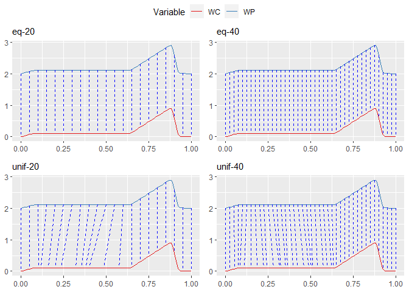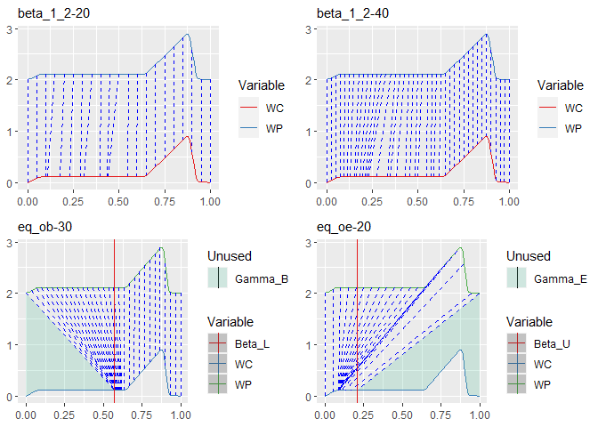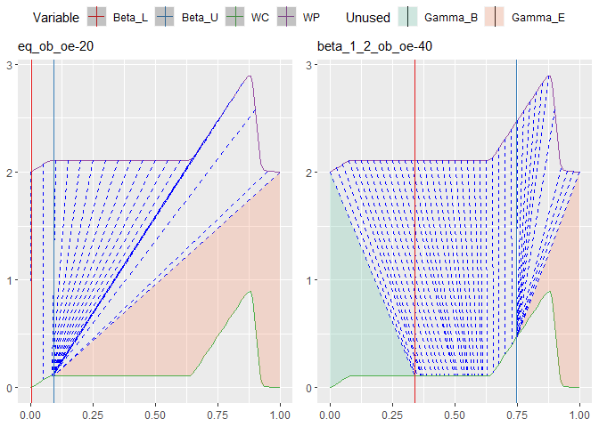

In all of the above cases, I used the discrete RSS data-loss, which
itself uses a constant number of samples of 250 per interval. Also I did
**not** use any regularization. This means, for example, that even a
very short interval will be sampled from 250 times, and if, for example,
the WP interval was in the Long Stretch, and the WC interval is too, but
it is much shorter, the loss will be equally low because of this setup.
Especially when using open begin and/or end, regularization is strongly
suggested

The first two equidistantly-spaced examples resulted in perfect fits, no
real surprise there. Examples 3 and 4 are quite OK, but they have a
couple of intervals that are very short. Within the Long Stretch, it is
virtually impossible for any of the intervals there to find a good
match, as the function looks the same to the left and to the right
(i.e., the gradient). Where the WP is not flat, the intervals actually
find a good match again (i.e., we observe vertical lines in the non-flat
phases). Examples 5 and 6 show the same behavior (`beta_1_2-20` and
`beta_1_2-40`). It is worth noting that these two achieved quite a low
error, which again is a hint at how ill-posed our setup here was (see
previous paragraph).

In examples 7 and 8 we use an open begin and end, respectively. In
example 7, we see a perfect beginning with the *Fire Drill* phase.
Before that, almost all intervals have a loss of zero (except for the
first ~3-4). This is because of the peculiarity I mentioned earlier (250
samples no matter the length). The begin was set initially at 0.5202 and
did not move much – I suppose it was just too far off for the
optimization to find the real beginning **without** regularization. I
suppose the same is true for example number 8, although that the
starting-parameter for the end was 0.6569. However, that starting point
is already slightly in the Fire Drill phase, and mapped initially to the
last interval, which is flat. So the optimization probably moved it
farther to the left to decrease that loss, as it would have gotten much
stronger otherwise.

If we divide the loss by the number of intervals, we can actually make
apples-to-apples comparisons.

<table>
<thead>
<tr class="header">
<th style="text-align: left;">Type</th>
<th style="text-align: left;">ob</th>
<th style="text-align: left;">oe</th>
<th style="text-align: right;">b_init</th>
<th style="text-align: right;">e_init</th>
<th style="text-align: right;">b</th>
<th style="text-align: right;">e</th>
<th style="text-align: left;">loss</th>
<th style="text-align: left;">meanLoss</th>
<th style="text-align: right;">optFn</th>
<th style="text-align: right;">optGr</th>
</tr>
</thead>
<tbody>
<tr class="odd">
<td style="text-align: left;">eq-20</td>
<td style="text-align: left;">-</td>
<td style="text-align: left;">-</td>
<td style="text-align: right;">0.000</td>
<td style="text-align: right;">1.000</td>
<td style="text-align: right;">0.000</td>
<td style="text-align: right;">1.000</td>
<td style="text-align: left;">0.00e+00</td>
<td style="text-align: left;">0.00e+00</td>
<td style="text-align: right;">21</td>
<td style="text-align: right;">21</td>
</tr>
<tr class="even">
<td style="text-align: left;">eq-40</td>
<td style="text-align: left;">-</td>
<td style="text-align: left;">-</td>
<td style="text-align: right;">0.000</td>
<td style="text-align: right;">1.000</td>
<td style="text-align: right;">0.000</td>
<td style="text-align: right;">1.000</td>
<td style="text-align: left;">0.00e+00</td>
<td style="text-align: left;">0.00e+00</td>
<td style="text-align: right;">21</td>
<td style="text-align: right;">21</td>
</tr>
<tr class="odd">
<td style="text-align: left;">unif-20</td>
<td style="text-align: left;">-</td>
<td style="text-align: left;">-</td>
<td style="text-align: right;">0.000</td>
<td style="text-align: right;">1.000</td>
<td style="text-align: right;">0.000</td>
<td style="text-align: right;">1.000</td>
<td style="text-align: left;">6.74e-04</td>
<td style="text-align: left;">3.37e-05</td>
<td style="text-align: right;">123</td>
<td style="text-align: right;">123</td>
</tr>
<tr class="even">
<td style="text-align: left;">unif-40</td>
<td style="text-align: left;">-</td>
<td style="text-align: left;">-</td>
<td style="text-align: right;">0.000</td>
<td style="text-align: right;">1.000</td>
<td style="text-align: right;">0.000</td>
<td style="text-align: right;">1.000</td>
<td style="text-align: left;">3.49e-03</td>
<td style="text-align: left;">8.72e-05</td>
<td style="text-align: right;">117</td>
<td style="text-align: right;">117</td>
</tr>
<tr class="odd">
<td style="text-align: left;">beta_1_2-20</td>
<td style="text-align: left;">-</td>
<td style="text-align: left;">-</td>
<td style="text-align: right;">0.000</td>
<td style="text-align: right;">1.000</td>
<td style="text-align: right;">0.000</td>
<td style="text-align: right;">1.000</td>
<td style="text-align: left;">5.07e-05</td>
<td style="text-align: left;">2.53e-06</td>
<td style="text-align: right;">123</td>
<td style="text-align: right;">123</td>
</tr>
<tr class="even">
<td style="text-align: left;">beta_1_2-40</td>
<td style="text-align: left;">-</td>
<td style="text-align: left;">-</td>
<td style="text-align: right;">0.000</td>
<td style="text-align: right;">1.000</td>
<td style="text-align: right;">0.000</td>
<td style="text-align: right;">1.000</td>
<td style="text-align: left;">1.35e-03</td>
<td style="text-align: left;">3.37e-05</td>
<td style="text-align: right;">123</td>
<td style="text-align: right;">123</td>
</tr>
<tr class="odd">
<td style="text-align: left;">eq_ob-30</td>
<td style="text-align: left;">Y</td>
<td style="text-align: left;">-</td>
<td style="text-align: right;">0.520</td>
<td style="text-align: right;">1.000</td>
<td style="text-align: right;">0.570</td>
<td style="text-align: right;">1.000</td>
<td style="text-align: left;">1.14e+00</td>
<td style="text-align: left;">3.80e-02</td>
<td style="text-align: right;">135</td>
<td style="text-align: right;">135</td>
</tr>
<tr class="even">
<td style="text-align: left;">eq_oe-20</td>
<td style="text-align: left;">-</td>
<td style="text-align: left;">Y</td>
<td style="text-align: right;">0.000</td>
<td style="text-align: right;">0.657</td>
<td style="text-align: right;">0.000</td>
<td style="text-align: right;">0.205</td>
<td style="text-align: left;">5.78e+00</td>
<td style="text-align: left;">2.89e-01</td>
<td style="text-align: right;">45</td>
<td style="text-align: right;">45</td>
</tr>
<tr class="odd">
<td style="text-align: left;">eq_ob_oe-20</td>
<td style="text-align: left;">Y</td>
<td style="text-align: left;">Y</td>
<td style="text-align: right;">0.225</td>
<td style="text-align: right;">0.700</td>
<td style="text-align: right;">0.002</td>
<td style="text-align: right;">0.091</td>
<td style="text-align: left;">5.78e+00</td>
<td style="text-align: left;">2.89e-01</td>
<td style="text-align: right;">99</td>
<td style="text-align: right;">99</td>
</tr>
<tr class="even">
<td style="text-align: left;">beta_1_2_ob_oe-40</td>
<td style="text-align: left;">Y</td>
<td style="text-align: left;">Y</td>
<td style="text-align: right;">0.289</td>
<td style="text-align: right;">0.533</td>
<td style="text-align: right;">0.339</td>
<td style="text-align: right;">0.744</td>
<td style="text-align: left;">5.69e+00</td>
<td style="text-align: left;">1.42e-01</td>
<td style="text-align: right;">97</td>
<td style="text-align: right;">97</td>
</tr>
</tbody>
</table>

The type in above table reveals some details: ‘eq’ means starting
lengths of equal length, ‘unif’ mean they wer uniformly sampled from
\[0, 1\] (with out scaling them back), ‘beta’ means they were drawn from
a Beta-distribution with *α* = 1 and *β* = 2 (also, no scaling back).
‘ob’ and ‘oe’ in the name indicate that the begin and/or end was open.
Finally, the number of intervals is at the end of the type.

**Conclusion**: Yes, if the loss is well defined and mechanism for
taking interval-lengths, begin and end into account (extreme value
regularization), then this will absolutely work well.

Optimization goal III
=====================

As for now, I want to note down two approaches that come to my mind:

-   Use the AP as reference with the 4 intervals that we have defined
    and warp all data to it. If we know how to warp the data to the AP,
    we can inverse the process. As for warping Y-values, we would need
    to wrap our proposed model from goal I to allow Y-translation
    (offset+scale approach, where each sub-model learns a scale and the
    first sub-model additionally an offset). The advantage is that we
    reuse the model, as manipulation happens outside of it. In each
    interval and for each variable, we need to learn a translate for all
    data series capturing that variable, so that this translation can
    then also be inverted and applied to the AP (if we have, e.g., 10
    projects, then we have to learn one common translation for all that
    best fits the single reference). This approach also allows us to
    give low or no weight to, e.g., the Long Stretch phase.
-   Use the AP as query instead. This means that the project data is
    constant, and that we subdivide it into some intervals by some
    strategy or just equidistantly-spaced. Using, e.g., AIC/BIC, we find
    the right amount of boundaries. We would make the same change to our
    model and wrap it such that sub-models can learn a Y-translation.
    This approach cannot consider the original intervals of the AP as we
    defined them, as the optimization chooses new intervals (also, it
    would most likely end up using a different number of intervals).
    This approach could result in a vastly different pattern that does
    not preserve too many shapes from the original pattern, but it may
    still worth testing.

A third approach: Start with an empty Warping Pattern: A straight
horizontal line located at 0.5 for each variable and variably many
equidistantly-spaced intervals (use information criterion to find best
number). This is the approach where we throw away our definition of the
Fire Drill AP and create one that is solely based on data.

Approach
--------

The approach that I suggest is to learn a **piece-wise linear**
function, that will be overlaid with the signal. For each interval, we
will learn a separate slope. However, instead of learning a slope
directly, we will learn the terminal y-translation at the end of the
interval (with the initial translation being 0). A linear function is
given by *y* = *a**x* + *b*, and we will only learn *a*. *b*, the
intercept, is for each interval implicitly assumed to be 0, but in
reality is the sum of all preceding terminal y-translations. This is
required because the resulting piece-wise linear function needs to be
continuous (otherwise, when adding it to the signal, the signal would
also become discontinuous). The first interval has no such preceding
y-translation, so we will learn one using the additional parameter, *v*,
that represents this. The advantage is, that we can simply **add** this
piece-wise function to each interval, in our case, to each
*m**q**c*(*x*, …). We can think of *v* and the
ordered set of terminal translations as a set of perpendicular vectors,
so that for each *q*-th interval, we simply sum up *v* and the set up to
and including the preceding interval, to get the intercept.

I call this approach **self-regularizing boundary amplitude warping**
(sr-BAW). In the style of the sub-model defintion for sr-BTW,
*m**q**c*, we will call the sub-models for
amplitude warping *n**q**c*.

Sub-Model formulation
---------------------

In each interval, we will call this function *t**q*:

$$
\\begin{aligned}
  \\bm{\\vartheta}^{(y)}\\;\\dots&\\;\\text{ordered set of terminal}\\;y\\text{-translations for each interval,}
  \\\\\[1ex\]
  a\_q=&\\;\\frac{\\bm{\\vartheta}\_q^{(y)}}{\\iota\_q}\\;\\text{, the slope for the}\\;q\\text{-th interval,}
  \\\\\[0ex\]
  &\\;\\text{where}\\;\\iota\_q\\;\\text{is the length of the}\\;q\\text{-th interval,}
  \\\\\[1ex\]
  v\\;\\dots&\\;\\text{the global translation for the first interval,}
  \\\\\[1ex\]
  \\phi\_q^{(y)}=&\\;\\begin{cases}
    0,&\\text{if}\\;q=1,
    \\\\
    \\sum\_{i=1}^{q-1}\\,\\bm{\\vartheta}^{(y)}\_i,&\\text{otherwise,}
  \\end{cases}
  \\\\\[0ex\]
  &\\;\\text{(the intercept for the}\\;q\\text{-th interval), and}
  \\\\\[1ex\]
  \\rho\_q\\;\\dots&\\;\\text{starting}\\;x\\text{-offset of the}\\;q\\text{-th interval,}
  \\\\\[1ex\]
  t\_q(x,\\dots)=&\\;a\_q(x-\\rho\_q)+v+\\phi\_q^{(y)}\\;\\text{, linear amplitude warping in}\\;q\\text{-th interval.}
\\end{aligned}
$$

The amount of parameters for the y-translations is 1 plus the amount of
intervals (or the same as the amount of boundaries). For SRBTW, we had
previously used the notion of *ϕ**q* to calculate the offset
for each *q*-th interval. We use a similar notion here,
*ϕ**q*(*y*), to denote the intercept of each
*q*-th interval.

### Self-regularization

Again, we would like this approach to be **self-regularizing**. That
means, that any resulting final y-coordinate should never be less or
more than the defined box-bounds. In DTW, the degrees of freedom are
limited to warping time, i.e., the x-axis. Time can (linearly) compress
and stretch, but never is the **amplitude** of the signal altered. This
would not make much sense for DTW, either, as it is a purely discrete
algorithm, that manipulates **each** discrete point of a query-signal.
If DTW would alter the magnitude, the result would simply be the
reference signal. Boundary Time Warping, on the other hand, instead of
manipulating points, manipulates everything between the points
(intervals) through linear affine transformation. This is the reason why
the degrees of freedom are limited to time in DTW. That also means, for
DTW, that time warping only works, when the query signal is within the
bounds (y) of the reference signal. For that reason, time warping
problems often have the application-specific y-limits that directly come
from the reference signal, which is known a priori. It is also a
possibility that the bounds are specified by the user.

In SRBAW it is possible to specify limits on a per-interval basis, so we
will have two vectors, one with lower- and one with upper bounds for
each interval. It would also be possible to specify the limits as a
function (per interval). But at this point it is not required so we will
not make that extra effort.

It is important to notice that in Boundary Time/Amplitude Warping, we
cannot (should not) make any assumptions about the signal within an
interval. For example, we cannot know its interval-global minimum or
maximum. At the same time, we want to enforce box-bounds on the warped
signal. The solution is to enforce these only after the warped signal
has been computed. That means, that we need to wrap the warping
function.

$$
\\begin{aligned}
  f(x,\\dots)\\;\\dots&\\;\\text{some signal function, could be, e.g.,}\\;m\_q^c(x,\\dots)\\text{,}
  \\\\\[1ex\]
  n\_q(x,\\dots)=&\\;f(x,\\dots)+\\overbrace{a\_q(x-\\rho\_q)+v+\\phi\_q^{(y)}}^{t\_q(x,\\dots)}\\;\\text{, sub-model that adds amplitude-warping to}\\;f(x,\\dots)\\text{,}
  \\\\\[1ex\]
  \\bm{\\lambda}^{(\\text{ymin})},\\bm{\\lambda}^{(\\text{ymax})}\\;\\dots&\\;\\text{vectors with lower and upper}\\;y\\text{-bounds for each interval,}
  \\\\\[1ex\]
  n\_q^c(x,\\dots)=&\\;\\max{\\bigg(\\bm{\\lambda}\_q^{(\\text{ymin})}, \\;\\min{\\Big(n\_q(x,\\dots),\\bm{\\lambda}\_q^{(\\text{ymax})}\\Big)}\\bigg)}\\;\\text{, the}\\;\\min\\text{/}\\max\\text{-constrained sub-model.}
\\end{aligned}
$$

### Gradient of the sub-model

We need to pay attention when defining the gradient, for cases when
*ι**q* and/or *ρ**q* are parameters of the model
that are learned and not constant. In our case, where we *wrap* sr-BTW,
*ι**q* = *l**q*(*c*), *ρ**q* = *ϕ**q*,
and *l**q*(*c*) depends on
∀ *l* ∈ **ϑ**(*l*) as well as *b*, *e* (if open begin and/or
end), while *ϕ**q* depends on
∀ *l**i*(*c*), *i* &lt; *q*. If we derive w.r.t.
any of the sr-BAW parameters, i.e., *v* or any of the terminal
translations in **ϑ**(*y*), then this will eliminate any
*m**q**c*, but we need to be careful when deriving
for parameters that affect any *l**q*(*c*).

### Testing

We will define some piece-wise linear function and use the signal of the
**A**-variable, then we warp the amplitude and see how that looks.

    print(baw_v)

    ## [1] 0.1

    print(theta_baw)

    ## [1] 0.0 0.2 0.4 0.6 0.8 1.0

    print(vartheta_l_baw)

    ## [1] 0.2 0.2 0.2 0.2 0.2

    print(baw_vartheta_y)

    ## [1]  0.050 -0.350 -0.100  0.200  0.025

    ggplot() +
      xlim(0, 1) +
      stat_function(fun = f, color = "red") +
      stat_function(fun = baw, color = "black") +
      stat_function(fun = n, color = "blue")

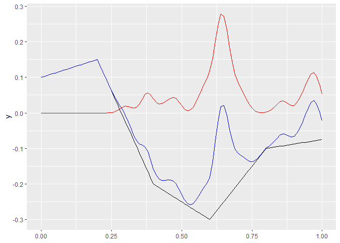

What we see in the above plot is the following:

-   **Red**: The **A**-variable, as it appeared in the dataset,
-   **Black**: the piece-wise linear function, with initial offset
    `baw_v` (0.1), and per-interval terminal translations of 0.05,
    -0.35, -0.1, 0.2, 0.025. The interval-boundaries were equidistantly
    placed at 0, 0.2, 0.4, 0.6, 0.8, 1,
-   **Blue**: Red+Black, i.e., the piece-wise linear function applied to
    the signal from the dataset.

Other thoughts
==============

Short unsorted list of things to consider.

Check progress of pattern: SRBTW allows for open-end matching, so that
it can be used to detect by how much (time wise into the project) Fire
Drill matches. Or, we can inverse the process and match the AP to the
project, to see which phases exist and score them.

In optimization goal III, we should also try to adapt the reference AP
without actually defining a loss for the Long Stretch. With such an
adapted pattern, we will find out what goes actually on in that phase in
the projects we have, as the other intervals will match, leaving a gap
for the LS.

Choosing a good number of boundaries *a priori*: This depends on the
problem, e.g., classification, and on whether a search can be performed
for it. A search can be done using some information criterion (IC).
Using some IC, then computing a best fit using 1…*n* boundaries, we
should get a somewhat convex function, and can choose the number of
boundaries using the minimum of that function. Sometimes, however, we
cannot do this and need to make a decision a priori. I have done some
tests using the **entropy** of the signals, by treating them as
probability density functions (which we showed works quite well for
fitting a model). I have tried to compute it continuously (differential
entropy) and discretely, by sampling from the signal. The latter case
gives more usable values, yet it is much more volatile w.r.t. the number
of samples. For example, a typical entropy (Shannon-bits) for 1*e*3
samples is  ≈ 10, and for 1*e*5 it is already  ≈ 16. Given the entropies
of two signals, we could calculate the starting-number *n* of boundaries
like $n=(H^{(\\text{WP})}\\times H^{(\\text{WC})})^{1-\\frac{1}{e}}$.
This gives OK-values for entropies in the range of approx.  ≈ \[5, 20\]
and is just one idea. Eventually, we probably would need to do an
empirical evaluation with many examples, where we employ a full search
using some IC. Then, we could attempt to come up with some rule that
best approximates this value.

References
==========

Goodfellow, Ian J., Jean Pouget-Abadie, Mehdi Mirza, Bing Xu, David
Warde-Farley, Sherjil Ozair, Aaron Courville, and Yoshua Bengio. 2014.
“Generative Adversarial Networks.” <http://arxiv.org/abs/1406.2661>.

[1] <a href="https://web.archive.org/web/20200701202102/https://numerics.mathdotnet.com/distance.html" class="uri">https://web.archive.org/web/20200701202102/https://numerics.mathdotnet.com/distance.html</a>
