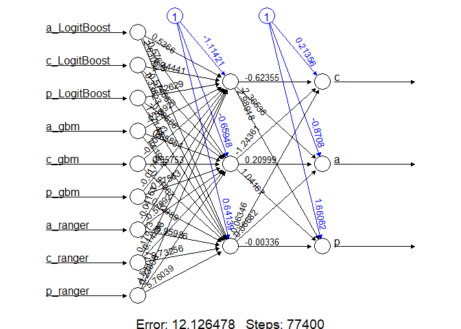
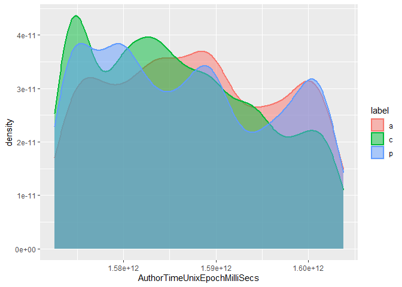
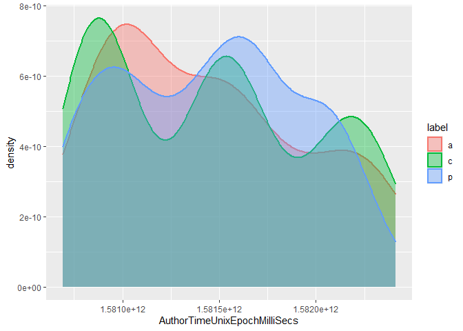
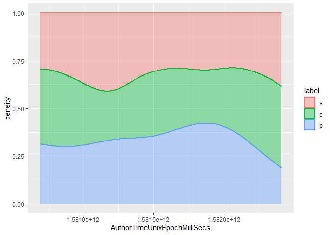
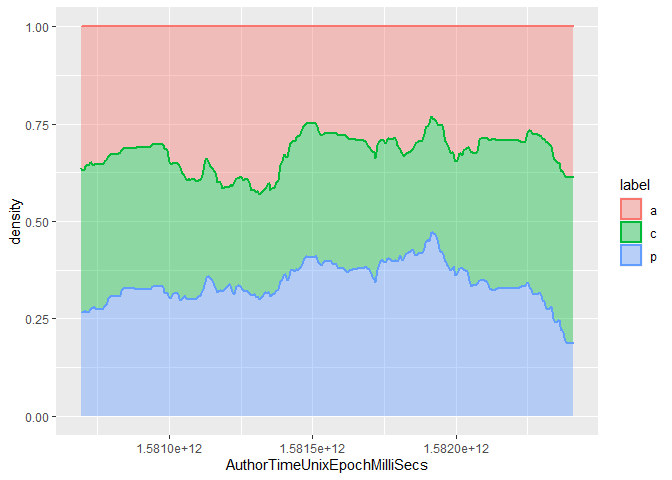
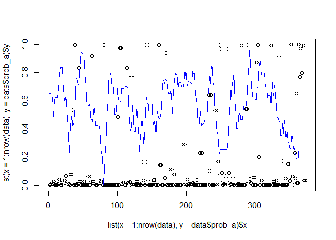

-   [Introduction](#introduction)
-   [Stateless model](#stateless-model)
    -   [Load and prepare the data](#load-and-prepare-the-data)
    -   [Define how the training works](#define-how-the-training-works)
    -   [Tuning of several models](#tuning-of-several-models)
        -   [Several models: correlation and
            performance](#several-models-correlation-and-performance)
        -   [Several models: train
            candidates](#several-models-train-candidates)
-   [Manual stacking of models](#manual-stacking-of-models)
    -   [Manual neural network](#manual-neural-network)
    -   [Manual stack (ms) using caret](#manual-stack-ms-using-caret)
    -   [Creating an ensemble (es) using
        caretEnsemble](#creating-an-ensemble-es-using-caretensemble)
        -   [Create a linear ensemble](#create-a-linear-ensemble)
-   [Some tests using Angular](#some-tests-using-angular)
-   [References](#references)

# Introduction

In this notebook, we will train and store some best best models for
commit classification, as these will be detrimental to detecting
maintenance activities in software projects. The models will be based on
latest work from (Hönel et al. 2020).

Throughout this notebook, we will build a few models that are all
similar. Our latest work indicated that including up to three previous
generations of commits is beneficial. We will evaluate models that
include 1, 2 or 3 previous generations.

Likewise, we want to go into the other direction, looking forward at
children, using similar amounts of commits. We will call those models
*stateful* in this notebook, and only the model without any adjacent
commits is called *stateless*, but they all belong to the same *class*.
Finally, having a few best models, the overall classifier shall use the
best model for the available data.

For finding the best models, the process is separated into two steps:
First, do a k-fold cross-validation to find the best model and
hyperparameters. Then, use the findings to train a model using the
entire data. Also, we will store the associated scaler/pre-processor for
that model.

Also note that each of the following models was already optimized w.r.t.
to some aspects of the training, like using an already oversampled
dataset. Also, we are using a very high split, as the resulting model
will also be using all data. Using many folds and repeats, we make sure
that overfitting is not a problem.

All complementary data and results can be found at Zenodo (Hönel et al.
2022). This notebook was written in a way that it can be run without any
additional efforts to reproduce the outputs (using the pre-computed
results). This notebook has a canonical
URL<sup>[\[Link\]](https://github.com/sse-lnu/anti-pattern-models/blob/master/notebooks/comm-class-models.Rmd)</sup>
and can be read online as a rendered
markdown<sup>[\[Link\]](https://github.com/sse-lnu/anti-pattern-models/blob/master/notebooks/comm-class-models.md)</sup>
version. All code can be found in this repository, too.

# Stateless model

The stateless model shall be used whenever there is **no** data
available from the parents or children.

## Load and prepare the data

``` r
# the stateless data:
data_sl <- if (interactive()) {
  getDataset("antipat_gt_all")
} else {
  readRDS("../data/antipat_gt_all.rds")
}

# remove SHAs:
data_sl <- data_sl[, !(names(data_sl) %in% c("SHA1", "ParentCommitSHA1s"))]
# factorize the labels:
data_sl$label <- factor(x = data_sl$label, levels = sort(unique(data_sl$label)))
```

The zero-variance predictors should be removed (if any).

``` r
nzv_sl <- caret::nearZeroVar(x = data_sl, saveMetrics = TRUE, names = TRUE)

print(paste0("Zero-variance predictors to be removed are: ", paste(names(data_sl)[nzv_sl$zeroVar], 
  collapse = ", ")))
```

    ## [1] "Zero-variance predictors to be removed are: IsInitialCommit, IsMergeCommit, NumberOfParentCommits"

``` r
data_sl <- data_sl[, !nzv_sl$zeroVar]
```

## Define how the training works

For each type of model, we will use a pre-defined train control.

Instead of sampling during training, we’ll work with a resample of the
entire dataset, using the *synthetic minority over-sampling technique*
(Chawla et al. 2002).

``` r
numFolds <- 5
numRepeats <- 5

tc_sl <- caret::trainControl(
  method = "repeatedcv", p = 0.9,
  returnResamp = "all", savePredictions = "all", classProbs = TRUE
  , number = numFolds, repeats = numRepeats
  , seeds = get_seeds(nh = 200, amount = 2 * numFolds * numRepeats)
  #, sampling = "smote"
)
```

## Tuning of several models

We do this step to find which models work well with our data. Later, we
can try to combine the best models into a meta-model.

``` r
set.seed(1337)
# Let's preserve 100 instances from the original data as validation data:
p <- caret::createDataPartition(y = data_sl$label, p = 0.95, list = FALSE)

train_sl <- data_sl[p, ]
valid_sl <- data_sl[-p, ]


# As described above, we can use an oversampled dataset for this model.  However,
# most recent changes indicate this may or may not be beneficial.
train_sl <- balanceDatasetSmote(data = train_sl, stateColumn = "label")
```

``` r
# Caret itself needs e1071
library(e1071)

library(gbm)
library(plyr)

# LogitBoost
library(caTools)

# C5.0
library(C50)

# ranger, rf
library(ranger)
library(dplyr)
library(randomForest)

# naive_bayes
library(naivebayes)

# mlp, mlpMl etc.
library(RSNNS)

# nnet
library(nnet)

# svmPoly, svmRadial etc.
library(kernlab)

# xgbTree, xgbLinear, xgbDART
library(xgboost)


results_sl <- loadResultsOrCompute("../results/sl.rds", computeExpr = {
  doWithParallelCluster(expr = {
    resList <- list()
    methods <- c("gbm", "LogitBoost", "C5.0", "rf", "ranger", "naive_bayes", 
      "mlp", "nnet", "svmPoly", "svmRadial", "xgbTree", "xgbDART", "xgbLinear", 
      "null")

    for (method in methods) {
      resList[[method]] <- base::tryCatch({
        caret::train(label ~ ., data = train_sl, trControl = tc_sl, preProcess = c("center", 
          "scale"), method = method, verbose = FALSE)
      }, error = function(cond) cond)
    }

    resList
  })
})
```

### Several models: correlation and performance

The following will give us a correlation matrix of the models’
predictions. The goal is to find models with high performance and
unrelated predictions, so that they can be combined. The correlations
are shown in tables and .

|             |     gbm | LogitBoost |    C5.0 |      rf |  ranger | naive_bayes |     mlp |
|:------------|--------:|-----------:|--------:|--------:|--------:|------------:|--------:|
| gbm         |  1.0000 |    -0.1080 | -0.0689 | -0.0565 |  0.1566 |      0.0235 |  0.0652 |
| LogitBoost  | -0.1080 |     1.0000 | -0.0281 | -0.0979 | -0.0054 |     -0.0587 |  0.1126 |
| C5.0        | -0.0689 |    -0.0281 |  1.0000 | -0.0565 | -0.2741 |     -0.2880 |  0.4716 |
| rf          | -0.0565 |    -0.0979 | -0.0565 |  1.0000 | -0.1473 |      0.3730 | -0.0736 |
| ranger      |  0.1566 |    -0.0054 | -0.2741 | -0.1473 |  1.0000 |     -0.0075 | -0.4465 |
| naive_bayes |  0.0235 |    -0.0587 | -0.2880 |  0.3730 | -0.0075 |      1.0000 |  0.0956 |
| mlp         |  0.0652 |     0.1126 |  0.4716 | -0.0736 | -0.4465 |      0.0956 |  1.0000 |
| nnet        |  0.2570 |     0.2848 |  0.0728 |  0.0485 |  0.1069 |     -0.1905 |  0.1516 |
| svmPoly     | -0.1260 |    -0.2447 | -0.1573 | -0.2841 |  0.2096 |      0.2341 |  0.0764 |
| svmRadial   |  0.3147 |    -0.1108 |  0.1220 |  0.4284 | -0.2944 |      0.3539 | -0.0435 |
| xgbTree     | -0.0134 |     0.2494 | -0.2393 |  0.2115 | -0.1651 |      0.0449 |  0.0007 |
| xgbDART     | -0.2682 |    -0.0111 |  0.1322 | -0.3900 |  0.1307 |      0.2583 |  0.0966 |
| xgbLinear   |  0.0560 |    -0.2253 |  0.0391 |  0.2076 | -0.2322 |     -0.1731 | -0.0618 |
| null        |      NA |         NA |      NA |      NA |      NA |          NA |      NA |

Correlations of models’ predictions (part 1).

|             |    nnet | svmPoly | svmRadial | xgbTree | xgbDART | xgbLinear | null |
|:------------|--------:|--------:|----------:|--------:|--------:|----------:|-----:|
| gbm         |  0.2570 | -0.1260 |    0.3147 | -0.0134 | -0.2682 |    0.0560 |   NA |
| LogitBoost  |  0.2848 | -0.2447 |   -0.1108 |  0.2494 | -0.0111 |   -0.2253 |   NA |
| C5.0        |  0.0728 | -0.1573 |    0.1220 | -0.2393 |  0.1322 |    0.0391 |   NA |
| rf          |  0.0485 | -0.2841 |    0.4284 |  0.2115 | -0.3900 |    0.2076 |   NA |
| ranger      |  0.1069 |  0.2096 |   -0.2944 | -0.1651 |  0.1307 |   -0.2322 |   NA |
| naive_bayes | -0.1905 |  0.2341 |    0.3539 |  0.0449 |  0.2583 |   -0.1731 |   NA |
| mlp         |  0.1516 |  0.0764 |   -0.0435 |  0.0007 |  0.0966 |   -0.0618 |   NA |
| nnet        |  1.0000 | -0.4363 |    0.0694 |  0.0475 | -0.2216 |   -0.0691 |   NA |
| svmPoly     | -0.4363 |  1.0000 |   -0.2885 | -0.1363 |  0.5035 |    0.0248 |   NA |
| svmRadial   |  0.0694 | -0.2885 |    1.0000 |  0.2385 | -0.1412 |    0.1629 |   NA |
| xgbTree     |  0.0475 | -0.1363 |    0.2385 |  1.0000 | -0.1642 |   -0.0954 |   NA |
| xgbDART     | -0.2216 |  0.5035 |   -0.1412 | -0.1642 |  1.0000 |   -0.3693 |   NA |
| xgbLinear   | -0.0691 |  0.0248 |    0.1629 | -0.0954 | -0.3693 |    1.0000 |   NA |
| null        |      NA |      NA |        NA |      NA |      NA |        NA |    1 |

Correlations of models’ predictions (part 2).

Show for each model the performance during training, and also predict on
our validation data to get an idea of their goodness.

### Several models: train candidates

Using a selection of the best models, we will train a corresponding best
model using the best-working hyperparameters. These models will then be
evaluated below and used in the stacking attempts.

``` r
models_sl <- loadResultsOrCompute(file = "../results/models_sl.rds", computeExpr = {
  res <- list()

  for (modelName in names(results_sl)) {
    m <- results_sl[[modelName]]

    res[[modelName]] <- caretFitOneModeltoAllData(method = modelName, tuneGrid = m$bestTune, 
      data = train_sl)
  }

  res
})
```

As for predicting on validation data, we will use the models that were
fit to the entire training data.

``` r
generateModelOverview(results_sl, models_sl, validationData = valid_sl)
```

| model       |  trAcc |  trKap | predNA | valAcc_withNA | valKap_withNA | valAcc | valKap |
|:------------|-------:|-------:|:-------|--------------:|--------------:|-------:|-------:|
| gbm         | 0.8031 | 0.7046 | FALSE  |        0.8060 |        0.6971 | 0.8060 | 0.6971 |
| LogitBoost  | 0.8219 | 0.7283 | TRUE   |        0.7612 |        0.6200 | 0.8667 | 0.7907 |
| C5.0        | 0.8036 | 0.7054 | FALSE  |        0.7761 |        0.6480 | 0.7761 | 0.6480 |
| rf          | 0.8023 | 0.7035 | FALSE  |        0.7463 |        0.6057 | 0.7463 | 0.6057 |
| ranger      | 0.8185 | 0.7277 | FALSE  |        0.8209 |        0.7217 | 0.8209 | 0.7217 |
| naive_bayes | 0.5038 | 0.2558 | FALSE  |        0.5672 |        0.3076 | 0.5672 | 0.3076 |
| mlp         | 0.7646 | 0.6469 | FALSE  |        0.7463 |        0.6063 | 0.7463 | 0.6063 |
| nnet        | 0.7585 | 0.6377 | FALSE  |        0.7164 |        0.5541 | 0.7164 | 0.5541 |
| svmPoly     | 0.7619 | 0.6429 | FALSE  |        0.7463 |        0.6098 | 0.7463 | 0.6098 |
| svmRadial   | 0.7496 | 0.6244 | FALSE  |        0.6716 |        0.4898 | 0.6716 | 0.4898 |
| xgbTree     | 0.8201 | 0.7302 | FALSE  |        0.7164 |        0.5546 | 0.7164 | 0.5546 |
| xgbDART     | 0.8160 | 0.7240 | FALSE  |        0.7164 |        0.5507 | 0.7164 | 0.5507 |
| xgbLinear   | 0.8169 | 0.7254 | FALSE  |        0.7015 |        0.5273 | 0.7015 | 0.5273 |
| null        | 0.3333 | 0.0000 | FALSE  |        0.2090 |        0.0000 | 0.2090 | 0.0000 |

# Manual stacking of models

While there are methods to train an ensemble classifier, we are
attempting this first manually. Using some of the best and most
uncorrelated models from the previous section, we will train a meta
model based on these models’ outputs. For that, we need a dataset. It
will be generated by predicting class probabilities from each single
model.

``` r
data_stack_train_sl <- data.frame(matrix(ncol = 0, nrow = nrow(train_sl)))
data_stack_valid_sl <- data.frame(matrix(ncol = 0, nrow = nrow(valid_sl)))

# The name of the models to use from the previous section: stack_manual_models <-
# names(results_sl)[ !(names(results_sl) %in% c('naive_bayes', 'mlp', 'nnet',
# 'svmPoly', 'svmRadial', 'xgbTree', 'xgbLinear'))] stack_manual_models <-
# c('LogitBoost', 'gbm', 'xgbDART', 'mlp') # <- This appears to work best
stack_manual_models <- c("LogitBoost", "gbm", "ranger")  # <- This appears to work best


for (modelName in stack_manual_models) {
  m <- models_sl[[modelName]]

  preds <- tryCatch({
    predict(m, train_sl[, !(names(train_sl) %in% c("label"))], type = "prob")
  }, error = function(cond) cond)

  preds_valid <- tryCatch({
    predict(m, valid_sl[, !(names(valid_sl) %in% c("label"))], type = "prob")
  }, error = function(cond) cond)

  if (any(class(preds) %in% c("simpleError", "error", "condition"))) {
    print(paste0("Cannot predict class probabilities for: ", modelName))
  } else {
    colnames(preds) <- paste0(colnames(preds), "_", modelName)
    colnames(preds_valid) <- paste0(colnames(preds_valid), "_", modelName)

    data_stack_train_sl <- cbind(data_stack_train_sl, preds)
    data_stack_valid_sl <- cbind(data_stack_valid_sl, preds_valid)
  }
}

# Let's append the label-column:
data_stack_train_sl$label <- train_sl$label
data_stack_valid_sl$label <- valid_sl$label
```

Now that we have the data prepared for our manual ensemble, let’s
attempt to train some models.

## Manual neural network

Before going back to caret, let’s try a neural network the manual way.

``` r
library(neuralnet)
library(e1071)

nnet <- loadResultsOrCompute("../results/nnet.rds", computeExpr = {
  set.seed(49374)
  neuralnet::neuralnet(formula = label ~ ., data = data_stack_train_sl, act.fct = function(x) 1.5 * 
    x * sigmoid(x), hidden = c(3), threshold = 0.005, stepmax = 2e+05, lifesign = if (interactive()) 
    "full" else "minimal")
})
```

The network has the following structure:

``` r
plot(nnet, rep = "best")
```

<!-- -->

``` r
nnet_pred <- predict(nnet, data_stack_valid_sl)
colnames(nnet_pred) <- levels(valid_sl$label)

nnet_pred_label <- factor(x = levels(valid_sl$label)[apply(nnet_pred, 1, which.max)], 
  levels = levels(valid_sl$label))

caret::confusionMatrix(valid_sl$label, nnet_pred_label)
```

    ## Confusion Matrix and Statistics
    ## 
    ##           Reference
    ## Prediction  a  c  p
    ##          a 12  2  0
    ##          c  1 21  5
    ##          p  1  3 22
    ## 
    ## Overall Statistics
    ##                                          
    ##                Accuracy : 0.8209         
    ##                  95% CI : (0.708, 0.9039)
    ##     No Information Rate : 0.403          
    ##     P-Value [Acc > NIR] : 2.801e-12      
    ##                                          
    ##                   Kappa : 0.7217         
    ##                                          
    ##  Mcnemar's Test P-Value : 0.6077         
    ## 
    ## Statistics by Class:
    ## 
    ##                      Class: a Class: c Class: p
    ## Sensitivity            0.8571   0.8077   0.8148
    ## Specificity            0.9623   0.8537   0.9000
    ## Pos Pred Value         0.8571   0.7778   0.8462
    ## Neg Pred Value         0.9623   0.8750   0.8780
    ## Prevalence             0.2090   0.3881   0.4030
    ## Detection Rate         0.1791   0.3134   0.3284
    ## Detection Prevalence   0.2090   0.4030   0.3881
    ## Balanced Accuracy      0.9097   0.8307   0.8574

While it works, the results are not better than those from the
individual models.

## Manual stack (ms) using caret

Let’s attempt to learn a meta-model using caret.

For the next overview, again, fit the selected single models using their
best tune and all available training data.

Now show the overview:

``` r
generateModelOverview(results_ms, models_ms, validationData = data_stack_valid_sl)
```

| model      |  trAcc |  trKap | predNA | valAcc_withNA | valKap_withNA | valAcc | valKap |
|:-----------|-------:|-------:|:-------|--------------:|--------------:|-------:|-------:|
| gbm        | 0.9928 | 0.9892 | FALSE  |        0.8209 |        0.7217 | 0.8209 | 0.7217 |
| LogitBoost | 0.9931 | 0.9896 | FALSE  |        0.7910 |        0.6768 | 0.7910 | 0.6768 |
| ranger     | 0.9929 | 0.9894 | FALSE  |        0.8209 |        0.7217 | 0.8209 | 0.7217 |
| mlp        | 0.9932 | 0.9898 | FALSE  |        0.8358 |        0.7449 | 0.8358 | 0.7449 |
| nnet       | 0.9931 | 0.9896 | FALSE  |        0.8358 |        0.7449 | 0.8358 | 0.7449 |
| svmRadial  | 0.9940 | 0.9910 | FALSE  |        0.7612 |        0.6288 | 0.7612 | 0.6288 |

The overview for all models, using oversampled training data, was this:

``` r
results_ms_all <- readRDS("../results/ms_all.rds")
models_ms_all <- readRDS("../results/models_ms_all.rds")
```

``` r
generateModelOverview(results_ms_all, models_ms_all, validationData = data_stack_valid_sl)
```

| model       |  trAcc |  trKap | predNA | valAcc_withNA | valKap_withNA | valAcc | valKap |
|:------------|-------:|-------:|:-------|--------------:|--------------:|-------:|-------:|
| gbm         | 0.9932 | 0.9898 | FALSE  |        0.8209 |        0.7217 | 0.8209 | 0.7217 |
| LogitBoost  | 0.9931 | 0.9896 | FALSE  |        0.7910 |        0.6768 | 0.7910 | 0.6768 |
| C5.0        | 0.9922 | 0.9883 | FALSE  |        0.8060 |        0.6998 | 0.8060 | 0.6998 |
| ranger      | 0.9932 | 0.9898 | FALSE  |        0.8209 |        0.7217 | 0.8209 | 0.7217 |
| rf          | 0.9932 | 0.9898 | FALSE  |        0.8209 |        0.7217 | 0.8209 | 0.7217 |
| naive_bayes | 0.9909 | 0.9863 | FALSE  |        0.8060 |        0.6973 | 0.8060 | 0.6973 |
| mlp         | 0.9929 | 0.9894 | FALSE  |        0.7910 |        0.6750 | 0.7910 | 0.6750 |
| nnet        | 0.9929 | 0.9894 | FALSE  |        0.8358 |        0.7449 | 0.8358 | 0.7449 |
| svmPoly     | 0.9942 | 0.9913 | FALSE  |        0.8060 |        0.6999 | 0.8060 | 0.6999 |
| svmRadial   | 0.9941 | 0.9912 | FALSE  |        0.7761 |        0.6534 | 0.7761 | 0.6534 |
| xgbTree     | 0.9931 | 0.9896 | FALSE  |        0.8060 |        0.6973 | 0.8060 | 0.6973 |
| xgbDART     | 0.9937 | 0.9906 | FALSE  |        0.8060 |        0.6973 | 0.8060 | 0.6973 |
| xgbLinear   | 0.9929 | 0.9894 | FALSE  |        0.8209 |        0.7217 | 0.8209 | 0.7217 |

It appears that the manual stacking was slightly useful, and we decide
to use the `nnet` meta-model, that is based on the single models
LogitBoost, gbm, ranger, as the final models. Remember that the single
models produce predictions as to the class membership on the original
data, and these are fed into the meta-model (the pipeline is: predict
class memberships (once using each single model), combine all votes into
a new dataset, predict final label based on these votes (using the meta
model)).

``` r
create_final_model <- function() {
  # The meta-model from the manual stacking:
  meta_model <- models_ms$nnet
  # The single models from earlier training:
  single_models <- models_sl[stack_manual_models]

  predict_class_membership <- function(data, modelList = single_models, labelCol = "label") {
    dataLabel <- if (labelCol %in% colnames(data)) {
      data[[labelCol]]
    } else {
      matrix(ncol = 0, nrow = nrow(data))
    }
    data <- data[, !(names(data) %in% labelCol)]
    dataCM <- data.frame(matrix(ncol = 0, nrow = nrow(data)))

    for (modelName in names(modelList)) {
      m <- modelList[[modelName]]
      temp <- stats::predict(m, data, type = "prob")
      colnames(temp) <- paste0(colnames(temp), "_", modelName)
      dataCM <- cbind(dataCM, temp)
    }

    return(cbind(dataCM, dataLabel))
  }

  predict <- function(data, labelCol = "label", type = c("raw", "prob", "both")) {
    type <- if (missing(type)) 
      type[1] else type
    dataCM <- predict_class_membership(data = data, labelCol = labelCol)
    res <- data.frame(matrix(ncol = 0, nrow = nrow(data)))

    doRaw <- type == "raw"
    doProb <- type == "prob"

    asRaw <- stats::predict(meta_model, dataCM, type = "raw")
    asProb <- stats::predict(meta_model, dataCM, type = "prob")
    if (is.factor(data[[labelCol]])) {
      colnames(asProb) <- levels(data[[labelCol]])
    }

    if (doRaw) {
      return(asRaw)
    } else if (doProb) {
      return(asProb)
    }

    # Both:
    res <- cbind(res, asRaw)
    colnames(res) <- labelCol
    res <- cbind(res, asProb)
    return(res)
  }

  return(list(meta_model = meta_model, single_models = single_models, predict_class_membership = predict_class_membership, 
    predict = predict))
}


final_model <- create_final_model()

saveRDS(final_model, file = "../results/final_model.rds")
```

A quick test of the final model:

``` r
caret::confusionMatrix(final_model$predict(train_sl), train_sl$label)
```

    ## Confusion Matrix and Statistics
    ## 
    ##           Reference
    ## Prediction   a   c   p
    ##          a 519   1   0
    ##          c   0 514   2
    ##          p   1   5 518
    ## 
    ## Overall Statistics
    ##                                           
    ##                Accuracy : 0.9942          
    ##                  95% CI : (0.9891, 0.9974)
    ##     No Information Rate : 0.3333          
    ##     P-Value [Acc > NIR] : <2e-16          
    ##                                           
    ##                   Kappa : 0.9913          
    ##                                           
    ##  Mcnemar's Test P-Value : 0.3496          
    ## 
    ## Statistics by Class:
    ## 
    ##                      Class: a Class: c Class: p
    ## Sensitivity            0.9981   0.9885   0.9962
    ## Specificity            0.9990   0.9981   0.9942
    ## Pos Pred Value         0.9981   0.9961   0.9885
    ## Neg Pred Value         0.9990   0.9943   0.9981
    ## Prevalence             0.3333   0.3333   0.3333
    ## Detection Rate         0.3327   0.3295   0.3321
    ## Detection Prevalence   0.3333   0.3308   0.3359
    ## Balanced Accuracy      0.9986   0.9933   0.9952

``` r
head(final_model$predict(valid_sl, type = "both"))
```

<div class="kable-table">

| label |         a |         c |         p |
|:------|----------:|----------:|----------:|
| c     | 0.0012107 | 0.9972771 | 0.0015122 |
| c     | 0.0008457 | 0.9979259 | 0.0012284 |
| c     | 0.0137335 | 0.9410197 | 0.0452468 |
| a     | 0.9983508 | 0.0006940 | 0.0009553 |
| p     | 0.0275879 | 0.3715442 | 0.6008679 |
| c     | 0.0011113 | 0.9973306 | 0.0015581 |

</div>

``` r
caret::confusionMatrix(final_model$predict(valid_sl), valid_sl$label)
```

    ## Confusion Matrix and Statistics
    ## 
    ##           Reference
    ## Prediction  a  c  p
    ##          a 12  1  1
    ##          c  1 22  3
    ##          p  1  4 22
    ## 
    ## Overall Statistics
    ##                                           
    ##                Accuracy : 0.8358          
    ##                  95% CI : (0.7252, 0.9151)
    ##     No Information Rate : 0.403           
    ##     P-Value [Acc > NIR] : 3.986e-13       
    ##                                           
    ##                   Kappa : 0.7449          
    ##                                           
    ##  Mcnemar's Test P-Value : 0.9862          
    ## 
    ## Statistics by Class:
    ## 
    ##                      Class: a Class: c Class: p
    ## Sensitivity            0.8571   0.8148   0.8462
    ## Specificity            0.9623   0.9000   0.8780
    ## Pos Pred Value         0.8571   0.8462   0.8148
    ## Neg Pred Value         0.9623   0.8780   0.9000
    ## Prevalence             0.2090   0.4030   0.3881
    ## Detection Rate         0.1791   0.3284   0.3284
    ## Detection Prevalence   0.2090   0.3881   0.4030
    ## Balanced Accuracy      0.9097   0.8574   0.8621

## Creating an ensemble (es) using caretEnsemble

The last thing to do is creating an ensemble using `caretEnsemble`.
**NOTE**: Unfortunately, that package does not supports multi-class
problems, and we will not attempt to modify the problem to fit the model
at this time. The following tests below do not work.

``` r
library(caretEnsemble)

tc_sl_es <- caret::trainControl(method = "cv", savePredictions = "final", classProbs = TRUE)
```

Now let’s create a list of models we would like to use.

### Create a linear ensemble

Using the list of trained models from the previous section, we create an
ensemble that is a linear combination of all models.

``` r
# model_es_linear <- caretEnsemble::caretStack( all.models = es_list, method =
# 'glm', #metric = 'Accuracy', trControl = caret::trainControl( classProbs =
# TRUE) ) summary(model_es_linear)
```

# Some tests using Angular

Let’s load the data we extracted using *Git-Tools* (Hönel 2020) from the
Angular repository (begin 2020 - now). After loading, we will predict
the maintenance activity and save the file.

``` r
# GitTools.exe -r C:\temp\angular\ -o 'C:\temp\angular.csv' -s '2019-01-01
# 00:00'
dateFormat <- "%Y-%m-%d %H:%M:%S"
angularFile <- "../data/angular.csv"
angular <- read.csv(angularFile)
temp <- final_model$predict(data = angular, type = "both")
angular$label <- temp$label
angular$prob_a <- temp$a
angular$prob_c <- temp$c
angular$prob_p <- temp$p

angular$CommitterTimeObj <- strptime(angular$CommitterTime, format = dateFormat)
angular$AuthorTimeObj <- strptime(angular$AuthorTime, format = dateFormat)

write.csv(angular, file = angularFile, row.names = FALSE)

table(angular$label)
```

    ## 
    ##    a    c    p 
    ## 1533 5819 3862

Let’s attempt some straightforward density plots for each activity,
using the relative timestamp of each commit.

``` r
ggplot2::ggplot(
  #data = angular[angular$AuthorTimeUnixEpochMilliSecs <= 1.57e12, ],
  data = angular[angular$AuthorTimeObj < as.POSIXct("2019-11-01"), ],
  ggplot2::aes(
    AuthorTimeUnixEpochMilliSecs, color = label, fill = label)) +
  ggplot2::geom_density(size = 1, alpha = 0.5)#, position = "fill")
```

<!-- -->

``` r
ggplot2::ggplot(
  #data = angular[angular$AuthorTimeUnixEpochMilliSecs <= 1.57e12, ],
  data = angular[angular$AuthorTimeObj >= as.POSIXct("2019-11-01"), ],
  ggplot2::aes(
    AuthorTimeUnixEpochMilliSecs, color = label, fill = label)) +
  ggplot2::geom_density(size = 1, alpha = 0.5)#, position = "fill")
```

<!-- -->

It appears that the activities after 2019-11-01 are much more balanced.
Let’s look at a much smaller window:

``` r
temp <- ggplot2::ggplot(data = angular[angular$AuthorTimeObj > as.POSIXct("2020-02-03") & 
  angular$AuthorTimeObj <= as.POSIXct("2020-02-23"), ], ggplot2::aes(AuthorTimeUnixEpochMilliSecs, 
  color = label, fill = label))

temp + ggplot2::geom_density(size = 1, alpha = 0.4)
```

<!-- -->

``` r
temp + ggplot2::geom_density(size = 1, alpha = 0.4, position = "fill")
```

<!-- -->

``` r
temp + ggplot2::geom_density(size = 1, alpha = 0.4, kernel = "rectangular")
```

<!-- -->

``` r
temp + ggplot2::geom_density(size = 1, alpha = 0.4, kernel = "rectangular", position = "fill")
```

<!-- -->

The above plot is a 3-week snapshot, with weeks starting at Monday,
00:00, and ending at Sunday, 23:59. It appears that each week starts
with a somewhat corrective phase. We can see this more easily when using
a rectangular Kernel in a non-filled plot.

Here are some attempts with a rolling mean over the class-probabilities:

``` r
library(zoo)

data <- AirPassengers
plot(data, main = "Simple Moving Average (SMA)", ylab = "Passengers")
lines(rollmean(data, 5), col = "blue")
lines(rollmean(data, 40), col = "red")
legend(1950, 600, col = c("black", "blue", "red"), legend = c("Raw", "SMA 5", "SMA 40"), 
  lty = 1, cex = 0.8)
```

<!-- -->

``` r
data <- angular[angular$AuthorTimeObj > as.POSIXct("2020-02-03") & angular$AuthorTimeObj <= as.POSIXct("2020-02-23"),]

plot(list(
  #x = as.Date(data$AuthorTimeObj),
  x = 1:nrow(data),
  y = data$prob_a
))
lines(rollmean(data$prob_c, 10), col='blue')
```

<!-- -->

# References

<div id="refs" class="references csl-bib-body hanging-indent">

<div id="ref-chawla2002smote" class="csl-entry">

Chawla, Nitesh V, Kevin W Bowyer, Lawrence O Hall, and W Philip
Kegelmeyer. 2002. “SMOTE: Synthetic Minority over-Sampling Technique.”
*Journal of Artificial Intelligence Research* 16: 321–57.

</div>

<div id="ref-honel2020gitdens" class="csl-entry">

Hönel, Sebastian. 2020. “Git Density 2020.2: Analyze Git Repositories to
Extract the Source Code Density and Other Commit Properties,” February.
<https://doi.org/10.5281/zenodo.3662768>.

</div>

<div id="ref-honel2020using" class="csl-entry">

Hönel, Sebastian, Morgan Ericsson, Welf Löwe, and Anna Wingkvist. 2020.
“Using Source Code Density to Improve the Accuracy of Automatic Commit
Classification into Maintenance Activities.” *Journal of Systems and
Software*, 110673.

</div>

<div id="ref-honel_picha_2021" class="csl-entry">

Hönel, Sebastian, Petr Pícha, Premek Brada, and Lenka Rychtarova. 2022.
“Detection of the Fire Drill Anti-Pattern: 16 Real-World Projects with
Ground Truth, Issue-Tracking Data, Source Code Density, Models and
Code.” Zenodo. <https://doi.org/10.5281/zenodo.5992621>.

</div>

</div>
