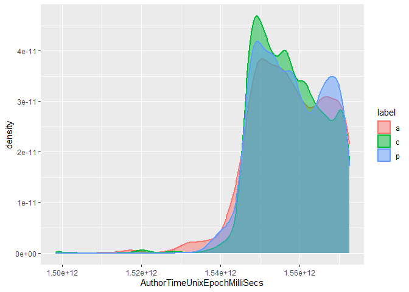
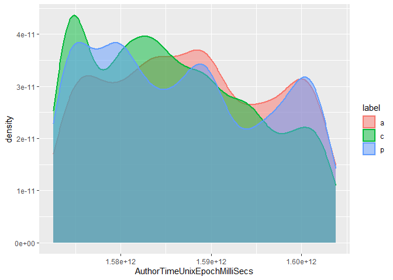
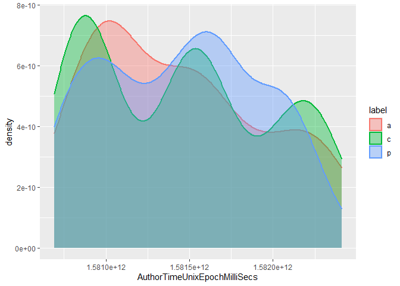
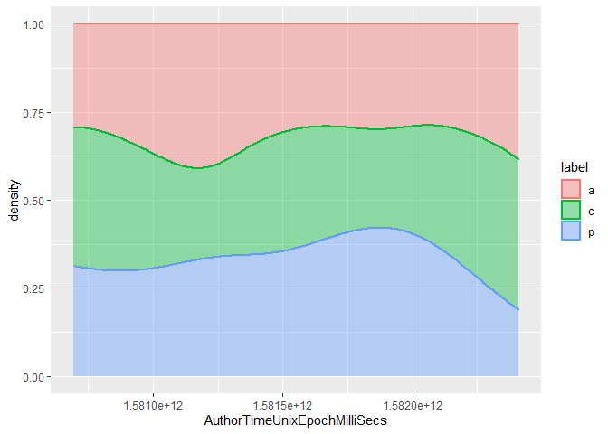
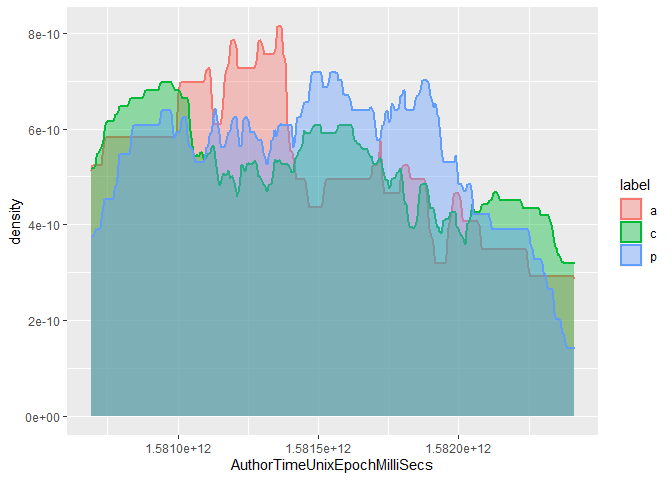
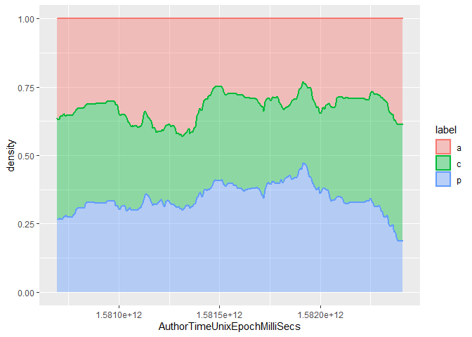
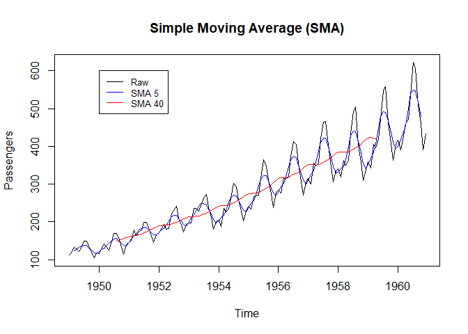
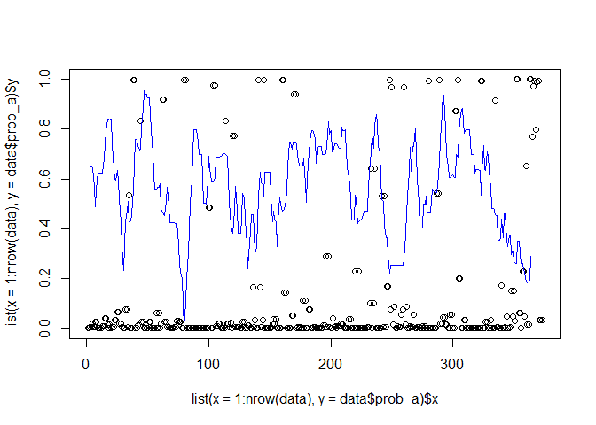

-   [Models for Commit
    Classification](#models-for-commit-classification)
-   [Stateless model](#stateless-model)
    -   [Load and prepare the data](#load-and-prepare-the-data)
    -   [Define how the training works](#define-how-the-training-works)
    -   [Tuning of several models](#tuning-of-several-models)
        -   [Several models: correlation and
            performance](#several-models-correlation-and-performance)
        -   [Several models: train
            candidates](#several-models-train-candidates)
-   [Manual stacking of models](#manual-stacking-of-models)
    -   [Manual neural network](#manual-neural-network)
    -   [Manual stack (ms) using caret](#manual-stack-ms-using-caret)
    -   [Creating an ensemble (es) using
        caretEnsemble](#creating-an-ensemble-es-using-caretensemble)
        -   [Create a linear ensemble](#create-a-linear-ensemble)
-   [Some tests using Angular](#some-tests-using-angular)
-   [References](#references)

    source("../helpers.R")

Models for Commit Classification
================================

In this notebook, we will train and store some best best models for
commit classification, as these will be detrimental to detecting
maintenance activities in software projects. The models will be based on
our latest work (Hönel et al. 2020).

Throughout this notebook, we will build a few models that are all
similar. Our latest work indicated that including up to three previous
generations of commits is beneficial. We will evaluate models that
include 1, 2 or 3 previous generations.

Likewise, we want to go into the other direction, looking forward at
children, using similar amounts of commits. We will call those models
*stateful* in this notebook, and only the model without any adjacent
commits is called *stateless*, but they all belong to the same *class*.
Finally, having a few best models, the overall classifier shall use the
best model for the available data.

For finding the best models, the process is separated into two steps:
First, do a k-fold cross-validation to find the best model and
hyperparameters. Then, use the findings to train a model using the
entire data. Also, we will store the associated scaler/pre-processor for
that model.

Also note that each of the following models was already optimized w.r.t.
to some aspects of the training, like using an already oversampled
dataset. Also, we are using a very high split, as the resulting model
will also be using all data. Using many folds and repeats, we make sure
that overfitting is not a problem.

    ## Loading required package: lattice

    ## Loading required package: ggplot2

Stateless model
===============

The stateless model shall be used whenever there is data available from
the parents or children.

Load and prepare the data
-------------------------

    # the stateless data:
    data_sl <- getDataset("antipat_gt_all")

    # remove SHAs:
    data_sl <- data_sl[, !(names(data_sl) %in% c("SHA1", "ParentCommitSHA1s"))]
    # factorize the labels:
    data_sl$label <- factor(
      x = data_sl$label, levels = sort(unique(data_sl$label)))

The zero-variance predictors should be removed (if any).

    nzv_sl <- caret::nearZeroVar(x = data_sl, saveMetrics = TRUE, names = TRUE)

    print(paste0("Zero-variance predictors to be removed are: ",
                 paste(names(data_sl)[nzv_sl$zeroVar], collapse = ", ")))

    ## [1] "Zero-variance predictors to be removed are: IsInitialCommit, IsMergeCommit, NumberOfParentCommits"

    data_sl <- data_sl[, !nzv_sl$zeroVar]

Define how the training works
-----------------------------

For each type of model, we will use a pre-defined train control.

Instead of sampling during training, we’ll work with a resample of the
entire dataset, using the *synthetic minority over-sampling technique*
(Chawla et al. 2002).

    numFolds <- 5
    numRepeats <- 5

    tc_sl <- caret::trainControl(
      method = "repeatedcv", p = 0.9,
      returnResamp = "all", savePredictions = "all", classProbs = TRUE
      , number = numFolds, repeats = numRepeats
      , seeds = get_seeds(nh = 200, amount = 2 * numFolds * numRepeats)
      #, sampling = "smote"
    )

Tuning of several models
------------------------

We do this step to find which models work well with our data. Later, we
can try to combine the best models into a meta-model.

    ## Registered S3 method overwritten by 'quantmod':
    ##   method            from
    ##   as.zoo.data.frame zoo

    ## Loaded gbm 2.1.8

    ## 
    ## Attaching package: 'dplyr'

    ## The following objects are masked from 'package:plyr':
    ## 
    ##     arrange, count, desc, failwith, id, mutate, rename, summarise,
    ##     summarize

    ## The following objects are masked from 'package:stats':
    ## 
    ##     filter, lag

    ## The following objects are masked from 'package:base':
    ## 
    ##     intersect, setdiff, setequal, union

    ## randomForest 4.6-14

    ## Type rfNews() to see new features/changes/bug fixes.

    ## 
    ## Attaching package: 'randomForest'

    ## The following object is masked from 'package:dplyr':
    ## 
    ##     combine

    ## The following object is masked from 'package:ranger':
    ## 
    ##     importance

    ## The following object is masked from 'package:ggplot2':
    ## 
    ##     margin

    ## naivebayes 0.9.7 loaded

    ## Loading required package: Rcpp

    ## 
    ## Attaching package: 'RSNNS'

    ## The following objects are masked from 'package:caret':
    ## 
    ##     confusionMatrix, train

    ## 
    ## Attaching package: 'kernlab'

    ## The following object is masked from 'package:ggplot2':
    ## 
    ##     alpha

    ## 
    ## Attaching package: 'xgboost'

    ## The following object is masked from 'package:dplyr':
    ## 
    ##     slice

### Several models: correlation and performance

The following will give us a correlation matrix of the models’
predictions. The goal is to find models with high performance and
unrelated predictions, so that they can be combined.

<table style="width:100%;">
<colgroup>
<col style="width: 9%" />
<col style="width: 6%" />
<col style="width: 8%" />
<col style="width: 6%" />
<col style="width: 6%" />
<col style="width: 6%" />
<col style="width: 9%" />
<col style="width: 6%" />
<col style="width: 6%" />
<col style="width: 6%" />
<col style="width: 7%" />
<col style="width: 6%" />
<col style="width: 6%" />
<col style="width: 7%" />
<col style="width: 3%" />
</colgroup>
<thead>
<tr class="header">
<th style="text-align: left;"></th>
<th style="text-align: right;">gbm</th>
<th style="text-align: right;">LogitBoost</th>
<th style="text-align: right;">C5.0</th>
<th style="text-align: right;">rf</th>
<th style="text-align: right;">ranger</th>
<th style="text-align: right;">naive_bayes</th>
<th style="text-align: right;">mlp</th>
<th style="text-align: right;">nnet</th>
<th style="text-align: right;">svmPoly</th>
<th style="text-align: right;">svmRadial</th>
<th style="text-align: right;">xgbTree</th>
<th style="text-align: right;">xgbDART</th>
<th style="text-align: right;">xgbLinear</th>
<th style="text-align: right;">null</th>
</tr>
</thead>
<tbody>
<tr class="odd">
<td style="text-align: left;">gbm</td>
<td style="text-align: right;">1.0000</td>
<td style="text-align: right;">-0.1080</td>
<td style="text-align: right;">-0.0689</td>
<td style="text-align: right;">-0.0565</td>
<td style="text-align: right;">0.1566</td>
<td style="text-align: right;">0.0235</td>
<td style="text-align: right;">0.0652</td>
<td style="text-align: right;">0.2570</td>
<td style="text-align: right;">-0.1260</td>
<td style="text-align: right;">0.3147</td>
<td style="text-align: right;">-0.0134</td>
<td style="text-align: right;">-0.2682</td>
<td style="text-align: right;">0.0560</td>
<td style="text-align: right;">NA</td>
</tr>
<tr class="even">
<td style="text-align: left;">LogitBoost</td>
<td style="text-align: right;">-0.1080</td>
<td style="text-align: right;">1.0000</td>
<td style="text-align: right;">-0.0281</td>
<td style="text-align: right;">-0.0979</td>
<td style="text-align: right;">-0.0054</td>
<td style="text-align: right;">-0.0587</td>
<td style="text-align: right;">0.1126</td>
<td style="text-align: right;">0.2848</td>
<td style="text-align: right;">-0.2447</td>
<td style="text-align: right;">-0.1108</td>
<td style="text-align: right;">0.2494</td>
<td style="text-align: right;">-0.0111</td>
<td style="text-align: right;">-0.2253</td>
<td style="text-align: right;">NA</td>
</tr>
<tr class="odd">
<td style="text-align: left;">C5.0</td>
<td style="text-align: right;">-0.0689</td>
<td style="text-align: right;">-0.0281</td>
<td style="text-align: right;">1.0000</td>
<td style="text-align: right;">-0.0565</td>
<td style="text-align: right;">-0.2741</td>
<td style="text-align: right;">-0.2880</td>
<td style="text-align: right;">0.4716</td>
<td style="text-align: right;">0.0728</td>
<td style="text-align: right;">-0.1573</td>
<td style="text-align: right;">0.1220</td>
<td style="text-align: right;">-0.2393</td>
<td style="text-align: right;">0.1322</td>
<td style="text-align: right;">0.0391</td>
<td style="text-align: right;">NA</td>
</tr>
<tr class="even">
<td style="text-align: left;">rf</td>
<td style="text-align: right;">-0.0565</td>
<td style="text-align: right;">-0.0979</td>
<td style="text-align: right;">-0.0565</td>
<td style="text-align: right;">1.0000</td>
<td style="text-align: right;">-0.1473</td>
<td style="text-align: right;">0.3730</td>
<td style="text-align: right;">-0.0736</td>
<td style="text-align: right;">0.0485</td>
<td style="text-align: right;">-0.2841</td>
<td style="text-align: right;">0.4284</td>
<td style="text-align: right;">0.2115</td>
<td style="text-align: right;">-0.3900</td>
<td style="text-align: right;">0.2076</td>
<td style="text-align: right;">NA</td>
</tr>
<tr class="odd">
<td style="text-align: left;">ranger</td>
<td style="text-align: right;">0.1566</td>
<td style="text-align: right;">-0.0054</td>
<td style="text-align: right;">-0.2741</td>
<td style="text-align: right;">-0.1473</td>
<td style="text-align: right;">1.0000</td>
<td style="text-align: right;">-0.0075</td>
<td style="text-align: right;">-0.4465</td>
<td style="text-align: right;">0.1069</td>
<td style="text-align: right;">0.2096</td>
<td style="text-align: right;">-0.2944</td>
<td style="text-align: right;">-0.1651</td>
<td style="text-align: right;">0.1307</td>
<td style="text-align: right;">-0.2322</td>
<td style="text-align: right;">NA</td>
</tr>
<tr class="even">
<td style="text-align: left;">naive_bayes</td>
<td style="text-align: right;">0.0235</td>
<td style="text-align: right;">-0.0587</td>
<td style="text-align: right;">-0.2880</td>
<td style="text-align: right;">0.3730</td>
<td style="text-align: right;">-0.0075</td>
<td style="text-align: right;">1.0000</td>
<td style="text-align: right;">0.0956</td>
<td style="text-align: right;">-0.1905</td>
<td style="text-align: right;">0.2341</td>
<td style="text-align: right;">0.3539</td>
<td style="text-align: right;">0.0449</td>
<td style="text-align: right;">0.2583</td>
<td style="text-align: right;">-0.1731</td>
<td style="text-align: right;">NA</td>
</tr>
<tr class="odd">
<td style="text-align: left;">mlp</td>
<td style="text-align: right;">0.0652</td>
<td style="text-align: right;">0.1126</td>
<td style="text-align: right;">0.4716</td>
<td style="text-align: right;">-0.0736</td>
<td style="text-align: right;">-0.4465</td>
<td style="text-align: right;">0.0956</td>
<td style="text-align: right;">1.0000</td>
<td style="text-align: right;">0.1516</td>
<td style="text-align: right;">0.0764</td>
<td style="text-align: right;">-0.0435</td>
<td style="text-align: right;">0.0007</td>
<td style="text-align: right;">0.0966</td>
<td style="text-align: right;">-0.0618</td>
<td style="text-align: right;">NA</td>
</tr>
<tr class="even">
<td style="text-align: left;">nnet</td>
<td style="text-align: right;">0.2570</td>
<td style="text-align: right;">0.2848</td>
<td style="text-align: right;">0.0728</td>
<td style="text-align: right;">0.0485</td>
<td style="text-align: right;">0.1069</td>
<td style="text-align: right;">-0.1905</td>
<td style="text-align: right;">0.1516</td>
<td style="text-align: right;">1.0000</td>
<td style="text-align: right;">-0.4363</td>
<td style="text-align: right;">0.0694</td>
<td style="text-align: right;">0.0475</td>
<td style="text-align: right;">-0.2216</td>
<td style="text-align: right;">-0.0691</td>
<td style="text-align: right;">NA</td>
</tr>
<tr class="odd">
<td style="text-align: left;">svmPoly</td>
<td style="text-align: right;">-0.1260</td>
<td style="text-align: right;">-0.2447</td>
<td style="text-align: right;">-0.1573</td>
<td style="text-align: right;">-0.2841</td>
<td style="text-align: right;">0.2096</td>
<td style="text-align: right;">0.2341</td>
<td style="text-align: right;">0.0764</td>
<td style="text-align: right;">-0.4363</td>
<td style="text-align: right;">1.0000</td>
<td style="text-align: right;">-0.2885</td>
<td style="text-align: right;">-0.1363</td>
<td style="text-align: right;">0.5035</td>
<td style="text-align: right;">0.0248</td>
<td style="text-align: right;">NA</td>
</tr>
<tr class="even">
<td style="text-align: left;">svmRadial</td>
<td style="text-align: right;">0.3147</td>
<td style="text-align: right;">-0.1108</td>
<td style="text-align: right;">0.1220</td>
<td style="text-align: right;">0.4284</td>
<td style="text-align: right;">-0.2944</td>
<td style="text-align: right;">0.3539</td>
<td style="text-align: right;">-0.0435</td>
<td style="text-align: right;">0.0694</td>
<td style="text-align: right;">-0.2885</td>
<td style="text-align: right;">1.0000</td>
<td style="text-align: right;">0.2385</td>
<td style="text-align: right;">-0.1412</td>
<td style="text-align: right;">0.1629</td>
<td style="text-align: right;">NA</td>
</tr>
<tr class="odd">
<td style="text-align: left;">xgbTree</td>
<td style="text-align: right;">-0.0134</td>
<td style="text-align: right;">0.2494</td>
<td style="text-align: right;">-0.2393</td>
<td style="text-align: right;">0.2115</td>
<td style="text-align: right;">-0.1651</td>
<td style="text-align: right;">0.0449</td>
<td style="text-align: right;">0.0007</td>
<td style="text-align: right;">0.0475</td>
<td style="text-align: right;">-0.1363</td>
<td style="text-align: right;">0.2385</td>
<td style="text-align: right;">1.0000</td>
<td style="text-align: right;">-0.1642</td>
<td style="text-align: right;">-0.0954</td>
<td style="text-align: right;">NA</td>
</tr>
<tr class="even">
<td style="text-align: left;">xgbDART</td>
<td style="text-align: right;">-0.2682</td>
<td style="text-align: right;">-0.0111</td>
<td style="text-align: right;">0.1322</td>
<td style="text-align: right;">-0.3900</td>
<td style="text-align: right;">0.1307</td>
<td style="text-align: right;">0.2583</td>
<td style="text-align: right;">0.0966</td>
<td style="text-align: right;">-0.2216</td>
<td style="text-align: right;">0.5035</td>
<td style="text-align: right;">-0.1412</td>
<td style="text-align: right;">-0.1642</td>
<td style="text-align: right;">1.0000</td>
<td style="text-align: right;">-0.3693</td>
<td style="text-align: right;">NA</td>
</tr>
<tr class="odd">
<td style="text-align: left;">xgbLinear</td>
<td style="text-align: right;">0.0560</td>
<td style="text-align: right;">-0.2253</td>
<td style="text-align: right;">0.0391</td>
<td style="text-align: right;">0.2076</td>
<td style="text-align: right;">-0.2322</td>
<td style="text-align: right;">-0.1731</td>
<td style="text-align: right;">-0.0618</td>
<td style="text-align: right;">-0.0691</td>
<td style="text-align: right;">0.0248</td>
<td style="text-align: right;">0.1629</td>
<td style="text-align: right;">-0.0954</td>
<td style="text-align: right;">-0.3693</td>
<td style="text-align: right;">1.0000</td>
<td style="text-align: right;">NA</td>
</tr>
<tr class="even">
<td style="text-align: left;">null</td>
<td style="text-align: right;">NA</td>
<td style="text-align: right;">NA</td>
<td style="text-align: right;">NA</td>
<td style="text-align: right;">NA</td>
<td style="text-align: right;">NA</td>
<td style="text-align: right;">NA</td>
<td style="text-align: right;">NA</td>
<td style="text-align: right;">NA</td>
<td style="text-align: right;">NA</td>
<td style="text-align: right;">NA</td>
<td style="text-align: right;">NA</td>
<td style="text-align: right;">NA</td>
<td style="text-align: right;">NA</td>
<td style="text-align: right;">1</td>
</tr>
</tbody>
</table>

Show for each model the performance during training, and also predict on
our validation data to get an idea of their goodness.

### Several models: train candidates

Using a selection of the best models, we will train a corresponding best
model using the best-working hyperparameters. These models will then be
evaluated below and used in the stacking attempts.

    models_sl <- loadResultsOrCompute(file = "../results/models_sl.rds", computeExpr = {
      res <- list()

      for (modelName in names(results_sl)) {
        m <- results_sl[[modelName]]
        
        res[[modelName]] <- caretFitOneModeltoAllData(
          method = modelName, tuneGrid = m$bestTune,
          data = train_sl)
      }
      
      res
    })

As for predicting on validation data, we will use the models that were
fit to the entire training data.

    generateModelOverview(results_sl, models_sl, validationData = valid_sl)

<table>
<colgroup>
<col style="width: 12%" />
<col style="width: 10%" />
<col style="width: 12%" />
<col style="width: 7%" />
<col style="width: 16%" />
<col style="width: 19%" />
<col style="width: 10%" />
<col style="width: 12%" />
</colgroup>
<thead>
<tr class="header">
<th style="text-align: left;">model</th>
<th style="text-align: right;">train_acc</th>
<th style="text-align: right;">train_Kappa</th>
<th style="text-align: left;">predNA</th>
<th style="text-align: right;">valid_acc_witNA</th>
<th style="text-align: right;">valid_Kappa_withNA</th>
<th style="text-align: right;">valid_acc</th>
<th style="text-align: right;">valid_Kappa</th>
</tr>
</thead>
<tbody>
<tr class="odd">
<td style="text-align: left;">gbm</td>
<td style="text-align: right;">0.8030769</td>
<td style="text-align: right;">0.7046154</td>
<td style="text-align: left;">FALSE</td>
<td style="text-align: right;">0.8059701</td>
<td style="text-align: right;">0.6971488</td>
<td style="text-align: right;">0.8059701</td>
<td style="text-align: right;">0.6971488</td>
</tr>
<tr class="even">
<td style="text-align: left;">LogitBoost</td>
<td style="text-align: right;">0.8219242</td>
<td style="text-align: right;">0.7282709</td>
<td style="text-align: left;">TRUE</td>
<td style="text-align: right;">0.7611940</td>
<td style="text-align: right;">0.6199929</td>
<td style="text-align: right;">0.8666667</td>
<td style="text-align: right;">0.7906977</td>
</tr>
<tr class="odd">
<td style="text-align: left;">C5.0</td>
<td style="text-align: right;">0.8035897</td>
<td style="text-align: right;">0.7053846</td>
<td style="text-align: left;">FALSE</td>
<td style="text-align: right;">0.7761194</td>
<td style="text-align: right;">0.6479860</td>
<td style="text-align: right;">0.7761194</td>
<td style="text-align: right;">0.6479860</td>
</tr>
<tr class="even">
<td style="text-align: left;">rf</td>
<td style="text-align: right;">0.8023077</td>
<td style="text-align: right;">0.7034615</td>
<td style="text-align: left;">FALSE</td>
<td style="text-align: right;">0.7462687</td>
<td style="text-align: right;">0.6057459</td>
<td style="text-align: right;">0.7462687</td>
<td style="text-align: right;">0.6057459</td>
</tr>
<tr class="odd">
<td style="text-align: left;">ranger</td>
<td style="text-align: right;">0.8184615</td>
<td style="text-align: right;">0.7276923</td>
<td style="text-align: left;">FALSE</td>
<td style="text-align: right;">0.8208955</td>
<td style="text-align: right;">0.7217030</td>
<td style="text-align: right;">0.8208955</td>
<td style="text-align: right;">0.7217030</td>
</tr>
<tr class="even">
<td style="text-align: left;">naive_bayes</td>
<td style="text-align: right;">0.5038462</td>
<td style="text-align: right;">0.2557692</td>
<td style="text-align: left;">FALSE</td>
<td style="text-align: right;">0.5671642</td>
<td style="text-align: right;">0.3075552</td>
<td style="text-align: right;">0.5671642</td>
<td style="text-align: right;">0.3075552</td>
</tr>
<tr class="odd">
<td style="text-align: left;">mlp</td>
<td style="text-align: right;">0.7646154</td>
<td style="text-align: right;">0.6469231</td>
<td style="text-align: left;">FALSE</td>
<td style="text-align: right;">0.7462687</td>
<td style="text-align: right;">0.6062910</td>
<td style="text-align: right;">0.7462687</td>
<td style="text-align: right;">0.6062910</td>
</tr>
<tr class="even">
<td style="text-align: left;">nnet</td>
<td style="text-align: right;">0.7584615</td>
<td style="text-align: right;">0.6376923</td>
<td style="text-align: left;">FALSE</td>
<td style="text-align: right;">0.7164179</td>
<td style="text-align: right;">0.5541156</td>
<td style="text-align: right;">0.7164179</td>
<td style="text-align: right;">0.5541156</td>
</tr>
<tr class="odd">
<td style="text-align: left;">svmPoly</td>
<td style="text-align: right;">0.7619231</td>
<td style="text-align: right;">0.6428846</td>
<td style="text-align: left;">FALSE</td>
<td style="text-align: right;">0.7462687</td>
<td style="text-align: right;">0.6097979</td>
<td style="text-align: right;">0.7462687</td>
<td style="text-align: right;">0.6097979</td>
</tr>
<tr class="even">
<td style="text-align: left;">svmRadial</td>
<td style="text-align: right;">0.7496154</td>
<td style="text-align: right;">0.6244231</td>
<td style="text-align: left;">FALSE</td>
<td style="text-align: right;">0.6716418</td>
<td style="text-align: right;">0.4897889</td>
<td style="text-align: right;">0.6716418</td>
<td style="text-align: right;">0.4897889</td>
</tr>
<tr class="odd">
<td style="text-align: left;">xgbTree</td>
<td style="text-align: right;">0.8201282</td>
<td style="text-align: right;">0.7301923</td>
<td style="text-align: left;">FALSE</td>
<td style="text-align: right;">0.7164179</td>
<td style="text-align: right;">0.5545836</td>
<td style="text-align: right;">0.7164179</td>
<td style="text-align: right;">0.5545836</td>
</tr>
<tr class="even">
<td style="text-align: left;">xgbDART</td>
<td style="text-align: right;">0.8160256</td>
<td style="text-align: right;">0.7240385</td>
<td style="text-align: left;">FALSE</td>
<td style="text-align: right;">0.7164179</td>
<td style="text-align: right;">0.5506530</td>
<td style="text-align: right;">0.7164179</td>
<td style="text-align: right;">0.5506530</td>
</tr>
<tr class="odd">
<td style="text-align: left;">xgbLinear</td>
<td style="text-align: right;">0.8169231</td>
<td style="text-align: right;">0.7253846</td>
<td style="text-align: left;">FALSE</td>
<td style="text-align: right;">0.7014925</td>
<td style="text-align: right;">0.5273369</td>
<td style="text-align: right;">0.7014925</td>
<td style="text-align: right;">0.5273369</td>
</tr>
<tr class="even">
<td style="text-align: left;">null</td>
<td style="text-align: right;">0.3333333</td>
<td style="text-align: right;">0.0000000</td>
<td style="text-align: left;">FALSE</td>
<td style="text-align: right;">0.2089552</td>
<td style="text-align: right;">0.0000000</td>
<td style="text-align: right;">0.2089552</td>
<td style="text-align: right;">0.0000000</td>
</tr>
</tbody>
</table>

Manual stacking of models
=========================

While there are methods to train an ensemble classifier, we are
attempting this first manually. Using some of the best and most
uncorrelated models from the previous section, we will train a meta
model based on these models’ outputs. For that, we need a dataset. It
will be generated by predicting class probabilities from each single
model.

    data_stack_train_sl <- data.frame(matrix(ncol = 0, nrow = nrow(train_sl)))
    data_stack_valid_sl <- data.frame(matrix(ncol = 0, nrow = nrow(valid_sl)))

    # The name of the models to use from the previous section:
    #stack_manual_models <- names(results_sl)[
    #  !(names(results_sl) %in% c("naive_bayes", "mlp", "nnet", "svmPoly", "svmRadial", "xgbTree", "xgbLinear"))]
    #stack_manual_models <- c("LogitBoost", "gbm", "xgbDART", "mlp") # <- This appears to work best
    stack_manual_models <- c("LogitBoost", "gbm", "ranger") # <- This appears to work best

    for (modelName in stack_manual_models) {
      m <- models_sl[[modelName]]
      
      preds <- tryCatch({
        predict(m, train_sl[, !(names(train_sl) %in% c("label"))], type = "prob")
      }, error = function(cond) cond)
      
      preds_valid <- tryCatch({
        predict(m, valid_sl[, !(names(valid_sl) %in% c("label"))], type = "prob")
      }, error = function(cond) cond)
      
      if (any(class(preds) %in% c("simpleError", "error","condition"))) {
        print(paste0("Cannot predict class probabilities for: ", modelName))
      } else {
        colnames(preds) <- paste0(colnames(preds), "_", modelName)
        colnames(preds_valid) <- paste0(colnames(preds_valid), "_", modelName)
        
        data_stack_train_sl <- cbind(data_stack_train_sl, preds)
        data_stack_valid_sl <- cbind(data_stack_valid_sl, preds_valid)
      }
    }

    # Let's append the label-column:
    data_stack_train_sl$label <- train_sl$label
    data_stack_valid_sl$label <- valid_sl$label

Now that we have the data prepared for our manual ensemble, let’s
attempt to train some models.

Manual neural network
---------------------

Before going back to caret, let’s try a neural network the manual way.

    ## 
    ## Attaching package: 'neuralnet'

    ## The following object is masked from 'package:dplyr':
    ## 
    ##     compute

The network has the following structure:

    plot(nnet)

    nnet_pred <- predict(nnet, data_stack_valid_sl)
    colnames(nnet_pred) <- levels(valid_sl$label)

    nnet_pred_label <- factor(
      x = levels(valid_sl$label)[apply(nnet_pred, 1, which.max)],
      levels = levels(valid_sl$label))

    caret::confusionMatrix(valid_sl$label, nnet_pred_label)

    ## Confusion Matrix and Statistics
    ## 
    ##           Reference
    ## Prediction  a  c  p
    ##          a 12  2  0
    ##          c  1 21  5
    ##          p  1  3 22
    ## 
    ## Overall Statistics
    ##                                          
    ##                Accuracy : 0.8209         
    ##                  95% CI : (0.708, 0.9039)
    ##     No Information Rate : 0.403          
    ##     P-Value [Acc > NIR] : 2.801e-12      
    ##                                          
    ##                   Kappa : 0.7217         
    ##                                          
    ##  Mcnemar's Test P-Value : 0.6077         
    ## 
    ## Statistics by Class:
    ## 
    ##                      Class: a Class: c Class: p
    ## Sensitivity            0.8571   0.8077   0.8148
    ## Specificity            0.9623   0.8537   0.9000
    ## Pos Pred Value         0.8571   0.7778   0.8462
    ## Neg Pred Value         0.9623   0.8750   0.8780
    ## Prevalence             0.2090   0.3881   0.4030
    ## Detection Rate         0.1791   0.3134   0.3284
    ## Detection Prevalence   0.2090   0.4030   0.3881
    ## Balanced Accuracy      0.9097   0.8307   0.8574

While it works, the results are not better than those from the
individual models.

Manual stack (ms) using caret
-----------------------------

Let’s attempt to learn a meta-model using caret.

For the next overview, again, fit the selected single models using their
best tune and all available training data.

Now show the overview:

    generateModelOverview(results_ms, models_ms, validationData = data_stack_valid_sl)

<table style="width:100%;">
<colgroup>
<col style="width: 11%" />
<col style="width: 10%" />
<col style="width: 12%" />
<col style="width: 7%" />
<col style="width: 16%" />
<col style="width: 19%" />
<col style="width: 10%" />
<col style="width: 12%" />
</colgroup>
<thead>
<tr class="header">
<th style="text-align: left;">model</th>
<th style="text-align: right;">train_acc</th>
<th style="text-align: right;">train_Kappa</th>
<th style="text-align: left;">predNA</th>
<th style="text-align: right;">valid_acc_witNA</th>
<th style="text-align: right;">valid_Kappa_withNA</th>
<th style="text-align: right;">valid_acc</th>
<th style="text-align: right;">valid_Kappa</th>
</tr>
</thead>
<tbody>
<tr class="odd">
<td style="text-align: left;">gbm</td>
<td style="text-align: right;">0.9928205</td>
<td style="text-align: right;">0.9892308</td>
<td style="text-align: left;">FALSE</td>
<td style="text-align: right;">0.8208955</td>
<td style="text-align: right;">0.7217030</td>
<td style="text-align: right;">0.8208955</td>
<td style="text-align: right;">0.7217030</td>
</tr>
<tr class="even">
<td style="text-align: left;">LogitBoost</td>
<td style="text-align: right;">0.9930732</td>
<td style="text-align: right;">0.9896098</td>
<td style="text-align: left;">FALSE</td>
<td style="text-align: right;">0.7910448</td>
<td style="text-align: right;">0.6767746</td>
<td style="text-align: right;">0.7910448</td>
<td style="text-align: right;">0.6767746</td>
</tr>
<tr class="odd">
<td style="text-align: left;">ranger</td>
<td style="text-align: right;">0.9929487</td>
<td style="text-align: right;">0.9894231</td>
<td style="text-align: left;">FALSE</td>
<td style="text-align: right;">0.8208955</td>
<td style="text-align: right;">0.7217030</td>
<td style="text-align: right;">0.8208955</td>
<td style="text-align: right;">0.7217030</td>
</tr>
<tr class="even">
<td style="text-align: left;">mlp</td>
<td style="text-align: right;">0.9932051</td>
<td style="text-align: right;">0.9898077</td>
<td style="text-align: left;">FALSE</td>
<td style="text-align: right;">0.8358209</td>
<td style="text-align: right;">0.7448944</td>
<td style="text-align: right;">0.8358209</td>
<td style="text-align: right;">0.7448944</td>
</tr>
<tr class="odd">
<td style="text-align: left;">nnet</td>
<td style="text-align: right;">0.9930769</td>
<td style="text-align: right;">0.9896154</td>
<td style="text-align: left;">FALSE</td>
<td style="text-align: right;">0.8358209</td>
<td style="text-align: right;">0.7448944</td>
<td style="text-align: right;">0.8358209</td>
<td style="text-align: right;">0.7448944</td>
</tr>
<tr class="even">
<td style="text-align: left;">svmRadial</td>
<td style="text-align: right;">0.9939744</td>
<td style="text-align: right;">0.9909615</td>
<td style="text-align: left;">FALSE</td>
<td style="text-align: right;">0.7611940</td>
<td style="text-align: right;">0.6288089</td>
<td style="text-align: right;">0.7611940</td>
<td style="text-align: right;">0.6288089</td>
</tr>
</tbody>
</table>

The overview for all models, using oversampled training data, was this:

    results_ms_all <- readRDS("../results/ms_all.rds")
    models_ms_all <- readRDS("../results/models_ms_all.rds")

    generateModelOverview(results_ms_all, models_ms_all, validationData = data_stack_valid_sl)

<table>
<colgroup>
<col style="width: 12%" />
<col style="width: 10%" />
<col style="width: 12%" />
<col style="width: 7%" />
<col style="width: 16%" />
<col style="width: 19%" />
<col style="width: 10%" />
<col style="width: 12%" />
</colgroup>
<thead>
<tr class="header">
<th style="text-align: left;">model</th>
<th style="text-align: right;">train_acc</th>
<th style="text-align: right;">train_Kappa</th>
<th style="text-align: left;">predNA</th>
<th style="text-align: right;">valid_acc_witNA</th>
<th style="text-align: right;">valid_Kappa_withNA</th>
<th style="text-align: right;">valid_acc</th>
<th style="text-align: right;">valid_Kappa</th>
</tr>
</thead>
<tbody>
<tr class="odd">
<td style="text-align: left;">gbm</td>
<td style="text-align: right;">0.9932051</td>
<td style="text-align: right;">0.9898077</td>
<td style="text-align: left;">FALSE</td>
<td style="text-align: right;">0.8208955</td>
<td style="text-align: right;">0.7217030</td>
<td style="text-align: right;">0.8208955</td>
<td style="text-align: right;">0.7217030</td>
</tr>
<tr class="even">
<td style="text-align: left;">LogitBoost</td>
<td style="text-align: right;">0.9930732</td>
<td style="text-align: right;">0.9896098</td>
<td style="text-align: left;">FALSE</td>
<td style="text-align: right;">0.7910448</td>
<td style="text-align: right;">0.6767746</td>
<td style="text-align: right;">0.7910448</td>
<td style="text-align: right;">0.6767746</td>
</tr>
<tr class="odd">
<td style="text-align: left;">C5.0</td>
<td style="text-align: right;">0.9921795</td>
<td style="text-align: right;">0.9882692</td>
<td style="text-align: left;">FALSE</td>
<td style="text-align: right;">0.8059701</td>
<td style="text-align: right;">0.6997587</td>
<td style="text-align: right;">0.8059701</td>
<td style="text-align: right;">0.6997587</td>
</tr>
<tr class="even">
<td style="text-align: left;">ranger</td>
<td style="text-align: right;">0.9932051</td>
<td style="text-align: right;">0.9898077</td>
<td style="text-align: left;">FALSE</td>
<td style="text-align: right;">0.8208955</td>
<td style="text-align: right;">0.7217030</td>
<td style="text-align: right;">0.8208955</td>
<td style="text-align: right;">0.7217030</td>
</tr>
<tr class="odd">
<td style="text-align: left;">rf</td>
<td style="text-align: right;">0.9932051</td>
<td style="text-align: right;">0.9898077</td>
<td style="text-align: left;">FALSE</td>
<td style="text-align: right;">0.8208955</td>
<td style="text-align: right;">0.7217030</td>
<td style="text-align: right;">0.8208955</td>
<td style="text-align: right;">0.7217030</td>
</tr>
<tr class="even">
<td style="text-align: left;">naive_bayes</td>
<td style="text-align: right;">0.9908974</td>
<td style="text-align: right;">0.9863462</td>
<td style="text-align: left;">FALSE</td>
<td style="text-align: right;">0.8059701</td>
<td style="text-align: right;">0.6972541</td>
<td style="text-align: right;">0.8059701</td>
<td style="text-align: right;">0.6972541</td>
</tr>
<tr class="odd">
<td style="text-align: left;">mlp</td>
<td style="text-align: right;">0.9929487</td>
<td style="text-align: right;">0.9894231</td>
<td style="text-align: left;">FALSE</td>
<td style="text-align: right;">0.7910448</td>
<td style="text-align: right;">0.6749827</td>
<td style="text-align: right;">0.7910448</td>
<td style="text-align: right;">0.6749827</td>
</tr>
<tr class="even">
<td style="text-align: left;">nnet</td>
<td style="text-align: right;">0.9929487</td>
<td style="text-align: right;">0.9894231</td>
<td style="text-align: left;">FALSE</td>
<td style="text-align: right;">0.8358209</td>
<td style="text-align: right;">0.7448944</td>
<td style="text-align: right;">0.8358209</td>
<td style="text-align: right;">0.7448944</td>
</tr>
<tr class="odd">
<td style="text-align: left;">svmPoly</td>
<td style="text-align: right;">0.9942308</td>
<td style="text-align: right;">0.9913462</td>
<td style="text-align: left;">FALSE</td>
<td style="text-align: right;">0.8059701</td>
<td style="text-align: right;">0.6998622</td>
<td style="text-align: right;">0.8059701</td>
<td style="text-align: right;">0.6998622</td>
</tr>
<tr class="even">
<td style="text-align: left;">svmRadial</td>
<td style="text-align: right;">0.9941026</td>
<td style="text-align: right;">0.9911538</td>
<td style="text-align: left;">FALSE</td>
<td style="text-align: right;">0.7761194</td>
<td style="text-align: right;">0.6534483</td>
<td style="text-align: right;">0.7761194</td>
<td style="text-align: right;">0.6534483</td>
</tr>
<tr class="odd">
<td style="text-align: left;">xgbTree</td>
<td style="text-align: right;">0.9930769</td>
<td style="text-align: right;">0.9896154</td>
<td style="text-align: left;">FALSE</td>
<td style="text-align: right;">0.8059701</td>
<td style="text-align: right;">0.6972541</td>
<td style="text-align: right;">0.8059701</td>
<td style="text-align: right;">0.6972541</td>
</tr>
<tr class="even">
<td style="text-align: left;">xgbDART</td>
<td style="text-align: right;">0.9937179</td>
<td style="text-align: right;">0.9905769</td>
<td style="text-align: left;">FALSE</td>
<td style="text-align: right;">0.8059701</td>
<td style="text-align: right;">0.6972541</td>
<td style="text-align: right;">0.8059701</td>
<td style="text-align: right;">0.6972541</td>
</tr>
<tr class="odd">
<td style="text-align: left;">xgbLinear</td>
<td style="text-align: right;">0.9929487</td>
<td style="text-align: right;">0.9894231</td>
<td style="text-align: left;">FALSE</td>
<td style="text-align: right;">0.8208955</td>
<td style="text-align: right;">0.7217030</td>
<td style="text-align: right;">0.8208955</td>
<td style="text-align: right;">0.7217030</td>
</tr>
</tbody>
</table>

    results_ms_all <- NULL
    models_ms_all <- NULL

It appears that the manual stacking was slightly useful, and we decide
to use the `nnet` meta-model, that is based on the single
modelsLogitBoost, gbm, ranger, as the final models. Remember that the
single models produce predictions as to the class membership on the
original data, and these are fed into the meta-model (the pipeline is:
predict class memberships (once using each single model), combine all
votes into a new dataset, predict final label based on these votes
(using the meta model)).

    create_final_model <- function() {
      # The meta-model from the manual stacking:
      meta_model <- models_ms$nnet
      # The single models from earlier training:
      single_models <- models_sl[stack_manual_models]
      
      predict_class_membership <- function(data, modelList = single_models, labelCol = "label") {
        dataLabel <- if (labelCol %in% colnames(data)) data[[labelCol]] else matrix(ncol = 0, nrow = nrow(data))
        data <- data[, !(names(data) %in% labelCol)]
        dataCM <- data.frame(matrix(ncol = 0, nrow = nrow(data)))
        
        for (modelName in names(modelList)) {
          m <- modelList[[modelName]]
          temp <- stats::predict(m, data, type = "prob")
          colnames(temp) <- paste0(colnames(temp), "_", modelName)
          dataCM <- cbind(dataCM, temp)
        }
        
        return(cbind(dataCM, dataLabel))
      }
      
      predict <- function(data, labelCol = "label", type = c("raw", "prob", "both")) {
        type <- type[1]
        dataCM <- predict_class_membership(data = data, labelCol = labelCol)
        res <- data.frame(matrix(ncol = 0, nrow = nrow(data)))
        
        doRaw <- type == "raw"
        doProb <- type == "prob"
        
        asRaw <- stats::predict(meta_model, dataCM, type = "raw")
        asProb <- stats::predict(meta_model, dataCM, type = "prob")
        if (is.factor(data[[labelCol]])) {
          colnames(asProb) <- levels(data[[labelCol]])
        }
        
        if (doRaw) {
          return(asRaw)
        } else if (doProb) {
          return(asProb)
        }
        
        # Both:
        res <- cbind(res, asRaw)
        colnames(res) <- labelCol
        res <- cbind(res, asProb)
        return(res)
      }
      
      return(list(
        meta_model = meta_model,
        single_models = single_models,
        predict_class_membership = predict_class_membership,
        predict = predict
      ))
    }

    final_model <- create_final_model()

    saveRDS(final_model, file = "../results/final_model.rds")

A quick test of the final model:

    caret::confusionMatrix(final_model$predict(train_sl), train_sl$label)

    ## Confusion Matrix and Statistics
    ## 
    ##           Reference
    ## Prediction   a   c   p
    ##          a 519   1   0
    ##          c   0 514   2
    ##          p   1   5 518
    ## 
    ## Overall Statistics
    ##                                           
    ##                Accuracy : 0.9942          
    ##                  95% CI : (0.9891, 0.9974)
    ##     No Information Rate : 0.3333          
    ##     P-Value [Acc > NIR] : <2e-16          
    ##                                           
    ##                   Kappa : 0.9913          
    ##                                           
    ##  Mcnemar's Test P-Value : 0.3496          
    ## 
    ## Statistics by Class:
    ## 
    ##                      Class: a Class: c Class: p
    ## Sensitivity            0.9981   0.9885   0.9962
    ## Specificity            0.9990   0.9981   0.9942
    ## Pos Pred Value         0.9981   0.9961   0.9885
    ## Neg Pred Value         0.9990   0.9943   0.9981
    ## Prevalence             0.3333   0.3333   0.3333
    ## Detection Rate         0.3327   0.3295   0.3321
    ## Detection Prevalence   0.3333   0.3308   0.3359
    ## Balanced Accuracy      0.9986   0.9933   0.9952

    head(final_model$predict(valid_sl, type = "both"))

<table>
<thead>
<tr class="header">
<th style="text-align: left;">label</th>
<th style="text-align: right;">a</th>
<th style="text-align: right;">c</th>
<th style="text-align: right;">p</th>
</tr>
</thead>
<tbody>
<tr class="odd">
<td style="text-align: left;">c</td>
<td style="text-align: right;">0.0012107</td>
<td style="text-align: right;">0.9972771</td>
<td style="text-align: right;">0.0015122</td>
</tr>
<tr class="even">
<td style="text-align: left;">c</td>
<td style="text-align: right;">0.0008457</td>
<td style="text-align: right;">0.9979259</td>
<td style="text-align: right;">0.0012284</td>
</tr>
<tr class="odd">
<td style="text-align: left;">c</td>
<td style="text-align: right;">0.0137335</td>
<td style="text-align: right;">0.9410197</td>
<td style="text-align: right;">0.0452468</td>
</tr>
<tr class="even">
<td style="text-align: left;">a</td>
<td style="text-align: right;">0.9983508</td>
<td style="text-align: right;">0.0006940</td>
<td style="text-align: right;">0.0009553</td>
</tr>
<tr class="odd">
<td style="text-align: left;">p</td>
<td style="text-align: right;">0.0275879</td>
<td style="text-align: right;">0.3715442</td>
<td style="text-align: right;">0.6008679</td>
</tr>
<tr class="even">
<td style="text-align: left;">c</td>
<td style="text-align: right;">0.0011113</td>
<td style="text-align: right;">0.9973306</td>
<td style="text-align: right;">0.0015581</td>
</tr>
</tbody>
</table>

    caret::confusionMatrix(final_model$predict(valid_sl), valid_sl$label)

    ## Confusion Matrix and Statistics
    ## 
    ##           Reference
    ## Prediction  a  c  p
    ##          a 12  1  1
    ##          c  1 22  3
    ##          p  1  4 22
    ## 
    ## Overall Statistics
    ##                                           
    ##                Accuracy : 0.8358          
    ##                  95% CI : (0.7252, 0.9151)
    ##     No Information Rate : 0.403           
    ##     P-Value [Acc > NIR] : 3.986e-13       
    ##                                           
    ##                   Kappa : 0.7449          
    ##                                           
    ##  Mcnemar's Test P-Value : 0.9862          
    ## 
    ## Statistics by Class:
    ## 
    ##                      Class: a Class: c Class: p
    ## Sensitivity            0.8571   0.8148   0.8462
    ## Specificity            0.9623   0.9000   0.8780
    ## Pos Pred Value         0.8571   0.8462   0.8148
    ## Neg Pred Value         0.9623   0.8780   0.9000
    ## Prevalence             0.2090   0.4030   0.3881
    ## Detection Rate         0.1791   0.3284   0.3284
    ## Detection Prevalence   0.2090   0.3881   0.4030
    ## Balanced Accuracy      0.9097   0.8574   0.8621

Creating an ensemble (es) using caretEnsemble
---------------------------------------------

The last thing to do is creating an ensemble using `caretEnsemble`.
**NOTE**: Unfortunately, that package does not supports multi-class
problems, and we will not attempt to modify the problem to fit the model
at this time. The following tests below do not work.

    ## 
    ## Attaching package: 'caretEnsemble'

    ## The following object is masked from 'package:ggplot2':
    ## 
    ##     autoplot

Now let’s create a list of models we would like to use.

### Create a linear ensemble

Using the list of trained models from the previous section, we create an
ensemble that is a linear combination of all models.

    #model_es_linear <- caretEnsemble::caretStack(
    #  all.models = es_list,
    #  method = "glm",
    #  #metric = "Accuracy",
    #  trControl = caret::trainControl(
    #    classProbs = TRUE)
    #)
    #
    #summary(model_es_linear)

Some tests using Angular
========================

Let’s load the data we extracted using *Git-Tools* from the Angular
repository (begin 2020 - now). After loading, we will predict the
maintenance activity and save the file.

    # GitTools.exe -r C:\temp\angular\ -o 'C:\temp\angular.csv' -s '2019-01-01 00:00'
    dateFormat <- "%Y-%m-%d %H:%M:%S"
    angularFile <- "../data/angular.csv"
    angular <- read.csv(angularFile)
    temp <- final_model$predict(data = angular, type = "both")
    angular$label <- temp$label
    angular$prob_a <- temp$a
    angular$prob_c <- temp$c
    angular$prob_p <- temp$p

    angular$CommitterTimeObj <- strptime(
      angular$CommitterTime, format = dateFormat)
    angular$AuthorTimeObj <- strptime(
      angular$AuthorTime, format = dateFormat)

    write.csv(angular, file = angularFile, row.names = FALSE)

    table(angular$label)

    ## 
    ##    a    c    p 
    ## 1533 5819 3862

Let’s attempt some straightforward density plots for each activity,
using the relative timestamp of each commit.

    ggplot2::ggplot(
      #data = angular[angular$AuthorTimeUnixEpochMilliSecs <= 1.57e12, ],
      data = angular[angular$AuthorTimeObj < as.POSIXct("2019-11-01"), ],
      ggplot2::aes(
        AuthorTimeUnixEpochMilliSecs, color = label, fill = label)) +
      ggplot2::geom_density(size = 1, alpha = 0.5)#, position = "fill")

    ggplot2::ggplot(
      #data = angular[angular$AuthorTimeUnixEpochMilliSecs <= 1.57e12, ],
      data = angular[angular$AuthorTimeObj >= as.POSIXct("2019-11-01"), ],
      ggplot2::aes(
        AuthorTimeUnixEpochMilliSecs, color = label, fill = label)) +
      ggplot2::geom_density(size = 1, alpha = 0.5)#, position = "fill")

It appears that the activities after 2019-11-01 are much more balanced.
Let’s look at a much smaller window:

    temp <- ggplot2::ggplot(
      data = angular[angular$AuthorTimeObj > as.POSIXct("2020-02-03") & angular$AuthorTimeObj <= as.POSIXct("2020-02-23"),],
      ggplot2::aes(
        AuthorTimeUnixEpochMilliSecs, color = label, fill = label))

    temp + ggplot2::geom_density(size = 1, alpha = 0.4)

    temp + ggplot2::geom_density(size = 1, alpha = 0.4, position = "fill")

    temp + ggplot2::geom_density(size = 1, alpha = 0.4, kernel = "rectangular")

    temp + ggplot2::geom_density(size = 1, alpha = 0.4, kernel = "rectangular", position = "fill")

The above plot is a 3-week snapshot, with weeks starting at Monday,
00:00, and ending at Sunday, 23:59. It appears that each week starts
with a somewhat corrective phase. We can see this more easily when using
a rectangular Kernel in a non-filled plot.

Here are some attempts with a rolling mean over the class-probabilities:

    library(zoo)

    ## 
    ## Attaching package: 'zoo'

    ## The following objects are masked from 'package:base':
    ## 
    ##     as.Date, as.Date.numeric

    data<-AirPassengers
    plot(data,main='Simple Moving Average (SMA)',ylab='Passengers')
    lines(rollmean(data,5),col='blue')
    lines(rollmean(data,40),col='red')
    legend(1950,600,col=c('black','blue', 'red'),legend=c('Raw', 'SMA 5', 'SMA 40'),lty=1,cex=0.8)

    data <- angular[angular$AuthorTimeObj > as.POSIXct("2020-02-03") & angular$AuthorTimeObj <= as.POSIXct("2020-02-23"),]

    plot(list(
      #x = as.Date(data$AuthorTimeObj),
      x = 1:nrow(data),
      y = data$prob_a
    ))
    #lines(rollmean(data$prob_c, 5), col='red')
    lines(rollmean(data$prob_c, 10), col='blue')

    #plot(rollmean(data$prob_a, 5))

References
==========

Chawla, Nitesh V, Kevin W Bowyer, Lawrence O Hall, and W Philip
Kegelmeyer. 2002. “SMOTE: Synthetic Minority over-Sampling Technique.”
*Journal of Artificial Intelligence Research* 16: 321–57.

Hönel, Sebastian, Morgan Ericsson, Welf Löwe, and Anna Wingkvist. 2020.
“Using Source Code Density to Improve the Accuracy of Automatic Commit
Classification into Maintenance Activities.” *Journal of Systems and
Software*, 110673.
