-   [Multiple scales](#multiple-scales)
-   [Multi-pattern Tests](#multi-pattern-tests)
    -   [Additional metrics for the warping
        function](#additional-metrics-for-the-warping-function)
-   [Multivariate Tests](#multivariate-tests)

In this notebook we want to conduct two different tests before we put it
all together. First of all, we want to perform multivariate matching to
see whether this has advantages over multiple univariate matches.

Then, we want to find out how `dtw` matches a query if it contains the
reference more than once – it is interesting to us which match is picked
by dtw.

    library(dtw)

Load our common functions:

    source("./common-funcs.R", echo = FALSE)

    getAggStats <- function(dtwAlign, name, ref, query) {
      ex <- extract_signal_from_window(
        dtwAlign = dtwAlign, window = query,
        idxMethod = "smooth", smoothCnt = 3)
      
      f_ref <- pattern_approxfun(ref)
      f_query <- pattern_approxfun(query)
      
      return(cbind(
        data.frame(name = name),
        round(data.frame(
          area = area_diff_2_functions(f_ref, f_query)$value,
          KL_symm = stat_diff_2_functions_symmetric_KL(f_ref, f_query)$value,
          JSD = stat_diff_2_functions_symmetric_JSD(f_ref, f_query)$value,
          JSD_score = 1 - (stat_diff_2_functions_symmetric_JSD(f_ref, f_query)$value / log(2)),
          mono_rel = ex$monotonicity_rel,
          corr = stat_diff_2_functions_cor(f_ref, f_query)$value,
          sd = stat_diff_2_functions_sd(f_ref, f_query)$value,
          mae = stat_diff_2_functions_mae(f_ref, f_query)$value
        ), 5)
      ))
    }

Multiple scales
===============

We want to measure how well `dtw` performs if the the reference/query
are distorted (clinched or distorted). We will try linear distortions.
Horizontal and vertical distortions are hence anti-proportional to each
other, so that we will only manipulate along one axis in the following
examples.

    set.seed(2)

    ref1 <- density(rnorm(1000, mean = 3), n = 256)

    ref1_signal <- list(
      x = 1:length(ref1$x),
      y = ref1$y / max(ref1$y)
    )

    ref1_f <- pattern_approxfun(ref1_signal$y)

    plot(ref1_signal$y, ylim = c(0, 1))

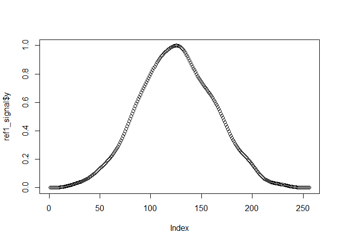

Below is the “original query”, which means that it is an example of how
we would observe the signal in reality – slightly different and probably
with noise, also it is less stronger.

    set.seed(1)
    q1_len <- 400
    q1 <- sapply(seq(0, pi, len=q1_len), function(x) {
      .5 * (sin(x) * (1 - 1/(x + 1)) + runif(1, 0, 1e-1))
    })

    q1_signal <- list(
      x = 1:(q1_len + 2 * 106),
      y = c(runif(106,0,0.05), q1, runif(106, 0, 0.05))
    )

    q1_f <- pattern_approxfun(q1_signal$y)

    plot(q1_signal, ylim = c(0,1))

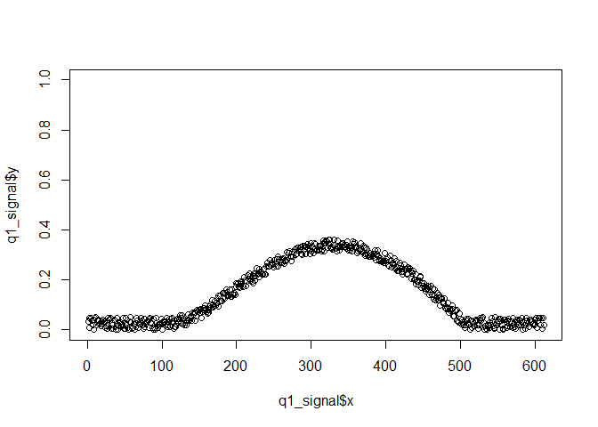 In the
following, we do some mostly linear scaling along the vertical axis.

    getAlign <- function(x){
      dtw::dtw(x = x, y = ref1_signal$y
               , step.pattern = dtw::asymmetric
               , keep = TRUE
               , open.begin = TRUE
               , open.end = TRUE)
    }

    q_normalized <- q1_signal$y / max(q1_signal$y)
    q_times3 <-q1_signal$y * 3
    q_times10 <-q1_signal$y * 10
    q_half <- q1_signal$y / 2
    q_exp <- 2.5^(3 + q1_signal$y) - 2.5^3
    q_squared <- (q1_signal$y + 1)^3.5 - 1

    align <- getAlign(x = q1_signal$y)
    align_normalized <- getAlign(x = q_normalized)
    align_times3 <- getAlign(x = q_times3)
    align_times10 <- getAlign(x = q_times10)
    align_half <- getAlign(x = q_half)
    align_exp <- getAlign(x = q_exp)
    align_squared <- getAlign(x = q_squared)

    rbind(
      getAggStats(align, "original", ref1_signal$y, q1_signal$y),
      getAggStats(align_normalized, "normalized", ref1_signal$y, q_normalized),
      getAggStats(align_times3, "times 3", ref1_signal$y, q_times3),
      getAggStats(align_times10, "times 10", ref1_signal$y, q_times10),
      getAggStats(align_half, "half", ref1_signal$y, q_half),
      getAggStats(align_exp, "exp", ref1_signal$y, q_exp),
      getAggStats(align_squared, "squared", ref1_signal$y, q_squared)
    )

<table>
<thead>
<tr class="header">
<th style="text-align: left;">name</th>
<th style="text-align: right;">area</th>
<th style="text-align: right;">KL_symm</th>
<th style="text-align: right;">JSD</th>
<th style="text-align: right;">JSD_score</th>
<th style="text-align: right;">mono_rel</th>
<th style="text-align: right;">corr</th>
<th style="text-align: right;">sd</th>
<th style="text-align: right;">mae</th>
</tr>
</thead>
<tbody>
<tr class="odd">
<td style="text-align: left;">original</td>
<td style="text-align: right;">0.10067</td>
<td style="text-align: right;">0.08776</td>
<td style="text-align: right;">0.00816</td>
<td style="text-align: right;">0.98823</td>
<td style="text-align: right;">0.52233</td>
<td style="text-align: right;">0.93782</td>
<td style="text-align: right;">0.12102</td>
<td style="text-align: right;">0.10198</td>
</tr>
<tr class="even">
<td style="text-align: left;">normalized</td>
<td style="text-align: right;">0.10067</td>
<td style="text-align: right;">0.08776</td>
<td style="text-align: right;">0.00816</td>
<td style="text-align: right;">0.98823</td>
<td style="text-align: right;">0.52132</td>
<td style="text-align: right;">0.93782</td>
<td style="text-align: right;">0.12102</td>
<td style="text-align: right;">0.10198</td>
</tr>
<tr class="odd">
<td style="text-align: left;">times 3</td>
<td style="text-align: right;">0.10067</td>
<td style="text-align: right;">0.08776</td>
<td style="text-align: right;">0.00816</td>
<td style="text-align: right;">0.98823</td>
<td style="text-align: right;">0.53101</td>
<td style="text-align: right;">0.93782</td>
<td style="text-align: right;">0.12102</td>
<td style="text-align: right;">0.10198</td>
</tr>
<tr class="even">
<td style="text-align: left;">times 10</td>
<td style="text-align: right;">0.10067</td>
<td style="text-align: right;">0.08776</td>
<td style="text-align: right;">0.00816</td>
<td style="text-align: right;">0.98823</td>
<td style="text-align: right;">0.21663</td>
<td style="text-align: right;">0.93782</td>
<td style="text-align: right;">0.12102</td>
<td style="text-align: right;">0.10198</td>
</tr>
<tr class="odd">
<td style="text-align: left;">half</td>
<td style="text-align: right;">0.10067</td>
<td style="text-align: right;">0.08776</td>
<td style="text-align: right;">0.00816</td>
<td style="text-align: right;">0.98823</td>
<td style="text-align: right;">0.51064</td>
<td style="text-align: right;">0.93782</td>
<td style="text-align: right;">0.12102</td>
<td style="text-align: right;">0.10198</td>
</tr>
<tr class="even">
<td style="text-align: left;">exp</td>
<td style="text-align: right;">0.09919</td>
<td style="text-align: right;">0.07579</td>
<td style="text-align: right;">0.00721</td>
<td style="text-align: right;">0.98960</td>
<td style="text-align: right;">0.18182</td>
<td style="text-align: right;">0.93786</td>
<td style="text-align: right;">0.12068</td>
<td style="text-align: right;">0.10070</td>
</tr>
<tr class="odd">
<td style="text-align: left;">squared</td>
<td style="text-align: right;">0.09765</td>
<td style="text-align: right;">0.06330</td>
<td style="text-align: right;">0.00660</td>
<td style="text-align: right;">0.99047</td>
<td style="text-align: right;">0.35078</td>
<td style="text-align: right;">0.93622</td>
<td style="text-align: right;">0.12205</td>
<td style="text-align: right;">0.09976</td>
</tr>
</tbody>
</table>

    plot(align, main = "original", type = "three")

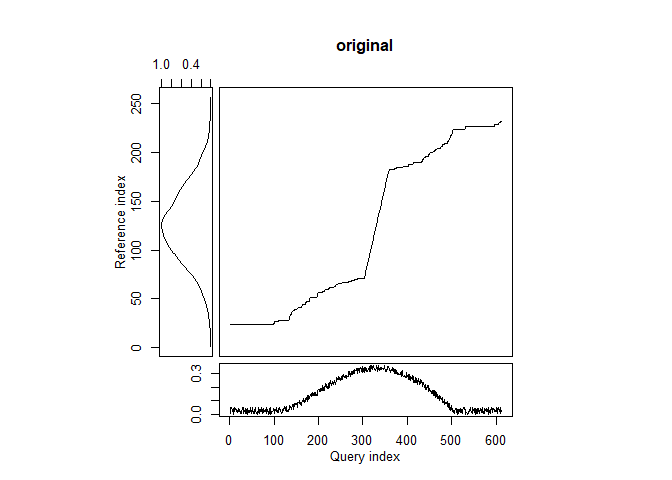

    plot(align_normalized, main = "normalized", type = "three")

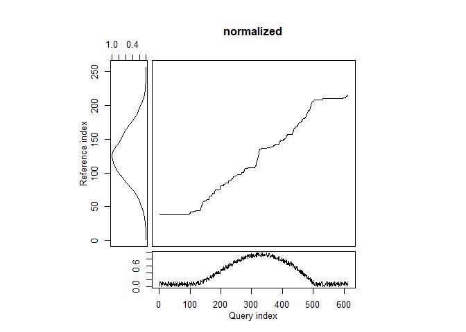

    plot(align_times3, main = "times 3", type = "three")

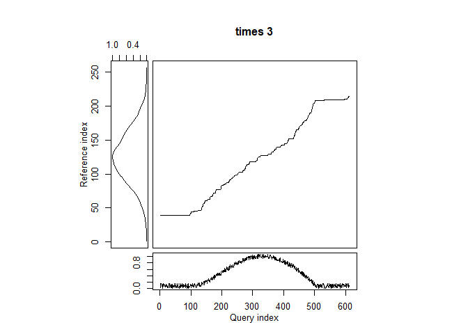

    plot(align_times10, main = "times 10", type = "three")

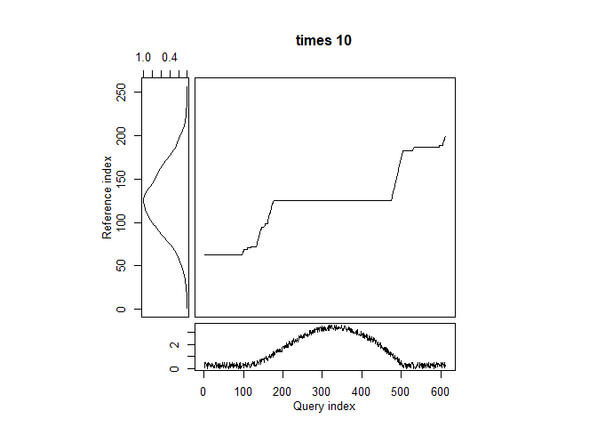

    plot(align_half, main = "half", type = "three")

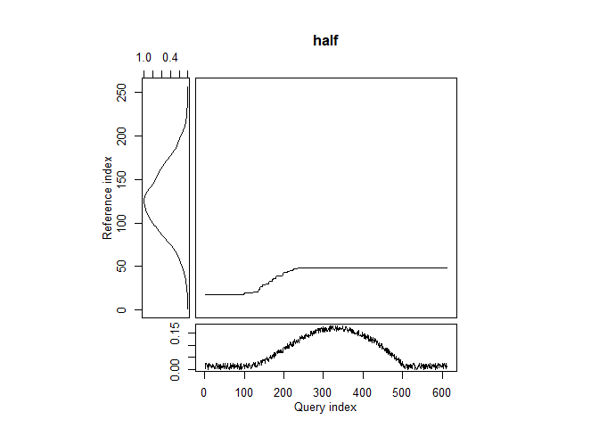

    plot(align_exp, main = "exp", type = "three")

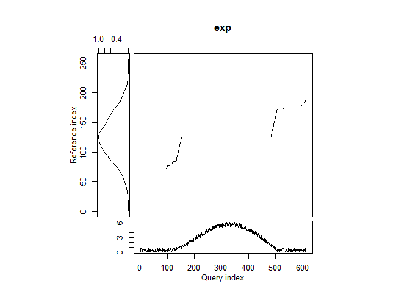

    plot(align_squared, main = "squared", type = "three")

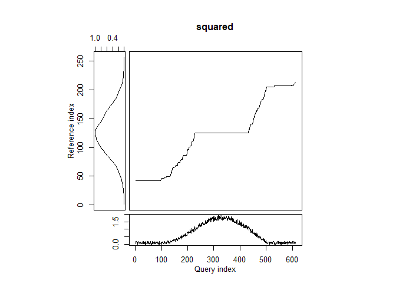

From the above plots we learn one important lesson. Apparently, `dtw`
does not handle cases well, where reference and query do not have the
same co-domain. More specifically, the query’s range should always be
within (greater or equal the reference’s minimum, less than or equal its
maximum) the reference’s range – otherwise, `dtw` introduces
plateaus/jumps, where parts of a signal cannot be matched.

We can see this in the first plot, the query is matched as long as it
goes up. Then, however, there is a jump (not a plateau though) to where
it starts decreasing, as the continued increase (or better: the values
that are larger in the reference) cannot be matched in the query. Given
how we perform matches of the curves, this case however is still good,
as the its not a vertical jump, resulting in an extraction of the
signal. The match would probably be good, too. However, the query is
“smaller” than the reference, but still has a good resemblance –
monotonicity/continuity are good, as well as all stats based on the two
function graphs (remember these are cut and scaled into the unit
square).

Multi-pattern Tests
===================

    set.seed(3)

    q2 <- c(
      rnorm(25, sd = .03),
      
      sapply(seq(0, pi, len=150), function(x) {
        sin(x) + runif(1, 0, .075)
      }),
      
      rnorm(50, sd = .02),
      
      sapply(seq(0, pi, length=70), function(x) {
        sin(x) * .8 + runif(1, 0, .04)
      }),
      
      rnorm(30, sd = .015)
    )

    # Make it fit into [0,1]
    q2 <- q2 - min(q2)
    q2 <- q2 / max(q2)

    plot(q2)

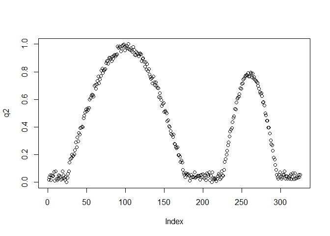

Let’s make some plots:

    q2_scale <- c(q2[1:199]*0.8, q2[200:325]*1.2)

    align_q2 <- getAlign(x = q2)
    align_q2_scale <- getAlign(x = q2_scale)
    align_q2_scale_rev <- getAlign(x = rev(q2_scale))

    plot(align_q2, type = "threeway")

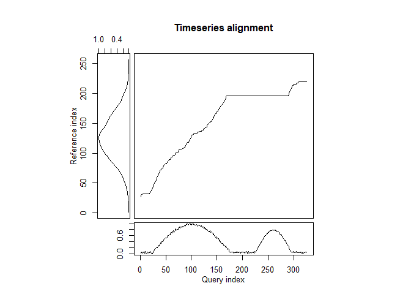

    plot(align_q2_scale, type = "threeway")

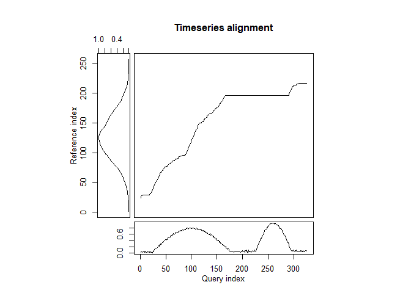

    plot(align_q2_scale_rev, type = "threeway")

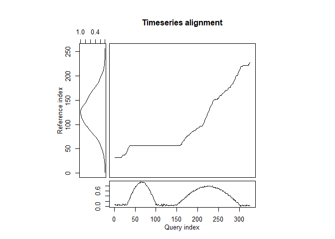

Some observations:

-   `dtw` matches the curve/shape that will result in a lower cost
    (i.e., it does not necessarily match the curve that is spatially
    closer).
-   Reversing a signal results in warping curve rotated by `180°`.
-   We probably need to compute more metrics on the warping function
    than those we currently have implemented (see below).

Additional metrics for the warping function
-------------------------------------------

To further assess the goodness of match, we will match the warping
function against its optimum: its own linear regression in the same
interval. We have already done this to some degree to extract the
warping-score (both absolute and relative).

However, we have developed powerful statistical tools to quantify the
differences between two functions. So the goal is get the two functions,
the warping function and its linear regression, and then extract the
available metrics on those, too (anything from area, over KLD/JSD to
correlation, rmse etc.).

    #' Estimates the warping function and overlays its linear regression.
    #' Then scales both function together to be in the unit square. These
    #' two functions can then be used with metrics such as stat_diff_2_functions_cor.
    #'
    #' The '_np' variants of the functions imply 'no plateaus', i.e.,
    #' those are the same functions with their horizontal plateaus being
    #' removed.
    #'
    #' You may request an optimized align between the original warping
    #' function and its
    pattern_approxfun_warp <- function(dtwAlign, includeOptimizedAlign = TRUE) {
      len <- length(dtwAlign$index2)

      warpLm <- stats::lm(
        formula = y ~ x, data = data.frame(
            x = 1:len, y = dtwAlign$index2))
      
      warpData <- dtwAlign$index2
      linData <- stats::predict(warpLm, newdata = data.frame(x = 1:len))
      
      # The two vectors 'warpData' and 'linData' need to be scaled together.
      ranges <- range(warpData, linData)
      extent <- ranges[2] - ranges[1]
      
      warpData <- warpData - ranges[1]
      warpData <- warpData / extent
      linData <- linData - ranges[1]
      linData <- linData / extent
      
      ex <- extract_signal_from_window(
        dtwAlign = dtwAlign, window = dtwAlign$index2, idxMethod = "smooth")
      
      f_warp_org <- pattern_approxfun(yData = dtwAlign$index2)
      f_warp_np <- pattern_approxfun(yData = ex$data)
      f_warp_np_opt <- NULL
      
      if (includeOptimizedAlign) {
      
        optFunc <- function(offsetLm) {
          tempFunc <- function(x) f_warp_np(x) + offsetLm
          area_diff_2_functions(f_warp_org, tempFunc)$value
        }
        
        f_warp_np_opt <- tryCatch({
          optR <- stats::optim(
            par = 0, fn = optFunc, method = "BFGS")
          
          if (optR$convergence != 0) {
            stop("The optimization did not converge.")
          }
          function(x) f_warp_np(x) + optR$par
        }, error = function(cond) {
          warning(cond)
          NULL
        })
      }
      
      return(list(
        # These two functions have been scaled and translated together, as the
        # linear regression of the warping function is ALWAYS either larger or
        # smaller than the warping function, and therefore the limits for the
        # warping function have to be adjusted. Only both functions together
        # have a domain of [0,1] and co-domain of [0,1].
        f_warp = pattern_approxfun(yData = warpData, yLimits = range(warpData)),
        f_lm = pattern_approxfun(yData = linData, yLimits = range(linData)),
        
        # The original warping function, squeezed into [0,1] (x&y). We need it
        # for comparisons against its non-plateau variant. Comparisons should
        # be either made against 'f_warp_np' or 'f_warp_np_opt', and nothing else.
        f_warp_org = f_warp_org,
        # The original warping function w/o plateaus, also in [0,1] for x&y
        # This is necessary because the length of this function is <= f_warp_org
        f_warp_np = f_warp_np,
        # The warping function w/o plateaus, and adjusted on the y-axis to
        # minimize the residual sum of squares between it and the original
        # warping function.
        f_warp_np_opt = f_warp_np_opt
      ))
    }

And here is an example:

    align_q2_warp <- pattern_approxfun_warp(align_q2)

    plot_2_functions(align_q2_warp$f_warp, align_q2_warp$f_lm) + ggplot2::ggtitle("Warping function and its linear regression", "Both functions were scaled together and then put into the unit-square.")

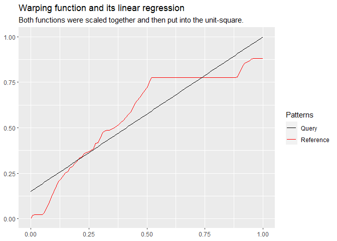

    plot_2_functions(align_q2_warp$f_warp_org, align_q2_warp$f_warp_np) + ggplot2::ggtitle("Warping function and its non-plateau version")

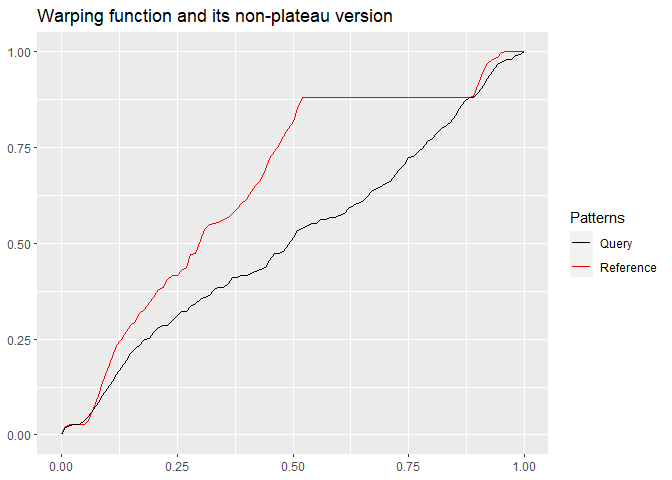

    plot_2_functions(align_q2_warp$f_warp_org, align_q2_warp$f_warp_np_opt) + ggplot2::ggtitle("Warping function and its optimized non-plateau version")

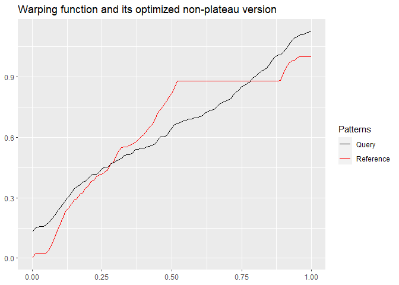

    area_diff_2_functions(align_q2_warp$f_warp, align_q2_warp$f_lm)$value

    ## [1] 0.07669088

    stat_diff_2_functions_cor(align_q2_warp$f_warp, align_q2_warp$f_lm)$value

    ## [1] 0.9370618

    stat_diff_2_functions_symmetric_JSD(align_q2_warp$f_warp, align_q2_warp$f_lm)$value

    ## [1] 0.003834797

For any set of the above pair of functions, we can compute our
metrics/statistics (e.g., area, correlation, KLD etc.). We developed a
few alternatives because there is no one right answer to what is the
theoretical optimum warping function for any arbitrary warping function.

In an ideal case, the whole query can be mapped to the reference, and it
is mapped at a constant pace (i.e., no dilation or clinching). This
would result in a perfect linear function with a slope in the range of
(0, ∞). However, we are using `dtw` and are expecting clinching and
dilation – in such a case, the optimal warping function is one that is
strictly monotonically increasing (i.e., no plateaus), meaning that its
intermittent slope may roam freely within (0, ∞). In other words, a
(full or partially non-)linear function that has a slope  &gt; 0 ∀ *X*,
can still be optimal, considering that we are expecting dilation and
clinching of the query.

Our solution to that is to extract those parts of the warping function
that do in fact have a slope greater `0`. Then, we compare the original
warping function to this one, as it one could argue that it represents
the optimal warping function given the reference and the query (or, at
least more optimal than the linear regression, as it resembles the
warping function in greater detail). Also, by comparing we attempt to
quantify the differences between the actual warping function, and a
hypothetical optimum. One option is to compare against its linear
regression. Another option is the one we just described. Also remember
that we are already computing other metrics of the warping function,
such as monotonicity/continuity, and the residuals of its linear
regression (this is currently done in `extract_signal_from_window` but
we may refactor this at a later point).

Multivariate Tests
==================
