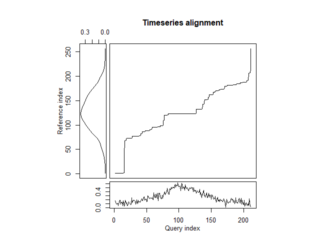
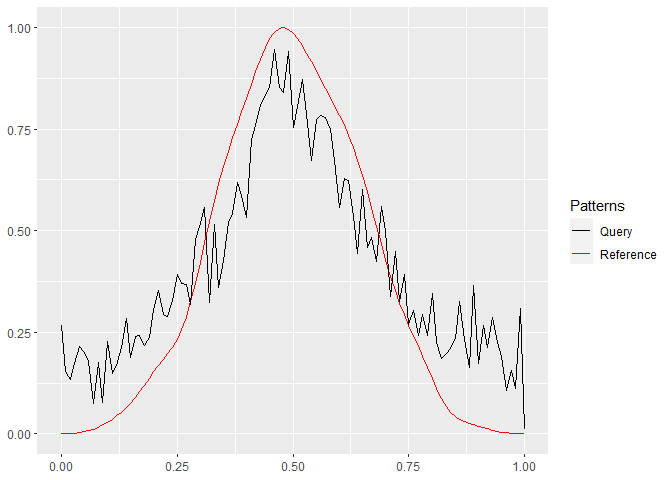
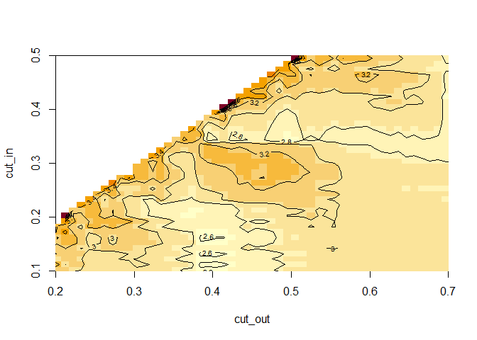

-   [Constrained Optimization test](#constrained-optimization-test)

    source("../helpers.R")
    source("./common-funcs.R", echo = FALSE)

In this notebook, we want to test whether we can find optimal parameters
for `dtw` using optimization, so that we maximize the scores extracted
from the warp. We want to also impose some linear inequality
constraints.

Constrained Optimization test
=============================

We want to make some tests with `stats::constrOptim()` to better
understand how it works and how we have to specify our problem.

    # The reference is defined in this interval.
    # Also, we are allowed to move the shorter query
    # within it (1st degree of freedom)
    co_interval <- seq(0, 2*pi, len=200)
    co_range <- range(co_interval)

    co_ref <- sin(seq(0, 2*pi, len=200))
    # We design it to have the corresponding length
    co_query <- 2*sin(seq(.4*pi, 1.6*pi, len=1.2/2 * 200))

    co_fr <- function(x) {
      cut_in <- x[1]
      cut_out <- x[2]
      stretch <- x[3]
      
      sum((co_query - (stretch * sin(seq(cut_in * pi, cut_out * pi, len=120))))^2)
    }

    optim(fn = co_fr, par = c(0, 2, .1), method = "BFGS")

    ## $par
    ## [1] 0.3999968 1.6000032 1.9999972
    ## 
    ## $value
    ## [1] 1.492622e-09
    ## 
    ## $counts
    ## function gradient 
    ##       85       13 
    ## 
    ## $convergence
    ## [1] 0
    ## 
    ## $message
    ## NULL

Let’s try this constrained. Through the above result we know that the
optimized parameters are very close to the actual optimum. However,
let’s constrain some of these parameters to less optimal extrema.

    theta <- c(.1, 1.3, .1) # in,out,stretch
    ui <- rbind(
      c(0, 0, -1), # stretch
      c(-1, 0, 0), # in
      c(-1, -1, 0) # in+out <= 2  --  -in - out >= -2
    )
    ci <- c(
      -1.8, # stretch <= 1.8
      -.35, # cut_in <= .35
      -2 - 1e-15
    )

    ui %*% theta - ci

    ##      [,1]
    ## [1,] 1.70
    ## [2,] 0.25
    ## [3,] 0.60

    constrOptim(theta = theta, f = co_fr, grad = NULL, ui = ui, ci = ci)

    ## $par
    ## [1] 0.350000 1.646694 1.800000
    ## 
    ## $value
    ## [1] 2.380327
    ## 
    ## $counts
    ## function gradient 
    ##      361       NA 
    ## 
    ## $convergence
    ## [1] 0
    ## 
    ## $message
    ## NULL
    ## 
    ## $outer.iterations
    ## [1] 3
    ## 
    ## $barrier.value
    ## [1] -0.0004127808

Ok, we have now done a dummy example using constraints on multiple
parameters. Let’s do an actual example where we optimize the `dtw`. In
particular, let’s optimize the window we used for the very first example
in the ‘dtw-tests.Rmd’ notebook. We will try to optimize the (relative)
monotonicity of the warping function, as well as the cut-in/-out points
(which correspond to the window size).

The noisy- and org-signal:

    set.seed(1)

    d <- density(rnorm(500), n = 256)

    noisy_signal <- list(
      x = 1:(length(d$x) + 768),
      y = c(
        # Add random noise before:
        rnorm(n = 256, sd = 0.05) + (0.05 * rexp(n = 256)),
        # Add the actual signal with some noise:
        d$y + rnorm(n = length(d$x), sd = 0.05),
        # Add random noise after:
        rnorm(n = 512, sd = 0.05) + (0.15 * runif(n = 512))
      )
    )

    if (min(noisy_signal$y) < 0) {
      noisy_signal$y <- noisy_signal$y + abs(min(noisy_signal$y))
    }

    set.seed(2)

    d1 <- density(rnorm(500, mean = 3), n = 256)

    org_signal <- list(
      x = 1:length(d1$x),
      y = d1$y
    )

    co_dtw <- function(x) {
      cut_in <- x[1]
      cut_out <- x[2]
      
      if (cut_in > cut_out) {
        return(0)
      }
      
      # define the window using the cuts:
      l <- length(noisy_signal$y)
      comp_win <- noisy_signal$y[round(cut_in * l):round(cut_out * l)]
      comp_dtw <- tryCatch({
        dtw::dtw(
          x = comp_win, y = org_signal$y, keep.internals = TRUE,
          open.begin = FALSE, open.end = FALSE) # Forbid open begin/end
      }, error=function(cond) -1)
      
      if (is.numeric(comp_dtw)) {
        return(2) # A loss greater than the one of mono
      }
      
      comp_ex <- extract_signal_from_window(
        dtwAlign = comp_dtw, window = comp_win, throwIfFlat = FALSE)
      
      org_f <- pattern_approxfun(org_signal$y)
      # We want to optimize the mapped function, not the one represented by the window
      comp_f <- pattern_approxfun(comp_ex$data, yLimits = range(org_signal$y))
      
      warp_dtw <- pattern_approxfun_warp(dtwAlign = comp_dtw)
      warp_org_f <- warp_dtw$f_warp_org
      warp_opt_f <- warp_dtw$f_warp_np_opt
      # Turns out using these instead does not work as good (slightly worse).
      #warp_org_f <- warp_dtw$f_warp
      #warp_opt_f <- warp_dtw$f_lm
      
      # Align scores:
      #score_jsd <- (1 - stat_diff_2_functions_symmetric_JSD(
      #  org_f, comp_f)$value / log(2))^.3
      score_area <- 1 - area_diff_2_functions(org_f, comp_f)$value
      score_corr <- abs(stat_diff_2_functions_cor(org_f, comp_f)$value)
      
      # DTW scores:
      #score_dtw_jsd <- 1 - (stat_diff_2_functions_symmetric_JSD(
      #  warp_org_f, warp_opt_f)$value / log(2))^.3
      score_dtw_mono <- comp_ex$monotonicity
      score_dtw_area <- 1 - area_diff_2_functions(warp_org_f, warp_opt_f)$value
      score_dtw_corr <- abs(stat_diff_2_functions_cor(warp_org_f, warp_opt_f)$value)
      
      # This can be returned directly (should not be used with other scores).
      jsd_ONLY_LOG_SCORE <- -1 *
        log(stat_diff_2_functions_symmetric_JSD(org_f, comp_f)$value) *
        log(stat_diff_2_functions_symmetric_JSD(warp_org_f, warp_opt_f)$value)
      return(jsd_ONLY_LOG_SCORE)
      
      # For testing, each score can be disabled here:
      return(1 - (
        1 *
        # curve:
        #score_jsd *
        score_area *
        score_corr *
        # dtw:
        #score_dtw_jsd *
        score_dtw_mono *
        score_dtw_area *
        score_dtw_corr *
        #comp_ex$warp_rel_resid$score *
        1 
      ))
    }

    theta_dtw <- c(0 + 1e-15, 1 - 1e-15) # in,out

    # What we need:
    #  in >= 0
    # out <= 1
    # out - in > 0.1  ==  in - out < -.1   ==   -in + out > .1
    ui_dtw <- rbind(
      c(1, 0),
      c(0,-1),
      c(-1,1)
      #c(1,0),
      #c(0,1),
      #c(-1,1),
      #c(-1,1)
    )
    ci_dtw <- c(
      0,
      -1,
      .1
      #-.9,
      #.9,
      #-.1,
      #.4
    )

    ui_dtw %*% theta_dtw - ci_dtw

    ##              [,1]
    ## [1,] 1.000000e-15
    ## [2,] 9.992007e-16
    ## [3,] 9.000000e-01

    co_dtw_res <- constrOptim(
      theta = theta_dtw, f = co_dtw, grad = NULL, ui = ui_dtw, ci = ci_dtw)
    co_dtw_res$par

    ## [1] 0.2939301 0.4875219

    co_dtw_res$value

    ## [1] -27.96735

    l <- length(noisy_signal$y)
    use_win <- noisy_signal$y[
      round(co_dtw_res$par[1] * l):round(co_dtw_res$par[2] * l)]
    comp_dtw <- dtw::dtw(
      x = use_win, y = org_signal$y, keep.internals = TRUE,
      open.begin = FALSE, open.end = FALSE)
    comp_ex <- extract_signal_from_window(
      dtwAlign = comp_dtw, window = use_win, throwIfFlat = FALSE)
    plot(comp_dtw, type = "threeway")
    tempEx <- extract_signal_from_window(comp_dtw, use_win)
    tempEx$monotonicity

    ## [1] 0.3205742

    org_f <- pattern_approxfun(org_signal$y[comp_ex$start_ref:comp_ex$end_ref])
    comp_f <- pattern_approxfun(comp_ex$data, smooth = TRUE)
    #comp_f <- pattern_approxfun(yData = use_win, yLimits = range(org_signal$y))
    area_diff_2_functions(org_f, comp_f)$value

    ## [1] 0.06645404

    plot_2_functions(org_f, comp_f)

The plot above should be compared to the second of the initial dtw-tests
(matching with a window). However, it is a much better fit!

After some tests, our suspicions are confirmed. Optimization can be
performed using a combination of available low-level metrics. As
low-level count all the statistical sampling metrics (area, correlation
etc.). Combining these with the high-level JSD metric does not usually
improve the fit. This probably also due to the JSD’s score’s low
sensitivity. Pulling the 10th or 5th root improves this a bit.

Using the JSD alone however also works, but then the score computation
needs to be changed. It appears we get the most optimal fit when using
the logarithm of the JSD (without log(2) normalization). The (not
nomalized) JSD is always &lt; 1, so the logarithm is always negative.
When using minimization and both the JSDs of the curve and
warp-function, one needs to multiply with -1 to maintain negativity.

    library(foreach)

    z <- loadResultsOrCompute("../results/dtw-optim.rds", computeExpr = {
      doWithParallelCluster({
        g <- matrix(nrow = 100, ncol = 100)
        g_rows <- expand.grid(
          row = 1:nrow(g),
          col = 1:ncol(g)
        )
        val_range <- seq(0, 1, len=nrow(g))
        g_rows$r <- 0
        
        temp <- foreach::foreach(
          gIdx = rownames(g_rows),
          .packages = c("dtw")
        ) %dopar% {
          r <- g_rows[gIdx, ]
          x_param <- c(val_range[r$row], val_range[r$col])
          res <- tryCatch({
            co_dtw(x_param)
          }, error=function(cond) 0)
          
          list(
            idx = gIdx,
            res = res
          )
        }
        
        for (k in 1:length(temp)) {
          r <- g_rows[temp[[k]]$idx, ]
          g[r$row, r$col] <- temp[[k]]$res
        }
        
        g
      })
    })

Let’s show the results’ search space. Remember our optimal solution is
at 0.2939301, 0.4875219 (cut-in/-out). Also, the graph below will show
better results located on the diagonal, which are invalid, because we
have imposed constraints to guarantee a minimum distance between in/out,
which invalidates all these results.

    z[z < -1e10 | is.na(z)] <- 0 

    cut_out <- seq(0, 1, len=nrow(z))
    cut_in <- seq(0, 1, len=ncol(z))
    suppressWarnings({
      image(cut_out, cut_in, log(-1 * t(z)), xlim = c(0.2, .7), ylim = c(0.1, .5))
      contour(cut_out, cut_in, log(-1 * t(z)), add = TRUE)
    })

