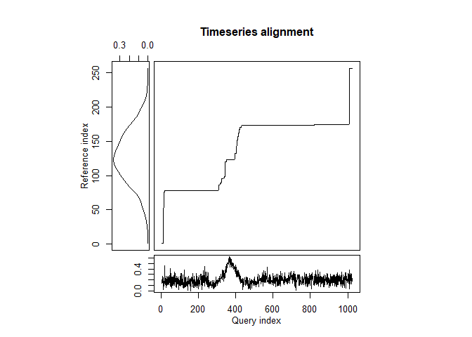

-   [Create an Example Signal](#create-an-example-signal)
-   [Create the Original Signal we want to
    find](#create-the-original-signal-we-want-to-find)
-   [Define functions for assessing
    goodness-of-match](#define-functions-for-assessing-goodness-of-match)
-   [Use Dynamic Time Warping to find the
    pattern](#use-dynamic-time-warping-to-find-the-pattern)
    -   [Example using no Window](#example-using-no-window)
    -   [Example using a Window](#example-using-a-window)
    -   [Example using a partially matching
        window:](#example-using-a-partially-matching-window)
    -   [Example with a window that does not contain the
        pattern:](#example-with-a-window-that-does-not-contain-the-pattern)
    -   [Example from the Paper](#example-from-the-paper)
    -   [Example with a clear, but phase-shifted
        pattern](#example-with-a-clear-but-phase-shifted-pattern)
    -   [Overview of the examples](#overview-of-the-examples)
        -   [Tabular overview of
            goodness-of-match](#tabular-overview-of-goodness-of-match)
-   [Ideas](#ideas)
-   [References](#references)

In this notebook we want to test whether we can detect patterns in noisy
data using dynamic time warping. We will generate some synthetic data
for that.

    library(dtw)

    # Let's define a function to plot both patterns as functions:
    plot_2_functions <- function(fReference, fQuery, interval = c(0, 1)) {
      ggplot2::ggplot(data.frame(x = interval), ggplot2::aes(x)) +
        ggplot2::stat_function(fun = fReference, ggplot2::aes(color="Reference")) +
        ggplot2::stat_function(fun = fQuery, ggplot2::aes(color="Query")) +
        ggplot2::scale_color_manual("Patterns", values = c("black", "red")) +
        ggplot2::theme(
          axis.title.x = ggplot2::element_blank(),
          axis.title.y = ggplot2::element_blank())
    }

Create an Example Signal
========================

In the following example, we assume the signal to look like Gauss bell,
and that’s what we’ll be looking for later. The bell is generated by
estimating a density over a normally distributed sample of 500 points.
The shape is obtained by 256 equally spaced points at which the density
is to be estimated over the sample.

    set.seed(1)

    d <- density(rnorm(500), n = 256)

    noisy_signal <- list(
      x = 1:(length(d$x) + 768),
      y = c(
        # Add random noise before:
        rnorm(n = 256, sd = 0.05) + (0.05 * rexp(n = 256)),
        # Add the actual signal with some noise:
        d$y + rnorm(n = length(d$x), sd = 0.05),
        # Add random noise after:
        rnorm(n = 512, sd = 0.05) + (0.15 * runif(n = 512))
      )
    )

    if (min(noisy_signal$y) < 0) {
      noisy_signal$y <- noisy_signal$y + abs(min(noisy_signal$y))
    }

    plot(noisy_signal)

Create the Original Signal we want to find
==========================================

Let’s attempt to find Gauss bell. We will use a similar distribution
first, before we alter it using *μ* and *σ*.

NOTE: In the few following tests, we are not using windowing, so the DTW
algorithm attempts to match two sequences start to end!

    set.seed(2)

    d1 <- density(rnorm(500, mean = 3), n = 256)

    org_signal <- list(
      x = 1:length(d1$x),
      y = d1$y
    )

Define functions for assessing goodness-of-match
================================================

Before we go further, we want to extract the matching portions of the
pattern from the window and compare it to the original signal. We
approximate functions for the original and the matched signal and then
calculate the difference as the area between the curves in a unit
square.

    extract_signal_from_window <- function(dtwAlign, window, throwIfFlat = TRUE) {
      # First, we check whether the warping function is flat. This
      # test has two components: a linear regression, and a check
      # of the vertical co-domain of that function.
      tempLm <- stats::lm(
        formula = y ~ x, data = data.frame(
          x = 1:length(dtwAlign$index2),
          y = dtwAlign$index2
        )
      )
      if (tempLm$coefficients[2] < .1) {
        # The slope is less than 0.1.
        # It is very flat, let's check the values in the co-domain:
        if (((max(dtwAlign$index2) - min(dtwAlign$index2)) / nrow(dtwAlign$reference)) < .1) {
          # Also, the values in the co-domain cover less than 10%
          # of the available range, indicating an actual flat line.
          # We will return two values, both 0, so that a function
          # can be approximated.
          wMsg <- "DTW warping function is flat."
          if (throwIfFlat) {
            stop(wMsg)
          }
          warning(wMsg)
          
          return(list(
            indices = c(0, 0),
            start = 0,
            end = 0,
            data = c(0, 0)
          ))
        }
      }
      
      
      indices <- c()
      for (idx in 1:min(length(window) - 1, length(dtwAlign$index2) - 1)) {
        if (dtwAlign$index2[idx] < dtwAlign$index2[idx + 1]) {
          indices <- c(indices, c(idx, idx + 1))
        }
      }
      
      indices <- unique(indices)
      
      #return(window[indices])
      return(list(
        indices = indices,
        start = min(indices),
        end = max(indices),
        data = window[indices]
      ))
    }

Now we need to transform both, the original pattern and the matched
pattern to be in the \[0, 1\] range.

After this, we want to approximate two functions. For the original
pattern we use `approxfun`, and for the matched pattern we use a
Loess-smoothed approximation.

    pattern_approxfun <- function(yData, smooth = FALSE) {
      if (all(yData == 0)) {
        return(approxfun(
          x = c(0, 1),
          y = c(0, 0)
        ))
      }
      
      if (smooth) {
        temp <- loess.smooth(
          x = 1:length(yData),
          y = yData,
          span = 0.15
        )
        
        yData <- temp$y
        xData <- temp$x - min(temp$x)
        xData <- xData / max(xData)
      } else {
        xData <- seq(0, 1, by = 1 / (length(yData) - 1))
      }
      
      yData <- yData - min(yData)
      yData <- yData / max(yData)
      
      return(approxfun(
        x = xData,
        y = yData
      ))
    }

Now that we can approximate both patterns as a function in the unit
square, we will look for intersections, so that we can integrate and sum
up all differences between the two functions.

    area_diff_2_functions <- function(f1, f2) {
      # Find the intersections of both functions:
      intersections <- rootSolve::uniroot.all(
        f = function(x) f1(x) - f2(x),
        interval = c(0, 1))
      
      if (length(intersections) == 0) {
        # One function is complete below/above the other
        intersections <- c(0, 1)
      }
      
      # Check that lower/upper integration boundaries exist:
      if (intersections[1] > 0) {
        intersections <- c(0, intersections)
      }
      if (utils::tail(intersections, 1) < 1) {
        intersections <- c(intersections, 1)
      }
      
      
      
      # Now, for each pair of intersections, we integrate both
      # functions and sum up the areas.
      
      areas <- c()
      for (intsec in 1:(length(intersections) - 1)) {
        temp <- abs(
          stats::integrate(
            f = f1,
            lower = intersections[intsec],
            upper = intersections[intsec + 1])$value
          -
          stats::integrate(
            f = f2,
            lower = intersections[intsec],
            upper = intersections[intsec + 1])$value)
        
        areas <- c(areas, temp)
      }
      
      return(list(
        areas = areas,
        value = sum(areas),
        intersections = intersections
      ))
    }

There are probably many methods for comparing the query to the
reference, and we want to suggest another one that uniformly samples
from both functions (that were previously approximated to be in the
unit-square), and then quantifies the difference using some function,
e.g., correlation.

    stat_diff_2_functions <- function(f1, f2, statFunc = stats::cor, numSamples = 1e4) {
      #indices <- sort(stats::runif(n = numSamples, min = 0, max = 1))
      indices <- seq(0, 1, by = 1 / numSamples)
      
      d1 <- sapply(indices, f1)
      d2 <- sapply(indices, f2)
      
      return(list(
        dataF1 = d1,
        dataF2 = d2,
        indices = indices,
        value = statFunc(d1, d2)
      ))
    }

    stat_diff_2_functions_cov <- function(f1, f2, numSamples = 1e4) {
      return(stat_diff_2_functions(f1 = f1, f2 = f2, statFunc = stats::cov, numSamples = numSamples))
    }

    stat_diff_2_functions_cor <- function(f1, f2, numSamples = 1e4) {
      return(stat_diff_2_functions(f1 = f1, f2 = f2, statFunc = stats::cor, numSamples = numSamples))
    }

    stat_diff_2_functions_cor_kendall <- function(f1, f2, numSamples = 1e4) {
      return(stat_diff_2_functions(f1 = f1, f2 = f2, statFunc = function(x, y) {
        return(stats::cor(x = x, y = y, method = "kendall"))
      }, numSamples = numSamples))
    }

    stat_diff_2_functions_cor_spearman <- function(f1, f2, numSamples = 1e4) {
      return(stat_diff_2_functions(f1 = f1, f2 = f2, statFunc = function(x, y) {
        return(stats::cor(x = x, y = y, method = "spearman"))
      }, numSamples = numSamples))
    }

    stat_diff_2_functions_var <- function(f1, f2, numSamples = 1e4) {
      temp <- stat_diff_2_functions(f1 = f1, f2 = f2)
      temp$value <- stats::var(temp$dataF1 - temp$dataF2)
      return(temp)
    }

    stat_diff_2_functions_sd <- function(f1, f2, numSamples = 1e4) {
      temp <- stat_diff_2_functions(f1 = f1, f2 = f2)
      temp$value <- stats::sd(temp$dataF1 - temp$dataF2)
      return(temp)
    }

Use Dynamic Time Warping to find the pattern
============================================

    find_signal <- dtw::dtw(x = noisy_signal$y, y = org_signal$y, keep.internals = TRUE)

    plot(org_signal)

    plot(noisy_signal)

    plot(find_signal, type = "alignment")

    plot(find_signal, type = "three")

    print(c(find_signal$distance, find_signal$normalizedDistance))

    ## [1] 67.63287352  0.05283818

Example using no Window
-----------------------

Let’s do a full example using the match from above. We do not have a
window, so we use the entire warping function to extract matches of our
sought-after pattern. We will use smoothing since no window is used:

    signal_org_f <- pattern_approxfun(org_signal$y)

    signal_ext3 <- extract_signal_from_window(find_signal, window = stats::window(noisy_signal$y))
    signal_mat3 <- signal_ext3$data
    signal_mat_f3 <- pattern_approxfun(signal_mat3, smooth = TRUE)

    print(paste0("The difference in area is (max 1): ", area_diff_2_functions(signal_org_f, signal_mat_f3)$value))

    ## [1] "The difference in area is (max 1): 0.237915220286177"

    plot_2_functions(signal_org_f, signal_mat_f3)

    #curve(signal_org_f, 0, 1, col = "red")
    #curve(signal_mat_f3, 0, 1, add = TRUE)

    print(paste0("The window starts at ", signal_ext3$start, " and ends at ", signal_ext3$end))

    ## [1] "The window starts at 10 and ends at 967"

Example using a Window
----------------------

Try the same with a window that closer encapsulates the pattern (the
pattern starts at 256 with a length of 256):

    win <- stats::window(noisy_signal$y, start = 220, end = 594)
    plot(list(
      x = 1:length(win),
      y = win
    ))

    # Note how we use a different step.pattern.
    # The default is 'symmetric2'.
    # It should be remarked that the Sakoe-Chiba band works well when N ~ M, but is inappropriate when the lengths of the two inputs differ significantly. In particular, when |N - M| > T_0.
    # Argument 'dist.method' does not make since with univariate time series
    find_signal_w <- dtw::dtw(
      x = win, y = org_signal$y, keep.internals = TRUE,
      step.pattern = asymmetric,
      #step.pattern = rabinerJuangStepPattern(1, slope.weighting = "c", smoothed = TRUE),
      open.end = TRUE,
      open.begin = TRUE)

    plot(find_signal_w, type = "alignment")

    plot(find_signal_w, type = "two")

    plot(find_signal_w, type = "three")

    print(c(find_signal_w$distance, find_signal_w$normalizedDistance))

    ## [1] 21.82085982  0.05818896

Let’s do a full example using the match from above:

    signal_org_f <- pattern_approxfun(org_signal$y)

    signal_ext <- extract_signal_from_window(find_signal_w, window = win)
    signal_mat <- signal_ext$data
    signal_mat_f <- pattern_approxfun(signal_mat, smooth = TRUE)

    plot_2_functions(signal_org_f, signal_mat_f)

    #curve(signal_org_f, 0, 1, col = "red")
    #curve(signal_mat_f, 0, 1, add = TRUE)

    print(paste0("The window starts at ", signal_ext$start, " and ends at ", signal_ext$end))

    ## [1] "The window starts at 73 and ends at 375"

Now the area between the curves in the unit square is:

    area_diff_2_functions(signal_org_f, signal_mat_f)$value

    ## [1] 0.165693

Example using a partially matching window:
------------------------------------------

Try the same with a window that only PARTIALLY contains the pattern:

    win2 <- stats::window(noisy_signal$y, start = 384, end = 800)
    plot(list(
      x = 1:length(win2),
      y = win2
    ))

    find_signal_w2 <- dtw::dtw(
      x = win2, y = org_signal$y, keep.internals = TRUE,
      step.pattern = asymmetric,
    #  step.pattern = rabinerJuangStepPattern(1, slope.weighting = "c", smoothed = TRUE),
      open.end = TRUE,
      open.begin = TRUE)

    plot(find_signal_w2, type = "alignment")

    plot(find_signal_w2, type = "two")

    plot(find_signal_w2, type = "three")

    print(c(find_signal_w2$distance, find_signal_w2$normalizedDistance))

    ## [1] 22.21184701  0.05326582

    signal_ext2 <- extract_signal_from_window(find_signal_w2, window = win2)
    signal_mat2 <- signal_ext2$data
    signal_mat_f2 <- pattern_approxfun(signal_mat2, smooth = FALSE)

    area_diff_2_functions(signal_org_f, signal_mat_f2)$value

    ## [1] 0.3271415

    plot_2_functions(signal_org_f, signal_mat_f2)

    #curve(signal_org_f, 0, 1, col = "red")
    #curve(signal_mat_f2, 0, 1, add = TRUE)

    print(paste0("The window starts at ", signal_ext2$start, " and ends at ", signal_ext2$end))

    ## [1] "The window starts at 12 and ends at 50"

Example with a window that does not contain the pattern:
--------------------------------------------------------

Try the same with a window that does NOT contain the pattern:

    win1 <- stats::window(noisy_signal$y, start = 650, end = 1024)
    plot(list(
      x = 1:length(win1),
      y = win1
    ))

    find_signal_w1 <- dtw::dtw(
      x = win1, y = org_signal$y, keep.internals = TRUE,
      step.pattern = asymmetric,
    #  step.pattern = rabinerJuangStepPattern(1, slope.weighting = "c", smoothed = TRUE),
      open.end = TRUE,
      open.begin = TRUE)

    plot(find_signal_w1, type = "alignment")

    plot(find_signal_w1, type = "two")

    plot(find_signal_w1, type = "three")

    print(c(find_signal_w1$distance, find_signal_w1$normalizedDistance))

    ## [1] 21.21050675  0.05656135

As we can see, the warping function is flat, indicating that DTW can not
match the sought-after pattern to the given signal. ***In that case, any
distance metric should indicate the maximum possible distance***, and we
demonstrate this case below, catching the error. Then, we show what
happens if we just go ahead and ignore the error, and estimate the
difference in areas (it still works as expected).

    # This'll throw:
    tryCatch({
      signal_mat1 <- extract_signal_from_window(
        find_signal_w1, window = win1)
    }, error = function(cond) {
      warning(cond)
    })

Let’s go ahead and **ignore** the warning about the flat warping
function. Note that `pattern_approxfun(..)` returns the linear function
between (\[0, 0\], \[1, 0\]) in this case, so that
`area_diff_2_functions()` will still work.

    signal_ext1 <- extract_signal_from_window(
      find_signal_w1, window = win1, throwIfFlat = FALSE)

    ## Warning in extract_signal_from_window(find_signal_w1, window = win1, throwIfFlat
    ## = FALSE): DTW warping function is flat.

    signal_mat1 <- signal_ext1$data
    signal_mat_f1 <- pattern_approxfun(signal_mat1, smooth = FALSE)

    area_diff_2_functions(signal_org_f, signal_mat_f1)$value

    ## [1] 0.3780928

    plot_2_functions(signal_org_f, signal_mat_f1)

    #curve(signal_org_f, 0, 1, col = "red")
    #curve(signal_mat_f1, 0, 1, add = TRUE)

    print(paste0("The window starts at ", signal_ext1$start, " and ends at ", signal_ext1$end))

    ## [1] "The window starts at 0 and ends at 0"

Example from the Paper
----------------------

This is an example (figure 9) from the original article (Giorgino 2009)
using a noisy and chopped-off sine-wave.

    idx <- seq(0,6.28,len=100)
    query <- sin(idx) + runif(100)/10
    reference <- cos(idx)
    alignment <- dtw::dtw(query,reference,step=dtw::asymmetric,keep=TRUE)

    dtw::dtwPlotTwoWay(alignment)

    dtw::dtwPlotThreeWay(alignment)

Let’s use our methods to check how well the “query” matches the
“reference”.

    signal_ex_query <- extract_signal_from_window(
      dtwAlign = alignment,
      window = query # no window is used in that example
    )

    signal_mat_query <- signal_ex_query$data
    signal_mat_query_f <- pattern_approxfun(signal_mat_query)

    signal_mat_ref_f <- pattern_approxfun(reference)

    area_match <- area_diff_2_functions(signal_mat_ref_f, signal_mat_query_f)
    print(area_match$value)

    ## [1] 0.2566771

    plot_2_functions(signal_mat_ref_f, signal_mat_query_f)

    #curve(signal_mat_ref_f, 0, 1, col = "red")
    #curve(signal_mat_query_f, 0, 1, add = TRUE)

    print(paste0("The enclosed areas are: ", area_match$areas))

    ## [1] "The enclosed areas are: 0.0201422596614349"
    ## [2] "The enclosed areas are: 0.0618459566814852"
    ## [3] "The enclosed areas are: 0.174688871642868"

**The area between the curves is 0.2567** and hence is a good match, as
we are also dealing with a partial signal – observe how the query only
matches approx. ~80% of the reference (it has a sudden end). Also, `dtw`
maps the beginning of the query to the reference (cf. the previous 3-way
plot as well).

Example with a clear, but phase-shifted pattern
-----------------------------------------------

We will make an example similar to the last one. However, the query will
not be noise, only phase-shifted and stretched.

    idx2 <- seq(0,6.28,len=100)
    query2 <- 2 * sin((idx2 + 1)[1:60])
    reference2 <- sin(idx2)
    alignment2 <- dtw::dtw(
      query2, reference2, step = dtw::asymmetric,
      keep = TRUE, open.end = TRUE)

    dtw::dtwPlotTwoWay(alignment2)

    dtw::dtwPlotThreeWay(alignment2)

Let’s use our methods to check how well the “query” matches the
“reference”.

    signal_ex_query2 <- extract_signal_from_window(
      dtwAlign = alignment2,
      window = query2 # no window is used in that example
    )

    signal_mat_query2 <- signal_ex_query2$data
    signal_mat_query_f2 <- pattern_approxfun(signal_mat_query2)

    signal_mat_ref_f2 <- pattern_approxfun(reference2)

    area_match2 <- area_diff_2_functions(signal_mat_ref_f2, signal_mat_query_f2)
    print(area_match2$value)

    ## [1] 0.1816005

    plot_2_functions(signal_mat_ref_f2, signal_mat_query_f2)

    #curve(signal_mat_ref_f2, 0, 1, col = "red")
    #curve(signal_mat_query_f2, 0, 1, add = TRUE)

    print(paste0("The enclosed area is: ", area_match2$value))

    ## [1] "The enclosed area is: 0.181600539490224"

Overview of the examples
------------------------

In this section we show again all overlaid patterns for each example,
together with a tabular overview of the differences in area, as well as
some statistical measurements.

### Tabular overview of goodness-of-match

Let’s compute again and show how well the match is, using the
implemented area- and statistics-methods.

<table style="width:100%;">
<colgroup>
<col style="width: 21%" />
<col style="width: 11%" />
<col style="width: 11%" />
<col style="width: 11%" />
<col style="width: 11%" />
<col style="width: 11%" />
<col style="width: 11%" />
<col style="width: 11%" />
</colgroup>
<thead>
<tr class="header">
<th style="text-align: left;">which</th>
<th style="text-align: right;">area</th>
<th style="text-align: right;">cov</th>
<th style="text-align: right;">corr</th>
<th style="text-align: right;">corr_kend</th>
<th style="text-align: right;">corr_spea</th>
<th style="text-align: right;">sd</th>
<th style="text-align: right;">var</th>
</tr>
</thead>
<tbody>
<tr class="odd">
<td style="text-align: left;">No window</td>
<td style="text-align: right;">0.2379152</td>
<td style="text-align: right;">0.0480384</td>
<td style="text-align: right;">0.6126804</td>
<td style="text-align: right;">0.2350393</td>
<td style="text-align: right;">0.3515324</td>
<td style="text-align: right;">0.2806933</td>
<td style="text-align: right;">0.0787887</td>
</tr>
<tr class="even">
<td style="text-align: left;">With window</td>
<td style="text-align: right;">0.1656930</td>
<td style="text-align: right;">0.0859314</td>
<td style="text-align: right;">0.9296884</td>
<td style="text-align: right;">0.9068694</td>
<td style="text-align: right;">0.9777458</td>
<td style="text-align: right;">0.1483172</td>
<td style="text-align: right;">0.0219980</td>
</tr>
<tr class="odd">
<td style="text-align: left;">Partial window</td>
<td style="text-align: right;">0.3271415</td>
<td style="text-align: right;">0.0082624</td>
<td style="text-align: right;">0.1044250</td>
<td style="text-align: right;">0.0883182</td>
<td style="text-align: right;">0.1036203</td>
<td style="text-align: right;">0.3990427</td>
<td style="text-align: right;">0.1592351</td>
</tr>
<tr class="even">
<td style="text-align: left;">Flat warping func.</td>
<td style="text-align: right;">0.3780928</td>
<td style="text-align: right;">0.0000000</td>
<td style="text-align: right;">NA</td>
<td style="text-align: right;">NA</td>
<td style="text-align: right;">NA</td>
<td style="text-align: right;">0.3551363</td>
<td style="text-align: right;">0.1261218</td>
</tr>
<tr class="odd">
<td style="text-align: left;">Ex. from article</td>
<td style="text-align: right;">0.2566771</td>
<td style="text-align: right;">0.0626897</td>
<td style="text-align: right;">0.6017306</td>
<td style="text-align: right;">0.4390660</td>
<td style="text-align: right;">0.5927748</td>
<td style="text-align: right;">0.2939937</td>
<td style="text-align: right;">0.0864323</td>
</tr>
<tr class="even">
<td style="text-align: left;">Ex. phase-shifted</td>
<td style="text-align: right;">0.1816005</td>
<td style="text-align: right;">0.0990778</td>
<td style="text-align: right;">0.8407971</td>
<td style="text-align: right;">0.6834921</td>
<td style="text-align: right;">0.8575143</td>
<td style="text-align: right;">0.1947621</td>
<td style="text-align: right;">0.0379323</td>
</tr>
</tbody>
</table>

Ideas
=====

As Journal of Empirical Software Engineering (EISSN 1573-7616) article:

-   We take only one pattern (maybe include some more that do not
    require additional implementation in our tools, otherwise skip) –
    the pattern we’re currently interested in is **“Half Done Is
    Enough”**
-   We start by making best guesses for how we think each maintenance
    activity’s distribution looks for when the pattern occurs (similar
    to how we modeled the example signal above; however, we need to
    model one signal for each activity, so that it (kind of) becomes a
    multivariate Kernel)
-   Using these best guesses and DTW, we try to detect the pattern in
    student projects
-   Then Petr/Premek will help us to corroborate our findings, and to
    adjust our best guess (e.g., length of time frames, function-match
    thresholds etc.)
-   Using the fine-tuned tools, we’ll mine some of the bigger Apache
    projects. Btw., here’s a recent article from that journal using such
    projects: (Trautsch, Herbold, and Grabowski 2020).

References
==========

Giorgino, Toni. 2009. “Computing and Visualizing Dynamic Time Warping
Alignments in R: The dtw Package.” *Journal of Statistical Software* 31
(7): 1–24. <https://doi.org/10.18637/jss.v031.i07>.

Trautsch, Alexander, Steffen Herbold, and Jens Grabowski. 2020. “A
Longitudinal Study of Static Analysis Warning Evolution and the Effects
of Pmd on Software Quality in Apache Open Source Projects.” *Empirical
Software Engineering*, 1–56.
<https://doi.org/10.1007/s10664-020-09880-1>.
