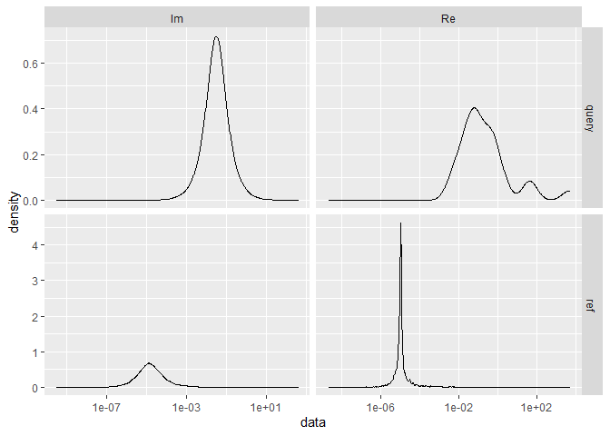

-   [Create an Example Signal](#create-an-example-signal)
-   [Create the Original Signal we want to
    find](#create-the-original-signal-we-want-to-find)
-   [Define functions for assessing
    goodness-of-match](#define-functions-for-assessing-goodness-of-match)
-   [Use Dynamic Time Warping to find the
    pattern](#use-dynamic-time-warping-to-find-the-pattern)
    -   [Example using no Window](#example-using-no-window)
    -   [Example using a Window](#example-using-a-window)
    -   [Example using a partially matching
        window:](#example-using-a-partially-matching-window)
    -   [Example with a window that does not contain the
        pattern:](#example-with-a-window-that-does-not-contain-the-pattern)
    -   [Example from the Paper](#example-from-the-paper)
    -   [Example with a clear, but phase-shifted
        pattern](#example-with-a-clear-but-phase-shifted-pattern)
    -   [Overview of the examples](#overview-of-the-examples)
        -   [Tabular overview of
            goodness-of-match](#tabular-overview-of-goodness-of-match)
-   [Some tests using FFT](#some-tests-using-fft)
    -   [Examine the Signal/Query](#examine-the-signalquery)
    -   [Cleaning the Query / Visual
        comparison](#cleaning-the-query-visual-comparison)
        -   [Tabular overview of
            goodness-of-match](#tabular-overview-of-goodness-of-match-1)
-   [Ideas for matching the pattern](#ideas-for-matching-the-pattern)
    -   [Prerequisites](#prerequisites)
    -   [Step by step](#step-by-step)
    -   [After detection by LNU](#after-detection-by-lnu)
-   [Ideas for Publication](#ideas-for-publication)
    -   [One larger article](#one-larger-article)
    -   [Making two articles/papers](#making-two-articlespapers)
-   [References](#references)

In this notebook we want to test whether we can detect patterns in noisy
data using dynamic time warping. We will generate some synthetic data
for that.

    library(dtw)

    # Let's define a function to plot both patterns as functions:
    plot_2_functions <- function(fReference, fQuery, interval = c(0, 1)) {
      ggplot2::ggplot(data.frame(x = interval), ggplot2::aes(x)) +
        ggplot2::stat_function(fun = fReference, ggplot2::aes(color="Reference")) +
        ggplot2::stat_function(fun = fQuery, ggplot2::aes(color="Query")) +
        ggplot2::scale_color_manual("Patterns", values = c("black", "red")) +
        ggplot2::theme(
          axis.title.x = ggplot2::element_blank(),
          axis.title.y = ggplot2::element_blank())
    }

Create an Example Signal
========================

In the following example, we assume the signal to look like a Gauss
bell, and that’s what we’ll be looking for later. The bell is generated
by estimating a density over a normally distributed sample of 500
points. The shape is obtained by 256 equally spaced points at which the
density is to be estimated over the sample.

    set.seed(1)

    d <- density(rnorm(500), n = 256)

    noisy_signal <- list(
      x = 1:(length(d$x) + 768),
      y = c(
        # Add random noise before:
        rnorm(n = 256, sd = 0.05) + (0.05 * rexp(n = 256)),
        # Add the actual signal with some noise:
        d$y + rnorm(n = length(d$x), sd = 0.05),
        # Add random noise after:
        rnorm(n = 512, sd = 0.05) + (0.15 * runif(n = 512))
      )
    )

    if (min(noisy_signal$y) < 0) {
      noisy_signal$y <- noisy_signal$y + abs(min(noisy_signal$y))
    }

    plot(noisy_signal)

Create the Original Signal we want to find
==========================================

Let’s attempt to find the Gauss bell. We will use a similar distribution
first, before we alter it using *μ* and *σ*.

NOTE: In the few following tests, we are not using windowing (we look at
the entire noisy signal), so the DTW algorithm attempts to match two
sequences start to end (i.e., it assumes start and end of both sequences
coincide, and warping happens in between)! In more real-world cases,
start and end would both be flexible (open) within the window, so that
the query matches somewhere &gt;= start and &lt;= end.

    set.seed(2)

    d1 <- density(rnorm(500, mean = 3), n = 256)

    org_signal <- list(
      x = 1:length(d1$x),
      y = d1$y
    )

    plot(org_signal)

Define functions for assessing goodness-of-match
================================================

Before we go further, we want to extract the matching portions of the
pattern from the window and compare it to the original signal. We
approximate functions for the original and the matched signal and then
calculate the difference as the area between the curves in a unit
square.

    extract_signal_from_window <- function(dtwAlign, window, throwIfFlat = TRUE) {
      # First, we check whether the warping function is flat. This
      # test has two components: a linear regression, and a check
      # of the vertical co-domain of that function.
      tempLm <- stats::lm(
        formula = y ~ x, data = data.frame(
          x = 1:length(dtwAlign$index2),
          y = dtwAlign$index2
        )
      )
      if (tempLm$coefficients[2] < .1) {
        # The slope is less than 0.1.
        # It is very flat, let's check the values in the co-domain:
        if (((max(dtwAlign$index2) - min(dtwAlign$index2)) / nrow(dtwAlign$reference)) < .1) {
          # Also, the values in the co-domain cover less than 10%
          # of the available range, indicating an actual flat line.
          # We will return two values, both 0, so that a function
          # can be approximated.
          wMsg <- "DTW warping function is flat."
          if (throwIfFlat) {
            stop(wMsg)
          }
          warning(wMsg)
          
          return(list(
            indices = c(0, 0),
            start = 0,
            end = 0,
            data = c(0, 0)
          ))
        }
      }
      
      
      indices <- c()
      for (idx in 1:min(length(window) - 1, length(dtwAlign$index2) - 1)) {
        if (dtwAlign$index2[idx] < dtwAlign$index2[idx + 1]) {
          indices <- c(indices, c(idx, idx + 1))
        }
      }
      
      indices <- unique(indices)
      
      #return(window[indices])
      return(list(
        indices = indices,
        start = min(indices),
        end = max(indices),
        data = window[indices]
      ))
    }

Now we need to transform both, the original pattern and the matched
pattern to be in the \[0, 1\] range.

After this, we want to approximate two functions. For the original
pattern we use `approxfun`, and for the matched pattern we use a
Loess-smoothed approximation.

    pattern_approxfun <- function(yData, smooth = FALSE) {
      if (all(yData == 0)) {
        return(approxfun(
          x = c(0, 1),
          y = c(0, 0)
        ))
      }
      
      if (smooth) {
        temp <- loess.smooth(
          x = 1:length(yData),
          y = yData,
          span = 0.15
        )
        
        yData <- temp$y
        xData <- temp$x - min(temp$x)
        xData <- xData / max(xData)
      } else {
        xData <- seq(0, 1, by = 1 / (length(yData) - 1))
      }
      
      yData <- yData - min(yData)
      yData <- yData / max(yData)
      
      return(approxfun(
        x = xData,
        y = yData
      ))
    }

Now that we can approximate both patterns as a function in the unit
square, we will look for intersections, so that we can integrate and sum
up all differences between the two functions.

    area_diff_2_functions <- function(f1, f2) {
      # Find the intersections of both functions:
      intersections <- rootSolve::uniroot.all(
        f = function(x) f1(x) - f2(x),
        interval = c(0, 1))
      
      if (length(intersections) == 0) {
        # One function is complete below/above the other
        intersections <- c(0, 1)
      }
      
      # Check that lower/upper integration boundaries exist:
      if (intersections[1] > 0) {
        intersections <- c(0, intersections)
      }
      if (utils::tail(intersections, 1) < 1) {
        intersections <- c(intersections, 1)
      }
      
      
      
      # Now, for each pair of intersections, we integrate both
      # functions and sum up the areas.
      
      areas <- c()
      for (intsec in 1:(length(intersections) - 1)) {
        temp <- abs(
          stats::integrate(
            f = f1,
            lower = intersections[intsec],
            upper = intersections[intsec + 1])$value
          -
          stats::integrate(
            f = f2,
            lower = intersections[intsec],
            upper = intersections[intsec + 1])$value)
        
        areas <- c(areas, temp)
      }
      
      return(list(
        areas = areas,
        value = sum(areas),
        intersections = intersections
      ))
    }

There are probably many methods for comparing the query to the
reference, and we want to suggest another one that uniformly samples
from both functions (that were previously approximated to be in the
unit-square), and then quantifies the difference using some function,
e.g., correlation.

    stat_diff_2_functions <- function(f1, f2, statFunc = stats::cor, numSamples = 1e4) {
      #indices <- sort(stats::runif(n = numSamples, min = 0, max = 1))
      indices <- seq(0, 1, by = 1 / numSamples)
      
      d1 <- sapply(indices, f1)
      d2 <- sapply(indices, f2)
      
      return(list(
        dataF1 = d1,
        dataF2 = d2,
        indices = indices,
        value = statFunc(d1, d2)
      ))
    }

    stat_diff_2_functions_cov <- function(f1, f2, numSamples = 1e4) {
      return(stat_diff_2_functions(f1 = f1, f2 = f2, statFunc = function(x, y) {
        return(stats::cov(x = x, y = y, use = "pairwise.complete.obs"))
      }, numSamples = numSamples))
    }

    stat_diff_2_functions_cor <- function(f1, f2, numSamples = 1e4) {
      return(stat_diff_2_functions(f1 = f1, f2 = f2, statFunc = function(x, y) {
        return(stats::cor(x = x, y = y, use = "pairwise.complete.obs"))
      }, numSamples = numSamples))
    }

    stat_diff_2_functions_cor_kendall <- function(f1, f2, numSamples = 1e4) {
      return(stat_diff_2_functions(f1 = f1, f2 = f2, statFunc = function(x, y) {
        return(stats::cor(x = x, y = y, use = "pairwise.complete.obs", method = "kendall"))
      }, numSamples = numSamples))
    }

    stat_diff_2_functions_cor_spearman <- function(f1, f2, numSamples = 1e4) {
      return(stat_diff_2_functions(f1 = f1, f2 = f2, statFunc = function(x, y) {
        return(stats::cor(x = x, y = y, use = "pairwise.complete.obs", method = "spearman"))
      }, numSamples = numSamples))
    }

    stat_diff_2_functions_var <- function(f1, f2, numSamples = 1e4) {
      temp <- stat_diff_2_functions(f1 = f1, f2 = f2)
      temp$value <- stats::var(temp$dataF1 - temp$dataF2, na.rm = TRUE)
      return(temp)
    }

    stat_diff_2_functions_sd <- function(f1, f2, numSamples = 1e4) {
      temp <- stat_diff_2_functions(f1 = f1, f2 = f2)
      temp$value <- stats::sd(temp$dataF1 - temp$dataF2, na.rm = TRUE)
      return(temp)
    }

Use Dynamic Time Warping to find the pattern
============================================

In this example, the match is start-to-end – the query is presumed to be
mappable to the entire noisy signal.

    find_signal <- dtw::dtw(
      x = noisy_signal$y, y = org_signal$y, keep.internals = TRUE)

    plot(noisy_signal)

    plot(find_signal, type = "alignment")

    plot(find_signal, type = "three")

    print(c(find_signal$distance, find_signal$normalizedDistance))

    ## [1] 67.63287352  0.05283818

As can be seen above, the warping function maps the most significant
parts of the query to the reference, but also includes small portions at
the start and end, as we did not do open-start or open-end matching.

We have also printed the absolute and relative distances as reported by
`dtw`. However, these distances are rather useless and not suitable for
assessing the goodness-of-match.

Example using no Window
-----------------------

Let’s do a full example using the match from above. We do not have a
window, so we use the entire warping function to extract matches of our
sought-after pattern. We will use smoothing since no window is used:

    signal_org_f <- pattern_approxfun(org_signal$y)

    signal_ext3 <- extract_signal_from_window(
      find_signal, window = stats::window(noisy_signal$y))
    signal_mat3 <- signal_ext3$data
    signal_mat_f3 <- pattern_approxfun(signal_mat3, smooth = TRUE)

    print(paste0(
      "The difference in area is (max 1): ",
      area_diff_2_functions(signal_org_f, signal_mat_f3)$value))

    ## [1] "The difference in area is (max 1): 0.237915220286177"

    plot_2_functions(signal_org_f, signal_mat_f3)

    print(paste0("The window starts at ", signal_ext3$start, " and ends at ", signal_ext3$end))

    ## [1] "The window starts at 10 and ends at 967"

Example using a Window
----------------------

Try the same with a window that closer encapsulates the pattern (the
pattern starts at 256 with a length of 256). Also, we are using
`open.Begin` and `open.End`, so that `dtw` can match a subsequence of
the reference:

    win <- stats::window(noisy_signal$y, start = 220, end = 594)
    plot(list(
      x = 1:length(win),
      y = win
    ))

    # Note how we use a different step.pattern.
    # The default is 'symmetric2'.
    # It should be remarked that the Sakoe-Chiba band works well when N ~ M, but is inappropriate when the lengths of the two inputs differ significantly. In particular, when |N - M| > T_0.
    # Argument 'dist.method' does not make since with univariate time series
    find_signal_w <- dtw::dtw(
      x = win, y = org_signal$y, keep.internals = TRUE,
      step.pattern = asymmetric,
      #step.pattern = rabinerJuangStepPattern(1, slope.weighting = "c", smoothed = TRUE),
      open.end = TRUE,
      open.begin = TRUE)

    plot(find_signal_w, type = "alignment")

    plot(find_signal_w, type = "two")

    plot(find_signal_w, type = "three")

    print(c(find_signal_w$distance, find_signal_w$normalizedDistance))

    ## [1] 21.82085982  0.05818896

Let’s do a full example using the match from above:

    signal_org_f <- pattern_approxfun(org_signal$y)

    signal_ext <- extract_signal_from_window(find_signal_w, window = win)
    signal_mat <- signal_ext$data
    signal_mat_f <- pattern_approxfun(signal_mat, smooth = TRUE)

    plot_2_functions(signal_org_f, signal_mat_f)

    #curve(signal_org_f, 0, 1, col = "red")
    #curve(signal_mat_f, 0, 1, add = TRUE)

    print(paste0("The window starts at ", signal_ext$start, " and ends at ", signal_ext$end))

    ## [1] "The window starts at 73 and ends at 375"

Now the area between the curves in the unit square is:

    area_diff_2_functions(signal_org_f, signal_mat_f)$value

    ## [1] 0.165693

Example using a partially matching window:
------------------------------------------

Try the same with a window that only *partially* contains the pattern:

    win2 <- stats::window(noisy_signal$y, start = 384, end = 800)
    plot(list(
      x = 1:length(win2),
      y = win2
    ))

    find_signal_w2 <- dtw::dtw(
      x = win2, y = org_signal$y, keep.internals = TRUE,
      step.pattern = asymmetric,
    #  step.pattern = rabinerJuangStepPattern(1, slope.weighting = "c", smoothed = TRUE),
      open.end = TRUE,
      open.begin = TRUE)

    plot(find_signal_w2, type = "alignment")

    plot(find_signal_w2, type = "two")

    plot(find_signal_w2, type = "three")

    print(c(find_signal_w2$distance, find_signal_w2$normalizedDistance))

    ## [1] 22.21184701  0.05326582

The `dtw` did a good job in mapping that portion of the query this is
left in the original signal (the decline on the left).

    signal_ext2 <- extract_signal_from_window(find_signal_w2, window = win2)
    signal_mat2 <- signal_ext2$data
    signal_mat_f2 <- pattern_approxfun(signal_mat2, smooth = FALSE)

    area_diff_2_functions(signal_org_f, signal_mat_f2)$value

    ## [1] 0.3271415

    plot_2_functions(signal_org_f, signal_mat_f2)

    print(paste0("The window starts at ", signal_ext2$start, " and ends at ", signal_ext2$end))

    ## [1] "The window starts at 12 and ends at 50"

Example with a window that does not contain the pattern:
--------------------------------------------------------

Try the same with a window that does **not** contain the pattern:

    win1 <- stats::window(noisy_signal$y, start = 650, end = 1024)
    plot(list(
      x = 1:length(win1),
      y = win1
    ))

    find_signal_w1 <- dtw::dtw(
      x = win1, y = org_signal$y, keep.internals = TRUE,
      step.pattern = asymmetric,
    #  step.pattern = rabinerJuangStepPattern(1, slope.weighting = "c", smoothed = TRUE),
      open.end = TRUE,
      open.begin = TRUE)

    plot(find_signal_w1, type = "alignment")

    plot(find_signal_w1, type = "two")

    plot(find_signal_w1, type = "three")

    print(c(find_signal_w1$distance, find_signal_w1$normalizedDistance))

    ## [1] 21.21050675  0.05656135

As we can see, the warping function is flat, indicating that DTW can not
match the sought-after pattern to the given signal. ***In that case, any
distance metric should indicate the maximum possible distance***, and we
demonstrate this case below, catching the error. Then, we show what
happens if we just go ahead and ignore the error, and estimate the
difference in areas (it still works as expected).

    # This'll throw:
    tryCatch({
      signal_mat1 <- extract_signal_from_window(
        find_signal_w1, window = win1)
    }, error = function(cond) {
      warning(cond)
    })

Let’s go ahead and **ignore** the warning about the flat warping
function. Note that `pattern_approxfun(..)` returns the linear function
between (\[0, 0\], \[1, 0\]) in this case, so that
`area_diff_2_functions()` will still work.

    signal_ext1 <- extract_signal_from_window(
      find_signal_w1, window = win1, throwIfFlat = FALSE)

    ## Warning in extract_signal_from_window(find_signal_w1, window = win1, throwIfFlat
    ## = FALSE): DTW warping function is flat.

    signal_mat1 <- signal_ext1$data
    signal_mat_f1 <- pattern_approxfun(signal_mat1, smooth = FALSE)

    area_diff_2_functions(signal_org_f, signal_mat_f1)$value

    ## [1] 0.3780928

    plot_2_functions(signal_org_f, signal_mat_f1)

    print(paste0("The window starts at ", signal_ext1$start, " and ends at ", signal_ext1$end))

    ## [1] "The window starts at 0 and ends at 0"

Example from the Paper
----------------------

This is an example (figure 9) from the original article (Giorgino 2009)
using a noisy and chopped-off sine-wave.

    idx <- seq(0,6.28,len=100)
    query <- sin(idx) + runif(100)/10
    reference <- cos(idx)
    alignment <- dtw::dtw(query,reference,step=dtw::asymmetric,keep=TRUE)

    dtw::dtwPlotTwoWay(alignment)

    dtw::dtwPlotThreeWay(alignment)

Let’s use our methods to check how well the “query” matches the
“reference”.

    signal_ex_query <- extract_signal_from_window(
      dtwAlign = alignment,
      window = query # no window is used in that example
    )

    signal_mat_query <- signal_ex_query$data
    signal_mat_query_f <- pattern_approxfun(signal_mat_query)

    signal_mat_ref_f <- pattern_approxfun(reference)

    area_match <- area_diff_2_functions(signal_mat_ref_f, signal_mat_query_f)
    print(area_match$value)

    ## [1] 0.2566771

    plot_2_functions(signal_mat_ref_f, signal_mat_query_f)

    print(paste0("The enclosed areas are: ", paste(round(area_match$areas, 5), collapse = ", ")))

    ## [1] "The enclosed areas are: 0.02014, 0.06185, 0.17469"

**The area between the curves is 0.2567** and hence is a good match, as
we are also dealing with a partial signal – observe how the query only
matches approx. ~80% of the reference (it has a sudden end). Also, `dtw`
maps the beginning of the query to the reference (cf. the previous 3-way
plot as well).

Example with a clear, but phase-shifted pattern
-----------------------------------------------

We will make an example similar to the last one. However, the query will
not be noise, only phase-shifted and stretched.

    idx2 <- seq(0,6.28,len=100)
    query2 <- 2 * sin((idx2 + 1)[1:60])
    reference2 <- sin(idx2)
    alignment2 <- dtw::dtw(
      query2, reference2, step = dtw::asymmetric,
      keep = TRUE, open.end = TRUE)

    dtw::dtwPlotTwoWay(alignment2)

    dtw::dtwPlotThreeWay(alignment2)

Let’s use our methods to check how well the “query” matches the
“reference”.

    signal_ex_query2 <- extract_signal_from_window(
      dtwAlign = alignment2,
      window = query2 # no window is used in that example
    )

    signal_mat_query2 <- signal_ex_query2$data
    signal_mat_query_f2 <- pattern_approxfun(signal_mat_query2)

    signal_mat_ref_f2 <- pattern_approxfun(reference2)

    area_match2 <- area_diff_2_functions(signal_mat_ref_f2, signal_mat_query_f2)
    print(area_match2$value)

    ## [1] 0.1816005

    plot_2_functions(signal_mat_ref_f2, signal_mat_query_f2)

    #curve(signal_mat_ref_f2, 0, 1, col = "red")
    #curve(signal_mat_query_f2, 0, 1, add = TRUE)

    print(paste0("The enclosed area is: ", area_match2$value))

    ## [1] "The enclosed area is: 0.181600539490224"

Overview of the examples
------------------------

In this section we show again all overlaid patterns for each example,
together with a tabular overview of the differences in area, as well as
some statistical measurements.

### Tabular overview of goodness-of-match

Let’s compute again and show how well the match is, using the
implemented area- and statistics-methods. Note: ‘oB’ and ‘oE’ stand for
open begin and end.

<table>
<thead>
<tr class="header">
<th style="text-align: left;">which</th>
<th style="text-align: right;">oB</th>
<th style="text-align: right;">oE</th>
<th style="text-align: right;">area</th>
<th style="text-align: right;">cov</th>
<th style="text-align: right;">corr</th>
<th style="text-align: right;">corr_kend</th>
<th style="text-align: right;">corr_spea</th>
<th style="text-align: right;">sd</th>
<th style="text-align: right;">var</th>
</tr>
</thead>
<tbody>
<tr class="odd">
<td style="text-align: left;">No window</td>
<td style="text-align: right;">0</td>
<td style="text-align: right;">0</td>
<td style="text-align: right;">0.23792</td>
<td style="text-align: right;">0.04804</td>
<td style="text-align: right;">0.61268</td>
<td style="text-align: right;">0.23504</td>
<td style="text-align: right;">0.35153</td>
<td style="text-align: right;">0.28069</td>
<td style="text-align: right;">0.07879</td>
</tr>
<tr class="even">
<td style="text-align: left;">With window</td>
<td style="text-align: right;">1</td>
<td style="text-align: right;">1</td>
<td style="text-align: right;">0.16569</td>
<td style="text-align: right;">0.08593</td>
<td style="text-align: right;">0.92969</td>
<td style="text-align: right;">0.90687</td>
<td style="text-align: right;">0.97775</td>
<td style="text-align: right;">0.14832</td>
<td style="text-align: right;">0.02200</td>
</tr>
<tr class="odd">
<td style="text-align: left;">Partial window</td>
<td style="text-align: right;">1</td>
<td style="text-align: right;">1</td>
<td style="text-align: right;">0.32714</td>
<td style="text-align: right;">0.00826</td>
<td style="text-align: right;">0.10443</td>
<td style="text-align: right;">0.08832</td>
<td style="text-align: right;">0.10362</td>
<td style="text-align: right;">0.39904</td>
<td style="text-align: right;">0.15924</td>
</tr>
<tr class="even">
<td style="text-align: left;">Flat warping func.</td>
<td style="text-align: right;">1</td>
<td style="text-align: right;">1</td>
<td style="text-align: right;">0.37809</td>
<td style="text-align: right;">0.00000</td>
<td style="text-align: right;">NA</td>
<td style="text-align: right;">NA</td>
<td style="text-align: right;">NA</td>
<td style="text-align: right;">0.35514</td>
<td style="text-align: right;">0.12612</td>
</tr>
<tr class="odd">
<td style="text-align: left;">Ex. from article</td>
<td style="text-align: right;">0</td>
<td style="text-align: right;">0</td>
<td style="text-align: right;">0.25668</td>
<td style="text-align: right;">0.06269</td>
<td style="text-align: right;">0.60173</td>
<td style="text-align: right;">0.43907</td>
<td style="text-align: right;">0.59277</td>
<td style="text-align: right;">0.29399</td>
<td style="text-align: right;">0.08643</td>
</tr>
<tr class="even">
<td style="text-align: left;">Ex. phase-shifted</td>
<td style="text-align: right;">0</td>
<td style="text-align: right;">1</td>
<td style="text-align: right;">0.18160</td>
<td style="text-align: right;">0.09908</td>
<td style="text-align: right;">0.84080</td>
<td style="text-align: right;">0.68349</td>
<td style="text-align: right;">0.85751</td>
<td style="text-align: right;">0.19476</td>
<td style="text-align: right;">0.03793</td>
</tr>
</tbody>
</table>

Some tests using FFT
====================

We could also use FFT and its inverse to *clean* a matched query, and
then compare how well that matches.

Examine the Signal/Query
------------------------

Let’s obtain the data for a matched signal/query and compare how its FFT
looks compared to the reference signal.

    # Dummy to get some data:
    temp <- stat_diff_2_functions(signal_org_f, signal_mat_f)

    temp$f1 <- stats::fft(temp$dataF1)
    temp$f2 <- stats::fft(temp$dataF2)

    fftData <- data.frame(
      Re = Re(c(temp$f1, temp$f2)),
      Im = Im(c(temp$f1, temp$f2)),
      series = c(
        rep("ref", length(temp$f1)), rep("query", length(temp$f2)))
    )

    ggplot2::ggplot(data = fftData, ggplot2::aes(x = Re, y = Im)) +
      ggplot2::geom_point() +
      ggplot2::facet_wrap(series ~., scales = "free")

The structural similarities of the query and the reference are obvious.

    fftDataDens <- data.frame(
      data = c(Re(c(temp$f1, temp$f2)), Im(c(temp$f1, temp$f2))),
      isRe = c(
        rep("Re", length(temp$f1) + length(temp$f2)),
        rep("Im", length(temp$f1) + length(temp$f2))),
      series = rep(c(rep("ref", length(temp$f1)), rep("query", length(temp$f2))), 2)
    )

    ggplot2::ggplot(data = fftDataDens, ggplot2::aes(data)) +
      ggplot2::geom_density() +
      ggplot2::facet_grid(series ~ isRe, scales = "free") +
      ggplot2::scale_x_log10()

Cleaning the Query / Visual comparison
--------------------------------------

In order for it to be useful, we would probably need to clean out extra
frequencies not present in the reference, and then perform some matching
to the signal.

We perform a rather simple test by constraining the data from the query
to the real and imaginary parts that are also present in the reference:

    fftDataClean_Im <- temp$f2[
      Im(temp$f2) >= min(Im(temp$f1)) &
      Im(temp$f2) <= max(Im(temp$f1))
    ]
    fftDataClean_Re <- temp$f2[
      Re(temp$f2) >= min(Re(temp$f1)) &
      Re(temp$f2) <= max(Re(temp$f1))
    ]

    fftDataClean_Both <- temp$f2[
      Re(temp$f2) >= min(Re(temp$f1)) &
      Re(temp$f2) <= max(Re(temp$f1)) &
      Im(temp$f2) >= min(Im(temp$f1)) &
      Im(temp$f2) <= max(Im(temp$f1))
    ]

    fftDataInv <- data.frame(
      x = c(
        1:length(temp$f1),
        1:length(temp$f2),
        1:length(fftDataClean_Im),
        1:length(fftDataClean_Re),
        1:length(fftDataClean_Both)
      ),
      y = c(
        Re(stats::fft(temp$f1, inverse = TRUE)),
        Re(stats::fft(temp$f2, inverse = TRUE)),
        # now the cleaned signals:
        Re(stats::fft(fftDataClean_Im, inverse = TRUE)),
        Re(stats::fft(fftDataClean_Re, inverse = TRUE)),
        Re(stats::fft(fftDataClean_Both, inverse = TRUE))
      ),
      
      series = c(
        rep("ref", length(temp$f1)),
        rep("query", length(temp$f2)),
        rep("clean_Im", length(fftDataClean_Im)),
        rep("clean_Re", length(fftDataClean_Re)),
        rep("clean_both", length(fftDataClean_Both))
      )
    )

    ggplot2::ggplot(data = fftDataInv, ggplot2::aes(x, y)) +
      ggplot2::geom_line() +
      ggplot2::facet_grid(series ~ ., scales = "free")

Subjectively it appears that the signal with cleaned real parts is
closest to the reference signal. However, let’s calculate distances with
our functions for areas and other statistics to get some numbers.

    fft_org_f1 <- pattern_approxfun(Re(stats::fft(temp$f1, inverse = TRUE)))
    fft_org_f2 <- pattern_approxfun(Re(stats::fft(temp$f2, inverse = TRUE)))

    fft_clean_Im_f <- pattern_approxfun(
      Re(stats::fft(fftDataClean_Im, inverse = TRUE)))
    fft_clean_Re_f <- pattern_approxfun(
      Re(stats::fft(fftDataClean_Re, inverse = TRUE)))
    fft_clean_Both_f <- pattern_approxfun(
      Re(stats::fft(fftDataClean_Both, inverse = TRUE)))

And do some figures of these functions:

    ggpubr::ggarrange(
      plot_2_functions(fft_org_f1, fft_org_f2),
      plot_2_functions(fft_org_f1, fft_clean_Im_f),
      plot_2_functions(fft_org_f1, fft_clean_Re_f),
      plot_2_functions(fft_org_f1, fft_clean_Both_f),
      
      
      labels = c(
        "Query",
        "clean_Im",
        "clean_Re",
        "clean_both"
      ),
      
      font.label = list(size = 8),
      vjust = 1,
      
      nrow = 2,
      ncol = 2
    )

### Tabular overview of goodness-of-match

Let’s compute again and show how well the match is, using the
implemented area- and statistics-methods.

<table>
<colgroup>
<col style="width: 12%" />
<col style="width: 11%" />
<col style="width: 12%" />
<col style="width: 12%" />
<col style="width: 12%" />
<col style="width: 12%" />
<col style="width: 11%" />
<col style="width: 11%" />
</colgroup>
<thead>
<tr class="header">
<th style="text-align: left;">which</th>
<th style="text-align: right;">area</th>
<th style="text-align: right;">cov</th>
<th style="text-align: right;">corr</th>
<th style="text-align: right;">corr_kend</th>
<th style="text-align: right;">corr_spea</th>
<th style="text-align: right;">sd</th>
<th style="text-align: right;">var</th>
</tr>
</thead>
<tbody>
<tr class="odd">
<td style="text-align: left;">Query</td>
<td style="text-align: right;">0.1657019</td>
<td style="text-align: right;">0.0859364</td>
<td style="text-align: right;">0.9296884</td>
<td style="text-align: right;">0.9068694</td>
<td style="text-align: right;">0.9777458</td>
<td style="text-align: right;">0.1483118</td>
<td style="text-align: right;">0.0219960</td>
</tr>
<tr class="even">
<td style="text-align: left;">clean_Im</td>
<td style="text-align: right;">0.5024658</td>
<td style="text-align: right;">-0.0234189</td>
<td style="text-align: right;">-0.4612696</td>
<td style="text-align: right;">-0.3971956</td>
<td style="text-align: right;">-0.4862539</td>
<td style="text-align: right;">0.4397689</td>
<td style="text-align: right;">0.1933954</td>
</tr>
<tr class="odd">
<td style="text-align: left;">clean_Re</td>
<td style="text-align: right;">0.2327784</td>
<td style="text-align: right;">0.0849731</td>
<td style="text-align: right;">0.9321898</td>
<td style="text-align: right;">0.9223252</td>
<td style="text-align: right;">0.9876789</td>
<td style="text-align: right;">0.1485183</td>
<td style="text-align: right;">0.0220573</td>
</tr>
<tr class="even">
<td style="text-align: left;">clean_both</td>
<td style="text-align: right;">0.4822632</td>
<td style="text-align: right;">-0.0025898</td>
<td style="text-align: right;">-0.0641672</td>
<td style="text-align: right;">-0.2463714</td>
<td style="text-align: right;">-0.2608303</td>
<td style="text-align: right;">0.3797598</td>
<td style="text-align: right;">0.1442164</td>
</tr>
</tbody>
</table>

In summary, it appears that cleaning the signal does not bring the two
functions closer together (and hence reduce the area between them).
However, we see increases in correlation for when we clean/constrain the
Real part. This could mean that the query resembles the reference more
closely in shape when this transformation is applied.

One more thing we have to think about is that we have not currently used
any *smoothing* or *FFT* **before** we ran the `dtw` – either or both
could be applied to a signal in a window before (also, the order would
likely matter). The tests above have only applied `fft` on the **already
warped** query. When applying `fft` to a noisy signal, we would need to
know which frequencies to damp/remove, however.

Ideas for matching the pattern
==============================

Here we briefly describe how the entire process could look for the
pattern *Half Done Is Enough*. The characteristics for this pattern
comprise the parallel emergence of three sub-patterns that are strongly
correlated (however over time this correlation is non-linear).

Given some window that delimits a range of commits and their maintenance
activities and also contains the pattern, the expectation is the
following:

-   Until some critical point in time (e.g., a milestone), one can
    observe a monotonous increase in adaptive activities, while
    corrective and perfective activities decline simultaneously.
    -   The density of the commits should also increase in this window,
        as the focus is on delivering working code and not necessarily
        documentation.
    -   We might simplify this this pattern by grouping all non-adaptive
        activities into one sub-pattern. That way we would also require
        fewer assumptions about their respective distributions.
-   Shortly after the critical point, the amount of adaptive activities
    decreases sharp and gives way to mostly corrective and some
    perfective activities (again, we might group activities here).
    -   The density of the code is probably slightly declining, and
        correlates with the ratio of corrective/perfective, where the
        latter probably causes a comparatively lower density.

Prerequisites
-------------

We have the following data exported:

-   Tabular data for an entire project, including data for each commit.
-   The data includes a time-stamp, the activity (a/c/p) and the source
    code density.

Step by step
------------

1.  For each activity (and code density), we model a distribution over
    time according to the above description – the result will be a
    sub-pattern for each data series/dimension/variable.
2.  Pick a window with concrete size, e.g., one week or 10 days, and a
    step size, e.g., 1 day, by how the window is advanced over the
    entire project.
3.  In each window, use DTW as described in this notebook to find the
    occurrence of each sub-pattern, and store all statistics about the
    goodness-of-match.
    -   The result is a set of scores for each sub-pattern.
    -   We need to compute a single score based on the goodness-of-match
        and based additionally on how well all the sub-patterns align.
    -   For the entire window at its current position, aggregate all
        scores to a single score and record it.
4.  After all windows have been computed and scored, build an empirical
    density of these scores, and select some quantile (e.g., 90%) to
    finding the best scores.
5.  Start to slide the window from the beginning towards the end.
    -   Slide until a best score is found, slide while the score is
        improving.
    -   Once it is not improving any longer, select candidate range of
        commits as potential match.
    -   Continue process from 5, and start directly after last matching
        window (also, no overlappings).

After detection by LNU
----------------------

1.  Compare LNU’s findings with UWB’s, and measure the agreement.
2.  LNU has some degrees of freedom (hyperparameters), and the goal is
    also to find those that are best working (e.g., window length,
    step-size, best-score quantile, min/max deviation for sub-patterns,
    thresholds for metrics such as goodness-of-match values etc.)
    -   Also, if possible, we could refine the sub-patterns as to how
        they look in the real world.
3.  If two-paper approach, UWB can take final best model for their
    longitudinal study of OSS projects (see next section).
    -   LNU could further assist with additional models to find other
        patterns.

Ideas for Publication
=====================

Using the above approach(es) (or similar) will lead to the planned
paper/article being more geared towards source code, its features,
maintenance activities and detecting them, and UWB’s part will be rather
small. So I want to outline a few strategies on what we can do about
that.

One larger article
------------------

As, e.g., Journal of Empirical Software Engineering (EISSN 1573-7616)
article:

-   We take only one pattern (maybe include some more that do not
    require additional implementation in our tools (e.g., “Fire Drill”),
    otherwise skip) – the pattern we’re currently interested in is
    **“Half Done Is Enough”**.
-   We start by making best guesses for how we think each maintenance
    activity’s distribution looks for when the pattern occurs (similar
    to how we modeled the example signal above; however, we need to
    model one signal for each activity, so that it (kind of) becomes a
    multivariate Kernel).
-   Using these best guesses and DTW, we try to detect the pattern in
    student projects.
-   Then UWB will help us to corroborate our findings, and to adjust our
    best guess (e.g., length of time frames, function-match thresholds
    etc.)
-   Using the fine-tuned tools, we’ll mine some of the bigger Apache
    projects. Btw., here’s a recent article from that journal using such
    projects: (Trautsch, Herbold, and Grabowski 2020).

Making two articles/papers
--------------------------

A two-paper/article approach that potentially allows both groups to
focus on their specialty, but still requiring and facilitating mutual
collaboration.

-   As described in one larger article, we pretty much make the split
    before we go any further with the open source projects.
    -   Everything up to then will be the first article that then has
        more of LNU’s contributions.
    -   UWB would only briefly introduce the concept of anti-patterns in
        software projects, and the focus would be more on LNU’s tools
        and models to detect them.
-   UWB would pick up the work for their article, conducting a more
    longitudinal and quantitative study of open source projects also
    using the tools and models from LNU, but with focus on UWB’s work
    and contributions.
    -   This study then would probably deal with a wider range of
        anti-patterns.
    -   This then does not necessarily be limited to one pattern, as the
        model LNU will develop can work with others, too.
    -   Part of UWB’s evaluation could also focus on which anti-patterns
        LNU’s model can support detecting.

References
==========

Giorgino, Toni. 2009. “Computing and Visualizing Dynamic Time Warping
Alignments in R: The dtw Package.” *Journal of Statistical Software* 31
(7): 1–24. <https://doi.org/10.18637/jss.v031.i07>.

Trautsch, Alexander, Steffen Herbold, and Jens Grabowski. 2020. “A
Longitudinal Study of Static Analysis Warning Evolution and the Effects
of Pmd on Software Quality in Apache Open Source Projects.” *Empirical
Software Engineering*, 1–56.
<https://doi.org/10.1007/s10664-020-09880-1>.
