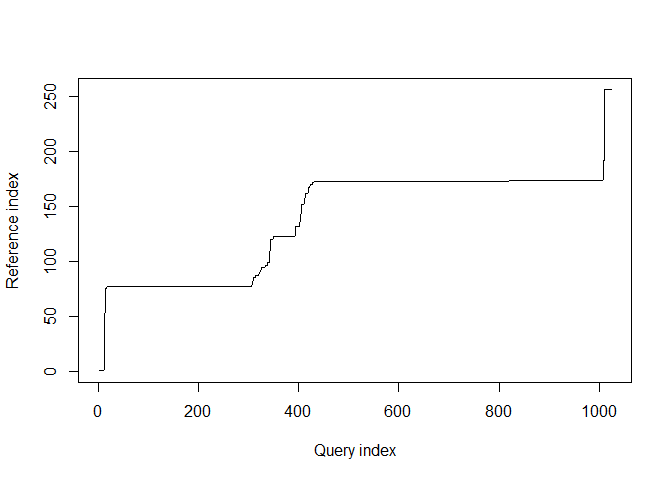
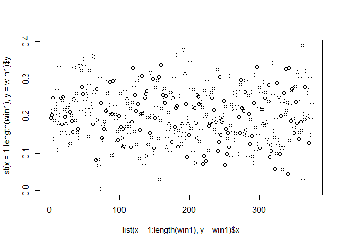
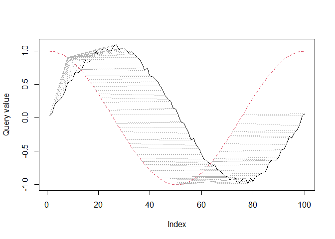
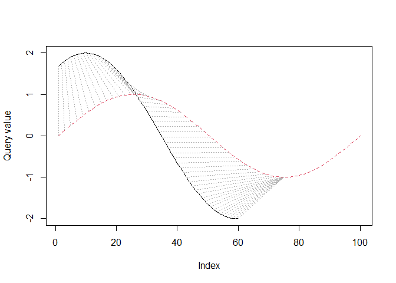

-   [Create an Example Signal](#create-an-example-signal)
-   [Create the Original Signal we want to
    find](#create-the-original-signal-we-want-to-find)
-   [Define functions for assessing
    goodness-of-match](#define-functions-for-assessing-goodness-of-match)
-   [Use Dynamic Time Warping to find the
    pattern](#use-dynamic-time-warping-to-find-the-pattern)
    -   [Example using no Window](#example-using-no-window)
    -   [Example using a Window](#example-using-a-window)
    -   [Example using a partially matching
        window:](#example-using-a-partially-matching-window)
    -   [Example with a window that does not contain the
        pattern:](#example-with-a-window-that-does-not-contain-the-pattern)
    -   [Example from the Paper](#example-from-the-paper)
    -   [Example with a clear, but phase-shifted
        pattern](#example-with-a-clear-but-phase-shifted-pattern)
    -   [Overview of the examples](#overview-of-the-examples)
        -   [Tabular overview of
            goodness-of-match](#tabular-overview-of-goodness-of-match)
-   [Some tests using FFT](#some-tests-using-fft)
    -   [Examine the Signal/Query](#examine-the-signalquery)
    -   [Cleaning the Query / Visual
        comparison](#cleaning-the-query-visual-comparison)
        -   [Tabular overview of
            goodness-of-match](#tabular-overview-of-goodness-of-match-1)
-   [Ideas for matching the pattern](#ideas-for-matching-the-pattern)
    -   [Prerequisites](#prerequisites)
    -   [Step by step](#step-by-step)
    -   [After detection by LNU](#after-detection-by-lnu)
-   [Things to consider before we
    publish](#things-to-consider-before-we-publish)
-   [Ideas for Publication](#ideas-for-publication)
    -   [One larger article](#one-larger-article)
    -   [Making two articles/papers](#making-two-articlespapers)
-   [Further thoughts](#further-thoughts)
-   [References](#references)

In this notebook we want to test whether we can detect patterns in noisy
data using dynamic time warping. We will generate some synthetic data
for that.

    library(dtw)

Also load our common functions:

    source("./common-funcs.R", echo = FALSE)

    # Let's define a function to plot both patterns as functions:
    # The function `plot_2_functions` has been moved to `common-funcs.R`.

Create an Example Signal
========================

In the following example, we assume the signal to look like a Gauss
bell, and that’s what we’ll be looking for later. The bell is generated
by estimating a density over a normally distributed sample of 500
points. The shape is obtained by 256 equally spaced points at which the
density is to be estimated over the sample.

    set.seed(1)

    d <- density(rnorm(500), n = 256)

    noisy_signal <- list(
      x = 1:(length(d$x) + 768),
      y = c(
        # Add random noise before:
        rnorm(n = 256, sd = 0.05) + (0.05 * rexp(n = 256)),
        # Add the actual signal with some noise:
        d$y + rnorm(n = length(d$x), sd = 0.05),
        # Add random noise after:
        rnorm(n = 512, sd = 0.05) + (0.15 * runif(n = 512))
      )
    )

    if (min(noisy_signal$y) < 0) {
      noisy_signal$y <- noisy_signal$y + abs(min(noisy_signal$y))
    }

    plot(noisy_signal)

Create the Original Signal we want to find
==========================================

Let’s attempt to find the Gauss bell. We will use a similar distribution
first, before we alter it using *μ* and *σ*.

NOTE: In the few following tests, we are not using windowing (we look at
the entire noisy signal), so the DTW algorithm attempts to match two
sequences start to end (i.e., it assumes start and end of both sequences
coincide, and warping happens in between)! In more real-world cases,
start and end would both be flexible (open) within the window, so that
the query matches somewhere &gt;= start and &lt;= end.

    set.seed(2)

    d1 <- density(rnorm(500, mean = 3), n = 256)

    org_signal <- list(
      x = 1:length(d1$x),
      y = d1$y
    )

    plot(org_signal)

Define functions for assessing goodness-of-match
================================================

Before we go further, we want to extract the matching portions of the
pattern from the window and compare it to the original signal. We
approximate functions for the original and the matched signal and then
calculate the difference as the area between the curves in a unit
square.

    # Function `extract_signal_from_window` has been moved into `common-funcs.R`.

Now we need to transform both, the original pattern and the matched
pattern to be in the \[0, 1\] range.

After this, we want to approximate two functions. For the original
pattern we use `approxfun`, and for the matched pattern we use a
Loess-smoothed approximation.

    # The function `pattern_approxfun` has been moved into `common-funcs.R`.

Now that we can approximate both patterns as a function in the unit
square, we will look for intersections, so that we can integrate and sum
up all differences between the two functions.

    # The function `area_diff_2_functions` has been moved to `common-funcs.R`.

There are probably many methods for comparing the query to the
reference, and we want to suggest another one that uniformly samples
from both functions (that were previously approximated to be in the
unit-square), and then quantifies the difference using some function,
e.g., correlation.

    # All the `stat_diff_*`-functions have been moved to `common-funcs.R`.

Use Dynamic Time Warping to find the pattern
============================================

In this example, the match is start-to-end – the query is presumed to be
mappable to the entire noisy signal.

    find_signal <- dtw::dtw(
      x = noisy_signal$y, y = org_signal$y, keep.internals = TRUE)

    plot(noisy_signal)

    plot(find_signal, type = "alignment")

    plot(find_signal, type = "three")

    print(c(find_signal$distance, find_signal$normalizedDistance))

    ## [1] 67.63287352  0.05283818

As can be seen above, the warping function maps the most significant
parts of the query to the reference, but also includes small portions at
the start and end, as we did not do open-start or open-end matching.

We have also printed the absolute and relative distances as reported by
`dtw`. However, these distances are rather useless and not suitable for
assessing the goodness-of-match.

Example using no Window
-----------------------

Let’s do a full example using the match from above. We do not have a
window, so we use the entire warping function to extract matches of our
sought-after pattern. We will use smoothing since no window is used:

    signal_org_f <- pattern_approxfun(org_signal$y)

    signal_ext3 <- extract_signal_from_window(
      find_signal, window = noisy_signal$y)
    signal_mat3 <- signal_ext3$data
    signal_mat_f3 <- pattern_approxfun(signal_mat3, smooth = TRUE)

    print(paste0(
      "The difference in area is (max 1): ",
      area_diff_2_functions(signal_org_f, signal_mat_f3)$value))

    ## [1] "The difference in area is (max 1): 0.237915220286177"

    plot_2_functions(signal_org_f, signal_mat_f3)

    print(paste0("The window starts at ", signal_ext3$start, " and ends at ", signal_ext3$end))

    ## [1] "The window starts at 10 and ends at 967"

    print(paste0("The reference is matched from ", signal_ext3$start_ref, " to ", signal_ext3$end_ref))

    ## [1] "The reference is matched from 1 to 256"

Example using a Window
----------------------

Try the same with a window that closer encapsulates the pattern (the
pattern starts at 256 with a length of 256). Also, we are using
`open.Begin` and `open.End`, so that `dtw` can match a subsequence of
the reference:

    # We get a non-plateau match if the we scale the query to fit into the reference (/2.5),
    # and by also constraining the window further (start = 250, end = 480)
    win <- stats::window(noisy_signal$y, start = 220, end = 594)
    plot(list(
      x = 1:length(win),
      y = win
    ))

    # Note how we use a different step.pattern.
    # The default is 'symmetric2'.
    # It should be remarked that the Sakoe-Chiba band works well when N ~ M, but is inappropriate when the lengths of the two inputs differ significantly. In particular, when |N - M| > T_0.
    # Argument 'dist.method' does not make since with univariate time series
    find_signal_w <- dtw::dtw(
      x = win, y = org_signal$y, keep.internals = TRUE,
      step.pattern = asymmetric,
      #step.pattern = rabinerJuangStepPattern(1, slope.weighting = "c", smoothed = TRUE),
      open.end = TRUE,
      open.begin = TRUE)

    plot(find_signal_w, type = "alignment")

    plot(find_signal_w, type = "two")

    plot(find_signal_w, type = "three")

    print(c(find_signal_w$distance, find_signal_w$normalizedDistance))

    ## [1] 21.82085982  0.05818896

Let’s do a full example using the match from above:

    signal_ext <- extract_signal_from_window(find_signal_w, window = win)
    signal_mat <- signal_ext$data
    signal_mat_f <- pattern_approxfun(signal_mat, smooth = TRUE)

    signal_org_1_f <- pattern_approxfun(
      org_signal$y[signal_ext$start_ref:signal_ext$end_ref])

    plot_2_functions(signal_org_1_f, signal_mat_f)

    ## Warning: Removed 1 row(s) containing missing values (geom_path).

    print(paste0("The window starts at ", signal_ext$start, " and ends at ", signal_ext$end))

    ## [1] "The window starts at 73 and ends at 375"

    print(paste0("The reference is matched from ", signal_ext$start_ref, " to ", signal_ext$end_ref))

    ## [1] "The reference is matched from 77 to 180"

Now the area between the curves in the unit square is:

    area_diff_2_functions(signal_org_1_f, signal_mat_f)$value

    ## [1] 0.1409903

Example using a partially matching window:
------------------------------------------

Try the same with a window that only *partially* contains the pattern:

    win2 <- stats::window(noisy_signal$y, start = 384, end = 800)
    plot(list(
      x = 1:length(win2),
      y = win2
    ))

    find_signal_w2 <- dtw::dtw(
      x = win2, y = org_signal$y, keep.internals = TRUE,
      step.pattern = asymmetric,
    #  step.pattern = rabinerJuangStepPattern(1, slope.weighting = "c", smoothed = TRUE),
      open.end = TRUE,
      open.begin = TRUE)

    plot(find_signal_w2, type = "alignment")

    plot(find_signal_w2, type = "two")

    plot(find_signal_w2, type = "three")

    print(c(find_signal_w2$distance, find_signal_w2$normalizedDistance))

    ## [1] 22.21184701  0.05326582

The `dtw` did a good job in mapping that portion of the query this is
left in the original signal (the decline on the left).

    signal_ext2 <- extract_signal_from_window(find_signal_w2, window = win2, idxMethod = "smooth", smoothCnt = 3)
    signal_mat2 <- signal_ext2$data
    signal_mat_f2 <- pattern_approxfun(signal_mat2, smooth = FALSE)

    signal_org_2_f <- pattern_approxfun(org_signal$y[signal_ext2$start_ref:signal_ext2$end_ref])

    area_diff_2_functions(signal_org_2_f, signal_mat_f2)$value

    ## [1] 0.1893936

    plot_2_functions(signal_org_2_f, signal_mat_f2)

    print(paste0("The window starts at ", signal_ext2$start, " and ends at ", signal_ext2$end))

    ## [1] "The window starts at 11 and ends at 51"

    print(paste0("The monotony/continuity is ", signal_ext2$monotonicity, " (relative is ", signal_ext2$monotonicity_rel, ")"))

    ## [1] "The monotony/continuity is 0.0983213429256595 (relative is 1)"

Example with a window that does not contain the pattern:
--------------------------------------------------------

Try the same with a window that does **not** contain the pattern:

    win1 <- stats::window(noisy_signal$y, start = 650, end = 1024)
    plot(list(
      x = 1:length(win1),
      y = win1
    ))

    find_signal_w1 <- dtw::dtw(
      x = win1, y = org_signal$y, keep.internals = TRUE,
      step.pattern = asymmetric,
    #  step.pattern = rabinerJuangStepPattern(1, slope.weighting = "c", smoothed = TRUE),
      open.end = TRUE,
      open.begin = TRUE)

    plot(find_signal_w1, type = "alignment")

    plot(find_signal_w1, type = "two")

    plot(find_signal_w1, type = "three")

    print(c(find_signal_w1$distance, find_signal_w1$normalizedDistance))

    ## [1] 21.21050675  0.05656135

As we can see, the warping function is flat, indicating that DTW can not
match the sought-after pattern to the given signal. ***In that case, any
distance metric should indicate the maximum possible distance***, and we
demonstrate this case below, catching the error. Then, we show what
happens if we just go ahead and ignore the error, and estimate the
difference in areas (it still works as expected).

    # This'll throw:
    tryCatch({
      signal_mat1 <- extract_signal_from_window(
        find_signal_w1, window = win1)
    }, error = function(cond) {
      warning(cond)
    })

Let’s go ahead and **ignore** the warning about the flat warping
function. Note that `pattern_approxfun(..)` returns the linear function
between (\[0, 0\], \[1, 0\]) in this case, so that
`area_diff_2_functions()` will still work.

    signal_ext1 <- extract_signal_from_window(
      find_signal_w1, window = win1, throwIfFlat = FALSE)

    ## Warning in extract_signal_from_window(find_signal_w1, window = win1, throwIfFlat
    ## = FALSE): DTW warping function is flat.

    signal_mat1 <- signal_ext1$data
    signal_mat_f1 <- pattern_approxfun(signal_mat1, smooth = FALSE)

    area_diff_2_functions(signal_org_f, signal_mat_f1)$value

    ## [1] 0.3780928

    plot_2_functions(signal_org_f, signal_mat_f1)

    print(paste0("The window starts at ", signal_ext1$start, " and ends at ", signal_ext1$end))

    ## [1] "The window starts at NA and ends at NA"

Example from the Paper
----------------------

This is an example (figure 9) from the original article (Giorgino 2009)
using a noisy and chopped-off sine-wave.

    idx <- seq(0,6.28,len=100)
    query <- sin(idx) + runif(100)/10
    reference <- cos(idx)
    alignment <- dtw::dtw(query,reference,step=dtw::asymmetric,keep=TRUE, open.begin = TRUE, open.end = TRUE)

    dtw::dtwPlotTwoWay(alignment)

    dtw::dtwPlotThreeWay(alignment)

Let’s use our methods to check how well the “query” matches the
“reference”.

    signal_ex_query <- extract_signal_from_window(
      dtwAlign = alignment,
      window = query # no window is used in that example
    )

    signal_mat_query <- signal_ex_query$data
    signal_mat_query_f <- pattern_approxfun(signal_mat_query)

    #signal_mat_ref_f <- pattern_approxfun(reference)
    signal_mat_ref_f <- pattern_approxfun(
      reference[signal_ex_query$start_ref:signal_ex_query$end_ref])

    area_match <- area_diff_2_functions(signal_mat_ref_f, signal_mat_query_f)
    print(area_match$value)

    ## [1] 0.0177643

    plot_2_functions(signal_mat_ref_f, signal_mat_query_f)

    print(paste0("The enclosed areas are: ", paste(round(area_match$areas, 5), collapse = ", ")))

    ## [1] "The enclosed areas are: 0.00362, 0.00017, 0.00017, 0.00028, 0.00024, 6e-04, 2e-04, 0.00572, 3e-05, 0.00037, 3e-05, 0.00054, 0.00015, 0.00063, 0.00188, 0, 0.00313"

**The area between the curves is 0.0178** and hence is a good match, as
we are also dealing with a partial signal – observe how the query only
matches approx. ~80% of the reference (it has a sudden end). Also, `dtw`
maps the beginning of the query to the reference (cf. the previous 3-way
plot as well).

Example with a clear, but phase-shifted pattern
-----------------------------------------------

We will make an example similar to the last one. However, the query will
not be noise, only phase-shifted and stretched.

    idx2 <- seq(0,6.28,len=100)
    query2 <- 2 * sin((idx2 + 1)[1:60])
    reference2 <- sin(idx2)
    alignment2 <- dtw::dtw(
      query2, reference2, step = dtw::asymmetric,
      keep = TRUE, open.end = TRUE)

    dtw::dtwPlotTwoWay(alignment2)

    dtw::dtwPlotThreeWay(alignment2)

Let’s use our methods to check how well the “query” matches the
“reference”.

    signal_ex_query2 <- extract_signal_from_window(
      dtwAlign = alignment2,
      window = query2 # no window is used in that example
    )

    signal_mat_query2 <- signal_ex_query2$data
    signal_mat_query_f2 <- pattern_approxfun(signal_mat_query2)

    signal_mat_ref_f2 <- pattern_approxfun(reference2[signal_ex_query2$start_ref:signal_ex_query2$end_ref])

    area_match2 <- area_diff_2_functions(signal_mat_ref_f2, signal_mat_query_f2)
    print(area_match2$value)

    ## [1] 0.1162836

    plot_2_functions(signal_mat_ref_f2, signal_mat_query_f2)

    print(paste0("The enclosed area is: ", area_match2$value))

    ## [1] "The enclosed area is: 0.116283566729189"

Overview of the examples
------------------------

In this section we show again all overlaid patterns for each example,
together with a tabular overview of the differences in area, as well as
some statistical measurements.

### Tabular overview of goodness-of-match

Let’s compute again and show how well the match is, using the
implemented area- and statistics-methods. **Note**: ‘oB’ and ‘oE’ stand
for open begin and end. ‘start’ and ‘end’ mean the relative
beginning/end of the reference or query that were matched (where in the
reference or query the match started as percentage).

<table>
<thead>
<tr class="header">
<th style="text-align: left;">which</th>
<th style="text-align: right;">oB</th>
<th style="text-align: right;">oE</th>
<th style="text-align: right;">start_r</th>
<th style="text-align: right;">end_r</th>
<th style="text-align: right;">start_q</th>
<th style="text-align: right;">end_q</th>
<th style="text-align: right;">mono</th>
<th style="text-align: right;">mono_rel</th>
<th style="text-align: right;">area</th>
<th style="text-align: right;">KL_sy</th>
</tr>
</thead>
<tbody>
<tr class="odd">
<td style="text-align: left;">No window</td>
<td style="text-align: right;">0</td>
<td style="text-align: right;">0</td>
<td style="text-align: right;">0.0039</td>
<td style="text-align: right;">1.0000</td>
<td style="text-align: right;">0.0098</td>
<td style="text-align: right;">0.9443</td>
<td style="text-align: right;">0.1576</td>
<td style="text-align: right;">0.2056</td>
<td style="text-align: right;">0.2379</td>
<td style="text-align: right;">0.4047</td>
</tr>
<tr class="even">
<td style="text-align: left;">With window</td>
<td style="text-align: right;">1</td>
<td style="text-align: right;">1</td>
<td style="text-align: right;">0.3008</td>
<td style="text-align: right;">0.7031</td>
<td style="text-align: right;">0.1947</td>
<td style="text-align: right;">1.0000</td>
<td style="text-align: right;">0.1947</td>
<td style="text-align: right;">0.2409</td>
<td style="text-align: right;">0.1410</td>
<td style="text-align: right;">0.0478</td>
</tr>
<tr class="odd">
<td style="text-align: left;">Partial window</td>
<td style="text-align: right;">1</td>
<td style="text-align: right;">1</td>
<td style="text-align: right;">0.4805</td>
<td style="text-align: right;">0.6797</td>
<td style="text-align: right;">0.0264</td>
<td style="text-align: right;">0.1223</td>
<td style="text-align: right;">0.0983</td>
<td style="text-align: right;">1.0000</td>
<td style="text-align: right;">0.1894</td>
<td style="text-align: right;">0.1151</td>
</tr>
<tr class="even">
<td style="text-align: left;">Flat warping func.</td>
<td style="text-align: right;">1</td>
<td style="text-align: right;">1</td>
<td style="text-align: right;">NA</td>
<td style="text-align: right;">NA</td>
<td style="text-align: right;">NA</td>
<td style="text-align: right;">NA</td>
<td style="text-align: right;">NA</td>
<td style="text-align: right;">NA</td>
<td style="text-align: right;">0.3781</td>
<td style="text-align: right;">0.0000</td>
</tr>
<tr class="odd">
<td style="text-align: left;">Ex. from article</td>
<td style="text-align: right;">1</td>
<td style="text-align: right;">1</td>
<td style="text-align: right;">0.0800</td>
<td style="text-align: right;">0.7600</td>
<td style="text-align: right;">0.3500</td>
<td style="text-align: right;">0.9900</td>
<td style="text-align: right;">0.6400</td>
<td style="text-align: right;">0.9846</td>
<td style="text-align: right;">0.0178</td>
<td style="text-align: right;">0.0093</td>
</tr>
<tr class="even">
<td style="text-align: left;">Ex. phase-shifted</td>
<td style="text-align: right;">0</td>
<td style="text-align: right;">1</td>
<td style="text-align: right;">0.0100</td>
<td style="text-align: right;">0.7500</td>
<td style="text-align: right;">0.0167</td>
<td style="text-align: right;">0.7833</td>
<td style="text-align: right;">0.6667</td>
<td style="text-align: right;">0.8511</td>
<td style="text-align: right;">0.1163</td>
<td style="text-align: right;">0.0351</td>
</tr>
</tbody>
</table>

<table>
<thead>
<tr class="header">
<th style="text-align: left;">which</th>
<th style="text-align: right;">cov</th>
<th style="text-align: right;">corr</th>
<th style="text-align: right;">corr_kend</th>
<th style="text-align: right;">corr_spea</th>
<th style="text-align: right;">sd</th>
<th style="text-align: right;">var</th>
<th style="text-align: right;">mae</th>
<th style="text-align: right;">rmse</th>
</tr>
</thead>
<tbody>
<tr class="odd">
<td style="text-align: left;">No window</td>
<td style="text-align: right;">0.0480</td>
<td style="text-align: right;">0.6127</td>
<td style="text-align: right;">0.2350</td>
<td style="text-align: right;">0.3515</td>
<td style="text-align: right;">0.2807</td>
<td style="text-align: right;">0.0788</td>
<td style="text-align: right;">0.2379</td>
<td style="text-align: right;">0.2907</td>
</tr>
<tr class="even">
<td style="text-align: left;">With window</td>
<td style="text-align: right;">0.0729</td>
<td style="text-align: right;">0.9580</td>
<td style="text-align: right;">0.9373</td>
<td style="text-align: right;">0.9905</td>
<td style="text-align: right;">0.0861</td>
<td style="text-align: right;">0.0074</td>
<td style="text-align: right;">0.1410</td>
<td style="text-align: right;">0.1633</td>
</tr>
<tr class="odd">
<td style="text-align: left;">Partial window</td>
<td style="text-align: right;">0.0606</td>
<td style="text-align: right;">0.8793</td>
<td style="text-align: right;">0.7026</td>
<td style="text-align: right;">0.8928</td>
<td style="text-align: right;">0.1379</td>
<td style="text-align: right;">0.0190</td>
<td style="text-align: right;">0.1894</td>
<td style="text-align: right;">0.2272</td>
</tr>
<tr class="even">
<td style="text-align: left;">Flat warping func.</td>
<td style="text-align: right;">0.0000</td>
<td style="text-align: right;">NA</td>
<td style="text-align: right;">NA</td>
<td style="text-align: right;">NA</td>
<td style="text-align: right;">0.3551</td>
<td style="text-align: right;">0.1261</td>
<td style="text-align: right;">0.3781</td>
<td style="text-align: right;">0.5187</td>
</tr>
<tr class="odd">
<td style="text-align: left;">Ex. from article</td>
<td style="text-align: right;">0.0898</td>
<td style="text-align: right;">0.9982</td>
<td style="text-align: right;">0.9578</td>
<td style="text-align: right;">0.9960</td>
<td style="text-align: right;">0.0222</td>
<td style="text-align: right;">0.0005</td>
<td style="text-align: right;">0.0178</td>
<td style="text-align: right;">0.0222</td>
</tr>
<tr class="even">
<td style="text-align: left;">Ex. phase-shifted</td>
<td style="text-align: right;">0.1006</td>
<td style="text-align: right;">0.8988</td>
<td style="text-align: right;">0.7351</td>
<td style="text-align: right;">0.8363</td>
<td style="text-align: right;">0.1505</td>
<td style="text-align: right;">0.0226</td>
<td style="text-align: right;">0.1163</td>
<td style="text-align: right;">0.1508</td>
</tr>
</tbody>
</table>

In the following, we also use the Jensen-Shannon Divergence (JSD), as it
has, contrary to the KL Divergence, an upper bound. When using the
natural log, its upper bound is `log(2)` (~0.6931). Finding or defining
an upper bound for the KLD is otherwise application-specific, if
possible at all (cf. Silva and Narayanan 2006).

<table>
<thead>
<tr class="header">
<th style="text-align: left;">which</th>
<th style="text-align: right;">warp_score</th>
<th style="text-align: right;">warp_rel_score</th>
<th style="text-align: right;">warp_resid</th>
<th style="text-align: right;">warp_rel_resid</th>
<th style="text-align: right;">JSD_score</th>
<th style="text-align: right;">JSD</th>
</tr>
</thead>
<tbody>
<tr class="odd">
<td style="text-align: left;">No window</td>
<td style="text-align: right;">0.8645</td>
<td style="text-align: right;">0.8328</td>
<td style="text-align: right;">0.0678</td>
<td style="text-align: right;">0.0836</td>
<td style="text-align: right;">0.9446</td>
<td style="text-align: right;">0.0384</td>
</tr>
<tr class="even">
<td style="text-align: left;">With window</td>
<td style="text-align: right;">0.7696</td>
<td style="text-align: right;">0.7462</td>
<td style="text-align: right;">0.1152</td>
<td style="text-align: right;">0.1269</td>
<td style="text-align: right;">0.9914</td>
<td style="text-align: right;">0.0059</td>
</tr>
<tr class="odd">
<td style="text-align: left;">Partial window</td>
<td style="text-align: right;">0.7625</td>
<td style="text-align: right;">0.8966</td>
<td style="text-align: right;">0.1188</td>
<td style="text-align: right;">0.0517</td>
<td style="text-align: right;">0.9804</td>
<td style="text-align: right;">0.0136</td>
</tr>
<tr class="even">
<td style="text-align: left;">Flat warping func.</td>
<td style="text-align: right;">NA</td>
<td style="text-align: right;">NA</td>
<td style="text-align: right;">NA</td>
<td style="text-align: right;">NA</td>
<td style="text-align: right;">0.8110</td>
<td style="text-align: right;">0.1310</td>
</tr>
<tr class="odd">
<td style="text-align: left;">Ex. from article</td>
<td style="text-align: right;">0.8339</td>
<td style="text-align: right;">0.9747</td>
<td style="text-align: right;">0.0831</td>
<td style="text-align: right;">0.0127</td>
<td style="text-align: right;">0.9988</td>
<td style="text-align: right;">0.0008</td>
</tr>
<tr class="even">
<td style="text-align: left;">Ex. phase-shifted</td>
<td style="text-align: right;">0.9034</td>
<td style="text-align: right;">0.9156</td>
<td style="text-align: right;">0.0483</td>
<td style="text-align: right;">0.0422</td>
<td style="text-align: right;">0.9937</td>
<td style="text-align: right;">0.0043</td>
</tr>
</tbody>
</table>

Some interpretations:

In general:

-   Open begin and -end make better matches, but require an asymmetric
    pattern (which is fine).
-   `area` is a good metric to asses the closeness of ref and query.
    However, it would not work well if both these have a constant
    distance between each other. In that case, we would need to check
    how well the query’s curve resembles the reference. The correlation
    is a good indicator for that (should be strongly positive).
-   `symmetric KL divergence` is similar to `area`, it seems to be a bit
    more robust though. However, while it seems to stay low (e.g., less
    than `1`) it does not have an upper bound (only a lower of `0`).
-   The `continuity` (monotonicity, esp. the relative version) is a good
    measure for how well the query can be mapped to the reference. If
    there were large horizontal or vertical plateaus in the `dtw` 3-way
    plots, this value would be low (close to `0` – we prefer high values
    close to `1`). The value can be used to find better window-sizes;
    mostly analytically, however.
-   `correlation` is good for checking whether both curves behave
    similar. In other words, a high positive correlation means that both
    curves **resemble** each other (each other’s shape) well.
-   `sd`, `var`, `mae` and `rmse` should be low for good matches
    (remember all these are obtained in the unit-square). These simple
    statistical measures (and also the correlation) need to be checked
    together.
-   `extract_signal_from_window` in discrete mode can only detect
    warping with a slope `>= 0.5`. If more shallow slopes are expected,
    use it in `smooth` mode with `3` or more elements (where the
    detected minimum slope then is `1 /` number of elements). This
    results in the inclusion of more indices, too (which in turn results
    in higher values for monotonicity, for example).

For each example:

-   **No window**: Not only do we not use a window, but we also force
    the `dtw` to match start to end, so it has to map the entire query
    to the entire reference. The monotonicity is low because we have
    large plateaus in the warping function (because of the forced
    start-end match). While the overall statistics are quite OK (low
    area, relatively high correlation/low mae), the KL is high. Also,
    these values are bad considering start/end were both 0/1 for ref and
    query.
-   **With window**: We used a window on the query but the actual trick
    was done by letting the begin and end be open. About 80% of the
    query were matched to about 40% of the reference. That could
    indicate that the window was too small. However, in this case, it is
    because we had simply too much noise, which led to a long cut-in and
    a long cut-out. Additionally, there was a large plateau in the
    query. The monotonicity is low because of that and a small part that
    was matched at the end. That part at the end was only matched
    because it was smaller than the noise in between. It is a good match
    (low area, KL, mae, var; high corr) – however, this case should ring
    some bells because of the starts/ends and the low monotonicities.
    Ideally, one would attempt to reduce the noise or adjust the window.
-   **Partial Window**: This is actually a clear and very good match, it
    has all the right values. However, it covers only about 19% of the
    reference. Also, only about 10% of the query were used. That means
    that the window was not too small, but it did not cover the right
    portion of the reference – in the case here, it should have been
    moved to the right a lot. The relative monotonicity is also perfect,
    as the small part of the query that is matchable, can perfectly be
    warped to the reference. The discrepancy between absolute and
    relative monotonicity indicate that large portions of the query
    cannot be mapped to the reference. It appears that if one were to
    read all the metrics correctly, the window could have been adjusted
    almost perfectly well.
-   **Flat warping function**: All computations have been deliberately
    disabled in this case, as such a flat function indicates that we
    cannot map the query to the reference, the metrics would be moot
    anyways. That is why also an error is thrown if this happens.
-   **Example from Article**: This is obviously a very good (partial)
    match, as much as possible from the query is mapped, all metrics
    have almost perfect values. The first part of the query does not
    match the reference, as it is monotonically increasing. Then, some
    is missing at the end (observe start/end for reference and query).
    This gives two indications: 1) the window may not be large enough
    and 2) the query may not be complete.
-   **Example phase-shifted**: Considering the 2-way plot for this
    scenario, this is a good partial match, large portions of the query
    can be mapped to the reference (see monotonicity). This would
    probably be another case of wrong window-size (query is cut-off)

Some tests using FFT
====================

We could also use FFT and its inverse to *clean* a matched query, and
then compare how well that matches.

Examine the Signal/Query
------------------------

Let’s obtain the data for a matched signal/query and compare how its FFT
looks compared to the reference signal.

    # Dummy to get some data:
    temp <- stat_diff_2_functions(signal_org_f, signal_mat_f)

    temp$f1 <- stats::fft(temp$dataF1)
    temp$f2 <- stats::fft(temp$dataF2)

    fftData <- data.frame(
      Re = Re(c(temp$f1, temp$f2)),
      Im = Im(c(temp$f1, temp$f2)),
      series = c(
        rep("ref", length(temp$f1)), rep("query", length(temp$f2)))
    )

    ggplot2::ggplot(data = fftData, ggplot2::aes(x = Re, y = Im)) +
      ggplot2::geom_point() +
      ggplot2::facet_wrap(series ~., scales = "free")

The structural similarities of the query and the reference are obvious.

    fftDataDens <- data.frame(
      data = c(Re(c(temp$f1, temp$f2)), Im(c(temp$f1, temp$f2))),
      isRe = c(
        rep("Re", length(temp$f1) + length(temp$f2)),
        rep("Im", length(temp$f1) + length(temp$f2))),
      series = rep(c(rep("ref", length(temp$f1)), rep("query", length(temp$f2))), 2)
    )

    ggplot2::ggplot(data = fftDataDens, ggplot2::aes(data)) +
      ggplot2::geom_density() +
      ggplot2::facet_grid(series ~ isRe, scales = "free") +
      ggplot2::scale_x_log10()

Cleaning the Query / Visual comparison
--------------------------------------

In order for it to be useful, we would probably need to clean out extra
frequencies not present in the reference, and then perform some matching
to the signal.

We perform a rather simple test by constraining the data from the query
to the real and imaginary parts that are also present in the reference:

    fftDataClean_Im <- temp$f2[
      Im(temp$f2) >= min(Im(temp$f1)) &
      Im(temp$f2) <= max(Im(temp$f1))
    ]
    fftDataClean_Re <- temp$f2[
      Re(temp$f2) >= min(Re(temp$f1)) &
      Re(temp$f2) <= max(Re(temp$f1))
    ]

    fftDataClean_Both <- temp$f2[
      Re(temp$f2) >= min(Re(temp$f1)) &
      Re(temp$f2) <= max(Re(temp$f1)) &
      Im(temp$f2) >= min(Im(temp$f1)) &
      Im(temp$f2) <= max(Im(temp$f1))
    ]

    fftDataInv <- data.frame(
      x = c(
        1:length(temp$f1),
        1:length(temp$f2),
        1:length(fftDataClean_Im),
        1:length(fftDataClean_Re),
        1:length(fftDataClean_Both)
      ),
      y = c(
        Re(stats::fft(temp$f1, inverse = TRUE)),
        Re(stats::fft(temp$f2, inverse = TRUE)),
        # now the cleaned signals:
        Re(stats::fft(fftDataClean_Im, inverse = TRUE)),
        Re(stats::fft(fftDataClean_Re, inverse = TRUE)),
        Re(stats::fft(fftDataClean_Both, inverse = TRUE))
      ),
      
      series = c(
        rep("ref", length(temp$f1)),
        rep("query", length(temp$f2)),
        rep("clean_Im", length(fftDataClean_Im)),
        rep("clean_Re", length(fftDataClean_Re)),
        rep("clean_both", length(fftDataClean_Both))
      )
    )

    ggplot2::ggplot(data = fftDataInv, ggplot2::aes(x, y)) +
      ggplot2::geom_line() +
      ggplot2::facet_grid(series ~ ., scales = "free")

Subjectively it appears that the signal with cleaned real parts is
closest to the reference signal. However, let’s calculate distances with
our functions for areas and other statistics to get some numbers.

    fft_org_f1 <- pattern_approxfun(Re(stats::fft(temp$f1, inverse = TRUE)))
    fft_org_f2 <- pattern_approxfun(Re(stats::fft(temp$f2, inverse = TRUE)))

    fft_clean_Im_f <- pattern_approxfun(
      Re(stats::fft(fftDataClean_Im, inverse = TRUE)))
    fft_clean_Re_f <- pattern_approxfun(
      Re(stats::fft(fftDataClean_Re, inverse = TRUE)))
    fft_clean_Both_f <- pattern_approxfun(
      Re(stats::fft(fftDataClean_Both, inverse = TRUE)))

And do some figures of these functions:

    ggpubr::ggarrange(
      plot_2_functions(fft_org_f1, fft_org_f2),
      plot_2_functions(fft_org_f1, fft_clean_Im_f),
      plot_2_functions(fft_org_f1, fft_clean_Re_f),
      plot_2_functions(fft_org_f1, fft_clean_Both_f),
      
      
      labels = c(
        "Query",
        "clean_Im",
        "clean_Re",
        "clean_both"
      ),
      
      font.label = list(size = 8),
      vjust = 1,
      
      nrow = 2,
      ncol = 2
    )

### Tabular overview of goodness-of-match

Let’s compute again and show how well the match is, using the
implemented area- and statistics-methods.

<table>
<thead>
<tr class="header">
<th style="text-align: left;">which</th>
<th style="text-align: right;">area</th>
<th style="text-align: right;">KL_sy</th>
<th style="text-align: right;">cov</th>
<th style="text-align: right;">corr</th>
<th style="text-align: right;">corr_kend</th>
<th style="text-align: right;">corr_spea</th>
<th style="text-align: right;">sd</th>
<th style="text-align: right;">rmse</th>
</tr>
</thead>
<tbody>
<tr class="odd">
<td style="text-align: left;">Query</td>
<td style="text-align: right;">0.1657</td>
<td style="text-align: right;">0.2003</td>
<td style="text-align: right;">0.0859</td>
<td style="text-align: right;">0.9297</td>
<td style="text-align: right;">0.9069</td>
<td style="text-align: right;">0.9777</td>
<td style="text-align: right;">0.1483</td>
<td style="text-align: right;">0.1783</td>
</tr>
<tr class="even">
<td style="text-align: left;">clean_Im</td>
<td style="text-align: right;">0.5025</td>
<td style="text-align: right;">1.3765</td>
<td style="text-align: right;">-0.0234</td>
<td style="text-align: right;">-0.4613</td>
<td style="text-align: right;">-0.3972</td>
<td style="text-align: right;">-0.4863</td>
<td style="text-align: right;">0.4398</td>
<td style="text-align: right;">0.5756</td>
</tr>
<tr class="odd">
<td style="text-align: left;">clean_Re</td>
<td style="text-align: right;">0.2328</td>
<td style="text-align: right;">0.4151</td>
<td style="text-align: right;">0.0850</td>
<td style="text-align: right;">0.9322</td>
<td style="text-align: right;">0.9223</td>
<td style="text-align: right;">0.9877</td>
<td style="text-align: right;">0.1485</td>
<td style="text-align: right;">0.2734</td>
</tr>
<tr class="even">
<td style="text-align: left;">clean_both</td>
<td style="text-align: right;">0.4823</td>
<td style="text-align: right;">1.3707</td>
<td style="text-align: right;">-0.0026</td>
<td style="text-align: right;">-0.0642</td>
<td style="text-align: right;">-0.2464</td>
<td style="text-align: right;">-0.2608</td>
<td style="text-align: right;">0.3798</td>
<td style="text-align: right;">0.5725</td>
</tr>
</tbody>
</table>

In summary, it appears that cleaning the signal does not bring the two
functions closer together (and hence reduce the area between them).
However, we see increases in correlation for when we clean/constrain the
Real part. This could mean that the query resembles the reference more
closely in shape when this transformation is applied.

One more thing we have to think about is that we have not currently used
any *smoothing* or *FFT* **before** we ran the `dtw` – either or both
could be applied to a signal in a window before (also, the order would
likely matter). The tests above have only applied `fft` on the **already
warped** query. When applying `fft` to a noisy signal, we would need to
know which frequencies to damp/remove, however.

Ideas for matching the pattern
==============================

Here we briefly describe how the entire process could look for the
pattern *Half Done Is Enough*. The characteristics for this pattern
comprise the parallel emergence of three sub-patterns that are strongly
temporally correlated (however over time this correlation is non-linear,
i.e., a linear increase for some sub-pattern is not necessarily
accompanied by a linear change of another sub-pattern).

Given some window that delimits a range of commits and their maintenance
activities and also contains the pattern, the expectation is the
following:

-   Until some critical point in time (e.g., a milestone), one can
    observe a monotonous increase in adaptive activities, while
    corrective and perfective activities decline simultaneously.
    -   The density of the commits should also increase in this window,
        as the focus is on delivering working code and not necessarily
        documentation.
    -   We might simplify this pattern by grouping all non-adaptive
        activities into one sub-pattern. That way we would also require
        fewer assumptions about their respective distributions.
-   Shortly after the critical point, the amount of adaptive activities
    decreases sharp and gives way to mostly corrective and some
    perfective activities (again, we might group activities here).
    -   The density of the code is probably slightly declining, and
        correlates with the ratio of corrective/perfective, where the
        latter probably causes a comparatively lower density.

Prerequisites
-------------

We have the following data exported:

-   Tabular data for an entire project, including data for each commit.
-   The data includes a time-stamp, the activity (a/c/p) and the source
    code density.

Step by step
------------

1.  For each activity (and code density), we model a distribution over
    time according to the above description – the result will be a
    sub-pattern for each data series/dimension/variable.
2.  Pick a window with concrete size, e.g., one week or 10 days, and a
    step size, e.g., 1 day, by how the window is advanced over the
    entire project.
3.  In each window, use DTW as described in this notebook to find the
    occurrence of each sub-pattern, and store all statistics about the
    goodness-of-match.
    -   The result is a set of scores for each sub-pattern.
    -   We need to compute a single score based on the goodness-of-match
        and based additionally on how well all the sub-patterns align.
    -   For the entire window at its current position, aggregate all
        scores to a single score and record it.
4.  After all windows have been computed and scored, build an empirical
    density of these scores, and select some quantile (e.g., 90%) to
    finding the best scores.
5.  Start to slide the window from the beginning towards the end.
    -   Slide until a best score is found, slide while the score is
        improving.
    -   Once it is not improving any longer, select candidate range of
        commits as potential match.
    -   Continue process from 5, and start directly after last matching
        window (also, no overlappings).

After detection by LNU
----------------------

1.  Compare LNU’s findings with UWB’s, and measure the agreement.
2.  LNU has some degrees of freedom (hyperparameters), and the goal is
    also to find those that are best working (e.g., window length,
    step-size, best-score quantile, min/max deviation for sub-patterns,
    thresholds for metrics such as goodness-of-match values etc.)
    -   Also, if possible, we could refine the sub-patterns as to how
        they look in the real world.
3.  If two-paper approach, UWB can take final best model for their
    longitudinal study of OSS projects (see next section).
    -   LNU could further assist with additional models to find other
        patterns.

Things to consider before we publish
====================================

The following is a loose (but important) collection of considerations
regarding our research methodology.

-   UWB needs to be able to provide 4 cases of pattern occurrence: True
    positives, False positives (Type I error), False negatives (Type II
    error) and True negatives.
    -   For each case, it is important do document how we came to the
        realization – it is important that this realization is **not**
        done through the symptoms’ descriptions.
    -   For example, let’s say UWB falsely detects the occurrence of
        *Half Done Is Enough* (a False positive), then there must exist
        probable justification.
-   LNU needs to find the *range* of the pattern, i.e., what are the
    strongest and weakest occurrences (this is probably part of
    adjusting the hyperparameters).
    -   Also, not every group/project runs into the pattern – LNU’s
        models must provide a sufficient precision and recall.
-   There have been studies outlining the differences between student-
    and real-world projects, and those seem to agree that the
    differences are insignificant (good for us). We need to include this
    research in our writings (Morgan has a few references and examples).
-   The “pipeline” for the proposed approach below is that LNU detects
    the patterns with their models, and then gets corroboration by UWB
    and further adjusts their models. However, the actual ground-truth
    lies in the students itself, and they would need to be asked whether
    the pattern actually occurred, if this is not documented otherwise
    (such as in the meeting minutes). Only this will provide us with
    undeniable evidence.
    -   Against the ground-truth, we can measure how well detection
        through either, ALM- or source code-data works, or a combination
        of both.

As for the pattern primarily described in this notebook, *Half Done Is
Enough*, we need to make sure to properly outline (and delineate) the
value of our research, e.g.,

-   As for the planned work, we can only detect the anti-pattern in the
    past – the models in question are not made for forecasting. This
    however could be subject of further research.
-   Still, there is value in detecting anti-patterns in historical data,
    with benefits to, e.g., *Organizational Learning* and socio-economic
    properties, such as detecting managerial incompetence and adjusting
    team composition, or misplanning of resources etc.
    -   We also need to think about it from a cost perspective: What is
        the cost of a False negative or a False positive? What are the
        gains of a True positive or True negative case?

Ideas for Publication
=====================

Using the above approach(es) (or similar) will lead to the planned
paper/article being more geared towards source code, its features,
maintenance activities and detecting them, and UWB’s part will be rather
small. So I want to outline a few strategies on what we can do about
that.

One larger article
------------------

As, e.g., Journal of Empirical Software Engineering (EISSN 1573-7616)
article:

-   We take only one pattern (maybe include some more that do not
    require additional implementation in our tools (e.g., “Fire Drill”),
    otherwise skip) – the pattern we’re currently interested in is
    **“Half Done Is Enough”**.
-   We start by making best guesses for how we think each maintenance
    activity’s distribution looks for when the pattern occurs (similar
    to how we modeled the example signal above; however, we need to
    model one signal for each activity, so that it (kind of) becomes a
    multivariate Kernel).
-   Using these best guesses and DTW, we try to detect the pattern in
    student projects.
-   Then UWB will help us to corroborate our findings, and to adjust our
    best guess (e.g., length of time frames, function-match thresholds
    etc.)
-   Using the fine-tuned tools, we’ll mine some of the bigger Apache
    projects. Btw., here’s a recent article from that journal using such
    projects: (Trautsch, Herbold, and Grabowski 2020).

Making two articles/papers
--------------------------

A two-paper/article approach that potentially allows both groups to
focus on their specialty, but still requiring and facilitating mutual
collaboration.

-   As described in one larger article, we pretty much make the split
    before we go any further with the open source projects.
    -   Everything up to then will be the first article that then has
        more of LNU’s contributions.
    -   UWB would only briefly introduce the concept of anti-patterns in
        software projects, and the focus would be more on LNU’s tools
        and models to detect them.
-   As an example, UWB could pick up the work for their article,
    conducting a more longitudinal and quantitative study of open source
    projects also using the tools and models from LNU, but with focus on
    UWB’s work and contributions.
    -   This study then would probably deal with a wider range of
        anti-patterns.
    -   This then does not necessarily be limited to one pattern, as the
        model LNU will develop can work with others, too.
    -   Part of UWB’s evaluation could also focus on which anti-patterns
        LNU’s model can support detecting.

Further thoughts
================

From signal processing, we get more potential low-levels metrics that
can quantify the differences between two functions, if we view them as
signals. Below there are also some implementations and more references.

We found the work from (Xi, Sun, and Krishnappa 2000), (Rauber et al.
2010) useful for these. Especially in the latter they offer some
descriptions of what these low-level metrics measure. We could probably
implement some of these for comparing two signals, by measuring how
different the values are (because these metrics are calculated on each
signal separately).

The paper by (Efrat, Fan, and Venkatasubramanian 2007) is dedicated to
curve matching and discusses in detail metrics that we should definitely
look at (and partially already have).

I have only skimmed (Maldonado et al. 2002), but it seems they have
developed some feasible practical solutions to comparing curves – needs
further checking.

The Nash-Sutcliffe efficiency (NSE) could be used as a metric
directly[1]. While it has no lower bound, it has an upper. 1 is a
perfect match, and 0 means that the resemblance of the query to the
reference is as good as the mean of the reference would be. Negative
values mean that the query is a worse resemblance than the mean.

    # The following functions were implemented from [@xi2000bearing].

    RMS <- function(vec) {
      l <- length(vec)
      m <- mean(vec)
      sqrt(1 / l * sum((vec - m)^2))
    }

    Kurtosis <- function(vec) {
      l <- length(vec)
      m <- mean(vec)
      (1 / l * sum((vec - m)^4)) / RMS(vec)
    }

    Peak <- function(vec) {
      .5 * (max(vec) - min(vec))
    }

    ImpulseFactor <- function(vec) {
      l <- length(vec)
      Peak(vec) / (1 / l * sum(abs(vec)))
    }

References
==========

Efrat, Alon, Quanfu Fan, and Suresh Venkatasubramanian. 2007. “Curve
Matching, Time Warping, and Light Fields: New Algorithms for Computing
Similarity Between Curves.” *Journal of Mathematical Imaging and Vision*
27 (3): 203–16.
<http://citeseerx.ist.psu.edu/viewdoc/download?doi=10.1.1.118.5078&rep=rep1&type=pdf>.

Giorgino, Toni. 2009. “Computing and Visualizing Dynamic Time Warping
Alignments in R: The dtw Package.” *Journal of Statistical Software* 31
(7): 1–24. <https://doi.org/10.18637/jss.v031.i07>.

Maldonado, Yolanda MuÑoz, Joan G Staniswalis, Louis N Irwin, and Donna
Byers. 2002. “A Similarity Analysis of Curves.” *Canadian Journal of
Statistics* 30 (3): 373–81. <https://doi.org/10.2307/3316142>.

Rauber, Thomas W, Eduardo Mendel do Nascimento, Estefhan D Wandekokem,
Flavio M Varejao, and A Herout. 2010. “Pattern Recognition Based Fault
Diagnosis in Industrial Processes: Review and Application.” *Pattern
Recognition Recent Advances*, 483–508.
<https://cdn.intechopen.com/pdfs-wm/10675.pdf>.

Silva, Jorge, and Shrikanth Narayanan. 2006. “Upper Bound
Kullback-Leibler Divergence for Hidden Markov Models with Application as
Discrimination Measure for Speech Recognition.” In *2006 Ieee
International Symposium on Information Theory*, 2299–2303. IEEE.

Trautsch, Alexander, Steffen Herbold, and Jens Grabowski. 2020. “A
Longitudinal Study of Static Analysis Warning Evolution and the Effects
of Pmd on Software Quality in Apache Open Source Projects.” *Empirical
Software Engineering*, 1–56.
<https://doi.org/10.1007/s10664-020-09880-1>.

Xi, Fengfeng, Qiao Sun, and Govindappa Krishnappa. 2000. “Bearing
Diagnostics Based on Pattern Recognition of Statistical Parameters.”
*Journal of Vibration and Control* 6 (3): 375–92.
<http://www.acoustics.asn.au/conference_proceedings/ICSVS-1997/pdf/scan/sv970356.pdf>.

[1] <a href="https://agrimetsoft.com/calculators/Nash%20Sutcliffe%20model%20Efficiency%20coefficient#" class="uri">https://agrimetsoft.com/calculators/Nash%20Sutcliffe%20model%20Efficiency%20coefficient#</a>
