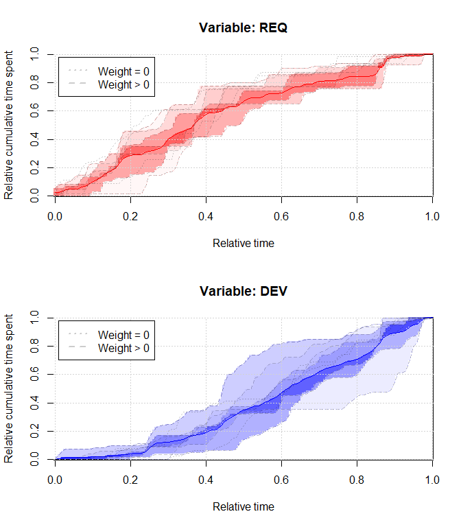
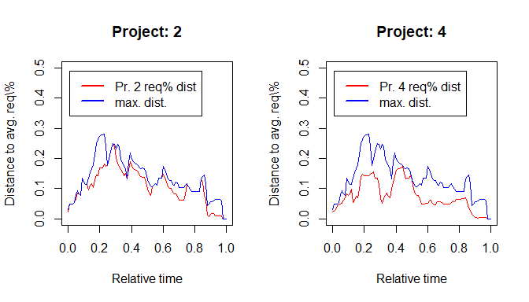

-   [Introduction](#introduction)
-   [Importing the data](#importing-the-data)
    -   [Ground truth](#ground-truth)
    -   [Project data](#project-data)
-   [Patterns for scoring the
    projects](#patterns-for-scoring-the-projects)
    -   [Pattern I: Consensus of two
        experts](#pattern-i-consensus-of-two-experts)
        -   [Variable: Requirements, analysis,
            planning](#variable-requirements-analysis-planning)
        -   [Variables: Design, implementation, testing, bugfixing and
            Descoping](#variables-design-implementation-testing-bugfixing-and-descoping)
    -   [Pattern II: Partial adaptation of first
        pattern](#pattern-ii-partial-adaptation-of-first-pattern)
        -   [Type II (a): Adapt type I using thresholds
            *t*<sub>1</sub>, *t*<sub>2</sub>](#type-ii-a-adapt-type-i-using-thresholds-t_1t_2)
    -   [Pattern III: Averaging the ground
        truth](#pattern-iii-averaging-the-ground-truth)
        -   [Determining an empirical and inhomogeneous confidence
            interval](#determining-an-empirical-and-inhomogeneous-confidence-interval)
        -   [Loss based on CI hyperplane](#loss-based-on-ci-hyperplane)
        -   [Loss based on distance to
            average](#loss-based-on-distance-to-average)
        -   [Loss based on the two previous
            approaches](#loss-based-on-the-two-previous-approaches)
-   [Scoring of projects](#scoring-of-projects)
    -   [Pattern I](#pattern-i)
        -   [Binary detection decision
            rule](#binary-detection-decision-rule)
    -   [Pattern II](#pattern-ii)
    -   [Pattern III (average)](#pattern-iii-average)
        -   [Scoring based on the confidence
            intervals](#scoring-based-on-the-confidence-intervals)
        -   [Scoring based on the distance to
            average](#scoring-based-on-the-distance-to-average)
            -   [Scoring against pattern type I and
                II (a)](#scoring-against-pattern-type-i-and-ii-a)
        -   [Linear combination of the two
            methods](#linear-combination-of-the-two-methods)

# Introduction

# Importing the data

## Ground truth

We have 9 projects conducted by students, and two raters have
**independently**, i.e., without prior communication, assessed to what
degree the AP is present in each project. This was done using a scale
from zero to ten, where zero means that the AP was not present, and ten
would indicate a strong manifestation The entire ground truth is shown
in table .

``` r
ground_truth <- read.csv(file = "../data/ground-truth.csv", sep = ";")
ground_truth$consensus_score <- ground_truth$consensus/10
```

| project    | rater.a | rater.b | consensus | rater.mean | consensus\_score |
|:-----------|--------:|--------:|----------:|-----------:|-----------------:|
| project\_1 |       2 |       0 |         1 |        1.0 |              0.1 |
| project\_2 |       0 |       0 |         0 |        0.0 |              0.0 |
| project\_3 |       8 |       5 |         6 |        6.5 |              0.6 |
| project\_4 |       8 |       6 |         8 |        7.0 |              0.8 |
| project\_5 |       1 |       1 |         1 |        1.0 |              0.1 |
| project\_6 |       4 |       1 |         2 |        2.5 |              0.2 |
| project\_7 |       2 |       3 |         3 |        2.5 |              0.3 |
| project\_8 |       0 |       0 |         0 |        0.0 |              0.0 |
| project\_9 |       1 |       4 |         5 |        2.5 |              0.5 |

Entire ground truth as of both raters

## Project data

In this section we import the projects’ **issue-tracking**-data. All
projects’ data will be normalized w.r.t. the time, i.e., each project
will have a support of \[0, 1\]. The variables are modeled as cumulative
time spent on issues. Each variable in each project will be loaded into
an instance of `Signal`.

``` r
library(readxl)

load_project_issue_data <- function(pId) {
  data <- read_excel("../data/FD_issue-based_detection.xlsx", sheet = pId)
  data$desc[is.na(data$desc)] <- 0

  req_cs <- cumsum(data$req)/sum(data$req)
  dev_cs <- cumsum(data$dev)/sum(data$dev)
  desc_cs <- cumsum(data$desc)/max(cumsum(data$dev))
  X <- seq(from = 0, to = 1, length.out = length(req_cs))

  signal_rec <- Signal$new(func = stats::approxfun(x = X, y = req_cs, yleft = 0, 
    yright = 1), name = "REQ", support = c(0, 1), isWp = TRUE)
  signal_dev <- Signal$new(func = stats::approxfun(x = X, y = dev_cs, yleft = 0, 
    yright = 1), name = "DEV", support = c(0, 1), isWp = TRUE)
  signal_desc <- Signal$new(func = stats::approxfun(x = X, y = desc_cs, yleft = 0, 
    yright = max(desc_cs)), name = "DESC", support = c(0, 1), isWp = TRUE)

  list(REQ = signal_rec, DEV = signal_dev, DESC = signal_desc)
}
```

Let’s attempt to replicate the graphs of the first project (cf. figure
):

``` r
p3_signals <- load_project_issue_data(pId = "Project3")
req_f <- p3_signals$REQ$get0Function()
dev_f <- p3_signals$DEV$get0Function()
desc_f <- p3_signals$DESC$get0Function()
```

<div class="figure" style="text-align: center">


<p class="caption">
The two variables of the first project.
</p>

</div>

OK, that works well. It’ll be the same for all projects, i.e., only two
variables, time spent on requirements- and time spent on
development-issues, is tracked. That means we will only be fitting two
variables later.

Let’s load, store and visualize all projects (cf. figure ):

``` r
all_signals <- list()
for (pId in paste0("Project", 1:9)) {
  all_signals[[pId]] <- load_project_issue_data(pId = pId)
}
```

<div class="figure" style="text-align: top">


<p class="caption">
All variables over each project’s time span.
</p>

</div>

# Patterns for scoring the projects

## Pattern I: Consensus of two experts

The initial pattern as defined for the detection of the Fire Drill AP is
imported/created/defined here, and its variables and confidence
intervals are modeled as continuous functions over time.

There are some values (x/y coordinates) for which we want to guarantee
that the confidence intervals or the variables themselves pass through.
Also, the two points in time *t*<sub>1</sub>, *t*<sub>2</sub> are
defined to be at 0.4 and 0.85, respectively.

``` r
t_1 <- 0.4
t_2 <- 0.85

# req(t_1)
req_t_1 <- 0.7

# dev(t_1), dev(t_2)
dev_t_1 <- 0.075
dev_t_2 <- 0.4
```

This initial version of the pattern is not based on any data,
observation or ground truth, but solely on two independent experts that
reached a consensus for every value a priori any of the detection
approaches.

### Variable: Requirements, analysis, planning

The variable itself is not given, only its upper- and lower
confidence-intervals (CI), where the latter simply is
req<sub>lower</sub><sup>CI</sup>(*x*) = *x*. The upper CI is given by
the informal expression
req<sub>upper</sub><sup>CI</sup>(*x*) = 1.02261 − 1.02261 × exp ( − 3.811733 × *x*).
All together is shown in figure .

The variable itself is not given, as it was not important for the binary
decision rule, whether or not a project’s variable is within the
confidence interval. It is still not important, what matters is that it
runs through the confidence interval, and we will design it by fitting a
polynomial through some inferred points from the plot. In some practical
case however, the variable’s course may be important, and while we will
later use the variable to compute some kind of loss between it, the
confidence interval and some project’s variable, we only do this for
demonstration purposes.

Let’s first define the variable using some supporting x/y coordinates.
It needs to be constrained such that it runs through 0,0 and 1,1:

``` r
req_poly <- cobs::cobs(x = seq(from = 0, to = 1, by = 0.1), y = c(0, 0.25, 0.425, 
  0.475, 0.7, 0.8, 0.85, 0.9, 0.95, 0.975, 1), pointwise = matrix(data = c(c(0, 
  0, 0), c(0, t_1, req_t_1), c(0, 1, 1)), byrow = TRUE, ncol = 3))
```

    ## qbsks2():
    ##  Performing general knot selection ...
    ## 
    ##  Deleting unnecessary knots ...

``` r
# Now we can define the variable simply by predicting from the polynomial (btw.
# this is vectorized automatically):
req <- function(x) {
  stats::predict(object = req_poly, z = x)[, "fit"]
}
```

And now for the confidence intervals:

``` r
req_ci_lower <- function(x) x
req_ci_upper <- function(x) 1.02261 - 1.02261 * exp(-3.811733 * x)
```

<div class="figure" style="text-align: center">


<p class="caption">
req% and its lower- and upper confidence interval.
</p>

</div>

### Variables: Design, implementation, testing, bugfixing and Descoping

Again, the variable for design etc. is not given, but rather only its
upper confidence interval. Its lower CI is simply always zero. The upper
CI is given by the informal expression
dev<sub>upper</sub><sup>CI</sup>(*x*) = 0.07815904 × *x* + 0.6222767 × *x*<sup>2</sup> + 0.2995643 × *x*<sup>3</sup>.
The variable for de-scoping comes without confidence interval, and is
defined by
desc (*x*) = 0.01172386 × *x* + 0.0933415 × *x*<sup>2</sup> + 0.04493464 × *x*<sup>3</sup>.

First we will define/fit a polynomial that describes the variable for
design etc., the same way we did for requirements etc. we do know that
it should pass through the points \[*t*<sub>1</sub>,  ≈ 0.075\], as well
as \[*t*<sub>2</sub>,  ≈ 0.4\].

``` r
dev_poly <- cobs::cobs(x = seq(from = 0, to = 1, by = 0.1), y = c(0, 0.0175, 0.035, 
  0.055, dev_t_1, 0.014, 0.165, 0.2, 0.28, 0.475, 1), pointwise = matrix(data = c(c(0, 
  t_1, dev_t_1), c(0, t_2, dev_t_2), c(0, 1, 1)), byrow = TRUE, ncol = 3))
```

    ## qbsks2():
    ##  Performing general knot selection ...
    ## 
    ##  WARNING! Since the number of  6  knots selected by  AIC  reached the
    ##    upper bound during general knot selection, you might want to rerun
    ##    cobs with a larger number of knots. 
    ## 
    ##  Deleting unnecessary knots ...
    ## 
    ##  WARNING! Since the number of  6  knots selected by  AIC  reached the
    ##    upper bound during general knot selection, you might want to rerun
    ##    cobs with a larger number of knots.

``` r
# Now we can define the variable simply by predicting from the polynomial (btw.
# this is vectorized automatically):
dev <- function(x) {
  temp <- stats::predict(object = dev_poly, z = x)[, "fit"]
  # I cannot constrain the polynomial at 0,0 and it returns a very slight negative
  # value there, so let's do it this way:
  temp[temp < 0] <- 0
  temp[temp > 1] <- 1
  temp
}
```

Next we define the upper confidence interval for the variable `DEV`,
then the variable for de-scoping. All is shown in figure .

``` r
dev_ci_upper <- function(x) 0.07815904 * x + 0.6222767 * x^2 + 0.2995643 * x^3
desc <- function(x) 0.01172386 * x + 0.0933415 * x^2 + 0.04493464 * x^3
```

<div class="figure" style="text-align: center">


<p class="caption">
The variable dev% and its upper confidence interval, as well as the
variable desc%.
</p>

</div>

## Pattern II: Partial adaptation of first pattern

We will be attempting three kinds of adaptations to the first pattern:

1.  Learn *t*<sub>1</sub>, *t*<sub>2</sub> from the data: There is not
    much to learn, but we could attempt to define these two thresholds
    as weighted average over the ground truth. Alternatively, we could
    formulate an optimization problem. We then use *time warping* to
    alter the first pattern, **including** its confidence intervals.
2.  Additionally to a (after learning *t*<sub>1</sub>, *t*<sub>2</sub>),
    we will apply *amplitude warping* using **`srBTAW`**.
3.  Take the first pattern and apply both, *boundary time warping*
    **and** *boundary amplitude warping*, to produce a pattern that is
    (hopefully) closest to all projects in the ground truth. This is the
    very same approach we attempted for adapting the pattern of type I
    that we defined for the Fire Drill in source code.

### Type II (a): Adapt type I using thresholds *t*<sub>1</sub>, *t*<sub>2</sub>

The two variables `REQ` and `DEV` in the first pattern describe the
cumulative time spent on two distinct activities. It was designed with
focus on the confidence intervals, and a binary decision rule, such that
the actual variables’ course was not of interest.

To find the optimal value for a threshold, we could look at when each
project is closest to req (*t*<sub>1</sub>) and dev (*t*<sub>2</sub>)
(in relative time), and then compute a weighted average over it.
However, since we already modeled each project’s variables as
*continuous-time stochastic process*, I suggest we use an
optimization-based approach.

``` r
tempf <- all_signals$Project5$REQ$get0Function()
tempf1 <- function(x) abs(tempf(x) - req_t_1)
optR <- optimize(tempf1, interval = c(0, 1))
optR
```

    ## $minimum
    ## [1] 0.6159966
    ## 
    ## $objective
    ## [1] 0.2

<div class="figure" style="text-align: center">


<p class="caption">
The non-optimal optimum found by gradient-based optimization in project
5.
</p>

</div>

We will find the optimum using `nlopt` and a global optimization,
because we actually will have a global optimum by re-arranging each
project’s variables. Also, gradient-based methods do not work well
because of the nature of the variables, having large horizontal
plateaus. This can be seen in figure . Approaches using the built-in
`optim` do hence not work well, the problem is clearly demonstrated in
the previous code chunk, resulting in an objective  ≫ 0 (which should
ideally be 0).

We want to find out when each project is closest to the previously
defined thresholds. Each variable is a cumulative aggregation of the
underlying values, which means that we have monotonic behavior.

$$
\\begin{aligned}
  \\min\_{\\hat{t}\_1,\\hat{t}\_2\\in R}&\\;{\\operatorname{req}(\\hat{t}\_1), \\operatorname{dev}(\\hat{t}\_2)}\\;\\text{,}
  \\\\\[1ex\]
  \\text{subject to}&\\;0\\leq\\hat{t}\_1,\\hat{t}\_2\\leq1\\;\\text{, using}
  \\\\\[1ex\]
  \\mathcal{L}\_{\\operatorname{req}}(x)=&\\;\\left\\lvert\\,\\operatorname{req}(x)-\\operatorname{req}(t\_1)\\,\\right\\rvert\\;\\text{, and}
  \\\\\[1ex\]
  \\mathcal{L}\_{\\operatorname{dev}}(x)=&\\;\\left\\lvert\\,\\operatorname{dev}(x)-\\operatorname{dev}(t\_2)\\,\\right\\rvert\\;\\text{(quasi-convex loss functions).}
\\end{aligned}
$$

The objective functions hence will be to find the global optimum
(minimum), which occurs at *y* ≈ 0. Since we have plateaus in our data,
we will potentially have infinitely many global optima. However, we are
satisfied with any that is  ≈ 0.

$$
\\begin{aligned}
  \\mathcal{O}\_{\\operatorname{dev}}(x)=&\\;\\underset{\\hat{x}\\in R}{arg\\,min}\\;{L\_{\\operatorname{dev}}(x)}\\;\\text{, and}
  \\\\\[1ex\]
  \\mathcal{O}\_{\\operatorname{req}}(x)=&\\;\\underset{\\hat{x}\\in R}{arg\\,min}\\;{L\_{\\operatorname{req}}(x)}\\text{.}
\\end{aligned}
$$

``` r
library(nloptr)

set.seed(1)

t1t2_opt <- matrix(ncol = 4, nrow = length(all_signals))
rownames(t1t2_opt) <- names(all_signals)
colnames(t1t2_opt) <- c("req_sol", "dev_sol", "req_obj", "dev_obj")

find_global_low <- function(f) {
  nloptr(x0 = 0.5, opts = list(maxeval = 1000, algorithm = "NLOPT_GN_DIRECT_L_RAND"), 
    eval_f = f, lb = 0, ub = 1)
}

for (pId in paste0("Project", 1:9)) {
  sig_REQ <- all_signals[[pId]]$REQ$get0Function()
  req_abs <- function(x) abs(sig_REQ(x) - req_t_1)

  sig_DEV <- all_signals[[pId]]$DEV$get0Function()
  dev_abs <- function(x) abs(sig_DEV(x) - dev_t_2)

  optRes_REQ <- find_global_low(f = req_abs)
  optRes_DEV <- find_global_low(f = dev_abs)

  t1t2_opt[pId, ] <- c(optRes_REQ$solution, optRes_DEV$solution, optRes_REQ$objective, 
    optRes_DEV$objective)
}
```

|          |  req\_sol |  dev\_sol | req\_obj | dev\_obj |
|:---------|----------:|----------:|---------:|---------:|
| Project1 | 0.4445887 | 0.4762108 |        0 |        0 |
| Project2 | 0.3804348 | 0.5967236 |        0 |        0 |
| Project3 | 0.4924851 | 0.5987420 |        0 |        0 |
| Project4 | 0.6232323 | 0.6427128 |        0 |        0 |
| Project5 | 0.4407407 | 0.5476190 |        0 |        0 |
| Project6 | 0.3973381 | 0.7788398 |        0 |        0 |
| Project7 | 0.3780904 | 0.5306457 |        0 |        0 |
| Project8 | 0.4775269 | 0.4451613 |        0 |        0 |
| Project9 | 0.6582329 | 0.4357020 |        0 |        0 |

Optimum values for *t*<sub>1</sub> and *t*<sub>2</sub> for each project,
together with the loss of each project’s objective function at that
offset (ideally 0).

From the table , we can take an example to demonstrate that the
optimization indeed found the global optimum (or a value very close to
it, usually with a deviation  &lt; 1*e*<sup> − 15</sup>). For the picked
example of project 5, we can clearly observe a value for *x* that
results in a solution that is  ≈ 0.

<div class="figure" style="text-align: center">


<p class="caption">
Example of finding the optimum for req(*t*<sub>1</sub>) in project 5.
</p>

</div>

Figure depicts the optimal solution as found by using global
optimization. Now what is left, is to calculate the weighted average for
the optimized **t̂**<sub>**1**</sub>, **t̂**<sub>**2**</sub>. The weighted
arithmetic mean is defined as:

$$
\\begin{aligned}
  \\text{weighted mean}=&\\;\\Big\[\\sum\\bm{\\omega}\\Big\]^{-1}\\times\\bm{\\omega}^\\top\\cdot\\bm{\\hat{t}}\\;\\text{, where}
  \\\\\[1ex\]
  \\bm{\\omega}\\dots&\\;\\text{weight vector that corresponds to the consensus-score, and}
  \\\\\[1ex\]
  \\bm{\\hat{t}}\\dots&\\;\\text{vector with optimal values for either}\\;t\_1\\;\\text{or}\\;t\_2\\;\\text{(as learned earlier).}
\\end{aligned}
$$

``` r
omega <- ground_truth$consensus_score
names(omega) <- paste0("Project", 1:length(omega))

t1_wavg <- t1t2_opt[, 1] %*% omega/sum(omega)
print(c(t_1, t1_wavg))
```

    ## [1] 0.4000000 0.5402389

``` r
t2_wavg <- t1t2_opt[, 2] %*% omega/sum(omega)
print(c(t_2, t2_wavg))
```

    ## [1] 0.850000 0.580235

Originally, *t*<sub>1</sub> was guessed to be located at 0.4, with
req (*t*<sub>1</sub>) = 0.7. The weighted average over the optimized
values (where req (*t̂*<sub>1</sub>) ≈ 0.7) suggests defining
*t̂*<sub>1</sub>=0.54024.

*t*<sub>2</sub> on the other hand was originally located at 0.85, with
dev (*t*<sub>2</sub>) = 0.4. The weighted average over the optimized
values (where dev (*t̂*<sub>2</sub>) ≈ 0.4) suggests defining
*t̂*<sub>2</sub>=0.58024.

Having learned these values, we can now adapt the pattern using time
warping. For that, we have to instantiate the pattern using `srBTAW`,
add the original boundaries and set them according to what we learned.
Below, we define a function that can warp a single variable.

``` r
timewarp_variable <- function(f, t, t_new) {
  temp <- SRBTW$new(wp = f, wc = f, theta_b = c(0, t_new, 1), gamma_bed = c(0, 
    1, sqrt(.Machine$double.eps)), lambda = c(0, 0), begin = 0, end = 1, openBegin = FALSE, 
    openEnd = FALSE)
  temp$setParams(`names<-`(c(t, 1 - t), c("vtl_1", "vtl_2")))
  function(x) sapply(X = x, FUN = temp$M)
}
```

``` r
req_p2a <- timewarp_variable(f = req, t = t_1, t_new = t1_wavg)
req_ci_lower_p2a <- timewarp_variable(f = req_ci_lower, t = t_1, t_new = t1_wavg)
req_ci_upper_p2a <- timewarp_variable(f = req_ci_upper, t = t_1, t_new = t1_wavg)
```

<div class="figure" style="text-align: center">


<p class="caption">
req% and its lower- and upper confidence interval after time warping for
pattern type I (a).
</p>

</div>

Moving the boundary *t*<sub>1</sub> farther behind, changes the variable
`REQ` and its confidence interval slightly, as can be seen in figure .
Next, we will adapt the remaining variables and their confidence
intervals.

``` r
dev_p2a <- timewarp_variable(f = dev, t = t_2, t_new = t2_wavg)
dev_ci_upper_p2a <- timewarp_variable(f = dev_ci_upper, t = t_2, t_new = t2_wavg)
desc_p2a <- timewarp_variable(f = desc, t = t_2, t_new = t2_wavg)
```

<div class="figure" style="text-align: center">


<p class="caption">
The variable dev% and its upper confidence interval, as well as the
variable desc%, after time warping for pattern type I (a).
</p>

</div>

Moving the boundary *t*<sub>2</sub> was a more significant change for
variables `DEV` and `DESC` than it was for `REQ`, as of figure .

## Pattern III: Averaging the ground truth

This is the same approach we undertook for pattern type III (average)
for the Fire Drill in source code. However, we will also learn an
**empirical confidence interval**, which is later used for two
additional detection methods. These methods have the advantage that they
work over arbitrary (integration) intervals, making them also applicable
for early detection of the process (i.e., not the entire process needs
to be observed, and we can just attempt to detect what we have so far).

``` r
p3_weighted_var <- function(name, omega) {
  funcs <- list()
  for (pId in names(all_signals)) {
    funcs[[pId]] <- all_signals[[pId]][[name]]$get0Function()
  }

  function(x) sapply(X = x, FUN = function(x_) {
    omega %*% unlist(lapply(funcs, function(f) f(x_)))/sum(omega)
  })
}
```

``` r
req_p3 <- p3_weighted_var(name = "REQ", omega = omega)
dev_p3 <- p3_weighted_var(name = "DEV", omega = omega)
desc_p3 <- p3_weighted_var(name = "DESC", omega = omega)
```

The computed weighted average-variables for `REQ` and `DEV` are shown in
figure .

<div class="figure" style="text-align: center">


<p class="caption">
The weighted average for the two variables req% and dev%.
</p>

</div>

### Determining an empirical and inhomogeneous confidence interval

Also, we want to calculate an empirical confidence interval and
-surface, based on the projects’ data and the consensus of the ground
truth. The boundary of the lower confidence interval is defined as the
infimum of all signals (and the upper CI as the supremum of all
signals):

$$
\\begin{aligned}
  \\bm{f}\\dots&\\;\\text{vector of functions (here: project signals),}
  \\\\\[1ex\]
  \\operatorname{CI}\_{\\text{upper}}(x)=&\\;\\sup{\\Bigg(\\forall\\,f\\in\\bm{f}\\;\\bigg\[\\begin{cases}
    -\\infty,&\\text{if}\\;\\bm{\\omega}\_n=0,
    \\\\
    f\_n(x),&\\text{otherwise}
  \\end{cases}\\bigg\]\\;,\\;\\frown\\;,\\;\\Big\[\\dots\\Big\]\\Bigg)}\\;\\text{,}
  \\\\\[1ex\]
  \\operatorname{CI}\_{\\text{upper}}(x)=&\\;\\inf{\\Bigg(\\forall\\,f\\in\\bm{f}\\;\\bigg\[\\begin{cases}
    \\infty,&\\text{if}\\;\\bm{\\omega}\_n=0,
    \\\\
    f\_n(x),&\\text{otherwise}
  \\end{cases}\\bigg\]\\;,\\;\\frown\\;,\\;\\Big\[\\dots\\Big\]\\Bigg)}\\;\\text{.}
\\end{aligned}
$$

``` r
funclist_REQ <- list()
funclist_DEV <- list()
funclist_DESC <- list()
for (pId in names(all_signals)) {
  funclist_REQ[[pId]] <- all_signals[[pId]]$REQ$get0Function()
  funclist_DEV[[pId]] <- all_signals[[pId]]$DEV$get0Function()
  funclist_DESC[[pId]] <- all_signals[[pId]]$DESC$get0Function()
}

CI_bound_p3avg <- function(x, funclist, omega, upper = TRUE) {
  sapply(X = x, FUN = function(x_) {
    val <- unlist(lapply(X = names(funclist), FUN = function(fname) {
      if (omega[fname] == 0) 
        (if (upper) 
          -Inf else Inf) else funclist[[fname]](x_)
    }))

    if (upper) 
      max(val) else min(val)
  })
}

req_ci_upper_p3avg <- function(x) CI_bound_p3avg(x = x, funclist = funclist_REQ, 
  omega = omega, upper = TRUE)
req_ci_lower_p3avg <- function(x) CI_bound_p3avg(x = x, funclist = funclist_REQ, 
  omega = omega, upper = FALSE)
dev_ci_upper_p3avg <- function(x) CI_bound_p3avg(x = x, funclist = funclist_DEV, 
  omega = omega, upper = TRUE)
dev_ci_lower_p3avg <- function(x) CI_bound_p3avg(x = x, funclist = funclist_DEV, 
  omega = omega, upper = FALSE)
desc_ci_upper_p3avg <- function(x) CI_bound_p3avg(x = x, funclist = funclist_DESC, 
  omega = omega, upper = TRUE)
desc_ci_lower_p3avg <- function(x) CI_bound_p3avg(x = x, funclist = funclist_DESC, 
  omega = omega, upper = FALSE)
```

While the above expressions define the *boundaries* of the lower and
upper confidence intervals, we also need a function that interpolates in
between. Recall that the CI of the first pattern was **homogeneous**,
i.e., it provided no gradation, and was used for a binary decision rule.
If we define a function that bases the strength of the confidence on the
values of the ground truth of each project’s variable, then it also
means that with that pattern, all projects are included in the binary
decision rule. Having gradation in the CI will allow us to make more
probabilistic statements by computing some kind of score.

Figures and show the average variables and the empirical confidence
intervals.

<div class="figure" style="text-align: center">


<p class="caption">
Empirical (average) req% and dev% and their lower- and upper empirical
weighted confidence intervals (here without gradation).
</p>

</div>

<div class="figure" style="text-align: center">


<p class="caption">
Empirical (average) desc% and its lower- and upper empirical weighted
confidence intervals (here without gradation).
</p>

</div>

But first, we define a function *f* : *R*<sup>2</sup> ↦ *R* to compute a
CI with gradation. For each x/y coordinate, it shall output a confidence
based on the weights as of the ground truth, and all projects’ variables
that output a *y* that is smaller than (larger than) the given *y* shall
be excluded.

$$
\\begin{aligned}
  h\_{\\text{upper}}(f,x,y)=&\\;\\begin{cases}
    \\begin{cases}
      f(x),&\\text{if}\\;f(x)\\neq0,
      \\\\
      \\epsilon,&\\text{otherwise,}
    \\end{cases},&\\text{if}\\;f(x)\\geq y,
    \\\\
    0,&\\text{otherwise}
  \\end{cases}\\;\\text{, where}\\;\\epsilon\\;\\text{is small non-zero constant,}
  \\\\
  \\operatorname{CI}^+(x,y)=&\\;\\bm{\\omega}^\\top\\cdot h\_{\\text{upper}}(\\bm{f},x,y)\\times\\Big\[\\sum\\bm{\\omega}\\Big\]^{-1}\\text{.}
\\end{aligned}
$$

CI<sup>+</sup> is to be used for the upper confidence region, and
likewise, we define CI<sup>−</sup> to be equivalent, but it uses
*h*<sub>lower</sub>, that switches the condition to *f*(*x*) ≤ *y*. The
decision on whether to use CI<sup>+</sup> or CI<sup>−</sup> depends on
whether the given *y* is above or below the *computed average variable*,
i.e.,

$$
\\begin{aligned}
  \\bar{g}(x)\\dots&\\;\\text{the computed average variable,}
  \\\\\[1ex\]
  \\operatorname{CI}(x,y)=&\\;\\begin{cases}
    0,&\\text{if}\\;y&gt;\\operatorname{CI}\_{\\text{upper}}(x)\\;\\text{,}
    \\\\
    0,&\\text{if}\\;y&lt;\\operatorname{CI}\_{\\text{lower}}(x)\\;\\text{,}
    \\\\
    \\bm{\\omega}^\\top\\cdot\\Bigg\[\\begin{cases}
      h\_{\\text{upper}}(\\bm{f},x,y),&\\text{if}\\;\\bar{g}(x)&lt;y,
      \\\\
      h\_{\\text{lower}}(\\bm{f},x,y),&\\text{otherwise}
    \\end{cases}\\Bigg\]\\times\\Big\[\\sum\\bm{\\omega}\\Big\]^{-1},&\\text{otherwise}
  \\end{cases}\\;\\text{.}
\\end{aligned}
$$

With this definition, we can compute a loss that is then based on a path
that goes through this hyperplane. That path is a project’s variable.

``` r
h_p3avg <- function(funclist, x, y, upper = TRUE) {
  unlist(lapply(X = funclist, FUN = function(f) {
    val <- f(x)
    if (val == 0) 
      val <- sqrt(.Machine$double.eps)
    if ((upper && val >= y) || (!upper && val <= y)) 
      val else 0
  }))
}

h_upper_p3avg <- function(funclist, x, y) h_p3avg(funclist = funclist, x = x, y = y, 
  upper = TRUE)
h_lower_p3avg <- function(funclist, x, y) h_p3avg(funclist = funclist, x = x, y = y, 
  upper = FALSE)

CI_p3avg <- function(x, y, funclist, f_ci_upper, f_ci_lower, gbar, omega) {
  if (y > f_ci_upper(x) || y < f_ci_lower(x)) {
    return(0)
  }

  gbarval <- gbar(x)
  hval <- if (gbarval < y) {
    h_upper_p3avg(funclist = funclist, x = x, y = y)
  } else {
    h_lower_p3avg(funclist = funclist, x = x, y = y)
  }

  omega %*% hval/sum(omega)
}

CI_req_p3avg <- function(x, y) CI_p3avg(x = x, y = y, funclist = funclist_REQ, f_ci_upper = req_ci_upper_p3avg, 
  f_ci_lower = req_ci_lower_p3avg, gbar = req_p3, omega = omega)
CI_dev_p3avg <- function(x, y) CI_p3avg(x = x, y = y, funclist = funclist_DEV, f_ci_upper = dev_ci_upper_p3avg, 
  f_ci_lower = dev_ci_lower_p3avg, gbar = dev_p3, omega = omega)
CI_desc_p3avg <- function(x, y) CI_p3avg(x = x, y = y, funclist = funclist_DESC, 
  f_ci_upper = desc_ci_upper_p3avg, f_ci_lower = desc_ci_lower_p3avg, gbar = desc_p3, 
  omega = omega)
```

``` r
x <- seq(0, 1, length.out = 200)
y <- seq(0, 1, length.out = 200)

compute_z_p3avg <- function(varname) {
  # We cannot call outer because our functions are not properly vectorized. z <-
  # outer(X = x, Y = y, FUN = CI_req_p3avg)
  f <- if (varname == "REQ") {
    CI_req_p3avg
  } else if (varname == "DEV") {
    CI_dev_p3avg
  } else {
    CI_desc_p3avg
  }

  z <- matrix(nrow = length(x), ncol = length(y))
  for (i in 1:length(x)) {
    for (j in 1:length(y)) {
      z[i, j] <- f(x = x[i], y = y[j])
    }
  }
  z
}

z_req <- loadResultsOrCompute(file = "../results/ci_p3avg_z_req.rds", computeExpr = {
  compute_z_p3avg(varname = "REQ")
})
z_dev <- loadResultsOrCompute(file = "../results/ci_p3avg_z_dev.rds", computeExpr = {
  compute_z_p3avg(varname = "DEV")
})
z_desc <- loadResultsOrCompute(file = "../results/ci_p3avg_z_desc.rds", computeExpr = {
  compute_z_p3avg(varname = "DESC")
})
```

Finally, we show the empirical confidence intervals in figures and .
Note that the minimum non-zero confidence is 0, while the maximum is 1.
Therefore, while we gradate the colors from 0 to 1, we slightly scale
and transform the grid’s non-zero values using the expression
0.9 × *z* + 0.1, to improve the visibility.

<div class="figure" style="text-align: center">


<p class="caption">
The empirical confidence intervals for the two variables req% and dev%.
Higher saturation of the color correlates with higher confidence.
Projects with zero weight contribute to the CIs’ boundaries, but not to
the hyperplane.
</p>

</div>

<div class="figure" style="text-align: center">


<p class="caption">
The empirical confidence intervals for the variable desc%. Higher
saturation of the color correlates with higher confidence.
</p>

</div>

### Loss based on CI hyperplane

Simply put, this loss is based on the confidence interval’s hyperplane,
and calculates an absolute average confidence based on it. Each signal
evaluated against the hyperplane is a slice of it.

$$
\\begin{aligned}
  \\mathit{L}^{\\text{avgconf}}(x\_1,x\_2,f)=&\\;\\Bigg\[\\int\_{x\_1}^{x\_2}\\,\\operatorname{CI}(x, f(x))\\,dx\\Bigg\]\\times(x\_2-x\_1)^{-1}\\;\\text{,}
  \\\\
  &\\;\\text{where}\\;f\\;\\text{is the signal/variable and}\\;x\_2&gt;x\_1\\text{.}
\\end{aligned}
$$

We will do a full evaluation later, including creating a decision rule
or learning how to scale the average weight to the consensus score, but
let’s take one project and test this.

``` r
L_avgconf_p3_avg <- function(x1, x2, f, CI) {
  cubature::cubintegrate(f = function(x) {
    CI(x = x, y = f(x))
  }, lower = x1, upper = x2)$integral/(x2 - x1)
}

loadResultsOrCompute(file = "../results/ci_p3avg_Lavg-test.rds", computeExpr = {
  c(P2_REQ = L_avgconf_p3_avg(x1 = 0, x2 = 1, f = all_signals$Project2$REQ$get0Function(), 
    CI = CI_req_p3avg), P4_REQ = L_avgconf_p3_avg(x1 = 0, x2 = 1, f = all_signals$Project4$REQ$get0Function(), 
    CI = CI_req_p3avg))
})
```

    ##    P2_REQ    P4_REQ 
    ## 0.1069433 0.2379591

Plotting `L_avgconf_p3_avg` for the `REQ`-variable of both projects 2
and 4 gives us the function in figure . We can clearly observe that the
area under the latter is larger, and so will be the average.

<div class="figure" style="text-align: center">


<p class="caption">
The three variables of the first project.
</p>

</div>

From this example we can clearly see a difference in average confidence,
which seems to be somewhat reconciling the projects’ weights (consensus
score). Let’s try the next method, too.

### Loss based on distance to average

We may choose to ignore the previously computed confidence hyperplane
and compute a cost by, e.g., quantifying the distance between the
previously computed average variable and another signal/variable. More
precisely, we quantify the area between both variables, and compare it
to the largest possible area, thereby obtaining an upper bound (with the
lower bound being 0 obviously). Unlike the previous attempt, this
function is a loss, that maps to the range \[0, 1\], where 1 means the
largest possible distance (i.e., the variable compared is entirely
outside (or collinear with) the confidence intervals). Hence this
function is an attempt of measuring of dissimilarity.

This method requires three features: A reference-variable, an upper- and
a lower confidence interval. However, none of these are required to be
of empirical nature. For example, we can even apply this method to the
first of our patterns. A reference-variable may be generated as the
average between the confidence intervals, etc. All this makes this
method versatile. Its robustness comes from the fact any variable it
scores, is confined to the boundaries of the confidence intervals.

$$
\\begin{aligned}
  \\mathit{L}^{\\text{areadist}}(x\_1,x\_2,f)=&\\;\\int\_{x\_1}^{x\_2}\\,\\left\\lvert\\,\\bar{g}(x)-\\overbrace{\\min{\\Big(\\operatorname{CI}\_{\\text{upper}}(x),\\;\\max{\\big(\\operatorname{CI}\_{\\text{lower}}(x), f(x)\\big)}\\Big)}}^{\\text{Confining of}\\;f\\;\\text{to the confidence intervals.}}\\,\\right\\rvert\\,dx
  \\\\\[1ex\]
  &\\;\\times\\Bigg\[\\;\\overbrace{\\int\_{x\_1}^{x\_2}\\,\\sup{\\Big(\\bar{g}(x)-\\operatorname{CI}\_{\\text{lower}}(x)\\;,\\;\\operatorname{CI}\_{\\text{upper}}(x)-\\bar{g}(x)\\Big)\\,dx}}^{\\text{maximum possible area between}\\;\\bar{g}(x)\\;\\text{and either CI.}}\\;\\Bigg\]^{-1}\\;\\text{.}
\\end{aligned}
$$

This loss may also be alternatively defined using the following
denominator:

$$
\\begin{aligned}
  \\mathit{L}^{\\text{areadist2}}(x\_1,x\_2,f)=&\\;\\int\_{x\_1}^{x\_2}\\,\\left\\lvert\\,\\bar{g}(x)-\\min{\\Big(\\operatorname{CI}\_{\\text{upper}}(x),\\;\\max{\\big(\\operatorname{CI}\_{\\text{lower}}(x), f(x)\\big)}\\Big)}\\,\\right\\rvert\\,dx
  \\\\\[1ex\]
  &\\;\\times\\Bigg\[\\;\\int\_{x\_1}^{x\_2}\\,\\begin{cases}
    \\operatorname{CI}\_{\\text{upper}}(x)-\\bar{g}(x),&\\text{if}\\;f(x)\\geq\\bar{g}(x),
    \\\\
    \\bar{g}(x)-\\operatorname{CI}\_{\\text{lower}}(x),&\\text{otherwise.}
  \\end{cases}\\,dx\\;\\Bigg\]^{-1}\\;\\text{.}
\\end{aligned}
$$

The difference is subtle but important, and corrects better for
asymmetric confidence intervals. It now captures the maximum possible
area, based on the currently valid confidence interval (at *x*). For the
remainder, we will always be using the **second variant of this loss**
because of this.

Again, we will do a full evaluation later, but let’s just attempt
computing this loss once.

``` r
L_areadist_p3_avg <- function(x1, x2, f, gbar, CI_upper, CI_lower, use2ndVariant = FALSE) {
  int1 <- cubature::cubintegrate(f = function(x) {
    abs(gbar(x) - min(CI_upper(x), max(CI_lower(x), f(x))))
  }, lower = x1, upper = x2)$integral

  int2 <- cubature::cubintegrate(f = function(x) {
    gbarval <- gbar(x)
    if (use2ndVariant) {
      if (f(x) >= gbarval) {
        CI_upper(x) - gbarval
      } else {
        gbarval - CI_lower(x)
      }
    } else {
      max(gbarval - CI_lower(x), CI_upper(x) - gbarval)
    }
  }, lower = x1, upper = x2)$integral

  c(area = int1, maxarea = int2, dist = int1/int2)
}

loadResultsOrCompute(file = "../results/ci_p3avg_Larea-test.rds", computeExpr = {
  list(P2_REQ = L_areadist_p3_avg(x1 = 0, x2 = 1, f = all_signals$Project2$REQ$get0Function(), 
    use2ndVariant = TRUE, gbar = req_p3, CI_upper = req_ci_upper_p3avg, CI_lower = req_ci_lower_p3avg), 
    P4_REQ = L_areadist_p3_avg(x1 = 0, x2 = 1, f = all_signals$Project4$REQ$get0Function(), 
      use2ndVariant = TRUE, gbar = req_p3, CI_upper = req_ci_upper_p3avg, CI_lower = req_ci_lower_p3avg))
})
```

    ## $P2_REQ
    ##      area   maxarea      dist 
    ## 0.1084515 0.1212518 0.8944326 
    ## 
    ## $P4_REQ
    ##      area   maxarea      dist 
    ## 0.0752516 0.1114793 0.6750274

Let’s show the maximum possible distance vs. the distance of a project’s
variable in a plot (cf. figure ). These figures clearly show the smaller
distance of project 4 to the average. This is expected, as this project
has the highest weight, so the average `REQ%`-variable resembles this
project most.

<div class="figure" style="text-align: center">


<p class="caption">
The two variables of the first project.
</p>

</div>

### Loss based on the two previous approaches

This is an early-stadium idea. The essence is that for every *x*, we
have a vertical “confidence-slice” that we can integrate over and get an
average confidence. Then, we obtain the confidence for the variable in
question at the same *x*. Both of these values can then be put into a
relation. If we were to integrate this function, we would get the ratio
between the variable’s confidence and the average confidence, on
average.

``` r
use_x <- 0.8
dev_p3(use_x)
```

    ## [1] 0.706636

``` r
cubature::cubintegrate(f = function(x) {
  CI_dev_p3avg(x = use_x, y = x)
}, lower = dev_ci_lower_p3avg(use_x), upper = dev_ci_upper_p3avg(use_x))$integral/(dev_ci_upper_p3avg(use_x) - 
  dev_ci_lower_p3avg(use_x))
```

    ## [1] 0.1896855

``` r
CI_dev_p3avg(x = use_x, (all_signals$Project4$DEV$get0Function())(use_x))
```

    ##           [,1]
    ## [1,] 0.2165659

At `x=0.8`, the average variable is at  ≈ 0.71, the average confidence
for the slice is  ≈ 0.19, and the confidence of the evaluated variable
(project 4, `DEV`) is at  ≈ 0.22. This means that the ratio is in the
interval (0, ∞). A “perfect” ratio of 1.0 would express that the tested
variable is, on average, equal to the average confidence.

# Scoring of projects

In the technical report for detecting the Fire Drill using source code
data, we already explored a wide range of possible patterns and scoring
mechanisms. All of them are based on comparing/scoring the variables
(process model vs. process). Some of these we will apply here, too, but
our focus is first on detection mechanisms that can facilitate the
**confidence intervals**.

## Pattern I

This is the expert-guess of how the Fire Drill would manifest in
issue-tracking data. The pattern was conceived with precise values for
the confidence intervals at certain points
(*t*<sub>1</sub>, *t*<sub>2</sub>), and the variables were not of
importance. It was only used thus far using a binary decision rule.

### Binary detection decision rule

In this section, we will only replicate earlier results by applying the
existing rule. It is further formulated using indicators and thresholds
as:

$$
\\begin{aligned}
  I\_1 =&\\;\\operatorname{req}(t\_1) &lt; y\_1 \\land \\operatorname{req}(t\_1) &gt; y\_2,
  \\\\\[1ex\]
  I\_2 =&\\;\\operatorname{dev}(t\_1) &lt; y\_3 \\land \\operatorname{dev}(t\_2) &lt; y\_4,
  \\\\\[1ex\]
  I\_3 =&\\;\\operatorname{desc}(1) &gt; y\_5,
  \\\\\[1em\]
  \\operatorname{detect}^{\\text{binary}}(I\_1,I\_2,I\_3) =&\\;\\begin{cases}
    1,&\\text{if}\\;I\_1 \\land (I\_2 \\lor I\_3),
    \\\\
    0,&\\text{otherwise}
  \\end{cases}\\;\\text{, using the threshold values}
  \\\\\[1ex\]
  \\bm{y}=&\\;\\{0.8,0.4,0.15,0.7,0.15\\}^\\top\\;\\text{.}
\\end{aligned}
$$

This can be encapsulated in a single function:

``` r
p1_dr <- function(projName, y = c(0.8, 0.4, 0.15, 0.7, 0.15)) {
  req <- all_signals[[projName]]$REQ$get0Function()
  dev <- all_signals[[projName]]$DEV$get0Function()
  desc <- all_signals[[projName]]$DESC$get0Function()

  I1 <- req(t_1) < y[1] && req(t_1) > y[2]
  I2 <- dev(t_1) < y[3] && dev(t_2) < y[4]
  I3 <- desc(1) > y[5]

  I1 && (I2 || I3)
}
```

``` r
temp <- sapply(X = names(all_signals), FUN = p1_dr)
p1_detect <- data.frame(detect = temp, ground_truth = ground_truth$consensus, correct = (temp & 
  ground_truth$consensus >= 5) | (!temp & ground_truth$consensus < 5))
```

|          | detect | ground\_truth | correct |
|:---------|:-------|--------------:|:--------|
| Project1 | FALSE  |             1 | TRUE    |
| Project2 | FALSE  |             0 | TRUE    |
| Project3 | TRUE   |             6 | TRUE    |
| Project4 | TRUE   |             8 | TRUE    |
| Project5 | FALSE  |             1 | TRUE    |
| Project6 | TRUE   |             2 | FALSE   |
| Project7 | FALSE  |             3 | TRUE    |
| Project8 | FALSE  |             0 | TRUE    |
| Project9 | TRUE   |             5 | TRUE    |

Binary detection using a decision rule based on homogeneous confidence
intervals of pattern I.

In table we show the results of the binary detection, which is based on
the manually defined homogeneous confidence intervals.

## Pattern II

*TODO*.

## Pattern III (average)

The third kind of pattern is based on data only, all the variables,
confidence intervals and the strength thereof are based on the nine
projects and the weight, which is the same as their consensus score.

*TODO*.

### Scoring based on the confidence intervals

We have calculated gradated confidence intervals, which means two
things. First, we cannot apply a binary detection rule any longer, as
the boundaries of the intervals include each project, only the weight is
different. Second, when calculating a score, we will obtain a continuous
measure, of which we can calculate a correlation to the consensus score
of the ground truth, or, e.g., fit a linear model for scaling these
scores.

``` r
p3_avg_ci_scores <- loadResultsOrCompute(file = "../results/p3_avg_ci_scores.rds", 
  computeExpr = {
    doWithParallelCluster(numCores = length(all_signals), expr = {
      library(foreach)

      foreach::foreach(pId = names(all_signals), .inorder = TRUE, .combine = rbind) %dopar% 
        {
          req <- all_signals[[pId]]$REQ$get0Function()
          dev <- all_signals[[pId]]$DEV$get0Function()
          desc <- all_signals[[pId]]$DESC$get0Function()

          `rownames<-`(data.frame(REQ = L_avgconf_p3_avg(x1 = 0, x2 = 1, 
          f = req, CI = CI_req_p3avg), DEV = L_avgconf_p3_avg(x1 = 0, x2 = 1, 
          f = dev, CI = CI_dev_p3avg), DESC = L_avgconf_p3_avg(x1 = 0, 
          x2 = 1, f = desc, CI = CI_desc_p3avg)), pId)
        }
    })
  })
```

Table shows the computed scores.

|          |       REQ |       DEV |      DESC |
|:---------|----------:|----------:|----------:|
| Project1 | 0.1729721 | 0.1364909 | 0.0000000 |
| Project2 | 0.1069433 | 0.1491474 | 0.0002014 |
| Project3 | 0.3122518 | 0.1695559 | 0.0235139 |
| Project4 | 0.2379591 | 0.1543914 | 0.0140107 |
| Project5 | 0.1074743 | 0.1425569 | 0.0003490 |
| Project6 | 0.2019605 | 0.0579568 | 0.0009256 |
| Project7 | 0.1715675 | 0.1737240 | 0.0131727 |
| Project8 | 0.1415105 | 0.1708401 | 0.0000000 |
| Project9 | 0.2201456 | 0.1436310 | 0.0117499 |

Correlation of the scores as computed over the inhomogeneous confidence
interval with the ground truth.

Let’s test the correlation between either kind of score and the ground
truth consensus score. The null hypothesis of this test states that both
samples have no correlation.

``` r
cor.test(x = ground_truth$consensus_score, y = p3_avg_ci_scores[, "REQ"])
```

    ## 
    ##  Pearson's product-moment correlation
    ## 
    ## data:  ground_truth$consensus_score and p3_avg_ci_scores[, "REQ"]
    ## t = 3.9034, df = 7, p-value = 0.005873
    ## alternative hypothesis: true correlation is not equal to 0
    ## 95 percent confidence interval:
    ##  0.3634519 0.9626722
    ## sample estimates:
    ##       cor 
    ## 0.8277696

For the variable `REQ` we get a significant correlation of  ≈ 0.83, and
there is no significant evidence for the null hypothesis, so must reject
it.

``` r
cor.test(x = ground_truth$consensus_score, y = p3_avg_ci_scores[, "DEV"])
```

    ## 
    ##  Pearson's product-moment correlation
    ## 
    ## data:  ground_truth$consensus_score and p3_avg_ci_scores[, "DEV"]
    ## t = 0.4571, df = 7, p-value = 0.6614
    ## alternative hypothesis: true correlation is not equal to 0
    ## 95 percent confidence interval:
    ##  -0.5568336  0.7496134
    ## sample estimates:
    ##      cor 
    ## 0.170246

For the variable `DEV` however, the correlation is quite low,  ≈ 0.17.
Also, we have significant evidence for accepting the null hypothesis (no
correlation).

``` r
cor.test(x = ground_truth$consensus_score, y = p3_avg_ci_scores[, "DESC"])
```

    ## 
    ##  Pearson's product-moment correlation
    ## 
    ## data:  ground_truth$consensus_score and p3_avg_ci_scores[, "DESC"]
    ## t = 4.2844, df = 7, p-value = 0.003636
    ## alternative hypothesis: true correlation is not equal to 0
    ## 95 percent confidence interval:
    ##  0.4293062 0.9679894
    ## sample estimates:
    ##       cor 
    ## 0.8508428

Looks like we are getting some strong positive correlation for the
variable `DESC` of  ≈ 0.85. There is almost no evidence at all for
accepting the null hypothesis.

### Scoring based on the distance to average

Here we compute the distance of each project’s variables to the
previously averaged variables. This approach does not rely on
inhomogeneous confidence intervals, and only considers the intervals’
boundaries to integrate some distance. Ideally, the distance is 0, and
in the worst case it is 1. If this ought to be used as score, we
probably would want to compute it as
*S*<sup>areadist</sup> = 1 − *L*<sup>areadist</sup>.

``` r
p3_avg_area_scores <- loadResultsOrCompute(file = "../results/p3_avg_area_scores.rds", computeExpr =  {
  doWithParallelCluster(numCores = length(all_signals), expr = {
    library(foreach)
    
    foreach::foreach(
      pId = names(all_signals),
      .inorder = TRUE,
      .combine = rbind
    ) %dopar% {
      req <- all_signals[[pId]]$REQ$get0Function()
      dev <- all_signals[[pId]]$DEV$get0Function()
      desc <- all_signals[[pId]]$DESC$get0Function()
      
      `rownames<-`(data.frame(
        REQ = L_areadist_p3_avg(
          x1 = 0, x2 = 1, f = req, gbar = req_p3, use2ndVariant = TRUE,
          CI_upper = req_ci_upper_p3avg, CI_lower = req_ci_lower_p3avg)["dist"],
        
        DEV = L_areadist_p3_avg(
          x1 = 0, x2 = 1, f = dev, gbar = dev_p3, use2ndVariant = TRUE,
          CI_upper = dev_ci_upper_p3avg, CI_lower = dev_ci_lower_p3avg)["dist"],
        
        DESC = L_areadist_p3_avg(
          x1 = 0, x2 = 1, f = desc, gbar = desc_p3, use2ndVariant = TRUE,
          CI_upper = desc_ci_upper_p3avg, CI_lower = desc_ci_lower_p3avg)["dist"]
      ), pId)
    }
  })
})
```

Table shows the computed scores.

|          |       REQ |       DEV |      DESC |
|:---------|----------:|----------:|----------:|
| Project1 | 0.6745385 | 0.6031728 | 1.0000000 |
| Project2 | 0.8944326 | 0.4870020 | 0.9293380 |
| Project3 | 0.3962041 | 0.2562217 | 0.9876595 |
| Project4 | 0.6750274 | 0.6539538 | 0.3154989 |
| Project5 | 0.9296596 | 0.4517074 | 0.9089733 |
| Project6 | 0.4607223 | 0.7177923 | 0.8203402 |
| Project7 | 0.7656557 | 0.3180007 | 0.4546803 |
| Project8 | 0.5561467 | 0.3651845 | 1.0000000 |
| Project9 | 0.5192891 | 0.9612175 | 0.4064163 |

Correlation of the scores as computed per the average distance to the
averaged variable.

As for the correlation tests, ideally, we get negative correlations, as
the computed score is **lower** the less distance we find between the
area of the average variable and a project’s variable, hence the
relation must be antiproportional.

``` r
cor.test(x = ground_truth$consensus_score, y = p3_avg_area_scores[, "REQ"])
```

    ## 
    ##  Pearson's product-moment correlation
    ## 
    ## data:  ground_truth$consensus_score and p3_avg_area_scores[, "REQ"]
    ## t = -1.208, df = 7, p-value = 0.2663
    ## alternative hypothesis: true correlation is not equal to 0
    ## 95 percent confidence interval:
    ##  -0.8460845  0.3435348
    ## sample estimates:
    ##        cor 
    ## -0.4153482

For the variable `REQ` we get a weaker, yet moderate correlation of
 ≈  − 0.42. However, there is evidence for the null hypothesis, which
suggests that there is no statistical significant correlation. This
means, we will have to use this with care, if at all.

``` r
cor.test(x = ground_truth$consensus_score, y = p3_avg_area_scores[, "DEV"])
```

    ## 
    ##  Pearson's product-moment correlation
    ## 
    ## data:  ground_truth$consensus_score and p3_avg_area_scores[, "DEV"]
    ## t = 0.5941, df = 7, p-value = 0.5711
    ## alternative hypothesis: true correlation is not equal to 0
    ## 95 percent confidence interval:
    ##  -0.5208081  0.7710272
    ## sample estimates:
    ##       cor 
    ## 0.2190938

The correlation for the variable `DEV` is poor again. Also, it is
positive, which means that the scores calculated using this method are
proportional, when they should not be. The p-value is significant, so
there is most likely no significant correlation for this variable and
the ground truth.

``` r
cor.test(x = ground_truth$consensus_score, y = p3_avg_area_scores[, "DESC"])
```

    ## 
    ##  Pearson's product-moment correlation
    ## 
    ## data:  ground_truth$consensus_score and p3_avg_area_scores[, "DESC"]
    ## t = -2.3941, df = 7, p-value = 0.04788
    ## alternative hypothesis: true correlation is not equal to 0
    ## 95 percent confidence interval:
    ##  -0.92355184 -0.01235339
    ## sample estimates:
    ##        cor 
    ## -0.6709704

The correlation for `DESC` is substantial, and also it is negative like
it should be. The p-value is below the significance level 0.05,
suggesting correlation. We might be able to use this score.

#### Scoring against pattern type I and II (a)

As a bonus, to demonstrate the versatility and robustness of this
method, we will score the projects against the first pattern, and the
second pattern type II (a), which is supposed to be a slight improvement
over type I. We will use the variables and confidence intervals as they
were defined there, i.e., those are neither data-based nor
data-enhanced. For the following tests, the variables `REQ` and `DEV`
will be considered, as `DESC` does not have non-empirical confidence
intervals.

Pattern I’s CIs for the `REQ` variable align quite well with the
boundaries of the empirical CIs, which means that most projects lie, by
a large degree, within the expert-guessed CIs, so this method should
work well. For the `DEV` variable’s CIs in pattern I however, only a
fraction of the projects are within the guessed CI, the
averaged-variable appears even to be completely outside of the empirical
CI. Therefore, we cannot expect the method to work well in any way in
this scenario (cf. figure ).

<div class="figure" style="text-align: center">


<p class="caption">
All projects plotted against the two variables req% and dev% of the
first pattern.
</p>

</div>

In figure we show the first pattern and its confidence intervals,
plotted against all projects’ variables. The method used here to compute
a score calculates the area between the pattern’s variable (here: `REQ`
or `DEV`) and a project’s variable, where the upper bound would be the
confidence intervals. While the first variant of this loss uses as max
distance the CI that is farther away, the 2nd variant uses the CI based
on whether the signal is above or below the compared-to variable. If we
look at figure , it becomes apparent why that is better: Consider, e.g.,
project 9 and the `DEV` variable. It is completely above the upper CI.
The are between the upper CI and `DEV` and the lower CI and `DEV` are
differently large, with the latter being definitely larger. In variant
1, due to the confinement, the area-distance, the are between the
variable and the signal would be approximately equivalent to the area
between `DEV` and the upper CI. That is then put into relation to the
maximum area, which is the one between `DEV` and the lower CI. This
results in a distance  ≪ 1, even though it could not be worse. Variant 2
however considers, for all realizations of *X*, which CI should be used,
and correctly determines the distance as  ≈ 1 (note: it might be
slightly less or more, due to numerical error).

|          |       REQ |       DEV |
|:---------|----------:|----------:|
| Project1 | 0.2282387 | 1.0025387 |
| Project2 | 0.2055580 | 0.9217657 |
| Project3 | 0.3492357 | 0.9801568 |
| Project4 | 0.8581838 | 0.8096948 |
| Project5 | 0.6717589 | 0.9942192 |
| Project6 | 0.5131105 | 0.5068238 |
| Project7 | 0.2535267 | 0.9983062 |
| Project8 | 0.5540218 | 0.9995019 |
| Project9 | 0.6359345 | 1.0106332 |

Correlation of the scores as computed per the average distance to the
averaged variable.

``` r
cor(x = ground_truth$consensus_score, y = p3_avg_area_scores_p1[, "REQ"])
```

    ## [1] 0.4789826

``` r
cor(x = ground_truth$consensus_score, y = p3_avg_area_scores_p1[, "DEV"])
```

    ## [1] -0.09021552

I think it is fair to say that the first pattern and its confidence
intervals do not work well with this detection approach. While we do get
a moderate correlation for `REQ`, it is positive, when it should have
been negative.

As expected, `DEV` is quite unusable, as the correlations are low,
albeit negative.

Let’s check the next pattern: In type II (a), we have adapted the
thresholds *t*<sub>1</sub>, *t*<sub>2</sub> according to the ground
truth. We can see, that the CIs of this align already much better with
the projects, esp. for the `DEV` variable.

<div class="figure" style="text-align: center">


<p class="caption">
All projects plotted against the two variables req% and dev% of pattern
type II (a).
</p>

</div>

|          |       REQ |       DEV |
|:---------|----------:|----------:|
| Project1 | 0.4523361 | 0.9013424 |
| Project2 | 0.8687620 | 0.4740080 |
| Project3 | 0.1920389 | 0.1698280 |
| Project4 | 0.5830514 | 0.2945775 |
| Project5 | 0.7912241 | 0.6853936 |
| Project6 | 0.4024728 | 0.2748405 |
| Project7 | 0.6703912 | 0.5923427 |
| Project8 | 0.5822121 | 0.6677470 |
| Project9 | 0.4021386 | 1.0050354 |

Correlation of the scores as computed per the average distance to the
averaged variable.

``` r
cor(x = ground_truth$consensus_score, y = p3_avg_area_scores_p2a[, "REQ"])
```

    ## [1] -0.4976161

``` r
cor(x = ground_truth$consensus_score, y = p3_avg_area_scores_p2a[, "DEV"])
```

    ## [1] -0.3558058

Now we can observe quite an improvement for both variables. The
correlation for `REQ` has increased by more than 1, so it is moderate
now and has the right sign. As for `DEV`, the correlation is almost four
times as strong.

### Linear combination of the two methods

``` r
temp <- data.frame(gt_consensus = ground_truth$consensus_score, ci_req = p3_avg_ci_scores$REQ, 
  area_req = p3_avg_area_scores$REQ, ci_dev = p3_avg_ci_scores$DEV, area_dev = p3_avg_area_scores$DEV, 
  ci_desc = p3_avg_ci_scores$DESC, area_desc = p3_avg_area_scores$DESC)

# ci_req + area_desc gives us ~0.951 already!  ci_req + ci_dev + area_desc gives
# ~0.962
p3_avg_lm <- stats::lm(formula = gt_consensus ~ ci_req + ci_dev + area_desc, data = temp)
stats::coef(p3_avg_lm)
```

    ## (Intercept)      ci_req      ci_dev   area_desc 
    ## -0.02917711  3.01066887  0.83917207 -0.47825651

``` r
par(mfrow = c(1, 2))
plot(p3_avg_lm, ask = FALSE, which = 1:2)
```

<!-- -->

Using the approximate coefficients of the linear model, we can define
the detector as follows:

$$
\\begin{aligned}
  x\_1,x\_2,\\operatorname{req},\\operatorname{dev},\\operatorname{desc}\\dots&\\;\\text{lower/upper integration interval and project signals,}
  \\\\\[1ex\]
  \\bm{\\tau}=&\\;\\Big\\{\\mathit{L}^{\\text{avgconf}}(x\_1,x\_2,\\operatorname{req}),\\;\\mathit{L}^{\\text{avgconf}}(x\_1,x\_2,\\operatorname{dev}),\\;\\mathit{L}^{\\text{areadist}}(x\_1,x\_2,\\operatorname{desc})\\Big\\}\\;\\text{,}
  \\\\\[1ex\]
  \\operatorname{detect}^{\\text{ci+area}}(\\bm{\\tau})=&\\;-0.029 + 3.011\\times\\bm{\\tau}\_1 + 0.839\\times\\bm{\\tau}\_2 - 0.478\\times\\bm{\\tau}\_3\\;\\text{.}
\\end{aligned}
$$

``` r
p3_avg_lm_scores <- stats::predict(p3_avg_lm, temp)
# Since we are attempting a regression to positive scores, we set any negative
# predictions to 0. Same goes for >1.
p3_avg_lm_scores[p3_avg_lm_scores < 0] <- 0
p3_avg_lm_scores[p3_avg_lm_scores > 1] <- 1

round(p3_avg_lm_scores * 10, 3)
```

    ##     1     2     3     4     5     6     7     8     9 
    ## 1.279 0.000 5.808 6.659 0.000 2.352 4.157 0.620 5.598

``` r
stats::cor(p3_avg_lm_scores, ground_truth$consensus_score)
```

    ## [1] 0.960387

With this linear combination of only three scores (out of six), we were
able to significantly boost the detection to  ≈ 0.962, which implies
that combining both methods is of worth for a detection using
(inhomogeneous) confidence intervals only. If we only combine the scores
of the variable `REQ` into a model, we still achieve a correlation of
 ≈ 0.88. This should probably be preferred to keep the degrees of
freedom low, countering overfitting. Using four or more scores goes
beyond 0.97.
