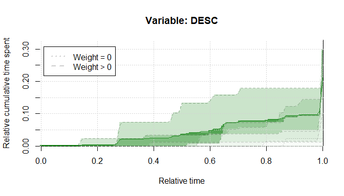
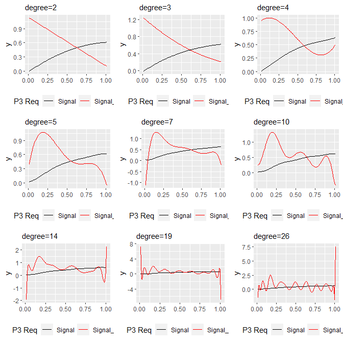
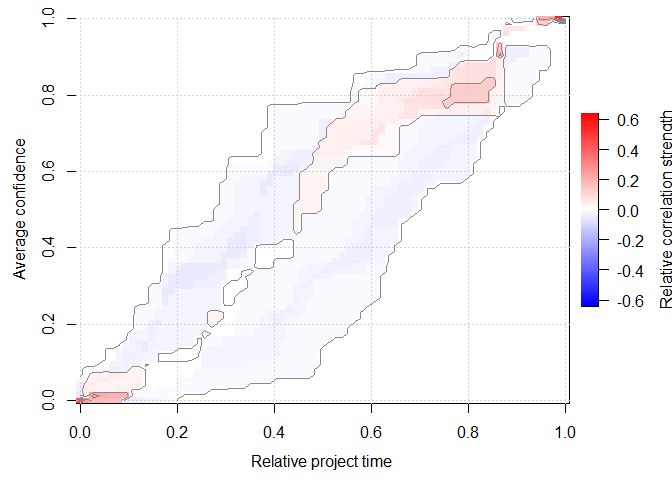
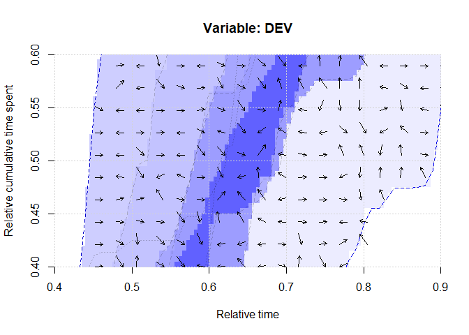
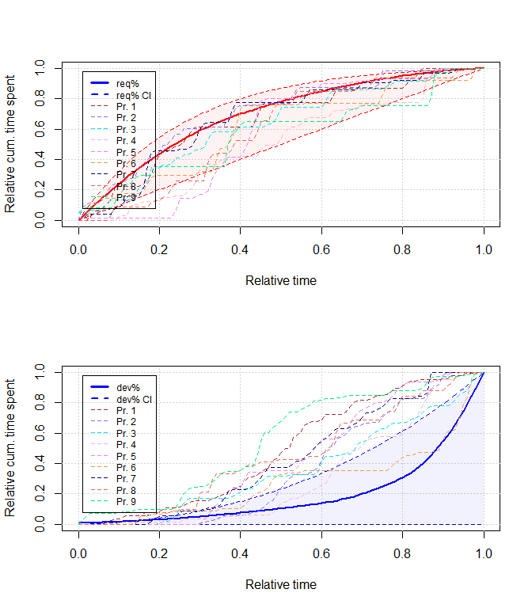

-   [Introduction](#introduction)
-   [Importing the data](#importing-the-data)
    -   [Ground truth](#ground-truth)
    -   [Project data](#project-data)
-   [Patterns for scoring the
    projects](#patterns-for-scoring-the-projects)
    -   [Pattern I: Consensus of two
        experts](#pattern-i-consensus-of-two-experts)
        -   [Variable: Requirements, analysis,
            planning](#variable-requirements-analysis-planning)
        -   [Variables: Design, implementation, testing, bugfixing and
            Descoping](#variables-design-implementation-testing-bugfixing-and-descoping)
    -   [Pattern II: Partial adaptation of first
        pattern](#pattern-ii-partial-adaptation-of-first-pattern)
        -   [Type II (a): Adapt type I using thresholds
            *t*<sub>1</sub>, *t*<sub>2</sub>](#type-ii-a-adapt-type-i-using-thresholds-t_1t_2)
    -   [Pattern III: Averaging the ground
        truth](#pattern-iii-averaging-the-ground-truth)
        -   [Determining an empirical and inhomogeneous confidence
            interval](#determining-an-empirical-and-inhomogeneous-confidence-interval)
    -   [Pattern IV](#pattern-iv)
        -   [Using averaged bins](#using-averaged-bins)
        -   [Eliminate plateaus](#eliminate-plateaus)
        -   [LOESS smoothing](#loess-smoothing)
        -   [Constrained B-splines non-parametric regression
            quantiles](#constrained-b-splines-non-parametric-regression-quantiles)
        -   [Orthogonal polynomials](#orthogonal-polynomials)
-   [Assessing the Goodness of Fit](#assessing-the-goodness-of-fit)
    -   [Score based on CI hyperplane](#score-based-on-ci-hyperplane)
    -   [Loss based on distance to
        reference-variable](#loss-based-on-distance-to-reference-variable)
    -   [Loss based on the two previous
        approaches](#loss-based-on-the-two-previous-approaches)
    -   [*m*-dimensional relative continuous Pearson sample correlation
        coefficient](#m-dimensional-relative-continuous-pearson-sample-correlation-coefficient)
        -   [1D continuous relative
            correlation](#d-continuous-relative-correlation)
        -   [2D continuous relative
            correlation](#d-continuous-relative-correlation-1)
-   [Early detection](#early-detection)
    -   [Arbitrary-interval scores](#arbitrary-interval-scores)
    -   [Forecasting within Vector
        Fields](#forecasting-within-vector-fields)
        -   [Average confidence in overlapped
            surface](#average-confidence-in-overlapped-surface)
        -   [Average direction of steepest confidence
            increase](#average-direction-of-steepest-confidence-increase)
-   [Scoring of projects](#scoring-of-projects)
    -   [Pattern I](#pattern-i)
        -   [Binary detection decision
            rule](#binary-detection-decision-rule)
        -   [Average distance to
            reference](#average-distance-to-reference)
        -   [Average distance to
            reference](#average-distance-to-reference-1)
    -   [Pattern III (average)](#pattern-iii-average)
        -   [Scoring based on the confidence
            intervals](#scoring-based-on-the-confidence-intervals)
        -   [Scoring based on the distance to
            average](#scoring-based-on-the-distance-to-average)
        -   [Linear combination of the two
            methods](#linear-combination-of-the-two-methods)
        -   [Arbitrary-interval scores
            computing](#arbitrary-interval-scores-computing)
    -   [Pattern IV](#pattern-iv-1)
        -   [Scoring based on the distance to
            reference](#scoring-based-on-the-distance-to-reference)
        -   [Correlation between curves](#correlation-between-curves)

# Introduction

This is the complementary technical report for the paper/article
tentatively entitled “Multivariate Continuous Processes: Modeling,
Instantiation, Goodness-of-fit, Forecasting.” Similar to the technical
report for detecting the Fire Drill using source code, we import all
projects’ data and the ground truth. This notebook however is concerned
with different and additional approaches, i.e., it is not just a
repetition of the other technical report.

All complementary data and results can be found at Zenodo (Hönel et al.
2021). This notebook was written in a way that it can be run without any
additional efforts to reproduce the outputs (using the pre-computed
results). This notebook has a canonical
URL<sup>[\[Link\]](https://github.com/sse-lnu/anti-pattern-models/blob/master/notebooks/fire-drill-issue-tracking-technical-report.Rmd)</sup>
and can be read online as a rendered
markdown<sup>[\[Link\]](https://github.com/sse-lnu/anti-pattern-models/blob/master/notebooks/fire-drill-issue-tracking-technical-report.md)</sup>
version. All code can be found in this repository, too.

# Importing the data

Here, we import the ground truth and the projects.

## Ground truth

We have 9 projects conducted by students, and two raters have
**independently**, i.e., without prior communication, assessed to what
degree the AP is present in each project. This was done using a scale
from zero to ten, where zero means that the AP was not present, and ten
would indicate a strong manifestation The entire ground truth is shown
in table .

``` r
ground_truth <- read.csv(file = "../data/ground-truth.csv", sep = ";")
ground_truth$consensus_score <- ground_truth$consensus/10
```

| project   | rater.a | rater.b | consensus | rater.mean | consensus_score |
|:----------|--------:|--------:|----------:|-----------:|----------------:|
| project_1 |       2 |       0 |         1 |        1.0 |             0.1 |
| project_2 |       0 |       0 |         0 |        0.0 |             0.0 |
| project_3 |       8 |       5 |         6 |        6.5 |             0.6 |
| project_4 |       8 |       6 |         8 |        7.0 |             0.8 |
| project_5 |       1 |       1 |         1 |        1.0 |             0.1 |
| project_6 |       4 |       1 |         2 |        2.5 |             0.2 |
| project_7 |       2 |       3 |         3 |        2.5 |             0.3 |
| project_8 |       0 |       0 |         0 |        0.0 |             0.0 |
| project_9 |       1 |       4 |         5 |        2.5 |             0.5 |

Entire ground truth as of both raters

## Project data

In this section we import the projects’ **issue-tracking**-data. All
projects’ data will be normalized w.r.t. the time, i.e., each project
will have a support of \[0,1\]. The variables are modeled as cumulative
time spent on issues. Each variable in each project will be loaded into
an instance of `Signal`.

``` r
library(readxl)

load_project_issue_data <- function(pId) {
  data <- read_excel("../data/FD_issue-based_detection.xlsx", sheet = pId)
  data[is.na(data)] <- 0

  req_cs <- cumsum(data$req)/sum(data$req)
  dev_cs <- cumsum(data$dev)/sum(data$dev)
  desc_cs <- cumsum(data$desc)/max(cumsum(data$dev))
  X <- seq(from = 0, to = 1, length.out = length(req_cs))

  signal_rec <- Signal$new(func = stats::approxfun(x = X, y = req_cs, yleft = 0, 
    yright = 1), name = "REQ", support = c(0, 1), isWp = TRUE)
  signal_dev <- Signal$new(func = stats::approxfun(x = X, y = dev_cs, yleft = 0, 
    yright = 1), name = "DEV", support = c(0, 1), isWp = TRUE)
  signal_desc <- Signal$new(func = stats::approxfun(x = X, y = desc_cs, yleft = 0, 
    yright = max(desc_cs)), name = "DESC", support = c(0, 1), isWp = TRUE)

  list(data = data, REQ = signal_rec, DEV = signal_dev, DESC = signal_desc)
}
```

Let’s attempt to replicate the graphs of the first project (cf. figure
):

``` r
p3_signals <- load_project_issue_data(pId = "Project3")
req_f <- p3_signals$REQ$get0Function()
dev_f <- p3_signals$DEV$get0Function()
desc_f <- p3_signals$DESC$get0Function()
```

<div class="figure" style="text-align: center">


<p class="caption">
The two variables of the first project.
</p>

</div>

OK, that works well. It’ll be the same for all projects, i.e., only two
variables, time spent on requirements- and time spent on
development-issues, is tracked. That means we will only be fitting two
variables later.

Let’s load, store and visualize all projects (cf. figure ):

``` r
all_signals <- list()
for (pId in paste0("Project", 1:9)) {
  all_signals[[pId]] <- load_project_issue_data(pId = pId)
}
```

<div class="figure" style="text-align: top">


<p class="caption">
All variables over each project’s time span.
</p>

</div>

# Patterns for scoring the projects

Here, we develop various patterns (process models) suitable for the
detection of the Fire Drill anti-pattern using issue-tracking data.

## Pattern I: Consensus of two experts

The initial pattern as defined for the detection of the Fire Drill AP is
imported/created/defined here, and its variables and confidence
intervals are modeled as continuous functions over time.

There are some values (x/y coordinates) for which we want to guarantee
that the confidence intervals or the variables themselves pass through.
Also, the two points in time *t*<sub>1</sub>, *t*<sub>2</sub> are
defined to be at 0.4 and 0.85, respectively.

``` r
t_1 <- 0.4
t_2 <- 0.85

# req(t_1)
req_t_1 <- 0.7

# dev(t_1), dev(t_2)
dev_t_1 <- 0.075
dev_t_2 <- 0.4
```

This initial version of the pattern is not based on any data,
observation or ground truth, but solely on two independent experts that
reached a consensus for every value a priori any of the detection
approaches.

### Variable: Requirements, analysis, planning

The variable itself is not given, only its upper- and lower
confidence-intervals (CI), where the latter simply is
req<sub>lower</sub><sup>CI</sup>(*x*) = *x*. The upper CI is given by
the informal expression
req<sub>upper</sub><sup>CI</sup>(*x*) = 1.02261 − 1.02261 × exp (−3.811733×*x*).
All together is shown in figure .

The variable itself is not given, as it was not important for the binary
decision rule, whether or not a project’s variable is within the
confidence interval. It is still not important, what matters is that it
runs through the confidence interval, and we will design it by fitting a
polynomial through some inferred points from the plot. In some practical
case however, the variable’s course may be important, and while we will
later use the variable to compute some kind of loss between it, the
confidence interval and some project’s variable, we only do this for
demonstration purposes.

Let’s first define the variable using some supporting x/y coordinates.
It needs to be constrained such that it runs through 0,0 and 1,1:

``` r
req_poly <- cobs::cobs(x = seq(from = 0, to = 1, by = 0.1), y = c(0, 0.25, 0.425, 
  0.475, 0.7, 0.8, 0.85, 0.9, 0.95, 0.975, 1), pointwise = matrix(data = c(c(0, 
  0, 0), c(0, t_1, req_t_1), c(0, 1, 1)), byrow = TRUE, ncol = 3))
```

    ## qbsks2():
    ##  Performing general knot selection ...
    ## 
    ##  Deleting unnecessary knots ...

``` r
# Now we can define the variable simply by predicting from the polynomial (btw.
# this is vectorized automatically):
req <- function(x) {
  stats::predict(object = req_poly, z = x)[, "fit"]
}
```

And now for the confidence intervals:

``` r
req_ci_lower <- function(x) x
req_ci_upper <- function(x) 1.02261 - 1.02261 * exp(-3.811733 * x)
```

<div class="figure" style="text-align: center">


<p class="caption">
req% and its lower- and upper confidence interval.
</p>

</div>

### Variables: Design, implementation, testing, bugfixing and Descoping

Again, the variable for design etc. is not given, but rather only its
upper confidence interval. Its lower CI is simply always zero. The upper
CI is given by the informal expression
dev<sub>upper</sub><sup>CI</sup>(*x*) = 0.07815904 × *x* + 0.6222767 × *x*<sup>2</sup> + 0.2995643 × *x*<sup>3</sup>.
The variable for de-scoping comes without confidence interval, and is
defined by
desc (*x*) = 0.01172386 × *x* + 0.0933415 × *x*<sup>2</sup> + 0.04493464 × *x*<sup>3</sup>.

First we will define/fit a polynomial that describes the variable for
design etc., the same way we did for requirements etc. we do know that
it should pass through the points \[*t*<sub>1</sub>,≈0.075\], as well as
\[*t*<sub>2</sub>,≈0.4\].

``` r
dev_poly <- cobs::cobs(x = seq(from = 0, to = 1, by = 0.1), y = c(0, 0.0175, 0.035, 
  0.055, dev_t_1, 0.014, 0.165, 0.2, 0.28, 0.475, 1), print.warn = FALSE, print.mesg = FALSE, 
  pointwise = matrix(data = c(c(0, t_1, dev_t_1), c(0, t_2, dev_t_2), c(0, 1, 1)), 
    byrow = TRUE, ncol = 3))

# Now we can define the variable simply by predicting from the polynomial (btw.
# this is vectorized automatically):
dev <- function(x) {
  temp <- stats::predict(object = dev_poly, z = x)[, "fit"]
  # I cannot constrain the polynomial at 0,0 and it returns a very slight negative
  # value there, so let's do it this way:
  temp[temp < 0] <- 0
  temp[temp > 1] <- 1
  temp
}
```

Next we define the upper confidence interval for the variable `DEV`,
then the variable for de-scoping. All is shown in figure .

``` r
dev_ci_upper <- function(x) 0.07815904 * x + 0.6222767 * x^2 + 0.2995643 * x^3
desc <- function(x) 0.01172386 * x + 0.0933415 * x^2 + 0.04493464 * x^3
```

<div class="figure" style="text-align: center">


<p class="caption">
The variable dev% and its upper confidence interval, as well as the
variable desc%.
</p>

</div>

## Pattern II: Partial adaptation of first pattern

We will be attempting three kinds of adaptations to the first pattern:

1.  Learn *t*<sub>1</sub>, *t*<sub>2</sub> from the data: There is not
    much to learn, but we could attempt to define these two thresholds
    as weighted average over the ground truth. Alternatively, we could
    formulate an optimization problem. We then use *time warping* to
    alter the first pattern, **including** its confidence intervals.
2.  Additionally to a (after learning *t*<sub>1</sub>, *t*<sub>2</sub>),
    we will apply *amplitude warping* using **`srBTAW`**.
3.  Take the first pattern and apply both, *boundary time warping*
    **and** *boundary amplitude warping*, to produce a pattern that is
    (hopefully) closest to all projects in the ground truth. This is the
    very same approach we attempted for adapting the pattern of type I
    that we defined for the Fire Drill in source code.

### Type II (a): Adapt type I using thresholds *t*<sub>1</sub>, *t*<sub>2</sub>

The two variables `REQ` and `DEV` in the first pattern describe the
cumulative time spent on two distinct activities. It was designed with
focus on the confidence intervals, and a binary decision rule, such that
the actual variables’ course was not of interest.

To find the optimal value for a threshold, we could look at when each
project is closest to req (*t*<sub>1</sub>) and dev (*t*<sub>2</sub>)
(in relative time), and then compute a weighted average over it.
However, since we already modeled each project’s variables as
*continuous-time stochastic process*, I suggest we use an
optimization-based approach.

``` r
tempf <- all_signals$Project5$REQ$get0Function()
tempf1 <- function(x) abs(tempf(x) - req_t_1)
optR <- optimize(tempf1, interval = c(0, 1))
optR
```

    ## $minimum
    ## [1] 0.6159966
    ## 
    ## $objective
    ## [1] 0.2

<div class="figure" style="text-align: center">


<p class="caption">
The non-optimal optimum found by gradient-based optimization in project
5.
</p>

</div>

We will find the optimum using `nlopt` and a global optimization,
because we actually will have a global optimum by re-arranging each
project’s variables. Also, gradient-based methods do not work well
because of the nature of the variables, having large horizontal
plateaus. This can be seen in figure . Approaches using the built-in
`optim` do hence not work well, the problem is clearly demonstrated in
the previous code chunk, resulting in an objective  ≫ 0 (which should
ideally be 0).

We want to find out when each project is closest to the previously
defined thresholds. Each variable is a cumulative aggregation of the
underlying values, which means that we have monotonic behavior.

$$
\\begin{aligned}
  \\min\_{\\hat{t}\_1,\\hat{t}\_2\\in R}&\\;{\\operatorname{req}(\\hat{t}\_1), \\operatorname{dev}(\\hat{t}\_2)}\\;\\text{,}
  \\\\\[1ex\]
  \\text{subject to}&\\;0\\leq\\hat{t}\_1,\\hat{t}\_2\\leq1\\;\\text{, using}
  \\\\\[1ex\]
  \\mathcal{L}\_{\\operatorname{req}}(x)=&\\;\\left\\lvert\\,\\operatorname{req}(x)-\\operatorname{req}(t_1)\\,\\right\\rvert\\;\\text{, and}
  \\\\\[1ex\]
  \\mathcal{L}\_{\\operatorname{dev}}(x)=&\\;\\left\\lvert\\,\\operatorname{dev}(x)-\\operatorname{dev}(t_2)\\,\\right\\rvert\\;\\text{(quasi-convex loss functions).}
\\end{aligned}
$$

The objective functions hence will be to find the global optimum
(minimum), which occurs at *y* ≈ 0. Since we have plateaus in our data,
we will potentially have infinitely many global optima. However, we are
satisfied with any that is  ≈ 0.

$$
\\begin{aligned}
  \\mathcal{O}\_{\\operatorname{dev}}(x)=&\\;\\underset{\\hat{x}\\in R}{arg\\,min}\\;{L\_{\\operatorname{dev}}(x)}\\;\\text{, and}
  \\\\\[1ex\]
  \\mathcal{O}\_{\\operatorname{req}}(x)=&\\;\\underset{\\hat{x}\\in R}{arg\\,min}\\;{L\_{\\operatorname{req}}(x)}\\text{.}
\\end{aligned}
$$

``` r
library(nloptr)

set.seed(1)

t1t2_opt <- matrix(ncol = 4, nrow = length(all_signals))
rownames(t1t2_opt) <- names(all_signals)
colnames(t1t2_opt) <- c("req_sol", "dev_sol", "req_obj", "dev_obj")

find_global_low <- function(f) {
  nloptr(x0 = 0.5, opts = list(maxeval = 1000, algorithm = "NLOPT_GN_DIRECT_L_RAND"), 
    eval_f = f, lb = 0, ub = 1)
}

for (pId in paste0("Project", 1:9)) {
  sig_REQ <- all_signals[[pId]]$REQ$get0Function()
  req_abs <- function(x) abs(sig_REQ(x) - req_t_1)

  sig_DEV <- all_signals[[pId]]$DEV$get0Function()
  dev_abs <- function(x) abs(sig_DEV(x) - dev_t_2)

  optRes_REQ <- find_global_low(f = req_abs)
  optRes_DEV <- find_global_low(f = dev_abs)

  t1t2_opt[pId, ] <- c(optRes_REQ$solution, optRes_DEV$solution, optRes_REQ$objective, 
    optRes_DEV$objective)
}
```

|          |   req_sol |   dev_sol | req_obj | dev_obj |
|:---------|----------:|----------:|--------:|--------:|
| Project1 | 0.4445887 | 0.4762108 |       0 |       0 |
| Project2 | 0.3804348 | 0.5967236 |       0 |       0 |
| Project3 | 0.4924851 | 0.5987420 |       0 |       0 |
| Project4 | 0.6232323 | 0.6427128 |       0 |       0 |
| Project5 | 0.4407407 | 0.5476190 |       0 |       0 |
| Project6 | 0.3973381 | 0.7788398 |       0 |       0 |
| Project7 | 0.3780904 | 0.5306457 |       0 |       0 |
| Project8 | 0.4775269 | 0.4451613 |       0 |       0 |
| Project9 | 0.6582329 | 0.4357020 |       0 |       0 |

Optimum values for *t*<sub>1</sub> and *t*<sub>2</sub> for each project,
together with the loss of each project’s objective function at that
offset (ideally 0).

From the table , we can take an example to demonstrate that the
optimization indeed found the global optimum (or a value very close to
it, usually with a deviation  \< 1*e*<sup>−15</sup>). For the picked
example of project 5, we can clearly observe a value for *x* that
results in a solution that is  ≈ 0.

<div class="figure" style="text-align: center">


<p class="caption">
Example of finding the optimum for req(*t*<sub>1</sub>) in project 5.
</p>

</div>

Figure depicts the optimal solution as found by using global
optimization. Now what is left, is to calculate the weighted average for
the optimized **t̂**<sub>**1**</sub>, **t̂**<sub>**2**</sub>. The weighted
arithmetic mean is defined as:

$$
\\begin{aligned}
  \\text{weighted mean}=&\\;\\Big\[\\sum\\bm{\\omega}\\Big\]^{-1}\\times\\bm{\\omega}^\\top\\cdot\\bm{\\hat{t}}\\;\\text{, where}
  \\\\\[1ex\]
  \\bm{\\omega}\\dots&\\;\\text{weight vector that corresponds to the consensus-score, and}
  \\\\\[1ex\]
  \\bm{\\hat{t}}\\dots&\\;\\text{vector with optimal values for either}\\;t_1\\;\\text{or}\\;t_2\\;\\text{(as learned earlier).}
\\end{aligned}
$$

``` r
omega <- ground_truth$consensus_score
names(omega) <- paste0("Project", 1:length(omega))

t1_wavg <- t1t2_opt[, 1] %*% omega/sum(omega)
print(c(t_1, t1_wavg))
```

    ## [1] 0.4000000 0.5402389

``` r
t2_wavg <- t1t2_opt[, 2] %*% omega/sum(omega)
print(c(t_2, t2_wavg))
```

    ## [1] 0.850000 0.580235

Originally, *t*<sub>1</sub> was guessed to be located at 0.4, with
req (*t*<sub>1</sub>) = 0.7. The weighted average over the optimized
values (where req (*t̂*<sub>1</sub>) ≈ 0.7) suggests defining
*t̂*<sub>1</sub>=0.54024.

*t*<sub>2</sub> on the other hand was originally located at 0.85, with
dev (*t*<sub>2</sub>) = 0.4. The weighted average over the optimized
values (where dev (*t̂*<sub>2</sub>) ≈ 0.4) suggests defining
*t̂*<sub>2</sub>=0.58024.

Having learned these values, we can now adapt the pattern using time
warping. For that, we have to instantiate the pattern using `srBTAW`,
add the original boundaries and set them according to what we learned.
Below, we define a function that can warp a single variable.

``` r
timewarp_variable <- function(f, t, t_new) {
  temp <- SRBTW$new(wp = f, wc = f, theta_b = c(0, t_new, 1), gamma_bed = c(0, 
    1, sqrt(.Machine$double.eps)), lambda = c(0, 0), begin = 0, end = 1, openBegin = FALSE, 
    openEnd = FALSE)
  temp$setParams(`names<-`(c(t, 1 - t), c("vtl_1", "vtl_2")))
  function(x) sapply(X = x, FUN = temp$M)
}
```

``` r
req_p2a <- timewarp_variable(f = req, t = t_1, t_new = t1_wavg)
req_ci_lower_p2a <- timewarp_variable(f = req_ci_lower, t = t_1, t_new = t1_wavg)
req_ci_upper_p2a <- timewarp_variable(f = req_ci_upper, t = t_1, t_new = t1_wavg)
```

<div class="figure" style="text-align: center">


<p class="caption">
req% and its lower- and upper confidence interval after time warping for
pattern type I (a).
</p>

</div>

Moving the boundary *t*<sub>1</sub> farther behind, changes the variable
`REQ` and its confidence interval slightly, as can be seen in figure .
Next, we will adapt the remaining variables and their confidence
intervals.

``` r
dev_p2a <- timewarp_variable(f = dev, t = t_2, t_new = t2_wavg)
dev_ci_upper_p2a <- timewarp_variable(f = dev_ci_upper, t = t_2, t_new = t2_wavg)
desc_p2a <- timewarp_variable(f = desc, t = t_2, t_new = t2_wavg)
```

<div class="figure" style="text-align: center">


<p class="caption">
The variable dev% and its upper confidence interval, as well as the
variable desc%, after time warping for pattern type I (a).
</p>

</div>

Moving the boundary *t*<sub>2</sub> was a more significant change for
variables `DEV` and `DESC` than it was for `REQ`, as of figure .

## Pattern III: Averaging the ground truth

This is the same approach we undertook for pattern type III (average)
for the Fire Drill in source code. However, we will also learn an
**empirical confidence interval**, which is later used for two
additional detection methods. These methods have the advantage that they
work over arbitrary (integration) intervals, making them also applicable
for early detection of the process (i.e., not the entire process needs
to be observed, and we can just attempt to detect what we have so far).

``` r
p3_weighted_var <- function(name, omega) {
  funcs <- list()
  for (pId in names(all_signals)) {
    funcs[[pId]] <- all_signals[[pId]][[name]]$get0Function()
  }

  function(x) sapply(X = x, FUN = function(x_) {
    omega %*% unlist(lapply(funcs, function(f) f(x_)))/sum(omega)
  })
}
```

``` r
req_p3 <- p3_weighted_var(name = "REQ", omega = omega)
dev_p3 <- p3_weighted_var(name = "DEV", omega = omega)
desc_p3 <- p3_weighted_var(name = "DESC", omega = omega)
```

The computed weighted average-variables for `REQ` and `DEV` are shown in
figure .

<div class="figure" style="text-align: center">


<p class="caption">
The weighted average for the three variables req%, dev% and desc%.
</p>

</div>

### Determining an empirical and inhomogeneous confidence interval

Also, we want to calculate an empirical confidence interval and
-surface, based on the projects’ data and the consensus of the ground
truth. The boundary of the lower confidence interval is defined as the
infimum of all signals (and the upper CI as the supremum of all
signals):

$$
\\begin{aligned}
  \\bm{f}\\dots&\\;\\text{vector of functions (here: project signals),}
  \\\\\[1ex\]
  \\operatorname{CI}\_{\\text{upper}}(x)=&\\;\\sup{\\Bigg(\\forall\\,f\\in\\bm{f}\\;\\bigg\[\\begin{cases}
    -\\infty,&\\text{if}\\;\\bm{\\omega}\_n=0,
    \\\\
    f_n(x),&\\text{otherwise}
  \\end{cases}\\bigg\]\\;,\\;\\frown\\;,\\;\\Big\[\\dots\\Big\]\\Bigg)}\\;\\text{,}
  \\\\\[1ex\]
  \\operatorname{CI}\_{\\text{upper}}(x)=&\\;\\inf{\\Bigg(\\forall\\,f\\in\\bm{f}\\;\\bigg\[\\begin{cases}
    \\infty,&\\text{if}\\;\\bm{\\omega}\_n=0,
    \\\\
    f_n(x),&\\text{otherwise}
  \\end{cases}\\bigg\]\\;,\\;\\frown\\;,\\;\\Big\[\\dots\\Big\]\\Bigg)}\\;\\text{.}
\\end{aligned}
$$

``` r
funclist_REQ <- list()
funclist_DEV <- list()
funclist_DESC <- list()
for (pId in names(all_signals)) {
  funclist_REQ[[pId]] <- all_signals[[pId]]$REQ$get0Function()
  funclist_DEV[[pId]] <- all_signals[[pId]]$DEV$get0Function()
  funclist_DESC[[pId]] <- all_signals[[pId]]$DESC$get0Function()
}

CI_bound_p3avg <- function(x, funclist, omega, upper = TRUE) {
  sapply(X = x, FUN = function(x_) {
    val <- unlist(lapply(X = names(funclist), FUN = function(fname) {
      if (omega[fname] == 0) 
        (if (upper) 
          -Inf else Inf) else funclist[[fname]](x_)
    }))

    if (upper) 
      max(val) else min(val)
  })
}

req_ci_upper_p3avg <- function(x) CI_bound_p3avg(x = x, funclist = funclist_REQ, 
  omega = omega, upper = TRUE)
req_ci_lower_p3avg <- function(x) CI_bound_p3avg(x = x, funclist = funclist_REQ, 
  omega = omega, upper = FALSE)
dev_ci_upper_p3avg <- function(x) CI_bound_p3avg(x = x, funclist = funclist_DEV, 
  omega = omega, upper = TRUE)
dev_ci_lower_p3avg <- function(x) CI_bound_p3avg(x = x, funclist = funclist_DEV, 
  omega = omega, upper = FALSE)
desc_ci_upper_p3avg <- function(x) CI_bound_p3avg(x = x, funclist = funclist_DESC, 
  omega = omega, upper = TRUE)
desc_ci_lower_p3avg <- function(x) CI_bound_p3avg(x = x, funclist = funclist_DESC, 
  omega = omega, upper = FALSE)
```

While the above expressions define the *boundaries* of the lower and
upper confidence intervals, we also need a function that interpolates in
between. Recall that the CI of the first pattern was **homogeneous**,
i.e., it provided no gradation, and was used for a binary decision rule.
If we define a function that bases the strength of the confidence on the
values of the ground truth of each project’s variable, then it also
means that with that pattern, all projects are included in the binary
decision rule. Having gradation in the CI will allow us to make more
probabilistic statements by computing some kind of score.

Figures and show the average variables and the empirical confidence
intervals.

<div class="figure" style="text-align: center">


<p class="caption">
Empirical (average) req% and dev% and their lower- and upper empirical
weighted confidence intervals (here without gradation).
</p>

</div>

<div class="figure" style="text-align: center">


<p class="caption">
Empirical (average) desc% and its lower- and upper empirical weighted
confidence intervals (here without gradation).
</p>

</div>

But first, we define a function *f* : *R*<sup>2</sup> ↦ *R* to compute a
CI with gradation. For each x/y coordinate, it shall output a confidence
based on the weights as of the ground truth, and all projects’ variables
that output a *y* that is smaller than (larger than) the given *y* shall
be excluded.

$$
\\begin{aligned}
  h\_{\\text{upper}}(f,x,y)=&\\;\\begin{cases}
        1,&\\text{if}\\;f(x)\\geq y,
        \\\\
        0,&\\text{otherwise,}
    \\end{cases}
  \\\\
  \\operatorname{CI}^+(x,y)=&\\;\\bm{\\omega}^\\top\\cdot h\_{\\text{upper}}(\\bm{f},x,y)\\times\\Big\[\\sum\\bm{\\omega}\\Big\]^{-1}\\text{.}
\\end{aligned}
$$

CI<sup>+</sup> is to be used for the upper confidence region, and
likewise, we define CI<sup>−</sup> to be equivalent, but it uses
*h*<sub>lower</sub>, that switches the condition to *f*(*x*) ≤ *y*. The
decision on whether to use CI<sup>+</sup> or CI<sup>−</sup> depends on
whether the given *y* is above or below the *computed average variable*,
i.e.,

$$
\\begin{aligned}
  \\bar{g}(x)\\dots&\\;\\text{the computed average variable,}
  \\\\\[1ex\]
  \\operatorname{CI}(x,y)=&\\;\\begin{cases}
    0,&\\text{if}\\;y>\\operatorname{CI}\_{\\text{upper}}(x)\\;\\text{,}
    \\\\
    0,&\\text{if}\\;y\<\\operatorname{CI}\_{\\text{lower}}(x)\\;\\text{,}
    \\\\
    \\bm{\\omega}^\\top\\cdot\\Bigg\[\\begin{cases}
      h\_{\\text{upper}}(\\bm{f},x,y),&\\text{if}\\;\\bar{g}(x)\<y,
      \\\\
      h\_{\\text{lower}}(\\bm{f},x,y),&\\text{otherwise}
    \\end{cases}\\Bigg\]\\times\\Big\[\\sum\\bm{\\omega}\\Big\]^{-1},&\\text{otherwise}
  \\end{cases}\\;\\text{.}
  \\\\
  =&\\;\\begin{cases}
    0,&\\text{if}\\;y>\\operatorname{CI}\_{\\text{upper}}(x)\\,\\text{,}
    \\\\
    0,&\\text{if}\\;y\<\\operatorname{CI}\_{\\text{lower}}(x)\\,\\text{,}
    \\\\
    \\bm{\\omega}^\\top\\cdot\\begin{cases}
      \\operatorname{CI}^+(x,y),&\\text{if}\\;\\bar{g}(x)\<y,
      \\\\
      \\operatorname{CI}^-(x,y),&\\text{otherwise.}
    \\end{cases}
  \\end{cases}
\\end{aligned}
$$

With this definition, we can compute a loss that is then based on a path
that goes through this hyperplane. That path is a project’s variable.

``` r
# h_p3avg <- function(funclist, x, y, upper = TRUE) { unlist(lapply(X = funclist,
# FUN = function(f) { sapply(X = f(x), function(val) { if (val == 0) val <-
# sqrt(.Machine$double.eps) if ((upper && val >= y) || (!upper && val <= y)) val
# else 0 }) })) }

# We re-define this function to just indicate.
h_p3avg <- function(funclist, x, y, upper = TRUE, f_ci) {
  unlist(lapply(X = funclist, FUN = function(f) {
    sapply(X = f(x), function(val) {
      if (upper && val >= y) {
        1
        # f_ci(x) - val <-- this could be an alternative using the boundaries
      } else if (!upper && val <= y) {
        1
        # val - f_ci(x)
      } else {
        0
      }
    })
  }))
}

h_upper_p3avg <- function(funclist, x, y, f_ci) h_p3avg(funclist = funclist, x = x, 
  y = y, upper = TRUE, f_ci = f_ci)
h_lower_p3avg <- function(funclist, x, y, f_ci) h_p3avg(funclist = funclist, x = x, 
  y = y, upper = FALSE, f_ci = f_ci)

CI_p3avg <- function(x, y, funclist, f_ci_upper, f_ci_lower, gbar, omega) {
  stopifnot(length(x) == length(y))

  sapply(X = seq_len(length.out = length(x)), FUN = function(idx) {
    xi <- x[idx]
    yi <- y[idx]

    if (yi > f_ci_upper(xi) || yi < f_ci_lower(xi)) {
      return(0)
    }

    gbarval <- gbar(xi)
    hval <- if (gbarval < yi) {
      h_upper_p3avg(funclist = funclist, x = xi, y = yi, f_ci = f_ci_upper)
    } else {
      h_lower_p3avg(funclist = funclist, x = xi, y = yi, f_ci = f_ci_lower)
    }

    omega %*% hval/sum(omega)
  })
}

CI_req_p3avg <- function(x, y) CI_p3avg(x = x, y = y, funclist = funclist_REQ, f_ci_upper = req_ci_upper_p3avg, 
  f_ci_lower = req_ci_lower_p3avg, gbar = req_p3, omega = omega)
CI_dev_p3avg <- function(x, y) CI_p3avg(x = x, y = y, funclist = funclist_DEV, f_ci_upper = dev_ci_upper_p3avg, 
  f_ci_lower = dev_ci_lower_p3avg, gbar = dev_p3, omega = omega)
CI_desc_p3avg <- function(x, y) CI_p3avg(x = x, y = y, funclist = funclist_DESC, 
  f_ci_upper = desc_ci_upper_p3avg, f_ci_lower = desc_ci_lower_p3avg, gbar = desc_p3, 
  omega = omega)

saveRDS(object = list(CI_req_p3avg = CI_req_p3avg, CI_dev_p3avg = CI_dev_p3avg, CI_desc_p3avg = CI_desc_p3avg), 
  file = "../data/CI_p3avg_funcs.rds")
```

``` r
x <- seq(0, 1, length.out = 200)
y <- seq(0, 1, length.out = 200)

compute_z_p3avg <- function(varname, x, y, interp = NA_real_) {
  # We cannot call outer because our functions are not properly vectorized. z <-
  # outer(X = x, Y = y, FUN = CI_req_p3avg)
  f <- if (varname == "REQ") {
    CI_req_p3avg
  } else if (varname == "DEV") {
    CI_dev_p3avg
  } else {
    CI_desc_p3avg
  }

  z <- matrix(nrow = length(x), ncol = length(y))
  for (i in 1:length(x)) {
    for (j in 1:length(y)) {
      z[i, j] <- f(x = x[i], y = y[j])
    }
  }

  res <- list(x = x, y = y, z = z)

  if (!is.na(interp)) {
    res <- fields::interp.surface.grid(obj = res, grid.list = list(x = seq(from = min(x), 
      to = max(x), length.out = interp), y = seq(from = min(y), to = max(y), 
      length.out = interp)))
  }

  res
}

z_req <- loadResultsOrCompute(file = "../results/ci_p3avg_z_req.rds", computeExpr = {
  compute_z_p3avg(varname = "REQ", x = x, y = y)
})
z_dev <- loadResultsOrCompute(file = "../results/ci_p3avg_z_dev.rds", computeExpr = {
  compute_z_p3avg(varname = "DEV", x = x, y = y)
})
z_desc <- loadResultsOrCompute(file = "../results/ci_p3avg_z_desc.rds", computeExpr = {
  compute_z_p3avg(varname = "DESC", x = x, y = y)
})
```

Finally, we show the empirical confidence intervals in figures and .
Note that the minimum non-zero confidence is 0.038462, while the maximum
is 1. Therefore, while we gradate the colors from 0 to 1, we slightly
scale and transform the grid’s non-zero values using the expression
0.9 × *z* + 0.1, to improve the visibility.

<div class="figure" style="text-align: center">


<p class="caption">
The empirical confidence intervals for the two variables req% and dev%.
Higher saturation of the color correlates with higher confidence.
Projects with zero weight contribute to the CIs’ boundaries, but not to
the hyperplane.
</p>

</div>

<div class="figure" style="text-align: center">


<p class="caption">
The empirical confidence intervals for the variable desc%. Higher
saturation of the color correlates with higher confidence.
</p>

</div>

## Pattern IV

We had previously discussed the possibility of partial (early)
detection. Some of the scores and losses use integration and custom
intervals, and while these might be applicable in some cases without
further changes, we need to be careful when dealing with variables that
are normalized at project end. This is currently the case for the
variables of pattern I.

Pattern IV explores the possibility of not using some pattern directly,
but its **derivative** for all of the variables and the confidence
intervals. Here we exploit the fact that a cumulative variable has
monotonic behavior, depending on how it was designed even *strictly
monotonic* behavior. That means the slope at any point in time is  \> 0
(or at least  ≥ 0) - resp.  \< 0 (or at least  ≤ 0). The confidence
intervals model the minimum and maximum extents we would expect, and
their derivatives give us lower and upper bounds for the expected rate
of change. Regardless of the actual value of the variable, we can thus
transform our expectation of its value into an expectation of how it
changes over time. Furthermore, the rate of change can be (numerically
or analytically) computed for any other time-series variable, the
procedure introduced here is not limited to cumulative and/or normalized
variables.

Pattern type IV thus is a **Meta-Process model**, and can be applied to
any of the previously introduced patterns (which are process models).
Generically speaking, it supports the transformation of variables and
confidence interval boundaries (but not inhomogeneous confidence
interval surfaces). By using any other pattern (process model), pattern
type IV gets **instantiated**. For the remainder of this notebook, we
will be instantiating the pattern type IV using pattern I. While this
helps our demonstration purposes, pattern I is partially far off the
real-world data, which means that we must expect mediocre results. In
practice, one should use this meta pattern only with well-designed
and/or data-enhanced or data-only patterns.

For creating the first derivatives, we can use either, analytical
expressions (if available) or numeric methods, such finite difference
approaches. In the following, we use both, as we also actually have
analytical expressions for some of the curves. The first pattern,
represented by its derivatives, is shown in figure .

``` r
func_d1 <- function(f, x, supp = c(0, 1)) {
  sapply(X = x, FUN = function(x_) {
    t <- 1e-05
    m <- if (x_ < (supp[1] + t)) 
      "forward" else if (x_ > (supp[2] - t)) 
      "backward" else "central"
    pracma::fderiv(f = f, x = x_, method = m)
  })
}

req_d1_p4 <- function(x) {
  func_d1(f = req, x = x)
}
req_ci_lower_d1_p4 <- function(x) rep(1, length(x))
req_ci_upper_d1_p4 <- function(x) 3.89791628313 * exp(-(3.811733 * x))

dev_d1_p4 <- function(x) {
  func_d1(f = dev, x = x)
}
dev_ci_lower_d1_p4 <- function(x) rep(0, length(x))
dev_ci_upper_d1_p4 <- function(x) 0.07815904 + x * (0.8986929 * x + 1.2445534)

# For DESC, there are no confidence intervals
desc_d1_p4 <- function(x) 0.01172386 + x * (0.13480392 * x + 0.186683)
```

While we need the derivatives of any function that describes a variable
or confidence interval over time, the derivatives of the confidence
intervals now represent upper and lower bounds for the expected range of
change. Furthermore, at any point the rate of change of the variable or
either of the confidence intervals may exceed any of the other, and the
curves can also cross. So, in order to define the upper and lower
boundaries, we require the definition of a helper function that returns
the minimum and/or maximum of either of these three functions for every
*x*:

$$
\\begin{aligned}
  \\operatorname{CI}\_{\\nabla \\text{upper}}(\\nabla f,\\nabla f\_{\\text{lower}},\\nabla f\_{\\text{upper}},x)=&\\;\\sup{\\big(\\nabla f(x),\\nabla f\_{\\text{lower}}(x),\\nabla f\_{\\text{upper}}(x)\\big)}\\;\\text{.}
\\end{aligned}
$$

Likewise, we define CI<sub>∇lower</sub>(…) using the infimum.

<div class="figure" style="text-align: center">


<p class="caption">
Derivatives of all variables and confidence intervals as of pattern I.
</p>

</div>

The next challenge lies in representing the data which, in this case, is
cumulative time spent on issues. If we approximate functions in a
*zero-hold*-fashion as we did so far, then the gradients of these have
extreme steps, and are likely unusable. In the following we attempt a
few techniques to approximate a cumulative variable using
LOESS-smoothing, constrained B-splines non-parametric regression
quantiles, and fitting of orthogonal polynomials. The latter two result
in smooth gradients if the number of knots or the degree of the
polynomials are kept low. In the following subsections we use the
signals of the 3rd project as an example.

### Using averaged bins

In this approach we eliminate plateaus by aggregating all *x* that have
the same *y*, and moving *x* by the amount of values that have the same
*y*. Looking at the gradient in figure , it is still too extreme.

``` r
temp <- table(p3_signals$data$`cum req`)
prev_x <- 0
x <- c()
y <- c()
for (i in 1:length(temp)) {
  x <- c(x, prev_x + temp[[i]]/max(temp))
  prev_x <- tail(x, 1)
  y <- c(y, as.numeric(names(temp[i])))
}
```

<div class="figure" style="text-align: center">


<p class="caption">
The average-bin signal and its gradient.
</p>

</div>

### Eliminate plateaus

The cumulative variables have large plateaus, and the following is a
test to eliminate them. However, this additional manipulation step
should be skipped, if possible.

In this test, we iterate over all values of the cumulative variable and
only keep x/y pairs, when y increases. In figure we compare the original
cumulative variable against the one without plateaus, i.e., every
*x*<sub>*t*</sub> \> *x*<sub>*t* − 1</sub> (note that the unequal spread
of *x* in the first non-plateau plot is deliberately ignored in the
figure).

<div class="figure" style="text-align: center">


<p class="caption">
Transforming a signal into a non-plateau signal, using unequal widths.
</p>

</div>

### LOESS smoothing

First we define a helper function for smoothing signals using LOESS. It
will also help us to scale and translate the resulting function into a
specific support.

``` r
smooth_signal_loess <- function(x, y, support = c(0, 1), span = .35, family = c("s", "g"), neval = 1e4) {
  temp <- if (span <= 0) {
    list(x = x, y = y)
  } else {
    loess.smooth(x = x, y = y, span = span, family = match.arg(family), evaluation = neval)
  }
  
  stats::approxfun(
    # translate and scale to [0,1], then scale and translate to desired support.
    x = ((temp$x - min(temp$x)) / (max(temp$x) - min(temp$x))) * (support[2] - support[1]) + support[1],
    # scale y together with x, this is important
    y = temp$y / (max(temp$x) - min(temp$x)) * (support[2] - support[1]),
    yleft = utils::head(temp$y, 1),
    yright = utils::tail(temp$y, 1))
}
```

<div class="figure" style="text-align: center">


<p class="caption">
Increasing LOESS-smoothing of the non-plateau signal and its resulting
gradient (span=0 means no smoothing).
</p>

</div>

In figure we smooth raw project data, i.e., we do **not** use the
non-plateau data or data from averaged bins, but rather the cumulative
variable as-is, even **without normalization**, to demonstrate the
advantages of this fourth pattern. In the top-left plot we focus on
showing the raw signal. The extent of its gradient is well beyond the
other (cf. figure ), smoothed versions. With increasing smoothing-span,
both the signal and even more so its gradient become smooth. For our
concern, which is the identification of a trend regarding the rate of
change, I would say that a span in the range \[0.2,0.45\] is probably
most useful, so the default was selected to be 0.35, as it smoothes out
many of the local peaks, while still preserving the important
characteristics of the gradient (rate of change). However, everything
 ≥ 0.2 appears to be applicable. Note that spans below that often result
in errors (typically around 0.15 and below), so I do not recommend going
below 0.2.

However, the smoothing-span should be chosen according to the intended
application. For example, we can compute a score based on the area
between the gradient and its expected value. Here, a less smooth
gradient should be preferred as it conserves more details. If the
application however were, e.g., to compute a correlation, and the curve
used for comparison is smooth, then the span should be chosen
accordingly higher ( ≥ 0.4) to get usable results.

### Constrained B-splines non-parametric regression quantiles

.. or COBS, estimates (fits) a smooth function using B-splines through
some “knots.” In figure we are attempting fitting with \[3,11\] knots.
The number of knots should probably not exceed 4 or 5 for the gradient
to be useful, as otherwise it gets too many modes. However, we can
clearly see that there is no good compromise. Too few knots result in
too smooth a signal and gradient, and everything with 5 knots or more is
too rough an approximation, too.

``` r
par(mfrow = c(4, 4))

X <- 1:nrow(p3_signals$data)
Y <- p3_signals$data$`cum req`/(max(X) - min(X))
X <- X/(max(X) - min(X))
templ <- list()

for (i in 1:9) {
  templ[[i]] <- (function() {
    temp <- cobs::cobs(x = X, y = Y, nknots = i + 2, print.mesg = FALSE, print.warn = FALSE)
    Signal$new(func = function(x) stats::predict(object = temp, z = x)[, "fit"], 
      name = "P3 Req", support = range(X), isWp = TRUE)$plot(show1stDeriv = TRUE) + 
      labs(subtitle = paste0("nknots=", i + 2))
  })()
}

ggpubr::ggarrange(plotlist = templ, ncol = 3, nrow = 3)
```

<div class="figure" style="text-align: center">


<p class="caption">
Fitted splines with different number of knots and their derivative.
</p>

</div>

### Orthogonal polynomials

Using a varying degree, we fit polynomials to the data in order to
obtain a truly smooth curve. This technique always results in smooth
approximations both for the signal and its gradient (unlike COBS). In
figure we observe how the derivative captures more and more nuances of
the signal, starting from a degree of approx. 4. For our tests with this
pattern later, polynomials might be an alternative to LOESS-smoothed
polynomials. I do recommend using these here polynomials of degree  ≥ 3,
because the true purpose of all this is to estimate the non-linear trend
for the variable and its rate of change.

``` r
par(mfrow = c(4, 4))

use_degs <- c(2, 3, 4, 5, 7, 10, 14, 19, length(stats::coef(poly_autofit_max(x = X, 
  y = Y))) - 1)

templ <- list()
for (idx in 1:length(use_degs)) {

  templ[[idx]] <- (function() {
    ud <- use_degs[idx]
    temp <- stats::lm(Y ~ poly(x = X, degree = ud))
    Signal$new(func = function(x) stats::predict(temp, newdata = data.frame(X = x)), 
      name = "P3 Req", support = range(X), isWp = TRUE)$plot(show1stDeriv = TRUE) + 
      labs(subtitle = paste0("degree=", ud))
  })()
}

ggpubr::ggarrange(plotlist = templ, ncol = 3, nrow = 3)
```

<div class="figure" style="text-align: center">


<p class="caption">
Fitted polynomials and their first derivative using varying degrees of
freedom.
</p>

</div>

# Assessing the Goodness of Fit

In the technical report for detecting the Fire Drill in source code, we
had previously introduced a plethora of methods to assess the goodness
of fit. However, here we introduce additional methods that can exploit
**confidence intervals**, both of homogeneous and inhomogeneous nature.

## Score based on CI hyperplane

Simply put, this loss is based on the confidence interval’s hyperplane,
and calculates an absolute average confidence based on it. Each signal
evaluated against the hyperplane is a slice of it. Since we are
computing an average confidence, strictly speaking this is not a loss,
but a score (higher is better).

$$
\\begin{aligned}
  \\mathit{L}^{\\text{avgconf}}(x_1,x_2,f)=&\\;\\Bigg\[\\int\_{x_1}^{x_2}\\,\\operatorname{CI}(x, f(x))\\,dx\\Bigg\]\\times(x_2-x_1)^{-1}\\;\\text{,}
  \\\\
  &\\;\\text{where}\\;f\\;\\text{is the signal/variable and}\\;x_2\>x_1\\text{.}
\\end{aligned}
$$

We will do a full evaluation later, including creating a decision rule
or learning how to scale the average weight to the consensus score, but
let’s take one project and test this.

``` r
L_avgconf_p3_avg <- function(x1, x2, f, CI) {
  cubature::cubintegrate(f = function(x) {
    CI(x = x, y = f(x))
  }, lower = x1, upper = x2)$integral/(x2 - x1)
}

loadResultsOrCompute(file = "../results/ci_p3avg_Lavg-test.rds", computeExpr = {
  c(P2_REQ = L_avgconf_p3_avg(x1 = 0, x2 = 1, f = all_signals$Project2$REQ$get0Function(), 
    CI = CI_req_p3avg), P4_REQ = L_avgconf_p3_avg(x1 = 0, x2 = 1, f = all_signals$Project4$REQ$get0Function(), 
    CI = CI_req_p3avg))
})
```

    ##    P2_REQ    P4_REQ 
    ## 0.1236068 0.4282543

Plotting `L_avgconf_p3_avg` for the `REQ`-variable of both projects 2
and 4 gives us the function in figure . We can clearly observe that the
area under the latter is larger, and so will be the average.

<div class="figure" style="text-align: center">


<p class="caption">
The three variables of the first project.
</p>

</div>

From this example we can clearly see a difference in average confidence,
which seems to be somewhat reconciling the projects’ weights (consensus
score). Let’s try the next method, too.

## Loss based on distance to reference-variable

We may choose to ignore the previously computed confidence hyperplane
and compute a cost by, e.g., quantifying the distance between the
previously computed average variable (or any other reference-variable)
and another signal/variable. More precisely, we quantify the area
between both variables, and compare it to the largest possible area,
thereby obtaining an upper bound (with the lower bound being 0
obviously). Unlike the previous attempt, this function is a loss, that
maps to the range \[0,1\], where 1 means the largest possible distance
(i.e., the variable compared is entirely outside (or collinear with) the
confidence intervals). Hence this function is an attempt of measuring of
dissimilarity.

This method requires three features: A reference-variable, and an upper-
and a lower confidence interval. However, none of these are required to
be of empirical nature. For example, we can even apply this method to
the first of our patterns. A reference-variable may be generated as the
average between the confidence intervals, etc. All this makes this
method versatile. Its robustness comes from the fact any variable it
scores, is confined to the boundaries of the confidence intervals.

$$
\\begin{aligned}
  \\mathit{L}^{\\text{areadist}}(x_1,x_2,f)=&\\;\\int\_{x_1}^{x_2}\\,\\left\\lvert\\,\\bar{g}(x)-\\overbrace{\\min{\\Big(\\operatorname{CI}\_{\\text{upper}}(x),\\;\\max{\\big(\\operatorname{CI}\_{\\text{lower}}(x), f(x)\\big)}\\Big)}}^{\\text{Confining of}\\;f\\;\\text{to the confidence intervals.}}\\,\\right\\rvert\\,dx
  \\\\\[1ex\]
  &\\;\\times\\Bigg\[\\;\\overbrace{\\int\_{x_1}^{x_2}\\,\\sup{\\Big(\\bar{g}(x)-\\operatorname{CI}\_{\\text{lower}}(x)\\;,\\;\\operatorname{CI}\_{\\text{upper}}(x)-\\bar{g}(x)\\Big)\\,dx}}^{\\text{maximum possible area between}\\;\\bar{g}(x)\\;\\text{and either CI.}}\\;\\Bigg\]^{-1}\\;\\text{.}
\\end{aligned}
$$

This loss may also be alternatively defined using the following
denominator:

$$
\\begin{aligned}
  \\mathit{L}^{\\text{areadist2}}(x_1,x_2,f)=&\\;\\int\_{x_1}^{x_2}\\,\\left\\lvert\\,\\bar{g}(x)-\\min{\\Big(\\operatorname{CI}\_{\\text{upper}}(x),\\;\\max{\\big(\\operatorname{CI}\_{\\text{lower}}(x), f(x)\\big)}\\Big)}\\,\\right\\rvert\\,dx
  \\\\\[1ex\]
  &\\;\\times\\Bigg\[\\;\\int\_{x_1}^{x_2}\\,\\begin{cases}
    \\operatorname{CI}\_{\\text{upper}}(x)-\\bar{g}(x),&\\text{if}\\;f(x)\\geq\\bar{g}(x),
    \\\\
    \\bar{g}(x)-\\operatorname{CI}\_{\\text{lower}}(x),&\\text{otherwise.}
  \\end{cases}\\,dx\\;\\Bigg\]^{-1}\\;\\text{.}
\\end{aligned}
$$

The difference is subtle but important, and corrects better for
asymmetric confidence intervals. It now captures the maximum possible
area, based on the currently valid confidence interval (at *x*). For the
remainder, we will always be using the **second variant of this loss**
because of this.

Again, we will do a full evaluation later, but let’s just attempt
computing this loss once.

``` r
L_areadist_p3_avg <- function(x1, x2, f, gbar, CI_upper, CI_lower, use2ndVariant = FALSE) {
  int1 <- cubature::cubintegrate(f = function(x) {
    abs(gbar(x) - min(CI_upper(x), max(CI_lower(x), f(x))))
  }, lower = x1, upper = x2)$integral

  int2 <- cubature::cubintegrate(f = function(x) {
    gbarval <- gbar(x)
    if (use2ndVariant) {
      if (f(x) >= gbarval) {
        CI_upper(x) - gbarval
      } else {
        gbarval - CI_lower(x)
      }
    } else {
      max(gbarval - CI_lower(x), CI_upper(x) - gbarval)
    }
  }, lower = x1, upper = x2)$integral

  c(area = int1, maxarea = int2, dist = int1/int2)
}

loadResultsOrCompute(file = "../results/ci_p3avg_Larea-test.rds", computeExpr = {
  list(P2_REQ = L_areadist_p3_avg(x1 = 0, x2 = 1, f = all_signals$Project2$REQ$get0Function(), 
    use2ndVariant = TRUE, gbar = req_p3, CI_upper = req_ci_upper_p3avg, CI_lower = req_ci_lower_p3avg), 
    P4_REQ = L_areadist_p3_avg(x1 = 0, x2 = 1, f = all_signals$Project4$REQ$get0Function(), 
      use2ndVariant = TRUE, gbar = req_p3, CI_upper = req_ci_upper_p3avg, CI_lower = req_ci_lower_p3avg))
})
```

    ## $P2_REQ
    ##      area   maxarea      dist 
    ## 0.1084515 0.1212518 0.8944326 
    ## 
    ## $P4_REQ
    ##      area   maxarea      dist 
    ## 0.0752516 0.1114793 0.6750274

Let’s show the maximum possible distance vs. the distance of a project’s
variable in a plot (cf. figure ). These figures clearly show the smaller
distance of project 4 to the average. This is expected, as this project
has the highest weight, so the average `REQ%`-variable resembles this
project most.

<div class="figure" style="text-align: center">


<p class="caption">
The two variables of the first project.
</p>

</div>

## Loss based on the two previous approaches

This is an early-stadium idea. The essence is that for every *x*, we
have a vertical “confidence-slice” that we can integrate over and get an
average confidence. Then, we obtain the confidence for the variable in
question at the same *x*. Both of these values can then be put into a
relation. If we were to integrate this function, we would get the ratio
between the variable’s confidence and the average confidence, on
average.

``` r
use_x <- 0.8
dev_p3(use_x)
```

    ## [1] 0.706636

``` r
cubature::cubintegrate(f = function(x) {
  CI_dev_p3avg(x = use_x, y = x)
}, lower = dev_ci_lower_p3avg(use_x), upper = dev_ci_upper_p3avg(use_x))$integral/(dev_ci_upper_p3avg(use_x) - 
  dev_ci_lower_p3avg(use_x))
```

    ## [1] 0.2650567

``` r
CI_dev_p3avg(x = use_x, (all_signals$Project4$DEV$get0Function())(use_x))
```

    ## [1] 0.3846154

At `x=0.8`, the average variable is at  ≈ 0.71, the average confidence
for the slice is  ≈ 0.19, and the confidence of the evaluated variable
(project 4, `DEV`) is at  ≈ 0.22. This means that the ratio is in the
interval (0,∞). A “perfect” ratio of 1.0 would express that the tested
variable is, on average, equal to the average confidence.

## *m*-dimensional relative continuous Pearson sample correlation coefficient

First, here is the formula:

$$
\\begin{aligned}
  f,g\\;\\dots&\\,m\\text{-dimensional continuous variables},
  \\\\\[1ex\]
  \\bm{\\mathit{S}}\_f,\\bm{\\mathit{S}}\_g=&\\;a\_{i,j},b\_{i,j}\\in \\mathbb{R}^{m\\times2}\\,\\text{, supports for}\\;f,g\\;\\text{along each dimension,}
  \\\\\[1ex\]
  \\overline{f}=\\mathrm{E}\[f\]=&\\;\\left\[\\int\_{a\_{1,1}}^{a\_{1,2}}\\dots\\int\_{a\_{m,1}}^{a\_{m,2}}\\,f(x_1,\\dots,x_m)\\,dx_1\\dots dx_m\\right\]
  \\\\\[0ex\]
  &\\;\\;\\times\\prod\_{i=1}^{m}\\,(a\_{i,1}-a\_{i,2})^{-1}\\,\\text{, (equivalently for}\\;\\overline{g}\\;\\text{using}\\;\\bm{\\mathit{S}}\_g\\text{),}
  \\\\\[1ex\]
  =&\\;\\int_0^1\\dots\\int_0^1\\,f(\\mathsf{T}(a\_{1,1},a\_{1,2},x_1),\\,\\dots\\,,\\mathsf{T}(a\_{m,1},a\_{m,2},x_m))\\,dx_1\\,\\dots\\,dx_m\\,\\text{,}
  \\\\\[1em\]
  \\operatorname{corr}(f,g)=&\\frac{
    \\splitfrac{
        \\Big(f\\big(\\mathsf{T}(a\_{1,1},a\_{1,2},x_1),\\,\\dots,\\,\\mathsf{T}(a\_{m,1},a\_{m,2},x_m)\\big)-\\mathrm{E}\[f\]\\Big)
    }{
        \\times\\Big(g\\big(\\mathsf{T}(b\_{1,1},b\_{1,2},x_1),\\,\\dots,\\,\\mathsf{T}(b\_{m,1},b\_{m,2},x_m)\\big)-\\mathrm{E}\[g\]\\Big)
    }
  }{
    \\splitfrac{
      \\left\[\\int_0^1\\dots\\int_0^1\\,\\Big(f\\big(\\mathsf{T}(a\_{1,1},a\_{1,2},x_1),\\,\\dots\\big)-\\mathrm{E}\[f\]\\Big)^2\\,dx_1\\,\\dots\\,dx_m\\right\]^{\\frac{1}{2}}
  }{
      \\times\\left\[\\int_0^1\\dots\\int_0^1\\,\\Big(g\\big(\\mathsf{T}(b\_{1,1},b\_{1,2},x_1),\\,\\dots\\big)-\\mathrm{E}\[g\]\\Big)^2\\,dx_1\\,\\dots\\,dx_m\\right\]^{\\frac{1}{2}}
    }
  }\\,\\text{,}\\label{eq:mdim-corr}
  \\\\\[1em\]
  c\_{fg}=&\\;\\int_0^1\\dots\\int_0^1\\,corr(f,g)\\,dx_1\\,\\dots\\,dx_m\\,\\text{.}
\\end{aligned}
$$

However first, we will implement a continuous relative 1D version to
test our approach. Let’s generate some sample data that should be highly
correlated, shown in figure . See how we deliberately have different
means in order to dislocate both variables.

``` r
set.seed(1)

a <- rnorm(500, mean = 5)
b <- rnorm(500, mean = 10)

dens_a <- density(a)
dens_b <- density(b)
dens_b$y <- -1 * dens_b$y

f_a <- approxfun(x = dens_a$x, y = dens_a$y, yleft = 0, yright = 0)
f_b <- approxfun(x = dens_b$x, y = dens_b$y, yleft = 0, yright = 0)
```

<div class="figure" style="text-align: center">


<p class="caption">
The densities of both normally-distributed variables.
</p>

</div>

As expected, the spatial difference in location does not influence the
correlation:

``` r
cor(dens_a$y, dens_b$y)
```

    ## [1] -0.9454304

Before we go further, we want to manually implement the coefficient and
visualize the correlation vector. It is shown in figure .

``` r
corrvec_ab <- (dens_a$y - mean(dens_a$y)) * (dens_b$y - mean(dens_b$y))/(sqrt(sum((dens_a$y - 
  mean(dens_a$y))^2)) * sqrt(sum((dens_b$y - mean(dens_b$y))^2)))

sum(corrvec_ab)
```

    ## [1] -0.9454304

<div class="figure" style="text-align: center">


<p class="caption">
The one-dimensional correlation vector of the two discrete variables.
</p>

</div>

### 1D continuous relative correlation

Now we define a continuous relative version of the Pearson sample
correlation coefficient:

``` r
coef_rel_pearson_1d <- function(f, g, supp_f = c(0, 1), supp_g = c(0, 1)) {
  # sum[ (x_i - bar_x) x (y_i - bar_y) ] ------------------------------------
  # sqrt(sum[ (x_i - bar_x)^2 ]) x sqrt(...)

  transform_op <- function(a, b, x) a + x * b - x * a

  # Those work, too: bar_f <- cubature::cubintegrate( f = f, lower = supp_f[1],
  # upper = supp_f[2])$integral / (supp_f[2] - supp_f[1]) bar_g <-
  # cubature::cubintegrate( f = g, lower = supp_g[1], upper = supp_g[2])$integral /
  # (supp_g[2] - supp_g[1])

  bar_f <- cubature::cubintegrate(f = function(x) f(transform_op(supp_f[1], supp_f[2], 
    x)), lower = 0, upper = 1)$integral
  bar_g <- cubature::cubintegrate(f = function(x) g(transform_op(supp_g[1], supp_g[2], 
    x)), lower = 0, upper = 1)$integral

  denom_f <- sqrt(cubature::cubintegrate(f = function(x) {
    (f(transform_op(supp_f[1], supp_f[2], x)) - bar_f)^2
  }, lower = 0, upper = 1)$integral)
  denom_g <- sqrt(cubature::cubintegrate(f = function(x) {
    (g(transform_op(supp_g[1], supp_g[2], x)) - bar_g)^2
  }, lower = 0, upper = 1)$integral)

  fnum <- function(x) {
    (f(transform_op(a = supp_f[1], b = supp_f[2], x = x)) - bar_f) * (g(transform_op(a = supp_g[1], 
      b = supp_g[2], x = x)) - bar_g)
  }

  numerator <- cubature::cubintegrate(f = fnum, lower = 0, upper = 1)$integral

  list(fnum = fnum, bar_f = bar_f, bar_g = bar_g, denom_f = denom_f, denom_g = denom_g, 
    numerator = numerator, corr_func = function(x) {
      fnum(x)/(denom_f * denom_g)
    }, corr_fg = numerator/(denom_f * denom_g))
}
```

In figure we show the correlation of both continuous functions. Let’s
test using the previously generated data, density, and functions
thereof:

    ## $bar_f
    ## [1] 0.120169
    ## 
    ## $bar_g
    ## [1] -0.1299947
    ## 
    ## $denom_f
    ## [1] 0.1366413
    ## 
    ## $denom_g
    ## [1] 0.1287124
    ## 
    ## $numerator
    ## [1] -0.01662643
    ## 
    ## $corr_fg
    ## [1] -0.9453587

<div class="figure" style="text-align: center">


<p class="caption">
The one-dimensional correlation function of the two continuous
variables.
</p>

</div>

We can see that the results are very similar, except for some decimals.
Next, we compare some individual intermittent results, that should be
very similar (discrete vs. continuous). Starting with the
mean/expectation of either variable:

``` r
c(mean(dens_a$y), mean(dens_b$y))
```

    ## [1]  0.1199343 -0.1297409

``` r
c(temp$bar_f, temp$bar_g)
```

    ## [1]  0.1201690 -0.1299947

Check, very similar. Next, we compute and plot the result of the
numerator (cf. fig. ):

``` r
sum((dens_a$y - mean(dens_a$y)) * (dens_b$y - mean(dens_b$y)))
```

    ## [1] -8.511955

<div class="figure" style="text-align: center">


<p class="caption">
The discrete values that make up the numerator, plotted over all
indexes.
</p>

</div>

The continuous version of the numerator is in the previously computed
result. If we integrate it, we get the **mean** of the function (since
the area under the curve over the interval \[0,1\] is always a mean),
not the sum. The function for the continuous numerator is shown in
figure .

<div class="figure" style="text-align: center">


<p class="caption">
The relative function of the continuos numerator plotted over its
support.
</p>

</div>

In order to get the same result as we got from the previous summation,
we need to multiply by the number of elements in the discrete variable.
The following result is very close to what we got from the summation:

``` r
cubature::cubintegrate(tempfff, 0, 1)$integral * length(a)
```

    ## [1] -8.313215

Let’s check some values as computed in the denominator for the two
variables (cf. fig. ):

``` r
c(sqrt(sum((dens_a$y - mean(dens_a$y))^2)), sqrt(sum((dens_b$y - mean(dens_b$y))^2)))
```

    ## [1] 3.091219 2.912528

<div class="figure" style="text-align: center">


<p class="caption">
Plots of the discrete denominators for both data series.
</p>

</div>

The continuous version of the denominators is the following (cf. fig. ):

``` r
tempf_a <- Vectorize(function(x) {
  transform_op <- function(a, b, x) a + x * b - x * a

  (f_a(transform_op(min(dens_a$x), max(dens_a$x), x = x)) - temp$bar_f)^2
})
tempf_b <- Vectorize(function(x) {
  transform_op <- function(a, b, x) a + x * b - x * a
  (f_b(transform_op(min(dens_b$x), max(dens_b$x), x = x)) - temp$bar_g)^2
})

c(sqrt(cubature::cubintegrate(tempf_a, 0, 1)$integral * length(a)), sqrt(cubature::cubintegrate(tempf_b, 
  0, 1)$integral * length(b)))
```

    ## [1] 3.055393 2.878096

<div class="figure" style="text-align: center">


<p class="caption">
Plots of the continuous denominators for both data series.
</p>

</div>

### 2D continuous relative correlation

Finally, we’ll implement the 2D version. Note that we even allow the
support of *y* (the 2nd dimension) to depend on *x*. Therefore, we pass
in the support for the 2nd dimension as function. The following function
works well, but the number of evaluations should be limited to get
results in time (e.g., 50). I tried 1, 000 evaluations and got very
precise results, but it ran for 30 minutes. With 50 evaluations, results
are similarly close. Remember that we calculate correlations, and there
it is often sufficient to have precision up to 2-3 decimals.

``` r
coef_rel_pearson_2d <- function(f, g, supp_f_d1 = c(0, 1), supp_g_d1 = c(0, 1), supp_f_d2 = function(x) c(0, 
  1), supp_g_d2 = function(x) c(0, 1), maxEval = 50) {
  # sum[ (x_i - bar_x) x (y_i - bar_y) ] ------------------------------------
  # sqrt(sum[ (x_i - bar_x)^2 ]) x sqrt(...)

  transform_op <- function(a, b, x) a + x * b - x * a

  double_int_mean <- function(func, supp_d1, supp_d2, maxEval = 50) {
    cubature::cubintegrate(f = function(x) {
      x1 <- transform_op(a = supp_d1[1], b = supp_d1[2], x = x)
      d2_a <- supp_d2(x1)[1]
      d2_b <- supp_d2(x1)[2]

      cubature::cubintegrate(f = function(y) {
        y1 <- transform_op(a = d2_a, b = d2_b, x = y)
        func(x1, y1)
      }, lower = 0, upper = 1, maxEval = maxEval)$integral
    }, lower = 0, upper = 1, maxEval = maxEval)$integral
  }

  bar_f <- double_int_mean(func = f, supp_d1 = supp_f_d1, supp_d2 = supp_f_d2, 
    maxEval = maxEval)
  bar_g <- double_int_mean(func = g, supp_d1 = supp_g_d1, supp_d2 = supp_g_d2, 
    maxEval = maxEval)


  denom_f <- sqrt(double_int_mean(func = function(x, y) {
    (f(x, y) - bar_f)^2
  }, supp_d1 = supp_f_d1, supp_d2 = supp_f_d2))
  denom_g <- sqrt(double_int_mean(func = function(x, y) {
    (g(x, y) - bar_g)^2
  }, supp_d1 = supp_g_d1, supp_d2 = supp_g_d2))

  fnum <- function(x, y) {
    x1_f <- transform_op(a = supp_f_d1[1], b = supp_f_d1[2], x = x)
    d2_f_a <- supp_f_d2(x1_f)[1]
    d2_f_b <- supp_f_d2(x1_f)[2]
    y1_f <- transform_op(a = d2_f_a, b = d2_f_b, x = y)

    x1_g <- transform_op(a = supp_g_d1[1], b = supp_g_d1[2], x = x)
    d2_g_a <- supp_g_d2(x1_g)[1]
    d2_g_b <- supp_g_d2(x1_g)[2]
    y1_g <- transform_op(a = d2_g_a, b = d2_g_b, x = y)

    (f(x1_f, y1_f) - bar_f) * (g(x1_g, y1_g) - bar_g)
  }

  numerator <- cubature::cubintegrate(f = function(x) {
    cubature::cubintegrate(f = function(y) {
      fnum(x, y)
    }, lower = 0, upper = 1, maxEval = maxEval)$integral
  }, lower = 0, upper = 1, maxEval = maxEval)$integral

  list(fnum = fnum, bar_f = bar_f, bar_g = bar_g, denom_f = denom_f, denom_g = denom_g, 
    numerator = numerator, corr_func = function(x, y) {
      fnum(x, y)/(denom_f * denom_g)
    }, corr_fg = numerator/(denom_f * denom_g))
}
```

The correlation of these two two-dimensional variables is  ≈ 0.258:

``` r
tempcorr <- loadResultsOrCompute(file = "../results/2dcorr.rds", computeExpr = {
  coef_rel_pearson_2db(f = CI_req_p3avg, g = CI_dev_p3avg, maxEval = 250)
})
tempcorr[!(names(tempcorr) %in% c("fnum", "corr_func"))]
```

    ## $fbar
    ## [1] 0.06760212
    ## 
    ## $bar_g
    ## [1] 0.09045101
    ## 
    ## $denom_f
    ## [1] 0.1477128
    ## 
    ## $denom_g
    ## [1] 0.1574828
    ## 
    ## $numerator
    ## [1] 0.0008289947
    ## 
    ## $corr_fg
    ## [1] 0.03563694

In order to show the correlation in three dimensions, we’ll compute a
grid, cf. fig. :

``` r
tempgrid <- loadResultsOrCompute(file = "../results/2dcorr_grid.rds", computeExpr = {
  outer(X = seq(0, 1, length.out = 75), Y = seq(0, 1, length.out = 75), FUN = tempcorr$fnum)
})
```

<div class="figure" style="text-align: center">


<p class="caption">
Correlation between the variables req% and dev%, plotted perspectively.
On the left, we look at the correlation from above, while from the
right, it is seen from underneath.
</p>

</div>

From this example we see there is clearly both, positive and negative
correlation. Here is the same as a colorful contour plot (fig. )
(correlation goes from blue/negative to red/positive, and no correlation
is white):

<div class="figure" style="text-align: center">


<p class="caption">
Correlation between the variables req% and dev%, plotted spatially.
</p>

</div>

# Early detection

Many of the methods presented in the previous section can also be used
for early detection, by limiting (and re-scaling) the scores to the
available interval. That means, that we would make a partial assessment
of how well the process observed so far aligns with the process model in
question. It only requires knowledge about at what point in time we are,
i.e., *t*<sub>now</sub>. Scores would then be computed over the interval
\[0,*t*<sub>now</sub>\].

The early detection can be split into two scenarios of interest:

1.  What happened since project begin until now? Scores may also be
    computed over an arbitrary interval
    \[*t*<sub>begin</sub>,*t*<sub>end</sub>\]. More generally, the
    limits can be chosen arbitrarily for most scores, as long as
    *t*<sub>begin</sub> \< *t*<sub>end</sub> and
    *t*<sub>end</sub> ≤ *t*<sub>now</sub>.
2.  What will be the probable future, starting from now until a chosen
    point in the future, *t*<sub>future</sub>? Here,
    *t*<sub>end</sub> \< *t*<sub>future</sub> and the interval may be
    chosen arbitrarily. This scenario can be generically transformed
    into an instance of the first, by using any preferred prediction
    method to forecast the course of any variable, and then to compute
    the scores over, e.g., only the forecast interval, within
    \[*t*<sub>0</sub>,*t*<sub>forecast</sub>\] etc.

Early detection is widely applicable and can be, e.g., determined for
each single variable separately. It may also be computed for derived
variables, to make probabilistic statements about the expected *rate of
change*.

There is potentially a third scenario, where we would want to obtain
point-in-time estimates, i.e., at any arbitrary point in time *t*, we
would like to obtain a total score. Furthermore, this would mean that we
do **not** consider anything that happened before *t*, nor after it. We
may also not know the exact value for *t*, i.e., how much of the total
time has elapsed. In this case, we would probably require many more
scores for trying to make up for the missing history. We will not
consider this scenario further and only consider the first two scenarios
that should cover most of the use cases.

## Arbitrary-interval scores

Given some labeled training data (observations and assigned scores), we
can attempt to learn the possibly non-linear relation for any interval
in time, i.e., some \[*t*<sub>begin</sub>,*t*<sub>end</sub>\] (where
*t*<sub>end</sub> ≤ *t*<sub>now</sub>), the set of scores computed over
that interval, `S`<sub>*t*<sub>begin</sub>, *t*<sub>end</sub></sub>, and
a ground truth, expressed as a function over continuous time,
*g*(*t*<sub>begin</sub>,*t*<sub>end</sub>) ↦ *R*.

The ground truth may be a constant function, i.e.,
*g*(*t*<sub>begin</sub>,*t*<sub>end</sub>) ↦ constant. In that case, the
time span of the interval must be part of the input data, as we will
then actually learn the relationship between the time span and the
scores, i.e., some coefficients for the functions that take the time
span delimiters, the scores over that interval,
`S`<sub>*t*<sub>begin</sub>, *t*<sub>end</sub></sub>, and output the
constant total score (resp. a value close to it, as there will be
residuals).

If the ground truth is not a constant function, but rather yields an
exact or approximate total score for any arbitrarily chosen interval
\[*t*<sub>begin</sub>,*t*<sub>end</sub>\], it is likely that we can skip
using the time span as input variable. This kind of model is useful for
when we do not know at what point in time we are at. If we had a good
approximate idea, we could use a model that requires time as input and
retrieve some average total score over an interval we are confident we
are in. Otherwise, a model with non-constant ground truth is required.

The data we have available only provides us with a constant ground
truth, i.e., for each project and at any point in time, it is constant.
In section we exemplary attempt to learn the non-linear relationship
between arbitrarily chosen time spans and computed scores, and the
constant ground truth.

## Forecasting within Vector Fields

If we were to derive for an *inhomogeneous* confidence interval, the
result would be a vector field that, for each pair of coordinates
*x*, *y*, points into the direction of the largest change, which here
means the direction into which the confidence would increase the most,
on a cartesian coordinate system. This is exemplary shown in figure . We
suggest an operationalization in these ways:

-   Using methods usually applied in time series forecasting, we have
    the means to determine the trends and probable path of a variable.
    Also, some of these methods will give as a confidence interval,
    which, over the vector field, is an area that may (partially)
    overlap.
-   We can determine the total and average confidence of the vector
    field that is affected by the overlap. This supports assumptions
    about whether we are currently in or headed into regions with lower
    or higher confidence (where the confidence represents the degree to
    which a process model is present).
-   We can determine the direction and strength of steepest increase of
    the confidence. The direction can be compared to the direction of
    the forecast. This may be exploited for making decisions that lead
    to heading away or into the confidence surface, depending on which
    choice is desirable. It also gives insights into the current
    projected trend.

<div class="figure" style="text-align: center">


<p class="caption">
The inhomogeneous confidence interval of the dev% variable and its
vector field, pointing towards the largest increase in confidence for
each pair of x/y coordinates. Here we use a non-smooth surface.
</p>

</div>

In figure we show an example of a vector field that is non-smooth. In
the following examples however, we use smoothed version of x/y-slices
(Green and Silverman 1993).

``` r
CI_dev_smooth_slice_x <- function(y, nsamp = 100, deriv = 0) {
  stopifnot(length(y) == 1)

  data_x <- seq(from = 0, to = 1, length.out = nsamp)
  data_y <- sapply(X = data_x, FUN = function(xslice) {
    CI_dev_p3avg(x = xslice, y = y)
  })
  pred_smooth <- suppressWarnings(expr = {
    stats::smooth.spline(x = data_x, y = data_y)
  })

  function(x) {
    vals <- stats::predict(object = pred_smooth, deriv = deriv, x = x)$y
    if (deriv == 0) {
      vals[vals < 0] <- 0
      vals[vals > 1] <- 1
    }
    vals
  }
}
```

``` r
CI_dev_smooth_slice_y <- function(x, nsamp = 100, deriv = 0) {
  stopifnot(length(x) == 1)

  data_x <- seq(from = 0, to = 1, length.out = nsamp)
  data_y <- sapply(X = data_x, FUN = function(yslice) {
    CI_dev_p3avg(x = x, y = yslice)
  })
  pred_smooth <- suppressWarnings(expr = {
    stats::smooth.spline(x = data_x, y = data_y)
  })

  function(y) {
    vals <- stats::predict(object = pred_smooth, deriv = deriv, x = y)$y
    if (deriv == 0) {
      vals[vals < 0] <- 0
      vals[vals > 1] <- 1
    }
    vals
  }
}
```

Ideally, the x-slice of *y* at *x* returns the same value as the y-slice
of *x* at *y*. This is however only approximately true for the smoothed
slices, so we return the mean of these two values and the actual value,
to obtain a final smoothed *z* value that is closest to the ground
truth, i.e.,

$$
\\begin{aligned}
  \\operatorname{Slice}^X(y),\\;\\operatorname{Slice}^Y(x)\\dots&\\;\\text{horizontal/vertical}\\;x\\text{/}y\\text{-slice,}
  \\\\\[1ex\]
  \\operatorname{Slice}\_{\\text{smooth}}^X(y),\\;\\operatorname{Slice}\_{\\text{smooth}}^Y(x)\\dots&\\;\\text{smoothed versions, such that}
  \\\\\[1ex\]
  \\operatorname{Slice}^X(y)\\approx\\operatorname{Slice}\_{\\text{smooth}}^X(y)\\;\\land&\\;\\operatorname{Slice}^Y(x)\\approx\\operatorname{Slice}\_{\\text{smooth}}^Y(x)\\;\\text{,}
  \\\\\[1em\]
  \\operatorname{CI}\_{\\text{smooth}}(x,y)=&\\;\\Big(\\operatorname{CI}(x,y)\\;+\\;\\operatorname{Slice}\_{\\text{smooth}}^X(y)\\;+\\;\\operatorname{Slice}\_{\\text{smooth}}^Y(x)\\Big)\\div3\\;\\text{.}
\\end{aligned}
$$

``` r
CI_dev_smooth_p3avg <- Vectorize(function(x, y, nsamp = 100) {
  stopifnot(length(x) == 1 && length(y) == 1)

  xsl <- CI_dev_smooth_slice_x(y = y, nsamp = nsamp)
  ysl <- CI_dev_smooth_slice_y(x = x, nsamp = nsamp)

  mean(c(xsl(x = x), ysl(y = y), CI_dev_p3avg(x = x, y = y)))

}, vectorize.args = c("x", "y"))
```

The functions `CI_dev_smooth_slice_x()` and `CI_dev_smooth_slice_y()`
can also return the derivative (gradient) of the slice, and we will use
this when computing the direction and magnitude in each dimension. At
every point *x*, *y*, we can obtain now two vectors pointing into the
steepest increase for either dimension, i.e., *x⃗*, *y⃗*.

``` r
arrow_dir_smooth <- function(x, y) {
  xsl <- CI_dev_smooth_slice_x(y = y, deriv = 1)
  ysl <- CI_dev_smooth_slice_y(x = x, deriv = 1)

  c(x = x, y = y, x1 = xsl(x = x), y1 = ysl(y = y))
}
```

Finally, we compute a vector field based on a smoothed confidence
surface, shown in figure . Note that all arrows have the same length in
this figure, such that it does not depend on the magnitude of the
steepest increase they are pointing towards.

<div class="figure" style="text-align: center">


<p class="caption">
Example vector field computed using a smoothed surface. We can clearly
observe how the arrows point now properly towards the direction with
steepest increase.
</p>

</div>

We want to demonstrate the previously suggested methods using a section
of the confidence surfaces in figures and and an example variable. We
will be using the `DEV`-variable of project 5, and make a forecast from
0.65 to 0.75 in relative time. This also demonstrates another advantage
of having modeled discrete variables in continuous time, as we are not
required to make forecasts in discrete time either.

### Average confidence in overlapped surface

``` r
n_periods <- 10
p5_signals <- all_signals$Project5
pr5_dev <- p5_signals$DEV$get0Function()
forecast_y <- sapply(X = seq(from = 0, to = 0.65, length.out = 65), FUN = pr5_dev)

# Fit an EMA to the data and produce 80% and 95% confidence intervals:
fch <- forecast::holt(y = forecast_y, h = 10)
```

    ## Registered S3 method overwritten by 'quantmod':
    ##   method            from
    ##   as.zoo.data.frame zoo

``` r
fch_x <- c(65, seq(from = 66, to = 65 + n_periods, by = 1))/100

fch_mean <- stats::approxfun(x = fch_x, y = c(pr5_dev(0.65), as.vector(fch$mean)))
fch_80_upper <- stats::approxfun(x = fch_x, y = c(pr5_dev(0.65), as.vector(fch$upper[, 
  1])), yleft = 0, yright = 0)
fch_80_lower <- stats::approxfun(x = fch_x, y = c(pr5_dev(0.65), as.vector(fch$lower[, 
  1])), yleft = 0, yright = 0)
fch_95_upper <- stats::approxfun(x = fch_x, y = c(pr5_dev(0.65), as.vector(fch$upper[, 
  2])), yleft = 0, yright = 0)
fch_95_lower <- stats::approxfun(x = fch_x, y = c(pr5_dev(0.65), as.vector(fch$lower[, 
  2])), yleft = 0, yright = 0)
```

In figure we use the smoothed confidence surface again. We show a
section of the variable `DEV` and its vector field, pointing towards the
steepest increase of confidence at every *x*, *y*. Then, the course of
project 5’s `DEV` variable is shown until 0.65, and forecast until 0.75
(red line). The prediction confidence intervals are shown in lightgray
(80%) and darkgray (95%).

<div class="figure" style="text-align: center">


<p class="caption">
Overlap of empirical confidence surface and project 5 (variable: dev%).
The 80% and 95% prediction confidence intervals are shown in light- and
darkgray.
</p>

</div>

In order to calculate the average confidence in the area that overlaps
with the vector field, we need a double integral. The upper 95%
confidence interval is partially outside the vector field. Generally, we
must not integrate areas that do not overlap. Therefore, we define a
function CI<sub>overlap</sub>(*x*,*y*) to help with that:

$$
\\begin{aligned}
  f\_{\\text{lower}}(x),f\_{\\text{upper}}(x)\\dots&\\;\\text{functions for the lower/upper prediction confidence intervals,}
  \\\\\[1ex\]
  \\operatorname{CI}\_{\\text{lower}}(x),\\operatorname{CI}\_{\\text{upper}}(x)\\dots&\\;\\text{lower/upper confidence boundaries for confidence surface,}
  \\\\\[1ex\]
  \\operatorname{CI}\_{\\text{overlap}}(x,y)=&\\;\\begin{cases}
    0,&\\text{if}\\;f\_{\\text{lower}}(x)\<\\operatorname{CI}\_{\\text{lower}}(x),
    \\\\
    0,&\\text{if}\\;f\_{\\text{upper}}(x)>\\operatorname{CI}\_{\\text{upper}}(x),
    \\\\
    \\operatorname{CI}(x,y),&\\text{otherwise}
  \\end{cases}\\;\\text{,}
  \\\\\[1em\]
  \\text{average confidence}\\;=&\\;\\int_a^b\\bigg\[\\int\_{f\_{\\text{lower}}(x)}^{f\_{\\text{upper}}(x)}\\,\\operatorname{CI}\_{\\text{overlap}}(x,y)\\times\\big(f\_{\\text{upper}}(x)-f\_{\\text{lower}}(x)\\big)^{-1}\\,dy\\bigg\]\\times(b-a)^{-1}\\,dx\\;\\text{.}
\\end{aligned}
$$

The approximate value for 80% / 95% prediction confidence intervals for
the concrete example is calculated as:

``` r
average_confidence <- function(f_low, f_upp, CI_low, CI_upp, CI, lower, upper, maxEval = 15) {
  cubature::cubintegrate(f = Vectorize(function(x) {
    l <- f_low(x)
    u <- f_upp(x)
    cubature::cubintegrate(f = Vectorize(function(y) {
      if (l < CI_low(x) || u > CI_upp(x)) 
        0 else CI(x = x, y = y)
    }), lower = l, upper = u, maxEval = maxEval)$integral/(u - l)
  }), lower = lower, upper = upper, maxEval = maxEval)$integral/(upper - lower)
}
```

``` r
loadResultsOrCompute(file = "../results/ed_avgconf_80.rds", computeExpr = {
  average_confidence(
    f_low = fch_80_lower, f_upp = fch_80_upper,
    CI_low = dev_ci_lower_p3avg, CI_upp = dev_ci_upper_p3avg,
    CI = CI_dev_smooth_p3avg, # CI_dev_p3avg,
    lower = 0.65, upper = 0.75)
})
```

    ## [1] 0.4141534

``` r
loadResultsOrCompute(file = "../results/ed_avgconf_95.rds", computeExpr = {
  average_confidence(
    f_low = fch_95_lower, f_upp = fch_95_upper,
    CI_low = dev_ci_lower_p3avg, CI_upp = dev_ci_upper_p3avg,
    CI = CI_dev_smooth_p3avg, # CI_dev_p3avg,
    lower = 0.65, upper = 0.75)
})
```

    ## [1] 0.3314853

As expected, the average confidence in the overlap of the 95% prediction
interval is a little lower.

### Average direction of steepest confidence increase

Similar to finding the average confidence in the overlapped surface, we
may also determine the direction and strength of the steepest increase
in confidence. For every point that is part of the overlapped area, we
need to sum up the gradient in x- and y-direction. The resulting
combined vector then gives the direction of the steepest increase.

This is quite similar to how we computed the average confidence, and
requires the following double integral:

$$
\\begin{aligned}
  x\\text{/}y\\;\\text{total change}\\;=&\\;\\int_a^b\\bigg\[\\int\_{f\_{\\text{lower}}(x)}^{f\_{\\text{upper}}(x)}\\,\\bigg\\{\\frac{\\partial}{\\partial\\,x}\\,\\operatorname{CI}\_{\\text{overlap}}(x,y)\\;,\\;\\frac{\\partial}{\\partial\\,y}\\,\\operatorname{CI}\_{\\text{overlap}}(x,y)\\bigg\\}^\\top\\,dy\\bigg\]\\,dx\\;\\text{,}
  \\\\\[1ex\]
  &\\;\\text{or using individual slices and an overlap-helper:}
  \\\\\[1em\]
  \\operatorname{overlap}(x,y)=&\\;\\begin{cases}
    0,&\\text{if}\\;f\_{\\text{lower}}(x)\<\\operatorname{CI}\_{\\text{lower}}(x),
    \\\\
    0,&\\text{if}\\;f\_{\\text{upper}}(x)>\\operatorname{CI}\_{\\text{upper}}(x),
    \\\\
    1,&\\text{otherwise,}
  \\end{cases}
  \\\\\[1ex\]
  x\\;\\text{total change}\\;=&\\;\\int_a^b\\bigg\[\\int\_{f\_{\\text{lower}}(x)}^{f\_{\\text{upper}}(x)}\\,\\operatorname{overlap}(x,y)\\times\\frac{\\partial}{\\partial\\,x}\\,\\operatorname{Slice}\_{\\text{smooth}}^X(y)\\,dy\\bigg\]\\,dx\\;\\text{, also similarly for}\\;y\\text{.}
\\end{aligned}
$$

``` r
total_change <- function(axis = c("x", "y"), f_low, f_upp, CI_low, CI_upp, lower, 
  upper, maxEval = 15) {
  use_x <- match.arg(axis) == "x"

  cubature::cubintegrate(f = Vectorize(function(x) {
    l <- f_low(x)
    u <- f_upp(x)

    cubature::cubintegrate(f = function(y) {
      sapply(X = y, FUN = function(y_) {
        if (l < CI_low(y_) || u > CI_upp(y_)) {
          return(0)
        }
        val <- arrow_dir_smooth(x = x, y = y_)
        if (use_x) 
          val["x1"] else val["y1"]
      })
    }, lower = l, upper = u, maxEval = maxEval)$integral/(u - l)
  }), lower = lower, upper = upper, maxEval = maxEval)$integral/(upper - lower)
}
```

``` r
ed_tc_x <- loadResultsOrCompute(file = "../results/ed_total_change_x.rds", computeExpr = {
  total_change(f_low = fch_95_lower, f_upp = fch_95_upper, CI_low = dev_ci_lower_p3avg, 
    CI_upp = dev_ci_upper_p3avg, lower = 0.65, upper = 0.75, axis = "x")
})
ed_tc_x
```

    ## [1] 2.015401

``` r
ed_tc_y <- loadResultsOrCompute(file = "../results/ed_total_change_y.rds", computeExpr = {
  total_change(f_low = fch_95_lower, f_upp = fch_95_upper, CI_low = dev_ci_lower_p3avg, 
    CI_upp = dev_ci_upper_p3avg, lower = 0.65, upper = 0.75, axis = "y")
})
ed_tc_y
```

    ## [1] -1.5785

These results mean that the slope of the average change is ≈-0.78 in the
95% confidence interval of the prediction that overlaps with the vector
field of the `DEV`-variable’s confidence surface. This is shown in
figure .

<div class="figure" style="text-align: center">


<p class="caption">
The average direction towards the steepest increase in confidence for
the dev% variable in its confidence surface that is overlapped by the
95% confidence interval of the prediction. Note that the direction may
change if computed over the 80% confidence interval.
</p>

</div>

Now we can use this information to calculate, e.g., an angle between the
predicted variable and the average direction in the field. Depending on
the case, one usually wants to either follow into the average direction
of steepest increase or diverge from it. In our case of predicting the
presence of the Fire Drill anti-pattern, we would want to move (stay)
away from it.

``` r
matlib::angle(c(0.1, fch_mean(0.75) - fch_mean(0.65)), c(ed_tc_x, ed_tc_y))
```

    ##         [,1]
    ## [1,] 84.3715

The angle between the projected (predicted) `DEV`-variable of project 5
and the average direction of steepest increase in confidence is
 ≈ 84.4<sup>∘</sup>.

# Scoring of projects

In the technical report for detecting the Fire Drill using source code
data, we already explored a wide range of possible patterns and scoring
mechanisms. All of them are based on comparing/scoring the variables
(process model vs. process). Some of these we will apply here, too, but
our focus is first on detection mechanisms that can facilitate the
**confidence intervals**.

## Pattern I

This is the expert-guess of how the Fire Drill would manifest in
issue-tracking data. The pattern was conceived with precise values for
the confidence intervals at certain points
(*t*<sub>1</sub>, *t*<sub>2</sub>), and the variables were not of
importance. It was only used thus far using a binary decision rule.

### Binary detection decision rule

In this section, we will only replicate earlier results by applying the
existing rule. It is further formulated using indicators and thresholds
as:

$$
\\begin{aligned}
  I_1 =&\\;\\operatorname{req}(t_1) \< y_1 \\land \\operatorname{req}(t_1) > y_2,
  \\\\\[1ex\]
  I_2 =&\\;\\operatorname{dev}(t_1) \< y_3 \\land \\operatorname{dev}(t_2) \< y_4,
  \\\\\[1ex\]
  I_3 =&\\;\\operatorname{desc}(1) > y_5,
  \\\\\[1em\]
  \\operatorname{detect}^{\\text{binary}}(I_1,I_2,I_3) =&\\;\\begin{cases}
    1,&\\text{if}\\;I_1 \\land (I_2 \\lor I_3),
    \\\\
    0,&\\text{otherwise}
  \\end{cases}\\;\\text{, using the threshold values}
  \\\\\[1ex\]
  \\bm{y}=&\\;\\{0.8,0.4,0.15,0.7,0.15\\}^\\top\\;\\text{.}
\\end{aligned}
$$

This can be encapsulated in a single function:

``` r
p1_dr <- function(projName, y = c(0.8, 0.4, 0.15, 0.7, 0.15)) {
  req <- all_signals[[projName]]$REQ$get0Function()
  dev <- all_signals[[projName]]$DEV$get0Function()
  desc <- all_signals[[projName]]$DESC$get0Function()

  I1 <- req(t_1) < y[1] && req(t_1) > y[2]
  I2 <- dev(t_1) < y[3] && dev(t_2) < y[4]
  I3 <- desc(1) > y[5]

  I1 && (I2 || I3)
}
```

``` r
temp <- sapply(X = names(all_signals), FUN = p1_dr)
p1_detect <- data.frame(detect = temp, ground_truth = ground_truth$consensus, correct = (temp & 
  ground_truth$consensus >= 5) | (!temp & ground_truth$consensus < 5))
```

|          | detect | ground_truth | correct |
|:---------|:-------|-------------:|:--------|
| Project1 | FALSE  |            1 | TRUE    |
| Project2 | FALSE  |            0 | TRUE    |
| Project3 | TRUE   |            6 | TRUE    |
| Project4 | TRUE   |            8 | TRUE    |
| Project5 | FALSE  |            1 | TRUE    |
| Project6 | TRUE   |            2 | FALSE   |
| Project7 | FALSE  |            3 | TRUE    |
| Project8 | FALSE  |            0 | TRUE    |
| Project9 | TRUE   |            5 | TRUE    |

Binary detection using a decision rule based on homogeneous confidence
intervals of pattern I.

In table we show the results of the binary detection, which is based on
the manually defined homogeneous confidence intervals.

### Average distance to reference

As a bonus, to demonstrate the versatility and robustness of this
method, we will score the projects against the first pattern, and the
second pattern type II (a), which is supposed to be a slight improvement
over type I. We will use the variables and confidence intervals as they
were defined there, i.e., those are neither data-based nor
data-enhanced. For the following tests, the variables `REQ` and `DEV`
will be considered, as `DESC` does not have non-empirical confidence
intervals.

Pattern I’s CIs for the `REQ` variable align quite well with the
boundaries of the empirical CIs, which means that most projects lie, by
a large degree, within the expert-guessed CIs, so this method should
work well. For the `DEV` variable’s CIs in pattern I however, only a
fraction of the projects are within the guessed CI, the
averaged-variable appears even to be completely outside of the empirical
CI. Therefore, we cannot expect the method to work well in any way in
this scenario (cf. figure ).

<div class="figure" style="text-align: center">


<p class="caption">
All projects plotted against the two variables req% and dev% of the
first pattern.
</p>

</div>

In figure we show the first pattern and its confidence intervals,
plotted against all projects’ variables. The method used here to compute
a score calculates the area between the pattern’s variable (here: `REQ`
or `DEV`) and a project’s variable, where the upper bound would be the
confidence intervals. While the first variant of this loss uses as max
distance the CI that is farther away, the 2nd variant uses the CI based
on whether the signal is above or below the compared-to variable. If we
look at figure , it becomes apparent why that is better: Consider, e.g.,
project 9 and the `DEV` variable. It is completely above the upper CI.
The are between the upper CI and `DEV` and the lower CI and `DEV` are
differently large, with the latter being definitely larger. In variant
1, due to the confinement, the area-distance, the are between the
variable and the signal would be approximately equivalent to the area
between `DEV` and the upper CI. That is then put into relation to the
maximum area, which is the one between `DEV` and the lower CI. This
results in a distance  ≪ 1, even though it could not be worse. Variant 2
however considers, for all realizations of *X*, which CI should be used,
and correctly determines the distance as  ≈ 1 (note: it might be
slightly less or more, due to numerical error).

|          |       REQ |       DEV |
|:---------|----------:|----------:|
| Project1 | 0.2282387 | 1.0025387 |
| Project2 | 0.2055580 | 0.9217657 |
| Project3 | 0.3492357 | 0.9801568 |
| Project4 | 0.8581838 | 0.8096948 |
| Project5 | 0.6717589 | 0.9942192 |
| Project6 | 0.5131105 | 0.5068238 |
| Project7 | 0.2535267 | 0.9983062 |
| Project8 | 0.5540218 | 0.9995019 |
| Project9 | 0.6359345 | 1.0106332 |

The average distance of the variables REQ and DEV of each project to the
reference-variables REQ/DEV as defined by pattern I.

``` r
cor(x = ground_truth$consensus_score, y = p1_avg_area_scores[, "REQ"])
```

    ## [1] 0.4789826

``` r
cor(x = ground_truth$consensus_score, y = p1_avg_area_scores[, "DEV"])
```

    ## [1] -0.09021552

I think it is fair to say that the first pattern and its confidence
intervals do not work well with this detection approach. While we do get
a moderate correlation for `REQ`, it is positive, when it should have
been negative.

As expected, `DEV` is quite unusable, as the correlations are low,
albeit negative.

### Average distance to reference

Let’s check the next pattern: In type II (a), we have adapted the
thresholds *t*<sub>1</sub>, *t*<sub>2</sub> according to the ground
truth. We can see, that the CIs of this align already much better with
the projects, esp. for the `DEV` variable.

<div class="figure" style="text-align: center">


<p class="caption">
All projects plotted against the two variables req% and dev% of pattern
type II (a).
</p>

</div>

|          |       REQ |       DEV |
|:---------|----------:|----------:|
| Project1 | 0.4523361 | 0.9013424 |
| Project2 | 0.8687620 | 0.4740080 |
| Project3 | 0.1920389 | 0.1698280 |
| Project4 | 0.5830514 | 0.2945775 |
| Project5 | 0.7912241 | 0.6853936 |
| Project6 | 0.4024728 | 0.2748405 |
| Project7 | 0.6703912 | 0.5923427 |
| Project8 | 0.5822121 | 0.6677470 |
| Project9 | 0.4021386 | 1.0050354 |

The average distance of the variables REQ and DEV of each project to the
reference-variables REQ , DEV  as taken from pattern I and adjusted by
the optimized *t*<sub>1</sub>, *t*<sub>2</sub> thresholds and
timewarping.

``` r
cor(x = ground_truth$consensus_score, y = p2a_avg_area_scores[, "REQ"])
```

    ## [1] -0.4976161

``` r
cor(x = ground_truth$consensus_score, y = p2a_avg_area_scores[, "DEV"])
```

    ## [1] -0.3558058

Now we can observe quite an improvement for both variables. The
correlation for `REQ` has increased by more than 1, so it is moderate
now and has the right sign. As for `DEV`, the correlation is almost four
times as strong.

## Pattern III (average)

The third kind of pattern is based on data only, all the variables,
confidence intervals and the strength thereof are based on the nine
projects and the weight, which is the same as their consensus score.

*TODO*.

### Scoring based on the confidence intervals

We have calculated gradated confidence intervals, which means two
things. First, we cannot apply a binary detection rule any longer, as
the boundaries of the intervals include each project, only the weight is
different. Second, when calculating a score, we will obtain a continuous
measure, of which we can calculate a correlation to the consensus score
of the ground truth, or, e.g., fit a linear model for scaling these
scores.

``` r
p3_avg_ci_scores_compute <- function(pId, x1 = 0, x2 = 1) {
  req <- all_signals[[pId]]$REQ$get0Function()
  dev <- all_signals[[pId]]$DEV$get0Function()
  desc <- all_signals[[pId]]$DESC$get0Function()

  `rownames<-`(data.frame(REQ = L_avgconf_p3_avg(x1 = x1, x2 = x2, f = req, CI = CI_req_p3avg), 
    DEV = L_avgconf_p3_avg(x1 = x1, x2 = x2, f = dev, CI = CI_dev_p3avg), DESC = L_avgconf_p3_avg(x1 = x1, 
      x2 = x2, f = desc, CI = CI_desc_p3avg), Project = pId), pId)
}
```

``` r
p3_avg_ci_scores <- loadResultsOrCompute(file = "../results/p3_avg_ci_scores.rds", 
  computeExpr = {
    doWithParallelCluster(numCores = length(all_signals), expr = {
      library(foreach)

      foreach::foreach(pId = names(all_signals), .inorder = TRUE, .combine = rbind) %dopar% 
        {
          p3_avg_ci_scores_compute(pId = pId, x1 = 0, x2 = 1)
        }
    })
  })
```

Table shows the computed scores.

|          |       REQ |       DEV |      DESC |
|:---------|----------:|----------:|----------:|
| Project1 | 0.1729721 | 0.1364909 | 0.0000000 |
| Project2 | 0.1069433 | 0.1491474 | 0.0002014 |
| Project3 | 0.3122518 | 0.1695559 | 0.0235139 |
| Project4 | 0.2379591 | 0.1543914 | 0.0140107 |
| Project5 | 0.1074743 | 0.1425569 | 0.0003490 |
| Project6 | 0.2019605 | 0.0579568 | 0.0009256 |
| Project7 | 0.1715675 | 0.1737240 | 0.0131727 |
| Project8 | 0.1415105 | 0.1708401 | 0.0000000 |
| Project9 | 0.2201456 | 0.1436310 | 0.0117499 |

The average confidence of the variables REQ, DEV and DESC of each
project as integrated over the confidence intervals’ hyperplane

Let’s test the correlation between either kind of score and the ground
truth consensus score. The null hypothesis of this test states that both
samples have no correlation.

``` r
cor.test(x = ground_truth$consensus_score, y = p3_avg_ci_scores[, "REQ"])
```

    ## 
    ##  Pearson's product-moment correlation
    ## 
    ## data:  ground_truth$consensus_score and p3_avg_ci_scores[, "REQ"]
    ## t = 3.9034, df = 7, p-value = 0.005873
    ## alternative hypothesis: true correlation is not equal to 0
    ## 95 percent confidence interval:
    ##  0.3634519 0.9626722
    ## sample estimates:
    ##       cor 
    ## 0.8277696

For the variable `REQ` we get a significant correlation of  ≈ 0.83, and
there is no significant evidence for the null hypothesis, so must reject
it.

``` r
cor.test(x = ground_truth$consensus_score, y = p3_avg_ci_scores[, "DEV"])
```

    ## 
    ##  Pearson's product-moment correlation
    ## 
    ## data:  ground_truth$consensus_score and p3_avg_ci_scores[, "DEV"]
    ## t = 0.4571, df = 7, p-value = 0.6614
    ## alternative hypothesis: true correlation is not equal to 0
    ## 95 percent confidence interval:
    ##  -0.5568336  0.7496134
    ## sample estimates:
    ##      cor 
    ## 0.170246

For the variable `DEV` however, the correlation is quite low,  ≈ 0.17.
Also, we have significant evidence for accepting the null hypothesis (no
correlation).

``` r
cor.test(x = ground_truth$consensus_score, y = p3_avg_ci_scores[, "DESC"])
```

    ## 
    ##  Pearson's product-moment correlation
    ## 
    ## data:  ground_truth$consensus_score and p3_avg_ci_scores[, "DESC"]
    ## t = 4.2844, df = 7, p-value = 0.003636
    ## alternative hypothesis: true correlation is not equal to 0
    ## 95 percent confidence interval:
    ##  0.4293062 0.9679894
    ## sample estimates:
    ##       cor 
    ## 0.8508428

Looks like we are getting some strong positive correlation for the
variable `DESC` of  ≈ 0.85. There is almost no evidence at all for
accepting the null hypothesis.

### Scoring based on the distance to average

Here we compute the distance of each project’s variables to the
previously averaged variables. This approach does not rely on
inhomogeneous confidence intervals, and only considers the intervals’
boundaries to integrate some distance. Ideally, the distance is 0, and
in the worst case it is 1. If this ought to be used as score, we
probably would want to compute it as
*S*<sup>areadist</sup> = 1 − *L*<sup>areadist</sup>.

``` r
p3_avg_area_scores_compute <- function(pId, x1 = 0, x2 = 1) {
  req <- all_signals[[pId]]$REQ$get0Function()
  dev <- all_signals[[pId]]$DEV$get0Function()
  desc <- all_signals[[pId]]$DESC$get0Function()
  
  `rownames<-`(data.frame(
    REQ = L_areadist_p3_avg(
      x1 = x1, x2 = x2, f = req, gbar = req_p3, use2ndVariant = TRUE,
      CI_upper = req_ci_upper_p3avg, CI_lower = req_ci_lower_p3avg)["dist"],
    
    DEV = L_areadist_p3_avg(
      x1 = x1, x2 = x2, f = dev, gbar = dev_p3, use2ndVariant = TRUE,
      CI_upper = dev_ci_upper_p3avg, CI_lower = dev_ci_lower_p3avg)["dist"],
    
    DESC = L_areadist_p3_avg(
      x1 = x1, x2 = x2, f = desc, gbar = desc_p3, use2ndVariant = TRUE,
      CI_upper = desc_ci_upper_p3avg, CI_lower = desc_ci_lower_p3avg)["dist"],
    
    Project = pId
  ), pId)
}
```

``` r
p3_avg_area_scores <- loadResultsOrCompute(file = "../results/p3_avg_area_scores.rds", 
  computeExpr = {
    doWithParallelCluster(numCores = length(all_signals), expr = {
      library(foreach)

      foreach::foreach(pId = names(all_signals), .inorder = TRUE, .combine = rbind) %dopar% 
        {
          p3_avg_area_scores_compute(pId = pId)
        }
    })
  })
```

Table shows the computed scores.

|          |       REQ |       DEV |      DESC |
|:---------|----------:|----------:|----------:|
| Project1 | 0.6745385 | 0.6031728 | 1.0000000 |
| Project2 | 0.8944326 | 0.4870020 | 0.9293380 |
| Project3 | 0.3962041 | 0.2562217 | 0.9876595 |
| Project4 | 0.6750274 | 0.6539538 | 0.3154989 |
| Project5 | 0.9296596 | 0.4517074 | 0.9089733 |
| Project6 | 0.4607223 | 0.7177923 | 0.8203402 |
| Project7 | 0.7656557 | 0.3180007 | 0.4546803 |
| Project8 | 0.5561467 | 0.3651845 | 1.0000000 |
| Project9 | 0.5192891 | 0.9612175 | 0.4064163 |

The average distance of the variables REQ, DEV and DESC of each project
to the previously averaged reference-variables
$\\overline{\\operatorname{REQ}},\\overline{\\operatorname{DEV}},\\overline{\\operatorname{DESC}}$.

As for the correlation tests, ideally, we get negative correlations, as
the computed score is **lower** the less distance we find between the
area of the average variable and a project’s variable, hence the
relation must be antiproportional.

``` r
cor.test(x = ground_truth$consensus_score, y = p3_avg_area_scores[, "REQ"])
```

    ## 
    ##  Pearson's product-moment correlation
    ## 
    ## data:  ground_truth$consensus_score and p3_avg_area_scores[, "REQ"]
    ## t = -1.208, df = 7, p-value = 0.2663
    ## alternative hypothesis: true correlation is not equal to 0
    ## 95 percent confidence interval:
    ##  -0.8460845  0.3435348
    ## sample estimates:
    ##        cor 
    ## -0.4153482

For the variable `REQ` we get a weaker, yet moderate correlation of
 ≈  − 0.42. However, there is evidence for the null hypothesis, which
suggests that there is no statistical significant correlation. This
means, we will have to use this with care, if at all.

``` r
cor.test(x = ground_truth$consensus_score, y = p3_avg_area_scores[, "DEV"])
```

    ## 
    ##  Pearson's product-moment correlation
    ## 
    ## data:  ground_truth$consensus_score and p3_avg_area_scores[, "DEV"]
    ## t = 0.5941, df = 7, p-value = 0.5711
    ## alternative hypothesis: true correlation is not equal to 0
    ## 95 percent confidence interval:
    ##  -0.5208081  0.7710272
    ## sample estimates:
    ##       cor 
    ## 0.2190938

The correlation for the variable `DEV` is poor again. Also, it is
positive, which means that the scores calculated using this method are
proportional, when they should not be. The p-value is significant, so
there is most likely no significant correlation for this variable and
the ground truth.

``` r
cor.test(x = ground_truth$consensus_score, y = p3_avg_area_scores[, "DESC"])
```

    ## 
    ##  Pearson's product-moment correlation
    ## 
    ## data:  ground_truth$consensus_score and p3_avg_area_scores[, "DESC"]
    ## t = -2.3941, df = 7, p-value = 0.04788
    ## alternative hypothesis: true correlation is not equal to 0
    ## 95 percent confidence interval:
    ##  -0.92355184 -0.01235339
    ## sample estimates:
    ##        cor 
    ## -0.6709704

The correlation for `DESC` is substantial, and also it is negative like
it should be. The p-value is below the significance level 0.05,
suggesting correlation. We might be able to use this score.

### Linear combination of the two methods

``` r
temp <- data.frame(gt_consensus = ground_truth$consensus_score, ci_req = p3_avg_ci_scores$REQ, 
  area_req = p3_avg_area_scores$REQ, ci_dev = p3_avg_ci_scores$DEV, area_dev = p3_avg_area_scores$DEV, 
  ci_desc = p3_avg_ci_scores$DESC, area_desc = p3_avg_area_scores$DESC)

# ci_req + area_desc gives us ~0.951 already!  ci_req + ci_dev + area_desc gives
# ~0.962
p3_avg_lm <- stats::lm(formula = gt_consensus ~ ci_req + ci_dev + area_desc, data = temp)
stats::coef(p3_avg_lm)
```

    ## (Intercept)      ci_req      ci_dev   area_desc 
    ## -0.02917711  3.01066887  0.83917207 -0.47825651

``` r
par(mfrow = c(1, 2))
plot(p3_avg_lm, ask = FALSE, which = 1:2)
```

<!-- -->

Using the approximate coefficients of the linear model, we can define
the detector as follows:

$$
\\begin{aligned}
  x_1,x_2,\\operatorname{req},\\operatorname{dev},\\operatorname{desc}\\dots&\\;\\text{lower/upper integration interval and project signals,}
  \\\\\[1ex\]
  \\bm{\\tau}=&\\;\\Big\\{\\mathit{L}^{\\text{avgconf}}(x_1,x_2,\\operatorname{req}),\\;\\mathit{L}^{\\text{avgconf}}(x_1,x_2,\\operatorname{dev}),\\;\\mathit{L}^{\\text{areadist2}}(x_1,x_2,\\operatorname{desc})\\Big\\}\\;\\text{,}
  \\\\\[1ex\]
  \\operatorname{detect}^{\\text{ci+area}}(\\bm{\\tau})=&\\;-0.029 + 3.011\\times\\bm{\\tau}\_1 + 0.839\\times\\bm{\\tau}\_2 - 0.478\\times\\bm{\\tau}\_3\\;\\text{.}
\\end{aligned}
$$

``` r
p3_avg_lm_scores <- stats::predict(p3_avg_lm, temp)
# Since we are attempting a regression to positive scores, we set any negative
# predictions to 0. Same goes for >1.
p3_avg_lm_scores[p3_avg_lm_scores < 0] <- 0
p3_avg_lm_scores[p3_avg_lm_scores > 1] <- 1

round(p3_avg_lm_scores * 10, 3)
```

    ##     1     2     3     4     5     6     7     8     9 
    ## 1.279 0.000 5.808 6.659 0.000 2.352 4.157 0.620 5.598

``` r
stats::cor(p3_avg_lm_scores, ground_truth$consensus_score)
```

    ## [1] 0.960387

With this linear combination of only three scores (out of six), we were
able to significantly boost the detection to  ≈ 0.96, which implies that
combining both methods is of worth for a detection using (inhomogeneous)
confidence intervals only. If we only combine the scores of the variable
`REQ` into a model, we still achieve a correlation of  ≈ 0.88. This
should probably be preferred to keep the degrees of freedom low,
countering overfitting. Using four or more scores goes beyond 0.97.

### Arbitrary-interval scores computing

Up to now, we presented two methods to compute losses/scores over the
closed interval \[0,1\]. We then have fitted a linear model to weigh,
scale and translate the scores. We could evaluate how well this linear
model performs if we select arbitrary intervals and compute the scores,
but the expected is that smaller and earlier intervals would perform
poorly. We will compute some the scores for some arbitrary intervals and
then evaluate this. Then, we will attempt to learn a non-linear mapping
that should correct for these residuals.

``` r
p3_avg_area_scores_arb_int <- loadResultsOrCompute(file = "../results/p3_avg_area_scores_arb_int.rds", 
  computeExpr = {
    doWithParallelCluster(numCores = min(parallel::detectCores(), 120), expr = {
      library(foreach)

      tempm <- matrix(ncol = 3, byrow = TRUE, data = sapply(X = seq_len(400 * 
        length(all_signals)), FUN = function(x) {
        set.seed(bitwXor(1337, x))

        t <- rep(NA_real_, 2)
        if (x <= 400) {
          t <- c(0, runif(n = 1, min = 0.01))
        } else if (x <= 3200) {
          while (TRUE) {
          t <- sort(runif(n = 2))
          if ((t[2] - t[1]) > 0.01) {
            break
          }
          }
        } else {
          t <- c(runif(n = 1, max = 0.99), 1)
        }

        pId <- x%%length(all_signals)
        if (pId == 0) {
          pId <- length(all_signals)
        }

        c(t, pId)
      }))
      tempm[, 3] <- sample(tempm[, 3])  # randomize projects

      temp <- foreach::foreach(permIdx = 1:nrow(tempm), .inorder = TRUE, .combine = rbind) %dopar% 
        {
          p <- tempm[permIdx, ]
          pId <- paste0("Project", p[3])

          temp_ci <- p3_avg_ci_scores_compute(pId = pId, x1 = p[1], x2 = p[2])
          colnames(temp_ci) <- paste0(colnames(temp_ci), "_ci")
          temp_ci$begin <- p[1]
          temp_ci$end <- p[2]

          temp_area <- p3_avg_area_scores_compute(pId = pId, x1 = p[1], x2 = p[2])
          colnames(temp_area) <- paste0(colnames(temp_area), "_area")
          `rownames<-`(cbind(temp_ci, temp_area), NULL)
        }

      temp$gt <- sapply(X = temp$Project_ci, FUN = function(p) {
        ground_truth[ground_truth$project == paste0("project_", substr(p, 
          nchar(p), nchar(p))), ]$consensus
      })
      temp
    })
  })
```

Now that we have produced some labeled training data, we can attempt to
learn a mapping between the intervals and scores, and the ground truth.
We use a Random forest, and as outer resampling method a ten times
repeated ten-fold cross validation. We apply z-standardization to the
data.

``` r
p3_avg_arb_int_pred <- loadResultsOrCompute(file = "../results/p3_avg_arb_int_pred.rds", 
  computeExpr = {
    library(caret)
    set.seed(1337)

    temp <- p3_avg_area_scores_arb_int[complete.cases(p3_avg_area_scores_arb_int), 
      ]
    temp <- temp[, c("gt", "begin", "end", "REQ_ci", "DEV_ci", "DESC_ci", "REQ_area", 
      "DEV_area", "DESC_area")]

    inTraining <- caret::createDataPartition(temp$gt, p = 0.8, list = FALSE)
    training <- temp[inTraining, ]
    testing <- temp[-inTraining, ]

    fitControl <- caret::trainControl(method = "repeatedcv", number = 10, repeats = 10)

    doWithParallelCluster(expr = {
      list(fit = caret::train(gt ~ ., data = training, method = "ranger", trControl = fitControl, 
        preProcess = c("center", "scale")), train = training, test = testing)
    })
  })
```

    ## Random Forest 
    ## 
    ## 2801 samples
    ##    8 predictor
    ## 
    ## Pre-processing: centered (8), scaled (8) 
    ## Resampling: Cross-Validated (10 fold, repeated 10 times) 
    ## Summary of sample sizes: 2519, 2521, 2522, 2520, 2521, 2522, ... 
    ## Resampling results across tuning parameters:
    ## 
    ##   mtry  splitrule   RMSE       Rsquared   MAE      
    ##   2     variance    0.4824646  0.9695206  0.2245037
    ##   2     extratrees  0.4951226  0.9695519  0.2548989
    ##   5     variance    0.4400933  0.9728952  0.1645185
    ##   5     extratrees  0.3902164  0.9793062  0.1637342
    ##   8     variance    0.4715037  0.9684441  0.1617345
    ##   8     extratrees  0.3681580  0.9810770  0.1433879
    ## 
    ## Tuning parameter 'min.node.size' was held constant at a value of 5
    ## RMSE was used to select the optimal model using the smallest value.
    ## The final values used for the model were mtry = 8, splitrule = extratrees
    ##  and min.node.size = 5.

    ##      corr       MAE      RMSE 
    ## 0.9920896 0.1222479 0.3472935

With a correlation of  ≈ 0.99, an MAE of  ≈ 0.12 and RMSE of  ≈ 0.35 I
suppose we already have a predictor that is quite usable. Remember that
we trained on the ground truth in the range \[0,10\], so these mean
deviations are probably already acceptable for some use cases. Also, I
only produced 400 random ranges/scores per project, so in total we have
3600 records in the data, and the split was made at 0.8 (during each
fold of the cross-validation, the default split of 0.75 was used). With
about one quarter of the amount of that data, we get similarly good
results. Also, this model is likely overfitting, because when I leave
out `begin` and `end` of each interval, the results are similarly good.
However, the whole purpose of this model fitting here is to merely
demonstrate that one could fit this kind of model and then make accurate
predictions over arbitrary time intervals.

So, if we take the MAE, then these results mean that for any arbitrarily
chosen interval, the deviation from the computed scores
*L*<sup>avgconf</sup> and *L*<sup>areadist2</sup> is less than
 ±  ≈ 0.29, and that on a scale of \[0,10\]. Since this is  \< 0.5, it
means that we should get an even better result when rounding (at least
for the MAE), and indeed:

``` r
Metrics::mae(p3_avg_arb_int_pred$test$gt, round(stats::predict(object = p3_avg_arb_int_pred$fit, 
  newdata = p3_avg_arb_int_pred$test)))
```

    ## [1] 0.06294707

While it is not shown here, we can convert the rounded prediction to a
factor and then show a confusion matrix. The diagonal in this case is
well filled, i.e., only few mismatches exist. All of the mismatches are
also in the next neighboring cell, which means that not a single
prediction is more off than a single level.

If we run the same routine as a classification task, then we typically
achieve  ≈ 99% accuracy, and very high Kappa of  \> 0.98 (1 is perfect).
However, we cannot train for levels of ground truth currently not
present in our data, which means that this kind of model will not
generalize well to new data. However, all this was just a demonstration
for the case of arbitrary-interval scores computing.

``` r
p3_avg_arb_int_pred_cls <- loadResultsOrCompute(file = "../results/p3_avg_arb_int_pred_cls.rds", 
  computeExpr = {
    library(caret)
    set.seed(1337)

    temp <- p3_avg_area_scores_arb_int[complete.cases(p3_avg_area_scores_arb_int), 
      ]
    temp <- temp[, c("gt", "begin", "end", "REQ_ci", "DEV_ci", "DESC_ci", "REQ_area", 
      "DEV_area", "DESC_area")]
    temp$gt <- factor(ordered = TRUE, x = as.character(temp$gt), levels = sort(unique(as.character(temp$gt))))

    inTraining <- caret::createDataPartition(temp$gt, p = 0.8, list = FALSE)
    training <- temp[inTraining, ]
    testing <- temp[-inTraining, ]

    fitControl <- caret::trainControl(method = "repeatedcv", number = 10, repeats = 10)

    doWithParallelCluster(numCores = 10, expr = {
      list(fit = caret::train(gt ~ ., data = training, method = "ranger", trControl = fitControl, 
        preProcess = c("center", "scale")), train = training, test = testing)
    })
  })
```

    ## Confusion Matrix and Statistics
    ## 
    ##           Reference
    ## Prediction   0   1   2   3   5   6   8
    ##          0 153   2   0   0   0   0   0
    ##          1   0 153   1   1   0   0   0
    ##          2   1   0  77   0   0   0   0
    ##          3   0   0   0  75   0   2   0
    ##          5   0   0   0   0  78   0   0
    ##          6   0   0   0   0   0  77   0
    ##          8   2   0   0   0   0   0  76
    ## 
    ## Overall Statistics
    ##                                           
    ##                Accuracy : 0.9871          
    ##                  95% CI : (0.9757, 0.9941)
    ##     No Information Rate : 0.2235          
    ##     P-Value [Acc > NIR] : < 2.2e-16       
    ##                                           
    ##                   Kappa : 0.9846          
    ##                                           
    ##  Mcnemar's Test P-Value : NA              
    ## 
    ## Statistics by Class:
    ## 
    ##                      Class: 0 Class: 1 Class: 2 Class: 3 Class: 5 Class: 6
    ## Sensitivity            0.9808   0.9871   0.9872   0.9868   1.0000   0.9747
    ## Specificity            0.9963   0.9963   0.9984   0.9968   1.0000   1.0000
    ## Pos Pred Value         0.9871   0.9871   0.9872   0.9740   1.0000   1.0000
    ## Neg Pred Value         0.9945   0.9963   0.9984   0.9984   1.0000   0.9968
    ## Prevalence             0.2235   0.2221   0.1117   0.1089   0.1117   0.1132
    ## Detection Rate         0.2192   0.2192   0.1103   0.1074   0.1117   0.1103
    ## Detection Prevalence   0.2221   0.2221   0.1117   0.1103   0.1117   0.1103
    ## Balanced Accuracy      0.9885   0.9917   0.9928   0.9918   1.0000   0.9873
    ##                      Class: 8
    ## Sensitivity            1.0000
    ## Specificity            0.9968
    ## Pos Pred Value         0.9744
    ## Neg Pred Value         1.0000
    ## Prevalence             0.1089
    ## Detection Rate         0.1089
    ## Detection Prevalence   0.1117
    ## Balanced Accuracy      0.9984

## Pattern IV

This pattern emerged only recently, but we have some options of scoring
the projects against it. Let me start by emphasizing again how the
concrete tests here are performed using an instantiation of type IV
using pattern I, and how improper type I actually fits the data. The
tests here, in the best case, should be run for all of the previously
introduced patterns, and our expectation is that the data-only pattern
would perform best, with the data-enhanced one coming in at second
place. We mostly chose type I as we have analytical expressions for some
of the variables.

Again, we have (derived) confidence intervals for the variables `REQ`
and `DEV`. Then we have derivatives for all variables. Scoring based on
CIs are hence applicable, but only for the first two variables. Other
than that, any method based on comparing two variables is applicable.
For our evaluations, we will use LOESS-smoothing with different
smoothing-spans for either score, that are applicable.

In figure we show all projects against the fourth pattern, as smoothed
using LOESS and derived. It is interesting to see that at  ≈ 0.37, where
the confidence surface is the smallest for `REQ` and the upper
confidence interval’s rate of change becomes 0, most projects also have
a turning point.

<div class="figure" style="text-align: center">


<p class="caption">
All projects’ derivative variables plotted against the derivatives of
the two variables req% and dev% of pattern type I. The selected
smoothing-span was 0.3.
</p>

</div>

### Scoring based on the distance to reference

This method is applicable because we only do have the confidence
intervals’ boundaries, and a homogeneous surface. The derivative of the
respective variable is the expectation for the rate of change, and the
confidence intervals demarcate a minimum and maximum expectation. This
applies only to the variables `REQ` and `DEV`. Since we compute the
distance in terms of the area between curves, the gradients should use a
lower smoothing-span to be detail-preserving. However, we will try a few
to see what works best.

``` r
p4_compute_areadist <- function(span, intFrom = 0, intTo = 1) {
  d1_vals <- function(f, f_low, f_upp, x, useMax = TRUE) {
    sapply(X = x, FUN = function(x_) {
      temp <- c(f(x_), f_low(x_), f_upp(x_))
      if (useMax) max(temp) else min(temp)
    })
  }
  
  doWithParallelCluster(numCores = length(all_signals), expr = {
    library(foreach)
    
    foreach::foreach(
      pId = names(all_signals),
      .inorder = TRUE,
      .combine = rbind,
      .packages = c("cobs"),
      .export = c("all_signals", "L_areadist_p3_avg",
                  "func_d1", "req", "dev", "req_d1_p4", "dev_d1_p4",
                  "req_ci_upper_d1_p4", "dev_ci_upper_d1_p4",
                  "req_ci_lower_d1_p4", "dev_ci_lower_d1_p4",
                  "smooth_signal_loess", "req_poly", "dev_poly")
    ) %dopar% {
      X <- 1:nrow(all_signals[[pId]]$data)
      Y_req <- cumsum(all_signals[[pId]]$data$req)
      Y_dev <- cumsum(all_signals[[pId]]$data$dev)
      
      req_tempf <- smooth_signal_loess(x = X, y = Y_req, span = span, neval = 1e3)
      dev_tempf <- smooth_signal_loess(x = X, y = Y_dev, span = span, neval = 1e3)
      
      req_d1 <- function(x) func_d1(f = req_tempf, x = x)
      dev_d1 <- function(x) func_d1(f = dev_tempf, x = x)
      
      req_upper_tempf <- function(x) d1_vals(
        f = req_d1_p4, f_low = req_ci_lower_d1_p4, f_upp = req_ci_upper_d1_p4, x = x, useMax = TRUE)
      req_lower_tempf <- function(x) d1_vals(
        f = req_d1_p4, f_low = req_ci_lower_d1_p4, f_upp = req_ci_upper_d1_p4, x = x, useMax = FALSE)
      
      dev_upper_tempf <- function(x) d1_vals(
        f = dev_d1_p4, f_low = dev_ci_lower_d1_p4, f_upp = dev_ci_upper_d1_p4, x = x, useMax = TRUE)
      dev_lower_tempf <- function(x) d1_vals(
        f = dev_d1_p4, f_low = dev_ci_lower_d1_p4, f_upp = dev_ci_upper_d1_p4, x = x, useMax = FALSE)
      
      `rownames<-`(data.frame(
        REQ = L_areadist_p3_avg(
          x1 = intFrom, x2 = intTo, f = req_d1, gbar = req_d1_p4, use2ndVariant = TRUE,
          CI_upper = req_upper_tempf, CI_lower = req_lower_tempf)["dist"],
        
        DEV = L_areadist_p3_avg(
          x1 = intFrom, x2 = intTo, f = dev_d1, gbar = dev_d1_p4, use2ndVariant = TRUE,
          CI_upper = dev_upper_tempf, CI_lower = dev_lower_tempf)["dist"],
        
        span = span,
        begin = intFrom,
        end = intTo
      ), pId)
    }
  })
}
```

| span |  corr_REQ |   corr_DEV | corr_REQ_pval | corr_DEV_pval |
|-----:|----------:|-----------:|--------------:|--------------:|
|  0.2 | 0.3466692 | -0.6169631 |     0.3607302 |     0.0767463 |
|  0.3 | 0.3319356 | -0.3295731 |     0.3828371 |     0.3864396 |
|  0.4 | 0.3309750 | -0.3387297 |     0.3843000 |     0.3725654 |
|  0.5 | 0.2902033 | -0.2217038 |     0.4487374 |     0.5664418 |
|  0.6 | 0.3033020 | -0.1205962 |     0.4275460 |     0.7572814 |
|  0.7 | 0.3719289 | -0.0141294 |     0.3243096 |     0.9712207 |
|  0.8 | 0.4423170 | -0.0130786 |     0.2332020 |     0.9733603 |
|  0.9 | 0.4903329 | -0.0500595 |     0.1802188 |     0.8982322 |
|  1.0 | 0.4405066 | -0.0870196 |     0.2353474 |     0.8238400 |

In table we can observe a clear impact of the smoothing-span on the
correlation of the computed distance vs. the ground truth. Note that
ideally, the correlation is negative, as a higher distance corresponds
to a lower score.

The correlations for the `REQ` variable get slightly stronger with
increasing smoothing-spans. However, the correlations are positive when
they should not be. This increase is perhaps explained by the gradually
increasing area overlaps. However, since it affects all projects and all
of them have a similar overlap with the confidence interval, the
distance gets lower, hence resulting in higher correlations.

As for the `DEV` variable, with increasing span the correlations get
lower. That is because most of the projects run outside the confidence
intervals of the pattern, and with increasing span, those parts that
were inside, are getting more and more outside, as the peaks are
smoothed out, hence resulting in a lower correlation. The correlation
for the smallest span is close to being acceptable, if we consider the
p-value. Also, all the correlations are negative, like they should be.

| span |  end |  corr_REQ |   corr_DEV | corr_REQ_pval | corr_DEV_pval |
|-----:|-----:|----------:|-----------:|--------------:|--------------:|
|  0.2 | 0.33 | 0.4458399 | -0.1813007 |     0.2290578 |     0.6406250 |
|  0.2 | 0.50 | 0.4378943 | -0.1222024 |     0.2384618 |     0.7541285 |
|  0.2 | 0.67 | 0.3789016 | -0.0569737 |     0.3145935 |     0.8842477 |
|  0.3 | 0.33 | 0.4603568 | -0.4740913 |     0.2124080 |     0.1972918 |
|  0.3 | 0.50 | 0.4473922 | -0.0069892 |     0.2272445 |     0.9857623 |
|  0.3 | 0.67 | 0.4197792 |  0.1514301 |     0.2606651 |     0.6973434 |
|  0.4 | 0.33 | 0.4555741 |  0.1585221 |     0.2178173 |     0.6837478 |
|  0.4 | 0.50 | 0.4323705 |  0.3837292 |     0.2451201 |     0.3079534 |
|  0.4 | 0.67 | 0.3995959 |  0.3455309 |     0.2866377 |     0.3624157 |
|  0.6 | 0.33 | 0.4902852 | -0.6729866 |     0.1802676 |     0.0469613 |
|  0.6 | 0.50 | 0.4654046 | -0.6729866 |     0.2067803 |     0.0469613 |
|  0.6 | 0.67 | 0.3972392 |  0.2682183 |     0.2897542 |     0.4852965 |
|  0.8 | 0.33 | 0.5502693 |  0.0000000 |     0.1247540 |     0.0000000 |
|  0.8 | 0.50 | 0.5372084 |  0.0000000 |     0.1358324 |     0.0000000 |
|  0.8 | 0.67 | 0.4508288 |  0.2782687 |     0.2232583 |     0.4684327 |
|  1.0 | 0.33 | 0.4772620 |  0.0000000 |     0.1938905 |     0.0000000 |
|  1.0 | 0.50 | 0.4521476 |  0.0000000 |     0.2217388 |     0.0000000 |
|  1.0 | 0.67 | 0.3827532 |  0.3352792 |     0.3092902 |     0.3777657 |

In table we can clearly observe how the correlation of the computed
score declines in almost every group of spans (esp. for the `REQ`
variable), the more time we consider, i.e., in a consistent manner the
scores decline, and it is the same phenomenon for every smoothing-span.
This is expected since pattern IV is the derivative of pattern I, which
itself is only a poor reconciliation of how the Fire Drill apparently
manifests in the data, which means that the more discrepancy we
consider, the less good the results get. Again, we should consider
computing this correlation-based score when using a data-enhanced or
data-only pattern as actually, a typical moderate correlation with the
scores of  ≈  − 0.4 (or better) as in table for the `DEV`-variable can
be expected to substantially increase with a more suitable pattern.

### Correlation between curves

Here we will compare each project’s variable with the corresponding
variable from the fourth pattern. We will take samples from either,
pattern and variable, at the same *x*, and then compute the sample
correlation. This is a very simple but efficient test. Also, it is
subject to user-defined intervals, i.e., we do not have to sample from
project to project end. Note that this would probably not work for the
first pattern, as it normalizes the variables at project end. Pattern IV
however uses the rate of change, which is not affected by that.

We will be using LOESS-smoothed curved with a somewhat higher
smoothing-span of 0.6. Also, since this test does not consider
confidence intervals, we can also compare the `DESC` variable.

``` r
N <- 200
use_span <- 0.6
X_samp <- seq(from = 0, to = 1, length.out = N)

p4_samples <- list(REQ = req_d1_p4(X_samp), DEV = dev_d1_p4(X_samp), DESC = desc_d1_p4(X_samp))

p4_corr <- NULL
for (pId in names(all_signals)) {

  X <- 1:nrow(all_signals[[pId]]$data)
  Y_req <- cumsum(all_signals[[pId]]$data$req)
  Y_dev <- cumsum(all_signals[[pId]]$data$dev)
  Y_desc <- cumsum(all_signals[[pId]]$data$desc)

  loess_req <- smooth_signal_loess(x = X, y = Y_req, span = use_span)
  req_tempf_d1 <- function(x) func_d1(f = loess_req, x = x)
  loess_dev <- smooth_signal_loess(x = X, y = Y_dev, span = use_span)
  dev_tempf_d1 <- function(x) func_d1(f = loess_dev, x = x)
  loess_desc <- tryCatch({
    smooth_signal_loess(x = X, y = Y_desc, span = use_span)
  }, error = function(cond) function(x) rep(0, length(x)))
  desc_tempf_d1 <- function(x) func_d1(f = loess_desc, x = x)

  p4_corr <- suppressWarnings(expr = {
    rbind(p4_corr, `rownames<-`(data.frame(REQ = stats::cor(p4_samples$REQ, req_tempf_d1(X_samp)), 
      DEV = stats::cor(p4_samples$DEV, dev_tempf_d1(X_samp)), DESC = stats::cor(p4_samples$DESC, 
        desc_tempf_d1(X_samp))), pId))
  })
}
```

|          |       REQ |        DEV |       DESC |
|:---------|----------:|-----------:|-----------:|
| Project1 | 0.9586322 | -0.2892431 |  0.0000000 |
| Project2 | 0.9522143 |  0.4056002 |  0.0000000 |
| Project3 | 0.9378174 |  0.7004125 | -0.7225524 |
| Project4 | 0.5991196 |  0.6427211 |  0.7798444 |
| Project5 | 0.3398163 |  0.2029798 |  0.0000000 |
| Project6 | 0.7018211 |  0.3541736 |  0.0679762 |
| Project7 | 0.9340890 |  0.2999956 |  0.9620032 |
| Project8 | 0.6612469 |  0.5963677 |  0.0000000 |
| Project9 | 0.6951769 | -0.5883952 | -0.8020752 |

Correlation scores of the derivatives with the derived project signals.

``` r
c(
  REQ = cor(ground_truth$consensus_score, p4_corr$REQ),
  DEV = cor(ground_truth$consensus_score, p4_corr$DEV),
  DESC = cor(ground_truth$consensus_score, p4_corr$DESC, use = "pa"),
  
  REQ_pval = cor.test(ground_truth$consensus_score, p4_corr$REQ)$p.value,
  DEV_pval = cor.test(ground_truth$consensus_score, p4_corr$DEV)$p.value,
  DESC_pval = cor.test(ground_truth$consensus_score, p4_corr$DESC, use = "pa")$p.value
)
```

    ##          REQ          DEV         DESC     REQ_pval     DEV_pval    DESC_pval 
    ## -0.038684284  0.122120875  0.006891493  0.921291235  0.754288535  0.985961321

The correlations in table are varying, but their correlation with the
ground truth is poor, and in the case of `REQ` and `DESC` even negative.
That means that computing the correlation of the derived data with the
derived project signals is not a suitable detector using pattern IV,
which is the derivative of the expert-designed pattern I. However, this
might work with a data-enhanced or data-only pattern. Our previous
attempt using the distance in areas was much better.

<div id="refs" class="references csl-bib-body hanging-indent">

<div id="ref-green1993nonparametric" class="csl-entry">

Green, Peter J, and Bernard W Silverman. 1993. *Nonparametric Regression
and Generalized Linear Models: A Roughness Penalty Approach*. Crc Press.

</div>

<div id="ref-honel_picha_2021" class="csl-entry">

Hönel, Sebastian, Petr Pícha, Premek Brada, and Lenka Rychtarova. 2021.
“Detection of the Fire Drill Anti-Pattern: Nine Real-World Projects with
Ground Truth, Issue-Tracking Data, Source Code Density, Models and
Code.” Zenodo. <https://doi.org/10.5281/zenodo.4734053>.

</div>

</div>
