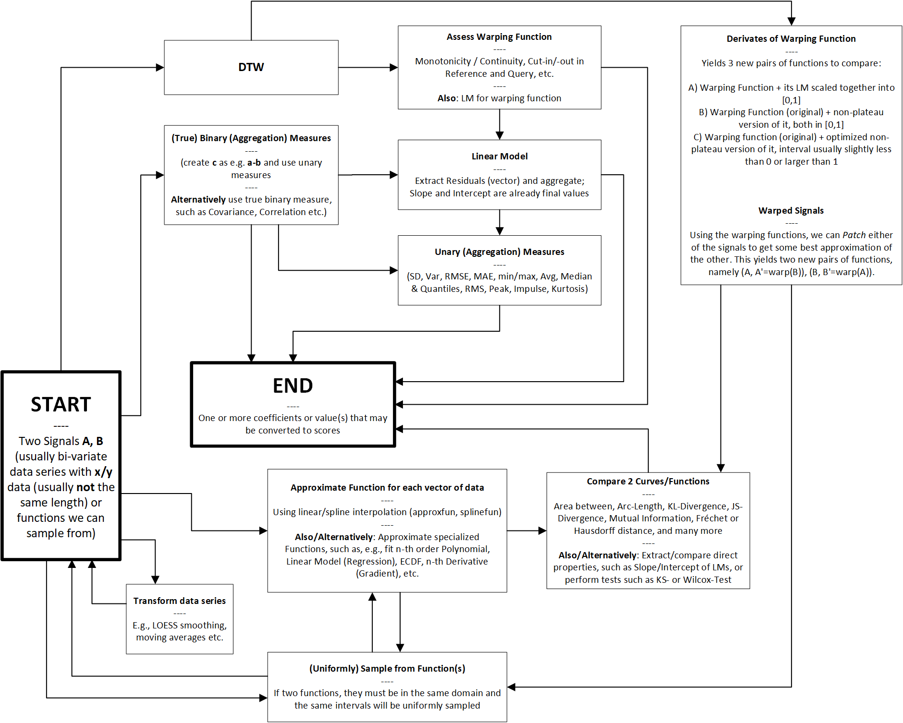
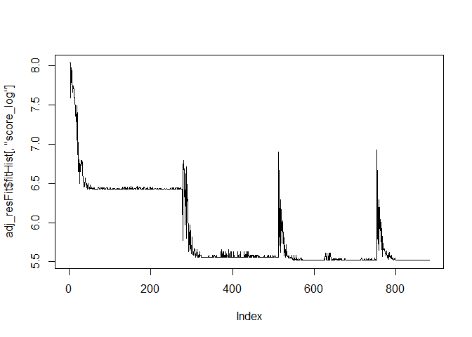

-   [Importing the pattern from file](#importing-the-pattern-from-file)
-   [Defining Intervals and
    sub-models](#defining-intervals-and-sub-models)
    -   [Extracting all sub-patterns](#extracting-all-sub-patterns)
    -   [Events and Metrics](#events-and-metrics)
-   [Load real-world project](#load-real-world-project)
    -   [Add Source Code density](#add-source-code-density)
    -   [The Final project](#the-final-project)
-   [Defining the objective function](#defining-the-objective-function)
    -   [Scoring per variable and
        interval](#scoring-per-variable-and-interval)
    -   [Score weights and aggregation](#score-weights-and-aggregation)
    -   [Create Fire Drill model
        (obsolete)](#create-fire-drill-model-obsolete)
        -   [Selecting sub-models for each
            variable](#selecting-sub-models-for-each-variable)
    -   [Create Fire Drill model (NEW)](#create-fire-drill-model-new)
        -   [1st Stages](#st-stages)
        -   [2nd Stages](#nd-stages)
        -   [Sub-Models](#sub-models)
    -   [Fitting our model](#fitting-our-model)
        -   [Test of fitting the pattern to
            itself](#test-of-fitting-the-pattern-to-itself)
-   [Re-adjusting the pattern](#re-adjusting-the-pattern)
    -   [Adjusting the reference
        pattern](#adjusting-the-reference-pattern)
    -   [Adding a meta sub-model](#adding-a-meta-sub-model)
        -   [Re-create the other
            sub-models](#re-create-the-other-sub-models)
    -   [Fitting the adjusted model to the
        data](#fitting-the-adjusted-model-to-the-data)
        -   [Using Nelder-Mead](#using-nelder-mead)
        -   [Using BFGS with numerical
            gradient](#using-bfgs-with-numerical-gradient)
-   [Further Problems](#further-problems)
    -   [Adjusting the pattern, also to more than one ground
        truth](#adjusting-the-pattern-also-to-more-than-one-ground-truth)
        -   [Option 1: Adjust existing
            pattern](#option-1-adjust-existing-pattern)
            -   [Affine transformation
                tests.](#affine-transformation-tests.)
        -   [Option 2: Partially replace existing
            pattern](#option-2-partially-replace-existing-pattern)
        -   [Option 3: Fully replace existing
            pattern](#option-3-fully-replace-existing-pattern)
    -   [Using the pattern to find current progress of it in a
        project](#using-the-pattern-to-find-current-progress-of-it-in-a-project)
    -   [Forecasting](#forecasting)
    -   [Todo](#todo)
-   [References](#references)

**ATTENTION! After finishing almost all problems in this notebook, we
realized two potentially major errors. This notebook is no further
developed, and there is a copy of it called `fire-drill-model-fixed.Rmd`
that corrects these errors.**

The first error was normalizing the project data, without excluding the
source code density, which should **not** have been normalized. The
second error was that we did not add the right sub-models to the MLM,
and that mistake was repeated subsequently.

    source("../helpers.R", echo = FALSE)
    source("./common-funcs.R", echo = FALSE)
    source("../models/models.R", echo = FALSE)
    source("../models/modelsR6.R")

Importing the pattern from file
===============================

We have previously designed our initial best guess as a vector graphic,
and then rasterized it and exported each path with x/y coordinates in
CSV. There are a few caveats:

-   Not all paths have the same length – this is due to the amount of
    detail of each path. However, the x/y coordinates of each path cover
    the same co-domain.
-   The SVG coordinate system starts with 0,0 in the top left corner, so
    y-values should be flipped.
-   The pattern is hence not in the unit square, and neither do we want
    to present it there as of now. However, we will scale its y-values
    into `[0,1]` and preserve its aspect ratio, so that we can define
    the intervals in the next step more easily.
-   The paths in the modeled SVG have color names: Gold is adaptive,
    green is corrective+perfective, indigo is the commit frequency, and
    coral is the source code density.

<!-- -->

    # scd is source code density
    fd_data <- read.csv("../data/Fire-Drill_first-best-guess.csv", sep = ";")

    normalizeX <- function(xData) {
      xData <- xData - min(xData)
      xData <- xData / max(xData)
      xData
    }

    fd_data <- list(
      adaptive = stats::na.exclude(data.frame(
        x = normalizeX(stats::na.omit(fd_data$gold_x)),
        y = stats::na.omit(fd_data$gold_y),
        t = "A"
      )),
      
      corrPerf = stats::na.exclude(data.frame(
        x = normalizeX(stats::na.omit(fd_data$green_x)),
        y = stats::na.omit(fd_data$green_y),
        t = "CP"
      )),
      
      commFreq = stats::na.exclude(data.frame(
        x = normalizeX(stats::na.omit(fd_data$indigo_x)),
        y = stats::na.omit(fd_data$indigo_y),
        t = "FREQ"
      )),
      
      codeDens = stats::na.exclude(data.frame(
        x = normalizeX(stats::na.omit(fd_data$coral_x)),
        y = stats::na.omit(fd_data$coral_y),
        t = "SCD"
      ))
    )

    fd_data_concat <- rbind(
      fd_data$adaptive,
      fd_data$corrPerf,
      fd_data$commFreq,
      fd_data$codeDens
    )

    fd_data_concat$t <- factor(fd_data_concat$t, levels = unique(fd_data_concat$t), ordered = TRUE)

    # Note that for Fire Drill, each variable covers the entirety
    # of the pattern (i.e., is supported over 0,1), and we have
    # already corrected each variable above using normalizeX().
    # However, we need to correct Y:
    fd_data_concat$y <- -1 * fd_data_concat$y - min(-1 * fd_data_concat$y)
    fd_data_concat$y <- fd_data_concat$y / max(fd_data_concat$y)

Defining Intervals and sub-models
=================================

In this section, we define the intervals’ boundaries and decide for
models to use for each variable in each interval. **The boundaries are
our primary optimization goal**, as we want to minimize the loss of the
models fit over the variables in between. We will defined initial
boundaries, as well as valid ranges for them, according to the
literature. As of our discussions and current definition, we define the
four phases:

1.  Begin – Short project warm-up phase
2.  Long Stretch – The longest phase in the project, about which we do
    not know much about, except for that there should be a rather
    constant amount of activities over time.
3.  Fire Drill – Characteristic is a sudden and steep increase of
    adaptive activities. This phase is over once these activities
    reached their apex.
4.  Aftermath – Everything after the apex. We should see even steeper
    declines.

Brown et al. (1998) describe a typical scenario where about six months
are spent on non-developmental activities, and the actual software is
then developed in less than four weeks. If we were to include some of
the aftermath, the above first guess would describe a project of about
eight weeks.

We define the boundaries and their leeway as follows (there are three
boundaries to split the pattern into four intervals):

-   `b1` – start at 0.085 and allow ranges of `[0.025, 0.25]`
-   `b2` – start at 0.625 and allow ranges of `[0.5, 0.9]`
-   `b3` – start at 0.875 and allow ranges of `[0.5, 0.975]`

Also, we need to define additional inequality constraints between the
boundaries, so that we guarantee a minimum distance between boundaries.
In general, we only want to impose the rather loose constraint of having
at least `0.05` between any two boundaries. While `b1` and `b2` cannot
cross and can never undercut this threshold, `b2` and `b3` can. The
inequality constraint hence is `b3 - b2 >= 0.05`.

The last step is to update the concatenated data and attach a factor
column with the interval:

    fd_data_concat$interval <- sapply(fd_data_concat$x, function(x) {
      if (x < fd_data_boundaries["b1"]) {
        return("Begin")
      } else if (x < fd_data_boundaries["b2"]) {
        return("LongStretch")
      } else if (x < fd_data_boundaries["b3"]) {
        return("FireDrill")
      }
      return("Aftermath")
    })

    fd_data_concat$interval <- factor(
      x = fd_data_concat$interval,
      levels = c("Begin", "LongStretch", "FireDrill", "Aftermath"), ordered = TRUE)

Let’s plot the original data (note that we take the negative y-values to
conform to our coordinate system where `[0,0]` is in the **lower** right
corner):

    library(ggplot2)

    ggplot(data = fd_data_concat, aes(x = x, y = y, color = t)) +
      geom_line() +
      labs(color = "Data series") +
      scale_x_continuous(
        breaks = seq(0, 1, by = .05)
      ) +
      theme(axis.text.x = element_text(angle = -45, vjust = 0)) +
      scale_color_brewer(palette = "Set1")

Now the pattern is already in the unit-square (`[0,1]`). This is OK, as
some variables in the pattern are defined to reach their absolute
minimum or maximum. The other variables are designed relative to it,
resulting in some space above or below.

The following plot includes the initial boundaries and their allowed
ranges:

    plot_fullPattern <- ggplot(data = fd_data_concat, aes(x = x, y = y, color = t)) +
      geom_line() +
      labs(color = "Data series") +
      scale_x_continuous(
        breaks = seq(0, 1, by = .05, xlim = c(0,1))
      ) +
      scale_y_continuous(
        breaks = seq(0, 1, by = .05, ylim = c(0,1))
      ) +
      theme_light() +
      theme(axis.text.x = element_text(angle = -45, vjust = 0)) +
      geom_vline(xintercept = fd_data_boundaries["b1"], color = "blue", size = .5) +
      geom_vline(xintercept = fd_data_boundaries["b2"], color = "blue", size = .5) +
      geom_vline(xintercept = fd_data_boundaries["b3"], color = "blue", size = .5) +
      geom_rect(data = data.frame(
        xmin = c(.025, .5, .5),
        xmax = c(.25, .9, .975),
        ymin = c(0, .05, 0),
        ymax = c(1, .95, 1),
        boundary = c("b1", "b2", "b3"),
        fill = c("green", "red", "blue")
      ), aes(xmin = xmin, xmax = xmax, ymin = ymin, ymax = ymax, fill = fill), color = "black", alpha = .25, inherit.aes = FALSE, show.legend = FALSE) +
      scale_color_brewer(palette = "Set1")

    ## Warning: In seq.default(0, 1, by = 0.05, xlim = c(0, 1)) :
    ##  extra argument 'xlim' will be disregarded

    ## Warning: In seq.default(0, 1, by = 0.05, ylim = c(0, 1)) :
    ##  extra argument 'ylim' will be disregarded

    plot_fullPattern

Extracting all sub-patterns
---------------------------

Now show a faceted plot:

    ggplot(data = fd_data_concat, aes(x = x, y = y, color = t)) +
      geom_line(size = 1) +
      labs(color = "Data series") +
      scale_x_continuous(
        breaks = seq(0, 1, by = .1)
      ) +
      facet_grid(t ~ interval, scales = "free_x") +
      scale_color_brewer(palette = "Set1")

Note that in the above plot, every column of plots has the same width.
However, this becomes obvious when looking at the x-axis for each
column. While we could adjust the widths to the actual interval lengths,
we keep it like this for two reasons: first, it allows us better insight
into shorter intervals. Second, models that do transformation into the
unit-square will “see” the pattern very similar to how it looks above.

The split was made according to the initial boundaries. What is
important to remember, is that each sub-plot in the above grid **is a
reference pattern**, that is, each of these above represents the
reference we want to fit the data (the query extracted according to the
boundaries given during the optimization) against using some model
later.

Events and Metrics
------------------

We need to make an important distinction between events and metrics. An
event does not carry other information, other than that it occurred. One
could thus say that such an event is *nulli*-variate. If an event were
to carry extra information, such as a measurement that was taken, it
would be *uni*-variate. That is the case for many metrics in software:
the time of their measurement coincides with an event, such as a commit
that was made. On the time-axis we thus know **when** it occurred and
**what** was its value. Such a metric could be easily understood as a
*bi-variate x/y* variable and be plotted.

An event however does not have any associated y-value we could plot.
Given a time-axis, we could make a mark whenever it occurred. Some of
the markers would probably be closer to each other or be more or less
accumulated. The y-value could express these accumulations relative to
each other. These are called **densities**. This is exactly what *Kernel
Density Estimation* (KDE) does: it expresses the relative accumulations
of data on the x-axis as density on the y-axis. For KDE, the actual
values on the x-axis have another meaning, and that is to compare the
relative likelihoods of the values on it, since the axis is ordered. For
our case however, the axis is linear time and carries no such meaning.

The project data we analyze is a kind of sampling over the project’s
events. We subdivide the gathered project data hence into these two
types of data series:

-   **Events**: They do not carry any extra information or measurements.
    As for the projects we analyze, events usually are occurrences of
    specific types of commits, for example. The time of occurrence is
    the x-value on the time-axis, and the y-value is obtained through
    KDE.
-   **Metrics**: Extracted from the project at specific times, for
    example at every commit. We can extract any number or type of
    metric, but each becomes its own variable, where the x-value is on
    the time-axis, and the y-value is the metric’s value.

Load real-world project
=======================

We load the same project as in the notebook `student-project-1.Rmd`.

    spFile <- "../data/student-project-1.csv"
    sp <- read.csv(spFile)

    dateFormat <- "%Y-%m-%d %H:%M:%S"

    sp$CommitterTimeObj <- as.POSIXct(strptime(
      sp$CommitterTime, format = dateFormat))
    sp$AuthorTimeObj <- as.POSIXct(strptime(
      sp$AuthorTime, format = dateFormat))

    # Cut off data way after project end:
    sp <- sp[sp$AuthorTimeObj <= as.POSIXct(strptime("2020-08-31", format = "%Y-%m-%d")), ]

    # Create normalized timestamps:
    sp$AuthorTimeNormalized <- sp$AuthorTimeUnixEpochSecs - min(sp$AuthorTimeUnixEpochSecs)
    sp$AuthorTimeNormalized <- sp$AuthorTimeNormalized / max(sp$AuthorTimeNormalized)

Now we define each variable as a function:

    # passed to stats::density
    use_kernel <- "gauss" # "rect"

    # We'll need these for the densities:
    acp_ratios <- table(sp$label) / sum(table(sp$label))

    dens_a <- densitySafe(
      sp[sp$label == "a", ]$AuthorTimeNormalized, acp_ratios[["a"]], kernel = use_kernel)
    dens_c <- densitySafe(
      sp[sp$label == "c", ]$AuthorTimeNormalized, acp_ratios[["c"]], kernel = use_kernel)
    dens_p <- densitySafe(
      sp[sp$label == "p", ]$AuthorTimeNormalized, acp_ratios[["p"]], kernel = use_kernel)

    # Also compute a combined density for corr+perf:
    dens_cp <- densitySafe(
      sp[sp$label == "c" | sp$label == "p", ]$AuthorTimeNormalized,
      acp_ratios[["c"]] + acp_ratios[["p"]], kernel = use_kernel)
    # .. and the overall frequency:
    dens_acp <- densitySafe(
      sp$AuthorTimeNormalized, kernel = use_kernel)

    use_acp_attr <- c("min", "max", "ratio", "ymax")
    acp_attr <- rbind(
      data.frame(attributes(dens_a)[use_acp_attr]),
      data.frame(attributes(dens_c)[use_acp_attr]),
      data.frame(attributes(dens_p)[use_acp_attr]))

Add Source Code density
-----------------------

The source code density is a different kind of variable. Like any other
metric, its sampling frequency has no effect on the density, but rather
its value. Sampling more frequently will only increase precision. So
while we estimated a Kernel for the activities, for all other variables
that are metrics, the density (or curve) depends on the observed value,
not on the frequency of observations.

    dens_scd_data <- data.frame(
      x = sp$AuthorTimeNormalized,
      y = sp$Density
    )

    # We want to smooth the density data a little:
    temp <- stats::loess.smooth(
      x = dens_scd_data$x, y = dens_scd_data$y, span = .07, family = "sym", degree = 1, evaluation = nrow(dens_scd_data))
    dens_scd_data$x <- temp$x
    dens_scd_data$y <- temp$y - min(temp$y)
    dens_scd_data$y <- dens_scd_data$y / max(dens_scd_data$y)

    dens_scd <- (function() {
      r <- range(dens_scd_data$x)
      temp <- stats::approxfun(x = dens_scd_data$x, y = dens_scd_data$y, ties = "ordered")
      f1 <- Vectorize(function(x) {
        if (x < r[1] || x > r[2]) {
          return(NaN)
        }
        return(temp(x))
      })
      
      attributes(f1) <- list(
        min = r[1], max = r[2], x = dens_scd_data$x, y = dens_scd_data$y
      )
      
      f1
    })()

This is how the project looks. Please note that we have already cut off
all activity after August 31 2020.

    ggplot(data.frame(x = range(acp_attr$min, acp_attr$max)), aes(x)) +
      stat_function(fun = dens_a, aes(color="A"), size = 1, n = 2^11) +
      #stat_function(fun = dens_c, aes(color="C"), size = 1, n = 2^11) +
      #stat_function(fun = dens_p, aes(color="P"), size = 1, n = 2^11) +
      stat_function(fun = dens_cp, aes(color="CP"), size = 1, n = 2^11) +
      stat_function(fun = dens_acp, aes(color="FREQ"), size = 1, n = 2^11) +
      stat_function(fun = dens_scd, aes(color="SCD"), size = 1, n = 2^11) +
      theme_light() +
      labs(color = "Activity") +
      scale_color_brewer(palette = "Set1")

In the above plot, it appears that the initial perfective activities (in
the approximate range of `[~-0..5, 0.2]`) may or may not belong to the
project’s actual work range. For example, it seems plausible that the
project manager made some initial commit(s) with directions for the
students. In a real-world analysis, one would need to decide whether to
cut this off or not, based on the knowledge of what was going on. We
allow the remainder of this notebook to make the switch using a
variable. This will allow us to examine model-fits under different
configurations.

*Note*: As of our suspicion, the very first commit is not the project’s
start, and the right decision for this project would to cut it off.

    # Use this obvious variable to control cutting off initial perfective commits.
    CUT_OFF_PERFECTIVE_COMMITS_IN_BEGIN <- TRUE

    dens_acp_x_min <- min(acp_attr$min)
    if (CUT_OFF_PERFECTIVE_COMMITS_IN_BEGIN) {
      dens_acp_x_min <- min(acp_attr[1:2,]$min) # 1:2 are a,c; see above
    }
    dens_acp_x_max <- max(acp_attr$max) # we're not cutting off at end

    dens_a_x_idx <- attributes(dens_a)$x >= dens_acp_x_min
    dens_c_x_idx <- attributes(dens_c)$x >= dens_acp_x_min
    dens_p_x_idx <- attributes(dens_p)$x >= dens_acp_x_min
    dens_cp_x_idx <- attributes(dens_cp)$x >= dens_acp_x_min
    dens_scd_x_idx <- attributes(dens_scd)$x >= dens_acp_x_min
    dens_acp_x_idx <- attributes(dens_acp)$x >= dens_acp_x_min

    dens_acp_data <- rbind(
      data.frame(
        x = attributes(dens_a)$x[dens_a_x_idx],
        y = attributes(dens_a)$y[dens_a_x_idx] * attributes(dens_a)$ratio,
        t = rep("A", sum(dens_a_x_idx))
      ),
    #  data.frame(
    #    x = attributes(dens_c)$x[dens_c_x_idx],
    #    y = attributes(dens_c)$y[dens_c_x_idx] * attributes(dens_c)$ratio,
    #    t = rep("C", sum(dens_c_x_idx))
    #  ),
    #  data.frame(
    #    x = attributes(dens_p)$x[dens_p_x_idx],
    #    y = attributes(dens_p)$y[dens_p_x_idx] * attributes(dens_p)$ratio,
    #    t = rep("P", sum(dens_p_x_idx))
    #  ),
      data.frame(
        x = attributes(dens_cp)$x[dens_cp_x_idx],
        y = attributes(dens_cp)$y[dens_cp_x_idx] * attributes(dens_cp)$ratio,
        t = rep("CP", sum(dens_cp_x_idx))
      ),
      data.frame(
        x = attributes(dens_acp)$x[dens_acp_x_idx],
        y = attributes(dens_acp)$y[dens_acp_x_idx],
        t = rep("FREQ", sum(dens_acp_x_idx))
      ),
      data.frame(
        x = attributes(dens_scd)$x[dens_scd_x_idx],
        y = attributes(dens_scd)$y[dens_scd_x_idx],
        t = rep("SCD", sum(dens_scd_x_idx))
      )
    )
    dens_acp_data$t <- factor(x = dens_acp_data$t, levels = unique(dens_acp_data$t), ordered = TRUE)

    # Now it is important to scale the densities for a,c,p on the x-axis together,
    # so that we get all three within [0,1].
    dens_acp_data$x <- dens_acp_data$x - min(dens_acp_data$x)
    dens_acp_data$x <- dens_acp_data$x / max(dens_acp_data$x)

    # ERROR #1: Here we falsely normalize all data together, but it should have only been the
    # ERROR #1: densities, and NOT the source code density (because it's a metric).

    # Now that we have used the densities to get each variable's proportions
    # right, we limit our project data back to [0,1] in y, as the pattern's
    # definition lives in the same co-domain.
    dens_acp_data$y <- dens_acp_data$y / max(dens_acp_data$y)

The Final project
-----------------

Let’s plot how that looks:

    plot_finalProject <- ggplot(dens_acp_data, aes(x = x, y = y)) +
      geom_line(aes(color = t), size = .75) +
      theme_light() +
      labs(color = "Activity") +
      scale_color_brewer(palette = "Set1")

    plot_finalProject

The above plot represents now the final project that we will fit our
entire pattern to:

-   The domain is now `[0,1]` – note that the source code density was
    not estimated using KDE, so that we do not have an estimation for
    the bandwidth, which leads to initial inclines and declines at the
    end for such variables.
-   The integral of the frequency is roughly `1` – the sum of the three
    integrals for each of the three activities is also `1`. It is
    important that each activity has a density that is proportional to
    the amount of the other activities, and that in sum everything
    should become `1` again.

Defining the objective function
===============================

Now we can finally start to define an objective function. Before that,
we need to decide how to score each variable (i.e., what kind of model)
in each interval. For each step of the fitting process, we will get a
vector of scores that needs to be aggregated.

Scoring per variable and interval
---------------------------------

We want to choose an adequate model for each variable in each interval,
and then optimize the boundaries to maximize the fit of each model.

A model consists of two stages. First, any signal transformations are
formulated. We have a reference- (**A**) and query-signal (**B**). These
transformations could be, e.g., smoothing the query-signal, fitting a
polynomial to it, applying DTW to rectify it etc. While some
transformations are applied only to the query-signal, some are applied
to the reference signal, and some can be applied to both (e.g., taking
the `ecdf()` of either signal). Furthermore, a model may choose to
output an entire new function in this step, such as the DTW’s warping
function. Lastly, it is also possible not to apply any transformations.
While less robust for further processing due to the assumption of
linearly-scaled time, this is computationally much less costly while
also giving acceptable results.

The second stage of a model is the definition of what is scored, and
how. Depending on the output of the first stage, there are a large
number of options. Usually the output is a pair of functions for which
we have implemented plenty of measures that can quantify the
differences. It may also be the case that we can directly extract final
values or coefficients after the first stage, e.g., information about
linear models. The first stage can also loop, meaning that arbitrary
many transformation in series and of different kind are possible.

The two stages were joined together and are represented in this image,
the “Metrics Pipeline”:

Now it is apparent that we almost have infinitely many choices on how to
compose a model for a variable in an interval. It would probably be
worth conduction a larger-scale experiment with extensive grid-searches
to find what works best under which circumstances. However, not only
does this extend way beyond the purpose of this work and should be moved
into the other, more technical paper. It also would cost too much time
now, and during some of the earlier tests we have already observed a few
things that appeared to work well. We hence limit ourselves to choosing
one of the below, pre-configured models.

These are:

**No Score**: If there is no or nearly no information available for a
variable in an interval, we should choose not to score it.

**Linear Model**: A linear model (regression) can be used for when we do
not know much about the course of a variable in an interval. We use this
model when our best expectation is a linear course of the variable, and
that is what we extract from the model (stage 1). We may have an
expectation for the intercept, slope or the residuals (stage 2). When
using this model, we usually choose a lower weight for it. Of course, we
could compare functions, too, but using the mentioned parameters of the
LM is more straightforward here.

**Rectifier**: A model to match shapes of curves, that uses *DTW* to
**rectify** a signal and then computes the goodness-of-fit using one or
more of the previously developed scores. Also, the best results were
obtained by scoring the differences of the two signals *and* the
warping-curve (stage 1). We should probably use a combination of some of
the low-level metrics (e.g., correlation, area, arc-length, .., etc.),
or one of the mid-level metrics (e.g., JSD or MI) that capture more than
one property (stage 2). This is the most sophisticated method we
currently have. The underlying DTW is computed with either closed or
open begin/end. In the later case, the score of the rectifier model also
reflects how much of the query was matched.

**No Model** (approximate function): We can choose to just extract the
data from the current interval, to approximate a function for its data,
and then compute a score in the same way the Rectifier does, by
comparing two functions. Skipping the rectification seems to work well
in most cases; however, we assume that the data from the interval has
linear time and no time dilations exist.

**Polynomial**: Similar to **No Model**, we fit a 2nd- or 3rd-order
polynomial (or we may use the new function `poly_autofit()` to find the
best model) over the data (currently, 3rd order should suffice given the
peculiarities of our defined Fire Drill) and then compare the resulting
function against the reference. Again, this approach assumes no
distortions in time.

<table>
<colgroup>
<col style="width: 7%" />
<col style="width: 7%" />
<col style="width: 19%" />
<col style="width: 11%" />
<col style="width: 53%" />
</colgroup>
<thead>
<tr class="header">
<th style="text-align: left;">Interval</th>
<th style="text-align: left;">Variable</th>
<th style="text-align: left;">Model</th>
<th style="text-align: center;">Weight</th>
<th style="text-align: left;">Model notes</th>
</tr>
</thead>
<tbody>
<tr class="odd">
<td style="text-align: left;">Begin</td>
<td style="text-align: left;">A</td>
<td style="text-align: left;">Rectifier, No Model, Poly(2)</td>
<td style="text-align: center;"><code>0.8</code></td>
<td style="text-align: left;">-</td>
</tr>
<tr class="even">
<td style="text-align: left;">Begin</td>
<td style="text-align: left;">C+P</td>
<td style="text-align: left;">Rectifier, No Model, Poly(2)</td>
<td style="text-align: center;"><code>0.8</code></td>
<td style="text-align: left;">-</td>
</tr>
<tr class="odd">
<td style="text-align: left;">Begin</td>
<td style="text-align: left;">FREQ</td>
<td style="text-align: left;">Rectifier, No Model, Poly(2)</td>
<td style="text-align: center;"><code>0.8</code></td>
<td style="text-align: left;">-</td>
</tr>
<tr class="even">
<td style="text-align: left;">Begin</td>
<td style="text-align: left;">SCD</td>
<td style="text-align: left;">Rectifier, No Model, Poly(2)</td>
<td style="text-align: center;"><code>0.8</code></td>
<td style="text-align: left;">-</td>
</tr>
<tr class="odd">
<td style="text-align: left;">———</td>
<td style="text-align: left;">———–</td>
<td style="text-align: left;">————————-</td>
<td style="text-align: center;">——–</td>
<td style="text-align: left;">—————————————————-</td>
</tr>
<tr class="even">
<td style="text-align: left;">Long Stretch</td>
<td style="text-align: left;">A</td>
<td style="text-align: left;">No Score, LM (𝔼 [0∘])</td>
<td style="text-align: center;"><code>0.5</code></td>
<td style="text-align: left;">-</td>
</tr>
<tr class="odd">
<td style="text-align: left;">Long Stretch</td>
<td style="text-align: left;">C+P</td>
<td style="text-align: left;">No Score, LM (𝔼 [0∘])</td>
<td style="text-align: center;"><code>0.5</code></td>
<td style="text-align: left;">-</td>
</tr>
<tr class="even">
<td style="text-align: left;">Long Stretch</td>
<td style="text-align: left;">FREQ</td>
<td style="text-align: left;">No Score, LM (𝔼 [0∘])</td>
<td style="text-align: center;"><code>0.5</code></td>
<td style="text-align: left;">-</td>
</tr>
<tr class="odd">
<td style="text-align: left;">Long Stretch</td>
<td style="text-align: left;">SCD</td>
<td style="text-align: left;">No Score, LM (𝔼 [slope &lt; 0∘]), Rectifier, No Model, Poly(2)</td>
<td style="text-align: center;"><code>0.5</code></td>
<td style="text-align: left;">Use of non-LM may be applicable, considering the somewhat smooth decline in the beginning of this phase.</td>
</tr>
<tr class="even">
<td style="text-align: left;">———</td>
<td style="text-align: left;">———–</td>
<td style="text-align: left;">————————-</td>
<td style="text-align: center;">——–</td>
<td style="text-align: left;">—————————————————-</td>
</tr>
<tr class="odd">
<td style="text-align: left;">Fire Drill</td>
<td style="text-align: left;">A</td>
<td style="text-align: left;">LM (𝔼 [slope ≥ 45∘]), Rectifier, No Model, Poly(3)</td>
<td style="text-align: center;"><code>1.0</code></td>
<td style="text-align: left;">LM may be applicable as we know nothing about <em>how</em> the variable rises, just that it will. It is however the least-preferred option. Usage of LM is probably a bit sketchy, as we need to make assumptions about its slope.</td>
</tr>
<tr class="even">
<td style="text-align: left;">Fire Drill</td>
<td style="text-align: left;">C+P</td>
<td style="text-align: left;">LM (𝔼 [slope ≈  − 45∘]), Rectifier, No Model, Poly(3)</td>
<td style="text-align: center;"><code>1.0</code></td>
<td style="text-align: left;">Like adaptive (A), an LM may be worth checking out, as this variable is almost linear in our model. Also, when using an LM for any variable in this interval, we should use a smaller weight.</td>
</tr>
<tr class="odd">
<td style="text-align: left;">Fire Drill</td>
<td style="text-align: left;">FREQ</td>
<td style="text-align: left;">LM (𝔼 [slope ≥ 45∘]), Rectifier, No Model, Poly(3)</td>
<td style="text-align: center;"><code>1.0</code></td>
<td style="text-align: left;">Like the previous two.</td>
</tr>
<tr class="even">
<td style="text-align: left;">Fire Drill</td>
<td style="text-align: left;">S</td>
<td style="text-align: left;">Rectifier, No Model, Poly(3)</td>
<td style="text-align: center;"><code>1.0</code></td>
<td style="text-align: left;">-</td>
</tr>
<tr class="odd">
<td style="text-align: left;">———</td>
<td style="text-align: left;">———–</td>
<td style="text-align: left;">————————-</td>
<td style="text-align: center;">——–</td>
<td style="text-align: left;">—————————————————-</td>
</tr>
<tr class="even">
<td style="text-align: left;">Aftermath</td>
<td style="text-align: left;">A</td>
<td style="text-align: left;">Rectifier, No Model, Poly(3)</td>
<td style="text-align: center;"><code>1.0</code></td>
<td style="text-align: left;">-</td>
</tr>
<tr class="odd">
<td style="text-align: left;">Aftermath</td>
<td style="text-align: left;">C+P</td>
<td style="text-align: left;">LM (𝔼 [slope ≈  − 45∘]), Rectifier, No Model, Poly(3)</td>
<td style="text-align: center;"><code>1.0</code></td>
<td style="text-align: left;">This is basically a slightly less steep continuation of the previous interval</td>
</tr>
<tr class="even">
<td style="text-align: left;">Aftermath</td>
<td style="text-align: left;">FREQ</td>
<td style="text-align: left;">Rectifier, No Model, Poly(3)</td>
<td style="text-align: center;"><code>1.0</code></td>
<td style="text-align: left;">-</td>
</tr>
<tr class="odd">
<td style="text-align: left;">Aftermath</td>
<td style="text-align: left;">SCD</td>
<td style="text-align: left;">Rectifier, No Model, Poly(3)</td>
<td style="text-align: center;"><code>1.0</code></td>
<td style="text-align: left;">-</td>
</tr>
</tbody>
</table>

Notes:

-   If not noted otherwise, when using an LM, we expect a slope of `0`,
    and any (positive or negative) slope will decrease the score.
-   When using an LM, we currently do not score the residuals, as we
    cannot make assumptions about how the data is distributed in an
    interval. If we were to score lower residuals better, then the LM
    would fit towards data with less noise better, but we do not know
    anything about the noise. That’s why we skip it.
-   I do not see a reason for mixing non-linear models within the entire
    model, i.e., all variables that use a non-linear model should use
    the same kind of model, otherwise it will be also more difficult to
    compare approaches.
    -   The only thing we can compare is whether all non-linear models
        converge to the same interval boundaries. Different models will
        result in different scores, so there is no way to say which
        model is best, at least not until we have all the ground truth.
        Until then the only conclusions we may draw are those from
        models that result in obviously erroneous fits.

Score weights and aggregation
-----------------------------

Given a weight-vector **w** and a score-vector **s** of same length, we
want to aggregate all scores using this expression:

$$
\\displaystyle \\prod^{\\Vert \\boldsymbol s \\Vert}\_{i=1}1+ \\boldsymbol w\_i \* f\_{t,k}(\\boldsymbol s\_i),\\;\\; \\forall \\boldsymbol w\_i \\; 0 &lt; \\boldsymbol w\_i \\leq 1 \\; \\wedge \\; \\forall \\boldsymbol s\_i \\; 0 \\leq \\boldsymbol s\_i \\leq 1,
$$

where *f**t*, *k* : â„ → ℠is a non-linear scaling function
(see below). The advantages of the above expression are these:

-   We can introduce weights to linearly scale each score and thus alter
    its importance.
-   Instead of diminishing the product, low scores will rather not
    increase it.
-   We know the lower and upper bound (remember, scores are in range
    `[0,1]`) for this expression.

Furthermore, we want to use a non-linear scaling function,
*f**t*, *k*, that penalizes low scores and exponentially
rewards higher scores. That function will be linear until some threshold
*t* (typically 0.1 ≤ *t* ≤ 0.5), and exponential afterwards (with
typical exponent 2 ≤ *k* ≤ 5).

$$
f\_{t,k}(x) = \\begin{cases}
  x \* t^{k-1}, & \\text{for } 0 \\leq x \\leq t, \\\\
  x^k, & \\text{for } x &gt; t.
\\end{cases}
$$

Penalize small scores:

    # I suppose that ideally the threshold should be the median
    # of the scores one wants to penalize.
    penalizeThreshold <- .4
    penalizeExponent <- 2.2

    penalizeScore <- create_penalizeScore(penalizeThreshold, penalizeExponent)

    round(penalizeScore(c(.4,.5,.6,.7,.8,.9)), 3)

    ## [1] 0.133 0.218 0.325 0.456 0.612 0.793

    curve(penalizeScore)
    tempf <- function(x) x * penalizeThreshold^(penalizeExponent - 1)
    curve(tempf, from = penalizeThreshold, add = TRUE, type = "l", lty = "dotted", lwd = 2.5)

Create Fire Drill model (obsolete)
----------------------------------

<s>Now we are ready to select a sub-model for each variable in each
interval. Note that all sub-models, as well as the objective function
are defined in the file `models.R`.</s> The following is obsolete code
that was using functional-style models (defined in `models.R`). We keep
it for historical reasons, but everything else has moved to the new
**R6** models below.

    # This is a list with reference data for grouped by
    # each variable, then by interval, e.g., A_Begin etc.
    dataRefAll <- create_reference_data(patternData = fd_data_concat)

### Selecting sub-models for each variable

Some obsolete code for ya:

    # listOfSubModels <- list(
    #   A_Begin = sub_model_no_model,
    #   A_LongStretch = sub_model_no_model, # TODO: This needs to be an LM!
    #   A_FireDrill = sub_model_no_model,
    #   A_Aftermath = sub_model_no_model
    # )
    # 
    # subModelWeights <- c(
    #   "A_Begin" = 1,
    #   "A_LongStretch" = 1,
    #   "A_FireDrill" = 1,
    #   "A_Aftermath" = 1
    # )
    # 
    # fdm <- create_fire_drill_model(
    #   fireDrillProject = dens_acp_data,
    #   listOfSubModels = listOfSubModels,
    #   subModelWeights = subModelWeights
    # )
    # 
    # # Upper bound would be:
    # prod(1 + subModelWeights) - 1
    # 
    # # and a dummy-test!
    # temp <- fdm(c(.3, .38, .85), returnAllScores = TRUE)
    # temp
    # prod(temp) - 1
    # (prod(temp) - 1) / (prod(1 + subModelWeights) - 1) # relative score in [0,1]
    # stage2_low_level_scores <- create_stage2_two_functions_using_scores(
    #   area_diff_2_functions_score(),
    #   stat_diff_2_functions_cor_score(),
    #   stat_diff_2_functions_sd_var_mae_rmse_score(use = "sd"),
    #   stat_diff_2_functions_arclen_score(),
    #   stat_diff_2_functions_signals_score(use = c("RMS", "Kurtosis"))
    # )
    # 
    # stage2_JSD_score <- create_stage2_two_functions_using_scores(
    #   stat_diff_2_functions_symmetric_JSD_score()
    # )
    # 
    # stage2_divergence_scores <- create_stage2_two_functions_using_scores(
    #   stat_diff_2_functions_symmetric_JSD_score(),
    #   stat_diff_2_functions_mutual_information_score()
    # )
    # 
    # stage2_angle_between_LMs_zero <- create_stage2_two_functions_using_scores(
    #   stat_diff_2_functions_lm_score(expectAngleDeg = 0)
    # )
    # 
    # subModels_A <- list(
    #   A_Begin = generic_sub_model(
    #     weight = 1,
    #     dataRef = dataRefAll[["A_Begin"]],
    #     stage1 = create_stage1_No_Model(dataRef = dataRefAll[["A_Begin"]]),
    #     stage2 = stage2_JSD_score
    #   ),
    #   
    #   A_LongStretch = generic_sub_model(
    #     weight = 1/3,
    #     dataRef = dataRefAll[["A_LongStretch"]],
    #     stage1 = create_stage1_No_Model(dataRef = dataRefAll[["A_LongStretch"]], yLimitsRef = c(0,1)),
    #     stage2 = stage2_angle_between_LMs_zero
    #   ),
    #   
    #   A_FireDrill = generic_sub_model(
    #     weight = 1,
    #     dataRef = dataRefAll[["A_FireDrill"]],
    #     stage1 = create_stage1_No_Model(dataRef = dataRefAll[["A_FireDrill"]]),
    #     stage2 = stage2_JSD_score
    #   ),
    #   
    #   A_Aftermath = generic_sub_model(
    #     weight = 1,
    #     dataRef = dataRefAll[["A_Aftermath"]],
    #     stage1 = create_stage1_No_Model(dataRef = dataRefAll[["A_Aftermath"]]),
    #     stage2 = stage2_JSD_score
    #   )
    # )
    # 
    # 
    # subModels_CP <- list()
    # 
    # subModels_FREQ <- list()
    # 
    # subModels_SCD <- list()
    # 
    # listOfSubModels <- c(subModels_A, subModels_CP, subModels_FREQ, subModels_SCD)

    #fdm <- create_fire_drill_model(
    #  fireDrillProject = dens_acp_data,
    #  listOfSubModels = listOfSubModels
    #)
    #fdm(c(.3, .38, .95), returnAllScores = TRUE)

Create Fire Drill model (NEW)
-----------------------------

In the meantime, I have developed a much more sophisticated **Multilevel
Model**, as well as other classes, such as `SubModel`, `Stage1`- and
`Stage2`-classes (including some more specialized sub-classes), classes
for scoring etc. The `MultilevelModel` class takes reference- and
query-data, arbitrary many boundaries (1 or more) and one or no model
per variable and interval. It has fitting built in, with support for
parallelization. Also, convenient ways to set linear inequality
constraints for all boundaries, as well as validation of these was built
in.

The two stages, `Stage1` and `Stage2` (and derivatives thereof), were
made to reflect the idea of our **Metrics Pipeline**. In it, the first
stage is responsible for generating and/or transforming the data as
needed by the second stage, which will do the scoring. The task of the
`SubModel` then is take both stages, capture one variable in one
interval, and to use the given reference- and query-data to compute a
score.

For the **Fire Drill** pattern, as of now, we only really use two kinds
of sub-models. This will most likely change in the future, when we
refine

-   Rectifier: Use **DTW** to rectify the query, then calculate a score
-   Linear Regression: The only thing we score with it is the flatness
    of the regression line, w.r.t. an expected slope.

Since we use `R6`-classes, we get reference semantics in R (i.e., not
copy-on-write)! We can also easily (deep-)clone objects, which will come
in handy when we define our sub-models and their stages below, and can
reuse many of these.

The **Fire Drill** model is defined as a **`MultilevelModel`**. We set
all reference- and query-data.

    mlm <- MultilevelModel$new(
      referenceData = fd_data_concat,
      referenceBoundaries = fd_data_boundaries)

    mlm$setQueryData(series = "ALL", queryData = dens_acp_data)
    mlm$sourceFiles <- c("common-funcs.R", "../models/modelsR6.R")

### 1st Stages

We will be able to reuse Stages, Scores and SubModels across variables
and intervals. As for the current description of Fire Drill, we will
only need two kinds of first stages:

1.  A specialized (`Stage1Rectifier`) first stage, that samples from the
    reference- and query-signals with high resolution (e.g., 10k
    points), and produces a function for each. This stage will respect
    the original co-domains of each signal, so that the signals do
    **not** get stretched into `[0,1]`. The implication of that is, that
    we match **both**, shape and magnitude. If we were to scale both
    signals into `[0,1]`, we would only match shape. By not doing it, we
    need to be careful with the scores that we compute, as some of them
    are sensitive to whether the signals live in the unit-square or not.
2.  An ordinary (`Stage1NoModel`) first stage, that does not do any
    transformations on the data, only samples with a high resolution and
    approximates functions for further processing, according to the
    co-domain of each signal (i.e., no `[0,1]` scaling is performed).
    This is acceptable if two conditions are met: A) The reference- and
    query-data are both defined on that interval, and B) we are not
    planning on scoring the magnitude of the extracted signals later
    on. B) is fulfilled here, as this 1st stage is used for when we
    apply a Linear Model with the goal of comparing the slopes of both
    signals. If we wanted to do something else, such as scoring the
    shapes of the signals, a `[0,1]` scaling would be recommended.

These two kinds of first stages are sufficient for all our operations,
and we will define them once and then reuse them (by cloning) on
subsequent sub-models The two first stages are:

    stage1_special <- Stage1Rectifier$new(
      yLimitsRef = "self", yLimitsQuery = "self")

    stage1_ordinary <- Stage1NoModel$new(
      approxRefFun = TRUE, approxQueryFun = TRUE)
    stage1_ordinary$setYLimitsRef("self")$setYLimitsQuery("self")

### 2nd Stages

Those will be designed in concordance with the respective 1st stages.
Again, we need two different stages that can process the results of the
first stages we have. A second stage can use any number of scoring
methods, and thus produces one or more sub-scores. These are usually
aggregated using the mean, or `Honel`.

1.  A specialized (`Stage2Rectifier`) second stage, that can handle
    either, scaled and un-scaled data. It uses DTW to rectify the
    query-signal, and computes scores over the warping function and its
    derivatives. It also computes scores of two pairs of other
    functions. For pairs of functions we use a combination of low- and
    mid-level scores, such as the area between curves, correlation,
    arc-length etc., as well as divergence measures, such as
    Jensen-Shannon. All sub-scores in this stage are This 2nd stage is
    always used when the `Stage1Rectifier` is used.
2.  An ordinary (`Stage2`) second stage that takes the two functions,
    samples from them and scores the Linear Models of both of them.
    Currently, we score only the angle between both regressions (the
    expectation is `0°`). The ordinary stages are only used in the
    **LongStretch** intervals, of which we do not know much. While we
    have much more characteristic pattern to match in the other three
    intervals, we want this phase to be as long as possible. Therefore,
    we include a manual score that is greater, the longer this phase is
    selected.

We are defining these 2nd stages:

    stage2_special <- Stage2Rectifier$new(
      scoreWarpingFunction = c("mono_rel", "start_end", "f_warp_org-vs-f_warp_np_opt"),
      scoreSignals = c("f_ref-vs-f_query_np", "f_ref_warp-vs-f_query_warp"))

    stage2_ordinary <- Stage2$new()
    stage2_ordinary$addScoreMethod(
      name = "Score_LM", scoreMethod = function(f1, f2) {
        stat_diff_2_functions_lm_score2(maxAngleBetween = 30, requireSign = FALSE)(f1, f2)^5 })

### Sub-Models

Now we can compose all sub-models! We will use the stages we just
defined, but clone them.

    create_submodel_special <- function(varName, intervalName, weight) {
      sm <- SubModel$new(varName = varName, intervalName = intervalName, weight = weight)
      sm$setStage1(stage1_special$clone(deep = TRUE))
      sm$setStage2(stage2_special$clone(deep = TRUE))
    }

    create_submodel_ordinary <- function(varName, intervalName, weight) {
      sm <- SubModel$new(varName = varName, intervalName = intervalName, weight = weight)
      sm$setStage1(stage1_ordinary$clone(deep = TRUE))
      s2 <- stage2_ordinary$clone(deep = TRUE)
      # Doing it this way will come in handy should we ever use this
      # in another interval.
      s2$addScoreMethod(name = "Score_IntervalLength",
        scoreMethod = stat_diff_custom_score(
          callback = custom_interval_length_score, mlm = mlm, interval = intervalName, useA = FALSE))
      sm$setStage2(s2)
    }

    sm_A_Begin <- create_submodel_special("A", "Begin", .8)
    sm_CP_Begin <- create_submodel_special("CP", "Begin", .8)
    sm_FREQ_Begin <- create_submodel_special("FREQ", "Begin", .8)
    sm_SCD_Begin <- create_submodel_special("SCD", "Begin", .8)

    sm_A_LongStretch <- create_submodel_ordinary("A", "LongStretch", .6)
    sm_CP_LongStretch <- create_submodel_ordinary("CP", "LongStretch", .6)
    sm_FREQ_LongStretch <- create_submodel_ordinary("FREQ", "LongStretch", .6)
    sm_SCD_LongStretch <- create_submodel_ordinary("SCD", "LongStretch", .6)

    sm_A_FireDrill <- create_submodel_special("A", "FireDrill", 1)
    sm_CP_FireDrill <- create_submodel_special("CP", "FireDrill", 1)
    sm_FREQ_FireDrill <- create_submodel_special("FREQ", "FireDrill", 1)
    sm_SCD_FireDrill <- create_submodel_special("SCD", "FireDrill", 1)

    sm_A_Aftermath <- create_submodel_special("A", "Aftermath", 1)
    sm_CP_Aftermath <- create_submodel_special("CP", "Aftermath", 1)
    sm_FREQ_Aftermath <- create_submodel_special("FREQ", "Aftermath", 1)
    sm_SCD_Aftermath <- create_submodel_special("SCD", "Aftermath", 1)

Now add all models to our MLM!

    # ERROR #2: Here we do not set all the correct sub-models!
    mlm$setAllSubModels(sm_A_Begin, sm_CP_Begin, sm_FREQ_Begin, sm_SCD_Begin)
    mlm$setAllSubModels(sm_A_LongStretch, sm_CP_LongStretch, sm_FREQ_LongStretch, sm_SCD_LongStretch)
    mlm$setAllSubModels(sm_A_FireDrill, sm_CP_FireDrill, sm_FREQ_FireDrill, sm_FREQ_FireDrill)
    mlm$setAllSubModels(sm_A_Aftermath, sm_CP_Aftermath, sm_FREQ_Aftermath, sm_FREQ_Begin)

Fitting our model
-----------------

Everything is now set up, and we can start the optimization. We add the
default inequality constraints, and impose only that two boundaries have
a minimum distance of `0.025` and a maximum distance of `0.85`.

    mlm$flushLinIneqConstraints()
    mlm$addDefaultBoundaryConstraints()

    # distance >= 0.025 and <= 0.85
    mlm$addDefaultBoundaryDistanceConstraints(boundaryDistance = .025, op = "geq")
    mlm$addDefaultBoundaryDistanceConstraints(boundaryDistance = .850, op = "leq")

    mlm$constrainBoundaryInterval(boundaryIndexOrName = 1, value = .02, op = "geq")
    mlm$constrainBoundaryInterval(boundaryIndexOrName = 3, value = .98, op = "leq")

    resFit <- loadResultsOrCompute(file = "../results/mlmFitRes.rds", computeExpr = {
      doWithParallelCluster(expr = {
        mlm$fit(verbose = TRUE)
      })
    })

Fitting this took 4465.69 seconds. The **optimal boundaries** given the
data are: 0.2348, 0.5512, 0.968. The initial score was 6.9456 and the
optimized score was 5.7709.

Here’s a plot that depicts the -log score during optimization:

    plot(resFit$fitHist[, "score_log"], type="l")

    plot_finalProject +
      geom_vline(xintercept = resFit$optResult$par[1], color = "blue", size = .5) +
      geom_vline(xintercept = resFit$optResult$par[2], color = "blue", size = .5) +
      geom_vline(xintercept = resFit$optResult$par[3], color = "blue", size = .5) +
      scale_x_continuous(breaks = seq(0, 1, by = 0.05), limits = c(0, 1)) +
      scale_y_continuous(breaks = seq(0, 1, by = 0.10), limits = c(0, 1)) +
      theme(axis.text.x = element_text(angle = -45, vjust = 0))

So here is the first fit of the boundaries that sub-divide the pattern
into intervals. I think that given the irregularities and noise in the
data, it appears to be a good fit. Also it shows that (given this first
project actually had a Fire Drill) we will have to adjust the pattern
manifestation, and probably also have to adjust the weights not only of
all models in one interval, but probably also of specific variables (for
example, the source code density (SCD) in the first interval should
probably be less important than the activities, or probably less
important overall).

Let’s also attempt a fit using a numerically approximated gradient and
the BFGS method:

    resFit_BFGS <- loadResultsOrCompute(file = "../results/mlmFitRes_BFGS.rds", computeExpr = {
      doWithParallelCluster(expr = {
        mlm$fit(verbose = TRUE, method = "BFGS")
      })
    })

    plot(resFit_BFGS$fitHist[, "score_log"], type="l")

    plot_finalProject +
      geom_vline(xintercept = resFit_BFGS$optResult$par[1], color = "blue", size = .5) +
      geom_vline(xintercept = resFit_BFGS$optResult$par[2], color = "blue", size = .5) +
      geom_vline(xintercept = resFit_BFGS$optResult$par[3], color = "blue", size = .5) +
      scale_x_continuous(breaks = seq(0, 1, by = 0.05), limits = c(0, 1)) +
      scale_y_continuous(breaks = seq(0, 1, by = 0.10), limits = c(0, 1)) +
      theme(axis.text.x = element_text(angle = -45, vjust = 0))

Now we have a bit of a problem. While the score of this fit is better,
it appears that the choice of boundaries is worse: The beginning is very
long, and the actual Fire Drill appears to be too short, while the
Aftermath is probably too long as well.

We have to note as well that the optimization did not finish/converge
technically, but given the better scores and the plot of the fitting
process, it might have been close.

The current problems (commit `#f02e7f9`) we see between the two
optimization approaches are these:

-   The reference boundaries of the pattern are not currently aligned
    according the anecdotal descriptions of the Fire Drill (only
    approximately). E.g., the Fire Drill phase is described to be `1/6`
    the length of the Begin and the Long Stretch, and the length of the
    Aftermath is not described at all. We should probably use the
    `MultilevelModelReferenceCalibrator` to set the boundaries according
    to these and then re-adjust the reference pattern.
    -   Also, the current linear inequality constraints are chosen very
        loosely. That was done with the thought in mind to allow the
        optimization to virtually try almost all boundary positions,
        even if they would be very close to the infeasible region. For
        example, the minimum distance between two boundaries was chosen
        to be currently `0.025`. While globally that seems fine, it does
        not make much sense for some of the intervals. The Fire Drill
        phase in the latter fit is shorter than `0.05` (it is 0.0485),
        while the begin is longer than `0.35` (0.3783). So it is clear
        that we need to chose these constraints more locally, carefully
        and consciously (or add additional constraints) - a Begin that
        long or a Fire Drill that short should be infeasible.
-   Currently, the `Stage2Rectifier` does not include a sub-score that
    scores the length of the selected query signal (or its ratio to the
    length of the reference signal). This is problematic if we look at
    the latter fit, where the ratios of all phases are quite off. We
    need to include a score for that, too.
    -   We had been using the custom score
        `custom_interval_length_score()` for the Long Stretch, that was
        higher, the longer the selected interval was, and look where it
        got us ;)
    -   We should however keep this score, but also add scores that
        maximize the ratios of the other intervals. Having both kinds of
        scores, some that maximize the length and some that maximize the
        ratio, should make for a good combination.

However, the following sub-sections (everything until **Further
Problems**) were based on this old configuration and the tests in these
sub-sections showed that the sub-models and scores are working. We will
hence make all adjustments and refactorings after these sub-sections and
before **Further Problems**, to not interfere with these results.

### Test of fitting the pattern to itself

The next test is to randomly initialize the boundaries and have the
model attempt to fit them, not to the data but rather to the pattern
itself. This is a validation test to see if the model would converge to
our suggested boundaries, given that the data would exactly look like we
described it.

    mlmValidate <- mlm$clone(deep = TRUE)
    # Set these to avoid potential errors.
    mlmValidate$constrainBoundaryInterval(boundaryIndexOrName = 1, value = .01, op = "geq")
    mlmValidate$constrainBoundaryInterval(boundaryIndexOrName = 3, value = .99, op = "leq")

The following tests make sure that the boundaries converge to a
near-optimal value, that must ideally be close to the reference
boundaries. We set those manually, i.e., those were not calculated.
However, given the sub-models, stages and scores we defined, we expect
the calibration to select boundaries very close to the reference
boundaries. We conduct three types of tests with different starting
values: The reference boundaries, equidistant-spaced boundaries, and two
times random boundaries (all adhering to the linear inequality
constraints, of course).

    set.seed(0xbeef30)
    testBoundaries <- matrix(
      data = c(
        fd_data_boundaries,
        c(1/4, 1/2, 3/4),
        sort(runif(3, min = 0.01, max = 0.99)),
        sort(runif(3, min = 0.01, max = 0.99))
      ),
      byrow = TRUE, ncol = 3
    )
    colnames(testBoundaries) <- names(mlm$refBoundaries)

    testBoundaries

    ##              b1        b2        b3
    ## [1,] 0.08500000 0.6250000 0.8750000
    ## [2,] 0.25000000 0.5000000 0.7500000
    ## [3,] 0.06599664 0.2867991 0.4691424
    ## [4,] 0.30744480 0.3789192 0.9608755

For each set of boundaries, we will attempt to calibrate the model. The
expectation is that each run will converge to the same optimal
boundaries (within range of error/tolerance of course).

    library(foreach)

    validateBoundaries <- function(method = c("Nelder-Mead", "SANN")[1]) {
      doWithParallelCluster(expr = {
        foreach::foreach(
          rIdx = 1:nrow(testBoundaries),
          .packages = c("dtw", "Metrics", "numDeriv",
                        "philentropy", "pracma", "rootSolve",
                        "SimilarityMeasures", "stats", "utils")
        ) %dopar% {
          for (sf in mlmValidate$sourceFiles) {
            source(sf)
          }
          useMlm <- mlmValidate$clone(deep = TRUE)
          
          useMlm$refBoundaries <- testBoundaries[rIdx, ]
          fitResult <- doWithParallelCluster(expr = {
            useMlm$calibrate(requireAbsoluteConverge = FALSE, verbose = TRUE, method = method)
          })
          
          scoreBefore <- NULL
          if (R6::is.R6(useMlm$scoreRef)) {
            scoreBefore <- useMlm$scoreRef$clone(deep = TRUE)
          }
          scoreAfter <- NULL
          if (R6::is.R6(useMlm$scoreCalibrated)) {
            scoreAfter <- useMlm$scoreCalibrated$clone(deep = TRUE)
          }
          
          list(
            scoreBefore = scoreBefore,
            scoreAfter = scoreAfter,
            fitResult = fitResult)
        }  
      })
    }

    validationResults <- loadResultsOrCompute(file = "../results/validationResults.rds", computeExpr = {
      validateBoundaries()
    })

    validationResultsSANN <- loadResultsOrCompute(file = "../results/validationResultsSANN.rds", computeExpr = {
      validateBoundaries(method = "SANN")
    })

    validationResultsSANN[[]]$fitResult

    ## NULL

Let’s see the scores of the validation-results:

    validationResultsAggCols <- c("method", "error", "duration", "logScore_before", "logScore_after", "b1", "b2", "b3", "b1_new", "b2_new", "b3_new")
    validationResultsAgg <- data.frame(matrix(nrow = 0, ncol = length(validationResultsAggCols)))
    colnames(validationResultsAgg) <- validationResultsAggCols

    validationResultsAll <- append(validationResults, validationResultsSANN)
    for (i in 1:length(validationResultsAll)) {
      vr <- validationResultsAll[[i]]
      fh <- vr$fitResult$fitHist
      fhBest <- which.min(fh[, "score_log"])
      didConv <- vr$fitResult$optResult$convergence == 0
      duration <- sum(fh[, "duration"])
      hadErr <- !R6::is.R6(vr$scoreBefore) || "error" %in% class(vr$fitResult)
      
      sBef <- if (hadErr) NA else -log(vr$scoreBefore$aggregateUsing_Honel())
      sAft <- if (hadErr) NA else -log(vr$scoreAfter$aggregateUsing_Honel())
      
      newRow <- data.frame(matrix(nrow = 1, ncol = length(validationResultsAggCols)))
      colnames(newRow) <- validationResultsAggCols
      newRow$method <- if (i <= length(validationResults)) "N-M" else "SANN"
      newRow$error <- hadErr
      lv <- length(validationResults)
      newRow[, 3:length(validationResultsAggCols)] <- c(
        duration, sBef, sAft, testBoundaries[if (0 == (i %% lv)) lv else i %% lv, ],
        if (is.null(fh)) rep(NA, 3) else fh[fhBest, c("b1", "b2", "b3")]
      )
      validationResultsAgg <- rbind(validationResultsAgg, newRow)
    }

    validationResultsAgg

<table style="width:100%;">
<colgroup>
<col style="width: 6%" />
<col style="width: 5%" />
<col style="width: 8%" />
<col style="width: 14%" />
<col style="width: 13%" />
<col style="width: 8%" />
<col style="width: 8%" />
<col style="width: 8%" />
<col style="width: 8%" />
<col style="width: 8%" />
<col style="width: 8%" />
</colgroup>
<thead>
<tr class="header">
<th style="text-align: left;">method</th>
<th style="text-align: left;">error</th>
<th style="text-align: right;">duration</th>
<th style="text-align: right;">logScore_before</th>
<th style="text-align: right;">logScore_after</th>
<th style="text-align: right;">b1</th>
<th style="text-align: right;">b2</th>
<th style="text-align: right;">b3</th>
<th style="text-align: right;">b1_new</th>
<th style="text-align: right;">b2_new</th>
<th style="text-align: right;">b3_new</th>
</tr>
</thead>
<tbody>
<tr class="odd">
<td style="text-align: left;">N-M</td>
<td style="text-align: left;">FALSE</td>
<td style="text-align: right;">1730.755</td>
<td style="text-align: right;">6.936009</td>
<td style="text-align: right;">6.919504</td>
<td style="text-align: right;">0.0850000</td>
<td style="text-align: right;">0.6250000</td>
<td style="text-align: right;">0.8750000</td>
<td style="text-align: right;">0.0856730</td>
<td style="text-align: right;">0.6238911</td>
<td style="text-align: right;">0.8747414</td>
</tr>
<tr class="even">
<td style="text-align: left;">N-M</td>
<td style="text-align: left;">FALSE</td>
<td style="text-align: right;">3591.110</td>
<td style="text-align: right;">6.581999</td>
<td style="text-align: right;">6.917137</td>
<td style="text-align: right;">0.2500000</td>
<td style="text-align: right;">0.5000000</td>
<td style="text-align: right;">0.7500000</td>
<td style="text-align: right;">0.0856342</td>
<td style="text-align: right;">0.6241665</td>
<td style="text-align: right;">0.8747624</td>
</tr>
<tr class="odd">
<td style="text-align: left;">N-M</td>
<td style="text-align: left;">TRUE</td>
<td style="text-align: right;">1511.321</td>
<td style="text-align: right;">NA</td>
<td style="text-align: right;">NA</td>
<td style="text-align: right;">0.0659966</td>
<td style="text-align: right;">0.2867991</td>
<td style="text-align: right;">0.4691424</td>
<td style="text-align: right;">0.0849502</td>
<td style="text-align: right;">0.6237385</td>
<td style="text-align: right;">0.8747815</td>
</tr>
<tr class="even">
<td style="text-align: left;">N-M</td>
<td style="text-align: left;">FALSE</td>
<td style="text-align: right;">6428.034</td>
<td style="text-align: right;">6.237223</td>
<td style="text-align: right;">6.914986</td>
<td style="text-align: right;">0.3074448</td>
<td style="text-align: right;">0.3789192</td>
<td style="text-align: right;">0.9608755</td>
<td style="text-align: right;">0.0858251</td>
<td style="text-align: right;">0.6237785</td>
<td style="text-align: right;">0.8750525</td>
</tr>
<tr class="odd">
<td style="text-align: left;">SANN</td>
<td style="text-align: left;">TRUE</td>
<td style="text-align: right;">37837.601</td>
<td style="text-align: right;">NA</td>
<td style="text-align: right;">NA</td>
<td style="text-align: right;">0.0850000</td>
<td style="text-align: right;">0.6250000</td>
<td style="text-align: right;">0.8750000</td>
<td style="text-align: right;">0.0850003</td>
<td style="text-align: right;">0.6250000</td>
<td style="text-align: right;">0.8749936</td>
</tr>
<tr class="even">
<td style="text-align: left;">SANN</td>
<td style="text-align: left;">TRUE</td>
<td style="text-align: right;">36848.228</td>
<td style="text-align: right;">NA</td>
<td style="text-align: right;">NA</td>
<td style="text-align: right;">0.2500000</td>
<td style="text-align: right;">0.5000000</td>
<td style="text-align: right;">0.7500000</td>
<td style="text-align: right;">0.0850000</td>
<td style="text-align: right;">0.6250000</td>
<td style="text-align: right;">0.8749010</td>
</tr>
<tr class="odd">
<td style="text-align: left;">SANN</td>
<td style="text-align: left;">TRUE</td>
<td style="text-align: right;">0.000</td>
<td style="text-align: right;">NA</td>
<td style="text-align: right;">NA</td>
<td style="text-align: right;">0.0659966</td>
<td style="text-align: right;">0.2867991</td>
<td style="text-align: right;">0.4691424</td>
<td style="text-align: right;">NA</td>
<td style="text-align: right;">NA</td>
<td style="text-align: right;">NA</td>
</tr>
<tr class="even">
<td style="text-align: left;">SANN</td>
<td style="text-align: left;">TRUE</td>
<td style="text-align: right;">0.000</td>
<td style="text-align: right;">NA</td>
<td style="text-align: right;">NA</td>
<td style="text-align: right;">0.3074448</td>
<td style="text-align: right;">0.3789192</td>
<td style="text-align: right;">0.9608755</td>
<td style="text-align: right;">NA</td>
<td style="text-align: right;">NA</td>
<td style="text-align: right;">NA</td>
</tr>
</tbody>
</table>

Now we have shown 3 things:

-   Our initial, manually-set reference boundaries were very precise.
    Some of the optimizations converged very close to it or even
    selected the same boundaries.
-   For each of the four examples for random start reference boundaries
    the model was able to converge – This is very important for later
    when we use more real-world data and have to pick initial
    boundaries. It appears that no best guess is needed, and that it is
    sufficient to, e.g., just place each boundary somewhere in its
    feasible region.
-   The entire model with its sub-models and metrics in use is suited
    for the task at hand, as only the aggregated scores from all these
    were used to find optimal boundaries. In other words, we can go
    ahead and fit the entire model in its current configuration to data
    of this kind.

Re-adjusting the pattern
========================

This section was introduced later and picks up right at the end of
sub-section **Fitting our model**, as we did not want to interfere with
the results obtained. In this section now, we are going to implement
some of the changes (e.g., more strict boundaries or interval-lengths,
additional ratio-scores etc.).

Also, we are adjusting the reference pattern w.r.t. the current
anecdotal description first.

Adjusting the reference pattern
-------------------------------

The reference pattern for the Fire Drill does **not** currently use the
boundaries as described in the literature. The boundaries used are
close, but not accurate. What we need to do is to move the boundaries,
while keeping the shape/course of each variable in its interval. We can
use the class `MultilevelModelReferenceCalibrator` for that.

Brown et al. (1998) describes the Fire Drill phase to be of length one
month (four weeks), while everything before takes about half a year.
While projects differ greatly in their actual length from start to
finish, this is the best indication as to how long these phases are
relative to each other.

The length of the Begin is not described, either. In a project as
described by Brown et al., this phase however should occupy the first
one or two weeks. We will hence set this phase to have an optimal
duration of `1/12` of the Long Stretch’s length, which equals two weeks
if the Long Stretch is 24 weeks.

The Aftermath is a phase we added, mostly for increasing the
characteristic of the entire pattern’s manifestation. After meeting the
final deadline, the project will wrap up quickly, typically within a few
days or up to a week. We will set the default length to be one week, but
eventually we optimize this interval to be short.

Total length: 2 weeks (Begin) + 22 weeks (Long Stretch) + 4 weeks (Fire
Drill) + 1 week (Aftermath) = **29 weeks**. We need this number to set
the relative boundary positions at:

-   **b1**: `2/29` (0.069)
-   **b2**: `24/29` (0.8276)
-   **b3**: `28/29` (0.9655)

The interval lengths hence are:

-   **Begin**: ~`6.9`% (6.9)
-   **Long Stretch**: ~`75.9`% (75.86)
-   **Fire Drill**: ~`13.8`% (13.79)
-   **Aftermath**: ~`3.5`% (3.45)

<!-- -->

    adj_fd_data_boundaries <- c(
      "b1" = 2/29,
      "b2" = 24/29,
      "b3" = 28/29
    )

    adjMlm <- MultilevelModel$new(
      referenceData = fd_data_concat,
      referenceBoundaries = fd_data_boundaries)
    # This is important, as these are the boundaries that are moved:
    adjMlm$boundariesCalibrated[1, ] <- validationResults[[1]]$fitResult$optResult$par

    adjMlmrc <- MultilevelModelReferenceCalibrator$new(
      mlm = adjMlm)
    adjMlmrc$theta[1:length(adj_fd_data_boundaries)] <- adj_fd_data_boundaries

    adj_fd_data_concat <- adjMlmrc$computeRefData()

    adjMlm <- MultilevelModel$new(
      referenceData = adj_fd_data_concat,
      referenceBoundaries = adj_fd_data_boundaries)
    # We have been adjusting the reference pattern using the calibrated
    # boundaries, so the calibrated boundaries are now equal to the new
    # reference boundaries!
    adjMlm$boundariesCalibrated[1, ] <- adj_fd_data_boundaries

    adjMlm$plot()

The next step would be the re-definition of min- and max-distances
between all pairs of boundaries. Those were previously too extreme, but
this was for the sake of reducing the constraints of the optimization.
Before we go ahead and define the practical allowed interval lengths, we
must define the minimum distance between two boundaries (or: the minimum
interval length).

From our second optimization we learned that the used minimum may be too
small for some of the phases. We hence define these new minimum boundary
distances:

-   **b3, end** (Aftermath): Original=1w. The maximum is ten days
    (**10/7w**), and the minimum is 2 days (**2/7w**).
-   **b2, b3** (Fire Drill): Original=4w. Given a project of ~7 months,
    even the shortest of Fire Drills cannot deliver all the necessary
    work in an even much smaller fraction of the time, such as only a
    few days. We therefore set the minimum to **two weeks**. The maximum
    length however may be quite longer, if a Fire Drill were to be much
    softer. Still, the pattern would be distinguishable from the other
    parts of the project that had less activity. However longer, the
    Fire Drill needs to remain the second-longest phase, and we allow it
    to be sixteen weeks **(16w)**.
-   **b1, b2** (Long Stretch): Since we expect a somewhat long phase
    with low activity (regarding the linear model), the minimum is a
    month (4 weeks). Given a project length of 29 weeks, with a 2-week
    Fire Drill, 2-day Aftermath and 5d Begin, the Long Stretch could
    last up to **25w**.
-   **start, b1** (Begin): Original=2w, this phase must be a few days at
    least, and we suggest to use a minimum of one work-week **(5d)**.
    **Begin** and **Long Stretch** are not distinguished in literature,
    and could thus have virtually any ratio. We introduced the
    distinction mainly because all of the variables we use should start
    at (almost) zero. It is an additional characteristic that is not to
    be found in the Long Stretch. We recommend allowing the begin to be
    as long as the Long Stretch (minus the minimum boundary distance).
    Remember that we are mostly interested in detecting the
    better-described Fire Drill phase, so if we allow a smooth
    transition between the first two phases it allows us to focus on
    that. However, for practical reasons however, we limit the begin to
    be **half** of the maximum of the Long Stretch (**12.5w**).

This translates to (scaled using the above described 29-week-long
project):

    adjMlm$flushLinIneqConstraints()

    # First boundary/Interval (BG):
    adjMlm$constrainBoundaryInterval(boundaryIndexOrName = 1, value = (5/7)/29, op = "geq")
    adjMlm$constrainBoundaryInterval(boundaryIndexOrName = 1, value = 12.5/29, op = "leq")
    # Last Boundary/Interval (AM):
    adjMlm$constrainBoundaryInterval(boundaryIndexOrName = 3, value = 1 - ((10/7)/29), op = "geq")
    adjMlm$constrainBoundaryInterval(boundaryIndexOrName = 3, value = 1 - ((2/7)/29), op = "leq")

    # Second Interval (LS):
    adjMlm$constrainBoundaryDistance(
      boundary1_IndexOrName = 1, boundary2_IndexOrName = 2, value = 2/29, op = "geq")
    adjMlm$constrainBoundaryDistance(
      boundary1_IndexOrName = 1, boundary2_IndexOrName = 2, value = 25/29, op = "leq")
    # Third Interval (FD):
    adjMlm$constrainBoundaryDistance(
      boundary1_IndexOrName = 2, boundary2_IndexOrName = 3, value = 2/29, op = "geq")
    adjMlm$constrainBoundaryDistance(
      boundary1_IndexOrName = 2, boundary2_IndexOrName = 3, value = 16/29, op = "leq")

    adjMlm$linIneqs

    ##              [,1] [,2] [,3]        [,4]
    ## b1_geq_v        1    0    0  0.02463054
    ## -b1_geq_v      -1    0    0 -0.43103448
    ## b3_geq_v        0    0    1  0.95073892
    ## -b3_geq_v       0    0   -1 -0.99014778
    ## -b1+b2_geq_v   -1    1    0  0.06896552
    ## +b1-b2_geq_v    1   -1    0 -0.86206897
    ## -b2+b3_geq_v    0   -1    1  0.06896552
    ## +b2-b3_geq_v    0    1   -1 -0.55172414

    adjMlm$getUi() %*% adjMlm$getTheta() - adjMlm$getCi()

    ##                    [,1]
    ## b1_geq_v     0.04433498
    ## -b1_geq_v    0.36206897
    ## b3_geq_v     0.01477833
    ## -b3_geq_v    0.02463054
    ## -b1+b2_geq_v 0.68965517
    ## +b1-b2_geq_v 0.10344828
    ## -b2+b3_geq_v 0.06896552
    ## +b2-b3_geq_v 0.41379310

Adding a meta sub-model
-----------------------

Previously, we added a single specific score for the Long Stretch phase,
that was just returning the length of the selected query window – in
other words, the longer the selection, the better. While we want to keep
this custom score, we would also like to add others, for scoring the
ratio between selected query- and reference-length. For that, we decided
to implement an extra type of `Stage1`, which computes meta-properties
of the data, such as current interval-lengths, instead of operating on
the actual data. We also add an extra kind of `Stage2` for this purpose.

    sm_meta <- MetaSubModel$new(name = "Lengths_Ratios")
    s1_meta <- Stage1Meta$new()
    s2_meta <- Stage2Meta$new()

    # Add a score that maximizes the selected interval for Long Stretch
    s2_meta$addSubScoreFor_length(intervalName = "LongStretch", intervalType = "current", maximize = TRUE)

    # Add scores for all other intervals that score the differences in reference (here: calibrated)
    # and selected/query ("current") ranges. I.e., the closer the currently selected length to the
    # reference, the higher the score.
    s2_meta$addSubScoreFor_ratio(
      intervalName1 = "Begin", intervalType1 = "calibrated", intervalType2 = "current", targetRatio = 1)
    s2_meta$addSubScoreFor_ratio(
      intervalName1 = "FireDrill", intervalType1 = "calibrated", intervalType2 = "current", targetRatio = 1)
    s2_meta$addSubScoreFor_ratio(
      intervalName1 = "Aftermath", intervalType1 = "calibrated", intervalType2 = "current", targetRatio = 1)

    # Also, we allowed the Fire Drill to be 16 weeks long, which would be more than half of the
    # project's total length. The Fire Drill is originally described to be one month in a seven
    # month-project. We hence define this as target ratio.
    s2_meta$addScoreMethod(name = "FireDrill_Ratio", scoreMethod = function(stage1Result, stage2Meta) {
      s1r <- stage1Result
      len_Begin <- s1r[s1r$type == "current" & s1r$interval == "Begin", ]$len
      len_LongStretch <- s1r[s1r$type == "current" & s1r$interval == "LongStretch", ]$len
      l1 <- len_Begin + len_LongStretch
      l2 <- s1r[s1r$type == "current" & s1r$interval == "FireDrill", ]$len
      
      stage2Meta$compareRatioDiff(ratio = l1 / (l1 + l2), targetRatio = 6/7)
    })

    sm_meta$setStage1(s1_meta)
    sm_meta$setStage2(s2_meta)

### Re-create the other sub-models

Here we will largely do what we did before, except for leaving out the
custom scores, as we have the extra meta sub-model for that now.

    # We do not change the function 'create_submodel_special()'.
    # However, we do replace create_submodel_ordinary():
    adj_create_submodel_ordinary <- function(varName, intervalName, weight) {
      sm <- SubModel$new(varName = varName, intervalName = intervalName, weight = weight)
      sm$setStage1(stage1_ordinary$clone(deep = TRUE))
      sm$setStage2(stage2_ordinary$clone(deep = TRUE))
    }

    # We also re-create all these for A) not to interfere with
    # the others and for B) to change the weights.
    adj_sm_A_Begin <- create_submodel_special("A", "Begin", 1)
    adj_sm_CP_Begin <- create_submodel_special("CP", "Begin", 1)
    adj_sm_FREQ_Begin <- create_submodel_special("FREQ", "Begin", 1)
    adj_sm_SCD_Begin <- create_submodel_special("SCD", "Begin", 1)

    adj_sm_A_LongStretch <- adj_create_submodel_ordinary("A", "LongStretch", .8)
    adj_sm_CP_LongStretch <- adj_create_submodel_ordinary("CP", "LongStretch", .8)
    adj_sm_FREQ_LongStretch <- adj_create_submodel_ordinary("FREQ", "LongStretch", .8)
    adj_sm_SCD_LongStretch <- adj_create_submodel_ordinary("SCD", "LongStretch", .8)

    adj_sm_A_FireDrill <- create_submodel_special("A", "FireDrill", 1)
    adj_sm_CP_FireDrill <- create_submodel_special("CP", "FireDrill", 1)
    adj_sm_FREQ_FireDrill <- create_submodel_special("FREQ", "FireDrill", 1)
    adj_sm_SCD_FireDrill <- create_submodel_special("SCD", "FireDrill", 1)

    adj_sm_A_Aftermath <- create_submodel_special("A", "Aftermath", 1)
    adj_sm_CP_Aftermath <- create_submodel_special("CP", "Aftermath", 1)
    adj_sm_FREQ_Aftermath <- create_submodel_special("FREQ", "Aftermath", 1)
    adj_sm_SCD_Aftermath <- create_submodel_special("SCD", "Aftermath", 1)

Now add all models to our MLM!

    # ERROR #2: Here we do not set all the correct sub-models!
    adjMlm$setAllSubModels(adj_sm_A_Begin, adj_sm_CP_Begin, adj_sm_FREQ_Begin, adj_sm_SCD_Begin)
    adjMlm$setAllSubModels(adj_sm_A_LongStretch, adj_sm_CP_LongStretch, adj_sm_FREQ_LongStretch, adj_sm_SCD_LongStretch)
    adjMlm$setAllSubModels(adj_sm_A_FireDrill, adj_sm_CP_FireDrill, adj_sm_FREQ_FireDrill, adj_sm_FREQ_FireDrill)
    adjMlm$setAllSubModels(adj_sm_A_Aftermath, adj_sm_CP_Aftermath, adj_sm_FREQ_Aftermath, adj_sm_FREQ_Begin)

    # NEW! Add the meta Sub-Model:
    adjMlm$setSubModel(model = sm_meta)

    adjMlm$setQueryData(series = "ALL", queryData = dens_acp_data)
    adjMlm$sourceFiles <- c("common-funcs.R", "../models/modelsR6.R")

Fitting the adjusted model to the data
--------------------------------------

The main reason for us to go back and reiterate the reference pattern
was that we got very different results from either of the fitting
processes. One used Nelder-Mead and the other BFGS and an approximated
gradient. While both results were good in their own way, it became
apparent that adjustments are needed. Now all of these have been made,
and we are ready to try to fit everything using both methods again, with
hopefully more consistent results.

### Using Nelder-Mead

    adj_resFit <- loadResultsOrCompute(file = "../results/adj_mlmFitRes.rds", computeExpr = {
      doWithParallelCluster(expr = {
        adjMlm$fit(verbose = TRUE)
      })
    })

    plot(adj_resFit$fitHist[, "score_log"], type="l")

    plot_finalProject +
      geom_vline(xintercept = adj_resFit$optResult$par[1], color = "blue", size = .5) +
      geom_vline(xintercept = adj_resFit$optResult$par[2], color = "blue", size = .5) +
      geom_vline(xintercept = adj_resFit$optResult$par[3], color = "blue", size = .5) +
      scale_x_continuous(breaks = seq(0, 1, by = 0.05), limits = c(0, 1)) +
      scale_y_continuous(breaks = seq(0, 1, by = 0.10), limits = c(0, 1)) +
      theme(axis.text.x = element_text(angle = -45, vjust = 0))

Those results look already better – also, the fitting process seemed to
converge in a more structured way, and the resulting boundaries look
very plausible. However, the 2nd boundary was not moved around much
within its interval, so there may be room for improvement.

### Using BFGS with numerical gradient

    # Re-set the boundaries:
    adjMlm$setAllBoundaries(values = adj_fd_data_boundaries)

    adj_resFit_BFGS <- loadResultsOrCompute(file = "../results/adj_mlmFitRes_BFGS.rds", computeExpr = {
      doWithParallelCluster(expr = {
        adjMlm$fit(verbose = TRUE, method = "BFGS")
      })
    })

    plot(adj_resFit_BFGS$fitHist[, "score_log"], type="l")

    plot_finalProject +
      geom_vline(xintercept = adj_resFit_BFGS$optResult$par[1], color = "blue", size = .5) +
      geom_vline(xintercept = adj_resFit_BFGS$optResult$par[2], color = "blue", size = .5) +
      geom_vline(xintercept = adj_resFit_BFGS$optResult$par[3], color = "blue", size = .5) +
      scale_x_continuous(breaks = seq(0, 1, by = 0.05), limits = c(0, 1)) +
      scale_y_continuous(breaks = seq(0, 1, by = 0.10), limits = c(0, 1)) +
      theme(axis.text.x = element_text(angle = -45, vjust = 0))

Well, while that didn’t take long, and BFGS did not find a better
optimum. In fact, it only improved insignificantly over the unadjusted
boundaries. Let’s try this again with some randomized initial
boundaries.

    set.seed(16)
    adjMlm$setAllBoundaries(values = c(
      runif(1, 0, 1/3),
      runif(1, .4, .9),
      runif(1, .95, 1)
    ))

    adj_resFit_BFGS2 <- loadResultsOrCompute(file = "../results/adj_mlmFitRes_BFGS2.rds", computeExpr = {
      doWithParallelCluster(expr = {
        adjMlm$fit(verbose = TRUE, method = "BFGS")
      })
    })

    plot(adj_resFit_BFGS2$fitHist[, "score_log"], type="l")

    plot_finalProject +
      geom_vline(xintercept = adj_resFit_BFGS2$optResult$par[1], color = "blue", size = .5) +
      geom_vline(xintercept = adj_resFit_BFGS2$optResult$par[2], color = "blue", size = .5) +
      geom_vline(xintercept = adj_resFit_BFGS2$optResult$par[3], color = "blue", size = .5) +
      scale_x_continuous(breaks = seq(0, 1, by = 0.05), limits = c(0, 1)) +
      scale_y_continuous(breaks = seq(0, 1, by = 0.10), limits = c(0, 1)) +
      theme(axis.text.x = element_text(angle = -45, vjust = 0))

While the now found score is much better, it is still well worse then
the Nelder-Mead fit. Interestingly, the BFGS fit chose the Fire Drill to
occur earlier. This is interesting, because when looking at the
project’s data, these two alternatives seem like possible candidates. We
will now compare more in detail what the score for each fit in each
phase was.

    adj_resFitsAgg <- loadResultsOrCompute(file = "../results/adj_resFitsAgg.rds", computeExpr = {
      doWithParallelCluster(expr = {
        adj_resFits <- list(adj_resFit, adj_resFit_BFGS, adj_resFit_BFGS2)
        
        foreach::foreach(
          rfIdx = 1:length(adj_resFits),
          .combine = rbind
        ) %dopar% {
          r <- adj_resFits[[rfIdx]]
          
          useMlm <- adjMlm$clone(deep = TRUE)
          useMlm$setAllBoundaries(values = r$optResult$par)
          tempSa <- useMlm$compute()
          
          # Let's aggregate scores:
          
          tempf <- function(pat) {
            sum(unlist(lapply(tempSa$rawScores, function(rs) {
              if (grepl(pat, rs$name)) rs$value else 0
            })))
          }
          
          methods <- c("Nelder-Mead", "BFGS", "BFGS (2)")
          tempdf <- data.frame(
            method = methods[rfIdx],
            duration = r$duration,
            steps = nrow(r$fitHist),
            Begin = tempf("Begin"),
            LongStretch = tempf("LongStretch"),
            FireDrill = tempf("FireDrill"),
            Aftermath = tempf("Aftermath"),
            SumAllIntervals = 0,
            LogScoreEntireModel = r$optResult$value
          )
          tempdf$SumAllIntervals <- sum(tempdf[, useMlm$intervalNames])
          tempdf
        }
      })
    })

    adj_resFitsAgg

<table>
<colgroup>
<col style="width: 11%" />
<col style="width: 8%" />
<col style="width: 5%" />
<col style="width: 9%" />
<col style="width: 11%" />
<col style="width: 9%" />
<col style="width: 9%" />
<col style="width: 15%" />
<col style="width: 19%" />
</colgroup>
<thead>
<tr class="header">
<th style="text-align: left;">method</th>
<th style="text-align: right;">duration</th>
<th style="text-align: right;">steps</th>
<th style="text-align: right;">Begin</th>
<th style="text-align: right;">LongStretch</th>
<th style="text-align: right;">FireDrill</th>
<th style="text-align: right;">Aftermath</th>
<th style="text-align: right;">SumAllIntervals</th>
<th style="text-align: right;">LogScoreEntireModel</th>
</tr>
</thead>
<tbody>
<tr class="odd">
<td style="text-align: left;">Nelder-Mead</td>
<td style="text-align: right;">9515.089</td>
<td style="text-align: right;">882</td>
<td style="text-align: right;">1.1787962</td>
<td style="text-align: right;">3.9847892</td>
<td style="text-align: right;">0.3633481</td>
<td style="text-align: right;">0.7212536</td>
<td style="text-align: right;">6.248187</td>
<td style="text-align: right;">5.519207</td>
</tr>
<tr class="even">
<td style="text-align: left;">BFGS</td>
<td style="text-align: right;">3815.121</td>
<td style="text-align: right;">90</td>
<td style="text-align: right;">0.4247663</td>
<td style="text-align: right;">0.7887631</td>
<td style="text-align: right;">0.3063450</td>
<td style="text-align: right;">0.7217491</td>
<td style="text-align: right;">2.241624</td>
<td style="text-align: right;">7.953089</td>
</tr>
<tr class="odd">
<td style="text-align: left;">BFGS (2)</td>
<td style="text-align: right;">3079.311</td>
<td style="text-align: right;">68</td>
<td style="text-align: right;">0.5253025</td>
<td style="text-align: right;">2.5694229</td>
<td style="text-align: right;">0.3396688</td>
<td style="text-align: right;">0.7080173</td>
<td style="text-align: right;">4.142411</td>
<td style="text-align: right;">6.859016</td>
</tr>
</tbody>
</table>

These are some interesting results, esp. the alternative for the Fire
Drill chosen by BFGS – the score is not that much worse than what we
thought it would be.

Further Problems
================

We have additional problems that we want to solve with our new
techniques (Multilevel-Models, Sub-Models and Stages, Metrics and Scores
etc.).

Adjusting the pattern, also to more than one ground truth
---------------------------------------------------------

We need to suggest and implement at least one solution to this for our
first publication. The problem more in detail:

-   We have defined the Fire Drill pattern as a collection of variables
    and their course over time, as the pattern and its phases progress.
    This definition was done involving all the a priori knowledge we had
    at that point (i.e., without having looked at any data).
-   While we have shown that our definition can be used to potentially
    find the pattern and the beginning/end of its sub-phases in the
    data, we should improve the pattern to bring it closer to the
    real-world data. This will improve the goodness-of-fit and
    simultaneously reduce the fit for false positives.
-   As of writing this, we have one ground truth, and by the end we will
    have a few, all of which have confidences. This implies that we
    would require some kind of weights when producing an average
    pattern.

We have an interest in keeping the Fire Drill pattern similar to how we
defined it initially, as it was based on descriptions from literature.
It would however also be possible, to throw it away entirely and to
produce a new pattern, that is a (weighted) average over all ground
truths we will have. A middle ground, where we only partially replace
our initial pattern by such averages may also be feasible.

However, given only few ground truths – we do not expect to have many
more than four our five, producing a new pattern solely from data will
probably overfit and not generalize well. In other words, given not
enough data, a pattern derived from it is likely to capture too much of
the noise in it. At this point we recommend to continue using patterns
that are close to their description in literature, as this should
provide better generalizability.

### Option 1: Adjust existing pattern

This option is simple to implement, as we only add some degrees of
freedom. It allows us to fit the pattern to multiple weighted ground
truths simultaneously. In each interval (and for each variable), we keep
the original shape. However, not only do we allow fitting the
boundaries, but also the magnitude of each variable. In each interval,
each variable’s curve enters the interval at *y*1 and exits
it at *y*2. We allow the pattern to adjust these, too. So in
our case, having three boundaries and four variables, we will end up
with 23 degrees of freedom. In general, this approach has
|**B**| + |**V**| \* (|**B**| + 2) degrees of freedom, where **B** is
the set of boundaries, and **V** the set of variables, and assuming the
two boundaries 0, 1 are in **B**.

In order to implement and conduct this approach, we need to do this:

-   ..

<!-- -->

    mlmc <- mlmValidate$clone(deep = TRUE)
    # Let's use the ones from the validation earlier!
    mlmc$boundariesCalibrated[1, ] <- validationResults[[1]]$fitResult$optResult$par
    mlmrc <- MultilevelModelReferenceCalibrator$new(mlm = mlmc)

    # Let's plot the original MLM:
    mlmc$plot()

    # .. and let's move the boundaries plus some y-values:
    mlmrc$theta[1:mlmc$numBoundaries] <- c(.2, .4, .7)
    mlmrc$theta["A_1"] <- .9
    mlmrc$theta["A_2"] <- .575
    mlmrc$theta["A_3"] <- .2
    mlmrc$theta["A_4"] <- .5
    mlmrc$theta["CP_3"] <- .15
    mlmrc$theta["CP_4"] <- .015
    mlmrc$theta["FREQ_3"] <- .45
    mlmrc$theta["FREQ_4"] <- .525
    mlmrc$theta["SCD_3"] <- .6
    mlmrc$theta["SCD_4"] <- .65
    mlmrc$theta["SCD_5"] <- 1

    mlmc$setAllBoundaries(values = mlmrc$theta[1:mlmc$numBoundaries])
    mlmc$refData <- mlmrc$computeRefData(bbFlatIfBelow = 1e-3)
    mlmc$plot()

So it is clear now, that we can move the boundaries of the reference
pattern, as well as set the y-intersect for each variable with each
boundary (including the virtual 0, 1 boundaries). The above plot is an
extreme albeit valid example of what the optimization may do to the
pattern during optimization.

    #########
    DISABLE_MLMRC_FIT <- TRUE
    #########

    mlmc <- mlmValidate$clone(deep = TRUE)
    # Let's use the ones from the validation earlier!
    mlmc$boundariesCalibrated[1, ] <- validationResults[[1]]$fitResult$optResult$par
    mlmrc <- MultilevelModelReferenceCalibrator$new(mlm = mlmc)
    mlmrc$addDefaultVariableYConstraints()
    mlmrc$copyBoundaryConstraints()
    # We gotta do this or it won't validate
    mlmrc$theta[mlmrc$theta == 0] <- .Machine$double.eps
    set.seed(1337)
    mlmrc$theta[(mlmc$numBoundaries+1):length(mlmrc$theta)] <-
      runif(n = length(mlmrc$theta) - mlmc$numBoundaries, min = .05, max = .95)

    rcRes <- if (DISABLE_MLMRC_FIT) NA else doWithParallelCluster(expr = {
      cnt <- 0
      mlmrc$fit(verbose = FALSE, callback = function(mlmrc, mlm, fitHist, score_raw) {
        thePlot <- suppressWarnings({
          mlm$plot() +
          scale_y_continuous(breaks = seq(0, 1, by = .1), limits = c(0, 1)) +
          scale_x_continuous(breaks = seq(0, 1, by = .05), limits = c(0, 1)) +
          geom_text(x = 1.1, y = -.1, label = paste0("Score -log:\n", sprintf("%.7f", -log(score_raw))),
                    hjust = 0, inherit.aes = FALSE, show.legend = FALSE) +
          coord_cartesian(clip = "off")
        })
        
        ggsave(filename = paste0(sprintf("../results/mlmrc-plots/progress_%05d", cnt), ".png"),
               plot = thePlot, width = unit(6, "cm"), height = unit(3, "cm"))
        cat(paste0("Score -log / raw: ", sprintf("%.10f", -log(score_raw)), " -- ", sprintf("%.10f", score_raw), "\n"))
        
        cnt <<- cnt + 1
      })
    }, numCores = 20)

#### Affine transformation tests.

I used these to test affine transformations. Let’s keep them for
reference.

    xData <- (seq(-pi, 2*pi, length.out = 300) + pi) / (3 * pi)
    tempf <- function(x) sin(x) - abs(x)
    tempd <- sapply(seq(-pi, 2*pi, length.out = 300), tempf)
    yData <- tempd - min(tempd)
    yData <- yData / max(yData) * .6 + .2
    xyData <- data.frame(
      x = xData, y = yData)

    plot(x=xyData$x, y=xyData$y, ylim=c(0,.8))

    # The goal is now to make the signal begin at .25 and end at .05,
    # using affine linear transformations.

    yExtent_ref <- range(xyData$y)
    yStart_ref <- xyData$y[1]
    yEnd_ref <- xyData$y[length(xyData$y)]
    yDiff_ref <- yEnd_ref - yStart_ref

    yStart_new <- .25
    yEnd_new <- .05
    yDiff_new <- yEnd_new - yStart_new

    yScale <- yDiff_new / yDiff_ref
    Yflipped <- 0 == sum(sign(yStart_ref - yEnd_ref), sign(yStart_new - yEnd_new))
    stopifnot(!Yflipped)

    yData_new <- xyData$y * yScale
    yData_new <- yData_new - yData_new[1] + yStart_new
    plot(x=xyData$x, y=yData_new, ylim=c(0,.8))

    # Now we do the same, but we flip yleft and yright
    yStart_new <- .15
    yEnd_new <- .3

    yDiff_new <- yEnd_new - yStart_new

    yScale <- yDiff_new / yDiff_ref
    Yflipped <- 0 == sum(sign(yStart_ref - yEnd_ref), sign(yStart_new - yEnd_new))
    stopifnot(Yflipped)

    yData_new <- xyData$y * yScale
    yData_new <- yData_new - yData_new[1] + yStart_new
    plot(x=xyData$x, y=yData_new)

### Option 2: Partially replace existing pattern

### Option 3: Fully replace existing pattern

Using the pattern to find current progress of it in a project
-------------------------------------------------------------

Forecasting
-----------

This is an entirely new problem, which requires more work. Forecasting
will most likely be our future work.

Todo
----

-   Make sure that fitting the model to itself yields the original
    boundaries (or very close to it)
-   After fitting the model to the project, compare boundary positions
    and deviations.
-   Describe (in paper), why some measurements do not make for good
    metrics, for example, the KS-test. (The reason is that some
    measurements capture only very few or just one property, while
    disregarding too much other information)

References
==========

Brown, William J, Raphael C Malveau, Hays W McCormick III, and Thomas J
Mowbray. 1998. “Refactoring Software, Architectures, and Projects in
Crisis.” John Wiley; Sons, Inc, Canada.
