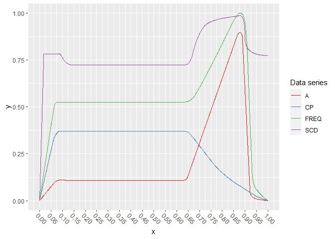
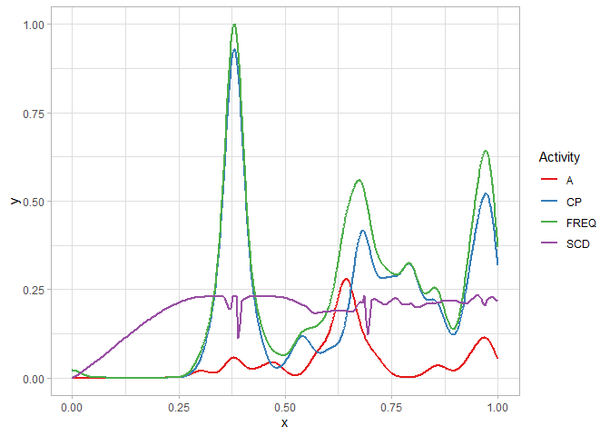
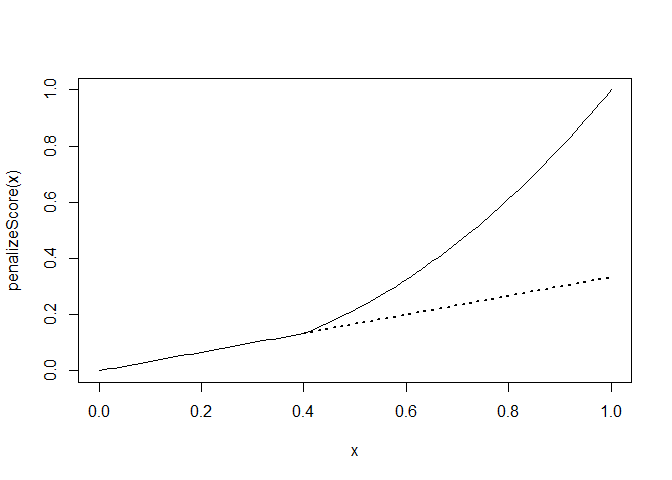

-   [Importing the pattern from file](#importing-the-pattern-from-file)
-   [Defining Intervals and
    sub-models](#defining-intervals-and-sub-models)
    -   [Extracting all sub-patterns](#extracting-all-sub-patterns)
    -   [Events and Metrics](#events-and-metrics)
-   [Load real-world project](#load-real-world-project)
    -   [Add Source Code density](#add-source-code-density)
    -   [The Final project](#the-final-project)
-   [Defining the objective function](#defining-the-objective-function)
    -   [Scoring per variable and
        interval](#scoring-per-variable-and-interval)
    -   [Score weights and aggregation](#score-weights-and-aggregation)
    -   [Selecting sub-models for each
        variable](#selecting-sub-models-for-each-variable)
-   [References](#references)

    source("../helpers.R", echo = FALSE)
    source("./common-funcs.R", echo = FALSE)

Importing the pattern from file
===============================

We have previously designed our initial best guess as a vector graphic,
and then rasterized it and exported each path with x/y coordinates in
CSV. There are a few caveats:

-   Not all paths have the same length – this is due to the amount of
    detail of each path. However, the x/y coordinates of each path cover
    the same co-domain.
-   The SVG coordinate system starts with 0,0 in the top left corner, so
    y-values should be flipped.
-   The pattern is hence not in the unit square, and neither do we want
    to present it there as of now. However, we will scale its y-values
    into `[0,1]` and preserve its aspect ratio, so that we can define
    the intervals in the next step more easily.
-   The paths in the modeled SVG have color names: Gold is adaptive,
    green is corrective+perfective, indigo is the commit frequency, and
    coral is the source code density.

<!-- -->

    # scd is source code density
    fd_data <- read.csv("../data/Fire-Drill_first-best-guess.csv", sep = ";")
    fd_data <- list(
      adaptive = stats::na.exclude(data.frame(
        x = fd_data$gold_x,
        y = fd_data$gold_y,
        t = "A"
      )),
      
      corrPerf = stats::na.exclude(data.frame(
        x = fd_data$green_x,
        y = fd_data$green_y,
        t = "CP"
      )),
      
      commFreq = stats::na.exclude(data.frame(
        x = fd_data$indigo_x,
        y = fd_data$indigo_y,
        t = "FREQ"
      )),
      
      codeDens = stats::na.exclude(data.frame(
        x = fd_data$coral_x,
        y = fd_data$coral_y,
        t = "SCD"
      ))
    )

    fd_data_concat <- rbind(
      fd_data$adaptive,
      fd_data$corrPerf,
      fd_data$commFreq,
      fd_data$codeDens
    )

    fd_data_concat$t <- factor(fd_data_concat$t, levels = unique(fd_data_concat$t), ordered = TRUE)

    # Also, let's already correct the x-axis a bit:
    fd_data_concat$x <- fd_data_concat$x - min(fd_data_concat$x)
    fd_data_concat$x <- fd_data_concat$x / max(fd_data_concat$x)

    # .. and since we're at it, let's do y:
    fd_data_concat$y <- -1 * fd_data_concat$y - min(-1 * fd_data_concat$y)
    fd_data_concat$y <- fd_data_concat$y / max(fd_data_concat$y)

Let’s plot the original data (note that we take the negative y-values to
conform to our coordinate system where `[0,0]` is in the **lower** right
corner):

    library(ggplot2)

    ggplot(data = fd_data_concat, aes(x = x, y = y, color = t)) +
      geom_line() +
      labs(color = "Data series") +
      scale_x_continuous(
        breaks = seq(0, 1, by = .05)
      ) +
      theme(axis.text.x = element_text(angle = -45, vjust = 0)) +
      scale_color_brewer(palette = "Set1")

Now the pattern is already in the unit-square (`[0,1]`). This is OK, as
some variables in the pattern are defined to reach their absolute
minimum or maximum. The other variables are designed relative to it,
resulting in some space above or below.

Defining Intervals and sub-models
=================================

In this section, we define the intervals’ boundaries and decide for
models to use for each variable in each interval. **The boundaries are
our primary optimization goal**, as we want to minimize the loss of the
models fit over the variables in between. We will defined initial
boundaries, as well as valid ranges for them, according to the
literature. As of our discussions and current definition, we define the
four phases:

1.  Begin – Short project warm-up phase
2.  Long Stretch – The longest phase in the project, about which we do
    not know much about, except for that there should be a rather
    constant amount of activities over time.
3.  Fire Drill – Characteristic is a sudden and steep increase of
    adaptive activities. This phase is over once these activities
    reached their apex.
4.  Aftermath – Everything after the apex. We should see even steeper
    declines.

Brown et al. (1998) describe a typical scenario where about six months
are spent on non-developmental activities, and the actual software is
then developed in less than four weeks. If we were to include some of
the aftermath, the above first guess would describe a project of about
eight weeks.

We define the boundaries and their leeway as follows (there are three
boundaries to split the pattern into four intervals):

-   `b1` – start at 0.085 and allow ranges of `[0.025, 0.25]`
-   `b2` – start at 0.625 and allow ranges of `[0.5, 0.9]`
-   `b3` – start at 0.875 and allow ranges of `[0.5, 0.975]`

Also, we need to define additional inequality constraints between the
boundaries, so that we guarantee a minimum distance between boundaries.
In general, we only want to impose the rather loose constraint of having
at least `0.05` between any two boundaries. While `b1` and `b2` cannot
cross and can never undercut this threshold, `b2` and `b3` can. The
inequality constraint hence is `b3 - b2 >= 0.05`.

The following plot includes the initial boundaries and their allowed
ranges:

    ggplot(data = fd_data_concat, aes(x = x, y = y, color = t)) +
      geom_line() +
      labs(color = "Data series") +
      scale_x_continuous(
        breaks = seq(0, 1, by = .05)
      ) +
      theme_light() +
      theme(axis.text.x = element_text(angle = -45, vjust = 0)) +
      geom_vline(xintercept = fd_data_boundaries["b1"], color = "blue", size = .5) +
      geom_vline(xintercept = fd_data_boundaries["b2"], color = "blue", size = .5) +
      geom_vline(xintercept = fd_data_boundaries["b3"], color = "blue", size = .5) +
      geom_rect(data = data.frame(
        xmin = c(.025, .5, .5),
        xmax = c(.25, .9, .975),
        ymin = c(0, .05, 0),
        ymax = c(1, .95, 1),
        boundary = c("b1", "b2", "b3"),
        fill = c("green", "red", "blue")
      ), aes(xmin = xmin, xmax = xmax, ymin = ymin, ymax = ymax, fill = fill), color = "black", alpha = .25, inherit.aes = FALSE, show.legend = FALSE) +
      scale_color_brewer(palette = "Set1")

Extracting all sub-patterns
---------------------------

The last step is to update the concatenated data and attach a factor
column with the interval:

    fd_data_concat$interval <- sapply(fd_data_concat$x, function(x) {
      if (x < fd_data_boundaries["b1"]) {
        return("Begin")
      } else if (x < fd_data_boundaries["b2"]) {
        return("LongStretch")
      } else if (x < fd_data_boundaries["b3"]) {
        return("FireDrill")
      }
      return("Aftermath")
    })

    fd_data_concat$interval <- factor(
      x = fd_data_concat$interval,
      levels = c("Begin", "LongStretch", "FireDrill", "Aftermath"), ordered = TRUE)

Now show a faceted plot:

    ggplot(data = fd_data_concat, aes(x = x, y = y, color = t)) +
      geom_line(size = 1) +
      labs(color = "Data series") +
      scale_x_continuous(
        breaks = seq(0, 1, by = .1)
      ) +
      facet_grid(t ~ interval, scales = "free_x") +
      scale_color_brewer(palette = "Set1")

Note that in the above plot, every column of plots has the same width.
However, this becomes obvious when looking at the x-axis for each
column. While we could adjust the widths to the actual interval lengths,
we keep it like this for two reasons: first, it allows us better insight
into shorter intervals. Second, models that do transformation into the
unit-square will “see” the pattern very similar to how it looks above.

The split was made according to the initial boundaries. What is
important to remember, is that each sub-plot in the above grid **is a
reference pattern**, that is, each of these above represents the
reference we want to fit the data (the query extracted according to the
boundaries given during the optimization) against using some model
later.

Events and Metrics
------------------

We need to make an important distinction between events and metrics. An
event does not carry other information, other than that it occurred. One
could thus say that such an event is *nulli*-variate. If an event were
to carry extra information, such as a measurement that was taken, it
would be *uni*-variate. That is the case for many metrics in software:
the time of their measurement coincides with an event, such as a commit
that was made. On the time-axis we thus know **when** it occurred and
**what** was its value. Such a metric could be easily understood as a
*bi-variate x/y* variable and be plotted.

An event however does not have any associated y-value we could plot.
Given a time-axis, we could make a mark whenever it occurred. Some of
the markers would probably be closer to each other or be more or less
accumulated. The y-value could express these accumulations relative to
each other. These are called **densities**. This is exactly what *Kernel
Density Estimation* (KDE) does: it expresses the relative accumulations
of data on the x-axis as density on the y-axis. For KDE, the actual
values on the x-axis have another meaning, and that is to compare the
relative likelihoods of the values on it, since the axis is ordered. For
our case however, the axis is linear time and carries no such meaning.

The project data we analyze is a kind of sampling over the project’s
events. We subdivide the gathered project data hence into these two
types of data series:

-   **Events**: They do not carry any extra information or measurements.
    As for the projects we analyze, events usually are occurrences of
    specific types of commits, for example. The time of occurrence is
    the x-value on the time-axis, and the y-value is obtained through
    KDE.
-   **Metrics**: Extracted from the project at specific times, for
    example at every commit. We can extract any number or type of
    metric, but each becomes its own variable, where the x-value is on
    the time-axis, and the y-value is the metric’s value.

Load real-world project
=======================

We load the same project as in the notebook `student-project-1.Rmd`.

    spFile <- "../data/student-project-1.csv"
    sp <- read.csv(spFile)

    dateFormat <- "%Y-%m-%d %H:%M:%S"

    sp$CommitterTimeObj <- as.POSIXct(strptime(
      sp$CommitterTime, format = dateFormat))
    sp$AuthorTimeObj <- as.POSIXct(strptime(
      sp$AuthorTime, format = dateFormat))

    # Cut off data way after project end:
    sp <- sp[sp$AuthorTimeObj <= as.POSIXct(strptime("2020-08-31", format = "%Y-%m-%d")), ]

    # Create normalized timestamps:
    sp$AuthorTimeNormalized <- sp$AuthorTimeUnixEpochSecs - min(sp$AuthorTimeUnixEpochSecs)
    sp$AuthorTimeNormalized <- sp$AuthorTimeNormalized / max(sp$AuthorTimeNormalized)

Now we define each variable as a function:

    # passed to stats::density
    use_kernel <- "gauss" # "rect"

    # We'll need these for the densities:
    acp_ratios <- table(sp$label) / sum(table(sp$label))

    dens_a <- densitySafe(
      sp[sp$label == "a", ]$AuthorTimeNormalized, acp_ratios[["a"]], kernel = use_kernel)
    dens_c <- densitySafe(
      sp[sp$label == "c", ]$AuthorTimeNormalized, acp_ratios[["c"]], kernel = use_kernel)
    dens_p <- densitySafe(
      sp[sp$label == "p", ]$AuthorTimeNormalized, acp_ratios[["p"]], kernel = use_kernel)

    # Also compute a combined density for corr+perf:
    dens_cp <- densitySafe(
      sp[sp$label == "c" | sp$label == "p", ]$AuthorTimeNormalized,
      acp_ratios[["c"]] + acp_ratios[["p"]], kernel = use_kernel)
    # .. and the overall frequency:
    dens_acp <- densitySafe(
      sp$AuthorTimeNormalized, kernel = use_kernel)

    use_acp_attr <- c("min", "max", "ratio", "ymax")
    acp_attr <- rbind(
      data.frame(attributes(dens_a)[use_acp_attr]),
      data.frame(attributes(dens_c)[use_acp_attr]),
      data.frame(attributes(dens_p)[use_acp_attr]))

Add Source Code density
-----------------------

The source code density is a different kind of variable. Like any other
metric, its sampling frequency has no effect on the density, but rather
its value. Sampling more frequently will only increase precision. So
while we estimated a Kernel for the activities, for all other variables
that are metrics, the density (or curve) depends on the observed value,
not on the frequency of observations.

    dens_scd_data <- data.frame(
      x = sp$AuthorTimeNormalized,
      y = sp$Density
    )

    # We want to smooth the density data a little:
    temp <- stats::loess.smooth(
      x = dens_scd_data$x, y = dens_scd_data$y, span = .07, family = "sym", degree = 1, evaluation = nrow(dens_scd_data))
    dens_scd_data$x <- temp$x
    dens_scd_data$y <- temp$y - min(temp$y)
    dens_scd_data$y <- dens_scd_data$y / max(dens_scd_data$y)

    dens_scd <- (function() {
      r <- range(dens_scd_data$x)
      temp <- stats::approxfun(x = dens_scd_data$x, y = dens_scd_data$y, ties = "ordered")
      f1 <- Vectorize(function(x) {
        if (x < r[1] || x > r[2]) {
          return(NaN)
        }
        return(temp(x))
      })
      
      attributes(f1) <- list(
        min = r[1], max = r[2], x = dens_scd_data$x, y = dens_scd_data$y
      )
      
      f1
    })()

This is how the project looks. Please note that we have already cut off
all activity after August 31 2020.

    ggplot(data.frame(x = range(acp_attr$min, acp_attr$max)), aes(x)) +
      stat_function(fun = dens_a, aes(color="A"), size = 1, n = 2^11) +
      #stat_function(fun = dens_c, aes(color="C"), size = 1, n = 2^11) +
      #stat_function(fun = dens_p, aes(color="P"), size = 1, n = 2^11) +
      stat_function(fun = dens_cp, aes(color="CP"), size = 1, n = 2^11) +
      stat_function(fun = dens_acp, aes(color="FREQ"), size = 1, n = 2^11) +
      stat_function(fun = dens_scd, aes(color="SCD"), size = 1, n = 2^11) +
      theme_light() +
      labs(color = "Activity") +
      scale_color_brewer(palette = "Set1")

    ## Warning: Removed 284 row(s) containing missing values (geom_path).

In the above plot, it appears that the initial perfective activities (in
the approximate range of `[~-0..5, 0.2]`) may or may not belong to the
project’s actual work range. For example, it seems plausible that the
project manager made some initial commit(s) with directions for the
students. In a real-world analysis, one would need to decide whether to
cut this off or not, based on the knowledge of what was going on. We
allow the remainder of this notebook to make the switch using a
variable. This will allow us to examine model-fits under different
configurations.

*Note*: As of our suspicion, the very first commit is not the project’s
start, and the right decision for this project would to cut it off.

    # Use this obvious variable to control cutting off initial perfective commits.
    CUT_OFF_PERFECTIVE_COMMITS_IN_BEGIN <- TRUE

    dens_acp_x_min <- min(acp_attr$min)
    if (CUT_OFF_PERFECTIVE_COMMITS_IN_BEGIN) {
      dens_acp_x_min <- min(acp_attr[1:2,]$min) # 1:2 are a,c; see above
    }
    dens_acp_x_max <- max(acp_attr$max) # we're not cutting off at end

    dens_a_x_idx <- attributes(dens_a)$x >= dens_acp_x_min
    dens_c_x_idx <- attributes(dens_c)$x >= dens_acp_x_min
    dens_p_x_idx <- attributes(dens_p)$x >= dens_acp_x_min
    dens_cp_x_idx <- attributes(dens_cp)$x >= dens_acp_x_min
    dens_scd_x_idx <- attributes(dens_scd)$x >= dens_acp_x_min
    dens_acp_x_idx <- attributes(dens_acp)$x >= dens_acp_x_min

    dens_acp_data <- rbind(
      data.frame(
        x = attributes(dens_a)$x[dens_a_x_idx],
        y = attributes(dens_a)$y[dens_a_x_idx] * attributes(dens_a)$ratio,
        t = rep("A", sum(dens_a_x_idx))
      ),
    #  data.frame(
    #    x = attributes(dens_c)$x[dens_c_x_idx],
    #    y = attributes(dens_c)$y[dens_c_x_idx] * attributes(dens_c)$ratio,
    #    t = rep("C", sum(dens_c_x_idx))
    #  ),
    #  data.frame(
    #    x = attributes(dens_p)$x[dens_p_x_idx],
    #    y = attributes(dens_p)$y[dens_p_x_idx] * attributes(dens_p)$ratio,
    #    t = rep("P", sum(dens_p_x_idx))
    #  ),
      data.frame(
        x = attributes(dens_cp)$x[dens_cp_x_idx],
        y = attributes(dens_cp)$y[dens_cp_x_idx] * attributes(dens_cp)$ratio,
        t = rep("CP", sum(dens_cp_x_idx))
      ),
      data.frame(
        x = attributes(dens_acp)$x[dens_acp_x_idx],
        y = attributes(dens_acp)$y[dens_acp_x_idx],
        t = rep("FREQ", sum(dens_acp_x_idx))
      ),
      data.frame(
        x = attributes(dens_scd)$x[dens_scd_x_idx],
        y = attributes(dens_scd)$y[dens_scd_x_idx],
        t = rep("SCD", sum(dens_scd_x_idx))
      )
    )
    dens_acp_data$t <- factor(x = dens_acp_data$t, levels = unique(dens_acp_data$t), ordered = TRUE)

    # Now it is important to scale the densities for a,c,p on the x-axis together,
    # so that we get all three within [0,1].
    dens_acp_data$x <- dens_acp_data$x - min(dens_acp_data$x)
    dens_acp_data$x <- dens_acp_data$x / max(dens_acp_data$x)

The Final project
-----------------

Let’s plot how that looks:

    ggplot(dens_acp_data, aes(x = x, y = y)) +
      geom_line(aes(color = t), size = .75) +
      theme_light() +
      labs(color = "Activity") +
      scale_color_brewer(palette = "Set1")

The above plot represents now the final project that we will fit our
entire pattern to:

-   The domain is now `[0,1]` – note that the source code density was
    not estimated using KDE, so that we do not have an estimation for
    the bandwidth, which leads to initial inclines and declines at the
    end for such variables.
-   The integral of the frequency is roughly `1` – the sum of the three
    integrals for each of the three activities is also `1`. It is
    important that each activity has a density that is proportional to
    the amount of the other activities, and that in sum everything
    should become `1` again.

Defining the objective function
===============================

Now we can finally start to define an objective function. Before that,
we need to decide how to score each variable (i.e., what kind of model)
in each interval. For each step of the fitting process, we will get a
vector of scores that needs to be aggregated.

Scoring per variable and interval
---------------------------------

We want to choose an adequate model for each variable in each interval,
and then optimize the boundaries to maximize the fit of each model.

A model consists of two stages. First, any signal transformations are
formulated. We have a reference- (**A**) and query-signal (**B**). These
transformations could be, e.g., smoothing the query-signal, fitting a
polynomial to it, applying DTW to rectify it etc. While some
transformations are applied only to the query-signal, some are applied
to the reference signal, and some can be applied to both (e.g., taking
the `ecdf()` of either signal). Furthermore, a model may choose to
output an entire new function in this step, such as the DTW’s warping
function. Lastly, it is also possible not to apply any transformations.
While less robust for further processing due to the assumption of
linearly-scaled time, this is computationally much less costly while
also giving acceptable results.

The second stage of a model is the definition of what is scored, and
how. Depending on the output of the first stage, there are a large
number of options. Usually the output is a pair of functions for which
we have implemented plenty of measures that can quantify the
differences. It may also be the case that we can directly extract final
values or coefficients after the first stage, e.g., information about
linear models. The first stage can also loop, meaning that arbitrary
many transformation in series and of different kind are possible.

The two stages were joined together and are represented in this image,
the “Metrics Pipeline”:

Now it is apparent that we almost have infinitely many choices on how to
compose a model for a variable in an interval. It would probably be
worth conduction a larger-scale experiment with extensive grid-searches
to find what works best under which circumstances. However, not only
does this extend way beyond the purpose of this work and should be moved
into the other, more technical paper. It also would cost too much time
now, and during some of the earlier tests we have already observed a few
things that appeared to work well. We hence limit ourselves to choosing
one of the below, pre-configured models.

These are:

**No Score**: If there is no or nearly no information available for a
variable in an interval, we should choose not to score it.

**Linear Model**: A linear model (regression) can be used for when we do
not know much about the course of a variable in an interval. We use this
model when our best expectation is a linear course of the variable, and
that is what we extract from the model (stage 1). We may have an
expectation for the intercept, slope or the residuals (stage 2). When
using this model, we usually choose a lower weight for it. Of course, we
could compare functions, too, but using the mentioned parameters of the
LM is more straightforward here.

**Rectifier**: A model to match shapes of curves, that uses *DTW* to
**rectify** a signal and then computes the goodness-of-fit using one or
more of the previously developed scores. Also, the best results were
obtained by scoring the differences of the two signals *and* the
warping-curve (stage 1). We should probably use a combination of some of
the low-level metrics (e.g., correlation, area, arc-length, .., etc.),
or one of the mid-level metrics (e.g., JSD or MI) that capture more than
one property (stage 2). This is the most sophisticated method we
currently have. The underlying DTW is computed with either closed or
open begin/end. In the later case, the score of the rectifier model also
reflects how much of the query was matched.

**No Model** (approximate function): We can choose to just extract the
data from the current interval, to approximate a function for its data,
and then compute a score in the same way the Rectifier does, by
comparing two functions. Skipping the rectification seems to work well
in most cases; however, we assume that the data from the interval has
linear time and no time dilations exist.

**Polynomial**: Similar to **No Model**, we fit a 2nd- or 3rd-order
polynomial (or we may use the new function `poly_autofit()` to find the
best model) over the data (currently, 3rd order should suffice given the
peculiarities of our defined Fire Drill) and then compare the resulting
function against the reference. Again, this approach assumes no
distortions in time.

<table>
<colgroup>
<col style="width: 7%" />
<col style="width: 7%" />
<col style="width: 19%" />
<col style="width: 11%" />
<col style="width: 53%" />
</colgroup>
<thead>
<tr class="header">
<th style="text-align: left;">Interval</th>
<th style="text-align: left;">Variable</th>
<th style="text-align: left;">Model</th>
<th style="text-align: center;">Weight</th>
<th style="text-align: left;">Model notes</th>
</tr>
</thead>
<tbody>
<tr class="odd">
<td style="text-align: left;">Begin</td>
<td style="text-align: left;">A</td>
<td style="text-align: left;">Rectifier, No Model, Poly(2)</td>
<td style="text-align: center;"><code>0.8</code></td>
<td style="text-align: left;">-</td>
</tr>
<tr class="even">
<td style="text-align: left;">Begin</td>
<td style="text-align: left;">C+P</td>
<td style="text-align: left;">Rectifier, No Model, Poly(2)</td>
<td style="text-align: center;"><code>0.8</code></td>
<td style="text-align: left;">-</td>
</tr>
<tr class="odd">
<td style="text-align: left;">Begin</td>
<td style="text-align: left;">FREQ</td>
<td style="text-align: left;">Rectifier, No Model, Poly(2)</td>
<td style="text-align: center;"><code>0.8</code></td>
<td style="text-align: left;">-</td>
</tr>
<tr class="even">
<td style="text-align: left;">Begin</td>
<td style="text-align: left;">SCD</td>
<td style="text-align: left;">Rectifier, No Model, Poly(2)</td>
<td style="text-align: center;"><code>0.8</code></td>
<td style="text-align: left;">-</td>
</tr>
<tr class="odd">
<td style="text-align: left;">———</td>
<td style="text-align: left;">———–</td>
<td style="text-align: left;">————————-</td>
<td style="text-align: center;">——–</td>
<td style="text-align: left;">—————————————————-</td>
</tr>
<tr class="even">
<td style="text-align: left;">Long Stretch</td>
<td style="text-align: left;">A</td>
<td style="text-align: left;">No Score, LM (𝔼 [0∘])</td>
<td style="text-align: center;"><code>0.5</code></td>
<td style="text-align: left;">-</td>
</tr>
<tr class="odd">
<td style="text-align: left;">Long Stretch</td>
<td style="text-align: left;">C+P</td>
<td style="text-align: left;">No Score, LM (𝔼 [0∘])</td>
<td style="text-align: center;"><code>0.5</code></td>
<td style="text-align: left;">-</td>
</tr>
<tr class="even">
<td style="text-align: left;">Long Stretch</td>
<td style="text-align: left;">FREQ</td>
<td style="text-align: left;">No Score, LM (𝔼 [0∘])</td>
<td style="text-align: center;"><code>0.5</code></td>
<td style="text-align: left;">-</td>
</tr>
<tr class="odd">
<td style="text-align: left;">Long Stretch</td>
<td style="text-align: left;">SCD</td>
<td style="text-align: left;">No Score, LM (𝔼 [slope &lt; 0∘]), Rectifier, No Model, Poly(2)</td>
<td style="text-align: center;"><code>0.5</code></td>
<td style="text-align: left;">Use of non-LM may be applicable, considering the somewhat smooth decline in the beginning of this phase.</td>
</tr>
<tr class="even">
<td style="text-align: left;">———</td>
<td style="text-align: left;">———–</td>
<td style="text-align: left;">————————-</td>
<td style="text-align: center;">——–</td>
<td style="text-align: left;">—————————————————-</td>
</tr>
<tr class="odd">
<td style="text-align: left;">Fire Drill</td>
<td style="text-align: left;">A</td>
<td style="text-align: left;">LM (𝔼 [slope ≥ 45∘]), Rectifier, No Model, Poly(3)</td>
<td style="text-align: center;"><code>1.0</code></td>
<td style="text-align: left;">LM may be applicable as we know nothing about <em>how</em> the variable rises, just that it will. It is however the least-preferred option. Usage of LM is probably a bit sketchy, as we need to make assumptions about its slope.</td>
</tr>
<tr class="even">
<td style="text-align: left;">Fire Drill</td>
<td style="text-align: left;">C+P</td>
<td style="text-align: left;">LM (𝔼 [slope ≈  − 45∘]), Rectifier, No Model, Poly(3)</td>
<td style="text-align: center;"><code>1.0</code></td>
<td style="text-align: left;">Like adaptive (A), an LM may be worth checking out, as this variable is almost linear in our model. Also, when using an LM for any variable in this interval, we should use a smaller weight.</td>
</tr>
<tr class="odd">
<td style="text-align: left;">Fire Drill</td>
<td style="text-align: left;">FREQ</td>
<td style="text-align: left;">LM (𝔼 [slope ≥ 45∘]), Rectifier, No Model, Poly(3)</td>
<td style="text-align: center;"><code>1.0</code></td>
<td style="text-align: left;">Like the previous two.</td>
</tr>
<tr class="even">
<td style="text-align: left;">Fire Drill</td>
<td style="text-align: left;">S</td>
<td style="text-align: left;">Rectifier, No Model, Poly(3)</td>
<td style="text-align: center;"><code>1.0</code></td>
<td style="text-align: left;">-</td>
</tr>
<tr class="odd">
<td style="text-align: left;">———</td>
<td style="text-align: left;">———–</td>
<td style="text-align: left;">————————-</td>
<td style="text-align: center;">——–</td>
<td style="text-align: left;">—————————————————-</td>
</tr>
<tr class="even">
<td style="text-align: left;">Aftermath</td>
<td style="text-align: left;">A</td>
<td style="text-align: left;">Rectifier, No Model, Poly(3)</td>
<td style="text-align: center;"><code>1.0</code></td>
<td style="text-align: left;">-</td>
</tr>
<tr class="odd">
<td style="text-align: left;">Aftermath</td>
<td style="text-align: left;">C+P</td>
<td style="text-align: left;">LM (𝔼 [slope ≈  − 45∘]), Rectifier, No Model, Poly(3)</td>
<td style="text-align: center;"><code>1.0</code></td>
<td style="text-align: left;">This is basically a slightly less steep continuation of the previous interval</td>
</tr>
<tr class="even">
<td style="text-align: left;">Aftermath</td>
<td style="text-align: left;">FREQ</td>
<td style="text-align: left;">Rectifier, No Model, Poly(3)</td>
<td style="text-align: center;"><code>1.0</code></td>
<td style="text-align: left;">-</td>
</tr>
<tr class="odd">
<td style="text-align: left;">Aftermath</td>
<td style="text-align: left;">SCD</td>
<td style="text-align: left;">Rectifier, No Model, Poly(3)</td>
<td style="text-align: center;"><code>1.0</code></td>
<td style="text-align: left;">-</td>
</tr>
</tbody>
</table>

Notes:

-   If not noted otherwise, when using an LM, we expect a slope of `0`,
    and any (positive or negative) slope will decrease the score.
-   When using an LM, we currently do not score the residuals, as we
    cannot make assumptions about how the data is distributed in an
    interval. If we were to score lower residuals better, then the LM
    would fit towards data with less noise better, but we do not know
    anything about the noise. That’s why we skip it.
-   I do not see a reason for mixing non-linear models within the entire
    model, i.e., all variables that use a non-linear model should use
    the same kind of model, otherwise it will be also more difficult to
    compare approaches.
    -   The only thing we can compare is whether all non-linear models
        converge to the same interval boundaries. Different models will
        result in different scores, so there is no way to say which
        model is best, at least not until we have all the ground truth.
        Until then the only conclusions we may draw are those from
        models that result in obviously erroneous fits.

Score weights and aggregation
-----------------------------

Given a weight-vector **w** and a score-vector **s** of same length, we
want to aggregate all scores using this expression:

$$
\\displaystyle \\prod^{\\Vert \\boldsymbol s \\Vert}\_{i=1}1+ \\boldsymbol w\_i \* f\_{t,k}(\\boldsymbol s\_i),\\;\\; \\forall \\boldsymbol w\_i \\; 0 &lt; \\boldsymbol w\_i \\leq 1 \\; \\wedge \\; \\forall \\boldsymbol s\_i \\; 0 \\leq \\boldsymbol s\_i \\leq 1,
$$

where *f**t*, *k* : â„ → ℠is a non-linear scaling function
(see below). The advantages of the above expression are these:

-   We can introduce weights to linearly scale each score and thus alter
    its importance.
-   Instead of diminishing the product, low scores will rather not
    increase it.
-   We know the lower and upper bound (remember, scores are in range
    `[0,1]`) for this expression.

Furthermore, we want to use a non-linear scaling function,
*f**t*, *k*, that penalizes low scores and exponentially
rewards higher scores. That function will be linear until some threshold
*t* (typically 0.1 ≤ *t* ≤ 0.5), and exponential afterwards (with
typical exponent 2 ≤ *k* ≤ 5).

$$
f\_{t,k}(x) = \\begin{cases}
  x \* t^{k-1}, & \\text{for } 0 \\leq x \\leq t, \\\\
  x^k, & \\text{for } x &gt; t.
\\end{cases}
$$

Penalize small scores:

    # I suppose that ideally the threshold should be the median
    # of the scores one wants to penalize.
    penalizeThreshold <- .4
    penalizeExponent <- 2.2

    penalizeScore <- (function(t, k) {
      return(Vectorize(function(x) {
        if (x <= t) x * t^(k - 1) else x^k
      }))
    })(penalizeThreshold, penalizeExponent)

    round(penalizeScore(c(.4,.5,.6,.7,.8,.9)), 3)

    ## [1] 0.133 0.218 0.325 0.456 0.612 0.793

    curve(penalizeScore)
    tempf <- function(x) x * penalizeThreshold^(penalizeExponent - 1)
    curve(tempf, from = penalizeThreshold, add = TRUE, type = "l", lty = "dotted", lwd = 2.5)

Selecting sub-models for each variable
--------------------------------------

Now we are ready to select a sub-model for each variable in each
interval. Note that all sub-models, as well as the objective function
are defined in the file `models.R`.

Let’s make the list and create the Fire Drill model!

    source("../models/models.R", echo = FALSE)

    listOfSubModels <- list(
      A_Begin = sub_model_no_model,
      A_LongStretch = sub_model_no_model,
      A_FireDrill = sub_model_no_model,
      A_Aftermath = sub_model_no_model
    )

    subModelWeights <- c(
        "A_Begin" = 1,
        "A_LongStretch" = 1,
        "A_FireDrill" = 1,
        "A_Aftermath" = 1
      )

    fdm <- create_fire_drill_model(
      fireDrillPattern = fd_data_concat,
      fireDrillProject = dens_acp_data,
      listOfSubModels = listOfSubModels,
      subModelWeights = subModelWeights
    )

    # Upper bound would be:
    prod(1 + subModelWeights)

    ## [1] 16

    # and a dummy-test!
    temp <- fdm(c(.3, .38, .85), returnAllScores = TRUE)

    ## Warning: executing %dopar% sequentially: no parallel backend registered

    ## Loading required package: proxy

    ## 
    ## Attaching package: 'proxy'

    ## The following objects are masked from 'package:stats':
    ## 
    ##     as.dist, dist

    ## The following object is masked from 'package:base':
    ## 
    ##     as.matrix

    ## Loaded dtw v1.22-3. See ?dtw for help, citation("dtw") for use in publication.

    ## 
    ## Attaching package: 'pracma'

    ## The following objects are masked from 'package:numDeriv':
    ## 
    ##     grad, hessian, jacobian

    ## 
    ## Attaching package: 'rootSolve'

    ## The following objects are masked from 'package:pracma':
    ## 
    ##     gradient, hessian

    ## The following object is masked from 'package:numDeriv':
    ## 
    ##     hessian

    ## Warning: package 'SimilarityMeasures' was built under R version 4.0.3

    temp

    ##       A_Begin A_LongStretch   A_FireDrill   A_Aftermath 
    ##      1.289821      1.513252      1.257024      1.367831

    prod(temp)

    ## [1] 3.355957

    prod(temp) / prod(1 + subModelWeights) # relative score in [0,1]

    ## [1] 0.2097473

References
==========

Brown, William J, Raphael C Malveau, Hays W McCormick III, and Thomas J
Mowbray. 1998. “Refactoring Software, Architectures, and Projects in
Crisis.” John Wiley; Sons, Inc, Canada.
