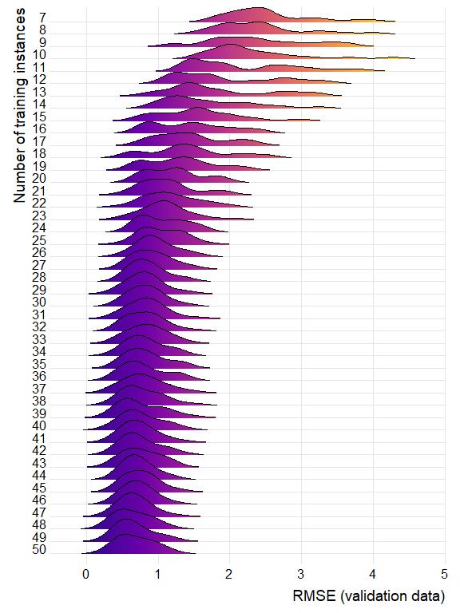

- <a href="#introduction" id="toc-introduction">Introduction</a>
- <a href="#overview-of-the-approach"
  id="toc-overview-of-the-approach">Overview of the Approach</a>
- <a href="#slight-adaption-of-the-source-code-pattern"
  id="toc-slight-adaption-of-the-source-code-pattern">Slight Adaption of
  the Source Code Pattern</a>
  - <a href="#modeling-a-cp-and-freq"
    id="toc-modeling-a-cp-and-freq">Modeling <code>A</code>,
    <code>CP</code>, and <code>FREQ</code></a>
  - <a href="#modeling-scd" id="toc-modeling-scd">Modeling
    <code>SCD</code></a>
  - <a href="#importing-the-raw-svg-points"
    id="toc-importing-the-raw-svg-points">Importing the Raw SVG Points</a>
- <a href="#importing-and-preparing-the-data"
  id="toc-importing-and-preparing-the-data">Importing and preparing the
  Data</a>
  - <a href="#load-the-ground-truth" id="toc-load-the-ground-truth">Load the
    Ground Truth</a>
  - <a href="#importing-the-issue-tracking-pattern"
    id="toc-importing-the-issue-tracking-pattern">Importing the
    Issue-Tracking Pattern</a>
  - <a href="#importing-the-project-data-for-source-code"
    id="toc-importing-the-project-data-for-source-code">Importing the
    Project Data for Source Code</a>
  - <a href="#importing-the-project-data-for-issue-tracking"
    id="toc-importing-the-project-data-for-issue-tracking">Importing the
    Project Data for Issue-tracking</a>
- <a href="#creating-the-datasets" id="toc-creating-the-datasets">Creating
  the Datasets</a>
  - <a href="#function-for-computing-a-distance"
    id="toc-function-for-computing-a-distance">Function for computing a
    Distance</a>
  - <a href="#create-datasets-for-source-code"
    id="toc-create-datasets-for-source-code">Create Datasets for Source
    Code</a>
  - <a href="#create-dataset-for-issue-tracking"
    id="toc-create-dataset-for-issue-tracking">Create Dataset for
    Issue-tracking</a>
- <a href="#adaptive-training-for-robust-regression-models"
  id="toc-adaptive-training-for-robust-regression-models">Adaptive
  Training For Robust Regression Models</a>
  - <a href="#preparation-of-the-datasets"
    id="toc-preparation-of-the-datasets">Preparation of the Datasets</a>
  - <a href="#adaptive-training" id="toc-adaptive-training">Adaptive
    Training</a>
  - <a href="#analysis" id="toc-analysis">Analysis</a>
    - <a href="#pca-vs.-non-pca" id="toc-pca-vs.-non-pca">PCA vs. non-PCA</a>
- <a href="#variable-importance-for-assessing-the-pattern"
  id="toc-variable-importance-for-assessing-the-pattern">Variable
  Importance for Assessing the Pattern</a>
  - <a href="#analysis-of-most-important-segments-metrics-activities-etc."
    id="toc-analysis-of-most-important-segments-metrics-activities-etc.">Analysis
    of most important Segments, Metrics, Activities, etc.</a>
- <a href="#pattern-less-detection"
  id="toc-pattern-less-detection">Pattern-less detection</a>
  - <a href="#create-dataset-for-source-code"
    id="toc-create-dataset-for-source-code">Create Dataset for Source
    Code</a>
  - <a href="#create-dataset-for-issue-tracking-1"
    id="toc-create-dataset-for-issue-tracking-1">Create Dataset for
    Issue-Tracking</a>
  - <a href="#oversampling" id="toc-oversampling">Oversampling</a>
  - <a href="#adaptive-training-1" id="toc-adaptive-training-1">Adaptive
    Training</a>
  - <a href="#pca-vs.-non-pca-1" id="toc-pca-vs.-non-pca-1">PCA
    vs. non-PCA</a>
  - <a href="#confidence-intervals" id="toc-confidence-intervals">Confidence
    Intervals</a>
  - <a href="#variable-importance" id="toc-variable-importance">Variable
    Importance</a>
- <a href="#references" id="toc-references">References</a>

# Introduction

This technical report was added in the eighth iteration of the
compilation. So far, we have developed an unsupervised approach for
properly scoring the presence of the anti-pattern. However, here we will
attempt to find a robust regression model in a supervised way. In other
words, the regression model to be found will be the surrogate scoring
mechanism. The challenge lies in the scarcity of our data, as it has
many more features than data points. It is therefore essential to obtain
a regression model that, even when trained on only few instances,
delivers a low generalization error.

All complementary data and results can be found at Zenodo (Hönel et al.
2022). This notebook was written in a way that it can be run without any
additional efforts to reproduce the outputs (using the pre-computed
results). This notebook has a canonical
URL<sup>[\[Link\]](https://github.com/MrShoenel/anti-pattern-models/blob/master/notebooks/fire-drill-issue-tracking-technical-report.Rmd)</sup>
and can be read online as a rendered
markdown<sup>[\[Link\]](https://github.com/MrShoenel/anti-pattern-models/blob/master/notebooks/fire-drill-issue-tracking-technical-report.md)</sup>
version. All code can be found in this repository, too.

# Overview of the Approach

We will be importing the two initial process models/patterns for the
Fire Drill anti-pattern in source code and issue-tracking data. These
patterns have four and three activities/metrics, respectively. Both,
patterns and projects, are formulated *continuously*, that is, as curves
over time. Also, both have been normalized along both, $x$- and $y$-axes
(having a domain/range of $[0,1]$).

As for the features, we will try two approaches. First we will sample
ten equidistantly-spaced points and compute the distance between these
points of the process model and a project. The second approach will
subdivide the time axis into ten equally long segments, of which we will
calculate the area between curves and the correlation.

Then, we will use a standard machine learning approach with repeated
cross-validation in order to find out whether the generalization error
on some holdout data will converge with increasing size of the training
set. We will attempt standard pre-processing, such as removing
(near-)zero variance features, highly correlated features, or
dimensionality reduction of the feature space.

# Slight Adaption of the Source Code Pattern

The pattern used for source code is slightly erroneous with regard to
how the source code density is modeled. It does not currently properly
account for how the Fire Drill is described. Also, we want to change the
pattern to use smooth CDFs for the maintenance activities, as the plan
is to only measure correlation and area between curves. Using CDFs has a
few advantages, such as no normalization and better suitability for the
chosen metrics. We will also change the `FREQ` activity and represent it
as a mixture of `A` and `CP`, such that all three densities become true
densities (integrating to $\approx1$).

## Modeling `A`, `CP`, and `FREQ`

The process for `A`, `CP`, and `FREQ` is the following (both, for the
pattern and projects):

- Rejection Sampling:
  - If pattern, sample from under the modeled curve.
  - If project, sample from the KDE of the activity’s curve.
- Estimate new KDE from these samples for `A` and `CP`.
- Compose a mixture density for `FREQ` as
  $f(x)=r_A f_A(x) + r_{CP} f_{CP}(x)$, where $r_a,r_{CP}$ correspond to
  the ratios of these activities.
- Perform rejection sampling from the three densities, using large
  sample sizes, so that we can obtain a smooth ECDF.

This process will leave us with three separate smooth ECDFs.

## Modeling `SCD`

The source code density can move quite unpredictably, such that it does
not make a lot of sense obtaining curves and measuring their
correlation. Instead, we will only look at the difference between the
pattern’s modeled density and that of each project. Therefore, we will
simply interpolate linearly between the projects’ commits.

As for the pattern, the curve will be smooth and needs to be redesigned.
Note that the Fire Drill description says the following: “only
analytical or documentational artefacts for a long time”. The current
pattern does not account for that. Instead, the current pattern pretty
much reduces all activities and the `SCD` during what we called the
“Long Stretch”. While we mostly stick with how the activities were
modeled, the `SCD`, however, requires a more accommodating redesign. It
should pick up pace almost immediately, followed by a slight increase
until the Fire Drill starts. Then, we should see a rapid increase that
peaks at $1$ and a normalization after the Fire Drill ends (go back to
previous level). We also modify the other activities and add a slight
slope to them, but these are rather cosmetic changes.

## Importing the Raw SVG Points

Please note that after sketching the SVG, we rasterize it to points
using a tool called “PathToPoints”[^1]. In the CSV, we will find four
different data series (attention: of different length), one
corresponding to each activity/metric. Since `FREQ` will be a mixture,
we are not modelling it explicitly.

Paths are associated with colors: Coral is `SCD`, Gold is `A`, and Green
is `CP`.

``` r
temp <- read.csv(file = "../data/Fire-Drill_second-guess.csv", header = TRUE, sep = ";")
assocs <- c(coral = "SCD", gold = "A", green = "CP")
assoc_inv <- names(assocs)
names(assoc_inv) <- unname(assocs)

# Y's are negative.
for (assoc in names(assocs)) {
  temp[, paste0(assoc, "_y")] <- -1 * temp[, paste0(assoc, "_y")]
}

# Next, we gotta normalize them all together, so we have to determine the
# y-extent.
y_ext <- range(c(temp$coral_y, temp$gold_y, temp$green_y), na.rm = TRUE)
for (assoc in names(assocs)) {
  temp[, paste0(assoc, "_y")] <- (temp[, paste0(assoc, "_y")] - y_ext[1])/(y_ext[2] -
    y_ext[1])
}
```

``` r
templ <- list()

for (assoc in names(assocs)) {
  data <- temp[, paste0(assoc, c("_x", "_y"))]
  data <- data[stats::complete.cases(data), ]
  tempf <- stats::approxfun(x = data[, paste0(assoc, "_x")], y = data[, paste0(assoc,
    "_y")], yleft = 0, yright = 0)
  # Let's sample from that function linearly
  use_y <- tempf(seq(from = min(data[, paste0(assoc, "_x")]), to = max(data[, paste0(assoc,
    "_x")]), length.out = 1000))
  templ[[assocs[assoc]]] <- stats::approxfun(x = seq(from = 0, to = 1, length.out = 1000),
    y = use_y, yleft = use_y[1], yright = use_y[2])
}
```

Now we have a list with with `A`, `CP`, and `SCD`. Next, we will do the
rejection sampling from the former two in order to create `FREQ`. As for
the mixture ratio, we will assume that the **adaptive activities make up
for $40$%** of all activities. So the mixture will be $0.4/0.6$.

``` r
use_x <- seq(from = 0, to = 1, length.out = 1e+07)


use_y <- stats::runif(n = length(use_x), min = 0, max = max(temp[[paste0(assoc_inv["A"],
  "_y")]], na.rm = TRUE))
tempdens_A <- stats::density(x = use_x[use_y <= templ$A(use_x)], bw = "SJ", cut = TRUE)
tempf_A <- stats::approxfun(x = tempdens_A$x, y = tempdens_A$y, yleft = 0, yright = 0)
tempecdf_A <- make_smooth_ecdf(values = use_x[use_y <= templ$A(use_x)], slope = 0,
  inverse = FALSE)

use_y <- stats::runif(n = length(use_x), min = 0, max = max(temp[[paste0(assoc_inv["CP"],
  "_y")]], na.rm = TRUE))
tempdens_CP <- stats::density(x = use_x[use_y <= templ$CP(use_x)], bw = "SJ", cut = TRUE)
tempf_CP <- stats::approxfun(x = tempdens_CP$x, y = tempdens_CP$y, yleft = 0, yright = 0)
tempecdf_CP <- make_smooth_ecdf(values = use_x[use_y <= templ$CP(use_x)], slope = 0,
  inverse = FALSE)

c(cubature::cubintegrate(f = tempf_A, 0, 1)$integral, cubature::cubintegrate(f = tempf_CP,
  0, 1)$integral)  # Those should be very close to 1
```

    ## [1] 1.000984 1.000840

``` r
pattern_sc <- list(SCD = templ$SCD, A = tempf_A, CP = tempf_CP, FREQ = function(x) 0.4 *
  tempf_A(x) + 0.6 * tempf_CP(x))

cubature::cubintegrate(f = pattern_sc$FREQ, 0, 1)$integral
```

    ## [1] 1.000897

``` r
# We'll need it in the next step.
use_y <- stats::runif(n = length(use_x), min = 0, max = -1.01 * nloptr::nloptr(x0 = 0.5,
  lb = 0, ub = 1, eval_f = function(x) -pattern_sc$FREQ(x), opts = list(algorithm = "NLOPT_GN_DIRECT_L_RAND",
    xtol_rel = 0.001, maxeval = 1e+05))$objective)
tempdens_FREQ <- stats::density(x = use_x[use_y <= pattern_sc$FREQ(use_x)], bw = "SJ",
  cut = TRUE)
tempf_FREQ <- stats::approxfun(x = tempdens_FREQ$x, y = tempdens_FREQ$y, yleft = 0,
  yright = 0)
tempecdf_FREQ <- make_smooth_ecdf(values = use_x[use_y <= pattern_sc$FREQ(use_x)],
  slope = 0, inverse = FALSE)

cubature::cubintegrate(f = tempf_FREQ, 0, 1)$integral
```

    ## [1] 1.000911

Now it’s time to print the new pattern for Source Code! Note that in
figure the curves for the variables `A`, `CP`, and `FREQ` are now all
proper probability densities (i.e., each of them integrates to $1$). The
variable `SCD` is not a density and peaks at $1$, because that is the
maximum value for the source code density (it is ratio, actually).


I have to admit this pattern looks quite nice. Let’s keep it and produce
an *additional* version using CDFs (we will keep and test both).

Now, the last step is to transform the three maintenance activities into
**cumulative** densities. We will perform rejection sampling from these
KDE-PDFs and estimate the ECDFs.

``` r
pattern_sc_cdf <- append(pattern_sc, list())

temp_x <- seq(from = 0, to = 1, length.out = 5000)

for (vname in names(pattern_sc_cdf)) {
  if (vname == "SCD") {
    next  # Not this one..
  }

  # Let's replace the pattern's activities with approximate ECDFs:
  pattern_sc_cdf[[vname]] <- stats::approxfun(x = temp_x, y = get(paste0("tempecdf_",
    vname))(temp_x), yleft = 0, yright = 1)
}
```

In figure we show the final CDF-version of the improved pattern for
source code. The three activities `A`, `CP`, and `FREQ` have now been
converted to cumulative densities (no change to `SCD`).


# Importing and preparing the Data

We have a total of $15$ projects and a ground truth for each.

## Load the Ground Truth

Here, we will simply join the two batches.

``` r
ground_truth <- rbind(read.csv(file = "../data/ground-truth.csv", sep = ";"), read.csv(file = "../data/ground-truth_2nd-batch.csv",
  sep = ";"))
```

## Importing the Issue-Tracking Pattern

Here we load the issue-tracking pattern. Note that there is only one and
we will not be using any variations.

``` r
pattern_it <- readRDS(file = "../results/pattern_I_it.rds")
```

## Importing the Project Data for Source Code

We cannot just import the projects as they were pre-processed previously
for source code data. Instead, we will load the raw data and transform
the projects similar to how we produced the patterns. Also, for source
code, there will be two sets of projects: an ordinary one and a
CDF-transformed one.

Let’s first import and prepare the source code data:

``` r
temp <- rbind(read.csv(file = "../data/student-projects.csv", sep = ";"), read.csv(file = "../data/student-projects_2nd-batch.csv",
  sep = ";"))
temp$label <- factor(x = toupper(temp$label), levels = sort(toupper(unique(temp$label))))
temp$project <- factor(x = temp$project, levels = sort(unique(temp$project)))
temp$AuthorTimeNormalized <- NA_real_

for (pId in levels(temp$project)) {
  temp[temp$project == pId, ]$AuthorTimeNormalized <- (temp[temp$project == pId,
    ]$AuthorTimeUnixEpochMilliSecs - min(temp[temp$project == pId, ]$AuthorTimeUnixEpochMilliSecs))
  temp[temp$project == pId, ]$AuthorTimeNormalized <- (temp[temp$project == pId,
    ]$AuthorTimeNormalized/max(temp[temp$project == pId, ]$AuthorTimeNormalized))
}
```

``` r
projects_sc <- list()
projects_sc_cdf <- list()


get_densities <- function(data, x_samples = 10000) {
  suppressWarnings({
    use_x <- seq(from = 0, to = 1, length.out = x_samples)
    tempdens <- stats::density(x = data, bw = "SJ", cut = TRUE)
    tempdens_f <- stats::approxfun(x = tempdens$x, y = tempdens$y, yleft = 0,
      yright = 0)
    use_y <- stats::runif(n = x_samples, min = 0, max = max(tempdens$y))

    temp_samples <- use_x[use_y <= tempdens_f(use_x)]
    tempdens <- stats::density(x = temp_samples, bw = "SJ", cut = TRUE)

    list(PDF = stats::approxfun(x = tempdens$x, y = tempdens$y, yleft = 0, yright = 0),
      CDF = make_smooth_ecdf(values = temp_samples, slope = 0, inverse = FALSE))
  })
}

make_mixture <- function(pdf1, pdf2, pdf1_ratio, x_samples = 10000) {
  use_x <- seq(from = 0, to = 1, length.out = x_samples)
  tempf <- function(x) pdf1_ratio * pdf1(x) + (1 - pdf1_ratio) * pdf2(x)

  use_y <- stats::runif(n = length(use_x), min = 0, max = -1.01 * nloptr::nloptr(x0 = 0.5,
    lb = 0, ub = 1, eval_f = function(x) -tempf(x), opts = list(algorithm = "NLOPT_GN_DIRECT_L_RAND",
      xtol_rel = 0.001, maxeval = 1e+05))$objective)

  list(PDF = tempf, CDF = make_smooth_ecdf(values = use_x[use_y <= tempf(use_x)],
    slope = 0, inverse = FALSE))
}


for (lvl in levels(temp$project)) {
  df <- temp[temp$project == lvl, ]
  templ <- list()
  templ_cdf <- list()

  temp_A <- get_densities(data = df[df$label == "A", ]$AuthorTimeNormalized)
  temp_CP <- get_densities(data = df[df$label %in% c("C", "P"), ]$AuthorTimeNormalized)
  acp_ratio <- nrow(df[df$label == "A", ])/nrow(df)
  temp_FREQ <- make_mixture(pdf1 = temp_A$PDF, pdf2 = temp_CP$PDF, pdf1_ratio = acp_ratio)

  templ[["A"]] <- temp_A$PDF
  templ[["CP"]] <- temp_CP$PDF
  templ[["FREQ"]] <- temp_FREQ$PDF

  templ_cdf[["A"]] <- temp_A$CDF
  templ_cdf[["CP"]] <- temp_CP$CDF
  templ_cdf[["FREQ"]] <- temp_FREQ$CDF

  templ[["SCD"]] <- suppressWarnings({
    stats::approxfun(x = df$AuthorTimeNormalized, y = df$Density, rule = 2)
  })
  templ_cdf[["SCD"]] <- templ[["SCD"]]  # it's the same because there is no CDF of it

  projects_sc[[lvl]] <- templ
  projects_sc_cdf[[lvl]] <- templ_cdf
}
```

In figure we show the $15$ projects with the new transform applied.


## Importing the Project Data for Issue-tracking

This case is more straightforward, as we do not change the way this was
done before. Also, there will only be one version, not two like we have
for source code.

``` r
projects_it <- list()
projects_it <- append(projects_it, readRDS(file = "../results/project_signals_it.rds"))
projects_it <- append(projects_it, readRDS(file = "../results/project_signals_2nd_batch_it.rds"))
```

# Creating the Datasets

For each pattern, we will create a dataset that contains the deviation
for each project against each pattern. Since we have three patterns, we
will have three datasets.

Since the patterns and projects are modeled as curves, we will compute
segment-wise features. For that, each project/pattern is subdivided into
ten equally long intervals. Then, a distance metric is compute for each
interval and activity. We will compute **two metrics**: The area between
curves and the $2$-dimensional relative continuous Pearson sample
correlation coefficient (see section ). This means that we will get a
total of $2\times 10\times 4=80$ features for source code patterns and
$60$ for issue-tracking patterns (because IT has only three
activities/variables). This means that we will get a lot more features
than data points. Also, our data is not balanced. For these reasons, we
will have to use oversampling and synthetically inflate our dataset.
Note that this is OK for the intended purpose of finding an upper bound
of required training instances for obtaining robust regression models.
In practice, it would of course be better just to label additional
instances.

## Function for computing a Distance

The following function will be used to compute the distance metrics for
area between curves and correlation.

``` r
compute_distance <- function(f_pattern, f_project, metric = c("area", "corr"), interval = 1:10,
  num_samples = 1000) {
  metric <- match.arg(metric)

  interval_ext <- c(interval/10 - 0.1, interval/10)
  use_x <- seq(from = interval_ext[1], to = interval_ext[2], length.out = num_samples)

  v1 <- f_pattern(use_x)
  v2 <- f_project(use_x)

  if (metric == "area") {
    # It's the same as MAE for large samples:
    return(Metrics::mae(actual = v1, predicted = v2))
  }
  temp <- suppressWarnings({
    stats::cor(x = v1, y = v2, method = "pearson")
  })
  if (is.na(temp))
    0 else temp
}
```

## Create Datasets for Source Code

Here we will create both datasets (ordinary and CDF) in the same loop.

``` r
grid <- expand.grid(list(distance = c("area", "corr"), interval = 1:10, activity = c("A",
  "CP", "FREQ", "SCD")))
grid$distance <- as.character(grid$distance)
grid$activity <- as.character(grid$activity)

dataset_sc <- `colnames<-`(x = matrix(nrow = 0, ncol = nrow(grid)), value = sapply(X = rownames(grid),
  FUN = function(rn) {
    r <- grid[rn, ]
    paste(r$activity, r$interval, r$distance, sep = "_")
  }))
dataset_sc_cdf <- dataset_sc[, ]


for (pname in names(projects_sc)) {
  newrow_sc <- `colnames<-`(x = matrix(ncol = ncol(dataset_sc)), value = colnames(dataset_sc))
  newrow_sc_cdf <- `colnames<-`(x = matrix(ncol = ncol(dataset_sc)), value = colnames(dataset_sc))

  for (rn in rownames(grid)) {
    row <- grid[rn, ]
    tempf_pattern <- pattern_sc[[row$activity]]
    tempf_pattern_cdf <- pattern_sc_cdf[[row$activity]]
    tempf_project <- projects_sc[[pname]][[row$activity]]
    tempf_project_cdf <- projects_sc_cdf[[pname]][[row$activity]]

    feat_name <- paste(row$activity, row$interval, row$distance, sep = "_")
    newrow_sc[1, feat_name] <- compute_distance(f_pattern = tempf_pattern, f_project = tempf_project,
      metric = row$distance, interval = row$interval)
    newrow_sc_cdf[1, feat_name] <- compute_distance(f_pattern = tempf_pattern_cdf,
      f_project = tempf_project_cdf, metric = row$distance, interval = row$interval)
  }

  dataset_sc <- rbind(dataset_sc, newrow_sc)
  dataset_sc_cdf <- rbind(dataset_sc_cdf, newrow_sc_cdf)
}

dataset_sc <- as.data.frame(dataset_sc)
dataset_sc_cdf <- as.data.frame(dataset_sc_cdf)
```

## Create Dataset for Issue-tracking

This is very similar to how we created the datasets for source code,
mainly the activities will differ and there is only one version.

``` r
grid <- expand.grid(list(distance = c("area", "corr"), interval = 1:10, activity = c("REQ",
  "DEV", "DESC")))
grid$distance <- as.character(grid$distance)
grid$activity <- as.character(grid$activity)

dataset_it <- `colnames<-`(x = matrix(nrow = 0, ncol = nrow(grid)), value = sapply(X = rownames(grid),
  FUN = function(rn) {
    r <- grid[rn, ]
    paste(r$activity, r$interval, r$distance, sep = "_")
  }))

for (pname in names(projects_it)) {
  newrow_it <- `colnames<-`(x = matrix(ncol = ncol(dataset_it)), value = colnames(dataset_it))

  for (rn in rownames(grid)) {
    row <- grid[rn, ]
    tempf_pattern <- pattern_it[[row$activity]]
    tempf_project <- projects_it[[pname]][[row$activity]]$get0Function()

    feat_name <- paste(row$activity, row$interval, row$distance, sep = "_")
    newrow_it[1, feat_name] <- compute_distance(f_pattern = tempf_pattern, f_project = tempf_project,
      metric = row$distance, interval = row$interval)
  }

  dataset_it <- rbind(dataset_it, newrow_it)
}

dataset_it <- as.data.frame(dataset_it)
```

# Adaptive Training For Robust Regression Models

In this section, we will train a few state-of-the-art models
*adaptively*, which means that we will keep adding labeled training data
in order to hopefully observe some convergence towards a generalization
error on validation data that will allow us to estimate the minimum
amount of training data required to achieve a certain error. We will
repeat fitting the same model many times, using repeated $k$-fold cross
validation and bootstrapping, in order to obtain reliable results. As
for the models, it has been shown that the Random forest is the average
top performer (Delgado et al. 2014), so we will pick it. Furthermore, we
will attempt to fit these models: GLM (generalized linear model), GBM
(gradient boosting machine), XGB (extreme gradient boosting), SVM-Poly
(SVM with polynomial kernel), avNNET (model averaged neural network),
rPART2 (recursive partitioning of rules).

## Preparation of the Datasets

Our datasets are problematic in that we have only few instances but many
features. Also, we do not have an example for every possible ground
truth. For example, we have no project with a score of `4` or `7` (see
figure ). Through a number of measures, however, we can alleviate all
these problems to a satisfactory degree.

The first we will do is to synthetically oversample our dataset using
SMOTE for regression Branco, Ribeiro, and Torgo (2016). SMOTE is a
well-established technique that has been proven to significantly
increase model performance. Since our label is numeric (we do
regression), we will have to oversample instances such that new data
points are generated that can be imputed and fill up the numeric labels.
While ordinary SMOTE cannot oversample unseen classes, the technique
works differently for regression and allows us to generate synthetic
samples with a previously unseen numeric label. To reduce the amount of
features, we will eliminate those with zero or near-zero variance. Then,
optionally, we further reduce the feature space’s dimensionality by
applying a principal component analysis (PCA).


``` r
#' This function creates new instances for a given numeric label.
oversample_y <- function(dataset, num, lab) {
  new_ds <- NULL
  i <- 0
  while (TRUE) {
    set.seed(i)
    i <- i + 1
    temp <- UBL::SmoteRegress(form = gt ~ ., dat = dataset, thr.rel = 1/15)
    temp$gt <- round(temp$gt)
    temp <- temp[temp$gt == lab, ]
    if (nrow(temp) > 0) {
      new_ds <- rbind(new_ds, head(temp, 1))
    }
    if (is.data.frame(new_ds) && nrow(new_ds) == num) {
      break
    }
  }
  new_ds
}
```

We will also create another short function that will balance all numeric
labels in a given dataset.

``` r
balance_num_labels <- function(dataset, num = 10) {
  new_ds <- NULL

  for (i in 0:10) {
    # All possible numeric labels
    has_num_rows <- nrow(dataset[dataset$gt == i, ])
    req_rows <- num - has_num_rows
    if (req_rows > 0) {
      new_ds <- suppressWarnings({
        rbind(new_ds, oversample_y(dataset = dataset, num = req_rows, lab = i))
      })
    }
  }

  if (!is.null(new_ds))
    rbind(dataset, new_ds) else dataset
}
```

And here we create the oversampled datasets.

``` r
min_rows <- 15  # Number of rows we want to end up with per numeric label

dataset_sc_oversampled <- cbind(dataset_sc, data.frame(gt = ground_truth$consensus))
dataset_sc_oversampled <- balance_num_labels(dataset = dataset_sc_oversampled, num = min_rows)

dataset_sc_cdf_oversampled <- cbind(dataset_sc_cdf, data.frame(gt = ground_truth$consensus))
dataset_sc_cdf_oversampled <- balance_num_labels(dataset = dataset_sc_cdf_oversampled,
  num = min_rows)

dataset_it_oversampled <- cbind(dataset_it, data.frame(gt = ground_truth$consensus))
dataset_it_oversampled <- balance_num_labels(dataset = dataset_it_oversampled, num = min_rows)
```

So, as we see in the following overview for all three datasets, we have
the same amount of instances for each numeric label ($0$ through $10$):

``` r
rbind(table(dataset_sc_oversampled$gt), table(dataset_sc_cdf_oversampled$gt), table(dataset_it_oversampled$gt))
```

    ##       0  1  2  3  4  5  6  7  8  9 10
    ## [1,] 15 15 15 15 15 15 15 15 15 15 15
    ## [2,] 15 15 15 15 15 15 15 15 15 15 15
    ## [3,] 15 15 15 15 15 15 15 15 15 15 15

## Adaptive Training

We define a function that can train one of the chosen models adaptively
(using an outer grid search). This function mainly handles models that
are trainable with caret, but there are two exceptions: When the
selected model is `gbm`, we use a custom grid to accommodate small and
very small sample sizes, as the default grid warrants for much larger
training sets. When the selected model is `rankModel`, we will actually
test a new model of our own that uses quantile normalization of the
inputs and an inverse rank transform of the outputs, with some
non-linearity in between[^2]. This model has been proven efficient with
very small sample sizes.

``` r
adaptive_training_caret <- function(
    org_dataset,
    seeds, # number of seeds equals number of repeats
    model_type = c("avNNet", "gbm", "glm", "M5", "nnet", "rankModel", "rf", "svmPoly", "treebag", "xgbTree"),
    num_train = 5,
    num_valid = 50,
    do_pca = TRUE,
    return_num_comps = NULL,
    num_caret_repeats = 10
) {
  model_type <- match.arg(model_type)
  
  cn <- colnames(org_dataset)
  cn_x <- cn[cn != "gt"]
  pre_proc_method <- c("nzv")
  if (do_pca) {
    pre_proc_method <- c("pca", pre_proc_method)
  }
  pre_proc_method <- c(pre_proc_method, "center", "scale")
  
  res <- NULL

  
  for (seed in seeds) {
    set.seed(seed)
    idx <- sample(x = rownames(org_dataset), size = nrow(org_dataset))
    
    df_train <- org_dataset[idx[1:num_train],]
    # Fit the pre-processor on the training data, then...
    pre_proc <- caret::preProcess(x = df_train[, cn_x], method = pre_proc_method, thresh = 0.975)
    
    # Transform training AND validation data with it:
    df_train <- stats::predict(pre_proc, newdata = df_train)
    df_valid <- org_dataset[idx[(num_train + 1):(num_train + num_valid)],]
    df_valid <- stats::predict(pre_proc, newdata = df_valid)
    
    # Colnames change to PC1, PC2, ..., if PCA, otherwise they will be a subset
    # of the original column names (because of (N)ZV):
    use_cn_x <- if (do_pca) paste0("PC", 1:(ncol(df_train) - 1)) else colnames(df_train)
    use_cn_x <- use_cn_x[use_cn_x != "gt"]
    
    if (!is.null(return_num_comps) && return_num_comps) {
      if (!do_pca) {
        stop("Can only return number of components if doing PCA!")
      }
      return(length(use_cn_x))
    }
    
    pred_train <- c()
    pred_valid <- c()
    tryCatch({
      if (model_type == "rankModel") {
        # We're gonna have a small grid, so that each model is fit a few times.
        use_grid <- expand.grid(list(
          cdf_type = c("auto", "gauss", "ecdf"),
          attempt = 1:5 # This is basically a dummy.
        ))
        use_grid$cdf_type <- as.character(use_grid$cdf_type)
        
        best_rm <- 1e30
        for (rn in rownames(use_grid)) {
          row <- use_grid[rn,]
          temp1 <- create_model(df_train = df_train, x_cols = use_cn_x, y_col = "gt", cdf_type = row$cdf_type)
          tempf <- function(x) model_loss(model = temp1, x = x, df = df_train, y_col = "gt")
          
          # Let's fit the model!
          num_params <- 2 + 3 * length(use_cn_x)
          opt_res <- nloptr::nloptr(
            x0 = runif(n = num_params),
            eval_f = tempf,
            eval_grad_f = function(x) pracma::grad(f = tempf, x0 = x),
            lb = rep(-1e3, num_params),
            ub = rep( 1e3, num_params),
            opts = list(algorithm = "NLOPT_LD_TNEWTON", xtol_rel=5e-4, maxeval=250))
          
          temp_pred_valid <- temp1(x = opt_res$solution, df = df_valid)
          temp_best_rm <- Metrics::rmse(actual = df_valid$gt, predicted = temp_pred_valid)
          if (temp_best_rm < best_rm) {
            best_rm <- temp_best_rm
            pred_valid <- temp_pred_valid
            pred_train <- temp1(x = opt_res$solution, df = df_train)
          }
        }
      } else if (model_type == "nnet") {
        use_grid <- expand.grid(list(
          hidden1 = c(seq(from = 1, to = 25, by = 3), 35, 50),
          hidden2 = c(NA_real_, seq(from = 1, to = 16, by = 3)),
          act.fct = c("sigmoid", "tanh")
        ))
        
        best_nnet <- 1e30
        for (rn in rownames(use_grid)) {
          tryCatch({
            row <- use_grid[rn,]
            act.fct <- if (row$act.fct == "tanh") "tanh" else function(x) 1 / (1 + exp(-x)) # sigmoid
            hidden <- row$hidden1
            if (!is.na(row$hidden2)) {
              hidden <- c(hidden, row$hidden2)
            }
            
            temp1 <- neuralnet::neuralnet(
              formula = gt~., data = df_train, act.fct = act.fct,
              hidden = hidden, threshold = 5e-3, linear.output = TRUE, rep = 3)
            
            temp_pred_valid <- stats::predict(temp1, df_valid)
            temp_best_nnet <- Metrics::rmse(actual = df_valid$gt, predicted = temp_pred_valid)
            if (temp_best_nnet < best_nnet) {
              best_nnet <- temp_best_nnet
              pred_valid <- temp_pred_valid
              pred_train <- stats::predict(temp1, df_train)
            }
          }, error = function(cond) {
            print(paste("The model did not converge:", cond))
            # Do nothing
          })
        }
        
        if (best_nnet >= 1e30) {
          stop("NNET fit not possible.")
        }
      } else if (model_type == "gbm") {
        use_grid <- expand.grid(list(
          n.trees = c(2:10, seq(from = 12, to = 30, by = 2), seq(from = 35, to = 80, by = 5), 90, 100),
          n.minobsinnode = 1:10,
          bag.fraction = seq(from = 0.1, to = 0.7, by = 0.2)
        ))
        
        best_gbm <- 1e30
        for (rn in rownames(use_grid)) {
          row <- use_grid[rn,]
          tryCatch({
            temp1 <- gbm::gbm(
              formula = gt~., distribution = "gaussian", data = df_train,
              n.trees = row$n.trees, n.minobsinnode = row$n.minobsinnode,
              cv.folds = num_caret_repeats, train.fraction = 1 - (1 / nrow(df_train))) # Let's do repeated, nested LOOCV
            
            temp_pred_valid <- stats::predict(temp1, df_valid)
            temp_best_gbm <- Metrics::rmse(actual = df_valid$gt, predicted = temp_pred_valid)
            if (temp_best_gbm < best_gbm) {
              best_gbm <- temp_best_gbm
              pred_valid <- temp_pred_valid
              pred_train <- stats::predict(temp1, df_train)
            }
          }, error = function(cond) {
            # Do nothing, silently swallow error (it's handled by having NA-predictions)
          })
        }
        
        if (best_gbm >= 1e30) {
          stop("GBM fit not possible.")
        }
      } else {
        temp1 <- caret::train(
          x = df_train[, use_cn_x], y = df_train[, "gt"], method = model_type,
          trControl = caret::trainControl(method = "LOOCV", number = num_caret_repeats))
        pred_train <- kernlab::predict(temp1, df_train[, use_cn_x])
        pred_valid <- kernlab::predict(temp1, df_valid[, use_cn_x])
      }
    }, error = function(cond) {
      print(paste("Training failed:", cond))
      pred_train <- rep(NA_real_, nrow(df_train))
      pred_valid <- rep(NA_real_, nrow(df_valid))
    })
    
    
    res <- rbind(res, data.frame(
      seed = seed,
      do_pca = do_pca,
      num_train = num_train,
      num_valid = num_valid,
      model_type = model_type,
      num_comps = if (do_pca) length(use_cn_x) else NA_real_,
      
      mae_train = Metrics::mae(actual = df_train$gt, predicted = pred_train),
      mae_valid = Metrics::mae(actual = df_valid$gt, predicted = pred_valid),
      rmse_train = Metrics::rmse(actual = df_train$gt, predicted = pred_train),
      rmse_valid = Metrics::rmse(actual = df_valid$gt, predicted = pred_valid)
    ))
  }
  
  res
}
```

And here we compute the grid (test each model on each dataset).
Attention: The following is expensive.

``` r
grid <- expand.grid(list(seed = 1:25, num_train = 2:50, do_pca = c(TRUE, FALSE)))
model_types <- c("avNNet", "gbm", "glm", "M5", "rf", "svmPoly", "treebag", "rankModel")
use_datasets <- c("dataset_it_oversampled", "dataset_sc_oversampled", "dataset_sc_cdf_oversampled")


library(foreach)
res_grid <- loadResultsOrCompute(file = "../results/rob-reg_res-grid.rds", computeExpr = {
  res <- NULL

  for (use_dataset in use_datasets) {
    dataset <- get(use_dataset)

    for (model_type in model_types) {

      the_file <- paste0("../results/rob-reg_res-grid_", model_type, "_", use_dataset,
        ".rds")
      temp <- as.data.frame(loadResultsOrCompute(file = the_file, computeExpr = {
        temp1 <- doWithParallelCluster(numCores = min(parallel::detectCores(),
          123), expr = {
          foreach::foreach(rn = rownames(grid), .combine = rbind, .inorder = FALSE,
          .verbose = TRUE) %dopar% {
          tryCatch({
            row <- grid[rn, ]
            adaptive_training_caret(org_dataset = dataset, seeds = row$seed,
            model_type = model_type, num_train = row$num_train, do_pca = row$do_pca)
          }, error = function(cond) {
            NULL  # Return an empty result that will not disturb .combine
          })
          }
        })
        saveRDS(object = temp1, file = the_file)
        temp1
      }))
      temp$dataset <- rep(use_dataset, nrow(temp))

      res <- rbind(res, temp)
    }
  }

  res$dataset <- factor(res$dataset)
  res
})
```

Let’s show some results for the Gradient Boosting Machine (figure ). It
appears that the GBM needs at least $7$ training examples to work at
all. With $\approx25$ training examples, the expected generalization
error (using the RMSE) is $\approx1$, and with about $15$ examples it is
$\approx1.5$, both of which might be acceptable in a real-world
scenario.


In figure we show the distribution of validation errors depending on the
number of training instances (same setup as in figure ).



We will also extract the number of components in case PCA was applied.

``` r
# Do a PCA-only grid:
grid <- expand.grid(list(
  seed = 1:25,
  num_train = 2:50,
  use_dataset = use_datasets
))
grid$use_dataset <- as.character(grid$use_dataset)

res_grid_comps <- loadResultsOrCompute(file = "../results/rob-reg_res-grid_comps.rds", computeExpr = {
  cl <- parallel::makePSOCKcluster(min(32, parallel::detectCores()))
  parallel::clusterExport(cl = cl, varlist = use_datasets)
  
  doWithParallelClusterExplicit(cl = cl, stopCl = TRUE, expr = {
    foreach::foreach(
      rn = rownames(grid),
      .combine = rbind,
      .inorder = FALSE
    ) %dopar% {
      row <- grid[rn,]
      row$num_comps <- tryCatch({
        adaptive_training_caret(
          org_dataset = get(row$use_dataset), seeds = row$seed, model_type = model_types[1], # irrelevant
          num_train = row$num_train, do_pca = TRUE, return_num_comps = TRUE)
      }, error = function(cond) NA_real_)
      row
    }
  })
})
table(res_grid_comps$num_comps)
```

    ## 
    ##   2   3   4   5   6   7   8   9  10  11  12 
    ## 182 121 182 249 271 368 628 536 609 432  92

Above we see a table with how often a certain number of components was
used, and in figure it is illustrated in a histogram.


## Analysis

Here we are going to analyze some of the results that we got (e.g., best
pattern or model, expectations, lower/upper bounds, etc.).

### PCA vs. non-PCA

Here we want to find out whether applying principal components analysis
is useful or not.

| do_pca | RMSE_val_mean | RMSE_val_median |  RMSE_val_sd | RMSE_val_min | RMSE_val_max |
|:-------|--------------:|----------------:|-------------:|-------------:|-------------:|
| FALSE  |  4.124120e+00 |        2.339129 | 3.823950e+01 |    0.0000000 | 2.993918e+03 |
| TRUE   |  3.147114e+39 |        1.829596 | 5.349446e+41 |    0.1541162 | 9.092957e+43 |

Mean, median, standard deviation, min, and max of the validation error,
grouped by conditionally applying PCA.

Let’s also show the distributions. In figure we observe that applying
PCA results in more smaller errors which are also more steadily
distributed. While the lowest possible validation error as of above
table is $0$ for when not using PCA, this is likely due to the models
overfitting, since without PCA we end up with many features and some
models introduce extra degrees of freedom for each feature. We shall
therefore conclude that applying PCA is favorable.


# Variable Importance for Assessing the Pattern

Obtaining variable importance allows us to understand which features are
more or less important. Since in our case features are tied to a metric
(area, correlation), a data kind (source code, issue tracking), an
activity/metric (e.g., `REQ`, `SCD`), and a segment (one of ten equally
long consecutive project phases), we can facilitate variable importance
to learn about any of these (how important they are to predict a precise
severity of the Fire Drill’s presence). We could potentially also
(alternatively) learn about the quality of the ground truth. However, at
this point we must assume that it is perfect as we have no evidence
indicating otherwise.

Let’s create a function that can give us a proper dataframe from the
variable importance.

``` r
create_variable_importance <- function(dataset) {
  model <- caret::train(x = dataset[, colnames(dataset) != "gt"], y = dataset[,
    ]$gt, method = "pls", trControl = caret::trainControl(method = "LOOCV", number = 100))

  vi <- caret::varImp(model)
  df <- vi$importance
  res <- NULL

  for (rn in rownames(df)) {
    sp <- strsplit(x = rn, split = "_")[[1]]
    res <- rbind(res, data.frame(variable = sp[1], segment = as.numeric(sp[2]),
      metric = sp[3], vi = df[rn, ]))
  }
  res$vi_rel <- res$vi/sum(res$vi)
  list(res = res[order(-res$vi), ], vi = vi)
}
```

Let’s compute the variable importance for each of our datasets:

``` r
vi_sc <- create_variable_importance(dataset = cbind(dataset_sc, data.frame(gt = ground_truth$consensus)))
vi_sc_cdf <- create_variable_importance(dataset = cbind(dataset_sc_cdf, data.frame(gt = ground_truth$consensus)))
vi_it <- create_variable_importance(dataset = cbind(dataset_it, data.frame(gt = ground_truth$consensus)))
```

The variable importance for each dataset is shown in figures , , and .
Figure shows a more detailed drill-down.


## Analysis of most important Segments, Metrics, Activities, etc.


# Pattern-less detection

Let’s try something radically different and simplified. From the
beginning, we had used patterns so that we could measure the differences
between a project and each pattern. That was useful for the research
case of developing a scoring mechanism. If we do simple regression, this
is not needed. Using a (constant) pattern can be thought of applying a
(constant) non-linear transform to each activity. For example, consider
we have a pattern activity $f(t)$ (where $t$ is time) and a project
activity $g(t)$. What we have done so far was to produce $g'(t)$ as, for
example, $g'=g-f$. When we used automatic calibration, the goal was to
uniformly sample (create random instances) of project activities in
order to estimate the probability density of $g'(t)$. Since $f(t)$ was a
constant function (i.e., the same $f$ was used for each project), this
transform is redundant if everything we want is simply a regression
model.

We will therefore attempt the following: We will model each activity,
both for source code and issue-tracking, as probability distributions
(PDFs). Since there is nothing to compare these distributions to, we
will simply create features by integrating the PDF on equally-long
segments (e.g., $[0.0,0.1]; \dots; [0.9,1.0]$), which is equivalent to
$\operatorname{CDF}(b)-\operatorname{CDF}(a)$ for some segment $[a,b]$.
Each feature will therefore express the amount of activity happening in
the corresponding segment. As for the source code density, we will
simply take the average of it in each segment. We will have to re-design
the issue-tracking activities. The plan is to do this very similar to
how we re-designed the source code activities in this report, using
rejection sampling to obtain somewhat smooth densities. We can reuse our
method for adaptively computing grid results, we’ll only have to prepare
new datasets.

Let’s define a shortcut function for rejection sampling (using $x/y$
data to approximate a function from first):

``` r
rejection_sampling <- function(x_data, y_data, xlim = c(0, 1), num_x = 1e+05) {
  tempf <- stats::approxfun(x = x_data, y = y_data, rule = 2)
  use_x <- seq(from = xlim[1], to = xlim[2], length.out = num_x)
  use_y <- stats::runif(n = length(use_x), min = 0, max = max(y_data))
  tempdens <- stats::density(x = use_x[use_y <= tempf(use_x)], bw = "SJ", cut = TRUE)

  list(func = tempf, PDF = stats::approxfun(x = tempdens$x, y = tempdens$y, yleft = 0,
    yright = 0), CDF = make_smooth_ecdf(values = use_x[use_y <= tempf(use_x)],
    slope = 0, inverse = FALSE))
}
```

Let’s create a function to compute the Jensen–Shannon divergence between
two PDFs on a segment:

``` r
kl_div_segment <- function(p, q, ext = c(0, 0.1), xtol = 1e-20) {
  cubature::cubintegrate(f = function(x) {
    p_ <- p(x)
    q_ <- q(x)
    if (abs(p_) < xtol || abs(q_) < xtol)
      0 else p_ * log(p_/q_)
  }, lower = ext[1], upper = ext[2])$integral
}

jsd_segment <- function(p, q, ext = c(0, 0.1), xtol = 1e-20) {
  cubature::cubintegrate(f = function(x) {
    p_ <- p(x)
    q_ <- q(x)
    m_ <- 0.5 * (p_ + q_)
    if (abs(p_) < xtol || abs(q_) < xtol || abs(m_) < xtol)
      0 else 0.5 * p_ * log(p_/m_) + 0.5 * q_ * log(q_/m_)
  }, lower = ext[1], upper = ext[2])$integral
}
```

## Create Dataset for Source Code

Source code projects are already present as PDFs, so we can just
integrate for the three maintenance activities (actually, we’ll use the
CDFs directly). For the source code density, we’ll draw some samples per
segment and average the result, that’s it.

``` r
grid <- expand.grid(list(interval = 1:10, activity = c("A", "CP", "FREQ", "A_vs_CP",
  "A_vs_FREQ", "CP_vs_FREQ")  # Let's skip SCD and only use the activities for now
))
grid$activity <- as.character(grid$activity)

dataset_np_sc <- `colnames<-`(x = matrix(nrow = 0, ncol = nrow(grid)), value = sapply(X = rownames(grid),
  FUN = function(rn) {
    r <- grid[rn, ]
    paste(r$activity, r$interval, sep = "_")
  }))


for (pname in names(projects_sc)) {
  newrow_sc <- `colnames<-`(x = matrix(ncol = ncol(dataset_np_sc)), value = colnames(dataset_np_sc))

  for (rn in rownames(grid)) {
    row <- grid[rn, ]
    interval_ext <- c(row$interval/10 - 0.1, row$interval/10)
    feat_name <- paste(row$activity, row$interval, sep = "_")
    is_versus <- grepl(pattern = "_vs_", x = row$activity)

    if (is_versus) {
      # Calculate symmetric divergence of two activities
      sp <- strsplit(x = row$activity, split = "_vs_")[[1]]
      pdf_p <- projects_sc[[pname]][[sp[1]]]
      pdf_q <- projects_sc[[pname]][[sp[2]]]
      newrow_sc[1, feat_name] <- jsd_segment(p = pdf_p, q = pdf_q, ext = interval_ext)
    } else {
      # Integrate the PDF of the activity
      newrow_sc[1, feat_name] <- cubature::cubintegrate(f = projects_sc[[pname]][[row$activity]],
        lower = interval_ext[1], upper = interval_ext[2])$integral
    }
  }

  dataset_np_sc <- rbind(dataset_np_sc, newrow_sc)
}

dataset_np_sc <- as.data.frame(dataset_np_sc)
```

## Create Dataset for Issue-Tracking

Here we load the original data and transform it into a density using
rejection sampling.

``` r
library(readxl)

grid <- expand.grid(list(interval = 1:10, activity = c("REQ", "DEV", "DESC", "REQ_vs_DEV",
  "REQ_vs_DESC", "DEV_vs_DESC")))
grid$activity <- as.character(grid$activity)

dataset_np_it <- `colnames<-`(x = matrix(nrow = 0, ncol = nrow(grid)), value = sapply(X = rownames(grid),
  FUN = function(rn) {
    r <- grid[rn, ]
    paste(r$activity, r$interval, sep = "_")
  }))


for (pname in names(projects_it)) {
  temp <- read_excel("../data/FD_issue-based_detection.xlsx", sheet = pname)
  newrow_it <- `colnames<-`(x = matrix(ncol = ncol(dataset_np_it)), value = colnames(dataset_np_it))
  use_x <- temp$`time%`

  for (activity in c("REQ", "DEV", "DESC")) {
    use_y <- as.numeric(temp[[tolower(activity)]])
    use_y[is.na(use_y)] <- 0

    rej <- rejection_sampling(x_data = use_x, y_data = use_y)
    cdf <- rej$CDF

    for (idx in 1:10) {
      interval_ext <- c(idx/10 - 0.1, idx/10)
      feat_name <- paste(activity, idx, sep = "_")
      newrow_it[1, feat_name] <- cdf(interval_ext[2]) - cdf(interval_ext[1])
    }
  }

  for (divergence in c("REQ_vs_DEV", "REQ_vs_DESC", "DEV_vs_DESC")) {
    sp <- strsplit(x = divergence, split = "_vs_")[[1]]

    use_y_p <- as.numeric(temp[[tolower(sp[1])]])
    use_y_p[is.na(use_y_p)] <- 0
    pdf_p <- rejection_sampling(x_data = use_x, y_data = use_y_p)$PDF
    use_y_q <- as.numeric(temp[[tolower(sp[2])]])
    use_y_q[is.na(use_y_q)] <- 0
    pdf_q <- rejection_sampling(x_data = use_x, y_data = use_y_q)$PDF

    for (idx in 1:10) {
      interval_ext <- c(idx/10 - 0.1, idx/10)
      feat_name <- paste(divergence, idx, sep = "_")
      newrow_it[1, feat_name] <- jsd_segment(p = pdf_p, q = pdf_q, ext = interval_ext)
    }
  }

  dataset_np_it <- rbind(dataset_np_it, newrow_it)
}
dataset_np_it <- as.data.frame(dataset_np_it)
```

## Oversampling

The non-pattern datasets have the same problem as the ones using a
pattern: the data is scarce and we have many features. Therefore, we
will go through the same procedure and oversample them.

``` r
dataset_np_sc_oversampled <- cbind(dataset_np_sc, data.frame(gt = ground_truth$consensus))
dataset_np_sc_oversampled <- balance_num_labels(dataset = dataset_np_sc_oversampled,
  num = min_rows)

dataset_np_it_oversampled <- cbind(dataset_np_it, data.frame(gt = ground_truth$consensus))
dataset_np_it_oversampled <- balance_num_labels(dataset = dataset_np_it_oversampled,
  num = min_rows)
```

## Adaptive Training

And here we compute the grid (test each model on each dataset).

**Note**: We have computed the following actually three times. The first
time using both type of features (amount of activity per segment,
pair-wise symmetric divergence between activities), and then once using
only one type of feature. There are three folders in the results-folder:
`np_both`, `np_amount`, and `np_divergence` holding the results for each
complete run. We tested all three combinations to find out whether fewer
features are sufficient for a low generalization error.

Attention: The following is expensive.

``` r
compute_np_grid_adaptive <- function(type = c("both", "amount", "divergence")) {
  type <- match.arg(type)

  grid <- expand.grid(list(seed = 1:50, num_train = 2:50, do_pca = c(TRUE, FALSE)))
  model_types <- c("gbm", "glm", "nnet", "rf", "svmPoly", "treebag")  #, 'avNNet', 'M5', 'rankModel')
  use_datasets <- c("dataset_np_it_oversampled", "dataset_np_sc_oversampled")


  library(foreach)
  loadResultsOrCompute(file = paste0("../results/np_", type, "/rob-reg-np_res-grid.rds"),
    computeExpr = {
      res <- NULL

      for (use_dataset in use_datasets) {
        dataset <- get(use_dataset)

        for (model_type in model_types) {

          the_file <- paste0("../results/np_", type, "/rob-reg-np_res-grid_",
          model_type, "_", use_dataset, ".rds")
          temp <- as.data.frame(loadResultsOrCompute(file = the_file, computeExpr = {
          temp1 <- doWithParallelCluster(numCores = min(parallel::detectCores(),
            123), expr = {
            foreach::foreach(rn = rownames(grid), .combine = rbind, .inorder = FALSE,
            .verbose = TRUE) %dopar% {
            tryCatch({
              row <- grid[rn, ]
              adaptive_training_caret(org_dataset = dataset, seeds = row$seed,
              model_type = model_type, num_train = row$num_train, do_pca = row$do_pca,
              num_caret_repeats = 25)
            }, error = function(cond) {
              NULL  # Return an empty result that will not disturb .combine
            })
            }
          })
          saveRDS(object = temp1, file = the_file)
          temp1
          }))
          temp$dataset <- rep(use_dataset, nrow(temp))

          res <- rbind(res, temp)
        }
      }

      res$dataset <- factor(res$dataset)
      res
    })
}

res_grid_np_both <- compute_np_grid_adaptive(type = "b")
res_grid_np_amount <- compute_np_grid_adaptive(type = "a")
res_grid_np_divergence <- compute_np_grid_adaptive(type = "d")
```


Figure compares all of the six trained models across both data types,
source code and issue-tracking, with and without applied PCA, and using
different feature sets (amount only, divergence only, both). The visual
inspection tells us that the best model is the neural network for source
code, and the one not using PCA being a little better (“nnet, sc, no
PCA”). That model has, for the number of training instances of $15$, an
expectation $<1$, regardless of the feature set used. The best feature
set by a small margin is “divergence”, followed by “both”.

## PCA vs. non-PCA

We will inspect the best model (neural network) and check whether it
makes a difference to apply PCA or not when using both types of features
(amount and divergence). Table shows the effects of conditionally
applying PCA. It appears that the expected average validation error is
lower and has also lower variance when **not** using PCA. Simplified,
more features is better, but the difference is not large (but still
significant).

| do_pca | RMSE_val_mean | RMSE_val_median | RMSE_val_sd | RMSE_val_min | RMSE_val_max |
|:-------|--------------:|----------------:|------------:|-------------:|-------------:|
| FALSE  |     0.8346545 |       0.5898585 |   0.6389153 |    0.1415611 |     4.361813 |
| TRUE   |     0.9200017 |       0.5870952 |   0.7615070 |    0.1461670 |     5.096095 |

Mean, median, standard deviation, min, and max of the validation error,
grouped by conditionally applying PCA.

## Confidence Intervals

We show some results for this model in table . Using all features, only
$14$ instances are required to achieve a generalization error of $\leq1$
(with a standard deviation of $\approx0.31$). The error falls to
$\approx0.9$ for $15$ instances, and for $17$ instances, the error plus
one standard deviation is even below $1$.

Before we evaluate the confidence intervals, let’s take a look at the
expected validation error, and the observed maximum and minimum (figure
). We observe that the error steadily decreases with more and more
training data being added. The best results were obtained when ***no***
PCA was applied and the dataset was using source code data (without
pattern) and both type of features (amount and divergence). The expected
error on the withheld validation data falls below $1$ for about $15$ or
more training instances. Examining the confidence intervals will allow
us to understand the likelihood for the RMSE to deviate from the
expectation.


| num_train | Unimodal? | Normal? |   p.value |   Mean | Median |     Sd |    Min |    Max |
|----------:|:----------|:--------|----------:|-------:|-------:|-------:|-------:|-------:|
|         2 | TRUE      | FALSE   | 0.0046856 | 2.6792 | 2.5662 | 0.5219 | 1.8165 | 4.3618 |
|         3 | TRUE      | TRUE    | 0.3211421 | 2.2631 | 2.2027 | 0.3952 | 1.5866 | 3.3149 |
|         4 | TRUE      | TRUE    | 0.3998986 | 2.0615 | 1.9733 | 0.4365 | 1.2726 | 3.2193 |
|         5 | TRUE      | TRUE    | 0.3371965 | 1.8046 | 1.7634 | 0.3720 | 0.9669 | 2.6738 |
|         6 | TRUE      | FALSE   | 0.0037126 | 1.6736 | 1.5863 | 0.4154 | 1.0088 | 2.8818 |
|         7 | TRUE      | FALSE   | 0.0236899 | 1.4946 | 1.4559 | 0.3477 | 0.8874 | 2.7107 |
|         8 | TRUE      | FALSE   | 0.0135958 | 1.3429 | 1.3099 | 0.3501 | 0.7852 | 2.4406 |
|         9 | TRUE      | TRUE    | 0.9433829 | 1.3029 | 1.2923 | 0.2708 | 0.7378 | 1.9762 |
|        10 | FALSE     | TRUE    | 0.1990606 | 1.2081 | 1.2297 | 0.3395 | 0.5299 | 2.3185 |
|        11 | FALSE     | TRUE    | 0.1518313 | 1.1265 | 1.1032 | 0.3295 | 0.5495 | 1.8168 |
|        12 | TRUE      | TRUE    | 0.2076534 | 1.0725 | 1.0208 | 0.2933 | 0.5820 | 1.7861 |
|        13 | TRUE      | TRUE    | 0.1553807 | 1.0256 | 1.0323 | 0.2639 | 0.5419 | 1.5100 |
|        14 | FALSE     | TRUE    | 0.3779670 | 0.9953 | 0.9930 | 0.3078 | 0.3784 | 1.6580 |
|        15 | TRUE      | TRUE    | 0.3823590 | 0.9068 | 0.9038 | 0.2612 | 0.3970 | 1.4341 |
|        16 | TRUE      | TRUE    | 0.5254318 | 0.8429 | 0.8223 | 0.2687 | 0.3423 | 1.4430 |
|        17 | TRUE      | TRUE    | 0.0859068 | 0.7537 | 0.7069 | 0.2493 | 0.3124 | 1.4756 |
|        18 | FALSE     | TRUE    | 0.1224887 | 0.7772 | 0.7861 | 0.2846 | 0.2700 | 1.3929 |
|        19 | TRUE      | TRUE    | 0.0617878 | 0.7262 | 0.6778 | 0.2756 | 0.3308 | 1.3944 |
|        20 | FALSE     | FALSE   | 0.0359273 | 0.6280 | 0.5823 | 0.1930 | 0.2924 | 1.0545 |
|        21 | TRUE      | FALSE   | 0.0401280 | 0.6565 | 0.6148 | 0.2459 | 0.2537 | 1.3532 |
|        22 | FALSE     | FALSE   | 0.0190705 | 0.6350 | 0.5620 | 0.2510 | 0.2140 | 1.2232 |
|        23 | TRUE      | FALSE   | 0.0149789 | 0.6113 | 0.5875 | 0.2349 | 0.2542 | 1.2000 |
|        24 | FALSE     | FALSE   | 0.0397342 | 0.5696 | 0.5247 | 0.1954 | 0.2595 | 1.0587 |
|        25 | TRUE      | FALSE   | 0.0005440 | 0.5504 | 0.4902 | 0.2309 | 0.2280 | 1.3334 |
|        26 | TRUE      | TRUE    | 0.1537654 | 0.4971 | 0.4979 | 0.1527 | 0.2548 | 0.9147 |
|        27 | TRUE      | FALSE   | 0.0001847 | 0.5085 | 0.4750 | 0.2099 | 0.1778 | 1.3759 |
|        28 | TRUE      | FALSE   | 0.0058663 | 0.4881 | 0.4557 | 0.1890 | 0.1707 | 0.9935 |
|        29 | FALSE     | FALSE   | 0.0024349 | 0.4636 | 0.4035 | 0.1694 | 0.2381 | 1.0109 |
|        30 | FALSE     | FALSE   | 0.0056603 | 0.4353 | 0.3997 | 0.1625 | 0.1829 | 0.9003 |
|        31 | TRUE      | FALSE   | 0.0039278 | 0.4445 | 0.3961 | 0.1712 | 0.2195 | 0.9630 |
|        32 | FALSE     | FALSE   | 0.0003268 | 0.4289 | 0.3903 | 0.1741 | 0.2026 | 0.9252 |
|        33 | FALSE     | FALSE   | 0.0001208 | 0.4319 | 0.3910 | 0.1797 | 0.1643 | 1.0030 |
|        34 | TRUE      | FALSE   | 0.0000002 | 0.4199 | 0.3682 | 0.1812 | 0.2020 | 1.3152 |
|        35 | TRUE      | FALSE   | 0.0002238 | 0.4233 | 0.3672 | 0.1724 | 0.2012 | 0.8864 |
|        36 | FALSE     | FALSE   | 0.0043000 | 0.3980 | 0.3710 | 0.1367 | 0.1957 | 0.6902 |
|        37 | TRUE      | FALSE   | 0.0298828 | 0.3888 | 0.3683 | 0.1339 | 0.1968 | 0.7827 |
|        38 | TRUE      | FALSE   | 0.0177933 | 0.3940 | 0.3644 | 0.1406 | 0.1651 | 0.7499 |
|        39 | TRUE      | FALSE   | 0.0100335 | 0.3721 | 0.3403 | 0.1363 | 0.1710 | 0.7287 |
|        40 | FALSE     | TRUE    | 0.1191982 | 0.3748 | 0.3596 | 0.1235 | 0.1484 | 0.7077 |
|        41 | FALSE     | FALSE   | 0.0112578 | 0.3626 | 0.3455 | 0.1239 | 0.1898 | 0.7724 |

Normality test and p-value, mean, median, standard deviation, min, and
max of the validation error, for the neural network model, using the
source code data, divergence-only features, and no PCA. The error
reduces steadily with the number of training instances.

Table also shows whether the generalization error is normally
distributed (Shapiro and Wilk 1965; Royston 1982), which it is in many
cases (and in some almost). The advantage of a normally distributed
generalization error allows us to make statements with regard to the
standard deviation, additionally to the expected error. Taking the case
of $17$ training instances again, the expected generalization error is
$\approx0.75$ and the standard deviation is $\approx0.25$. Since the
generalization error is normally distributed, we expect the error to
deviate less than or equal to $0.25$ in about **$\approx68$%** of all
cases, since for a normal distribution, cases that are up to one
standard deviation away from the mean account for $\approx68$% of all
cases (three sigma rule; Pukelsheim (1994)). In other words, a neural
network trained on $17$ instances will deliver predictions with a
probability of $\approx68$% that are off by $\leq1$.

Another interesting example from table is the one using $26$ instances.
The validation error there is unimodal, normally distributed, and has an
expectation of $0.497$ and standard deviation of $0.153$. This means,
according to the Three Sigma rule which we can apply in this case, that
we can expect $99.7$% of all predicted values to be below $\approx0.956$
(mean plus three standard deviations). In other words, we can
practically guarantee to predict an error that is always less than $1$.
With about $68$% certainty, the error will be less than $\approx0.65$.
With about $95$% certainty, it will be below $\approx0.803$. I’d say
these are pretty good expectations for a model trained on only $26$
instances.

Table shows some common confidence intervals (where “Low” and “High”
demarcate the lowest and highest expected deviation, according to the
mean and standard deviation of the validation error and the fact that it
is normally distributed). For example, with a confidence of $99$%, the
lowest expected error is just $0.1115$, and the highest is only
$1.3960$. Note that the error cannot be negative and that this happens
because it is not a perfect normal distribution. So, for example, the
confidence is the probability that $Pr(\mu-a\leq X\leq\mu+a)$. If we use
two times the standard deviation, then this will cover $95.45$% of all
values.

The table also shows lows and high according to Chebyshev’s inequality
(Tchébychef 1867). Chebyshev’s inequality is useful in cases when the
actual distribution is not known. While the lows are lower and the highs
are higher, we still get upper and lower bounds, even for cases where
the generalization error is *not* normally distributed.

| Confidence |    Low | Mean1 |   High | Chebyshev_Low | Mean2 | Chebyshev_High |
|-----------:|-------:|------:|-------:|--------------:|------:|---------------:|
|      50.00 | 0.5855 |  0.75 | 0.9219 |        0.4011 |  0.75 |         1.1063 |
|      55.00 | 0.5654 |  0.75 | 0.9421 |        0.3820 |  0.75 |         1.1254 |
|      60.00 | 0.5439 |  0.75 | 0.9636 |        0.3595 |  0.75 |         1.1480 |
|      65.00 | 0.5207 |  0.75 | 0.9868 |        0.3323 |  0.75 |         1.1752 |
|      68.27 | 0.5044 |  0.75 | 1.0031 |        0.3111 |  0.75 |         1.1964 |
|      70.00 | 0.4953 |  0.75 | 1.0121 |        0.2985 |  0.75 |         1.2090 |
|      75.00 | 0.4669 |  0.75 | 1.0405 |        0.2550 |  0.75 |         1.2524 |
|      80.00 | 0.4342 |  0.75 | 1.0733 |        0.1962 |  0.75 |         1.3113 |
|      85.00 | 0.3948 |  0.75 | 1.1127 |        0.1099 |  0.75 |         1.3975 |
|      90.00 | 0.3436 |  0.75 | 1.1638 |       -0.0348 |  0.75 |         1.5422 |
|      95.00 | 0.2650 |  0.75 | 1.2424 |       -0.3614 |  0.75 |         1.8688 |
|      95.45 | 0.2550 |  0.75 | 1.2524 |       -0.4152 |  0.75 |         1.9226 |
|      97.50 | 0.1949 |  0.75 | 1.3126 |       -0.8232 |  0.75 |         2.3307 |
|      98.00 | 0.1737 |  0.75 | 1.3338 |       -1.0094 |  0.75 |         2.5168 |
|      99.00 | 0.1115 |  0.75 | 1.3960 |       -1.7397 |  0.75 |         3.2471 |
|      99.50 | 0.0538 |  0.75 | 1.4536 |       -2.7725 |  0.75 |         4.2799 |
|      99.73 | 0.0057 |  0.75 | 1.5017 |       -4.0448 |  0.75 |         5.5523 |

Confidence intervals of the best neural network model trained on $17$
instances. The table includes values according to the 68-95-99.7%-rule
and Chebyshev’s inequality.

Table demonstrates four different inequalities. For $17$ training
instances and a hypothetical RMSE (the `diff` column), it shows the
confidence for the three sigma rule, the Vysochanskij–Petunin
inequality, Gauss’ inequality, and Chebyshev’s inequality. The order of
the inequalities reflects their tightness. The more assumptions we can
make about the distribution of the sample, the tighter we can select the
bounds. There are various other ***concentration inequalities***, such
as Markov’s, Paley–Zygmund’s, Cantelli’s, or Chernoff’s bounds. A
disadvantage with Chebyshev’s inequality is that it only works for more
than one standard deviation ($\approx1.63$ standard deviations for
Vysochanskij–Petunin’s inequality). While Gauss’ inequality works in
that case, it requires to determine the mode of the sample, and that the
sample is unimodal.

Therefore, in practice, I suggest to try one inequality after the other
and take the one that has its requirements satisfied first (testing the
tight ones first).

| diff | ThreeSigmaR | VysoPetunin | GaussIneq | Chebyshev |
|-----:|------------:|------------:|----------:|----------:|
|  0.0 |     0.00000 |     0.00000 |   0.00000 |   0.00000 |
|  0.1 |    31.16243 |     0.00000 |  21.66478 |   0.00000 |
|  0.2 |    57.75169 |     0.00000 |  43.32956 |   0.00000 |
|  0.3 |    77.10937 |     0.00000 |  64.99435 |  30.92228 |
|  0.4 |    89.13392 |     0.00000 |  80.27270 |  61.14378 |
|  0.5 |    95.50692 |    88.94756 |  87.37453 |  75.13202 |
|  0.6 |    98.38877 |    92.32470 |  91.23231 |  82.73057 |
|  0.7 |    99.50060 |    94.36100 |  93.55843 |  87.31225 |
|  0.8 |    99.86656 |    95.68264 |  95.06818 |  90.28594 |
|  0.9 |    99.96933 |    96.58875 |  96.10325 |  92.32470 |
|  1.0 |    99.99394 |    97.23689 |  96.84363 |  93.78300 |
|  1.1 |    99.99897 |    97.71644 |  97.39143 |  94.86199 |
|  1.2 |    99.99985 |    98.08117 |  97.80808 |  95.68264 |
|  1.3 |    99.99998 |    98.36502 |  98.13233 |  96.32130 |
|  1.4 |   100.00000 |    98.59025 |  98.38961 |  96.82806 |
|  1.5 |   100.00000 |    98.77195 |  98.59717 |  97.23689 |
|  1.6 |   100.00000 |    98.92066 |  98.76704 |  97.57149 |
|  1.7 |   100.00000 |    99.04391 |  98.90783 |  97.84879 |
|  1.8 |   100.00000 |    99.14719 |  99.02581 |  98.08117 |
|  1.9 |   100.00000 |    99.23460 |  99.12566 |  98.27784 |
|  2.0 |   100.00000 |    99.30922 |  99.21091 |  98.44575 |

Four different inequalities giving and their confidence for a given
deviation (for the best neural network model trained on $17$ instances).
The Three Sigma rule has the tightest bounds, while Gauss’ inequality
has the loosest.

Figure shows the confidence interval of the generalization error per
number of training instances. It is obvious that with a lower
generalization error, the size of the confidence interval reduces as
well (i.e., less variance and more stable predictions).


Figure shows the same confidence intervals for the generalization error,
according to Chebyshev’s inequality (ignoring that some errors are, in
fact, normally distributed). Note that this figure contains a wide area
where the confidence is pictured as unknown. This is because Chebyshev’s
inequality is only useful for $k>1$, that is, more than one standard
deviations. For $k\leq1$, we cannot guarantee that any of the values
will be within the mean plus/minus up to one standard deviation using
Chebyshev’s rule, so its utility lies more in obtaining upper bounds for
when the distribution is not known. For the sake of the figure, I have
implemented it as $\frac{1}{\max{(1,k^2)}}$. You see that we have a wide
dark area in which we cannot guarantee anything (that it will contain
values). This would then be essentially the same as Selberg’s
generalization (Selberg 1940).

There is also the Vysochanskij–Petunin inequality, but it only gives
bounds for more than $\sqrt{(\frac{8}{3})}$ standard deviations
(Vysochanskij and Petunin 1980). It is defined as
$\frac{4}{9\lambda^2}$, so for the minimum lambda it includes
$\approx\frac{5}{6}$ of all values (and is not applicable for
probabilities below that).


## Variable Importance

``` r
vi_np_sc <- create_variable_importance(dataset = dataset_np_sc_oversampled)
```


In figure it becomes clear that the divergence features are much less
important than the amount features. That could indicate, that these
features contribute towards are more robust estimator. So if both types
of features are used simultaneously, it is much more important to know
*how much* of each activity happens in each segment, than it is to know
*how different* the measured amounts across activities were. When we
plot the same figure using amount features only, the picture is almost
the same, minus the importance of the divergence features.

The total importance for the divergence features is 0.172 and the total
importance for the amount features is 0.828. Table shows the total
importance per feature. Here it becomes blear that the activities `CP`
and `A` are the most important ($\approx62$% total importance). In
almost all segments we see this large share reflected.

| feature    |       Sum |
|:-----------|----------:|
| CP         | 0.3246845 |
| A          | 0.3119498 |
| FREQ       | 0.1914782 |
| A_vs_CP    | 0.1045793 |
| A_vs_FREQ  | 0.0563061 |
| CP_vs_FREQ | 0.0110022 |

Total variable importance per feature for the no-pattern source code
dataset.

In figure we can already see the total importance per segment. We can
see that the two most important segments $2,3$ are surrounded by the two
least important segments $1,4$. It might be the case that a potential
Fire Drill cannot be matched well at all using data captured at the very
beginning of a project. Segments two and three then, however, could give
strong early indications as to how the project may play out, hence their
importance.

# References

<div id="refs" class="references csl-bib-body hanging-indent">

<div id="ref-branco16" class="csl-entry">

Branco, Paula, Rita P. Ribeiro, and Luis Torgo. 2016. “UBL: An R Package
for Utility-Based Learning.” *CoRR* abs/1604.08079.
<https://doi.org/10.48550/arXiv.1604.08079>.

</div>

<div id="ref-delgado14" class="csl-entry">

Delgado, Manuel Fernández, Eva Cernadas, Senén Barro, and Dinani Gomes
Amorim. 2014. “Do We Need Hundreds of Classifiers to Solve Real World
Classification Problems?” *J. Mach. Learn. Res.* 15 (1): 3133–81.
<https://doi.org/10.5555/2627435.2697065>.

</div>

<div id="ref-honel_picha_2021" class="csl-entry">

Hönel, Sebastian, Petr Pícha, Premek Brada, and Lenka Rychtarova. 2022.
“Detection of the Fire Drill Anti-Pattern: 15 Real-World Projects with
Ground Truth, Issue-Tracking Data, Source Code Density, Models and
Code.” Zenodo. <https://doi.org/10.5281/zenodo.5992621>.

</div>

<div id="ref-pukelsheim1994threesigma" class="csl-entry">

Pukelsheim, Friedrich. 1994. “The Three Sigma Rule.” *The American
Statistician* 48 (2): 88–91. <https://doi.org/10.2307/2684253>.

</div>

<div id="ref-royston1982" class="csl-entry">

Royston, J. P. 1982. “Algorithm AS 181: The w Test for Normality.”
*Journal of the Royal Statistical Society. Series C (Applied
Statistics)* 31 (2): 176–80. <http://www.jstor.org/stable/2347986>.

</div>

<div id="ref-selberg1940" class="csl-entry">

Selberg, Henrik L. 1940. “Zwei Ungleichungen Sur Ergänzung Des
Tchebycheffschen Lemmas.” *Scandinavian Actuarial Journal* 1940 (3-4):
121–25. <https://doi.org/10.1080/03461238.1940.10404804>.

</div>

<div id="ref-shapiro1965normal" class="csl-entry">

Shapiro, S. S., and M. B. Wilk. 1965. “An Analysis of Variance Test for
Normality (Complete Samples).” *Biometrika* 52 (3-4): 591–611.
<https://doi.org/10.1093/biomet/52.3-4.591>.

</div>

<div id="ref-chebyshev1867" class="csl-entry">

Tchébychef, Pafnuty. 1867. “Des Valeurs Moyennes (Traduction Du Russe,
n. De Khanikof.” *Journal de Mathématiques Pures Et Appliquées*, 177–84.
<http://eudml.org/doc/234989>.

</div>

<div id="ref-torgo13" class="csl-entry">

Torgo, Luís, Rita P. Ribeiro, Bernhard Pfahringer, and Paula Branco.
2013. “SMOTE for Regression.” In *Progress in Artificial Intelligence -
16th Portuguese Conference on Artificial Intelligence, EPIA 2013, Angra
Do Heroísmo, Azores, Portugal, September 9-12, 2013. Proceedings*,
edited by Luís Correia, Luís Paulo Reis, and José Cascalho, 8154:378–89.
Lecture Notes in Computer Science. Springer.
[https://doi.org/10.1007/978-3-642-40669-0\\\_33](https://doi.org/10.1007/978-3-642-40669-0\_33).

</div>

<div id="ref-vysochanskij1980justification" class="csl-entry">

Vysochanskij, DF, and Yu I Petunin. 1980. “Justification of the
3$\sigma$ Rule for Unimodal Distributions.” *Theory of Probability and
Mathematical Statistics* 21 (25-36).

</div>

</div>

[^1]: <https://github.com/MrShoenel/PathToPoints>

[^2]: See the Rank Model repository at
    <https://github.com/MrShoenel/R-rank-model>.
