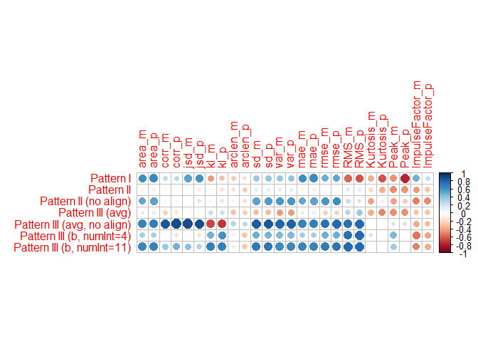

-   [Introduction](#introduction)
-   [Fire Drill - anti-pattern](#fire-drill---anti-pattern)
    -   [Prerequisites](#prerequisites)
    -   [Modeling the Fire Drill](#modeling-the-fire-drill)
        -   [Initial Best Guess](#initial-best-guess)
            -   [Description of Figure ](#description-of-figure)
            -   [Description
                Phase-by-Phase](#description-phase-by-phase)
-   [Data](#data)
    -   [The Ground Truth](#the-ground-truth)
    -   [The Student Projects](#the-student-projects)
    -   [Modeling of metrics and events using
        KDE](#modeling-of-metrics-and-events-using-kde)
-   [Patterns for scoring the
    projects](#patterns-for-scoring-the-projects)
    -   [Pattern I: Initial best guess](#pattern-i-initial-best-guess)
        -   [Initialize the pattern](#initialize-the-pattern)
    -   [Pattern II: Adaptation of best
        guess](#pattern-ii-adaptation-of-best-guess)
        -   [Preparation](#preparation)
        -   [Defining the losses](#defining-the-losses)
        -   [Fitting the pattern](#fitting-the-pattern)
        -   [Inversing the parameters](#inversing-the-parameters)
    -   [Pattern III: Averaging the ground
        truth](#pattern-iii-averaging-the-ground-truth)
    -   [Pattern III (b): Evidence-based](#pattern-iii-b-evidence-based)
        -   [Preparation](#preparation-1)
        -   [Finding the best fit](#finding-the-best-fit)
        -   [Create pattern from best
            fit](#create-pattern-from-best-fit)
-   [Scoring of projects](#scoring-of-projects)
    -   [The cost of alignment](#the-cost-of-alignment)
    -   [Scoring mechanisms](#scoring-mechanisms)
    -   [Pattern I](#pattern-i)
    -   [Pattern II](#pattern-ii)
    -   [Pattern II (without alignment)](#pattern-ii-without-alignment)
    -   [Pattern III (average)](#pattern-iii-average)
    -   [Pattern III (average, no
        alignment)](#pattern-iii-average-no-alignment)
        -   [Linear combination of
            scores](#linear-combination-of-scores)
        -   [Finding the most important
            scores](#finding-the-most-important-scores)
        -   [Pattern as confidence
            surface](#pattern-as-confidence-surface)
    -   [Pattern III (b)](#pattern-iii-b)
        -   [Linear combination of
            scores](#linear-combination-of-scores-1)
-   [References](#references)

# Introduction

This is the complementary technical report for the paper/article
tentatively entitled “Multivariate Continuous Processes: Modeling,
Instantiation, Goodness-of-fit, Forecasting.” Here, we import the ground
truth as well as all projects’ data, and instantiate our model based on
*self-regularizing Boundary Time Warping and Boundary Amplitude
Warping*. Given a few patterns that represent the **Fire Drill**
anti-pattern (AP), the goal is evaluate these patterns and their
aptitude for detecting the AP in concordance with the ground truth.

All complementary data and results can be found at Zenodo (Hönel et al.
2022). This notebook was written in a way that it can be run without any
additional efforts to reproduce the outputs (using the pre-computed
results). This notebook has a canonical
URL<sup>[\[Link\]](https://github.com/sse-lnu/anti-pattern-models/blob/master/notebooks/fire-drill-technical-report.Rmd)</sup>
and can be read online as a rendered
markdown<sup>[\[Link\]](https://github.com/sse-lnu/anti-pattern-models/blob/master/notebooks/fire-drill-technical-report.md)</sup>
version. All code can be found in this repository, too.

# Fire Drill - anti-pattern

We describe the Fire Drill (FD) anti-pattern for usage in models that
are based on the source code (i.e., not from a managerial or project
management perspective). The purpose also is to start with a best guess,
and then to iteratively improve the description when new evidence is
available.

FD is described now both from a managerial and a technical
perspective<sup>[\[Link\]](https://github.com/ReliSA/Software-process-antipatterns-catalogue/pull/13/commits/78c06c30b1880795e6c1dd0f20f146c548212675?short_path=01589ac#diff-01589ac85c3fc29739823b5a41ab1bbfba7fbc2579aaf63de0f1ce31713689ab)</sup>.
The technical description is limited to variables we can observe, such
as the amount (frequency) of commits and source code, the density of
source code, and maintenance activities (a/c/p).

In literature, FD is described in (Silva, Moreno, and Peters 2015) and
(Brown et al. 1998), as well as
at<sup>[\[Link\]](https://web.archive.org/web/20210414150555/https://sourcemaking.com/antipatterns/fire-drill)</sup>.

Currently, FD is defined to have these symptoms and consequences:

-   Rock-edge burndown (especially when viewing implementation tasks
    only)
-   Long period at project start where activities connected to
    requirements, analysis and planning prevale, and design and
    implementation activities are rare
-   Only analytical or documentational artefacts for a long time
-   Relatively short period towards project end with sudden increase in
    development efforts
-   Little testing/QA and project progress tracking activities during
    development period
-   Final product with poor code quality, many open bug reports, poor or
    patchy documentation
-   Stark contrast between inter-level communication in project
    hierarchy (management - developers) during the first period (close
    to silence) and after realizing the problem (panic and loud noise

From these descriptions, we have attempted to derive the following
symptoms and consequences in source code:

-   Rock-edge burndown of esp. implementation tasks mean there are no or
    just very few adaptive maintenance activities before the burning
    down starts
-   The long period at project start translates to few modifications
    made to the source code, resulting in fewer commits (lower overall
    relative frequency)
-   Likewise, documentational artifacts have a lower source code
    density, as less functionality is delivered; this density should
    increase as soon as adaptive activities are registered
-   The short period at project end is characterized by a higher
    frequency of higher-density implementation tasks, with little to no
    perfective or corrective work
-   At the end of the project, code quality is comparatively lower,
    while complexity is probably higher, due to pressure exerted on
    developers in the burst phase

## Prerequisites

Through source code, we can observe the following variables (and how
they change over time). We have the means to model and match complex
behavior for each variable over time. By temporally subdividing the
course of a random variable, we can introduce additional measures for a
pattern, that are based on comparing the two intervals (e.g., mean,
steepest slope, comparisons of the shape etc.).

-   Amount of commits over interval of time (frequency) – We can observe
    any commit, both at when it was authored first, and when it was
    added to the repository (author-/committer-date).
-   Amount/Frequency of each maintenance activity separately
-   Density of the source code (also possibly per activity if required)
    Any other metric, if available (e.g., total Quality or Complexity of
    project at each commit) – however, we need to distinguish random
    variables by whether their relative frequency (when they are
    changing or simply when they are observed) changes the shape of the
    function, or whether it only leads to different sample rates. In
    case of metrics, the latter is the case. In other words, for some
    variables their occurrence is important, while for others it is the
    observed value.

It is probably the most straightforward way to decompose a complex
pattern such as Fire Drill into sub-processes, one for each random
variable. That has several advantages:

-   We are not bound/limited to only one global aggregated match, which
    could hide alignment details.
-   We can quantify the goodness of match for each variable separately,
    including details such as the interval in which it matched, and how
    well it matched in it.
-   Matching separately allows us to come up with our own scoring
    methods; e.g., it could be that the matching-score of one variable
    needs to be differently computed than the score of another, or
    simply the weights between variables are different.
-   If a larger process was temporally subdivided, we may want to score
    a variable in one of the intervals differently, or not at all. This
    is useful for when we cannot make sufficient assumptions.

## Modeling the Fire Drill

In this section, we will collect attempts to model the Fire Drill
anti-pattern. The first attempt is our initial guess, and subsequent
attempts are based on new input (evidence, opinions/discussions etc.).

### Initial Best Guess

Our initial best guess is solely based on the literature and
descriptions from above, and no dataset was inspected yet. We chose to
model our initial best guess using a visual process. Figure must be
understood as a simplified and idealized approximation. While we could
add a confidence interval for each variable represented, we will later
show how align (fit) a project (process) to this pattern (process
model), and then measure its deviation from it. The modeled pattern is a
**continuous-time stochastic process model**, and we will demonstrate
means to quantify the difference between this **process model** and a
**process**, which is shown in section .

<div class="figure" style="text-align: center">


<p class="caption">
Modeling of the Fire Drill anti-pattern over the course of an entire
project, according to what we know from literature.
</p>

</div>

The pattern is divided into four intervals (five if one counts
*t*<sub>x-over</sub> as delimiter, but it is more like an additional
point of interest). These intervals are:

1.  \[0, *t*<sub>1</sub>) – Begin
2.  \[*t*<sub>1</sub>, *t*<sub>2</sub>) – Long Stretch
3.  \[*t*<sub>2</sub>,*t*<sub>end</sub>\] – Fire Drill
4.  (*t*<sub>end</sub>, *t*<sub>3</sub>\] – Aftermath

In each interval and for each of the random variables modeled, we can
perform matching. This also means that a) we do not have to attempt
matching in each interval, b) we do not have to perform matching for
each variable, and c) that we can select a different set of appropriate
measures for each variable in each interval (this is useful if, e.g., we
do not have much information for some of them).

Each variable is its own sub-pattern. As of now, we track the
maintenance activities, and their frequency over time. A higher
accumulation results in a higher peak. One additional variable, the
source code density (blue), is not measured by its frequency
(occurrences), but rather by its value. We may include and model
additional metrics, such as complexity or quality.

Whenever we temporally subdivide the pattern into two intervals, we can
take these measurements:

-   Compute the goodness-of-fit of the curve of a variable, compared to
    its behavior in the data. As of now, that includes a rich set of
    metrics, all of which can quantify these differences, and for all of
    which we have developed scores. While we can compute scores for the
    actual match, we do also have the means to compute the score of the
    dynamic time warping. Among others, we have these metrics:
    -   Reference and Query signal: Start/end (cut-in/-out) for both
        absolute & relative About the DTW match: (relative) monotonicity
        (continuity of the warping function), residuals of (relative)
        warping function (against its LM or optimized own version
        (fitted using RSS))
    -   Between two curves (all of these are normalized as they are
        computed in the unit square, see R notebook): area (by
        integration), generic statistics by sampling (mae, rmse,
        correlation (pearson, kendall, spearman), covariance,
        standard-deviation, variance, symmetric Kullback-Leibler
        divergence, symmetric Jenson-Shannon Divergence)
-   Sub-division allows for comparisons of properties of the two
    intervals, e.g.,
    -   Compare averages of the variable in each interval. This can be
        easily implemented as a score, as we know the min/max and also
        do have expectations (lower/higher).
    -   Perform a linear regression/create a linear model (LM) over the
        variable in each interval, so that we can compare slopes,
        residuals etc.
-   Cross-over of two variables: This means that a) the two slopes of
    their respective LM converge and b) that there is a crossover within
    the interval.

#### Description of Figure 

-   The frequency of activities (purple) is the sum of all activities,
    i.e., this curve is green (corrective + perfective) plus red
    (adaptive).
-   The frequency is the only variable that may be modeled with its
    actual maximum of 1, as we expect it to reach its maximum at
    *t*<sub>end</sub>. The frequency also has to be actually 0, before
    the first commit is made.
    -   Some of our metrics can measure how well one curve resembles the
        other, regardless of their “vertical difference.” Other metrics
        can describe the distance better. What I want to say is, it is
        not very important what the value of a variable in our modeled
        pattern actually is. But it is important however if it touches 0
        or 1. A variable should only be modeled as touching 0 or 1 if it
        is a) monotonically increasing over the course of the project
        and b) actually assumes its theoretical min/max.
-   Corrective and Perfective have been aggregated into one variable, as
    according to the description of Fire Drill, there is only a
    distinction between adding features and performing other, such as
    Q/A related, tasks.
-   The source code density (blue) should, with the first commit, jump
    to its expected value, which is the average over all commits in the
    project. A steep but short increase is expected in
    \[*t*<sub>2</sub>,*t*<sub>end</sub>\] as less focus is spent on
    documentational artifacts.
-   We do not know much about the activities’ frequency and relative
    distribution up till *t*<sub>2</sub>. That leaves us with two
    options: either, we make only very modest assumptions about the
    progression of a variable, such as the slope of its LM in that
    interval or the residuals. Otherwise, we can also choose not to
    assess the variable in that interval. It is not yet clear how useful
    the results from the DTW would be, as we can only model a straight
    line (that’s why I am suggesting LMs instead). For Fire Drill, the
    interval \[*t*<sub>2</sub>,*t*<sub>3</sub>\] is most characteristic.
    We can however extract some constraints for our expectations between
    the intervals \[*t*<sub>2</sub>,*t*<sub>3</sub>\] and everything
    that happens before. For example, in \[BRO’98\] it is described that
    \[0, *t*<sub>2</sub>) is about 5-7x longer than
    \[*t*<sub>2</sub>,*t*<sub>end</sub>\].
-   *t*<sub>end</sub> is not a delimiter we set manually, but it is
    rather discovered by the sub-patterns’ matches. However, it needs to
    be sufficiently close to the project’s actual end (or there needs to
    be a viable explanation for the difference, such as holidays in
    between etc.)
-   *t*<sub>x-over</sub> must happen; but other than that, there is not
    much we can assume about it. We could specify properties as to where
    approximately we’d expect it to happen (I suppose in the first half
    of the interval) or how steep the crossover actually is but it is
    probably hard to rely on.

#### Description Phase-by-Phase

**Begin**: A short phase of a few days, probably not more than a week.
While there will be few commits, *t*<sub>1</sub> does not really start
until the frequency stabilizes. We expect the maintenance activities’
relative frequency to decrease towards the end of Begin, before they
become rather constant in the next phase. In this phase, the source code
density is expected to be close to its average, as initial code as well
as documentation are added.

**Long Stretch**: This is the phase we do not know much about, except
for that the amount of adaptive activities is comparatively lower,
especially when compared to the aggregated corrective and perfective
activities (approx. less than half of these two). While the activities’
variables will most likely not be perfectly linear, the LM over these
should show rather small residuals. Also the slope of the LM is expected
to be rather flat (probably less than +/-10°). The source code density
is expected to fall slightly below its average after Begin, as less code
is shipped.

**Fire Drill**: The actual Fire Drill happens in
\[*t*<sub>2</sub>,*t*<sub>end</sub>\], and we detect *t*<sub>end</sub>
by finding the apex of the frequency. However, we choose to extend this
interval to include (*t*<sub>end</sub>, *t*<sub>3</sub>\], as by doing
so, we can craft more characteristics of the anti-pattern and impose
more assumptions. These are a) that the steep decline in that last phase
has a more extreme slope than its increase before *t*<sub>end</sub>
(because after shipping/project end, probably no activity is performed
longer). B) This last sub-phase should be shorter than the phase before
(probably just up to a few days; note that the phase
\[*t*<sub>2</sub>,*t*<sub>end</sub>\] is described to be approximately
one week long in literature).

With somewhat greater confidence, we can define the following:

-   The source code density will rise suddenly and approach its maximum
    of 1 (however we should not model it with its maximum value to
    improve matching). It is expected to last until *t*<sub>end</sub>,
    with a sudden decline back to its average from Begin. We do not have
    more information for after *t*<sub>end</sub>, so the average is the
    expected value.
-   Perfective and corrective activities will vanish quickly and
    together become the least frequent activity in the project. The
    average of these activities is expected to be less than half
    compared to the Long Stretch. Until *t*<sub>3</sub> (the very end),
    the amount of these activities keeps monotonically decreasing.
-   At the same time, we will see a steep increase of adaptive activity.
    The increase is expected to be greater than or equal to the decrease
    of perfective and corrective activities. In other words, the average
    of adaptive activities is expected to be more than double, compared
    to what it was in the Long Stretch. Also, adaptive activities will
    reach their maximum frequency over the course of the project here.
-   The nature of a Fire Drill is a frantic and desperate phase. While
    adaptive approaches its maximum, the commit frequency also
    approaches its maximum, even though perfective and corrective
    activities decline (that is why the purple curve is less steep than
    the adaptive one but still goes to its global maximum).
-   There will be a sharp crossover between perfective+corrective and
    adaptive activities. It is expected to happen sooner than later in
    the phase \[*t*<sub>2</sub>,*t*<sub>end</sub>\].

**Aftermath**: Again, we do not know how this phase looks, but it will
help us to more confidently identify the Fire Drill, as the curves of
the activities, frequencies and other metrics have very characteristic
curves that we can efficiently match. All metrics that are invariant to
the frequency are expected to approach their expected value, without
much variance (rather constant slope of their resp. LMs). Any of the
maintenance activities will continue to fall. In case of adaptive
activities we will see an extraordinary steep decline, as after project
end/shipping, no one adds functionality. It should probably even fall
below all other activities, resulting in another crossover. We do not
set any of the activities to be exactly zero however, to allow more
efficient matching.

# Data

We have 9 projects conducted by students, and two raters have
**independently**, i.e., without prior communication, assessed to what
degree the AP is present in each project. This was done using a scale
from zero to ten, where zero means that the AP was not present, and ten
would indicate a strong manifestation.

## The Ground Truth

``` r
ground_truth <- read.csv(file = "../data/ground-truth.csv", sep = ";")
```

| project   | rater.a | rater.b | consensus | rater.mean |
|:----------|--------:|--------:|----------:|-----------:|
| project_1 |       2 |       0 |         1 |        1.0 |
| project_2 |       0 |       0 |         0 |        0.0 |
| project_3 |       8 |       5 |         6 |        6.5 |
| project_4 |       8 |       6 |         8 |        7.0 |
| project_5 |       1 |       1 |         1 |        1.0 |
| project_6 |       4 |       1 |         2 |        2.5 |
| project_7 |       2 |       3 |         3 |        2.5 |
| project_8 |       0 |       0 |         0 |        0.0 |
| project_9 |       1 |       4 |         5 |        2.5 |

Entire ground truth as of both raters

Using the *quadratic weighted Kappa* (Cohen 1968), we can report an
unadjusted agreement of **0.715** for both raters. A Kappa value in the
range \[0.6,0.8\] is considered *substantial*, and values beyond that as
*almost perfect* (Landis and Koch 1977). As for the Pearson-correlation,
we report a slightly higher value of **0.771**. The entire ground truth
is shown in table . The final consensus was reached after both raters
exchanged their opinions, and it is the consensus that we will use as
the actual ground truth from here on and out.

## The Student Projects

The ground truth was extracted from nine student-conducted projects.
Seven of these were implemented simultaneously between March and June
2020, and two the year before in a similar timeframe.

``` r
student_projects <- read.csv(file = "../data/student-projects.csv", sep = ";")
```

In the first batch, we have a total of:

-   Nine projects,
-   37 authors that authored 1219 commits total which are of type
-   Adaptive / Corrective / Perfective (`a/c/p`) commits: 392 / 416 /
    411

We have a complete breakdown of all activities across all projects in
figure .

``` r
student_projects_info <- NULL

for (pId in unique(student_projects$project)) {
  temp <- student_projects[student_projects$project == pId, ]
  student_projects_info <- rbind(student_projects_info, data.frame(project = pId, 
    authors = length(unique(temp$AuthorNominalLabel)), commits = nrow(temp), 
    a = nrow(temp[temp$label == "a", ]), c = nrow(temp[temp$label == "c", ]), 
    p = nrow(temp[temp$label == "p", ]), avgDens = round(mean(temp$Density), 
      3)))
}
```

| project   | authors | commits |   a |   c |   p | avgDens |
|:----------|--------:|--------:|----:|----:|----:|--------:|
| project_1 |       4 |     116 |  36 |  32 |  48 |   0.879 |
| project_2 |       5 |     226 |  42 | 108 |  76 |   0.891 |
| project_3 |       4 |     111 |  26 |  35 |  50 |   0.785 |
| project_4 |       4 |     126 |  29 |  59 |  38 |   0.870 |
| project_5 |       2 |     110 |  33 |  26 |  51 |   0.814 |
| project_6 |       4 |     217 |  79 |  63 |  75 |   0.784 |
| project_7 |       5 |     183 |  83 |  64 |  36 |   0.813 |
| project_8 |       4 |      30 |  10 |   6 |  14 |   0.687 |
| project_9 |       5 |     100 |  54 |  23 |  23 |   0.743 |

Per-project overview of the student projects

<div class="figure" style="text-align: top">


<p class="caption">
Commit activities across projects
</p>

</div>

We have slightly different begin- and end-times in each project.
However, the data for all projects was previously cropped, so that each
project’s extent marks the absolute begin and end of it – it starts with
the first commit and ends with the last. As for our methods here, we
only need to make sure that we scale the timestamps into a relative
\[0,1\]-range, where 1 marks the project’s end.

For each project, we model **four** variables: The activities
**adaptive** (**`A`**), **corrective+perfective** (**`CP`**), the
frequency of all activities, regardless of their type (**`FREQ`**), and
the **source code density** (**`SCD`**). While for the first three
variables we estimate a Kernel density, the last variable is a metric
collected with each commit. The data for it is mined using `Git-Density`
(Hönel 2020), and we use a highly efficient commit classification
model[1] ( ≈ 83.6% accuracy,  ≈ 0.745 Kappa) (Hönel et al. 2020) to
attach maintenance activity labels to each commit, based on size- and
keyword-data only.

Technically, we will compose each variable into an instance of our
`Signal`-class. Before we start, we will do some normalizations and
conversions, like converting the timestamps. This has to be done on a
per-project basis.

``` r
student_projects$label <- as.factor(student_projects$label)
student_projects$project <- as.factor(student_projects$project)
student_projects$AuthorTimeNormalized <- NA_real_
```

``` r
for (pId in levels(student_projects$project)) {
  student_projects[student_projects$project == pId, ]$AuthorTimeNormalized <- (student_projects[student_projects$project == 
    pId, ]$AuthorTimeUnixEpochMilliSecs - min(student_projects[student_projects$project == 
    pId, ]$AuthorTimeUnixEpochMilliSecs))
  student_projects[student_projects$project == pId, ]$AuthorTimeNormalized <- (student_projects[student_projects$project == 
    pId, ]$AuthorTimeNormalized/max(student_projects[student_projects$project == 
    pId, ]$AuthorTimeNormalized))
}
```

And now for the actual signals: Since the timestamps have been
normalized for each project, we model each variable to actually start at
0 and end at 1 (the support). We will begin with activity-related
variables before we model the source code density, as the process is
different. When using Kernel density estimation (KDE), we obtain an
empirical probability density function (PDF) that integrates to 1. This
is fine when looking at all activities combined (**`FREQ`**). However,
when we are interested in a specific fraction of the activities, say
**`A`**, then we should scale its activities according to its overall
ratio. Adding all scaled activities together should again integrate to
1. When this is done, we scale one last time such that no empirical PDF
has a co-domain larger than 1.

``` r
project_signals <- list()

# passed to stats::density
use_kernel <- "gauss"  # 'rect'

for (pId in levels(student_projects$project)) {
  temp <- student_projects[student_projects$project == pId, ]

  # We'll need these for the densities:
  acp_ratios <- table(temp$label)/sum(table(temp$label))

  dens_a <- densitySafe(from = 0, to = 1, safeVal = NA_real_, data = temp[temp$label == 
    "a", ]$AuthorTimeNormalized, ratio = acp_ratios[["a"]], kernel = use_kernel)

  dens_cp <- densitySafe(from = 0, to = 1, safeVal = NA_real_, data = temp[temp$label == 
    "c" | temp$label == "p", ]$AuthorTimeNormalized, ratio = acp_ratios[["c"]] + 
    acp_ratios[["p"]], kernel = use_kernel)

  dens_freq <- densitySafe(from = 0, to = 1, safeVal = NA_real_, data = temp$AuthorTimeNormalized, 
    ratio = 1, kernel = use_kernel)

  # All densities need to be scaled together once more, by dividing for the maximum
  # value of the FREQ-variable.
  ymax <- max(c(attr(dens_a, "ymax"), attr(dens_cp, "ymax"), attr(dens_freq, "ymax")))
  dens_a <- stats::approxfun(x = attr(dens_a, "x"), y = sapply(X = attr(dens_a, 
    "x"), FUN = dens_a)/ymax)
  dens_cp <- stats::approxfun(x = attr(dens_cp, "x"), y = sapply(X = attr(dens_cp, 
    "x"), FUN = dens_cp)/ymax)
  dens_freq <- stats::approxfun(x = attr(dens_freq, "x"), y = sapply(X = attr(dens_freq, 
    "x"), FUN = dens_freq)/ymax)

  project_signals[[pId]] <- list(A = Signal$new(name = paste(pId, "A", sep = "_"), 
    func = dens_a, support = c(0, 1), isWp = FALSE), CP = Signal$new(name = paste(pId, 
    "CP", sep = "_"), func = dens_cp, support = c(0, 1), isWp = FALSE), FREQ = Signal$new(name = paste(pId, 
    "FREQ", sep = "_"), func = dens_freq, support = c(0, 1), isWp = FALSE))
}
```

Now, for each project, we estimate the variable for the source code
density as follows:

``` r
for (pId in levels(student_projects$project)) {
  temp <- data.frame(x = student_projects[student_projects$project == pId, ]$AuthorTimeNormalized, 
    y = student_projects[student_projects$project == pId, ]$Density)
  temp <- temp[with(temp, order(x)), ]

  # Using a polynomial with maximum possible degree, we smooth the SCD-data, as it
  # can be quite 'peaky'
  temp_poly <- poly_autofit_max(x = temp$x, y = temp$y, startDeg = 13)

  dens_scd <- Vectorize((function() {
    rx <- range(temp$x)
    ry <- range(temp$y)
    poly_y <- stats::predict(temp_poly, x = temp$x)
    tempf <- stats::approxfun(x = temp$x, y = poly_y, ties = "ordered")
    function(x) {
      if (x < rx[1] || x > rx[2]) {
        return(NA_real_)
      }
      max(ry[1], min(ry[2], tempf(x)))
    }
  })())

  project_signals[[pId]][["SCD"]] <- Signal$new(name = paste(pId, "SCD", sep = "_"), 
    func = dens_scd, support = c(0, 1), isWp = FALSE)
}
```

Let’s plot all the projects:

<div class="figure" style="text-align: top">


<p class="caption">
All variables over each project’s time span (first batch of projects).
</p>

</div>

## Modeling of metrics and events using KDE

We need to make an important distinction between events and metrics. An
event does not carry other information, other than that it occurred. One
could thus say that such an event is *nulli*-variate. If an event were
to carry extra information, such as a measurement that was taken, it
would be *uni*-variate. That is the case for many metrics in software:
the time of their measurement coincides with an event, such as a commit
that was made. On the time-axis we thus know **when** it occurred and
**what** was its value. Such a metric could be easily understood as a
*bivariate x/y* variable and be plotted in a two-dimensional Cartesian
coordinate system.

An event however does not have any associated y-value we could plot.
Given a time-axis, we could make a mark whenever it occurred. Some of
the markers would probably be closer to each other or be more or less
accumulated. The y-value could express these accumulations relative to
each other. These are called *densities*. This is exactly what KDE does:
it expresses the relative accumulations of data on the x-axis as density
on the y-axis. For KDE, the actual values on the x-axis have another
meaning, and that is to compare the relative likelihoods of the values
on it, since the axis is ordered. For our case however, the axis is
linear time and carries no such meaning. The project data we analyze is
a kind of sampling over the project’s events. We subdivide the gathered
project data hence into these two types of data series:

-   **Events**: They do not carry any extra information or measurements.
    As for the projects we analyze, events usually are occurrences of
    specific types of commits, for example. The time of occurrence is
    the x-value on the time-axis, and the y-value is obtained through
    KDE. We model all maintenance activities as such variables.
-   **Metrics**: Extracted from the project at specific times, for
    example at every commit. We can extract any number or type of
    metric, but each becomes its own variable, where the x-value is on
    the time-axis, and the y-value is the metric’s value. We model the
    source code density as such a variable.

# Patterns for scoring the projects

Our overall goal is to propose a single model that is able to detect the
presence of the Fire Drill AP, and how strong its manifestation is. In
order to do that, we require a pattern that defines how a Fire Drill
looks in practice. Any real-world project can never follow such a
pattern perfectly, because of, e.g., time dilation and compression. Even
after correcting these, some distance between the project and the
pattern will remain. The projects from figure indicate that certain
phases occur, but that their occurrence happens at different points in
time, and lasts for various durations.

Given some pattern, we first attempt to remove any distortions in the
data, by using our new model *self-regularizing Boundary Time Warping*
(sr-BTW). This model takes a pattern that is subdivided into one or more
intervals, and aligns the project data such that the loss in each
interval is minimized. After alignment, we calculate a score that
quantifies the remaining differences. Ideally, we hope to find a
(strong) positive correlation of these scores with the ground truth.

## Pattern I: Initial best guess

``` r
fd_data_concat <- readRDS("../data/fd_data_concat.rds")
```

This pattern was created based on all available literature, **without**
inspecting any of the projects. It is subdivided into four intervals:

1.  Begin – Short project warm-up phase
2.  Long Stretch – The longest phase in the project, about which we do
    not know much about, except for that there should be a rather
    constant amount of activities over time.
3.  Fire Drill – Characteristic is a sudden and steep increase of
    adaptive activities. This phase is over once these activities
    reached their apex.
4.  Aftermath – Everything after the apex. We should see even steeper
    declines.

Brown et al. (1998) describe a typical scenario where about six months
are spent on non-developmental activities, and the actual software is
then developed in less than four weeks. If we were to include some of
the aftermath, the above first guess would describe a project of about
eight weeks.

We define the boundaries as follows (there are three boundaries to split
the pattern into four intervals):

``` r
fd_data_boundaries <- c(b1 = 0.085, b2 = 0.625, b3 = 0.875)
```

The pattern and its boundaries look like this:

``` r
plot_project_data(data = fd_data_concat, boundaries = fd_data_boundaries)
```

<div class="figure" style="text-align: top">


<p class="caption">
The pattern that was our initial best guess
</p>

</div>

### Initialize the pattern

The pattern as shown in is just a collection of x/y coordinate-data, and
for us being able to use it, we need to instantiate it. We do this by
storing each variable in an instance of `Signal`.

``` r
p1_signals <- list(A = Signal$new(name = "p1_A", support = c(0, 1), isWp = TRUE, 
  func = stats::approxfun(x = fd_data_concat[fd_data_concat$t == "A", ]$x, y = fd_data_concat[fd_data_concat$t == 
    "A", ]$y)), CP = Signal$new(name = "p1_CP", support = c(0, 1), isWp = TRUE, 
  func = stats::approxfun(x = fd_data_concat[fd_data_concat$t == "CP", ]$x, y = fd_data_concat[fd_data_concat$t == 
    "CP", ]$y)), FREQ = Signal$new(name = "p1_FREQ", support = c(0, 1), isWp = TRUE, 
  func = stats::approxfun(x = fd_data_concat[fd_data_concat$t == "FREQ", ]$x, y = fd_data_concat[fd_data_concat$t == 
    "FREQ", ]$y)), SCD = Signal$new(name = "p1_SCD", support = c(0, 1), isWp = TRUE, 
  func = stats::approxfun(x = fd_data_concat[fd_data_concat$t == "SCD", ]$x, y = fd_data_concat[fd_data_concat$t == 
    "SCD", ]$y)))
```

<div class="figure" style="text-align: top">


<p class="caption">
The separate signals of pattern I.
</p>

</div>

## Pattern II: Adaptation of best guess

The second pattern is a compromise between the first and the third:
While we want to keep as much of the initial best guess, we also want to
adjust the pattern based on the projects and the ground truth. Adjusting
means, that we will keep what is in each interval, but we allow each
interval to stretch and compress, and we allow each interval to impose a
vertical translation both at then begin and end (a somewhat trapezoidal
translation). In any case, each such alteration is a linear affine
transformation. Additionally to sr-BTW, we will also apply **sr-BAW**
(self-regularizing Boundary Amplitude Warping) to accomplish this. This
model is called **`srBTAW`** and the process is the following:

-   The pattern is decomposed into its four variables first, as we can
    adapt these (almost) independently from each other.
-   Then, for each type of variable, an instance of `srBTAW` is created.
    As **Warping Candidates** (WC) we add all of the projects’
    corresponding variables. The **Warping Pattern** (WP) is the single
    variable from the pattern in this case – again, we warp the project
    data, however, eventually the learned warping gets inversed and
    applied to the WC.
-   All four `srBTAW` instances are then fitted simultaneously: While we
    allow the y-translations to adapt independently for each type of
    variable, all instances share the same intervals, as eventually we
    have to assemble the variables back into a common pattern.

### Preparation

We already have the `srBTAW` **Multilevel model**, which can keep track
of arbitrary many variables and losses. The intention behind this
however was, to track variables of the **same type**, i.e., signals that
are logically of the same type. In our case this means that any single
instance should only track variables that are either `A`, `CP`, `FREQ`
or `SCD`. For this pattern, the WP is a single signal per variable, and
the WC is the corresponding signal from each of the nine projects. This
is furthermore important to give different weights to different
variables. In our case, we want to give a lower weight to the
`SCD`-variable.

As for the loss, we will first test a combined loss that measures
**`3`** properties: The area between curves (or alternatively the
residual sum of squares), the correlation between the curves, and the
arc-length ratio between the curves. We will consider any of these to be
equally important, i.e., no additional weights. Each loss shall cover
all intervals with weight  = 1, except for the Long Stretch interval,
where we will use a reduced weight.

There are 4 types of variables, 7 projects (two projects have consensus
 = 0, i.e., no weight) and 2 × 3 single losses, resulting in 168 losses
to compute. The final weight for each loss is computed as:
*ω*<sub>*i*</sub> = *ω*<sup>(project)</sup> × *ω*<sup>(vartype)</sup> × *ω*<sup>(interval)</sup>.
For the phase Long Stretch, the weight for any loss will $\\frac{1}{2}$,
and for the source code density we will chose $\\frac{1}{2}$, too. The
weight of each project is based on the consensus of the ground truth.
The ordinal scale for that is \[0,10\], so that we will divide the score
by 10 and use that as weight. Examples:

-   **A** in Fire Drill in project *p*3: *ω* = 0.6 × 1 × 1 = 0.6
    (consensus is 6 in project *p*3)
-   **FREQ** in Long Stretch in project *p*7: *ω* = 0.3 × 0.5 × 1 = 0.15
    and
-   **SCD** in Long Stretch in project *p*4:
    *ω* = 0.8 × 0.5 × 0.5 = 0.2.

In table we show all projects with a consensus-score  \> 0, projects 2
and 8 are not included any longer.

``` r
ground_truth$consensus_score <- ground_truth$consensus/10
weight_vartype <- c(A = 1, CP = 1, FREQ = 1, SCD = 0.5)
weight_interval <- c(Begin = 1, `Long Stretch` = 0.5, `Fire Drill` = 1, Aftermath = 1)
```

``` r
temp <- expand.grid(weight_interval, weight_vartype, ground_truth$consensus_score)
temp$p <- temp$Var1 * temp$Var2 * temp$Var3
weight_total <- sum(temp$p)
```

The sum of all weights combined is 31.85.

|     | project   | consensus | consensus_score |
|:----|:----------|----------:|----------------:|
| 1   | project_1 |         1 |             0.1 |
| 3   | project_3 |         6 |             0.6 |
| 4   | project_4 |         8 |             0.8 |
| 5   | project_5 |         1 |             0.1 |
| 6   | project_6 |         2 |             0.2 |
| 7   | project_7 |         3 |             0.3 |
| 9   | project_9 |         5 |             0.5 |

Entire ground truth as of both raters

### Defining the losses

For the optimization we will use mainly **`5`** classes:

-   `srBTAW_MultiVartype`: One instance globally, that manages all
    parameters across all instances of `srBTAW`.
-   `srBTAW`: One instance per variable-type, so here we’ll end up with
    four instances.
-   `srBTAW_LossLinearScalarizer`: A linear scalarizer that will take on
    all of the defined singular losses and compute and add them together
    according to their weight.
-   `srBTAW_Loss2Curves`: Used for each of the 168 singular losses, and
    configured using a specific loss function, weight, and set of
    intervals where it ought to be used.
-   `TimeWarpRegularization`: One global instance for all `srBTAW`
    instances, to regularize extreme intervals. We chose a mild weight
    for this of just 1, which is small compared to the sum of all other
    weights (31.85).

``` r
p2_smv <- srBTAW_MultiVartype$new()

p2_vars <- c("A", "CP", "FREQ", "SCD")
p2_inst <- list()
for (name in p2_vars) {
  p2_inst[[name]] <- srBTAW$new(
    theta_b = c(0, fd_data_boundaries, 1),
    gamma_bed = c(0, 1, sqrt(.Machine$double.eps)),
    lambda = rep(sqrt(.Machine$double.eps), length(p2_vars)),
    begin = 0, end = 1, openBegin = FALSE, openEnd = FALSE,
    useAmplitudeWarping = TRUE,
    # We allow these to be larger; however, the final result should be within [0,1]
    lambda_ymin = rep(-10, length(p2_vars)),
    lambda_ymax = rep( 10, length(p2_vars)),
    isObjectiveLogarithmic = TRUE,
    paramNames = c("v",
                   paste0("vtl_", seq_len(length.out = length(p2_vars))),
                   paste0("vty_", seq_len(length.out = length(p2_vars)))))
  
  # We can already add the WP:
  p2_inst[[name]]$setSignal(signal = p1_signals[[name]])
  p2_smv$setSrbtaw(varName = name, srbtaw = p2_inst[[name]])
  
  # .. and also all the projects' signals:
  for (project in ground_truth[ground_truth$consensus > 0, ]$project) {
    p2_inst[[name]]$setSignal(signal = project_signals[[project]][[name]])
  }
}

# We call this there so there are parameters present.
set.seed(1337)
p2_smv$setParams(params =
  `names<-`(x = runif(n = p2_smv$getNumParams()), value = p2_smv$getParamNames()))
```

We can already initialize the linear scalarizer. This includes also to
set up some progress-callback. Even with massive parallelization, this
process will take its time so it will be good to know where we are
approximately.

``` r
p2_lls <- srBTAW_LossLinearScalarizer$new(returnRaw = FALSE, computeParallel = TRUE, 
  progressCallback = function(what, step, total) {
    # if (step == total) { print(paste(what, step, total)) }
  })

for (name in names(p2_inst)) {
  p2_inst[[name]]$setObjective(obj = p2_lls)
}
```

The basic infrastructure stands, so now it’s time to instantiate all of
the singular losses. First we define a helper-function to do the
bulk-work, then we iterate all projects, variables and intervals.

``` r
#' This function creates a singular loss that is a linear combination
#' of an area-, correlation- and arclength-loss (all with same weight).
p2_attach_combined_loss <- function(project, vartype, intervals) {
  weight_p <- ground_truth[ground_truth$project == project, ]$consensus_score
  weight_v <- weight_vartype[[vartype]]
  temp <- weight_interval[intervals]
  stopifnot(length(unique(temp)) == 1)
  weight_i <- unique(temp)
  weight <- weight_p * weight_v * weight_i

  lossRss <- srBTAW_Loss_Rss$new(wpName = paste0("p1_", vartype), wcName = paste(project, 
    vartype, sep = "_"), weight = weight, intervals = intervals, continuous = FALSE, 
    numSamples = rep(500, length(intervals)), returnRaw = TRUE)

  p2_inst[[vartype]]$addLoss(loss = lossRss)
  p2_lls$setObjective(name = paste(project, vartype, paste(intervals, collapse = "_"), 
    "rss", sep = "_"), obj = lossRss)
}
```

Let’s call our helper iteratively:

``` r
interval_types <- list(A = c(1, 3, 4), B = 2)

for (vartype in p2_vars) {
  for (project in ground_truth[ground_truth$consensus > 0, ]$project) {
    for (intervals in interval_types) {
      p2_attach_combined_loss(project = project, vartype = vartype, intervals = intervals)
    }
  }

  # Add one per variable-type:
  lossYtrans <- YTransRegularization$new(wpName = paste0("p1_", vartype), wcName = paste(project, 
    vartype, sep = "_"), intervals = seq_len(length.out = 4), returnRaw = TRUE, 
    weight = 1, use = "tikhonov")

  p2_inst[[vartype]]$addLoss(loss = lossYtrans)
  p2_lls$setObjective(name = paste(vartype, "p2_reg_output", sep = "_"), obj = lossYtrans)
}
```

Finally, we add the regularizer for extreme intervals:

``` r
p2_lls$setObjective(name = "p2_reg_exint2", obj = TimeWarpRegularization$new(weight = 0.25 * 
  p2_lls$getNumObjectives(), use = "exint2", returnRaw = TRUE, wpName = p1_signals$A$getName(), 
  wcName = project_signals$project_1$A$getName(), intervals = seq_len(length.out = length(p2_vars)))$setSrBtaw(srbtaw = p2_inst$A))
```

### Fitting the pattern

``` r
p2_params <- loadResultsOrCompute(file = "../results/p2_params.rds", computeExpr = {
  cl <- parallel::makePSOCKcluster(min(64, parallel::detectCores()))
  tempf <- tempfile()
  saveRDS(object = list(a = p2_smv, b = p2_lls), file = tempf)
  parallel::clusterExport(cl, varlist = list("tempf"))
  
  res <- doWithParallelClusterExplicit(cl = cl, expr = {
    optimParallel::optimParallel(
      par = p2_smv$getParams(),
      method = "L-BFGS-B",
      lower = c(
        rep(-.Machine$double.xmax, length(p2_vars)), # v_[vartype]
        rep(sqrt(.Machine$double.eps), length(p2_vars)), # vtl
        rep(-.Machine$double.xmax, length(p2_vars) * length(weight_vartype))), # vty for each
      upper = c(
        rep(.Machine$double.xmax, length(p2_vars)),
        rep(1, length(p2_vars)),
        rep(.Machine$double.xmax, length(p2_vars) * length(weight_vartype))),
      fn = function(x) {
        temp <- readRDS(file = tempf)
        temp$a$setParams(params = x)
        temp$b$compute0()
      },
      parallel = list(cl = cl, forward = FALSE, loginfo = TRUE)
    )
  })
})

p2_fr <- FitResult$new("a")
p2_fr$fromOptimParallel(p2_params)
format(p2_fr$getBest(paramName = "loss")[
  1, !(p2_fr$getParamNames() %in% c("duration", "begin", "end"))],
  scientific = FALSE, digits = 4, nsmall = 4)
```

    ##         v_A        v_CP      v_FREQ       v_SCD       vtl_1       vtl_2 
    ## "-0.014674" "-0.001527" "-0.008464" "-0.325218" " 0.486963" " 0.040402" 
    ##       vtl_3       vtl_4     vty_1_A    vty_1_CP  vty_1_FREQ   vty_1_SCD 
    ## " 0.493052" " 0.988596" " 0.055662" " 0.285855" " 0.413141" " 0.398693" 
    ##     vty_2_A    vty_2_CP  vty_2_FREQ   vty_2_SCD     vty_3_A    vty_3_CP 
    ## "-0.004618" " 0.023071" "-0.064090" "-0.149528" " 0.661491" "-0.333191" 
    ##  vty_3_FREQ   vty_3_SCD     vty_4_A    vty_4_CP  vty_4_FREQ   vty_4_SCD 
    ## " 0.462005" " 0.263016" "-1.048072" "-0.287820" "-1.437350" "-0.342797" 
    ##        loss 
    ## " 6.167237"

<div class="figure" style="text-align: top">


<p class="caption">
Neg. Log-loss of fitting pattern type II.
</p>

</div>

### Inversing the parameters

For this pattern, we have warped all the projects to the pattern, while
the ultimate goal is to warp the pattern to all the projects (or,
better, to warp each type of variable of the WP to the group of
variables of the same type of all projects, according to their weight,
which is determined by the consensus of the ground truth). So, if we
know how to go from A to B, we can inverse the learned parameters and go
from B to A, which means in our case that we have to apply the inverse
parameters to the WP in order to obtain WP-prime.

As for y-translations (that is, *v*, as well as all
**ϑ**<sup>(*y*)</sup>), the inversion is simple: we multiply these
parameters with  − 1. The explanation for that is straightforward: If,
for example, we had to go down by  − 0.5, to bring the data closer to
the pattern, then that means that we have to lift the pattern by  + 0.5
to achieve the inverse effect.

Inversing the the boundaries is simple, too, and is explained by how we
take some portion of the WC (the source) and warp it to the
corresponding interval of the WP (the target).

That’s how we do it:

-   Given are the WP’s **original** boundaries, **θ**<sup>(*b*)</sup>,
    and the learned **ϑ**<sup>(*l*)</sup>. The goal is, for each *q*-th
    interval, to take what is in the WP’s interval and warp it according
    to the learned length.
-   Given the boundaries-to-lengths operator, T<sup>(*l*)</sup>, and the
    lengths-to-boundaries operator, T<sup>(*b*)</sup>, we can convert
    between **θ** and **ϑ**.
-   Start with a new instance of `SRBTW` (or `SRBTWBAW` for also warping
    y-translations) and set as
    **θ**<sup>(*b*)</sup> = T<sup>(*b*)</sup>(**ϑ**<sup>(*l*)</sup>).
    The learned lengths will become the **target** intervals.
-   Add the variable that ought to be transformed as **WC**, and set
    **ϑ**<sup>(*l*)</sup> = T<sup>(*l*)</sup>(**θ**<sup>(*b*)</sup>).
-   That will result in that we are taking what was *originally* in each
    interval, and warp it to a new length.
-   The warped signal is then the `M`-function of the
    `SRBTW`/`SRBTWBAW`-instance.

Short example: Let’s take the `SCD`-variable from the first pattern and
warp it!

``` r
# Transforming some learned lengths to new boundaries:
p2_ex_thetaB <- c(0, 0.3, 0.5, 0.7, 1)
# Transforming the original boundaries to lengths:
p2_ex_varthetaL <- unname(c(fd_data_boundaries[1], fd_data_boundaries[2] - fd_data_boundaries[1], 
  fd_data_boundaries[3] - fd_data_boundaries[2], 1 - fd_data_boundaries[3]))

p2_ex_srbtw <- SRBTW$new(theta_b = p2_ex_thetaB, gamma_bed = c(0, 1, 0), wp = p1_signals$SCD$get0Function(), 
  wc = p1_signals$SCD$get0Function(), lambda = rep(0, 4), begin = 0, end = 1)

p2_ex_srbtw$setParams(vartheta_l = p2_ex_varthetaL)
```

In figure we can quite clearly see how the pattern warped from the blue
intervals into the orange intervals

<div class="figure" style="text-align: top">


<p class="caption">
Warping the variable from within the blue to the orange intervals.
</p>

</div>

We have learned the following parameters from our optimization for
pattern II:

``` r
p2_best <- p2_fr$getBest(paramName = "loss")[1, !(p2_fr$getParamNames() %in% c("begin", 
  "end", "duration"))]
p2_best
```

    ##          v_A         v_CP       v_FREQ        v_SCD        vtl_1        vtl_2 
    ## -0.014673620 -0.001527483 -0.008464488 -0.325217649  0.486962785  0.040401601 
    ##        vtl_3        vtl_4      vty_1_A     vty_1_CP   vty_1_FREQ    vty_1_SCD 
    ##  0.493052472  0.988595727  0.055661794  0.285855275  0.413141394  0.398693496 
    ##      vty_2_A     vty_2_CP   vty_2_FREQ    vty_2_SCD      vty_3_A     vty_3_CP 
    ## -0.004618406  0.023071288 -0.064090457 -0.149527947  0.661491448 -0.333190639 
    ##   vty_3_FREQ    vty_3_SCD      vty_4_A     vty_4_CP   vty_4_FREQ    vty_4_SCD 
    ##  0.462004516  0.263016381 -1.048071875 -0.287819945 -1.437350319 -0.342797057 
    ##         loss 
    ##  6.167237270

All of the initial translations (*v*) are zero. The learned lengths
converted to boundaries are:

``` r
# Here, we transform the learned lengths to boundaries.
p2_best_varthetaL <- p2_best[names(p2_best) %in% paste0("vtl_", 1:4)]/sum(p2_best[names(p2_best) %in% 
  paste0("vtl_", 1:4)])
p2_best_varthetaL
```

    ##      vtl_1      vtl_2      vtl_3      vtl_4 
    ## 0.24238912 0.02011018 0.24542030 0.49208041

``` r
p2_best_thetaB <- unname(c(0, p2_best_varthetaL[1], sum(p2_best_varthetaL[1:2]), 
  sum(p2_best_varthetaL[1:3]), 1))
p2_best_thetaB
```

    ## [1] 0.0000000 0.2423891 0.2624993 0.5079196 1.0000000

The first two intervals are rather short, while the last two are
comparatively long. Let’s transform all of the pattern’s variables
according to the parameters:

``` r
p2_signals <- list()

for (vartype in names(weight_vartype)) {
  temp <- SRBTWBAW$new(theta_b = unname(p2_best_thetaB), gamma_bed = c(0, 1, 0), 
    wp = p1_signals[[vartype]]$get0Function(), wc = p1_signals[[vartype]]$get0Function(), 
    lambda = rep(0, 4), begin = 0, end = 1, lambda_ymin = rep(0, 4), lambda_ymax = rep(1, 
      4))  # not important here
  # That's still the same ('p2_ex_varthetaL' is the original boundaries of Pattern
  # I transformed to lengths):
  temp$setParams(vartheta_l = p2_ex_varthetaL, v = -1 * p2_best[paste0("v_", vartype)], 
    vartheta_y = -1 * p2_best[paste0("vty_", 1:4, "_", vartype)])

  p2_signals[[vartype]] <- Signal$new(name = paste0("p2_", vartype), support = c(0, 
    1), isWp = TRUE, func = Vectorize(temp$M))
}
```

The 2nd pattern, as derived from the ground truth, is shown in figure .

<div class="figure" style="text-align: top">


<p class="caption">
Second pattern as aligned by the ground truth.
</p>

</div>

While this worked I suppose it is fair to say that our initial pattern
is hardly recognizable. Since we expected this, we planned for a third
kind of pattern in section , that is purely evidence-based. It appears
that, in order to match the ground truths we have at our disposal,
projects register some kind of weak initial peak for the maintenance
activities, that is followed by a somewhat uneventful second and third
interval. Interestingly, the optimization seemed to have used to mostly
straight lines in the Long Stretch phase to model linear declines and
increases. The new Aftermath phase is the longest, so it is clear that
the original pattern and its subdivision into phases is not a good
mapping any longer. Instead of a sharp decline in the Aftermath, we now
see an increase of all variables, without the chance of any decline
before the last observed commit. We will check how this adapted pattern
fares in section .

## Pattern III: Averaging the ground truth

We can produce a pattern by computing a weighted average over all
available ground truth. As weight, we can use either rater’s score,
their mean or consensus (default).

``` r
gt_weighted_avg <- function(vartype, wtype = c("consensus", "rater.a", "rater.b", 
  "rater.mean"), use_signals = project_signals, use_ground_truth = ground_truth) {
  wtype <- match.arg(wtype)
  gt <- use_ground_truth[use_ground_truth[[wtype]] > 0, ]
  wTotal <- sum(gt[[wtype]])
  proj <- gt$project
  weights <- `names<-`(gt[[wtype]], gt$project)

  funcs <- lapply(use_signals, function(ps) ps[[vartype]]$get0Function())

  Vectorize(function(x) {
    val <- 0
    for (p in proj) {
      val <- val + weights[[p]] * funcs[[p]](x)
    }
    val/wTotal
  })
}
```

Now we can easily call above function to produce a weighted average of
each signal:

``` r
p3_avg_signals <- list()

for (vartype in names(weight_vartype)) {
  p3_avg_signals[[vartype]] <- Signal$new(name = paste0("p3_avg_", vartype), support = c(0, 
    1), isWp = TRUE, func = gt_weighted_avg(vartype = vartype))
}
```

The 2nd pattern, as derived from the ground truth, is shown in figure .

<div class="figure" style="text-align: top">


<p class="caption">
The third kind of pattern as weighted average over all ground truth.
</p>

</div>

## Pattern III (b): Evidence-based

A third kind of pattern is produced by starting with an empty warping
pattern and having all available ground truth adapt to it. Empty means
that we will start with a flat line located at 0.5 for each variable.
Finally, the parameters are inversed. While we could do this the other
way round, we have two reasons to do it this way, which is the same as
we used for pattern II. First of all if the warping candidate was a
perfectly flat line, it would be very difficult for the gradient to
converge towards some alignment. Secondly, we want to use
equidistantly-spaced boundaries (resulting in equal-length intervals)
and using this approach, we can guarantee the interval lengths. To find
the optimum amount of intervals, we try all values in a certain range
and compute a fit, and then use an information criterion to decide which
of the produced patterns provides the best trade-off between number of
parameters and goodness-of-fit.

The process is the same as for pattern II: Using an instance of
`srBTAW_MultiVartype` that holds one instance of an `srBTAW` per
variable-type. We will choose equidistantly-spaced boundaries over the
WP, and start with just 1 interval, going up to some two-digit number.
The best amount of parameters (intervals) is then determined using the
Akaike Information Criterion (Akaike 1981), which is directly
implemented in `srBTAW`. We either have to use continuous losses or make
sure to **always** use the exact same amount of samples total. The
amount per interval is determined by dividing by the number of
intervals. This is important, as otherwise the information criterion
will not work. We will do a single RSS-loss that covers all intervals.
We will also use an instance of `TimeWarpRegularization` with the
`exint2`-regularizer, as it scales with arbitrary many intervals
(important!). I do not suppose that regularization for the y-values is
needed, so we will not have this. This means that the resulting
objective has just two losses.

For a set of equal-length number of intervals, we will fit such a
multiple variable-type model. This also means we can do this in
parallel. However, models with more intervals and hence more parameters
will considerable take longer during gradient iterations. The more
parameters, the fewer of these models should be fit simultaneously. We
have access to 128-thread machine (of which about 125 thread can be
used). Gradients are computed in parallel as well.

### Preparation

We define a single function that encapsulates the multiple variable-type
model, losses and objectives and returns them, so that we can just fit
them in a loop. The only configurable parameters is the amount of
intervals.

``` r
p3_prepare_mvtypemodel <- function(numIntervals) {
  eps <- sqrt(.Machine$double.eps)
  p3_smv <- srBTAW_MultiVartype$new()
  
  p3_vars <- c("A", "CP", "FREQ", "SCD")
  p3_inst <- list()
  
  # The objective:
  p3_lls <- srBTAW_LossLinearScalarizer$new(
    returnRaw = FALSE, computeParallel = TRUE, gradientParallel = TRUE)
  
  for (name in p3_vars) {
    p3_inst[[name]] <- srBTAW$new(
      # Always includes 0,1 - just as we need it! Works for values >= 1
      theta_b = seq(from = 0, to = 1, by = 1 / numIntervals),
      gamma_bed = c(0, 1, eps),
      lambda = rep(eps, numIntervals),
      begin = 0, end = 1, openBegin = FALSE, openEnd = FALSE,
      useAmplitudeWarping = TRUE,
      # We allow these to be larger; however, the final result should be within [0,1]
      lambda_ymin = rep(-10, numIntervals),
      lambda_ymax = rep( 10, numIntervals),
      isObjectiveLogarithmic = TRUE,
      paramNames = c("v",
        paste0("vtl_", seq_len(length.out = length(p3_vars))),
        paste0("vty_", seq_len(length.out = length(p3_vars)))))
    
    # The WP is a flat line located at 0.5:
    p3_inst[[name]]$setSignal(signal = Signal$new(
      func = function(x) .5, isWp = TRUE, support = c(0, 1), name = paste0("p3_", name)))
    
    # Set the common objective:
    p3_inst[[name]]$setObjective(obj = p3_lls)
    
    # .. and also all the projects' signals:
    for (project in ground_truth[ground_truth$consensus > 0, ]$project) {
      p3_inst[[name]]$setSignal(signal = project_signals[[project]][[name]])
    }
    
    p3_smv$setSrbtaw(varName = name, srbtaw = p3_inst[[name]])
  }

  # We call this there so there are parameters present.
  set.seed(1337 * numIntervals)
  p3_smv$setParams(params =
    `names<-`(x = runif(n = p3_smv$getNumParams()), value = p3_smv$getParamNames()))
  
  for (name in p3_vars) {
    # Add RSS-loss per variable-pair:
    for (project in ground_truth[ground_truth$consensus > 0, ]$project) {
      # The RSS-loss:
      lossRss <- srBTAW_Loss_Rss$new(
        wpName = paste0("p3_", name), wcName = paste(project, name, sep = "_"),
        weight = 1, intervals = seq_len(length.out = numIntervals), continuous = FALSE,
        numSamples = rep(round(5000 / numIntervals), numIntervals), returnRaw = TRUE)
      p3_inst[[name]]$addLoss(loss = lossRss)
      p3_lls$setObjective(
        name = paste(project, name, "rss", sep = "_"), obj = lossRss)
    }
  }
  
  # This has a much higher weight than we had for pattern II
  # because we are using many more samples in the RSS-loss.
  p3_lls$setObjective(name = "p3_reg_exint2", obj = TimeWarpRegularization$new(
    weight = p3_lls$getNumObjectives(), use = "exint2", returnRaw = TRUE,
    wpName = "p3_A", wcName = project_signals$project_1$A$getName(),
    intervals = seq_len(numIntervals)
  )$setSrBtaw(srbtaw = p3_inst$A))
  
  list(smv = p3_smv, lls = p3_lls)
}
```

Now we can compute these in parallel:

``` r
for (numIntervals in c(1:16)) {
  loadResultsOrCompute(
    file = paste0("../results/p3-compute/i_", numIntervals, ".rds"),
    computeExpr =
  {
    p3_vars <- c("A", "CP", "FREQ", "SCD")
    temp <- p3_prepare_mvtypemodel(numIntervals = numIntervals)
    tempf <- tempfile()
    saveRDS(object = temp, file = tempf)
    
    # It does not scale well beyond that.
    cl <- parallel::makePSOCKcluster(min(32, parallel::detectCores()))
    parallel::clusterExport(cl = cl, varlist = list("tempf"))
    
    optR <- doWithParallelClusterExplicit(cl = cl, expr = {
      optimParallel::optimParallel(
        par = temp$smv$getParams(),
        method = "L-BFGS-B",
        lower = c(
          rep(-.Machine$double.xmax, length(p3_vars)), # v_[vartype]
          rep(sqrt(.Machine$double.eps), length(p3_vars)), # vtl
          rep(-.Machine$double.xmax, length(p3_vars) * length(weight_vartype))), # vty for each
        upper = c(
          rep(.Machine$double.xmax, length(p3_vars)),
          rep(1, length(p3_vars)),
          rep(.Machine$double.xmax, length(p3_vars) * length(weight_vartype))),
        fn = function(x) {
          temp <- readRDS(file = tempf)
          temp$smv$setParams(params = x)
          temp$lls$compute0()
        },
        parallel = list(cl = cl, forward = FALSE, loginfo = TRUE)
      )
    })
    list(optR = optR, smv = temp$smv, lls = temp$lls)
  })
}
```

### Finding the best fit

We will load all the results previously computed and compute an
information criterion to compare fits, and then choose the best model.

``` r
p3_params <- NULL
for (tempPath in gtools::mixedsort(
  Sys.glob(paths = paste0(getwd(), "/../results/p3-compute/i*.rds")))
) {
  temp <- readRDS(file = tempPath)
  p3_params <- rbind(p3_params, data.frame(
    numInt = (temp$lls$getNumParams() - 1) / 2,
    numPar = temp$smv$getNumParams(),
    numParSrBTAW = temp$lls$getNumParams(),
    # This AIC would the original one!
    AIC = 2 * temp$smv$getNumParams() - 2 * log(1 / exp(temp$optR$value)),
    # This AIC is based on the number of intervals, not parameters!
    AIC1 = (temp$lls$getNumParams() - 1) - 2 * log(1 / exp(temp$optR$value)),
    # This AIC is based on the amount of parameters per srBTAW instance:
    AIC2 = 2 * temp$lls$getNumParams() - 2 * log(1 / exp(temp$optR$value)),
    logLoss = temp$optR$value,
    loss = exp(temp$optR$value)
  ))
}
```

In table , we show computed fits for various models, where the only
difference is the number of intervals. Each interval comes with two
degrees of freedom: its length and terminal y-translation. Recall that
each computed fit concerns four variables. For example, the first model
with just one interval per variable has nine parameters: All of the
variables share the interval’s length, the first parameter. Then, each
variable has one *v*-parameter, the global y-translation. For each
interval, we have one terminal y-translation. For example, the model
with 7 intervals has 7 + 4 + (4×7) = 39 parameters.

We compute the AIC for each fit, which is formulated as in the
following. The parameter *k* is the number of parameters in the model,
i.e., as described, it refers to all the parameters in the
`srBTAW_MultiVartype`-model. The second AIC-alternative uses the
parameter *p* instead, which refers to the number of variables per
`srBTAW`-instance.

$$
\\begin{aligned}
  \\operatorname{AIC}=&\\;2\\times k - 2\\times\\log{(\\mathcal{\\hat{L}})}\\;\\text{, where}\\;\\mathcal{\\hat{L}}\\;\\text{is the maximum log-likelihood of the model,}
  \\\\\[1ex\]
  \\mathcal{\\hat{L}}=&\\;\\frac{1}{\\exp{\\big(\\;\\text{lowest loss of the model}\\;\\big)}}\\;\\text{, since we use logarithmic losses.}
  \\\\\[1em\]
  \\text{The alternatives}&\\;\\operatorname{AIC^1}\\;\\text{and}\\;\\operatorname{AIC^2}\\;\\text{ are defined as:}
  \\\\\[1ex\]
  \\operatorname{AIC^1}=&\\;k-2\\times\\log{(\\mathcal{\\hat{L}})}-1\\;\\text{, which is based on the number of intervals, and}
  \\\\\[1ex\]
  \\operatorname{AIC^2}=&\\;2\\times p - 2\\times\\log{(\\mathcal{\\hat{L}})}\\;\\text{, where}\\;p\\;\\text{is the amount of params per}\\;\\operatorname{srBTAW}\\text{-instance.}
\\end{aligned}
$$

| numInt | numPar | numParSrBTAW |     AIC |   AIC1 |   AIC2 | logLoss |      loss |
|-------:|-------:|-------------:|--------:|-------:|-------:|--------:|----------:|
|      1 |      9 |            3 |  34.966 | 18.966 | 22.966 |   8.483 |  4831.189 |
|      2 |     14 |            5 |  44.052 | 20.052 | 26.052 |   8.026 |  3059.055 |
|      3 |     19 |            7 |  54.473 | 22.473 | 30.473 |   8.237 |  3776.854 |
|      4 |     24 |            9 |  63.694 | 23.694 | 33.694 |   7.847 |  2557.439 |
|      5 |     29 |           11 |  73.985 | 25.985 | 37.985 |   7.992 |  2958.219 |
|      6 |     34 |           13 |  83.761 | 27.761 | 41.761 |   7.881 |  2645.198 |
|      7 |     39 |           15 |  94.783 | 30.783 | 46.783 |   8.392 |  4410.053 |
|      8 |     44 |           17 | 110.695 | 38.695 | 56.695 |  11.347 | 84745.003 |
|      9 |     49 |           19 | 113.807 | 33.807 | 53.807 |   7.904 |  2706.944 |
|     10 |     54 |           21 | 123.809 | 35.809 | 57.809 |   7.905 |  2709.809 |
|     11 |     59 |           23 | 134.167 | 38.167 | 62.167 |   8.084 |  3240.653 |
|     12 |     64 |           25 | 144.350 | 40.350 | 66.350 |   8.175 |  3551.062 |
|     13 |     69 |           27 | 153.878 | 41.878 | 69.878 |   7.939 |  2804.353 |
|     14 |     74 |           29 | 164.122 | 44.122 | 74.122 |   8.061 |  3168.120 |
|     15 |     79 |           31 | 174.284 | 46.284 | 78.284 |   8.142 |  3435.957 |
|     16 |     84 |           33 | 184.305 | 48.305 | 82.305 |   8.153 |  3472.327 |

Likelihood and Akaike information criteria (AIC) for computed models.

Comparing the results from table , it appears that no matter how we
define the AIC, it is increasing with the number of parameters, and it
does so faster than the loss reduces. So, picking a model by AIC is not
terribly useful, as the results suggest we would to go with the
1-interval model. The model with the lowest loss is the one with 4
intervals.

### Create pattern from best fit

This is the same process as for pattern II, as the parameters need
inversion. We will reconstruct the warped signals according to the
inversed parameters to produce the third pattern. According to the
overview above, the best model (lowest loss, **not** AIC) is the one
with **4** intervals. Its parameters are the following:

``` r
# Let's first define a function that inverses the params and reconstructs the pattern.
p3_pattern_from_fit <- function(whichNumIntervals) {
  res <- list()
  p3_i <- readRDS(file = paste0(getwd(), "/../results/p3-compute/i_", whichNumIntervals, ".rds"))
  
  # FitResult:
  fr <- FitResult$new("foo")
  fr$fromOptimParallel(optR = p3_i$optR)
  res$fr <- fr
  
  # Inversion:
  lambda <- p3_i$smv$.__enclos_env__$private$instances$A$.__enclos_env__$private$instances$`p3_A|project_1_A`$getLambda()
  p3_i_varthetaL <- p3_i$optR$par[grepl(pattern = "^vtl_", x = names(p3_i$optR$par))]
  for (q in seq_len(length.out = whichNumIntervals)) {
    if (p3_i_varthetaL[q] < lambda[q]) {
      p3_i_varthetaL[q] <- lambda[q]
    }
  }
  p3_i_varthetaL <- p3_i_varthetaL / sum(p3_i_varthetaL)
  
  p3_i_thetaB <- c(0)
  for (idx in seq_len(length.out = length(p3_i_varthetaL))) {
    p3_i_thetaB <- c(p3_i_thetaB, sum(p3_i_varthetaL[1:idx]))
  }
  p3_i_thetaB[length(p3_i_thetaB)] <- 1 # numeric stability
  
  p3_i_varthetaL
  p3_i_thetaB
  res$varthetaL <- p3_i_varthetaL
  res$thetaB <- p3_i_thetaB
  
  # Signals:
  p3_i_numInt <- length(p3_i_varthetaL)
  p3_i_signals <- list()
  
  for (vartype in names(weight_vartype)) {
    emptySig <- Signal$new(
      isWp = TRUE, # does not matter here
        func = function(x) .5, support = c(0, 1), name = paste0("p3_", vartype))
    
    temp <- SRBTWBAW$new(
      theta_b = unname(p3_i_thetaB), gamma_bed = c(0, 1, 0),
      wp = emptySig$get0Function(), wc = emptySig$get0Function(),
      lambda = rep(0, p3_i_numInt), begin = 0, end = 1,
      lambda_ymin = rep(0, p3_i_numInt), lambda_ymax = rep(1, p3_i_numInt))
    
    # Recall that originally we used equidistantly-spaced boundaries:
    temp$setParams(vartheta_l = rep(1 / p3_i_numInt, p3_i_numInt),
                   v = -1 * p3_i$optR$par[paste0("v_", vartype)],
                   vartheta_y = -1 * p3_i$optR$par[paste0("vty_", 1:p3_i_numInt, "_", vartype)])
    
    p3_i_signals[[vartype]] <- Signal$new(
      name = paste0("p3_", vartype), support = c(0, 1), isWp = TRUE, func = Vectorize(temp$M))
  }
  res$signals <- p3_i_signals
  
  # Data:
  temp <- NULL
  for (vartype in names(weight_vartype)) {
    f <- p3_i_signals[[vartype]]$get0Function()
    x <- seq(from = 0, to = 1, length.out = 1e3)
    y <- f(x)
    
    temp <- rbind(temp, data.frame(
      x = x,
      y = y,
      t = vartype,
      numInt = whichNumIntervals
    ))
  }
  res$data <- temp
  res
}
```

``` r
p3_best <- readRDS(file = paste0(getwd(), "/../results/p3-compute/i_", p3_params[which.min(p3_params$loss), 
  ]$numInt, ".rds"))
p3_best$optR$par
```

    ##           v_A          v_CP        v_FREQ         v_SCD         vtl_1 
    ##  0.4753518248  0.4449292077  0.3969243406 -0.3425136575  0.0486178486 
    ##         vtl_2         vtl_3         vtl_4       vty_1_A      vty_1_CP 
    ##  0.0160263762  0.3063930774  0.9919315307 -0.0085322067  0.0130265463 
    ##    vty_1_FREQ     vty_1_SCD       vty_2_A      vty_2_CP    vty_2_FREQ 
    ##  0.0423862173  0.0196908380 -0.0055657708 -0.0293088290 -0.0404751674 
    ##     vty_2_SCD       vty_3_A      vty_3_CP    vty_3_FREQ     vty_3_SCD 
    ##  0.0401942364 -0.0898785537 -0.0488678587 -0.1533263719  0.0002213948 
    ##       vty_4_A      vty_4_CP    vty_4_FREQ     vty_4_SCD 
    ##  0.0673046097 -0.1805227900 -0.1085880858 -0.0666110009

First we have to inverse the parameters before we can reconstruct the
signals:

``` r
p3_best_varthetaL <- p3_best$optR$par[grepl(pattern = "^vtl_", x = names(p3_best$optR$par))]
p3_best_varthetaL <- p3_best_varthetaL/sum(p3_best_varthetaL)

p3_best_thetaB <- c(0)
for (idx in seq_len(length.out = length(p3_best_varthetaL))) {
  p3_best_thetaB <- c(p3_best_thetaB, sum(p3_best_varthetaL[1:idx]))
}
p3_best_thetaB[length(p3_best_thetaB)] <- 1  # numeric stability

p3_best_varthetaL
```

    ##      vtl_1      vtl_2      vtl_3      vtl_4 
    ## 0.03567055 0.01175843 0.22479830 0.72777272

``` r
p3_best_thetaB
```

    ## [1] 0.00000000 0.03567055 0.04742898 0.27222728 1.00000000

``` r
p3_best_numInt <- length(p3_best_varthetaL)
p3_signals <- list()

for (vartype in names(weight_vartype)) {
  emptySig <- Signal$new(
    isWp = TRUE, # does not matter here
      func = function(x) .5, support = c(0, 1), name = paste0("p3_", vartype))
  
  temp <- SRBTWBAW$new(
    theta_b = unname(p3_best_thetaB), gamma_bed = c(0, 1, 0),
    wp = emptySig$get0Function(), wc = emptySig$get0Function(),
    lambda = rep(0, p3_best_numInt), begin = 0, end = 1,
    lambda_ymin = rep(0, p3_best_numInt), lambda_ymax = rep(1, p3_best_numInt))
  
  # Recall that originally we used equidistantly-spaced boundaries:
  temp$setParams(vartheta_l = rep(1 / p3_best_numInt, p3_best_numInt),
                 v = -1 * p3_best$optR$par[paste0("v_", vartype)],
                 vartheta_y = -1 * p3_best$optR$par[paste0("vty_", 1:p3_best_numInt, "_", vartype)])
  
  p3_signals[[vartype]] <- Signal$new(
    name = paste0("p3_", vartype), support = c(0, 1), isWp = TRUE, func = Vectorize(temp$M))
}
```

The 2nd pattern, as derived from the ground truth, is shown in figure .

<div class="figure" style="text-align: top">


<p class="caption">
Pattern type III (b) pattern as aligned by the ground truth only.
</p>

</div>

Let’s show all computed patterns in a grid:

In figure we can clearly observe how the pattern evolves with growing
number or parameters. Almost all patterns with sufficiently many degrees
of freedom have some crack at about one quarter of the projects’ time, a
second crack is observed at about three quarter’s time. In all patterns,
it appears that adaptive activities are the least common. All patterns
started with randomized coefficients, and something must have gone wrong
for pattern 8. From five and more intervals we can observe growing
similarities with the weighted-average pattern, although it never comes
really close. Even though we used a timewarp-regularizer with high
weight, we frequently get extreme intervals.

<div class="figure" style="text-align: top">


<p class="caption">
Computed pattern by number of intervals.
</p>

</div>

In figure we can clearly see that all but the eighth pattern converged
nicely (this was already visible in ). The loss is logarithmic, so the
progress is rather substantial. For example, going from
log (14) ≈ 1.2*e*6 to log (8) ≈ 3*e*3 is a reduction by 3 (!) orders of
magnitude.

<div class="figure" style="text-align: top">


<p class="caption">
Losses for all computed pattern by number of intervals.
</p>

</div>

# Scoring of projects

The true main-purpose of our work is to take a pattern and check it
against any project, with the goal of obtaining a score, or
goodness-of-match so that we can determine if the AP in the pattern is
present in the project. In the previous sections we have introduced a
number of patterns that we are going to apply here.

How it works: Given some pattern that consists of one or arbitrary many
signals, the pattern is added to a single instance of `srBTAW` as
**Warping Pattern**. The project’s signals are added as **Warping
Candidates** to the same instance.

To compute a score, we need to define how to measure the distance
between the WP and the WC (between each pair of signals and each
interval). In the notebooks for sr-BTW we have previously defined some
suitable losses with either **global** or **local** finite upper bounds.
Currently, the Jensen–Shannon divergence (JSD), as well as the
ratio-metrics (correlation, arc-lengths) have global upper bounds. For
the JSD, it is ln (2). Losses with local finite upper bound are, for
example, the area between curves, the residual sum of squares, the
Euclidean distance etc., basically any metric that has a limit within
the rectangle demarcated by one or more intervals. For some of the
patterns, we have used a combination of such losses with local bounds.
In general, it is not necessary to fit a pattern with the same kinds of
losses that are later on used for scoring, but it is recommended to
avoid confusing may results.

## The cost of alignment

When aligning a project to a pattern using boundary time warping, a
deviation between the sections’ lengths is introduced. Ideally, if the
project would align with the pattern perfectly, there would be perfect
agreement. The less good a project aligns with a pattern, the more time
warping is required. However, the entire alignment needs to be assessed
in conjunction with the scores – the amount of required time warping
alone is not sufficient to assess to overall goodness of fit.

During the optimization, we already used a regularizer for extreme
intervals (`TimeWarpRegularization` with regularizer `exint2`).

## Scoring mechanisms

For scoring a single project, we first warp it to the pattern, then we
measure the remaining distance. We only do time-warping of the projects
to the pattern. We could compute a score for each interval. However, the
ground truth does not yield this, so we will only compute a scores for
entire signals, i.e., over all intervals. Once aligned, computing scores
is cheap, so we will try a variety of scores and see what works best.

``` r
# Function score_variable_alignment(..) has been moved to common-funcs.R!
```

We define a parallelized function to compute all scores of a project:

``` r
compute_all_scores <- function(alignment, patternName) {
  useScores <- c("area", "corr", "jsd", "kl", "arclen", "sd", "var", "mae", "rmse", 
    "RMS", "Kurtosis", "Peak", "ImpulseFactor")

  `rownames<-`(doWithParallelCluster(numCores = length(alignment), expr = {
    foreach::foreach(projectName = names(alignment), .inorder = TRUE, .combine = rbind, 
      .export = c("score_variable_alignment", "weight_vartype")) %dopar% {
      source("./common-funcs.R")
      source("../models/modelsR6.R")
      source("../models/SRBTW-R6.R")

      scores <- c()
      for (score in useScores) {
        temp <- score_variable_alignment(patternName = patternName, projectName = projectName, 
          alignment = alignment[[projectName]], use = score)
        scores <- c(scores, `names<-`(c(mean(temp), prod(temp)), c(paste0(score, 
          c("_m", "_p")))))
      }
      `colnames<-`(matrix(data = scores, nrow = 1), names(scores))
    }
  }), sort(names(alignment)))
}
```

We also need to define a function for warping a project to the pattern:

``` r
# Function time_warp_project(..) has been moved to common-funcs.R!
```

## Pattern I

First we compute the alignment for all projects, then all scores.

``` r
library(foreach)

p1_align <- loadResultsOrCompute(file = "../results/p1_align.rds", computeExpr = {
  # Let's compute all projects in parallel!
  cl <- parallel::makePSOCKcluster(length(project_signals))
  unlist(doWithParallelClusterExplicit(cl = cl, expr = {
    foreach::foreach(projectName = names(project_signals), .inorder = FALSE, 
      .packages = c("parallel")) %dopar% {
      source("./common-funcs.R")
      source("../models/modelsR6.R")
      source("../models/SRBTW-R6.R")

      # There are 5 objectives that can be computed in parallel!
      cl_nested <- parallel::makePSOCKcluster(5)
      `names<-`(list(doWithParallelClusterExplicit(cl = cl_nested, expr = {
        temp <- time_warp_project(pattern = p1_signals, project = project_signals[[projectName]])
        temp$fit(verbose = TRUE)
        temp  # return the instance, it includes the FitResult
      })), projectName)
    }
  }))
})
```

``` r
p1_scores <- loadResultsOrCompute(file = "../results/p1_scores.rds", computeExpr = {
  as.data.frame(compute_all_scores(alignment = p1_align, patternName = "p1"))
})
```

Recall that we are obtaining scores for each interval. To aggregate them
we build the product and the mean in the following table, there is no
weighing applied.

|                 | pr_1 | pr_2 | pr_3 | pr_4 | pr_5 | pr_6 | pr_7 | pr_8 | pr_9 |
|:----------------|-----:|-----:|-----:|-----:|-----:|-----:|-----:|-----:|-----:|
| area_m          | 0.80 | 0.81 | 0.89 | 0.89 | 0.83 | 0.83 | 0.77 | 0.84 | 0.82 |
| area_p          | 0.40 | 0.42 | 0.63 | 0.63 | 0.48 | 0.48 | 0.34 | 0.50 | 0.45 |
| corr_m          | 0.50 | 0.64 | 0.67 | 0.58 | 0.59 | 0.52 | 0.55 | 0.54 | 0.54 |
| corr_p          | 0.05 | 0.15 | 0.19 | 0.11 | 0.10 | 0.03 | 0.07 | 0.08 | 0.06 |
| jsd_m           | 0.28 | 0.34 | 0.46 | 0.43 | 0.40 | 0.37 | 0.29 | 0.34 | 0.32 |
| jsd_p           | 0.00 | 0.01 | 0.03 | 0.02 | 0.02 | 0.01 | 0.00 | 0.01 | 0.01 |
| kl_m            | 0.44 | 0.31 | 0.16 | 0.19 | 0.20 | 0.26 | 0.49 | 0.36 | 0.35 |
| kl_p            | 0.01 | 0.00 | 0.00 | 0.00 | 0.00 | 0.00 | 0.01 | 0.00 | 0.00 |
| arclen_m        | 0.47 | 0.52 | 0.43 | 0.51 | 0.57 | 0.85 | 0.54 | 0.53 | 0.50 |
| arclen_p        | 0.04 | 0.07 | 0.03 | 0.06 | 0.10 | 0.50 | 0.06 | 0.08 | 0.06 |
| sd_m            | 0.65 | 0.70 | 0.77 | 0.74 | 0.76 | 0.75 | 0.69 | 0.70 | 0.68 |
| sd_p            | 0.18 | 0.24 | 0.34 | 0.30 | 0.32 | 0.30 | 0.21 | 0.23 | 0.21 |
| var_m           | 0.87 | 0.91 | 0.94 | 0.93 | 0.94 | 0.93 | 0.89 | 0.90 | 0.89 |
| var_p           | 0.58 | 0.67 | 0.79 | 0.75 | 0.77 | 0.75 | 0.63 | 0.66 | 0.64 |
| mae_m           | 0.80 | 0.81 | 0.89 | 0.89 | 0.83 | 0.83 | 0.77 | 0.84 | 0.82 |
| mae_p           | 0.40 | 0.42 | 0.62 | 0.63 | 0.48 | 0.48 | 0.34 | 0.50 | 0.45 |
| rmse_m          | 0.74 | 0.76 | 0.83 | 0.81 | 0.78 | 0.80 | 0.71 | 0.76 | 0.76 |
| rmse_p          | 0.30 | 0.33 | 0.48 | 0.43 | 0.37 | 0.40 | 0.24 | 0.33 | 0.32 |
| RMS_m           | 0.66 | 0.73 | 0.50 | 0.60 | 0.52 | 0.76 | 0.58 | 0.69 | 0.50 |
| RMS_p           | 0.14 | 0.24 | 0.03 | 0.06 | 0.04 | 0.28 | 0.06 | 0.18 | 0.04 |
| Kurtosis_m      | 0.40 | 0.49 | 0.39 | 0.31 | 0.24 | 0.39 | 0.35 | 0.35 | 0.13 |
| Kurtosis_p      | 0.00 | 0.00 | 0.00 | 0.00 | 0.00 | 0.00 | 0.00 | 0.00 | 0.00 |
| Peak_m          | 0.62 | 0.62 | 0.53 | 0.63 | 0.65 | 0.61 | 0.61 | 0.63 | 0.44 |
| Peak_p          | 0.09 | 0.10 | 0.04 | 0.06 | 0.12 | 0.09 | 0.06 | 0.09 | 0.03 |
| ImpulseFactor_m | 0.60 | 0.59 | 0.54 | 0.66 | 0.48 | 0.61 | 0.57 | 0.54 | 0.64 |
| ImpulseFactor_p | 0.11 | 0.11 | 0.05 | 0.11 | 0.05 | 0.08 | 0.06 | 0.06 | 0.16 |

Scores for the aligned projects with pattern I (p=product, m=mean).

In table the correlations of the scores with the ground truth as
computed against the first pattern are shown.

| Score    |      Value | Score    |      Value | NA              |         NA |
|:---------|-----------:|:---------|-----------:|:----------------|-----------:|
| area_m   |  0.6115889 | arclen_p | -0.1684936 | RMS_m           | -0.5768954 |
| area_p   |  0.6436132 | sd_m     |  0.3796681 | RMS_p           | -0.6222672 |
| corr_m   |  0.2684177 | sd_p     |  0.3934965 | Kurtosis_m      | -0.3730592 |
| corr_p   |  0.2605112 | var_m    |  0.3842355 | Kurtosis_p      | -0.6263601 |
| jsd_m    |  0.5388574 | var_p    |  0.3900069 | Peak_m          | -0.4524193 |
| jsd_p    |  0.5938024 | mae_m    |  0.6101791 | Peak_p          | -0.7678158 |
| kl_m     | -0.4227976 | mae_p    |  0.6423594 | ImpulseFactor_m |  0.4717221 |
| kl_p     | -0.2931612 | rmse_m   |  0.4837649 | ImpulseFactor_p |  0.2300525 |
| arclen_m | -0.2546068 | rmse_p   |  0.5246423 | NA              |         NA |

Correlation of the ground truth with all other scores for pattern I.

Let’s show a correlation matrix in figure :

<div class="figure" style="text-align: top">


<p class="caption">
Correlation matrix for scores using pattern I.
</p>

</div>

We appear to have mostly strongly negative correlations – note that the
measure using Kullback-Leibler is a divergence, not a similarity. Area
and RMSE have a strong negative correlation, which suggests that
whenever their score is high, the ground truth’s consensus score is low.
A high score for area or RMSE however means, that the distance between
the signals is comparatively low, so we should have a good alignment, so
how is this explained then?

Going back to table , we will notice that projects 2, 3 and 5 have
somewhat similar courses for their variables, yet their consensus scores
are 0, 6 and 1, respectively. In other words, only project 3 has had a
Fire Drill. We can hence conclude that the visual distance and the
ground truth consensus are **not** proportional (at least not for the
variables we chose to model). The visual similarity of a project to a
pattern is just that; the score quantifies the deviation from the
pattern, but it does not necessarily correlate with the ground truth.
This however was our underlying assumption all along, hence the initial
pattern. We deliberately chose to design patterns *without*
investigating any of the projects. Also, while we had access to the
projects for some time now, the ground truth became available only very
recently, after all modeling was done.

Nevertheless, it does not hurt to check out patterns II and III, as we
would like to achieve better matches. Eventually, the goal with this
approach is to improve correlations and to get more accurate scores. The
final stage then could be to compute, for example, a weighted consensus,
based on the projects that we have, or to create a linear model that can
regress to a value close to the ground truth by considering all the
different scores.

## Pattern II

The second pattern was produced by having it warp to all the ground
truths simultaneously, using their weight.

``` r
library(foreach)

p2_align <- loadResultsOrCompute(file = "../results/p2_align.rds", computeExpr = {
  # Let's compute all projects in parallel!
  cl <- parallel::makePSOCKcluster(length(project_signals))
  unlist(doWithParallelClusterExplicit(cl = cl, expr = {
    foreach::foreach(projectName = names(project_signals), .inorder = FALSE, 
      .packages = c("parallel")) %dopar% {
      source("./common-funcs.R")
      source("../models/modelsR6.R")
      source("../models/SRBTW-R6.R")

      # There are 5 objectives that can be computed in parallel!
      cl_nested <- parallel::makePSOCKcluster(5)
      `names<-`(list(doWithParallelClusterExplicit(cl = cl_nested, expr = {
        temp <- time_warp_project(pattern = p2_signals, project = project_signals[[projectName]])
        temp$fit(verbose = TRUE)
        temp  # return the instance, it includes the FitResult
      })), projectName)
    }
  }))
})
```

``` r
p2_scores <- loadResultsOrCompute(file = "../results/p2_scores.rds", computeExpr = {
  as.data.frame(compute_all_scores(alignment = p2_align, patternName = "p2"))
})
```

|                 | pr_1 | pr_2 | pr_3 | pr_4 | pr_5 | pr_6 | pr_7 | pr_8 | pr_9 |
|:----------------|-----:|-----:|-----:|-----:|-----:|-----:|-----:|-----:|-----:|
| area_m          | 0.92 | 0.92 | 0.90 | 0.90 | 0.89 | 0.87 | 0.86 | 0.90 | 0.91 |
| area_p          | 0.72 | 0.71 | 0.65 | 0.64 | 0.61 | 0.56 | 0.55 | 0.65 | 0.68 |
| corr_m          | 0.69 | 0.61 | 0.55 | 0.68 | 0.58 | 0.52 | 0.59 | 0.69 | 0.58 |
| corr_p          | 0.22 | 0.13 | 0.09 | 0.21 | 0.10 | 0.05 | 0.12 | 0.21 | 0.11 |
| jsd_m           | 0.48 | 0.42 | 0.36 | 0.41 | 0.35 | 0.29 | 0.34 | 0.34 | 0.38 |
| jsd_p           | 0.05 | 0.03 | 0.02 | 0.02 | 0.01 | 0.00 | 0.01 | 0.01 | 0.02 |
| kl_m            | 0.13 | 0.17 | 0.20 | 0.20 | 0.26 | 0.47 | 0.25 | 0.24 | 0.22 |
| kl_p            | 0.00 | 0.00 | 0.00 | 0.00 | 0.00 | 0.01 | 0.00 | 0.00 | 0.00 |
| arclen_m        | 0.53 | 0.54 | 0.48 | 0.57 | 0.59 | 0.73 | 0.51 | 0.58 | 0.57 |
| arclen_p        | 0.05 | 0.07 | 0.04 | 0.06 | 0.11 | 0.24 | 0.04 | 0.09 | 0.08 |
| sd_m            | 0.86 | 0.83 | 0.81 | 0.84 | 0.81 | 0.76 | 0.76 | 0.80 | 0.82 |
| sd_p            | 0.54 | 0.48 | 0.44 | 0.50 | 0.43 | 0.31 | 0.32 | 0.42 | 0.45 |
| var_m           | 0.98 | 0.97 | 0.96 | 0.97 | 0.96 | 0.93 | 0.94 | 0.96 | 0.97 |
| var_p           | 0.92 | 0.89 | 0.86 | 0.90 | 0.85 | 0.75 | 0.76 | 0.85 | 0.87 |
| mae_m           | 0.92 | 0.92 | 0.90 | 0.90 | 0.89 | 0.87 | 0.86 | 0.90 | 0.91 |
| mae_p           | 0.72 | 0.71 | 0.64 | 0.64 | 0.61 | 0.56 | 0.55 | 0.65 | 0.68 |
| rmse_m          | 0.89 | 0.88 | 0.86 | 0.86 | 0.85 | 0.81 | 0.81 | 0.85 | 0.87 |
| rmse_p          | 0.62 | 0.59 | 0.55 | 0.56 | 0.53 | 0.42 | 0.42 | 0.53 | 0.57 |
| RMS_m           | 0.62 | 0.66 | 0.71 | 0.65 | 0.83 | 0.62 | 0.58 | 0.64 | 0.83 |
| RMS_p           | 0.11 | 0.14 | 0.21 | 0.15 | 0.45 | 0.14 | 0.11 | 0.13 | 0.46 |
| Kurtosis_m      | 0.42 | 0.29 | 0.22 | 0.30 | 0.33 | 0.11 | 0.30 | 0.39 | 0.37 |
| Kurtosis_p      | 0.01 | 0.00 | 0.00 | 0.00 | 0.01 | 0.00 | 0.00 | 0.00 | 0.00 |
| Peak_m          | 0.66 | 0.52 | 0.54 | 0.53 | 0.70 | 0.53 | 0.64 | 0.66 | 0.60 |
| Peak_p          | 0.15 | 0.06 | 0.07 | 0.06 | 0.23 | 0.07 | 0.14 | 0.14 | 0.11 |
| ImpulseFactor_m | 0.66 | 0.63 | 0.57 | 0.51 | 0.62 | 0.61 | 0.77 | 0.55 | 0.55 |
| ImpulseFactor_p | 0.17 | 0.13 | 0.07 | 0.02 | 0.09 | 0.08 | 0.34 | 0.06 | 0.06 |

Scores for the aligned projects with pattern II (p=product, m=mean).

The correlation of just the ground truth with all scores is in table .

| Score    |      Value | Score    |      Value | Score           |      Value |
|:---------|-----------:|:---------|-----------:|:----------------|-----------:|
| area_m   | -0.0890189 | arclen_p | -0.2557238 | RMS_m           |  0.1676109 |
| area_p   | -0.1069064 | sd_m     |  0.1285950 | RMS_p           |  0.1289162 |
| corr_m   | -0.0764780 | sd_p     |  0.1292517 | Kurtosis_m      | -0.2078491 |
| corr_p   | -0.0362952 | var_m    |  0.1332358 | Kurtosis_p      | -0.3601837 |
| jsd_m    |  0.0077401 | var_p    |  0.1339373 | Peak_m          | -0.4622136 |
| jsd_p    | -0.1128088 | mae_m    | -0.0908586 | Peak_p          | -0.4417711 |
| kl_m     | -0.0882289 | mae_p    | -0.1087002 | ImpulseFactor_m | -0.4271623 |
| kl_p     | -0.1733968 | rmse_m   |  0.0336848 | ImpulseFactor_p | -0.2815468 |
| arclen_m | -0.1780968 | rmse_p   |  0.0189570 | NA              |         NA |

Correlation of the ground truth with all other scores for pattern II.

The correlation matrix looks as in figure .

<div class="figure" style="text-align: top">


<p class="caption">
Correlation matrix for scores using pattern II.
</p>

</div>

With the second pattern we get much stronger correlations on average,
meaning that the alignment of each project to the second pattern is
better. While some correlations with the ground truth remain similar, we
get strong positive correlations with the signal-measures
*Impulse-factor* (-0.427) and *Peak* (-0.462) (Xi, Sun, and Krishnappa
2000). This however is explained by the double warping: First the
pattern II was produced by time- and amplitude-warping it to the ground
truth. Then, each project was time-warped to the that pattern. Simply
put, this should result in some good alignment of all of the signals’
peaks, explaining the high correlations.

## Pattern II (without alignment)

Since pattern II was computed such that it warps to all projects, it
already should correct for time- and amplitude warping. This gives us
incentive to compute scores against the non-aligned projects:

``` r
p2_no_align <- list()

for (project in ground_truth$project) {
  temp <- p2_align[[project]]$clone()
  temp$setParams(params = `names<-`(p2_ex_varthetaL, temp$getParamNames()))
  p2_no_align[[project]] <- temp
}
```

``` r
p2_no_scores <- loadResultsOrCompute(file = "../results/p2_no_scores.rds", computeExpr = {
  as.data.frame(compute_all_scores(alignment = p2_no_align, patternName = "p2"))
})
```

|                 | pr_1 | pr_2 | pr_3 | pr_4 | pr_5 | pr_6 | pr_7 | pr_8 | pr_9 |
|:----------------|-----:|-----:|-----:|-----:|-----:|-----:|-----:|-----:|-----:|
| area_m          | 0.78 | 0.88 | 0.89 | 0.88 | 0.85 | 0.86 | 0.89 | 0.83 | 0.90 |
| area_p          | 0.36 | 0.61 | 0.63 | 0.59 | 0.52 | 0.53 | 0.62 | 0.48 | 0.64 |
| corr_m          | 0.57 | 0.68 | 0.60 | 0.61 | 0.55 | 0.44 | 0.55 | 0.62 | 0.62 |
| corr_p          | 0.10 | 0.21 | 0.10 | 0.13 | 0.09 | 0.03 | 0.08 | 0.13 | 0.14 |
| jsd_m           | 0.32 | 0.42 | 0.36 | 0.33 | 0.31 | 0.26 | 0.31 | 0.35 | 0.37 |
| jsd_p           | 0.01 | 0.02 | 0.01 | 0.01 | 0.01 | 0.00 | 0.01 | 0.01 | 0.02 |
| kl_m            | 0.29 | 0.19 | 0.25 | 0.31 | 0.29 | 0.47 | 0.27 | 0.22 | 0.20 |
| kl_p            | 0.00 | 0.00 | 0.00 | 0.00 | 0.00 | 0.01 | 0.00 | 0.00 | 0.00 |
| arclen_m        | 0.76 | 0.55 | 0.55 | 0.58 | 0.51 | 0.57 | 0.47 | 0.55 | 0.60 |
| arclen_p        | 0.31 | 0.07 | 0.08 | 0.06 | 0.04 | 0.08 | 0.04 | 0.08 | 0.12 |
| sd_m            | 0.73 | 0.79 | 0.78 | 0.79 | 0.73 | 0.75 | 0.79 | 0.78 | 0.81 |
| sd_p            | 0.27 | 0.37 | 0.37 | 0.39 | 0.28 | 0.30 | 0.38 | 0.35 | 0.43 |
| var_m           | 0.92 | 0.95 | 0.95 | 0.95 | 0.92 | 0.93 | 0.95 | 0.94 | 0.96 |
| var_p           | 0.71 | 0.80 | 0.81 | 0.82 | 0.71 | 0.74 | 0.81 | 0.79 | 0.86 |
| mae_m           | 0.78 | 0.88 | 0.89 | 0.88 | 0.85 | 0.86 | 0.89 | 0.83 | 0.90 |
| mae_p           | 0.36 | 0.61 | 0.63 | 0.59 | 0.52 | 0.53 | 0.62 | 0.48 | 0.64 |
| rmse_m          | 0.72 | 0.83 | 0.84 | 0.84 | 0.79 | 0.81 | 0.85 | 0.79 | 0.86 |
| rmse_p          | 0.26 | 0.47 | 0.50 | 0.49 | 0.38 | 0.42 | 0.51 | 0.38 | 0.55 |
| RMS_m           | 0.49 | 0.63 | 0.59 | 0.60 | 0.54 | 0.63 | 0.65 | 0.64 | 0.75 |
| RMS_p           | 0.06 | 0.14 | 0.09 | 0.10 | 0.08 | 0.15 | 0.16 | 0.13 | 0.32 |
| Kurtosis_m      | 0.13 | 0.35 | 0.21 | 0.17 | 0.23 | 0.23 | 0.17 | 0.39 | 0.33 |
| Kurtosis_p      | 0.00 | 0.00 | 0.00 | 0.00 | 0.00 | 0.00 | 0.00 | 0.00 | 0.00 |
| Peak_m          | 0.53 | 0.66 | 0.52 | 0.53 | 0.64 | 0.60 | 0.54 | 0.66 | 0.70 |
| Peak_p          | 0.07 | 0.15 | 0.06 | 0.06 | 0.14 | 0.11 | 0.07 | 0.14 | 0.23 |
| ImpulseFactor_m | 0.64 | 0.82 | 0.65 | 0.49 | 0.75 | 0.51 | 0.57 | 0.60 | 0.64 |
| ImpulseFactor_p | 0.13 | 0.44 | 0.16 | 0.04 | 0.30 | 0.04 | 0.08 | 0.11 | 0.14 |

Scores for the non-aligned projects with pattern II (p=product, m=mean).

The correlation of just the ground truth with all scores is in table .

| Score    |      Value | Score    |      Value | Score           |      Value |
|:---------|-----------:|:---------|-----------:|:----------------|-----------:|
| area_m   |  0.5183212 | arclen_p | -0.1900343 | RMS_m           |  0.2211204 |
| area_p   |  0.5317444 | sd_m     |  0.5396011 | RMS_p           |  0.1957347 |
| corr_m   |  0.0640167 | sd_p     |  0.5611052 | Kurtosis_m      | -0.4022877 |
| corr_p   | -0.0668462 | var_m    |  0.5762125 | Kurtosis_p      | -0.1080604 |
| jsd_m    | -0.0154419 | var_p    |  0.5825667 | Peak_m          | -0.4191859 |
| jsd_p    | -0.1826259 | mae_m    |  0.5186601 | Peak_p          | -0.2512678 |
| kl_m     |  0.0640951 | mae_p    |  0.5321362 | ImpulseFactor_m | -0.5075726 |
| kl_p     | -0.1618328 | rmse_m   |  0.5857615 | ImpulseFactor_p | -0.4730530 |
| arclen_m | -0.0765462 | rmse_p   |  0.6123484 | NA              |         NA |

Correlation of the ground truth with all other non-aligned scores for
pattern II.

The correlation matrix looks as in figure .

<div class="figure" style="text-align: top">


<p class="caption">
Correlation matrix for non-aligned scores using pattern II.
</p>

</div>

While some correlations are weaker now, we observe more agreement
between the scores, i.e., more correlations tend to be positive. *Peak*
and *Impulse-factor* however have negative correlations now.

## Pattern III (average)

The 3rd pattern that was produced as weighted average over all ground
truth is scored in this section. **Note!** There is one important
difference here: the weighted-average pattern does not have the same
intervals as our initial pattern – in fact, we cannot make any
assumptions about any of the intervals. Therefore, we will compute this
align with **ten equally-long** intervals. This amount was chosen
arbitrarily as a trade-off between the time it takes to compute, and the
resolution of the results. Adding more intervals increases both,
computing time and resolution exponentially, however the latter much
less.

``` r
library(foreach)

p3_avg_align <- loadResultsOrCompute(file = "../results/p3_avg_align.rds", computeExpr = {
  # Let's compute all projects in parallel!
  cl <- parallel::makePSOCKcluster(length(project_signals))
  unlist(doWithParallelClusterExplicit(cl = cl, expr = {
    foreach::foreach(
      projectName = names(project_signals),
      .inorder = FALSE,
      .packages = c("parallel")
    ) %dopar% {
      source("./common-funcs.R")
      source("../models/modelsR6.R")
      source("../models/SRBTW-R6.R")
      
      cl_nested <- parallel::makePSOCKcluster(5)
      `names<-`(list(doWithParallelClusterExplicit(cl = cl_nested, expr = {
        temp <- time_warp_project(
          thetaB = seq(from = 0, to = 1, by = 0.1), # important!
          pattern = p3_avg_signals, project = project_signals[[projectName]])
        temp$fit(verbose = TRUE)
        temp # return the instance, it includes the FitResult
      })), projectName)
    }
  }))
})
```

``` r
p3_avg_scores <- loadResultsOrCompute(file = "../results/p3_avg_scores.rds", computeExpr = {
  as.data.frame(compute_all_scores(alignment = p3_avg_align, patternName = "p3_avg"))
})
```

|                 | pr_1 | pr_2 | pr_3 | pr_4 | pr_5 | pr_6 | pr_7 | pr_8 | pr_9 |
|:----------------|-----:|-----:|-----:|-----:|-----:|-----:|-----:|-----:|-----:|
| area_m          | 0.93 | 0.90 | 0.88 | 0.94 | 0.94 | 0.93 | 0.89 | 0.93 | 0.92 |
| area_p          | 0.73 | 0.66 | 0.60 | 0.77 | 0.79 | 0.74 | 0.62 | 0.75 | 0.71 |
| corr_m          | 0.61 | 0.65 | 0.53 | 0.73 | 0.76 | 0.86 | 0.70 | 0.78 | 0.73 |
| corr_p          | 0.13 | 0.14 | 0.07 | 0.28 | 0.32 | 0.55 | 0.22 | 0.37 | 0.27 |
| jsd_m           | 0.45 | 0.43 | 0.38 | 0.56 | 0.52 | 0.54 | 0.39 | 0.53 | 0.48 |
| jsd_p           | 0.04 | 0.03 | 0.02 | 0.08 | 0.07 | 0.06 | 0.02 | 0.07 | 0.04 |
| kl_m            | 0.14 | 0.16 | 0.19 | 0.10 | 0.09 | 0.12 | 0.18 | 0.09 | 0.16 |
| kl_p            | 0.00 | 0.00 | 0.00 | 0.00 | 0.00 | 0.00 | 0.00 | 0.00 | 0.00 |
| arclen_m        | 0.57 | 0.68 | 0.53 | 0.66 | 0.63 | 0.65 | 0.80 | 0.74 | 0.60 |
| arclen_p        | 0.10 | 0.19 | 0.07 | 0.17 | 0.12 | 0.14 | 0.31 | 0.26 | 0.13 |
| sd_m            | 0.83 | 0.84 | 0.79 | 0.86 | 0.89 | 0.88 | 0.83 | 0.87 | 0.86 |
| sd_p            | 0.48 | 0.50 | 0.38 | 0.54 | 0.61 | 0.60 | 0.47 | 0.58 | 0.55 |
| var_m           | 0.97 | 0.97 | 0.95 | 0.98 | 0.98 | 0.98 | 0.97 | 0.98 | 0.98 |
| var_p           | 0.88 | 0.90 | 0.81 | 0.90 | 0.94 | 0.93 | 0.88 | 0.93 | 0.91 |
| mae_m           | 0.93 | 0.90 | 0.88 | 0.94 | 0.94 | 0.93 | 0.89 | 0.93 | 0.92 |
| mae_p           | 0.73 | 0.66 | 0.60 | 0.77 | 0.79 | 0.74 | 0.62 | 0.75 | 0.71 |
| rmse_m          | 0.88 | 0.87 | 0.84 | 0.90 | 0.92 | 0.91 | 0.85 | 0.90 | 0.89 |
| rmse_p          | 0.59 | 0.58 | 0.50 | 0.65 | 0.70 | 0.67 | 0.51 | 0.67 | 0.62 |
| RMS_m           | 0.54 | 0.50 | 0.48 | 0.67 | 0.64 | 0.55 | 0.50 | 0.58 | 0.62 |
| RMS_p           | 0.07 | 0.05 | 0.04 | 0.19 | 0.16 | 0.09 | 0.04 | 0.09 | 0.13 |
| Kurtosis_m      | 0.13 | 0.37 | 0.18 | 0.28 | 0.26 | 0.16 | 0.20 | 0.43 | 0.19 |
| Kurtosis_p      | 0.00 | 0.00 | 0.00 | 0.00 | 0.00 | 0.00 | 0.00 | 0.01 | 0.00 |
| Peak_m          | 0.53 | 0.71 | 0.57 | 0.60 | 0.68 | 0.58 | 0.47 | 0.72 | 0.54 |
| Peak_p          | 0.07 | 0.20 | 0.10 | 0.13 | 0.20 | 0.11 | 0.03 | 0.21 | 0.08 |
| ImpulseFactor_m | 0.61 | 0.74 | 0.69 | 0.62 | 0.67 | 0.44 | 0.49 | 0.70 | 0.42 |
| ImpulseFactor_p | 0.12 | 0.28 | 0.21 | 0.14 | 0.18 | 0.03 | 0.02 | 0.22 | 0.03 |

Scores for the aligned projects with pattern III (average ground truth).

The correlation of just the ground truth with all scores is in table .

| Score    |      Value | Score    |      Value | Score           |      Value |
|:---------|-----------:|:---------|-----------:|:----------------|-----------:|
| area_m   | -0.1308766 | arclen_p | -0.2487774 | RMS_m           |  0.2993487 |
| area_p   | -0.1294226 | sd_m     | -0.3115364 | RMS_p           |  0.3621570 |
| corr_m   | -0.2236643 | sd_p     | -0.3275009 | Kurtosis_m      | -0.3521132 |
| corr_p   | -0.1652319 | var_m    | -0.4254858 | Kurtosis_p      | -0.4821234 |
| jsd_m    |  0.0300469 | var_p    | -0.4289845 | Peak_m          | -0.4520734 |
| jsd_p    | -0.0243270 | mae_m    | -0.1309105 | Peak_p          | -0.4502977 |
| kl_m     |  0.2310304 | mae_p    | -0.1296077 | ImpulseFactor_m | -0.2753840 |
| kl_p     |  0.2108042 | rmse_m   | -0.2254399 | ImpulseFactor_p | -0.2790409 |
| arclen_m | -0.2946963 | rmse_p   | -0.2372254 | NA              |         NA |

Correlation of the ground truth with all other scores for pattern II.

The correlation matrix looks as in figure .

<div class="figure" style="text-align: top">


<p class="caption">
Correlation matrix for scores using pattern III (average).
</p>

</div>

I suppose that the most significant result here is the positive
Jensen–Shannon divergence score correlation.

## Pattern III (average, no alignment)

Before we go any further, I would also like to compute the scores for
this data-driven pattern **without** having the projects aligned. After
manually inspecting some of these alignments, it turns out that some are
quite extreme. Since this pattern is a weighted average over all ground
truth, not much alignment should be required.

``` r
# We'll have to mimic an 'aligned' object, which is a list of srBTAW_MultiVartype
# instances. We can clone it and just undo the time warping.
p3_avg_no_align <- list()

for (project in ground_truth$project) {
  temp <- p3_avg_align[[project]]$clone()
  temp$setParams(params = `names<-`(rep(1/temp$getNumParams(), temp$getNumParams()), 
    temp$getParamNames()))
  p3_avg_no_align[[project]] <- temp
}
```

``` r
p3_avg_no_scores <- loadResultsOrCompute(file = "../results/p3_avg_no_scores.rds", 
  computeExpr = {
    as.data.frame(compute_all_scores(alignment = p3_avg_no_align, patternName = "p3_avg"))
  })
```

|                 | pr_1 | pr_2 | pr_3 | pr_4 | pr_5 | pr_6 | pr_7 | pr_8 | pr_9 |
|:----------------|-----:|-----:|-----:|-----:|-----:|-----:|-----:|-----:|-----:|
| area_m          | 0.80 | 0.88 | 0.91 | 0.90 | 0.86 | 0.88 | 0.91 | 0.84 | 0.91 |
| area_p          | 0.39 | 0.59 | 0.69 | 0.66 | 0.55 | 0.60 | 0.67 | 0.50 | 0.69 |
| corr_m          | 0.66 | 0.50 | 0.71 | 0.82 | 0.49 | 0.58 | 0.73 | 0.59 | 0.77 |
| corr_p          | 0.19 | 0.06 | 0.22 | 0.44 | 0.05 | 0.11 | 0.27 | 0.08 | 0.34 |
| jsd_m           | 0.36 | 0.37 | 0.49 | 0.49 | 0.33 | 0.36 | 0.46 | 0.39 | 0.46 |
| jsd_p           | 0.01 | 0.01 | 0.04 | 0.04 | 0.01 | 0.01 | 0.03 | 0.02 | 0.03 |
| kl_m            | 0.23 | 0.27 | 0.16 | 0.16 | 0.26 | 0.32 | 0.18 | 0.20 | 0.15 |
| kl_p            | 0.00 | 0.00 | 0.00 | 0.00 | 0.00 | 0.00 | 0.00 | 0.00 | 0.00 |
| arclen_m        | 0.75 | 0.61 | 0.71 | 0.67 | 0.58 | 0.63 | 0.65 | 0.71 | 0.76 |
| arclen_p        | 0.26 | 0.13 | 0.23 | 0.16 | 0.10 | 0.15 | 0.15 | 0.21 | 0.29 |
| sd_m            | 0.75 | 0.77 | 0.83 | 0.87 | 0.75 | 0.80 | 0.84 | 0.80 | 0.84 |
| sd_p            | 0.30 | 0.34 | 0.45 | 0.56 | 0.31 | 0.40 | 0.48 | 0.40 | 0.50 |
| var_m           | 0.93 | 0.94 | 0.96 | 0.98 | 0.93 | 0.95 | 0.96 | 0.95 | 0.97 |
| var_p           | 0.73 | 0.77 | 0.85 | 0.91 | 0.74 | 0.82 | 0.86 | 0.82 | 0.89 |
| mae_m           | 0.80 | 0.88 | 0.91 | 0.90 | 0.86 | 0.88 | 0.91 | 0.84 | 0.91 |
| mae_p           | 0.39 | 0.59 | 0.69 | 0.66 | 0.55 | 0.60 | 0.67 | 0.50 | 0.69 |
| rmse_m          | 0.73 | 0.82 | 0.87 | 0.89 | 0.80 | 0.84 | 0.88 | 0.80 | 0.88 |
| rmse_p          | 0.27 | 0.45 | 0.57 | 0.61 | 0.41 | 0.50 | 0.58 | 0.40 | 0.60 |
| RMS_m           | 0.46 | 0.43 | 0.50 | 0.55 | 0.39 | 0.48 | 0.56 | 0.47 | 0.54 |
| RMS_p           | 0.02 | 0.03 | 0.06 | 0.09 | 0.02 | 0.05 | 0.09 | 0.03 | 0.07 |
| Kurtosis_m      | 0.14 | 0.11 | 0.21 | 0.12 | 0.12 | 0.10 | 0.32 | 0.37 | 0.37 |
| Kurtosis_p      | 0.00 | 0.00 | 0.00 | 0.00 | 0.00 | 0.00 | 0.00 | 0.00 | 0.00 |
| Peak_m          | 0.47 | 0.53 | 0.60 | 0.58 | 0.57 | 0.54 | 0.68 | 0.71 | 0.72 |
| Peak_p          | 0.03 | 0.07 | 0.13 | 0.11 | 0.10 | 0.08 | 0.20 | 0.20 | 0.21 |
| ImpulseFactor_m | 0.49 | 0.71 | 0.69 | 0.37 | 0.78 | 0.37 | 0.74 | 0.76 | 0.69 |
| ImpulseFactor_p | 0.05 | 0.17 | 0.22 | 0.01 | 0.34 | 0.01 | 0.29 | 0.30 | 0.20 |

Scores for the non-aligned projects with pattern III (average ground
truth).

The correlation of just the ground truth with all scores is in table .

| Score    |      Value | Score    |     Value | Score           |      Value |
|:---------|-----------:|:---------|----------:|:----------------|-----------:|
| area_m   |  0.6670842 | arclen_p | 0.2514802 | RMS_m           |  0.7467092 |
| area_p   |  0.6894208 | sd_m     | 0.8218241 | RMS_p           |  0.7740284 |
| corr_m   |  0.8412487 | sd_p     | 0.8436768 | Kurtosis_m      |  0.0543283 |
| corr_p   |  0.8835587 | var_m    | 0.7916103 | Kurtosis_p      |  0.0289034 |
| jsd_m    |  0.8823326 | var_p    | 0.8025434 | Peak_m          |  0.1879883 |
| jsd_p    |  0.8724026 | mae_m    | 0.6670619 | Peak_p          |  0.1986320 |
| kl_m     | -0.6623665 | mae_p    | 0.6893942 | ImpulseFactor_m | -0.3763130 |
| kl_p     | -0.7161612 | rmse_m   | 0.7436967 | ImpulseFactor_p | -0.3217380 |
| arclen_m |  0.2914946 | rmse_p   | 0.7784040 | NA              |         NA |

Correlation of the ground truth with all other scores for pattern II.

The correlation matrix looks as in figure .

<div class="figure" style="text-align: top">


<p class="caption">
Correlation matrix for non-aligned scores using pattern III (average).
</p>

</div>

And here in figure we got the result that was the most-expected. We get
almost always positive correlations, and most of them range between
medium and significant strength. If we look at the correlation for
`sd_p`, it is almost perfect with 0.844. The Jensen–Shannon divergence
score (note: while called divergence, this is a score, the higher the
better) of 0.882 is at a high level now. I mention this because this
measure is less primitive than the others and tends to capture more
properties of the signals. If this is high, it means we get a robust
measure that ought to be usable stand-alone. The other low-level scores
probably would need to be combined instead.

### Linear combination of scores

So far we have tested whether the calculated scores correlate with the
scores of the ground truth, and we find some good examples. However,
these scores are not scaled or translated in any way, so it is probably
best to A) take multiple scores into account and B) create a regression
model that makes these adjustments. We will test some linear combination
of the scores `corr_p`, `jsd_m`, `RMS_m` and `sd_p`.

``` r
p3_avg_lm <- stats::glm(formula = gt_consensus ~ corr_p + jsd_m + RMS_m + sd_p, data = temp)
stats::coef(p3_avg_lm)
```

    ## (Intercept)      corr_p       jsd_m       RMS_m        sd_p 
    ##   0.1127856   1.4429241   2.3439285  -3.2697287   1.2561099

``` r
plot(p3_avg_lm, ask = FALSE, which = 1:2)
```

<!-- --><!-- -->

Of course, this model should not be used to predict on the training
data, but what we wanted to learn here is simply how to linearly combine
the scores in order to get scores that are in the same range as the
ground truth, we learn a re-scale so to say.

``` r
p3_avg_lm_scores <- stats::predict(p3_avg_lm, temp)
round(p3_avg_lm_scores * 10, 3)
```

    ## project_1 project_2 project_3 project_4 project_5 project_6 project_7 project_8 
    ##     1.087     0.827     4.968     7.975     0.739     0.311     3.565     1.180 
    ## project_9 
    ##     5.348

``` r
stats::cor(p3_avg_lm_scores, ground_truth$consensus_score)
```

    ## [1] 0.9485156

This also increased the correlation to 0.949.

### Finding the most important scores

Previously, we have combined some hand-picked scores into a linear
model, in order to mainly scale and translate them, in order to be able
to obtain predictions in the range of the actual ground truth. However,
this approach is not suitable for a model that shall generalize.

We have shown in figure that most scores capture different properties of
the alignment. It therefore makes sense to choose scores for a
regression that, once combined, have the most predictive power in terms
of accuracy (precision), and generalizability. There are quite many
techniques and approaches to *feature selection*. Here, we will attempt
a **recursive feature elimination** (RFE), that uses partial least
squares as estimator, a measure of **variable importance**, and using
bootstrapped data (for example, Darst, Malecki, and Engelman (2018)).

Before we start, a few things are of importance. First, a feature
selection should be done whenever a new model with prediction and
generalization capabilities is to be trained, i.e., it is specific to
the case (here process model and observed processes). Therefore, the
features we select here are only a valid selection for a model that is
to make predictions on scores as obtained from the pattern type III
(average, no align). Secondly, the amount of data we have only suffices
for running the suggested RFE, but the data is too scarce to obtain a
robust model. Therefore, the results we will obtain here are practically
only usable for giving an indication as to the relative importance of
features (here: scores), but we must not deduce a genuine truth from
them, nor can we conclude an absolute ordering that will hold for future
runs of this approach, given different data. Thirdly, and that is
specific to our case, we have separate scores for each interval
(previously aggregated once using the mean, and once using the product),
but the score is an aggregation across all variables (activities).
Having one score represent the deviation over only one contiguous,
aggregated interval, should be avoided in a real-world setting, and
scores should be localized to each interval, to become their own
feature. However, that requires even more data. Also, one would probably
not aggregate scores across variables. We will examine this scenario
more closely for issue-tracking data.

Let’s start, we’ll use the scores from `p3_avg_no_scores`:

``` r
rfe_data <- cbind(p3_avg_no_scores, data.frame(gt = ground_truth$consensus))
```

The RFE is done via caret, with 3-times repeated, 10-fold cross
validation as outer resampling method[2].

``` r
library(caret, quietly = TRUE)

set.seed(1337)

control <- caret::trainControl(method = "repeatedcv", number = 10, repeats = 3)
modelFit <- caret::train(gt ~ ., data = rfe_data, method = "pls", trControl = control)

imp <- caret::varImp(object = modelFit)
```

    ## 
    ## Attaching package: 'pls'

    ## The following object is masked from 'package:caret':
    ## 
    ##     R2

    ## The following object is masked from 'package:stats':
    ## 
    ##     loadings

<div class="figure" style="text-align: top">


<p class="caption">
Plot of the relative variable importances of scores as computed against
pattern III (average).
</p>

</div>

The relative variable importances are shown in table . Unsurprisingly,
correlation is the most important feature (score), as it expresses the
degree to which two curves resemble each other (regardless of their
absolute difference). This is then captured by the next most important
score, the RMSE, closely followed by the standard deviation and area
between curves. Note that area, RMSE, sd and variance are all highly
correlated, so this does not come as a surprise. The next two places is
the Impulsefactor and Jenson–Shannon divergence. We observe a somewhat
healthy mix between mean- and product-measures. For values that tend to
be comparatively tiny, such as the JSD or KL divergence, the product
reduces variance too extreme (should have used log-sums), such that the
score forfeits too much of its importance.

|                 |     Overall |
|:----------------|------------:|
| corr_p          | 100.0000000 |
| corr_m          |  82.4997038 |
| rmse_p          |  74.7951625 |
| sd_p            |  62.7139275 |
| area_p          |  58.3954015 |
| mae_p           |  58.3812807 |
| ImpulseFactor_m |  52.2749729 |
| jsd_m           |  46.5783897 |
| var_p           |  43.0166540 |
| RMS_m           |  35.8758915 |
| ImpulseFactor_p |  34.0850404 |
| kl_m            |  33.1660758 |
| rmse_m          |  31.5078958 |
| sd_m            |  29.0562651 |
| area_m          |  21.5288693 |
| mae_m           |  21.5241949 |
| RMS_p           |  17.7170483 |
| arclen_m        |  14.9978964 |
| Peak_m          |  14.8411897 |
| arclen_p        |  13.7074530 |
| var_m           |  12.1239044 |
| Peak_p          |  11.7125090 |
| jsd_p           |   9.1980319 |
| Kurtosis_m      |   7.0437781 |
| kl_p            |   0.4299751 |
| Kurtosis_p      |   0.0000000 |

Relative variable importances of scores as computed from all projects
against pattern type III (average, no align).

The final model as selected by the RFE approach has these properties:

``` r
modelFit
```

    ## Partial Least Squares 
    ## 
    ##  9 samples
    ## 26 predictors
    ## 
    ## No pre-processing
    ## Resampling: Cross-Validated (10 fold, repeated 3 times) 
    ## Summary of sample sizes: 8, 8, 8, 8, 8, 8, ... 
    ## Resampling results across tuning parameters:
    ## 
    ##   ncomp  RMSE      Rsquared  MAE     
    ##   1      1.515697  NaN       1.515697
    ##   2      1.317217  NaN       1.317217
    ##   3      1.497372  NaN       1.497372
    ## 
    ## RMSE was used to select the optimal model using the smallest value.
    ## The final value used for the model was ncomp = 2.

Now if we were to make predictions with this model, the results would be
these:

``` r
temp <- predict(object = modelFit, newdata = p3_avg_no_scores)
round(x = temp, digits = 2)
```

    ## [1]  1.17  0.90  4.31  7.69 -0.47  3.14  3.96  0.20  5.11

``` r
ground_truth$consensus
```

    ## [1] 1 0 6 8 1 2 3 0 5

The correlation with the ground truth would then be:

``` r
cor.test(ground_truth$consensus, temp)
```

    ## 
    ##  Pearson's product-moment correlation
    ## 
    ## data:  ground_truth$consensus and temp
    ## t = 6.9369, df = 7, p-value = 0.0002238
    ## alternative hypothesis: true correlation is not equal to 0
    ## 95 percent confidence interval:
    ##  0.7120974 0.9863926
    ## sample estimates:
    ##       cor 
    ## 0.9343479

### Pattern as confidence surface

Exactly how it was done for issue-tracking data (refer for details to
subsection , as here we will only create and show the resulting
pattern), we can produce a data-only pattern that features the weighted
average for each variable, but also a confidence surface that takes the
ground truth into account. Note that as the time of adding this section,
we have access to a second batch of projects, including a ground truth.
We will therefore include those here, as data-only patterns become
better with each observation.

``` r
ground_truth_2nd_batch <- read.csv(file = "../data/ground-truth_2nd-batch.csv", sep = ";")
ground_truth_2nd_batch$consensus_score <- ground_truth_2nd_batch$consensus/10
rownames(ground_truth_2nd_batch) <- paste0((1 + nrow(ground_truth)):(nrow(ground_truth) + 
  nrow(ground_truth_2nd_batch)))

temp <- rbind(ground_truth, ground_truth_2nd_batch)
omega <- temp$consensus_score
names(omega) <- paste0("Project", 1:length(omega))
```

The weighted averaged signals are stored in `p3_avg_signals`, so we need
to compute two things: first, we need functions to delineate the
confidence surface (CI<sub>upper</sub>(*x*) and
CI<sub>upper</sub>(*x*)), and second, we need a function that produces
the gradated surface within those bounds (CI (*x*,*y*)). This is very
similar to how it was done for issue-tracking, so most of the code is
not shown here (check the source code for this notebook).

Let’s load the new batch and do some required preprocessing:

``` r
student_projects_2nd_batch <- read.csv(file = "../data/student-projects_2nd-batch.csv", 
  sep = ";")
student_projects_2nd_batch$label <- as.factor(student_projects_2nd_batch$label)
student_projects_2nd_batch$project <- as.factor(student_projects_2nd_batch$project)
student_projects_2nd_batch$AuthorTimeNormalized <- NA_real_

for (pId in levels(student_projects_2nd_batch$project)) {
  student_projects_2nd_batch[student_projects_2nd_batch$project == pId, ]$AuthorTimeNormalized <- (student_projects_2nd_batch[student_projects_2nd_batch$project == 
    pId, ]$AuthorTimeUnixEpochMilliSecs - min(student_projects_2nd_batch[student_projects_2nd_batch$project == 
    pId, ]$AuthorTimeUnixEpochMilliSecs))
  student_projects_2nd_batch[student_projects_2nd_batch$project == pId, ]$AuthorTimeNormalized <- (student_projects_2nd_batch[student_projects_2nd_batch$project == 
    pId, ]$AuthorTimeNormalized/max(student_projects_2nd_batch[student_projects_2nd_batch$project == 
    pId, ]$AuthorTimeNormalized))
}
```

Below, we show the amount of commits in each project:

``` r
table(student_projects_2nd_batch$project)
```

    ## 
    ## project_10 project_11 project_12 project_13 project_14 project_15 
    ##        158        542        136        192         62         66

The second batch of projects and their variables are shown in figure .

<div class="figure" style="text-align: top">


<p class="caption">
All variables over each project’s time span (second batch of projects).
</p>

</div>

We will need to produce the weighted average for each variable, as we
have done it previously for creating pattern type III. It needs to be
redone, because we want to include the new projects.

``` r
p3_avg_signals_all <- list()

for (vartype in names(weight_vartype)) {
  p3_avg_signals_all[[vartype]] <- Signal$new(name = paste0("p3_avg_", vartype), 
    support = c(0, 1), isWp = TRUE, func = gt_weighted_avg(vartype = vartype, 
      use_signals = append(project_signals, project_signals_2nd_batch), use_ground_truth = rbind(ground_truth, 
        ground_truth_2nd_batch)))
}
```

Next, we’ll produce the lower and upper bounds vor each variable:

``` r
a_ci_upper_p3avg <- function(x) CI_bound_p3avg(x = x, funclist = funclist_A, omega = omega, 
  upper = TRUE)
a_ci_lower_p3avg <- function(x) CI_bound_p3avg(x = x, funclist = funclist_A, omega = omega, 
  upper = FALSE)

cp_ci_upper_p3avg <- function(x) CI_bound_p3avg(x = x, funclist = funclist_CP, omega = omega, 
  upper = TRUE)
cp_ci_lower_p3avg <- function(x) CI_bound_p3avg(x = x, funclist = funclist_CP, omega = omega, 
  upper = FALSE)

freq_ci_upper_p3avg <- function(x) CI_bound_p3avg(x = x, funclist = funclist_FREQ, 
  omega = omega, upper = TRUE)
freq_ci_lower_p3avg <- function(x) CI_bound_p3avg(x = x, funclist = funclist_FREQ, 
  omega = omega, upper = FALSE)

scd_ci_upper_p3avg <- function(x) CI_bound_p3avg(x = x, funclist = funclist_SCD, 
  omega = omega, upper = TRUE)
scd_ci_lower_p3avg <- function(x) CI_bound_p3avg(x = x, funclist = funclist_SCD, 
  omega = omega, upper = FALSE)
```

``` r
CI_a_p3avg <- function(x, y) CI_p3avg(x = x, y = y, funclist = funclist_A, f_ci_upper = a_ci_upper_p3avg, 
  f_ci_lower = a_ci_lower_p3avg, gbar = p3_avg_signals_all$A$get0Function(), omega = omega)
CI_cp_p3avg <- function(x, y) CI_p3avg(x = x, y = y, funclist = funclist_CP, f_ci_upper = cp_ci_upper_p3avg, 
  f_ci_lower = cp_ci_lower_p3avg, gbar = p3_avg_signals_all$CP$get0Function(), 
  omega = omega)
CI_freq_p3avg <- function(x, y) CI_p3avg(x = x, y = y, funclist = funclist_FREQ, 
  f_ci_upper = freq_ci_upper_p3avg, f_ci_lower = freq_ci_lower_p3avg, gbar = p3_avg_signals_all$FREQ$get0Function(), 
  omega = omega)
CI_scd_p3avg <- function(x, y) CI_p3avg(x = x, y = y, funclist = funclist_SCD, f_ci_upper = scd_ci_upper_p3avg, 
  f_ci_lower = scd_ci_lower_p3avg, gbar = p3_avg_signals_all$SCD$get0Function(), 
  omega = omega)

saveRDS(object = list(CI_a_p3avg = CI_a_p3avg, CI_cp_p3avg = CI_cp_p3avg, CI_freq_p3avg = CI_freq_p3avg, 
  CI_scd_p3avg = CI_scd_p3avg), file = "../data/CI_p3avg_funcs_SC.rds")
```

``` r
z_a <- loadResultsOrCompute(file = "../results/ci_p3avg_z_a.rds", computeExpr = {
  compute_z_p3avg(varname = "A", x = x, y = y)
})
z_cp <- loadResultsOrCompute(file = "../results/ci_p3avg_z_cp.rds", computeExpr = {
  compute_z_p3avg(varname = "CP", x = x, y = y)
})
z_freq <- loadResultsOrCompute(file = "../results/ci_p3avg_z_freq.rds", computeExpr = {
  compute_z_p3avg(varname = "FREQ", x = x, y = y)
})
z_scd <- loadResultsOrCompute(file = "../results/ci_p3avg_z_scd.rds", computeExpr = {
  compute_z_p3avg(varname = "SCD", x = x, y = y)
})
```

In figure we finally show the empirical confidence surfaces for all four
variables, as computed over the first two batches of projects.

<div class="figure" style="text-align: center">


<p class="caption">
The empirical confidence intervals for the four variables as mined from
the source code of all projects. Higher saturation of the color
correlates with higher confidence. Projects with zero weight contribute
to the CIs’ boundaries, but not to the hyperplane.
</p>

</div>

## Pattern III (b)

The third and last pattern is based on the ground truth only. Starting
with straight lines and equally long intervals, a pattern was generated
and selected using a best trade-off between number of parameters and
highest *likelihood*, or by the lowest loss. Like pattern II, all of
these patterns were produced with time warping applied, so that we do
not need to align the projects to it. We have produced 16 patterns, so
let’s compute the scores for all of them.

``` r
p3b_no_scores <- loadResultsOrCompute(file = "../results/p3b_no_scores.rds", computeExpr = {
  unlist(doWithParallelCluster(numCores = min(8, parallel::detectCores()), expr = {
    foreach::foreach(numIntervals = seq_len(length.out = 16), .inorder = FALSE) %dopar% 
      {
        source("./common-funcs.R")
        source("../models/modelsR6.R")
        source("../models/SRBTW-R6.R")

        temp_no_align <- list()

        for (project in ground_truth$project) {
          inst <- srBTAW$new(theta_b = seq(0, 1, length.out = 2), gamma_bed = c(0, 
          1, .Machine$double.eps), lambda = .Machine$double.eps, begin = 0, 
          end = 1, openBegin = FALSE, openEnd = FALSE, useAmplitudeWarping = FALSE)

          for (vartype in names(weight_vartype)) {
          # Set WP and WC:
          wp <- p3b_all[[paste0("i_", numIntervals)]]$signals[[vartype]]
          wc <- project_signals[[project]][[vartype]]

          inst$setSignal(signal = wp)
          inst$setSignal(signal = wc)

          srbtwbaw <- inst$.__enclos_env__$private$createInstance(wp = wp$get0Function(), 
            wc = wc$get0Function())
          inst$.__enclos_env__$private$addInstance(instance = srbtwbaw, 
            wpName = wp$getName(), wcName = wc$getName())
          }

          inst$setParams(params = c(vtl_1 = 1))
          temp_no_align[[project]] <- inst
        }

        res <- `names<-`(list(tryCatch(expr = {
          # compute_all_scores is already parallel!
          temp <- as.data.frame(compute_all_scores(alignment = temp_no_align, 
          patternName = "p3"))
          saveRDS(object = temp, file = paste0("../results/p3-compute/p3b_no_", 
          numIntervals, ".rds"))
          temp
        }, error = function(cond) {
          list(cond = cond, tb = traceback())
        })), paste0("i_", numIntervals))
      }
  }), recursive = FALSE)
})
```

We will have a lot of results. In order to give an overview, we will
show the correlation of the ground truth with the scores as obtained by
scoring against each of the 16 patterns. The correlation plot in figure
should give us a good idea of how the scores changes with increasing
number of parameters.

<div class="figure" style="text-align: top">


<p class="caption">
Correlation-scores for all 16 patterns (type III, b).
</p>

</div>

If `RMS` was to score to use, then the even the 1-interval pattern will
do, as the correlation for it is always strongly positive. In general,
we can observe how some correlations get weaker, and some get stronger
for patterns with higher number of parameters. There is no clear winner
here, and the results are quite similar. What can say clearly is, that
it is likely not worth to use highly parameterized models to detect the
Fire Drill as it was present in our projects, as the manifestation is
just not strong enough to warrant for patterns with high degrees of
freedom. It is probably best, to use one of the other pattern types.

Let’s also show an overview of the correlation with the ground truth for
all of the other patterns:

<div class="figure" style="text-align: top">


<p class="caption">
Overview of correlation-scores for all other types of patterns.
</p>

</div>

The correlation overview in figure suggests that the no-alignment
patterns have most of the strong positive-correlated scores. However, it
appears that it was still worth adapting our initial pattern using the
ground truth, as it is the only pattern with very high positive
correlations for Peak and Impulse-factor. These however disappear, if we
do not do the double warping.

### Linear combination of scores

The pattern that incurred the lowest loss was number **4**. We should
however also test the pattern that had the highest correlations
(positive *or* negative) on average:

``` r
p3b_corr_all <- apply(X = p3b_corr, MARGIN = 1, FUN = function(row) mean(abs(row)))
```

|                         |      corr |
|:------------------------|----------:|
| P III (b) \[numInt=1\]  | 0.3303488 |
| P III (b) \[numInt=2\]  | 0.3960491 |
| P III (b) \[numInt=3\]  | 0.3836158 |
| P III (b) \[numInt=4\]  | 0.3516578 |
| P III (b) \[numInt=5\]  | 0.3421378 |
| P III (b) \[numInt=6\]  | 0.3365299 |
| P III (b) \[numInt=7\]  | 0.3421056 |
| P III (b) \[numInt=9\]  | 0.3440612 |
| P III (b) \[numInt=10\] | 0.2858276 |
| P III (b) \[numInt=11\] | 0.4983041 |
| P III (b) \[numInt=12\] | 0.2555541 |
| P III (b) \[numInt=13\] | 0.4151310 |
| P III (b) \[numInt=14\] | 0.3560980 |
| P III (b) \[numInt=15\] | 0.4242694 |
| P III (b) \[numInt=16\] | 0.3373230 |

Mean absolute correlation for all patterns of type III (b).

In table we show the mean absolute correlation for the scores of all
projects as computed against each pattern of type III (b).

``` r
p3b_highest_corr <- names(which.max(p3b_corr_all))
p3b_highest_corr
```

    ## [1] "P III (b) [numInt=11]"

The pattern using **11** has the highest correlation.

Taking the best pattern of type III (b), we can also do a linear
combination again. “Best” may refer to the pattern with the highest
correlations over all scores or the one with the lowest loss when
fitting to all projects.

``` r
# Take the project with the highest mean absolute correlation.
temp <- cbind(data.frame(gt_consensus = ground_truth$consensus_score), p3b_no_scores[[paste0("i_", 
  gsub("[^0-9]", "", p3b_highest_corr))]])
p3b_lm <- stats::lm(formula = gt_consensus ~ area_p + corr_p + jsd_m + sd_p + rmse_p + 
  RMS_p, data = temp)
stats::coef(p3b_lm)
```

    ## (Intercept)      area_p      corr_p       jsd_m        sd_p      rmse_p 
    ##    2.616642  -38.644714    3.048282   12.414117  -18.992103   50.599212 
    ##       RMS_p 
    ##  -46.685270

``` r
plot(p3b_lm, ask = FALSE, which = 1:2)
```

<!-- --><!-- -->

``` r
p3b_lm_scores <- stats::predict(p3b_lm, temp)
round(p3b_lm_scores * 10, 3)
```

    ## project_1 project_2 project_3 project_4 project_5 project_6 project_7 project_8 
    ##     0.941    -0.573     6.477     7.214     0.978     2.972     3.473     0.006 
    ## project_9 
    ##     4.511

``` r
stats::cor(p3b_lm_scores, ground_truth$consensus_score)
```

    ## [1] 0.9798728

With this linear model, we can report a high correlation with the
consensus, too.

# References

<div id="refs" class="references csl-bib-body hanging-indent">

<div id="ref-akaike1981likelihood" class="csl-entry">

Akaike, Hirotugu. 1981. “Likelihood of a Model and Information
Criteria.” *Journal of Econometrics* 16 (1): 3–14.

</div>

<div id="ref-brown1998refactoring" class="csl-entry">

Brown, William J, Raphael C Malveau, Hays W McCormick III, and Thomas J
Mowbray. 1998. “Refactoring Software, Architectures, and Projects in
Crisis.” John Wiley; Sons, Inc, Canada.

</div>

<div id="ref-cohen1968weighted" class="csl-entry">

Cohen, Jacob. 1968. “Weighted Kappa: Nominal Scale Agreement Provision
for Scaled Disagreement or Partial Credit.” *Psychological Bulletin* 70
(4): 213.

</div>

<div id="ref-darst_using_2018" class="csl-entry">

Darst, Burcu F., Kristen C. Malecki, and Corinne D. Engelman. 2018.
“Using Recursive Feature Elimination in Random Forest to Account for
Correlated Variables in High Dimensional Data.” *BMC Genetics* 19 (1):
65. <https://doi.org/10.1186/s12863-018-0633-8>.

</div>

<div id="ref-honel2020gitdens" class="csl-entry">

Hönel, Sebastian. 2020. “Git Density 2020.2: Analyze Git Repositories to
Extract the Source Code Density and Other Commit Properties,” February.
<https://doi.org/10.5281/zenodo.3662768>.

</div>

<div id="ref-honel2020using" class="csl-entry">

Hönel, Sebastian, Morgan Ericsson, Welf Löwe, and Anna Wingkvist. 2020.
“Using Source Code Density to Improve the Accuracy of Automatic Commit
Classification into Maintenance Activities.” *Journal of Systems and
Software*, 110673.

</div>

<div id="ref-honel_picha_2021" class="csl-entry">

Hönel, Sebastian, Petr Pícha, Premek Brada, and Lenka Rychtarova. 2022.
“Detection of the Fire Drill Anti-Pattern: 16 Real-World Projects with
Ground Truth, Issue-Tracking Data, Source Code Density, Models and
Code.” Zenodo. <https://doi.org/10.5281/zenodo.5992621>.

</div>

<div id="ref-landis1977application" class="csl-entry">

Landis, J Richard, and Gary G Koch. 1977. “An Application of
Hierarchical Kappa-Type Statistics in the Assessment of Majority
Agreement Among Multiple Observers.” *Biometrics*, 363–74.

</div>

<div id="ref-silva2015software" class="csl-entry">

Silva, Pedro, Ana M Moreno, and Lawrence Peters. 2015. “Software Project
Management: Learning from Our Mistakes \[Voice of Evidence\].” *IEEE
Software* 32 (03): 40–43.

</div>

<div id="ref-xi2000bearing" class="csl-entry">

Xi, Fengfeng, Qiao Sun, and Govindappa Krishnappa. 2000. “Bearing
Diagnostics Based on Pattern Recognition of Statistical Parameters.”
*Journal of Vibration and Control* 6 (3): 375–92.
<http://www.acoustics.asn.au/conference_proceedings/ICSVS-1997/pdf/scan/sv970356.pdf>.

</div>

</div>

[1] <https://github.com/sse-lnu/anti-pattern-models/blob/master/notebooks/comm-class-models.Rmd>

[2] <https://web.archive.org/web/20211120164401/https://topepo.github.io/caret/recursive-feature-elimination.html>
